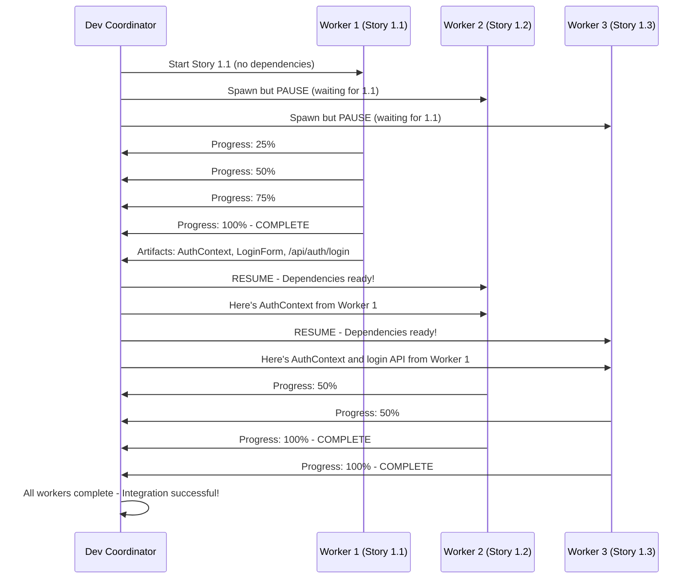

<!-- Powered by BMAD™ Core -->

# Dependency Management in Parallel Sub-Agent Execution

## 🎯 The Problem You're Asking About

**Question:** "What happens when there are story dependencies or one story is expecting code another agent hasn't finished yet?"

**Answer:** The dev-coordinator automatically detects dependencies, creates an execution plan, and manages worker coordination to ensure dependent stories wait for their prerequisites.

---

## 🔍 How It Works

### Phase 1: Dependency Detection (Automatic)

When you run `/implement 1.1,1.2,1.3 --parallel`, the dev-coordinator **automatically analyzes dependencies** before spawning any workers:

```yaml
# The coordinator analyzes:
Story 1.1: User Login Page
  - Creates: LoginForm component
  - Creates: /api/auth/login endpoint
  - Creates: AuthContext
  - Dependencies: NONE

Story 1.2: User Registration Page
  - Uses: AuthContext (from 1.1)
  - Creates: RegisterForm component
  - Creates: /api/auth/register endpoint
  - Dependencies: Story 1.1 (needs AuthContext)

Story 1.3: Password Reset
  - Uses: AuthContext (from 1.1)
  - Uses: /api/auth/login (from 1.1)
  - Creates: PasswordResetForm component
  - Dependencies: Story 1.1 (needs AuthContext and login API)
```

**Result:** The coordinator builds a dependency graph:
```
1.1 (no deps) ──┬──> 1.2 (depends on 1.1)
                └──> 1.3 (depends on 1.1)
```

---

### Phase 2: Execution Planning (Automatic)

The coordinator creates an optimal execution plan:

```yaml
Execution Plan:
  Wave 1 (Start Immediately):
    - Worker-1: Story 1.1

  Wave 2 (Wait for Wave 1):
    - Worker-2: Story 1.2 (blocked until 1.1 completes)
    - Worker-3: Story 1.3 (blocked until 1.1 completes)
```

**Key Point:** Workers are spawned but **paused** if they have dependencies.

---

### Phase 3: Coordinated Execution (Automatic)



---

## 📊 Real-World Example

### Scenario: Authentication Epic (8 Stories)

```bash
/implement 1.1,1.2,1.3,1.4,1.5,1.6,1.7,1.8 --parallel
```

**Stories:**
1. **1.1** - Login Page (no deps)
2. **1.2** - Registration Page (depends on 1.1 - AuthContext)
3. **1.3** - Password Reset (depends on 1.1 - AuthContext)
4. **1.4** - Profile Page (depends on 1.1 - AuthContext)
5. **1.5** - Email Verification (depends on 1.2 - registration flow)
6. **1.6** - Two-Factor Auth (depends on 1.1 - login flow)
7. **1.7** - Session Management (depends on 1.1 - auth system)
8. **1.8** - Logout (depends on 1.1 - auth system)

**Dependency Graph:**
```
1.1 ──┬──> 1.2 ──> 1.5
      ├──> 1.3
      ├──> 1.4
      ├──> 1.6
      ├──> 1.7
      └──> 1.8
```

**Execution Plan:**
```yaml
Wave 1 (Minute 0):
  - Worker-1: Story 1.1 (start immediately)

Wave 2 (Minute 6 - after 1.1 completes):
  - Worker-2: Story 1.2 (resume)
  - Worker-3: Story 1.3 (resume)
  - Worker-4: Story 1.4 (resume)
  - Worker-5: Story 1.6 (resume)
  - Worker-6: Story 1.7 (resume)
  - Worker-7: Story 1.8 (resume)

Wave 3 (Minute 12 - after 1.2 completes):
  - Worker-8: Story 1.5 (resume)
```

**Timeline:**
```
Minute 0-6:   Worker-1 implements Story 1.1
Minute 6-12:  Workers 2-7 implement Stories 1.2, 1.3, 1.4, 1.6, 1.7, 1.8 (6 in parallel!)
Minute 12-18: Worker-8 implements Story 1.5


---

## 🛡️ Conflict Resolution Strategies

### 1. File Conflicts

**Scenario:** Two stories modify the same file

```yaml
Story 1.1: Creates AuthContext.tsx
Story 1.2: Adds method to AuthContext.tsx
```

**Resolution:**
```
✅ Auto-Resolution: Non-overlapping changes
  - Worker 1 creates file
  - Worker 2 waits for Worker 1
  - Worker 2 adds to existing file

⚠️  Escalation: Overlapping changes
  - Both workers modify same function
  - Coordinator pauses Worker 2
  - User chooses: merge, reorder, or manual resolution
```

---

### 2. Dependency Conflicts

**Scenario:** Story needs output from another story

```yaml
Story 1.3: Needs AuthContext from Story 1.1
```

**Resolution:**
```
✅ Auto-Resolution: Pause and Resume
  - Worker 3 spawned but paused
  - Worker 1 completes and provides AuthContext
  - Coordinator passes AuthContext to Worker 3
  - Worker 3 resumes with dependency satisfied
```

---

### 3. Resource Conflicts

**Scenario:** Multiple stories need exclusive access

```yaml
Story 1.1: Modifies database schema
Story 1.2: Modifies same database schema
```

**Resolution:**
```
✅ Auto-Resolution: Queue
  - Worker 1 gets exclusive lock
  - Worker 2 queued
  - Worker 1 completes and releases lock
  - Worker 2 acquires lock and proceeds
```

---

### 4. Circular Dependencies

**Scenario:** Stories depend on each other

```yaml
Story 1.1: Depends on Story 1.2
Story 1.2: Depends on Story 1.1
```

**Resolution:**
```
❌ Error: Circular dependency detected
  - Coordinator detects cycle during planning
  - Execution halted before spawning workers
  - User notified with dependency graph
  - User must resolve by splitting or reordering stories
```

---

## 📋 State Management

### Worker State File

Each worker maintains state in `.bmad-state/workers/dev-worker-{id}.yaml`:

```yaml
worker_id: dev-worker-2
status: paused
assigned_task: story-1.2
created_at: 2025-12-21T10:00:00Z
updated_at: 2025-12-21T10:05:00Z

progress:
  percentage: 0
  current_step: waiting_for_dependencies

dependencies:
  - story: 1.1
    status: in_progress
    required_artifacts:
      - src/contexts/AuthContext.tsx
    received_artifacts: []

blockers:
  - type: dependency
    description: "Waiting for Story 1.1 to complete"
    blocking_since: 2025-12-21T10:00:00Z
    estimated_unblock: 2025-12-21T10:06:00Z

artifacts_created: []
tests_written: []
```

### Coordinator State File

The coordinator tracks all workers in `.bmad-state/coordinators/dev-coordinator.yaml`:

```yaml
coordinator_id: dev-coordinator-1
status: active
created_at: 2025-12-21T10:00:00Z

workers:
  - id: dev-worker-1
    status: in_progress
    assigned_task: story-1.1
    progress: 75%
    dependencies: []

  - id: dev-worker-2
    status: paused
    assigned_task: story-1.2
    progress: 0%
    dependencies: [story-1.1]
    blocker: "Waiting for AuthContext from story-1.1"

  - id: dev-worker-3
    status: paused
    assigned_task: story-1.3
    progress: 0%
    dependencies: [story-1.1]
    blocker: "Waiting for AuthContext from story-1.1"

dependency_graph:
  1.1: []
  1.2: [1.1]
  1.3: [1.1]

execution_plan:
  wave_1: [1.1]
  wave_2: [1.2, 1.3]

conflicts: []
completed_tasks: []
pending_tasks: [1.1, 1.2, 1.3]
```

---

## 🎯 Best Practices

### 1. Declare Dependencies Explicitly

**In your story file:**
```markdown
## Story 1.2: User Registration

### Dependencies
- Story 1.1 (requires AuthContext)

### Technical Notes
- Uses AuthContext from Story 1.1
- Follows same auth pattern as login
```

**Why:** Helps coordinator plan execution optimally

---

### 2. Minimize Dependencies

**Good:**
```yaml
Epic: User Authentication
  1.1: Login (no deps)
  1.2: Registration (no deps)
  1.3: Profile (depends on 1.1)
  1.4: Logout (depends on 1.1)
```

**Better:**
```yaml
Epic: User Authentication
  1.1: Auth Core (shared context)
  1.2: Login (depends on 1.1)
  1.3: Registration (depends on 1.1)
  1.4: Profile (depends on 1.1)
  1.5: Logout (depends on 1.1)
```

**Why:** First approach has 2 independent stories (1.1, 1.2) that can start immediately. Second approach has only 1, creating a bottleneck.

---

### 3. Use Shared Foundation Stories

**Pattern:**
```yaml
Story 0.1: Auth Foundation
  - Creates AuthContext
  - Creates base types
  - Creates API client
  - No UI, just infrastructure

Story 1.1: Login (depends on 0.1)
Story 1.2: Registration (depends on 0.1)
Story 1.3: Profile (depends on 0.1)
```

**Why:** One small foundation story unblocks many parallel stories

---

### 4. Review Dependency Graph Before Execution

The coordinator shows you the plan:

```
📋 Execution Plan:
  Wave 1: Story 0.1 (6 min)
  Wave 2: Stories 1.1, 1.2, 1.3 (6 min in parallel)

  Total: 12 minutes
  Sequential: 24 minutes
  Speedup: 2x

Proceed? (y/n)
```

**Why:** Catch dependency issues before wasting time

---

## ⚡ Performance Impact

### Scenario 1: No Dependencies (Best Case)

```yaml
Stories: 1.1, 1.2, 1.3 (all independent)
Workers: 3 (all start immediately)
Time: 6 minutes (vs 18 sequential)
Speedup: 3x
```

### Scenario 2: Linear Dependencies (Worst Case)

```yaml
Stories: 1.1 → 1.2 → 1.3 (each depends on previous)
Workers: 3 (but execute sequentially)
Time: 18 minutes (same as sequential)
Speedup: 1x (no benefit from parallelization)
```

### Scenario 3: Tree Dependencies (Typical Case)

```yaml
Stories: 1.1 → [1.2, 1.3, 1.4] (1.1 unblocks 3 stories)
Workers: 4
Time: 12 minutes (vs 24 sequential)
Speedup: 2x
```

### Scenario 4: Complex Graph (Real-World)

```yaml
Stories:
  1.1 → [1.2, 1.3, 1.4]
  1.2 → 1.5

Workers: 5
Wave 1: 1.1 (6 min)
Wave 2: 1.2, 1.3, 1.4 (6 min in parallel)
Wave 3: 1.5 (6 min)
Time: 18 minutes (vs 30 sequential)
Speedup: 1.7x
```

---

## 🔍 Monitoring and Visibility

### Real-Time Dashboard

```
🚀 Dev Coordinator: Parallel Development
⏱️  Elapsed: 6 minutes

┌─────────────────────────────────────────────────────────┐
│ Worker Status                                           │
├─────────────────────────────────────────────────────────┤
│ [Worker 1] Story 1.1 ████████████████████ 100% ✅       │
│ [Worker 2] Story 1.2 ░░░░░░░░░░░░░░░░░░░░   0% ⏸️       │
│ [Worker 3] Story 1.3 ░░░░░░░░░░░░░░░░░░░░   0% ⏸️       │
└─────────────────────────────────────────────────────────┘

📊 Progress:
  Completed: 1/3 stories
  In Progress: 0/3 stories
  Paused: 2/3 stories (waiting for dependencies)

🔓 Unblocking:
  Story 1.2 will resume in ~10 seconds
  Story 1.3 will resume in ~10 seconds

⏱️  Estimated completion: 4 minutes remaining
```

### After Unblocking

```
🚀 Dev Coordinator: Parallel Development
⏱️  Elapsed: 8 minutes

┌─────────────────────────────────────────────────────────┐
│ Worker Status                                           │
├─────────────────────────────────────────────────────────┤
│ [Worker 1] Story 1.1 ████████████████████ 100% ✅       │
│ [Worker 2] Story 1.2 ██████░░░░░░░░░░░░░░  30% 🚀       │
│ [Worker 3] Story 1.3 ████░░░░░░░░░░░░░░░░  20% 🚀       │
└─────────────────────────────────────────────────────────┘

📊 Progress:
  Completed: 1/3 stories
  In Progress: 2/3 stories
  Paused: 0/3 stories

⏱️  Estimated completion: 3 minutes remaining
```

---

## 🎓 Summary

### The Answer to Your Question

**Q:** "What happens when there are story dependencies or one story is expecting code another agent hasn't finished yet?"

**A:**
1. ✅ **Automatic Detection** - Coordinator analyzes dependencies before execution
2. ✅ **Smart Planning** - Creates execution plan with waves
3. ✅ **Pause & Resume** - Dependent workers wait, then resume when ready
4. ✅ **Artifact Passing** - Completed work is passed to dependent workers
5. ✅ **Conflict Resolution** - Handles file conflicts, resource conflicts, etc.
6. ✅ **Real-Time Monitoring** - You see exactly what's happening
7. ✅ **Optimal Performance** - Still faster than sequential even with dependencies

### Key Takeaways

- 🎯 **You don't need to worry about it** - The system handles it automatically
- 🎯 **Dependencies are detected** - From story files, code analysis, and file paths
- 🎯 **Workers are coordinated** - Paused when blocked, resumed when ready
- 🎯 **You stay informed** - Real-time dashboard shows status
- 🎯 **Still faster** - Even with dependencies, parallel execution saves time

### When to Use Parallel Execution

✅ **Good for parallel:**
- Stories with minimal dependencies
- Stories that share a common foundation
- Stories working on different parts of the system

⚠️ **Less benefit from parallel:**
- Stories with linear dependencies (1→2→3→4)
- Stories that all modify the same files
- Stories with circular dependencies (will error)

### Try It!

```bash
# The system handles dependencies automatically
/implement 1.1,1.2,1.3 --parallel

# You'll see the dependency analysis and execution plan
# Then watch as workers coordinate automatically
```

**Trust the coordinator - it's got your back!** 🚀

---

## 🚨 What You'll See

### When Dependencies Are Detected

```
🚀 Dev Coordinator: Parallel development initiated
📊 Analyzing dependencies...

⚠️  Dependencies detected:
  - Story 1.2 depends on Story 1.1 (AuthContext)
  - Story 1.3 depends on Story 1.1 (AuthContext)
  - Story 1.5 depends on Story 1.2 (registration flow)

📋 Execution Plan:
  Wave 1: Story 1.1 (start immediately)
  Wave 2: Stories 1.2, 1.3, 1.4, 1.6, 1.7, 1.8 (wait for 1.1)
  Wave 3: Story 1.5 (wait for 1.2)

✅ Plan validated - no circular dependencies
✅ Spawning 8 workers...

[Worker 1] Story 1.1 - Status: IN_PROGRESS
[Worker 2] Story 1.2 - Status: PAUSED (waiting for 1.1)
[Worker 3] Story 1.3 - Status: PAUSED (waiting for 1.1)
[Worker 4] Story 1.4 - Status: PAUSED (waiting for 1.1)
[Worker 5] Story 1.6 - Status: PAUSED (waiting for 1.1)
[Worker 6] Story 1.7 - Status: PAUSED (waiting for 1.1)
[Worker 7] Story 1.8 - Status: PAUSED (waiting for 1.1)
[Worker 8] Story 1.5 - Status: PAUSED (waiting for 1.2)
```

### When Dependencies Are Satisfied

```
⏱️  6 minutes elapsed...

[Worker 1] Story 1.1 - Status: COMPLETE ✅
  Artifacts created:
    - src/components/LoginForm/index.tsx
    - src/contexts/AuthContext.tsx
    - apps/api/auth/login.ts

🔓 Unblocking dependent workers...

[Worker 2] Story 1.2 - Status: RESUMING (dependencies ready)
  Received artifacts: AuthContext.tsx
[Worker 3] Story 1.3 - Status: RESUMING (dependencies ready)
  Received artifacts: AuthContext.tsx
[Worker 4] Story 1.4 - Status: RESUMING (dependencies ready)
  Received artifacts: AuthContext.tsx
[Worker 5] Story 1.6 - Status: RESUMING (dependencies ready)
  Received artifacts: AuthContext.tsx, login.ts
[Worker 6] Story 1.7 - Status: RESUMING (dependencies ready)
  Received artifacts: AuthContext.tsx
[Worker 7] Story 1.8 - Status: RESUMING (dependencies ready)
  Received artifacts: AuthContext.tsx

🚀 6 workers now executing in parallel!
```

---

## 🔧 How Dependencies Are Detected

The coordinator analyzes multiple sources:

### 1. Story File Analysis
```markdown
## Story 1.2: User Registration

### Dependencies
- Story 1.1 (requires AuthContext)

### Technical Notes
- Uses AuthContext from Story 1.1
- Follows same auth pattern as login
```

### 2. Code Analysis
```typescript
// The coordinator scans for imports/references
import { AuthContext } from '@/contexts/AuthContext' // From Story 1.1
import { loginUser } from '@/api/auth/login'         // From Story 1.1
```

### 3. File Path Analysis
```yaml
Story 1.1 creates:
  - src/contexts/AuthContext.tsx

Story 1.2 modifies:
  - src/contexts/AuthContext.tsx  # CONFLICT DETECTED!
```


