```mermaid
sequenceDiagram
    participant You
    participant Dev as Dev Agent
    participant Story as Story File
    participant Code as Codebase
    participant Tests as Test Suite

    You->>Dev: @dev *develop-story story=1.1
    Dev->>Story: Read story 1.1
    Story-->>Dev: Requirements & acceptance criteria

    Note over Dev: Implementation Phase (15 min)

    Dev->>Dev: Plan implementation
    Dev->>Code: Create LoginForm component
    Dev->>Code: Create login API endpoint
    Dev->>Tests: Write unit tests
    Dev->>Tests: Write integration tests

    Dev->>Tests: Run tests
    Tests-->>Dev: ✅ All tests pass

    Dev->>Code: Run lint
    Code-->>Dev: ✅ No errors

    Dev->>Code: Run type-check
    Code-->>Dev: ✅ No errors

    Dev->>Story: Update story with implementation notes
    Dev-->>You: ✅ Story 1.1 implemented
```

<!-- Powered by BMAD™ Core -->

# How to Start Work on a New Story

**A complete guide from story creation to production deployment using BMAD agents**

---

## 📋 Table of Contents

1. [Overview](#overview)
2. [Prerequisites](#prerequisites)
3. [The Complete Journey](#the-complete-journey)
4. [Step-by-Step Walkthrough](#step-by-step-walkthrough)
5. [What Happens Behind the Scenes](#what-happens-behind-the-scenes)
6. [Common Scenarios](#common-scenarios)
7. [Troubleshooting](#troubleshooting)

---

## Overview

This guide walks you through the **complete lifecycle** of implementing a user story using BMAD agents, from initial story creation to production deployment.

### The Journey at a Glance

```mermaid
graph LR
    A[📝 Story Creation] --> B[🔨 Development]
    B --> C[✅ Quality Assurance]
    C --> D[🚀 Deployment]

    style A fill:#e3f2fd
    style B fill:#fff3e0
    style C fill:#f3e5f5
    style D fill:#e8f5e9
```



**Estimated Time:** 20-30 minutes per story (with sub-agents)

---

## Prerequisites

Before you start, ensure you have:

- [ ] Access to BMAD agents (`@sm`, `@dev`, `@qa`)
- [ ] Story number assigned (e.g., `1.1`, `2.3`)
- [ ] Epic context (if part of larger feature)
- [ ] Development environment set up
- [ ] Git repository access

---

## The Complete Journey

### Phase 1: Story Creation (5 minutes)
**Agent:** Story Manager (`@sm`)
**Output:** Complete user story with acceptance criteria

### Phase 2: Development (15 minutes)
**Agent:** Developer (`@dev`)
**Output:** Working code, tests, documentation

### Phase 3: Quality Assurance (10 minutes)
**Agent:** QA (`@qa`)
**Output:** Quality report, deployment decision

### Phase 4: Deployment (5 minutes)
**Agent:** Developer (`@dev`)
**Output:** Code in production

---

## Step-by-Step Walkthrough

Let's walk through implementing **Story 1.1: User Login Page**

### Step 1: Create the Story

**What you do:**
```bash
@sm
*draft story=1.1
```

**What the SM Agent does:**


**What you get:**

A complete story file at `.bmad-stories/1.1-user-login.md`:

```markdown
# Story 1.1: User Login Page

## Story Statement
As a user
I want to log in to my account
So that I can access personalized features

## Acceptance Criteria
- [ ] Login form with email and password fields
- [ ] Form validation (email format, required fields)
- [ ] Submit button calls authentication API
- [ ] Success redirects to dashboard
- [ ] Error displays user-friendly message
- [ ] Keyboard accessible (tab navigation)
- [ ] Screen reader compatible
- [ ] Secure password handling (no plaintext)

## Technical Context
- **Frontend:** React 19, shadcn/ui components
- **Backend:** AWS Lambda, API Gateway
- **Auth:** JWT tokens, bcrypt password hashing
- **Validation:** Zod schemas
- **Files to create:**
  - `apps/web/main-app/src/components/LoginForm/index.tsx`
  - `apps/api/auth/login.ts`
  - `apps/web/main-app/src/components/LoginForm/__tests__/LoginForm.test.tsx`

## Test Strategy
- Unit tests for form validation
- Integration tests for API calls
- E2E tests for complete login flow
- Accessibility tests (keyboard, screen reader)
```

**Time:** ~5 minutes

---


### Step 2: Review and Approve the Story

**What you do:**
```bash
# Review the story file
cat .bmad-stories/1.1-user-login.md

# If changes needed, ask SM to revise
@sm
Can you add "Remember me" functionality to story 1.1?

# Once satisfied, approve it
@sm
*approve story=1.1
```

**What happens:**
- SM updates the story file with your feedback
- Story status changes to "Approved"
- Story is ready for development

**Time:** ~2 minutes

---

### Step 3: Implement the Story (Traditional Way)

**Option A: Traditional Single-Agent Development**

**What you do:**
```bash
@dev
*develop-story story=1.1
```

**What the Dev Agent does:**



**What you get:**
- ✅ `LoginForm/index.tsx` - React component
- ✅ `auth/login.ts` - API endpoint
- ✅ `LoginForm.test.tsx` - Tests
- ✅ All tests passing
- ✅ Lint and type-check passing

**Time:** ~15 minutes

---

### Step 3 Alternative: Parallel Development with Sub-Agents

**Option B: Parallel Sub-Agent Development (3x faster!)**

**What you do:**
```bash
@dev
*parallel-develop stories=[1.1]
```

**What happens:**


**Real-time progress updates:**
```
🚀 Dev Coordinator: Parallel development initiated
📊 Spawning 3 workers for story 1.1...

[Worker 1] Frontend Component - Progress: 0%
[Worker 2] Backend API - Progress: 0%
[Worker 3] Tests - Progress: 0%

⏱️  2 minutes elapsed...
[Worker 1] Frontend Component - Progress: 50% (validation complete)
[Worker 2] Backend API - Progress: 60% (JWT auth implemented)
[Worker 3] Tests - Progress: 40% (unit tests written)

⏱️  5 minutes elapsed...
[Worker 1] Frontend Component - Progress: 100% ✅
[Worker 2] Backend API - Progress: 100% ✅
[Worker 3] Tests - Progress: 100% ✅

🔄 Integration phase...
✅ All workers complete
✅ Integration successful
✅ Tests passing (45 tests, 92% coverage)
✅ Lint passing
✅ Type-check passing

✨ Story 1.1 complete in 6 minutes!
```

**Time:** ~6 minutes (vs 15 minutes traditional)

---

### Step 4: Quality Assurance

**What you do:**
```bash
@qa
*deep-review target=auth/login
```

**What the QA Coordinator does:**

```mermaid
graph TB
    You[You: *deep-review] --> QACoord[QA Coordinator]

    QACoord --> Identify[Identify Files:<br/>LoginForm.tsx<br/>login.ts<br/>tests]

    Identify --> Spawn{Spawn<br/>Specialists}

    Spawn --> S1[Security<br/>Specialist]
    Spawn --> S2[Performance<br/>Specialist]
    Spawn --> S3[Accessibility<br/>Specialist]

    S1 --> |3 min| R1[Security Analysis:<br/>✅ Password hashing<br/>✅ JWT secure<br/>⚠️ Add rate limiting]

    S2 --> |3 min| R2[Performance Analysis:<br/>✅ Bundle size OK<br/>✅ API fast<br/>💡 Add loading state]

    S3 --> |3 min| R3[Accessibility Analysis:<br/>✅ Keyboard nav<br/>✅ ARIA labels<br/>⚠️ Error announcements]

    R1 --> Aggregate[Aggregate Findings]
    R2 --> Aggregate
    R3 --> Aggregate

    Aggregate --> Decision{Deployment<br/>Decision}

    Decision --> Approved[✅ APPROVED<br/>WITH CONCERNS]

    style S1 fill:#ffccbc
    style S2 fill:#ffccbc
    style S3 fill:#ffccbc
    style Approved fill:#fff9c4
```



**What you get:**

```markdown
═══════════════════════════════════════════════════════════
DEEP REVIEW REPORT: Story 1.1 - User Login Page
═══════════════════════════════════════════════════════════

DEPLOYMENT DECISION: ✅ APPROVED WITH CONCERNS

FINDINGS SUMMARY:
Critical: 0
High: 2
Medium: 3
Low: 0

HIGH PRIORITY (Fix before production):
1. [SEC-001] Add rate limiting to prevent brute force
2. [A11Y-001] Add aria-live region for error announcements

MEDIUM PRIORITY (Fix soon):
1. [SEC-002] Add password strength indicator
2. [PERF-001] Add loading state during submission
3. [A11Y-002] Improve focus management

RECOMMENDATION:
✅ Code is production-ready after fixing 2 high-priority issues
⏱️  Estimated fix time: 30 minutes
```

**Time:** ~8 minutes

---

### Step 5: Fix Issues (If Needed)

**What you do:**
```bash
@dev
*auto-fix issues=[SEC-001,A11Y-001]
```

**What happens:**
- Dev coordinator spawns 2 workers
- Worker 1 adds rate limiting middleware
- Worker 2 adds aria-live error announcements
- Both work in parallel
- Integration and testing automatic

**Time:** ~5 minutes

---

### Step 6: Final Review and Approval

**What you do:**
```bash
# Re-run deep review
@qa
*deep-review target=auth/login

# If all clear, approve for deployment
@qa
*approve-pr story=1.1
```

**What you get:**
```markdown
═══════════════════════════════════════════════════════════
FINAL REVIEW REPORT: Story 1.1
═══════════════════════════════════════════════════════════

DEPLOYMENT DECISION: ✅ APPROVED FOR PRODUCTION

FINDINGS SUMMARY:
Critical: 0
High: 0
Medium: 3
Low: 0

✅ All critical and high-priority issues resolved
✅ Tests passing (48 tests, 94% coverage)
✅ Security validated
✅ Performance validated
✅ Accessibility validated

🚀 READY FOR DEPLOYMENT
```

**Time:** ~3 minutes

---

### Step 7: Create Pull Request and Deploy

**What you do:**
```bash
@dev
*create-pr story=1.1
```

**What the Dev Agent does:**
1. Creates feature branch `feature/1.1-user-login`
2. Commits all changes
3. Pushes to remote
4. Creates PR with:
   - Story description
   - Implementation notes
   - Test results
   - QA approval
   - Screenshots (if applicable)

**What you get:**
```markdown
Pull Request #42: Story 1.1 - User Login Page

## Story
As a user, I want to log in to my account so that I can access personalized features

## Implementation
- ✅ LoginForm component with email/password fields
- ✅ JWT authentication API endpoint
- ✅ Form validation with Zod
- ✅ Comprehensive test coverage (94%)
- ✅ Accessibility compliant (WCAG 2.1 AA)
- ✅ Security hardened (rate limiting, bcrypt)

## Quality Assurance
✅ Deep review passed
✅ Security validated
✅ Performance validated
✅ Accessibility validated

## Test Results
48 tests passing
94% code coverage
0 lint errors
0 type errors

Ready to merge and deploy! 🚀
```

**Time:** ~2 minutes

---


## What Happens Behind the Scenes

### Complete End-to-End Flow

```mermaid
graph TB
    Start([You: Start Story 1.1]) --> SM[SM Agent]

    SM -->|*draft| Story[Story File Created]
    Story -->|Review| Approve{Approved?}

    Approve -->|No| SM
    Approve -->|Yes| DevChoice{Choose Method}

    DevChoice -->|Traditional| DevSingle[Dev Agent<br/>*develop-story]
    DevChoice -->|Parallel| DevCoord[Dev Coordinator<br/>*parallel-develop]

    DevSingle --> |15 min| Code1[Code Complete]

    DevCoord --> W1[Worker 1]
    DevCoord --> W2[Worker 2]
    DevCoord --> W3[Worker 3]

    W1 --> |5 min| Code2[Code Complete]
    W2 --> |5 min| Code2
    W3 --> |5 min| Code2

    Code1 --> QA[QA Coordinator<br/>*deep-review]
    Code2 --> QA

    QA --> S1[Security Specialist]
    QA --> S2[Performance Specialist]
    QA --> S3[Accessibility Specialist]

    S1 --> |3 min| Report[Aggregated Report]
    S2 --> |3 min| Report
    S3 --> |3 min| Report

    Report --> Issues{Issues Found?}

    Issues -->|Yes| Fix[Dev Coordinator<br/>*auto-fix]
    Issues -->|No| Final[Final Approval]

    Fix --> |5 min| QA2[Re-review]
    QA2 --> Final

    Final --> PR[Create PR<br/>*create-pr]
    PR --> Merge[Merge to Main]
    Merge --> Deploy[🚀 Deploy to Production]

    style Start fill:#e3f2fd
    style Story fill:#fff3e0
    style Code2 fill:#e8f5e9
    style Report fill:#f3e5f5
    style Deploy fill:#c8e6c9
    style W1 fill:#bbdefb
    style W2 fill:#bbdefb
    style W3 fill:#bbdefb
    style S1 fill:#ffccbc
    style S2 fill:#ffccbc
    style S3 fill:#ffccbc
```



### File System Changes

**Before you start:**
```
.bmad-stories/
  (empty)

apps/web/main-app/src/components/
  (no LoginForm)

apps/api/auth/
  (no login.ts)
```

**After Step 1 (Story Creation):**
```
.bmad-stories/
  1.1-user-login.md ✅ (new)
```

**After Step 3 (Development):**
```
.bmad-stories/
  1.1-user-login.md (updated with implementation notes)

apps/web/main-app/src/components/
  LoginForm/
    index.tsx ✅ (new)
    __tests__/
      LoginForm.test.tsx ✅ (new)
    __types__/
      index.ts ✅ (new)

apps/api/auth/
  login.ts ✅ (new)
  __tests__/
    login.test.ts ✅ (new)
```

**After Step 5 (Fixes):**
```
apps/api/auth/
  middleware/
    rateLimiter.ts ✅ (new)
  login.ts (updated with rate limiting)

apps/web/main-app/src/components/
  LoginForm/
    index.tsx (updated with aria-live)
```

**After Step 7 (PR Created):**
```
Git branches:
  main
  feature/1.1-user-login ✅ (new)

GitHub:
  Pull Request #42 ✅ (new)
```

---

## Common Scenarios

### Scenario 1: Simple Feature (Single Story)

**Example:** Add a "Forgot Password" link

```bash
# 1. Create story
@sm
*draft story=1.2

# 2. Implement (traditional is fine for simple features)
@dev
*develop-story story=1.2

# 3. Quick review
@qa
*review story=1.2

# 4. Create PR
@dev
*create-pr story=1.2
```

**Total Time:** ~15 minutes

---

### Scenario 2: Complex Feature (Multiple Components)

**Example:** Complete login page with validation, API, tests

```bash
# 1. Create story
@sm
*draft story=1.1

# 2. Parallel implementation (faster!)
@dev
*parallel-develop stories=[1.1]

# 3. Deep review (comprehensive)
@qa
*deep-review target=auth/login

# 4. Fix issues in parallel
@dev
*auto-fix issues=[SEC-001,A11Y-001]

# 5. Final review
@qa
*deep-review target=auth/login

# 6. Create PR
@dev
*create-pr story=1.1
```

**Total Time:** ~25 minutes

---

### Scenario 3: Multiple Related Stories (Epic)

**Example:** Complete authentication system (8 stories)

```bash
# 1. Explode epic into stories
@sm
*explode-epic epic=user-authentication

# Result: Creates stories 1.1 through 1.8

# 2. Implement all stories in parallel
@dev
*parallel-develop stories=[1.1,1.2,1.3,1.4,1.5,1.6,1.7,1.8]

# 3. Deep review entire system
@qa
*deep-review target=auth

# 4. Fix any issues
@dev
*auto-fix issues=[list-of-issues]

# 5. Create PRs for all stories
@dev
*batch-pr stories=[1.1,1.2,1.3,1.4,1.5,1.6,1.7,1.8]
```

**Total Time:** ~80 minutes (vs 640 minutes sequential = 8x faster!)

---

### Scenario 4: Bug Fix

**Example:** Fix login error handling

```bash
# 1. Create bug story
@sm
*draft story=bug-42

# 2. Implement fix
@dev
*develop-story story=bug-42

# 3. Verify fix
@qa
*review story=bug-42

# 4. Create PR
@dev
*create-pr story=bug-42
```

**Total Time:** ~10 minutes

---

### Scenario 5: Refactoring

**Example:** Refactor authentication system

```bash
# 1. Create refactoring story
@sm
*draft story=refactor-auth

# 2. Multi-specialist analysis first
@dev
*swarm-refactor target=auth-system

# Result: Security, performance, architecture specialists analyze

# 3. Implement refactoring based on recommendations
@dev
*develop-story story=refactor-auth

# 4. Deep review
@qa
*deep-review target=auth

# 5. Create PR
@dev
*create-pr story=refactor-auth
```

**Total Time:** ~45 minutes

---

## Quick Reference: Commands by Phase

### Phase 1: Story Creation
```bash
@sm
*draft story=X.X              # Create new story
*approve story=X.X            # Approve story for development
*explode-epic epic=name       # Create all epic stories in parallel
```

### Phase 2: Development
```bash
@dev
*develop-story story=X.X      # Traditional single-agent development
*parallel-develop stories=[X.X,Y.Y]  # Parallel sub-agent development
*auto-fix issues=[issue-1,issue-2]   # Fix issues in parallel
*swarm-refactor target=system        # Multi-specialist refactoring analysis
```

### Phase 3: Quality Assurance
```bash
@qa
*review story=X.X             # Quick review
*deep-review target=system    # Multi-specialist comprehensive review
*approve-pr story=X.X         # Approve for deployment
*gate story=X.X               # Check quality gates
```

### Phase 4: Deployment
```bash
@dev
*create-pr story=X.X          # Create pull request
*batch-pr stories=[X.X,Y.Y]   # Create multiple PRs
```

---

## Time Comparison

### Traditional Sequential Approach

| Phase | Time |
|-------|------|
| Story Creation | 5 min |
| Development | 15 min |
| QA Review | 10 min |
| Fix Issues | 10 min |
| Re-review | 5 min |
| Create PR | 2 min |
| **TOTAL** | **47 min** |

### Sub-Agent Parallel Approach

| Phase | Time |
|-------|------|
| Story Creation | 5 min |
| Parallel Development | 6 min |
| Deep Review (parallel) | 8 min |
| Parallel Fixes | 5 min |
| Re-review | 3 min |
| Create PR | 2 min |
| **TOTAL** | **29 min** |

**Speedup: 1.6x faster for single story**
**Speedup: 8-10x faster for multiple stories!**

---

## Troubleshooting

### Problem: Story creation fails

**Symptoms:**
```
❌ Error: Epic context not found
```

**Solution:**
```bash
# Ensure epic is defined in sharded PRD
@sm
Can you help me define the epic first?
```

---

### Problem: Development gets stuck

**Symptoms:**
```
⚠️ Worker 2 blocked: Missing dependency
```

**Solution:**
```bash
# Check worker status
@dev
*monitor

# Manually resolve blocker
@dev
Can you help Worker 2 with the dependency issue?
```

---

### Problem: Tests failing

**Symptoms:**
```
❌ 5 tests failing
```

**Solution:**
```bash
# Review test failures
@dev
*review-tests story=1.1

# Fix tests
@dev
Can you fix the failing tests for story 1.1?
```

---

### Problem: QA finds critical issues

**Symptoms:**
```
🚨 CRITICAL: SQL injection vulnerability
```

**Solution:**
```bash
# Fix critical issues immediately
@dev
*auto-fix issues=[CRITICAL-001]

# Re-run deep review
@qa
*deep-review target=affected-area
```

---

### Problem: Merge conflicts

**Symptoms:**
```
❌ Merge conflict in LoginForm.tsx
```

**Solution:**
```bash
# Dev agent can help resolve
@dev
*resolve-conflicts story=1.1
```

---

## Best Practices

### ✅ Do This

1. **Always create story first** - Don't start coding without a story
2. **Use parallel development for complex features** - 3x faster
3. **Run deep review before deployment** - Catches issues early
4. **Fix high-priority issues immediately** - Don't deploy with critical issues
5. **Keep stories small** - 15-30 minutes of work ideal
6. **Write clear acceptance criteria** - Helps agents understand requirements

### ❌ Avoid This

1. **Don't skip QA review** - Quality issues are expensive later
2. **Don't implement without approval** - Story might change
3. **Don't ignore medium-priority issues** - They accumulate
4. **Don't make stories too large** - Hard to parallelize
5. **Don't skip tests** - Quality gates will fail
6. **Don't deploy without approval** - QA must sign off

---

## Summary: Your Story Journey


**Total Time: 30 minutes from idea to production!**

---

## Next Steps

Now that you understand the complete story workflow, try it yourself:

1. **Start with a simple story** - Practice the basic flow
2. **Try parallel development** - Experience the speed boost
3. **Use deep review** - See comprehensive quality analysis
4. **Build an epic** - Implement multiple stories in parallel

**Ready to start your first story?** 🚀

```bash
@sm
*draft story=1.1
```

---

## Additional Resources

- **Sub-Agent Architecture:** `.bmad-core/data/sub-agent-architecture.md`
- **Usage Guide:** `.bmad-core/data/sub-agent-usage-guide.md`
- **Quick Reference:** `.bmad-core/data/sub-agent-quick-reference.md`
- **Walkthrough Example:** `.bmad-core/data/sub-agent-walkthrough.md`
- **Agent Definitions:** `.bmad-core/agents/`
- **Workflows:** `.bmad-core/workflows/`
