<!-- Powered by BMAD™ Core -->

# Sub-Agent System Walkthrough: Building a Login Page

This guide walks through using the BMAD sub-agent system to implement a new login page feature, demonstrating the power of parallel execution and multi-specialist analysis.

## 📖 Scenario

**Epic:** User Authentication
**Story 2.1:** Implement Login Page
**Goal:** Create a secure, accessible, performant login page using sub-agents

---

## 🎯 The Traditional Sequential Approach


**Total Time: ~80 minutes**

---

## ⚡ The Sub-Agent Parallel Approach


**Total Time: ~25 minutes (3.2x faster!)**

---

## 🚀 Step-by-Step Walkthrough

### Step 1: Create the Story (Traditional)

First, let's create the story using the SM agent:

```bash
@sm
*draft story=2.1
```

**SM Agent creates:**

```yaml
Story: 2.1 - Implement Login Page

As a user
I want to log in to my account
So that I can access personalized features

Acceptance Criteria:
- [ ] Login form with email and password fields
- [ ] Form validation (email format, required fields)
- [ ] Submit button calls authentication API
- [ ] Success redirects to dashboard
- [ ] Error displays user-friendly message
- [ ] Keyboard accessible (tab navigation)
- [ ] Screen reader compatible
- [ ] Secure password handling (no plaintext)

Technical Context:
- Frontend: React 19, shadcn/ui components
- Backend: AWS Lambda, API Gateway
- Auth: JWT tokens, bcrypt password hashing
- Validation: Zod schemas
```

---

### Step 2: Parallel Implementation with Sub-Agents

Instead of implementing sequentially, use the dev-coordinator:

```bash
@dev
*parallel-develop stories=[2.1]
```

#### What Happens Behind the Scenes


---

### Step 3: Deep Quality Review

Now use the QA coordinator for comprehensive review:

```bash
@qa
*deep-review target=auth/login
```

#### Multi-Specialist Analysis

```mermaid
graph TB
    A[QA Coordinator] --> B{Identify Scope}
    B --> C[Files to Review:<br/>LoginForm/index.tsx<br/>auth/login.ts<br/>LoginForm.test.tsx]

    C --> D[Spawn Specialists]

    D --> E1[Security Specialist]
    D --> E2[Performance Specialist]
    D --> E3[Accessibility Specialist]

    E1 --> F1[Security Analysis]
    E2 --> F2[Performance Analysis]
    E3 --> F3[Accessibility Analysis]

    F1 --> G1[Findings:<br/>✅ Password hashed<br/>✅ JWT secure<br/>⚠️ Add rate limiting<br/>⚠️ Add CSRF protection]

    F2 --> G2[Findings:<br/>✅ Bundle size OK<br/>✅ No N+1 queries<br/>💡 Consider lazy loading<br/>💡 Add loading state]

    F3 --> G3[Findings:<br/>✅ Keyboard accessible<br/>✅ ARIA labels present<br/>⚠️ Error announce missing<br/>⚠️ Focus trap needed]

    G1 --> H[Aggregate Results]
    G2 --> H
    G3 --> H

    H --> I{Deployment Decision}

    I -->|Critical: 0<br/>High: 4| J[APPROVED WITH CONCERNS]

    style G1 fill:#fbb
    style G2 fill:#bbf
    style G3 fill:#bfb
    style J fill:#ff9
```



---


#### Detailed Specialist Reports

**Security Specialist Report:**

```markdown
🔒 SECURITY ANALYSIS: auth/login

CRITICAL: 0
HIGH: 2
MEDIUM: 1

[HIGH] SEC-001: Missing Rate Limiting
Location: apps/api/auth/login.ts:15
Description: Login endpoint lacks rate limiting, vulnerable to brute force attacks
Recommendation: Add rate limiting (5 attempts per 15 minutes)
OWASP: A07:2021 - Identification and Authentication Failures

[HIGH] SEC-002: Missing CSRF Protection
Location: apps/web/main-app/src/components/LoginForm/index.tsx:45
Description: Form submission lacks CSRF token
Recommendation: Implement CSRF token in form and validate on backend
OWASP: A01:2021 - Broken Access Control

[MEDIUM] SEC-003: Password Strength Not Enforced
Location: apps/web/main-app/src/components/LoginForm/index.tsx:28
Description: No client-side password strength indicator
Recommendation: Add password strength meter (optional but recommended)

✅ PASSED:
- Password hashing with bcrypt (cost factor: 12)
- JWT tokens properly signed
- HTTPS enforced
- No sensitive data in logs
```

**Performance Specialist Report:**

```markdown
⚡ PERFORMANCE ANALYSIS: auth/login

CRITICAL: 0
HIGH: 0
MEDIUM: 2

[MEDIUM] PERF-001: No Loading State
Location: apps/web/main-app/src/components/LoginForm/index.tsx:52
Description: Form doesn't show loading state during API call
Impact: Poor UX, users may double-submit
Recommendation: Add loading spinner and disable button during submission
Estimated Impact: Improved UX, reduced duplicate requests

[MEDIUM] PERF-002: Bundle Size Could Be Optimized
Location: apps/web/main-app/src/components/LoginForm/index.tsx:1
Description: Entire form validation library imported
Impact: +15kb to bundle
Recommendation: Use tree-shaking or lazy load validation
Estimated Impact: -10kb bundle size

💡 INFORMATIONAL:
- API response time: 145ms (target: 200ms) ✅
- First Contentful Paint: 1.2s (target: 1.8s) ✅
- Component render time: 8ms ✅

PERFORMANCE BUDGET: PASSING
```

**Accessibility Specialist Report:**

```markdown
♿ ACCESSIBILITY ANALYSIS: auth/login

CRITICAL: 0
HIGH: 2
MEDIUM: 0

[HIGH] A11Y-001: Error Messages Not Announced
Location: apps/web/main-app/src/components/LoginForm/index.tsx:67
Description: Error messages lack aria-live region
Impact: Screen reader users won't hear validation errors
Recommendation: Add <div role="alert" aria-live="assertive"> for errors
WCAG: 4.1.3 Status Messages (Level AA)

[HIGH] A11Y-002: No Focus Trap in Modal
Location: apps/web/main-app/src/components/LoginForm/index.tsx:12
Description: If shown in modal, focus can escape
Impact: Keyboard users lose context
Recommendation: Implement focus trap when in modal context
WCAG: 2.4.3 Focus Order (Level A)

✅ PASSED:
- Keyboard navigation (Tab, Enter, Escape) ✅
- ARIA labels on all inputs ✅
- Color contrast 7.2:1 (exceeds 4.5:1 requirement) ✅
- Form labels properly associated ✅
- Focus indicators visible ✅

WCAG 2.1 AA COMPLIANCE: 85% (2 issues blocking)
```

---

### Step 4: Review Aggregated Report

The QA Coordinator aggregates all findings:

```markdown
═══════════════════════════════════════════════════════════
DEEP REVIEW REPORT: auth/login
═══════════════════════════════════════════════════════════

EXECUTIVE SUMMARY:
Target: Login authentication system
Files Analyzed: 3
Specialists: 3 (Security, Performance, Accessibility)
Duration: 8 minutes

FINDINGS SUMMARY:
Critical: 0
High: 4
Medium: 3
Low: 0
Informational: 3

DEPLOYMENT DECISION: ✅ APPROVED WITH CONCERNS

The login system is functionally secure and performant, but has 4 high-priority
issues that should be addressed before production deployment.

═══════════════════════════════════════════════════════════
FINDINGS BY SEVERITY
═══════════════════════════════════════════════════════════

HIGH PRIORITY (Must fix before production):
1. [SEC-001] Missing rate limiting - prevents brute force attacks
2. [SEC-002] Missing CSRF protection - prevents cross-site attacks
3. [A11Y-001] Error messages not announced - screen reader accessibility
4. [A11Y-002] No focus trap in modal - keyboard navigation

MEDIUM PRIORITY (Should fix soon):
1. [SEC-003] Password strength not enforced - UX improvement
2. [PERF-001] No loading state - prevents double submission
3. [PERF-002] Bundle size optimization - faster page load

INFORMATIONAL (Best practices):
1. Consider adding "Remember me" functionality
2. Consider adding "Forgot password" link
3. Consider adding social login options

═══════════════════════════════════════════════════════════
REMEDIATION PLAN
═══════════════════════════════════════════════════════════

Estimated Fix Time: 2-3 hours

Priority 1 (30 min):
- Add rate limiting middleware to API endpoint
- Implement CSRF token generation and validation

Priority 2 (45 min):
- Add aria-live region for error announcements
- Implement focus trap for modal context

Priority 3 (60 min):
- Add loading state to form
- Add password strength indicator
- Optimize bundle imports


═══════════════════════════════════════════════════════════
NEXT STEPS
═══════════════════════════════════════════════════════════

1. Create fix stories for high-priority issues
2. Assign to dev team
3. Re-run *deep-review after fixes
4. Proceed to production deployment
```

---

## 🔄 Complete Workflow Diagram

```mermaid
graph TB
    Start([User Request:<br/>Build Login Page]) --> SM[SM Agent]

    SM -->|*draft story=2.1| Story[Story 2.1 Created]

    Story --> DevCoord[Dev Coordinator]

    DevCoord -->|*parallel-develop| Analyze[Analyze Story]

    Analyze --> Split{Split into<br/>Work Packages}

    Split --> W1[Worker 1:<br/>Frontend Component]
    Split --> W2[Worker 2:<br/>API Endpoint]
    Split --> W3[Worker 3:<br/>Tests]

    W1 --> |15 min| Done1[✅ LoginForm.tsx]
    W2 --> |15 min| Done2[✅ login.ts]
    W3 --> |15 min| Done3[✅ Tests]

    Done1 --> Integrate[Integration]
    Done2 --> Integrate
    Done3 --> Integrate

    Integrate --> QACoord[QA Coordinator]

    QACoord -->|*deep-review| Review[Analyze Code]

    Review --> Spawn{Spawn<br/>Specialists}

    Spawn --> S1[Security<br/>Specialist]
    Spawn --> S2[Performance<br/>Specialist]
    Spawn --> S3[Accessibility<br/>Specialist]

    S1 -->|8 min| R1[Security Report]
    S2 -->|8 min| R2[Performance Report]
    S3 -->|8 min| R3[Accessibility Report]

    R1 --> Agg[Aggregate Findings]
    R2 --> Agg
    R3 --> Agg

    Agg --> Decision{Deployment<br/>Decision}

    Decision -->|Critical: 0<br/>High: 4| Approved[✅ APPROVED<br/>WITH CONCERNS]

    Approved --> Fixes[Create Fix Stories]

    Fixes --> DevCoord2[Dev Coordinator]

    DevCoord2 -->|*auto-fix| FixWorkers[Spawn Fix Workers]

    FixWorkers --> Fixed[✅ All Issues Fixed]

    Fixed --> QACoord2[QA Coordinator]

    QACoord2 -->|*deep-review| Review2[Re-review]

    Review2 --> Final{Final Check}

    Final -->|Critical: 0<br/>High: 0| Deploy[🚀 DEPLOY TO PROD]

    style Start fill:#e1f5ff
    style Story fill:#fff4e1
    style Done1 fill:#e8f5e9
    style Done2 fill:#e8f5e9
    style Done3 fill:#e8f5e9
    style Approved fill:#fff9c4
    style Deploy fill:#c8e6c9
    style W1 fill:#bbdefb
    style W2 fill:#bbdefb
    style W3 fill:#bbdefb
    style S1 fill:#ffccbc
    style S2 fill:#ffccbc
    style S3 fill:#ffccbc
```



---

## 📊 Time Comparison

### Traditional Sequential Approach


**Total: 80 minutes**

### Sub-Agent Parallel Approach


**Total: 25 minutes (3.2x faster!)**

---

## 💡 Key Takeaways

### When to Use Sub-Agents

✅ **Perfect for:**
- Multiple independent components (frontend + backend + tests)
- Comprehensive quality reviews (security + performance + accessibility)
- Epic explosion (creating many stories)
- Batch operations (fixing multiple bugs)

❌ **Not ideal for:**
- Single small tasks
- Highly interdependent work
- Exploratory development
- Tasks requiring frequent user input

### Best Practices

1. **Clear Acceptance Criteria** - Workers need clear goals
2. **Minimize Dependencies** - Independent work parallelizes better
3. **Trust the System** - Let workers operate autonomously
4. **Review Aggregated Results** - Don't micromanage individual workers
5. **Use Deep Review** - Multi-specialist analysis catches more issues

### Performance Gains

| Scenario | Sequential | Parallel | Speedup |
|----------|-----------|----------|---------|
| Login Page (1 story) | 80 min | 25 min | **3.2x** |
| Auth Epic (8 stories) | 640 min | 80 min | **8x** |
| Deep Review | 90 min | 10 min | **9x** |

---

## 🎓 Try It Yourself

### Exercise 1: Implement a Registration Page

```bash
# Step 1: Create the story
@sm
*draft story=2.2

# Step 2: Implement in parallel
@dev
*parallel-develop stories=[2.2]

# Step 3: Deep review
@qa
*deep-review target=auth/register
```

### Exercise 2: Build Complete Auth Epic

```bash
# Step 1: Explode the epic into stories
@sm
*explode-epic epic=user-authentication

# Step 2: Implement all stories in parallel
@dev
*parallel-develop stories=[2.1,2.2,2.3,2.4,2.5,2.6,2.7,2.8]

# Step 3: Comprehensive review
@qa
*deep-review target=auth
```

---

## 📚 Additional Resources

- **Architecture:** `.bmad-core/data/sub-agent-architecture.md`
- **Usage Guide:** `.bmad-core/data/sub-agent-usage-guide.md`
- **Quick Reference:** `.bmad-core/data/sub-agent-quick-reference.md`
- **Implementation Status:** `.bmad-core/data/sub-agent-implementation-status.md`

---

**Ready to experience 3-10x faster development with the BMAD sub-agent system!** 🚀
