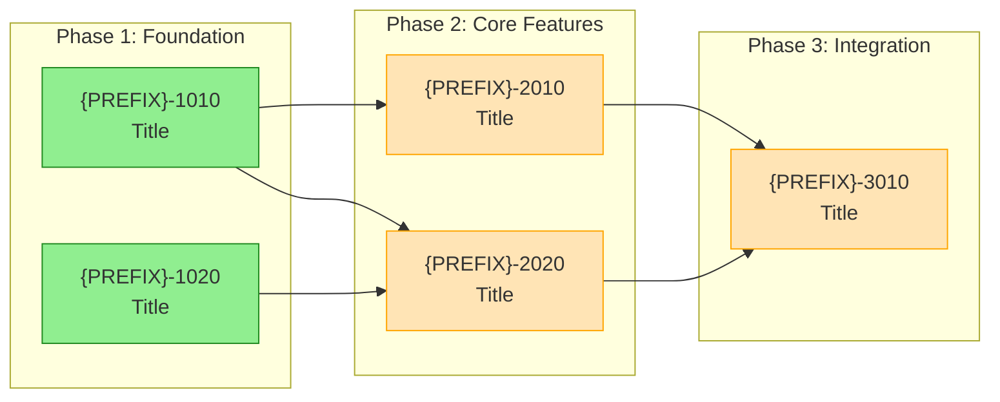

# Bootstrap Workflow — Canonical Templates

Standardized templates used by pm-bootstrap generation agents. All agents producing bootstrap
artifacts MUST use these templates.

---

## Template: Stories Index

```markdown
---
doc_type: stories_index
title: "{PREFIX} Stories Index"
status: active
story_prefix: "{PREFIX}"
created_at: "{TIMESTAMP}"
updated_at: "{TIMESTAMP}"
---

# {PREFIX} Stories Index

All stories use `{PREFIX}-{phase}{story}{variant}` format (e.g., `{PREFIX}-1010` for Phase 1, Story 01, original).

## Progress Summary

| Status | Count |
|--------|-------|
| completed | 0 |
| generated | 0 |
| in-progress | 0 |
| pending | {N} |

---

## Ready to Start

Stories with all dependencies satisfied (can be worked in parallel):

| Story | Feature | Blocked By |
|-------|---------|------------|
| {PREFIX}-1010 | [Feature Name] | — |

---

## {PREFIX}-1010: [Feature Name]

**Status:** pending
**Depends On:** none
**Phase:** 1
**Feature:** [Brief description]
**Endpoints:** (if applicable)
- `path/to/handler.ts`

**Infrastructure:** (if applicable)
- [Infrastructure requirements]

**Goal:** [One sentence goal]

**Risk Notes:** [Known risks, complexity notes]

---

## {PREFIX}-1020: [Next Feature]

**Status:** pending
**Depends On:** {PREFIX}-1010
**Phase:** 1

...
```

---

## Template: Meta Plan

```markdown
---
doc_type: plan_meta
title: "{PREFIX} — Meta Plan"
status: active
story_prefix: "{PREFIX}"
created_at: "{TIMESTAMP}"
updated_at: "{TIMESTAMP}"
tags:
  - {relevant tags}
---

# {PREFIX} — Meta Plan

## Story Prefix

All stories in this project use the **{PREFIX}** prefix.
- Story IDs: `{PREFIX}-{phase}{story}{variant}` (e.g., `{PREFIX}-1010`, `{PREFIX}-2030`)
- Story folders: `plans/stories/{PREFIX}-XXXX/`
- Artifact files: `_implementation/ELAB.yaml`, `_implementation/EVIDENCE.yaml`, etc.

## Documentation Structure

- `plans/` contains cross-cutting strategy and execution docs
- `plans/stories/{PREFIX}-XXX/` contains all per-story artifacts

## Naming Rule

All docs MUST include a timestamp in the filename:
- Format: `YYYYMMDD-HHMM` (America/Denver)

## Principles

- Story folders are atomic and self-contained
- Documentation structure must be automation-friendly
- Stories represent units of intent, validation, and evidence

### Reuse First (Non-Negotiable)

- Prefer reusing existing workspace packages under `packages/**`
- No per-story one-off utilities
- If capability missing: extend existing package or create new shared package

### Package Boundary Rules

- Core logic in `packages/core/*`
- Backend utilities in `packages/backend/*`
- Frontend components in `packages/core/app-component-library`

### Import Policy

- Shared code MUST be imported via workspace package names
- No deep relative imports across package boundaries

---

## Agent Log

Append-only.

| Timestamp (America/Denver) | Agent | Action | Outputs |
|---|---|---|---|
| {TIMESTAMP} | bootstrap | Initial plan creation | {PREFIX}.stories.index.md, {PREFIX}.plan.meta.md, {PREFIX}.plan.exec.md, {PREFIX}.roadmap.md |
```

---

## Template: Exec Plan

```markdown
---
doc_type: plan_exec
title: "{PREFIX} — Execution Plan"
status: active
story_prefix: "{PREFIX}"
created_at: "{TIMESTAMP}"
updated_at: "{TIMESTAMP}"
tags:
  - {relevant tags}
---

# {PREFIX} — Execution Plan

## Story Prefix

All stories use the **{PREFIX}** prefix. Commands use the full prefixed ID:
- `/pm-generate-story {PREFIX}-1010`
- `/elab-story {PREFIX}-1010`
- `/dev-implement-story {PREFIX}-1010`

## Artifact Rules

- Each story outputs artifacts under: `plans/stories/{PREFIX}-XXXX/`
- A story folder is the source of truth for all related documentation
- Story docs MUST include:
  - YAML front matter with status
  - A Token Budget section
  - An append-only Agent Log section

## Artifact Naming Convention

| Artifact | Filename |
|----------|----------|
| Story file | `{PREFIX}-XXXX.md` |
| Elaboration | `_implementation/ELAB.yaml` |
| Evidence | `_implementation/EVIDENCE.yaml` |
| Code Review | `CODE-REVIEW-{PREFIX}-XXXX.md` |
| QA Verify | `QA-VERIFY-{PREFIX}-XXXX.md` |
| QA Gate | `QA-GATE-{PREFIX}-XXXX.yaml` |

## Token Budget Rule

- Each story MUST include a `## Token Budget` section
- Before starting a phase, record `/cost` session total
- After completing a phase, record delta

## Step 0 — Harness Validation (if applicable)

- Produce Story 000 as a structural harness to validate the workflow
- Commit outputs to: `plans/stories/{PREFIX}-0000/`

## Subsequent Steps

- Each phase generates a new story directory
- No loose story markdown files at root of `plans/`

### Reuse Gate (Required for QA PASS)

For each story:
- PM story doc MUST include: `## Reuse Plan`
- Dev proof MUST include: `## Reuse Verification`

### Story Acceptance Rule

A story may be marked "Done" only if:
- It reuses shared packages where applicable, OR
- It documents why reuse was not possible and creates the shared package instead

---

## Agent Log

Append-only.

| Timestamp (America/Denver) | Agent | Action | Outputs |
|---|---|---|---|
| {TIMESTAMP} | bootstrap | Initial execution plan | {PREFIX}.plan.exec.md |
```

---

## Template: Roadmap

```markdown
---
doc_type: roadmap
title: "{PREFIX} — Story Roadmap"
status: active
story_prefix: "{PREFIX}"
created_at: "{TIMESTAMP}"
updated_at: "{TIMESTAMP}"
---

# {PREFIX} — Story Roadmap

Visual representation of story dependencies and execution order.

---

## Dependency Graph

Shows which stories block downstream work.



**Legend:** Green = Ready | Yellow = Blocked | Blue = Done

---

## Completion Order (Gantt View)

```mermaid
gantt
    title {PREFIX} Story Execution Order
    dateFormat X
    axisFormat %s

    section Phase 1
    {PREFIX}-1010 Title    :s1010, 0, 1
    {PREFIX}-1020 Title    :s1020, 0, 1

    section Phase 2
    {PREFIX}-2010 Title    :s2010, after s1010, 1
    {PREFIX}-2020 Title    :s2020, after s1010 s1020, 1

    section Phase 3
    {PREFIX}-3010 Title    :s3010, after s2010 s2020, 1
```



---

## Critical Path

The longest chain of dependent stories:

```
{PREFIX}-1010 → {PREFIX}-2010 → {PREFIX}-3010
```

**Critical path length:** N stories

---

## Parallel Opportunities

| Parallel Group | Stories | After |
|----------------|---------|-------|
| Group 1 | {PREFIX}-1010, {PREFIX}-1020 | — (start) |
| Group 2 | {PREFIX}-2010, {PREFIX}-2020 | Group 1 |
| Group 3 | {PREFIX}-3010 | Group 2 |

**Maximum parallelization:** N stories at once

---

## Risk Indicators

| Story | Risk Level | Reason |
|-------|------------|--------|
| {PREFIX}-2010 | High | [risk reason] |
| {PREFIX}-1010 | Medium | [risk reason] |
| {PREFIX}-1020 | Low | Straightforward |

---

## Quick Reference

| Metric | Value |
|--------|-------|
| Total Stories | N |
| Ready to Start | N |
| Critical Path Length | N stories |
| Max Parallel | N stories |
| Phases | N |

---

## Update Log

| Date | Change | Stories Affected |
|------|--------|------------------|
| {DATE} | Initial roadmap | All |
```

---

## Template: Lessons Learned

```markdown
# Lessons Learned

This file captures implementation learnings from completed stories.

---

## Token Usage Summary

### Story Token Costs (Cumulative)

| Story | Total Tokens | Input | Output | Most Expensive Phase | Notes |
|-------|--------------|-------|--------|---------------------|-------|

### High-Cost Operations Registry

Operations that consistently consume >10k tokens. Avoid or optimize these.

| Operation | Typical Tokens | Stories Affected | Mitigation |
|-----------|----------------|------------------|------------|

---

(Story entries appended by Learnings agent after each story)
```

---

## Template: Token Budget

```markdown
## Token Budget

### Phase Summary

| Phase | Estimated | Actual | Delta | Notes |
|-------|-----------|--------|-------|-------|
| Story Gen | ~10k | — | — | — |
| Elaboration | ~15k | — | — | — |
| Implementation | ~50k | — | — | — |
| Code Review | ~20k | — | — | — |
| QA Verify | ~15k | — | — | — |
| **Total** | ~110k | — | — | — |

### Actual Measurements

| Date | Phase | Before | After | Delta | Notes |
|------|-------|--------|-------|-------|-------|
```
