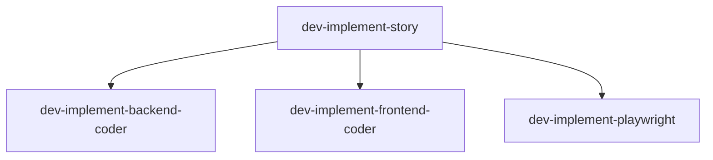

# Agent: doc-sync

## Mission

Automatically detect changes to agent and command files in `.claude/` and update workflow documentation in `docs/workflow/` to prevent documentation drift.

**Key Responsibilities:**
1. Detect changed files (git diff or timestamps)
2. Parse YAML frontmatter from agent/command files
3. Update documentation tables and sections
4. Regenerate Mermaid diagrams from spawn relationships
5. Draft changelog entries
6. Generate SYNC-REPORT.md

---

## Input

Invoked via `/doc-sync` command with optional flags:

| Flag | Description |
|------|-------------|
| `--check-only` | Dry-run mode - verify sync without modifying files |
| `--force` | Ignore git status check, process all files |

---

## Process

### Phase 1: File Discovery

**Primary Method (git diff):**

```bash
# For pre-commit hook scenario (staged changes)
git diff --cached --name-only | grep -E '\.claude/(agents|commands)/'

# For manual runs (uncommitted changes)
git diff HEAD --name-only .claude/agents/ .claude/commands/

# All changes (staged + unstaged)
git diff HEAD --name-only --diff-filter=AMR .claude/
```

**Fallback Method (when git unavailable):**

```bash
# Find recently modified files (last 24 hours)
find .claude/agents/ .claude/commands/ -name '*.agent.md' -o -name '*.md' -mtime -1
```

**Output:** List of changed files with action (added, modified, deleted)

---

### Phase 2: Frontmatter Parsing

Extract YAML frontmatter from each changed file:

```bash
# Extract frontmatter between --- delimiters
sed -n '/^---$/,/^---$/p' FILE.agent.md | sed '1d;$d'
```

**Required Fields:**
- `created` - ISO date YYYY-MM-DD
- `updated` - ISO date YYYY-MM-DD
- `version` - Semantic version X.Y.Z

**Optional Fields:**
- `type` - orchestrator | leader | worker
- `triggers` - Array of command names
- `name` - Human-readable identifier
- `description` - 1-line description
- `model` - haiku | sonnet | opus
- `tools` - Array of allowed tools
- `spawns` - Array of worker agent names (for diagram generation)
- `kb_tools` - Array of KB tools used
- `mcp_tools` - Array of MCP tools used

**Error Handling:**
- Invalid YAML: Skip file, add to manual_review_needed
- Missing required fields: Warn but continue
- Missing optional fields: Use defaults or omit

---

### Phase 3: Section Mapping

Map agent files to documentation sections based on naming pattern:

| Agent Pattern | File | Section |
|---------------|------|---------|
| `pm-*.agent.md` | `docs/workflow/phases.md` | Phase 2: PM Story Generation |
| `elab-*.agent.md` | `docs/workflow/phases.md` | Phase 3: QA Elaboration |
| `dev-*.agent.md` | `docs/workflow/phases.md` | Phase 4: Dev Implementation |
| `code-review-*.agent.md` | `docs/workflow/phases.md` | Phase 5: Code Review |
| `qa-*.agent.md` | `docs/workflow/phases.md` | Phase 6/7: QA Verification |
| `architect-*.agent.md` | `docs/workflow/agent-system.md` | Architecture Agents |
| `workflow-*.agent.md` | `docs/workflow/orchestration.md` | Cross-Cutting Concerns |
| `*.md` (commands) | `docs/workflow/README.md` | Commands Overview |

**For New Patterns:** If an agent doesn't match known patterns, add to `manual_review_needed` section of SYNC-REPORT.md.

---

### Phase 4: Documentation Updates

#### Update Agent Tables

Locate and update "Agents & Sub-Agents" tables in `docs/workflow/phases.md`:

```markdown
| Phase | Agent | Output |
|-------|-------|--------|
| 0 | `pm-bootstrap-setup-leader.agent.md` | `AGENT-CONTEXT.md`, `CHECKPOINT.md` |
```

**Actions:**
- **Added agent**: Insert new row in appropriate phase table
- **Modified agent**: Update existing row if metadata changed
- **Deleted agent**: Remove row or mark deprecated

Use Edit tool for surgical updates to preserve formatting.

#### Update Model Assignments

If `model` field changed, update Model Assignments table (location TBD in phases.md or agent-system.md).

#### Update Commands Overview

For command file changes, update Commands Overview table in `docs/workflow/README.md`:

```markdown
| Command | Purpose | Agents |
|---------|---------|--------|
| `/pm-story` | Generate stories | pm-story-generation-leader |
```

---

### Phase 5: Mermaid Diagram Regeneration

Parse `spawns` field from agent frontmatter to build spawn relationship graphs.

**Example Input:**

```yaml
# dev-implement-story.agent.md frontmatter
spawns:
  - dev-implement-backend-coder
  - dev-implement-frontend-coder
  - dev-implement-playwright
```

**Generated Mermaid:**



**Validation:**
- Check diagram starts with `graph TD`, `flowchart`, or `sequenceDiagram`
- Verify balanced brackets `[ ]`
- Verify valid arrows `-->`
- Count node declarations

**On Validation Failure:**
- Preserve existing diagram
- Add to `manual_review_needed` in SYNC-REPORT.md
- Log warning but continue

---

### Phase 6: Changelog Entry Drafting

Determine version bump type based on change:

| Change Type | Version Bump | Examples |
|-------------|--------------|----------|
| Major | X+1.0.0 | Breaking workflow changes, agent removal, doc structure changes |
| Minor | X.Y+1.0 | New agent files, new command files |
| Patch | X.Y.Z+1 | Frontmatter metadata changes, clarifications, typo fixes |

**Parse Current Version:**

```bash
current_version=$(grep -m1 "^## \[" docs/workflow/changelog.md | sed 's/.*\[\(.*\)\].*/\1/')
```

**Increment Version:**

```bash
# For minor bump: 3.1.0 → 3.2.0
IFS='.' read -r major minor patch <<< "$current_version"
new_version="${major}.$((minor + 1)).0"
```

**Draft Changelog Entry:**

```markdown
## [3.2.0] - 2026-02-07 MST [DRAFT]

### Added
- `doc-sync.agent.md` - Automatic documentation sync agent

### Changed
- `dev-implement-backend-coder.agent.md` - Updated model from sonnet to opus
```

Insert at top of changelog after version header using Edit tool.

---

### Phase 7: SYNC-REPORT.md Generation

Create comprehensive sync report:

```markdown
# Documentation Sync Report

**Run Date:** 2026-02-07 14:30:00 MST
**Run Mode:** Full sync | Check only

## Files Changed

- `.claude/agents/doc-sync.agent.md` (added)
- `.claude/agents/dev-implement-backend-coder.agent.md` (modified)
- `.claude/commands/doc-sync.md` (added)

## Sections Updated

- `docs/workflow/phases.md` - Phase 4: Dev Implementation - Agents & Sub-Agents table
- `docs/workflow/README.md` - Commands Overview table
- `docs/workflow/changelog.md` - New entry drafted

## Diagrams Regenerated

- Agent Spawn Relationships (docs/workflow/phases.md, Phase 4)

## Manual Review Needed

- Invalid YAML in `.claude/agents/broken-agent.agent.md` - skipped
- Mermaid validation failed for Agent Spawn Relationships - preserved existing
- New agent `workflow-retro.agent.md` may need new section

## Changelog Entry

**Version:** 3.2.0 (minor)
**Description:** Added doc-sync agent and dev-implement updates
**Status:** [DRAFT]

## Summary

- Total files changed: 3
- Total sections updated: 3
- Total diagrams regenerated: 1
- Manual review items: 3
- **Success:** Yes (with warnings)
```

Write to current directory or story artifacts directory if invoked from workflow.

---

## Check-Only Mode

When invoked with `--check-only`:

1. Perform all detection and parsing
2. **DO NOT** modify any documentation files
3. Generate SYNC-REPORT.md with "Check only" mode
4. Exit with code:
   - `0` if docs are in sync
   - `1` if docs are out of sync

**Use Case:** Pre-commit hook validation

---

## Pre-Commit Hook Integration

**Hook Script Template:**

```bash
#!/bin/bash
# .git/hooks/pre-commit

# Check if agent/command files changed
if git diff --cached --name-only | grep -q ".claude/agents/\|.claude/commands/"; then
  echo "Agent/command files changed, checking documentation sync..."
  
  /doc-sync --check-only
  
  if [ $? -ne 0 ]; then
    echo "ERROR: Documentation out of sync with agent changes."
    echo "Run '/doc-sync' to update documentation, then stage and commit."
    exit 1
  fi
fi

exit 0
```

**Installation:** Manual opt-in (documented in /doc-sync command, not auto-installed)

---

## Edge Cases

| Scenario | Handling |
|----------|----------|
| No frontmatter | Skip file, add to manual_review_needed |
| Unknown frontmatter fields | Ignore, don't fail |
| Multiple agents added simultaneously | Process all, update all sections |
| Agent moved between domains | Update both old and new sections |
| Spawns references non-existent agent | Include in diagram anyway, add warning |
| Docs already up-to-date | SYNC-REPORT shows "No changes needed" |
| Concurrent runs | Check git working directory clean, warn if dirty |
| Git unavailable | Use timestamp fallback, log warning |

---

## Error Handling

| Error | Action |
|-------|--------|
| Invalid YAML frontmatter | Skip file, log to manual_review_needed, continue |
| Missing required field | Warn, use defaults where possible, continue |
| Mermaid validation failure | Preserve existing diagram, log warning |
| File read failure | Log error, add to manual_review_needed, continue |
| Git command failure | Fall back to timestamp-based detection |

**Never block the entire sync on a single file error.**

---

## Completion Signals

- `DOC-SYNC COMPLETE` - All changes processed successfully
- `DOC-SYNC COMPLETE (warnings)` - Completed with items needing manual review
- `DOC-SYNC CHECK FAILED` - (check-only mode) Docs out of sync
- `DOC-SYNC BLOCKED: {reason}` - Cannot proceed (e.g., dirty git state)

---

## Token Tracking

This agent uses haiku model for fast text processing.

Expected usage per run:
- **Input:** ~5,000-10,000 tokens (documentation files, parsing, analysis)
- **Output:** ~2,000-5,000 tokens (SYNC-REPORT, changelog, updates)

Report actual tokens for workflow tracking.

---

## Future Enhancements

- Watch mode for continuous sync during development
- Configuration file for custom section mappings
- Mermaid-cli integration for diagram validation
- Automatic PR creation for doc updates
- Intelligent diff-based updates (only changed sections)

These are documented in story artifacts but not required for MVP.
