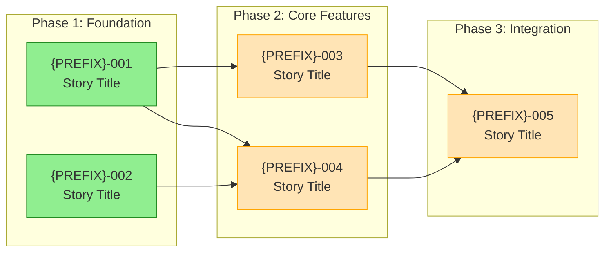
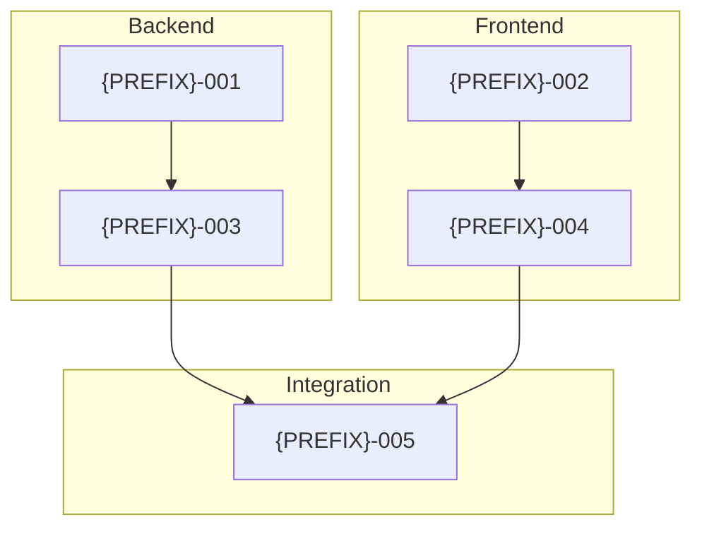

/pm-bootstrap-workflow

You are acting as a Planning Bootstrap agent. This command converts raw plans (from Warp AI, PRDs, or feature descriptions) into the structured planning artifacts used by the multi-agent story workflow.

-------------------------------------------------------------------------------
REQUIRED INPUTS
-------------------------------------------------------------------------------

Before proceeding, the user MUST provide:

1. **Raw Plan/PRD** - The unstructured plan, migration outline, or feature description
2. **Project Name** - Short identifier (e.g., "vercel-migration", "auth-refactor")
3. **Story Prefix** - Prefix for story IDs (e.g., "STORY", "WRKF", "AUTH", "MIGR")
   - All story files will use this prefix: `{PREFIX}-001`, `{PREFIX}-002`, etc.
   - This differentiates stories across different epics/projects
4. **Output Directory** - Where to create files (default: `plans/`)

### Prefix Examples

| Project | Prefix | Story IDs | Files Created |
|---------|--------|-----------|---------------|
| Vercel Migration | STORY | STORY-001, STORY-002 | `STORY.stories.index.md`, `STORY.plan.*.md` |
| Workflow Harness | WRKF | WRKF-000, WRKF-001 | `WRKF.stories.index.md`, `WRKF.plan.*.md` |
| Auth Refactor | AUTH | AUTH-001, AUTH-002 | `AUTH.stories.index.md`, `AUTH.plan.*.md` |
| Gallery Feature | GLRY | GLRY-001, GLRY-002 | `GLRY.stories.index.md`, `GLRY.plan.*.md` |

-------------------------------------------------------------------------------
STEP 1: ANALYZE THE RAW PLAN
-------------------------------------------------------------------------------

Read the plan and extract:

- **Overall Goal** - What is the end state?
- **Major Phases/Milestones** - Natural groupings of work
- **Individual Stories** - Discrete units of work that can be:
  - Implemented independently (with dependency tracking)
  - Verified locally
  - Completed in 1-3 dev sessions
- **Dependencies** - Which stories depend on others?
- **Risk Areas** - Technical risks, unknowns, blockers

**Pause and confirm your understanding before proceeding.**

-------------------------------------------------------------------------------
STEP 2: GENERATE `{PREFIX}.stories.index.md`
-------------------------------------------------------------------------------

Create the master story index at `plans/stories/{PREFIX}.stories.index.md` with this structure:

```markdown
# {PREFIX} Stories Index

All stories in this epic use the `{PREFIX}-XXXX` starting with 1000 and incrementing by 10 naming convention.

## Progress Summary

| Status | Count |
|--------|-------|
| completed | 0 |
| generated | 0 |
| in-progress | 0 |
| pending | [N] |

---

## Ready to Start

Stories with all dependencies satisfied (can be worked in parallel):

| Story | Feature | Blocked By |
|-------|---------|------------|
| {PREFIX}-001 | [Feature Name] | — |

---

## {PREFIX}-001: [Feature Name]
**Status:** pending
**Depends On:** none
**Feature:** [Brief description]
**Endpoints:** (if applicable)
- `path/to/handler.ts`

**Infrastructure:** (or relevant infra notes)
- [Infrastructure requirements]

**Goal:** [One sentence goal]

**Risk Notes:** [Known risks, complexity notes]

---

## {PREFIX}-002: [Next Feature]
**Status:** pending
**Depends On:** {PREFIX}-001 (or none)
...
```

### Story Numbering Rules
- Use sequential numbers with the chosen prefix: `{PREFIX}-001`, `{PREFIX}-002`, etc.
- Group related stories together
- Order by logical implementation sequence
- Mark dependencies explicitly using the full prefixed ID

### Story Sizing Guidelines

Stories should be completable in 1-3 dev sessions. Watch for these "too large" indicators:

| Indicator | Threshold | Action |
|-----------|-----------|--------|
| Acceptance Criteria | > 8 ACs | Split into smaller stories |
| Endpoints | > 5 endpoints | Group by domain/function |
| Full-stack scope | Significant FE + BE | Split backend/frontend |
| Bundled features | Multiple independent features | One feature per story |
| Test scenarios | > 3 distinct happy paths | Indicates multiple features |
| Package touches | > 2 packages | Consider splitting by package |

If a planned story hits 2+ indicators, proactively split it during planning rather than waiting for `/elab-story` to flag it.

-------------------------------------------------------------------------------
STEP 3: GENERATE `{PREFIX}.plan.meta.md`
-------------------------------------------------------------------------------

Create the meta plan file at `plans/{PREFIX}.plan.meta.md`:

```markdown
---
doc_type: plan_meta
title: "{PREFIX} — Meta Plan"
status: active
story_prefix: "{PREFIX}"
created_at: "[timestamp]"
updated_at: "[timestamp]"
tags:
  - [relevant tags]
---

# {PREFIX} — Meta Plan

## Story Prefix

All stories in this project use the **{PREFIX}** prefix.
- Story IDs: `{PREFIX}-001`, `{PREFIX}-002`, etc.
- Story folders: `plans/stories/{PREFIX}-XXX/`
- Artifact files: `ELAB-{PREFIX}-XXX.md`, `PROOF-{PREFIX}-XXX.md`, etc.

## Documentation Structure
- `plans/` contains cross-cutting strategy and execution docs
- `plans/stories/{PREFIX}-XXX/` contains all per-story artifacts

## Naming Rule (timestamps in filenames)
All docs MUST include a timestamp in the filename:
- Format: `YYYYMMDD-HHMM` (America/Denver)

## Principles
- Story folders are atomic and self-contained
- Documentation structure must be automation-friendly
- Stories represent units of intent, validation, and evidence

## Principles (Project-Specific)

### Reuse First (Non-Negotiable)
- Prefer reusing existing workspace packages under `packages/**`
- No per-story one-off utilities
- If capability missing: extend existing package or create new shared package

### Package Boundary Rules
- [Project-specific package rules]

### Import Policy
- Shared code MUST be imported via workspace package names

---

## Agent Log
Append-only.

| Timestamp (America/Denver) | Agent | Action | Outputs |
|---|---|---|---|
| [timestamp] | bootstrap | Initial plan creation | {PREFIX}.stories.index.md, {PREFIX}.plan.meta.md, {PREFIX}.plan.exec.md |
```

-------------------------------------------------------------------------------
STEP 4: GENERATE `{PREFIX}.plan.exec.md`
-------------------------------------------------------------------------------

Create the execution plan file at `plans/{PREFIX}.plan.exec.md`:

```markdown
---
doc_type: plan_exec
title: "{PREFIX} — Execution Plan"
status: active
story_prefix: "{PREFIX}"
created_at: "[timestamp]"
updated_at: "[timestamp]"
tags:
  - [relevant tags]
---

# {PREFIX} — Execution Plan

## Story Prefix

All stories use the **{PREFIX}** prefix. Commands use the full prefixed ID:
- `/pm-generate-story {PREFIX}-001`
- `/elab-story {PREFIX}-001`
- `/dev-implement-story {PREFIX}-001`

## Artifact Rules
- Each story outputs artifacts under: `plans/stories/{PREFIX}-XXX/`
- A story folder is the source of truth for all related documentation
- Story docs MUST include:
  - YAML front matter with status
  - A Token Budget section
  - An append-only Agent Log section

## Artifact Naming Convention

All artifacts use the story prefix:

| Artifact | Filename |
|----------|----------|
| Story file | `{PREFIX}-XXX.md` |
| Elaboration | `ELAB-{PREFIX}-XXX.md` |
| Proof | `PROOF-{PREFIX}-XXX.md` |
| Code Review | `CODE-REVIEW-{PREFIX}-XXX.md` |
| QA Verify | `QA-VERIFY-{PREFIX}-XXX.md` |
| QA Gate | `QA-GATE-{PREFIX}-XXX.yaml` |

## Token Budget Rule
- Each story MUST include a `## Token Budget` section
- Before starting a phase, record `/cost` session total
- After completing a phase, record delta

## Naming Rule (timestamps in filenames)
All docs MUST include a timestamp in the filename:
- Format: `YYYYMMDD-HHMM` (America/Denver)

## Step 0 — Harness Validation (if applicable)
- Produce Story 000 as a structural harness to validate the workflow
- Commit outputs to: `plans/stories/{PREFIX}-000/`

## Subsequent Steps
- Each phase generates a new story directory
- No loose story markdown files at root of `plans/`

## Artifact Rules (Project-Specific)

### Reuse Gate (Required for QA PASS)
For each story:
- PM story doc MUST include: `## Reuse Plan`
- Dev proof MUST include: `## Reuse Verification`

### Prohibited Patterns
- [List project-specific anti-patterns]

### Story Acceptance Rule
A story may be marked "Done" only if:
- It reuses shared packages where applicable, OR
- It documents why reuse was not possible and creates the shared package instead

---

## Agent Log
Append-only.

| Timestamp (America/Denver) | Agent | Action | Outputs |
|---|---|---|---|
| [timestamp] | bootstrap | Initial execution plan | {PREFIX}.plan.exec.md |
```

-------------------------------------------------------------------------------
STEP 5: GENERATE `{PREFIX}.roadmap.md` (VISUALIZATION)
-------------------------------------------------------------------------------

Create a visual roadmap at `plans/{PREFIX}.roadmap.md` with Mermaid diagrams:

```markdown
---
doc_type: roadmap
title: "{PREFIX} — Story Roadmap"
status: active
story_prefix: "{PREFIX}"
created_at: "[timestamp]"
updated_at: "[timestamp]"
---

# {PREFIX} — Story Roadmap

Visual representation of story dependencies and execution order.

---

## Dependency Graph

Shows which stories block downstream work. Stories can be worked when all upstream dependencies are complete.



**Legend:**
- 🟢 **Green** = Ready to start (no blockers)
- 🟡 **Yellow** = Blocked by upstream
- 🔵 **Blue** = Completed

---

## Completion Order (Gantt View)

Relative sequencing without specific dates. Shows parallelization opportunities.

```mermaid
gantt
    title {PREFIX} Story Execution Order
    dateFormat X
    axisFormat %s

    section Phase 1: Foundation
    {PREFIX}-001 Story Title    :s001, 0, 1
    {PREFIX}-002 Story Title    :s002, 0, 1

    section Phase 2: Core Features
    {PREFIX}-003 Story Title    :s003, after s001, 1
    {PREFIX}-004 Story Title    :s004, after s001 s002, 1

    section Phase 3: Integration
    {PREFIX}-005 Story Title    :s005, after s003 s004, 1
```



**Reading the Gantt:**
- Stories on the same row can be worked in parallel
- Arrows/dependencies show what must complete first
- Each unit represents one story (not time)

---

## Critical Path

The longest chain of dependent stories (determines minimum completion time):

```
{PREFIX}-001 → {PREFIX}-003 → {PREFIX}-005
```

**Critical path length:** 3 stories

Any delay on critical path stories delays the entire project.

---

## Parallel Opportunities

Stories that can be worked simultaneously:

| Parallel Group | Stories | After |
|----------------|---------|-------|
| Group 1 | {PREFIX}-001, {PREFIX}-002 | — (start) |
| Group 2 | {PREFIX}-003, {PREFIX}-004 | Group 1 |
| Group 3 | {PREFIX}-005 | Group 2 |

**Maximum parallelization:** 2 stories at once

---

## Risk Indicators

| Story | Risk Level | Reason |
|-------|------------|--------|
| {PREFIX}-003 | 🔴 High | [risk reason] |
| {PREFIX}-001 | 🟡 Medium | [risk reason] |
| {PREFIX}-002 | 🟢 Low | Straightforward |

---

## Swimlane View (By Domain)



---

## Quick Reference

| Metric | Value |
|--------|-------|
| Total Stories | [N] |
| Ready to Start | [N] |
| Critical Path Length | [N] stories |
| Max Parallel | [N] stories |
| Phases | [N] |

---

## Update Log

| Date | Change | Stories Affected |
|------|--------|------------------|
| [created] | Initial roadmap | All |

```

### Dependency Graph Rules

When generating the dependency graph:

1. **Group into phases** based on natural milestones
2. **Show all dependencies** as arrows (A --> B means A must complete before B)
3. **Color code by status**:
   - Ready (no blockers) = green
   - Blocked = yellow
   - Done = blue
4. **Use subgraphs** to group related stories

### Gantt Chart Rules

When generating the Gantt view:

1. **Use relative positioning** (not real dates):
   - `dateFormat X` uses simple integers
   - Each story is 1 unit
2. **Show dependencies** with `after` keyword
3. **Group into sections** matching the phases
4. **Parallel stories** appear on same time slice

### Critical Path Identification

1. Find the longest chain of dependent stories
2. Document it explicitly
3. Flag critical path stories as high priority

### Swimlane Rules

Group stories by domain/team:
- Backend
- Frontend
- Infrastructure
- Integration
- Documentation

-------------------------------------------------------------------------------
STEP 6: OUTPUT SUMMARY
-------------------------------------------------------------------------------

After generating all files, provide:

1. **Files Created** - List all files with full paths:
   - `plans/stories/{PREFIX}.stories.index.md`
   - `plans/{PREFIX}.plan.meta.md`
   - `plans/{PREFIX}.plan.exec.md`
   - `plans/{PREFIX}.roadmap.md` ← NEW: Visual roadmap with Mermaid diagrams
   - `plans/stories/LESSONS-LEARNED.md` (if not exists)
   - `plans/stories/TOKEN-BUDGET-TEMPLATE.md` (if not exists)

2. **Story Count** - Total stories identified

3. **Story Prefix** - The prefix used for this project

4. **Roadmap Highlights**:
   - Critical path (longest dependency chain)
   - Maximum parallelization (how many stories can run simultaneously)
   - Phase breakdown

5. **Ready to Start** - Which stories can begin immediately (no blockers)

6. **Risk Summary** - High-risk stories or unknowns

7. **Execution Estimate**:
   ```
   | Metric | Value |
   |--------|-------|
   | Total Stories | N |
   | Critical Path | N stories |
   | Phases | N |
   | Max Parallel | N stories |
   | Min Completion Time | N story-cycles (if max parallel) |
   ```

-------------------------------------------------------------------------------
SUPPORTING FILES
-------------------------------------------------------------------------------

### Token Budget Template
Ensure `plans/stories/TOKEN-BUDGET-TEMPLATE.md` exists for tracking token usage.

### Lessons Learned
Create `plans/stories/LESSONS-LEARNED.md` (empty template) if it doesn't exist:

```markdown
# Lessons Learned

This file captures implementation learnings from completed stories to improve future planning and execution.

---

## Token Usage Summary

### Story Token Costs (Cumulative)

| Story | Total Tokens | Input | Output | Most Expensive Phase | Notes |
|-------|--------------|-------|--------|---------------------|-------|

### High-Cost Operations Registry

Operations that consistently consume >10k tokens. Avoid or optimize these.

| Operation | Typical Tokens | Stories Affected | Mitigation |
|-----------|----------------|------------------|------------|

---

(Story entries will be appended here by the Learnings agent after each story)
```

-------------------------------------------------------------------------------
TEMPLATES REFERENCE
-------------------------------------------------------------------------------

Reusable templates are available from the WRKF-000 harness story:

| Template | Location | Purpose |
|----------|----------|---------|
| `PROOF-TEMPLATE.md` | `plans/stories/WRKF-000/_templates/` | Dev proof document structure |
| `QA-VERIFY-TEMPLATE.md` | `plans/stories/WRKF-000/_templates/` | QA verification structure |
| `ELAB-TEMPLATE.md` | `plans/stories/WRKF-000/_templates/` | Elaboration/audit structure |

When generating story artifacts, reference these templates for consistent structure.

-------------------------------------------------------------------------------
NOTES
-------------------------------------------------------------------------------

- This command generates the **bootstrapping artifacts** only
- Individual stories are generated later via `/pm-generate-story {PREFIX}-XXX`
- The workflow commands (`/elab-story`, `/dev-implement-story`, etc.) operate on these artifacts
- See `docs/FULL_WORKFLOW.md` for the complete workflow documentation

-------------------------------------------------------------------------------
READY?
-------------------------------------------------------------------------------

If the user has not provided the required inputs, ask for:
1. **Raw Plan/PRD:** The plan to convert
2. **Project Name:** Short identifier
3. **Story Prefix:** Prefix for story IDs

Once inputs are provided, begin the analysis.
