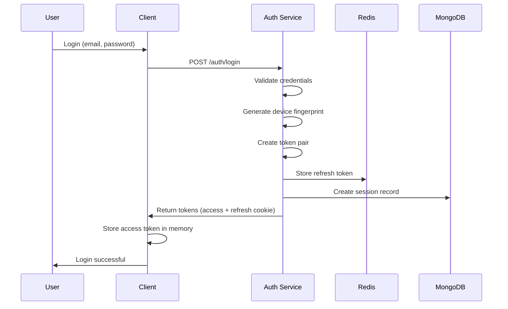
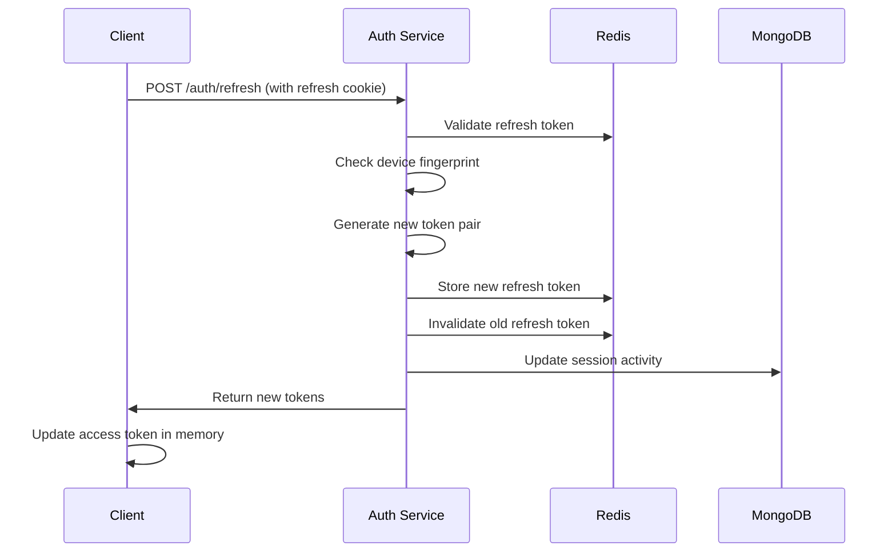
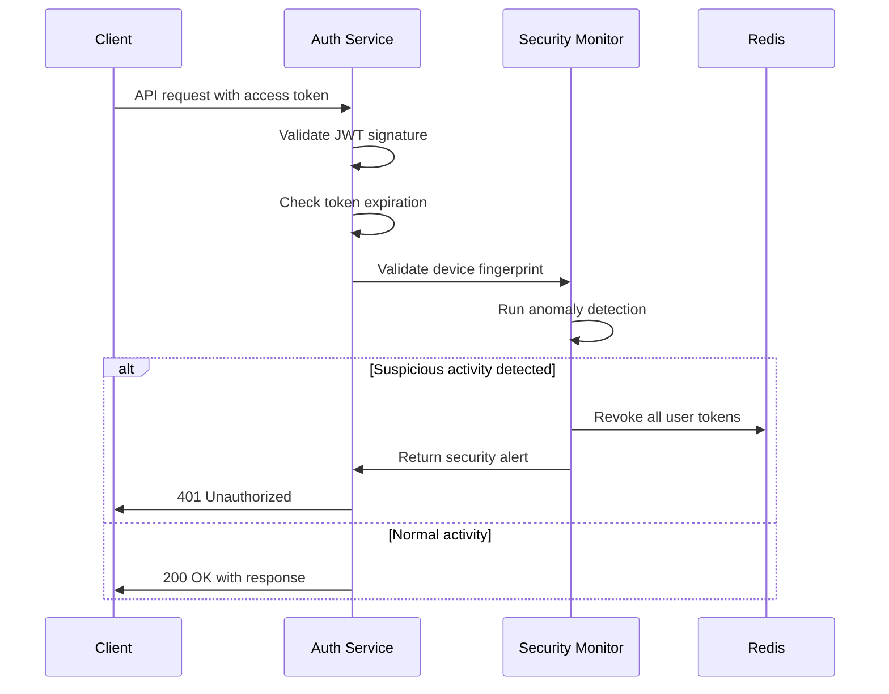

# 🏗️ Persistent Authentication System - Technical Architecture

**Technical Architecture Document**  
**Version:** 1.0  
**Date:** January 2025  
**Related PRD:** PRD-Persistent-Authentication-System.md

---

## **🎯 Architecture Overview**

### **System Architecture Diagram**

```
┌─────────────────┐    ┌──────────────────┐    ┌─────────────────┐
│   Client App    │    │   Auth Service   │    │  Session Store  │
│                 │    │                  │    │                 │
│ • Access Token  │◄──►│ • Token Mgmt     │◄──►│ • Redis Cache   │
│ • Auto Refresh  │    │ • Validation     │    │ • MongoDB       │
│ • API Calls     │    │ • Security       │    │ • Encryption    │
└─────────────────┘    └──────────────────┘    └─────────────────┘
         │                        │                        │
         ▼                        ▼                        ▼
┌─────────────────┐    ┌──────────────────┐    ┌─────────────────┐
│ Browser Storage │    │ Security Monitor │    │ Analytics DB    │
│                 │    │                  │    │                 │
│ • HttpOnly      │    │ • Anomaly Det.   │    │ • Metrics       │
│ • Secure        │    │ • Threat Resp.   │    │ • Reporting     │
│ • SameSite      │    │ • Audit Logs     │    │ • Dashboards    │
└─────────────────┘    └──────────────────┘    └─────────────────┘
```

### **Core Components**

#### **1. Token Management System**

- **Access Token Service**: JWT generation, validation, claims management
- **Refresh Token Service**: Opaque token generation, rotation, family tracking
- **Token Store**: Redis-based high-performance token storage
- **Cleanup Service**: Automatic expiration and garbage collection

#### **2. Security Layer**

- **Device Fingerprinting**: Non-invasive device characteristic collection
- **Anomaly Detection**: ML-based suspicious activity detection
- **Threat Response**: Automatic token revocation and incident response
- **Audit System**: Comprehensive security event logging

#### **3. Client Integration**

- **Auth Context**: React/Vue context for authentication state
- **HTTP Interceptors**: Automatic token attachment and refresh
- **Storage Manager**: Secure token storage and retrieval
- **Error Handling**: Graceful authentication failure handling

---

## **🔐 Security Architecture**

### **Token Security Model**

#### **Access Token (JWT)**

```json
{
  "header": {
    "alg": "RS256",
    "typ": "JWT",
    "kid": "key-id-2025"
  },
  "payload": {
    "iss": "https://auth.company.com",
    "sub": "user-uuid-123",
    "aud": ["api.company.com", "app.company.com"],
    "exp": 1640995200,
    "iat": 1640993400,
    "nbf": 1640993400,
    "jti": "access-token-uuid",
    "scope": "read write profile",
    "role": "user",
    "device_id": "device-fingerprint-hash"
  }
}
```

#### **Refresh Token (Opaque)**

```json
{
  "token_id": "rt_abc123def456ghi789",
  "user_id": "user-uuid-123",
  "device_id": "device-fingerprint-hash",
  "family_id": "family-uuid-456",
  "issued_at": "2025-01-15T10:00:00Z",
  "expires_at": "2025-02-14T10:00:00Z",
  "last_used": "2025-01-15T10:00:00Z",
  "ip_address": "192.168.1.100",
  "user_agent_hash": "ua-hash-789"
}
```

### **Device Fingerprinting Strategy**

#### **Collected Characteristics**

```javascript
const deviceFingerprint = {
  // Browser characteristics
  userAgent: navigator.userAgent,
  language: navigator.language,
  platform: navigator.platform,
  cookieEnabled: navigator.cookieEnabled,
  doNotTrack: navigator.doNotTrack,

  // Screen characteristics
  screenResolution: `${screen.width}x${screen.height}`,
  colorDepth: screen.colorDepth,
  pixelRatio: window.devicePixelRatio,

  // Timezone and locale
  timezone: Intl.DateTimeFormat().resolvedOptions().timeZone,
  timezoneOffset: new Date().getTimezoneOffset(),

  // Canvas fingerprinting (privacy-conscious)
  canvasFingerprint: generateCanvasHash(),

  // WebGL characteristics
  webglVendor: getWebGLVendor(),
  webglRenderer: getWebGLRenderer(),
}
```

#### **Privacy-Compliant Implementation**

- **Minimal Data Collection**: Only necessary characteristics
- **User Consent**: Clear opt-in for enhanced fingerprinting
- **Data Anonymization**: Hash sensitive characteristics
- **Retention Limits**: Automatic cleanup after session expiry

### **Encryption Standards**

#### **Data at Rest**

- **Algorithm**: AES-256-GCM
- **Key Management**: AWS KMS / Azure Key Vault
- **Key Rotation**: Automatic monthly rotation
- **Backup Encryption**: Separate encryption keys

#### **Data in Transit**

- **Protocol**: TLS 1.3 minimum
- **Cipher Suites**: ECDHE-RSA-AES256-GCM-SHA384
- **Certificate Pinning**: Mobile app implementation
- **HSTS**: Strict transport security headers

#### **Token Signing**

- **Algorithm**: RS256 (RSA-SHA256)
- **Key Size**: 2048-bit minimum
- **Key Rotation**: Quarterly rotation schedule
- **Multiple Keys**: Support for key rollover

---

## **⚡ Performance Architecture**

### **Caching Strategy**

#### **Redis Configuration**

```yaml
# Redis Cluster Configuration
redis:
  cluster:
    enabled: true
    nodes: 6
    replicas: 1
  memory:
    maxmemory: 4gb
    policy: allkeys-lru
  persistence:
    rdb: enabled
    aof: enabled
  security:
    auth: required
    tls: enabled
```

#### **Cache Layers**

1. **L1 Cache**: Application memory (access tokens)
2. **L2 Cache**: Redis cluster (session data)
3. **L3 Cache**: MongoDB (persistent storage)

### **Database Design**

#### **Session Collection (MongoDB)**

```javascript
{
  _id: ObjectId("..."),
  sessionId: "session-uuid-123",
  userId: "user-uuid-456",
  deviceFingerprint: "device-hash-789",
  refreshTokenFamily: "family-uuid-abc",
  createdAt: ISODate("2025-01-15T10:00:00Z"),
  lastActivity: ISODate("2025-01-15T12:30:00Z"),
  expiresAt: ISODate("2025-02-14T10:00:00Z"),
  ipAddress: "192.168.1.100",
  userAgent: "Mozilla/5.0...",
  isActive: true,
  securityEvents: [
    {
      type: "login",
      timestamp: ISODate("2025-01-15T10:00:00Z"),
      ipAddress: "192.168.1.100"
    }
  ]
}
```

#### **Indexes**

```javascript
// Performance indexes
db.sessions.createIndex({ userId: 1, isActive: 1 })
db.sessions.createIndex({ sessionId: 1 })
db.sessions.createIndex({ refreshTokenFamily: 1 })
db.sessions.createIndex({ expiresAt: 1 }, { expireAfterSeconds: 0 })

// Security indexes
db.sessions.createIndex({ deviceFingerprint: 1, userId: 1 })
db.sessions.createIndex({ ipAddress: 1, createdAt: -1 })
```

### **Scalability Considerations**

#### **Horizontal Scaling**

- **Stateless Services**: All auth services are stateless
- **Load Balancing**: Round-robin with health checks
- **Database Sharding**: User-based sharding strategy
- **Cache Partitioning**: Consistent hashing for Redis

#### **Performance Targets**

- **Token Refresh**: <100ms 95th percentile
- **Token Validation**: <50ms 95th percentile
- **Database Queries**: <200ms 95th percentile
- **Cache Hits**: >95% for active sessions

---

## **🔄 Authentication Flow**

### **Initial Login Flow**



### **Token Refresh Flow**



### **Security Validation Flow**



---

## **📊 Monitoring & Observability**

### **Metrics Collection**

#### **Authentication Metrics**

- `auth_login_attempts_total{status="success|failure"}`
- `auth_token_refresh_duration_seconds`
- `auth_token_validation_duration_seconds`
- `auth_security_events_total{type="anomaly|threat"}`

#### **Performance Metrics**

- `auth_cache_hit_ratio`
- `auth_database_query_duration_seconds`
- `auth_concurrent_sessions_total`
- `auth_token_generation_duration_seconds`

#### **Security Metrics**

- `auth_suspicious_activity_total{type="device|location|behavior"}`
- `auth_token_revocation_total{reason="security|expiry|logout"}`
- `auth_failed_fingerprint_validation_total`
- `auth_compliance_violations_total`

### **Alerting Rules**

#### **Critical Alerts**

```yaml
# High authentication failure rate
- alert: HighAuthFailureRate
  expr: rate(auth_login_attempts_total{status="failure"}[5m]) > 0.1
  for: 2m
  labels:
    severity: critical
  annotations:
    summary: 'High authentication failure rate detected'

# Token refresh latency
- alert: HighTokenRefreshLatency
  expr: histogram_quantile(0.95, auth_token_refresh_duration_seconds) > 0.2
  for: 5m
  labels:
    severity: warning
  annotations:
    summary: 'Token refresh latency is high'
```

### **Dashboards**

#### **Authentication Overview Dashboard**

- Authentication success/failure rates
- Active sessions by device type
- Token refresh performance
- Geographic login distribution

#### **Security Dashboard**

- Suspicious activity alerts
- Device fingerprint anomalies
- Token revocation events
- Compliance status indicators

---

## **🚀 Deployment Architecture**

### **Infrastructure Requirements**

#### **Production Environment**

```yaml
# Kubernetes deployment
apiVersion: apps/v1
kind: Deployment
metadata:
  name: auth-service
spec:
  replicas: 3
  selector:
    matchLabels:
      app: auth-service
  template:
    metadata:
      labels:
        app: auth-service
    spec:
      containers:
        - name: auth-service
          image: auth-service:latest
          ports:
            - containerPort: 8080
          env:
            - name: REDIS_URL
              valueFrom:
                secretKeyRef:
                  name: auth-secrets
                  key: redis-url
            - name: MONGODB_URL
              valueFrom:
                secretKeyRef:
                  name: auth-secrets
                  key: mongodb-url
          resources:
            requests:
              memory: '512Mi'
              cpu: '250m'
            limits:
              memory: '1Gi'
              cpu: '500m'
```

#### **Service Mesh Configuration**

```yaml
# Istio service mesh
apiVersion: networking.istio.io/v1alpha3
kind: VirtualService
metadata:
  name: auth-service
spec:
  http:
    - match:
        - uri:
            prefix: /auth
      route:
        - destination:
            host: auth-service
      timeout: 30s
      retries:
        attempts: 3
        perTryTimeout: 10s
```

### **CI/CD Pipeline**

#### **Build Pipeline**

1. **Code Quality**: ESLint, Prettier, SonarQube
2. **Security Scan**: SAST, dependency vulnerability scan
3. **Unit Tests**: Jest, coverage >90%
4. **Integration Tests**: API testing, database testing
5. **Build**: Docker image creation
6. **Security Scan**: Container vulnerability scan

#### **Deployment Pipeline**

1. **Staging Deployment**: Automated deployment to staging
2. **E2E Tests**: Playwright, security testing
3. **Performance Tests**: Load testing, stress testing
4. **Security Tests**: Penetration testing, compliance checks
5. **Production Deployment**: Blue-green deployment
6. **Monitoring**: Health checks, metric validation

---

_This technical architecture document provides the detailed implementation guidance for the Persistent Authentication System PRD._
