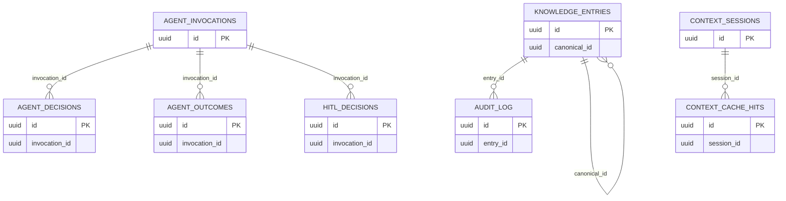

# Public Schema

The `public` schema contains core knowledge base functionality including knowledge entries, agent telemetry, and context caching.

## Tables Overview

| Table              | Description                            | Primary Key |
| ------------------ | -------------------------------------- | ----------- |
| knowledge_entries  | Core knowledge storage with embeddings | uuid id     |
| audit_log          | Audit trail for knowledge entries      | uuid id     |
| embedding_cache    | Cached embeddings for reuse            | uuid id     |
| agent_invocations  | Agent execution records                | uuid id     |
| agent_decisions    | Agent decision logs                    | uuid id     |
| agent_outcomes     | Agent outcome records                  | uuid id     |
| hitl_decisions     | Human-in-the-loop decisions            | uuid id     |
| context_packs      | Assembled context for agents           | uuid id     |
| context_sessions   | Agent session tracking                 | uuid id     |
| context_cache_hits | Context cache hit/miss tracking        | uuid id     |
| adrs               | Architecture decision records          | uuid id     |
| code_standards     | Code standards entries                 | uuid id     |
| cohesion_rules     | Cohesion rules                         | uuid id     |
| lessons_learned    | Lessons learned entries                | uuid id     |
| rules              | General rules                          | uuid id     |

## Entity Relationship Diagram

## Core Tables

### knowledge_entries

Core knowledge storage with vector embeddings for semantic search.

| Column       | Type         | Constraints             | Description                                       |
| ------------ | ------------ | ----------------------- | ------------------------------------------------- |
| id           | uuid         | PK                      | Primary key                                       |
| content      | text         | NOT NULL                | Knowledge content                                 |
| embedding    | vector(1536) |                         | Vector embedding for semantic search              |
| role         | text         | NOT NULL, DEFAULT 'all' | Target role (pm, dev, qa, all)                    |
| entry_type   | text         | NOT NULL                | Type: note, decision, constraint, runbook, lesson |
| story_id     | text         |                         | Associated story ID                               |
| tags         | text[]       |                         | Categorization tags                               |
| verified     | boolean      | DEFAULT false           | Verification status                               |
| verified_at  | timestamp    |                         | When verified                                     |
| verified_by  | text         |                         | Who verified                                      |
| created_at   | timestamp    | NOT NULL                | Creation timestamp                                |
| updated_at   | timestamp    | NOT NULL                | Last update                                       |
| archived     | boolean      | NOT NULL                | Archive flag                                      |
| archived_at  | timestamp    |                         | When archived                                     |
| canonical_id | uuid         | FK                      | Self-referential for canonical versions           |
| is_canonical | boolean      | NOT NULL                | Is canonical flag                                 |
| deleted_at   | timestamp    |                         | Soft delete timestamp                             |
| deleted_by   | text         |                         | Who deleted                                       |

**Indexes:**

- Primary key (id)
- btree (archived)
- btree (created_at)
- btree (entry_type)
- btree (is_canonical)
- btree (role)
- btree (story_id)
- ivfflat (embedding) with vector_cosine_ops
- Partial index on unverified entries

**Check Constraints:**

- entry_type IN ('note', 'decision', 'constraint', 'runbook', 'lesson')

### audit_log

Audit trail for knowledge entry changes.

| Column         | Type        | Constraints | Description                          |
| -------------- | ----------- | ----------- | ------------------------------------ |
| id             | uuid        | PK          | Primary key                          |
| entry_id       | uuid        | FK          | Reference to knowledge_entries       |
| operation      | text        |             | Operation type (add, update, delete) |
| previous_value | jsonb       |             | Previous state                       |
| new_value      | jsonb       |             | New state                            |
| timestamp      | timestamptz |             | When occurred                        |
| user_context   | jsonb       |             | User context                         |
| created_at     | timestamptz |             | Creation timestamp                   |

### embedding_cache

Cached embeddings to avoid recomputation.

| Column       | Type         | Constraints | Description              |
| ------------ | ------------ | ----------- | ------------------------ |
| id           | uuid         | PK          | Primary key              |
| content_hash | text         |             | Hash of content          |
| model        | text         |             | Model used for embedding |
| embedding    | vector(1536) |             | Cached embedding         |
| created_at   | timestamp    |             | Cache timestamp          |

## Agent Telemetry Tables

### agent_invocations

Records of agent executions.

| Column         | Type          | Constraints         | Description                  |
| -------------- | ------------- | ------------------- | ---------------------------- |
| id             | uuid          | PK                  | Primary key                  |
| invocation_id  | text          | UNIQUE              | Human-readable invocation ID |
| agent_name     | text          | NOT NULL            | Name of agent                |
| story_id       | text          |                     | Associated story             |
| phase          | text          |                     | Workflow phase               |
| input_payload  | jsonb         |                     | Input data                   |
| output_payload | jsonb         |                     | Output data                  |
| duration_ms    | integer       |                     | Execution duration           |
| input_tokens   | integer       |                     | Input token count            |
| output_tokens  | integer       |                     | Output token count           |
| cached_tokens  | integer       | NOT NULL, DEFAULT 0 | Cached token count           |
| total_tokens   | integer       | NOT NULL, DEFAULT 0 | Total tokens                 |
| estimated_cost | numeric(10,4) | NOT NULL, DEFAULT 0 | Estimated cost               |
| model_name     | text          |                     | Model used                   |
| status         | text          | NOT NULL            | Execution status             |
| error_message  | text          |                     | Error if failed              |
| started_at     | timestamptz   | NOT NULL            | Start timestamp              |
| completed_at   | timestamptz   |                     | Completion timestamp         |
| created_at     | timestamptz   | NOT NULL            | Record creation              |

**Indexes:**

- Primary key (id)
- Unique on invocation_id
- btree (agent_name)
- btree (agent_name, started_at)
- btree (agent_name, story_id)
- btree (started_at)
- btree (status)
- btree (story_id)

### agent_decisions

Agent decision records linked to invocations.

| Column                  | Type        | Constraints | Description                    |
| ----------------------- | ----------- | ----------- | ------------------------------ |
| id                      | uuid        | PK          | Primary key                    |
| invocation_id           | uuid        | FK          | Reference to agent_invocations |
| decision_type           | text        |             | Type of decision               |
| decision_text           | text        |             | Decision description           |
| context                 | jsonb       |             | Decision context               |
| confidence              | integer     |             | Confidence score               |
| was_correct             | boolean     |             | Whether decision was correct   |
| evaluated_at            | timestamptz |             | Evaluation timestamp           |
| evaluated_by            | text        |             | Who evaluated                  |
| correctness_score       | integer     |             | Score if evaluated             |
| alternatives_considered | integer     |             | Alternatives count             |
| created_at              | timestamptz |             | Creation timestamp             |

### agent_outcomes

Agent outcome records linked to invocations.

| Column              | Type        | Constraints | Description                    |
| ------------------- | ----------- | ----------- | ------------------------------ |
| id                  | uuid        | PK          | Primary key                    |
| invocation_id       | uuid        | FK          | Reference to agent_invocations |
| outcome_type        | text        |             | Type of outcome                |
| artifacts_produced  | jsonb       |             | Artifacts created              |
| tests_written       | integer     |             | Tests written                  |
| tests_passed        | integer     |             | Tests passed                   |
| tests_failed        | integer     |             | Tests failed                   |
| code_quality        | integer     |             | Code quality score             |
| test_coverage       | integer     |             | Test coverage %                |
| review_score        | integer     |             | Review score                   |
| review_notes        | text        |             | Review notes                   |
| lint_errors         | integer     |             | Lint errors                    |
| type_errors         | integer     |             | Type errors                    |
| security_issues     | jsonb       |             | Security issues found          |
| performance_metrics | jsonb       |             | Performance data               |
| artifacts_metadata  | jsonb       |             | Artifact metadata              |
| created_at          | timestamptz |             | Creation timestamp             |
| updated_at          | timestamptz |             | Last update                    |

### hitl_decisions

Human-in-the-loop decisions for agent guidance.

| Column        | Type         | Constraints | Description                             |
| ------------- | ------------ | ----------- | --------------------------------------- |
| id            | uuid         | PK          | Primary key                             |
| story_id      | text         |             | Associated story                        |
| decision_type | text         |             | Type (approve, reject, defer, override) |
| decision_text | text         |             | Decision description                    |
| operator_id   | text         |             | Who made decision                       |
| invocation_id | uuid         | FK          | Reference to agent_invocations          |
| context       | jsonb        |             | Decision context                        |
| embedding     | vector(1536) |             | Semantic embedding for search           |
| created_at    | timestamptz  |             | Creation timestamp                      |

## Context Caching Tables

### context_packs

Assembled context packages for agent use.

| Column        | Type      | Constraints | Description              |
| ------------- | --------- | ----------- | ------------------------ |
| id            | uuid      | PK          | Primary key              |
| story_id      | text      |             | Associated story         |
| node_type     | text      |             | Graph node type          |
| role          | text      |             | Target role              |
| story_brief   | jsonb     |             | Story summary            |
| kb_facts      | jsonb     |             | Relevant facts           |
| kb_rules      | jsonb     |             | Applicable rules         |
| kb_links      | jsonb     |             | KB references            |
| repo_snippets | jsonb     |             | Repository code snippets |
| token_count   | integer   |             | Token count              |
| expires_at    | timestamp |             | Cache expiration         |
| created_at    | timestamp |             | Creation timestamp       |

### context_sessions

Agent session tracking.

| Column        | Type      | Constraints | Description      |
| ------------- | --------- | ----------- | ---------------- |
| id            | uuid      | PK          | Primary key      |
| story_id      | text      |             | Associated story |
| agent_name    | text      |             | Agent name       |
| phase         | text      |             | Workflow phase   |
| started_at    | timestamp |             | Session start    |
| completed_at  | timestamp |             | Session end      |
| input_tokens  | integer   |             | Input tokens     |
| output_tokens | integer   |             | Output tokens    |

### context_cache_hits

Cache hit/miss tracking.

| Column      | Type      | Constraints | Description        |
| ----------- | --------- | ----------- | ------------------ |
| id          | uuid      | PK          | Primary key        |
| story_id    | text      |             | Associated story   |
| node_type   | text      |             | Node type          |
| role        | text      |             | Target role        |
| hit         | boolean   |             | Hit or miss        |
| token_count | integer   |             | Tokens if cached   |
| created_at  | timestamp |             | Creation timestamp |

## Legacy Tables

These tables exist but may have limited use:

| Table           | Description                   |
| --------------- | ----------------------------- |
| adrs            | Architecture Decision Records |
| code_standards  | Code standards entries        |
| cohesion_rules  | Cohesion rules                |
| lessons_learned | Lessons learned entries       |
| rules           | General rules                 |

All legacy tables have a `workflow_story_id` foreign key to `workflow.stories` and a `source_entry_id` foreign key to `knowledge_entries`.

## Foreign Key Summary

| Source            | Column            | Target               | On Delete |
| ----------------- | ----------------- | -------------------- | --------- |
| audit_log         | entry_id          | knowledge_entries.id | SET NULL  |
| knowledge_entries | canonical_id      | knowledge_entries.id | NO ACTION |
| agent_decisions   | invocation_id     | agent_invocations.id | CASCADE   |
| agent_outcomes    | invocation_id     | agent_invocations.id | CASCADE   |
| hitl_decisions    | invocation_id     | agent_invocations.id | SET NULL  |
| adrs              | workflow_story_id | workflow.stories     | SET NULL  |
| adrs              | source_entry_id   | knowledge_entries.id | SET NULL  |
| code_standards    | workflow_story_id | workflow.stories     | SET NULL  |
| code_standards    | source_entry_id   | knowledge_entries.id | SET NULL  |
| lessons_learned   | workflow_story_id | workflow.stories     | SET NULL  |
| lessons_learned   | source_entry_id   | knowledge_entries.id | SET NULL  |
| rules             | workflow_story_id | workflow.stories     | SET NULL  |
| rules             | source_entry_id   | knowledge_entries.id | SET NULL  |
