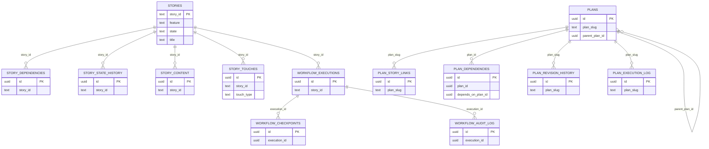

# Workflow Schema

The `workflow` schema contains all story management, planning, work state tracking, and execution functionality.

## Tables Overview

| Table                 | Description                        | Primary Key            |
| --------------------- | ---------------------------------- | ---------------------- |
| stories               | Story metadata and workflow state  | text story_id          |
| story_dependencies    | Story-to-story dependencies        | uuid id                |
| story_state_history   | State change history               | uuid id                |
| story_content         | Raw story content storage          | uuid id                |
| story_touches         | Story scope (backend/frontend/etc) | uuid id                |
| plans                 | Plan metadata                      | uuid id (plan_slug UK) |
| plan_story_links      | Plan-story associations            | uuid id                |
| plan_dependencies     | Plan dependencies (M:N)            | uuid id                |
| plan_revision_history | Plan version history               | uuid id                |
| plan_execution_log    | Plan execution events              | uuid id                |
| work_state            | Story work context                 | uuid id                |
| workflow_executions   | Execution records                  | uuid id                |
| workflow_checkpoints  | Execution checkpoints              | uuid id                |
| workflow_audit_log    | Execution audit trail              | uuid id                |

## Entity Relationship Diagram

## Stories Tables

### stories

Core story metadata and workflow state (consolidated from stories + story_details).

| Column           | Type             | Constraints | Description                        |
| ---------------- | ---------------- | ----------- | ---------------------------------- |
| story_id         | text             | PK          | Story identifier (e.g., WISH-2045) |
| feature          | text             | NOT NULL    | Feature prefix                     |
| state            | story_state_enum |             | Workflow state                     |
| title            | text             | NOT NULL    | Story title                        |
| priority         | priority_enum    |             | Priority (P1-P5)                   |
| description      | text             |             | Story description                  |
| created_at       | timestamptz      | NOT NULL    | Creation timestamp                 |
| updated_at       | timestamptz      | NOT NULL    | Last update                        |
| blocked_reason   | text             |             | Reason if story is blocked         |
| blocked_by_story | text             |             | Story that blocks this one         |
| started_at       | timestamptz      |             | When story was started             |
| completed_at     | timestamptz      |             | When story was completed           |
| file_hash        | text             |             | Hash of story file                 |

**Indexes:**

- Primary key (story_id)
- btree (feature, state)
- btree (state, updated_at)

**Enums:**

- **state:** backlog, ready, in_progress, ready_for_review, in_review, ready_for_qa, in_qa, uat, completed, cancelled, deferred, failed_code_review, failed_qa, blocked, elaboration, ready_to_work, needs_code_review
- **priority:** P1, P2, P3, P4, P5

**Foreign Keys:**

- Referenced by: story_dependencies, story_state_history, story_content, story_touches, workflow_executions, adrs, code_standards, lessons_learned, rules

### story_dependencies

Story-to-story dependencies (many-to-many self-referential join table).

| Column          | Type        | Constraints | Description                                           |
| --------------- | ----------- | ----------- | ----------------------------------------------------- |
| id              | uuid        | PK          | Primary key                                           |
| story_id        | text        | FK          | Source story                                          |
| depends_on_id   | text        | FK          | Target story (dependency)                             |
| dependency_type | text        | NOT NULL    | Type: depends_on, blocked_by, follow_up_from, enables |
| created_at      | timestamptz | NOT NULL    | Creation timestamp                                    |

**Unique Constraint:** (story_id, depends_on_id)

### story_state_history

State change history.

| Column     | Type      | Constraints | Description          |
| ---------- | --------- | ----------- | -------------------- |
| id         | uuid      | PK          | Primary key          |
| story_id   | text      | FK          | Reference to stories |
| event_type | text      | NOT NULL    | Event type           |
| from_state | text      |             | Previous state       |
| to_state   | text      |             | New state            |
| metadata   | jsonb     |             | Event data           |
| created_at | timestamp |             | Creation timestamp   |

### story_content

Story section content storage.

| Column       | Type        | Constraints | Description          |
| ------------ | ----------- | ----------- | -------------------- |
| id           | uuid        | PK          | Primary key          |
| story_id     | text        | FK          | Reference to stories |
| section_name | text        | NOT NULL    | Section identifier   |
| content_text | text        |             | Section content      |
| created_at   | timestamptz | NOT NULL    | Creation timestamp   |

**Unique Constraint:** (story_id, section_name)

### story_touches

Story scope lookup (replaces touches_backend, touches_frontend, etc.).

| Column     | Type        | Constraints | Description                |
| ---------- | ----------- | ----------- | -------------------------- |
| id         | uuid        | PK          | Primary key                |
| story_id   | text        | FK          | Reference to stories       |
| touch_type | text        | NOT NULL    | Type: backend, frontend... |
| created_at | timestamptz | NOT NULL    | Creation timestamp         |

**Unique Constraint:** (story_id, touch_type)

## Plans Tables

### plans

Plan metadata.

| Column         | Type             | Constraints             | Description                                 |
| -------------- | ---------------- | ----------------------- | ------------------------------------------- |
| id             | uuid             | PK                      | Primary key                                 |
| plan_slug      | text             | UNIQUE                  | Plan identifier (e.g., autonomous-pipeline) |
| title          | text             | NOT NULL                | Plan title                                  |
| summary        | text             |                         | Short summary                               |
| plan_type      | text             |                         | Type (feature, refactor, migration, etc.)   |
| status         | plan_status_enum |                         | Plan status                                 |
| story_prefix   | text             | UNIQUE (where not null) | Story ID prefix                             |
| tags           | text[]           |                         | Categorization tags                         |
| raw_content    | text             |                         | Full markdown content                       |
| content_hash   | text             |                         | Content hash                                |
| kb_entry_id    | uuid             | FK                      | Reference to knowledge_entries              |
| created_at     | timestamptz      | NOT NULL                | Creation timestamp                          |
| updated_at     | timestamptz      | NOT NULL                | Last update                                 |
| priority       | priority_enum    |                         | Priority                                    |
| parent_plan_id | uuid             | FK                      | Parent plan                                 |
| deleted_at     | timestamptz      |                         | Soft delete                                 |
| superseded_by  | uuid             | FK                      | Superseding plan                            |
| embedding      | vector(1536)     |                         | Semantic embedding                          |
| sections       | jsonb            |                         | Parsed sections from raw_content            |

**Indexes:**

- Primary key (id)
- Unique on plan_slug
- Unique on story_prefix (where not null)
- btree (created_at)
- btree (embedding) ivfflat
- btree (parent_plan_id)
- btree (status)
- btree (story_prefix)

**Enums:**

- **status:** draft, active, accepted, stories-created, in-progress, implemented, superseded, archived, blocked
- **priority:** P1, P2, P3, P4, P5

### plan_story_links

Plan-story associations.

| Column     | Type      | Constraints | Description        |
| ---------- | --------- | ----------- | ------------------ |
| id         | uuid      | PK          | Primary key        |
| plan_slug  | text      | FK          | Reference to plans |
| story_id   | text      |             | Associated story   |
| link_type  | text      |             | Type of link       |
| created_at | timestamp |             | Creation timestamp |

### plan_dependencies

Plan dependencies (many-to-many self-referential join table using UUIDs).

| Column             | Type        | Constraints   | Description                     |
| ------------------ | ----------- | ------------- | ------------------------------- |
| id                 | uuid        | PK            | Primary key                     |
| plan_id            | uuid        | FK            | The blocked plan                |
| depends_on_plan_id | uuid        | FK            | The blocking plan               |
| is_satisfied       | boolean     | DEFAULT false | Whether dependency is satisfied |
| created_at         | timestamptz | NOT NULL      | Creation timestamp              |
| updated_at         | timestamptz | NOT NULL      | Last update                     |

**Unique Constraint:** (plan_id, depends_on_plan_id)

### plan_revision_history

Plan version history.

| Column          | Type      | Constraints | Description         |
| --------------- | --------- | ----------- | ------------------- |
| id              | uuid      | PK          | Primary key         |
| plan_slug       | text      | FK          | Reference to plans  |
| revision_number | integer   |             | Version number      |
| raw_content     | text      |             | Content at revision |
| content_hash    | text      |             | Content hash        |
| change_reason   | text      |             | Why changed         |
| created_at      | timestamp |             | Creation timestamp  |

### plan_execution_log

Plan execution events.

| Column     | Type      | Constraints | Description        |
| ---------- | --------- | ----------- | ------------------ |
| id         | uuid      | PK          | Primary key        |
| plan_slug  | text      | FK          | Reference to plans |
| event_type | text      |             | Event type         |
| phase      | text      |             | Phase              |
| story_id   | text      |             | Related story      |
| message    | text      |             | Event message      |
| metadata   | jsonb     |             | Event data         |
| created_at | timestamp |             | Creation timestamp |

## Work State Tables

### work_state

Story work context for active development.

| Column         | Type      | Constraints | Description          |
| -------------- | --------- | ----------- | -------------------- |
| id             | uuid      | PK          | Primary key          |
| story_id       | text      | UNIQUE      | Reference to stories |
| branch         | text      |             | Git branch           |
| phase          | text      |             | Current phase        |
| constraints    | jsonb     |             | Active constraints   |
| recent_actions | jsonb     |             | Recent actions       |
| next_steps     | jsonb     |             | Planned next steps   |
| blockers       | jsonb     |             | Active blockers      |
| kb_references  | jsonb     |             | KB references        |
| created_at     | timestamp |             | Creation timestamp   |
| updated_at     | timestamp |             | Last update          |

**Phases:**

- setup, analysis, planning, implementation, code_review, qa_verification, completion

## Workflow Execution Tables

### workflow_executions

Execution records.

| Column        | Type      | Constraints | Description          |
| ------------- | --------- | ----------- | -------------------- |
| id            | uuid      | PK          | Primary key          |
| story_id      | text      | FK          | Reference to stories |
| status        | text      |             | Execution status     |
| current_phase | text      |             | Current phase        |
| error_message | text      |             | Error if failed      |
| started_at    | timestamp |             | Start timestamp      |
| completed_at  | timestamp |             | End timestamp        |

### workflow_checkpoints

Execution checkpoints for recovery.

| Column         | Type      | Constraints | Description                      |
| -------------- | --------- | ----------- | -------------------------------- |
| id             | uuid      | PK          | Primary key                      |
| execution_id   | uuid      | FK          | Reference to workflow_executions |
| phase          | text      |             | Phase at checkpoint              |
| state_snapshot | jsonb     |             | State at checkpoint              |
| created_at     | timestamp |             | Creation timestamp               |

### workflow_audit_log

Execution audit trail.

| Column       | Type      | Constraints | Description                      |
| ------------ | --------- | ----------- | -------------------------------- |
| id           | uuid      | PK          | Primary key                      |
| execution_id | uuid      | FK          | Reference to workflow_executions |
| event_type   | text      |             | Event type                       |
| event_data   | jsonb     |             | Event data                       |
| occurred_at  | timestamp |             | When occurred                    |

## Foreign Key Summary

| Source                | Column             | Target                 | On Delete |
| --------------------- | ------------------ | ---------------------- | --------- |
| story_dependencies    | story_id           | stories.story_id       | CASCADE   |
| story_dependencies    | depends_on_id      | stories.story_id       | CASCADE   |
| story_state_history   | story_id           | stories.story_id       | RESTRICT  |
| story_content         | story_id           | stories.story_id       | CASCADE   |
| story_touches         | story_id           | stories.story_id       | CASCADE   |
| workflow_executions   | story_id           | stories.story_id       | RESTRICT  |
| workflow_checkpoints  | execution_id       | workflow_executions.id | CASCADE   |
| workflow_audit_log    | execution_id       | workflow_executions.id | CASCADE   |
| plan_story_links      | plan_slug          | plans.plan_slug        | CASCADE   |
| plan_dependencies     | plan_id            | plans.id               | CASCADE   |
| plan_dependencies     | depends_on_plan_id | plans.id               | CASCADE   |
| plan_revision_history | plan_slug          | plans.plan_slug        | CASCADE   |
| plan_execution_log    | plan_slug          | plans.plan_slug        | CASCADE   |
| plans                 | kb_entry_id        | knowledge_entries.id   | SET NULL  |
| plans                 | parent_plan_id     | plans.id               | SET NULL  |
| plans                 | superseded_by      | plans.id               | SET NULL  |
