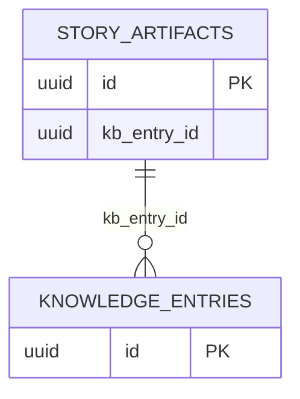

# Artifacts Schema

The `artifacts` schema contains all artifact storage tables used by the workflow system.

## Tables Overview

| Table                       | Description                 | Primary Key |
| --------------------------- | --------------------------- | ----------- |
| story_artifacts             | Core artifact metadata      | uuid id     |
| artifact_analyses           | Code analysis artifacts     | uuid id     |
| artifact_checkpoints        | Phase checkpoint artifacts  | uuid id     |
| artifact_completion_reports | Story completion reports    | uuid id     |
| artifact_contexts           | Context artifacts           | uuid id     |
| artifact_dev_feasibility    | Dev feasibility studies     | uuid id     |
| artifact_elaborations       | Story elaboration artifacts | uuid id     |
| artifact_evidence           | Implementation evidence     | uuid id     |
| artifact_fix_summaries      | Fix cycle summaries         | uuid id     |
| artifact_plans              | Implementation plans        | uuid id     |
| artifact_proofs             | Proof artifacts             | uuid id     |
| artifact_qa_gates           | QA gate decisions           | uuid id     |
| artifact_reviews            | Code review artifacts       | uuid id     |
| artifact_scopes             | Scope definition artifacts  | uuid id     |
| artifact_story_seeds        | Story seed artifacts        | uuid id     |
| artifact_test_plans         | Test plan artifacts         | uuid id     |
| artifact_uiux_notes         | UI/UX notes artifacts       | uuid id     |
| artifact_verifications      | QA verification artifacts   | uuid id     |

## Entity Relationship Diagram

## Core Artifact Table

### story_artifacts

Central artifact metadata table.

| Column        | Type      | Constraints | Description                    |
| ------------- | --------- | ----------- | ------------------------------ |
| id            | uuid      | PK          | Primary key                    |
| story_id      | text      |             | Associated story               |
| artifact_type | text      |             | Type of artifact               |
| artifact_name | text      |             | Human-readable name            |
| kb_entry_id   | uuid      | FK          | Reference to knowledge_entries |
| file_path     | text      |             | File system path               |
| phase         | text      |             | Workflow phase                 |
| iteration     | integer   |             | Iteration number               |
| summary       | jsonb     |             | Summary data                   |
| content       | jsonb     |             | Full content                   |
| created_at    | timestamp |             | Creation timestamp             |
| updated_at    | timestamp |             | Last update                    |

## Artifact Type Tables

Each artifact type table stores full content for that specific type. All follow a similar pattern:

### artifact_analyses

| Column     | Type      | Description        |
| ---------- | --------- | ------------------ |
| id         | uuid      | Primary key        |
| story_id   | text      | Associated story   |
| content    | jsonb     | Analysis content   |
| metadata   | jsonb     | Analysis metadata  |
| created_at | timestamp | Creation timestamp |

### artifact_checkpoints

| Column     | Type      | Description         |
| ---------- | --------- | ------------------- |
| id         | uuid      | Primary key         |
| story_id   | text      | Associated story    |
| content    | jsonb     | Checkpoint content  |
| metadata   | jsonb     | Checkpoint metadata |
| created_at | timestamp | Creation timestamp  |

### artifact_completion_reports

| Column     | Type      | Description        |
| ---------- | --------- | ------------------ |
| id         | uuid      | Primary key        |
| story_id   | text      | Associated story   |
| content    | jsonb     | Completion report  |
| metadata   | jsonb     | Report metadata    |
| created_at | timestamp | Creation timestamp |

### artifact_contexts

| Column     | Type      | Description        |
| ---------- | --------- | ------------------ |
| id         | uuid      | Primary key        |
| story_id   | text      | Associated story   |
| content    | jsonb     | Context content    |
| metadata   | jsonb     | Context metadata   |
| created_at | timestamp | Creation timestamp |

### artifact_dev_feasibility

| Column     | Type      | Description               |
| ---------- | --------- | ------------------------- |
| id         | uuid      | Primary key               |
| story_id   | text      | Associated story          |
| content    | jsonb     | Feasibility study content |
| metadata   | jsonb     | Study metadata            |
| created_at | timestamp | Creation timestamp        |

### artifact_elaborations

| Column     | Type      | Description          |
| ---------- | --------- | -------------------- |
| id         | uuid      | Primary key          |
| story_id   | text      | Associated story     |
| content    | jsonb     | Elaboration content  |
| metadata   | jsonb     | Elaboration metadata |
| created_at | timestamp | Creation timestamp   |

### artifact_evidence

| Column     | Type      | Description        |
| ---------- | --------- | ------------------ |
| id         | uuid      | Primary key        |
| story_id   | text      | Associated story   |
| content    | jsonb     | Evidence content   |
| metadata   | jsonb     | Evidence metadata  |
| created_at | timestamp | Creation timestamp |

### artifact_fix_summaries

| Column     | Type      | Description         |
| ---------- | --------- | ------------------- |
| id         | uuid      | Primary key         |
| story_id   | text      | Associated story    |
| content    | jsonb     | Fix summary content |
| metadata   | jsonb     | Summary metadata    |
| created_at | timestamp | Creation timestamp  |

### artifact_plans

| Column     | Type      | Description        |
| ---------- | --------- | ------------------ |
| id         | uuid      | Primary key        |
| story_id   | text      | Associated story   |
| content    | jsonb     | Plan content       |
| metadata   | jsonb     | Plan metadata      |
| created_at | timestamp | Creation timestamp |

### artifact_proofs

| Column     | Type      | Description        |
| ---------- | --------- | ------------------ |
| id         | uuid      | Primary key        |
| story_id   | text      | Associated story   |
| content    | jsonb     | Proof content      |
| metadata   | jsonb     | Proof metadata     |
| created_at | timestamp | Creation timestamp |

### artifact_qa_gates

| Column     | Type      | Description        |
| ---------- | --------- | ------------------ |
| id         | uuid      | Primary key        |
| story_id   | text      | Associated story   |
| content    | jsonb     | QA gate content    |
| metadata   | jsonb     | Gate metadata      |
| created_at | timestamp | Creation timestamp |

### artifact_reviews

| Column     | Type      | Description        |
| ---------- | --------- | ------------------ |
| id         | uuid      | Primary key        |
| story_id   | text      | Associated story   |
| content    | jsonb     | Review content     |
| metadata   | jsonb     | Review metadata    |
| created_at | timestamp | Creation timestamp |

### artifact_scopes

| Column     | Type      | Description        |
| ---------- | --------- | ------------------ |
| id         | uuid      | Primary key        |
| story_id   | text      | Associated story   |
| content    | jsonb     | Scope content      |
| metadata   | jsonb     | Scope metadata     |
| created_at | timestamp | Creation timestamp |

### artifact_story_seeds

| Column     | Type      | Description        |
| ---------- | --------- | ------------------ |
| id         | uuid      | Primary key        |
| story_id   | text      | Associated story   |
| content    | jsonb     | Story seed content |
| metadata   | jsonb     | Seed metadata      |
| created_at | timestamp | Creation timestamp |

### artifact_test_plans

| Column     | Type      | Description        |
| ---------- | --------- | ------------------ |
| id         | uuid      | Primary key        |
| story_id   | text      | Associated story   |
| content    | jsonb     | Test plan content  |
| metadata   | jsonb     | Plan metadata      |
| created_at | timestamp | Creation timestamp |

### artifact_uiux_notes

| Column     | Type      | Description         |
| ---------- | --------- | ------------------- |
| id         | uuid      | Primary key         |
| story_id   | text      | Associated story    |
| content    | jsonb     | UI/UX notes content |
| metadata   | jsonb     | Notes metadata      |
| created_at | timestamp | Creation timestamp  |

### artifact_verifications

| Column     | Type      | Description           |
| ---------- | --------- | --------------------- |
| id         | uuid      | Primary key           |
| story_id   | text      | Associated story      |
| content    | jsonb     | Verification content  |
| metadata   | jsonb     | Verification metadata |
| created_at | timestamp | Creation timestamp    |

## Usage Pattern

The artifact system works as follows:

1. **story_artifacts** serves as an index - it tracks what artifacts exist for each story with metadata
2. **Type-specific tables** store the full content for each artifact type
3. **KB integration** - story_artifacts can link to knowledge_entries for semantic search

## Foreign Key Summary

| Source          | Column      | Target               | On Delete |
| --------------- | ----------- | -------------------- | --------- |
| story_artifacts | kb_entry_id | knowledge_entries.id | SET NULL  |
