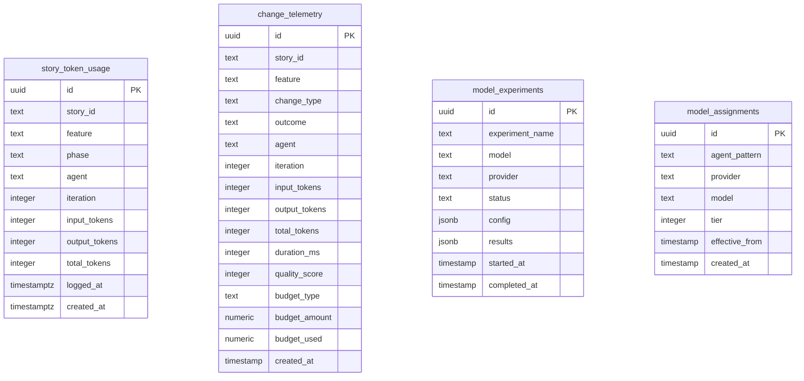

# Analytics Schema

The `analytics` schema contains telemetry and metrics tables for tracking usage, experiments, and performance.

## Tables Overview

| Table             | Description                  | Primary Key |
| ----------------- | ---------------------------- | ----------- |
| story_token_usage | Token usage per story/phase  | uuid id     |
| change_telemetry  | Change outcome tracking      | uuid id     |
| model_experiments | ML model experiment tracking | uuid id     |
| model_assignments | Model assignment rules       | uuid id     |

## Entity Relationship Diagram



## Tables

### story_token_usage

Tracks token consumption per story and phase for cost analysis.

| Column        | Type        | Constraints | Description        |
| ------------- | ----------- | ----------- | ------------------ |
| id            | uuid        | PK          | Primary key        |
| story_id      | text        |             | Story identifier   |
| feature       | text        |             | Feature prefix     |
| phase         | text        |             | Workflow phase     |
| agent         | text        |             | Agent name         |
| iteration     | integer     |             | Iteration number   |
| input_tokens  | integer     |             | Input token count  |
| output_tokens | integer     |             | Output token count |
| total_tokens  | integer     |             | Total tokens       |
| logged_at     | timestamptz |             | Log timestamp      |
| created_at    | timestamptz |             | Record creation    |

**Phases tracked:**

- pm-generate, pm-elaborate, pm-refine, dev-setup
- dev-implementation, dev-fix, code-review
- qa-verification, qa-gate, architect-review, other

### change_telemetry

Tracks change outcomes for analysis and improvement.

| Column        | Type      | Constraints | Description           |
| ------------- | --------- | ----------- | --------------------- |
| id            | uuid      | PK          | Primary key           |
| story_id      | text      |             | Story identifier      |
| feature       | text      |             | Feature prefix        |
| change_type   | text      |             | Type of change        |
| outcome       | text      |             | Outcome               |
| agent         | text      |             | Agent name            |
| iteration     | integer   |             | Iteration number      |
| input_tokens  | integer   |             | Input token count     |
| output_tokens | integer   |             | Output token count    |
| total_tokens  | integer   |             | Total tokens          |
| duration_ms   | integer   |             | Execution duration    |
| quality_score | integer   |             | Quality score (0-100) |
| budget_type   | text      |             | Budget type           |
| budget_amount | numeric   |             | Budget allocated      |
| budget_used   | numeric   |             | Budget consumed       |
| created_at    | timestamp |             | Record creation       |

### model_experiments

Tracks ML model experiments and results.

| Column          | Type      | Constraints | Description              |
| --------------- | --------- | ----------- | ------------------------ |
| id              | uuid      | PK          | Primary key              |
| experiment_name | text      |             | Experiment identifier    |
| model           | text      |             | Model name               |
| provider        | text      |             | Model provider           |
| status          | text      |             | Experiment status        |
| config          | jsonb     |             | Experiment configuration |
| results         | jsonb     |             | Experiment results       |
| started_at      | timestamp |             | Start timestamp          |
| completed_at    | timestamp |             | Completion timestamp     |

### model_assignments

Rules for assigning models to agents.

| Column         | Type      | Constraints | Description            |
| -------------- | --------- | ----------- | ---------------------- |
| id             | uuid      | PK          | Primary key            |
| agent_pattern  | text      |             | Agent pattern to match |
| provider       | text      |             | Model provider         |
| model          | text      |             | Model name             |
| tier           | integer   |             | Priority tier          |
| effective_from | timestamp |             | When rule takes effect |
| created_at     | timestamp |             | Record creation        |

## Usage

### Cost Tracking

```sql
-- Total cost per story
SELECT story_id, SUM(total_tokens) as tokens, SUM(estimated_cost) as cost
FROM story_token_usage
GROUP BY story_id;

-- Cost by phase
SELECT phase, SUM(total_tokens) as tokens, SUM(estimated_cost) as cost
FROM story_token_usage
GROUP BY phase;
```

### Experiment Analysis

```sql
-- Model performance comparison
SELECT model, AVG(quality_score) as avg_quality, AVG(duration_ms) as avg_duration
FROM model_experiments
WHERE status = 'completed'
GROUP BY model;
```

## Notes

- No foreign keys in analytics schema - it's intentionally isolated
- Data is append-only for historical analysis
- Used by workflow agents for optimization and reporting
