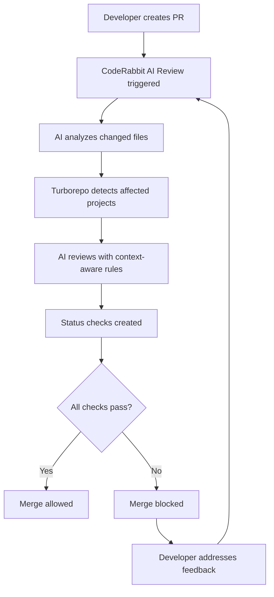

# CodeRabbit Integration with Turborepo CI/CD

## 🤖 Overview

CodeRabbit is now fully integrated into your pre-merge workflow, providing AI-powered code reviews that work seamlessly with your Turborepo-based CI/CD system. This ensures every pull request gets comprehensive AI review before merging.

## ✅ What's Been Integrated

### 1. Enhanced CodeRabbit Configuration
**File**: `.coderabbit.yaml`

**New Features**:
- ✅ **Turborepo-aware reviews** - Understands monorepo structure
- ✅ **Monorepo dependency analysis** - Reviews cross-package impacts
- ✅ **Build optimization suggestions** - Identifies performance issues
- ✅ **Custom rules** for Turborepo patterns and package dependencies
- ✅ **Integration with Auggie** - Collaborative AI assistance

### 2. Required Status Checks
**Files**: `.github/workflows/coderabbit-status.yml`

**Status Checks**:
- ✅ **CodeRabbit AI Review** - Ensures AI review is completed
- ✅ **Quality Gates** - Validates code quality standards
- ✅ **Build verification** for changed projects only
- ✅ **Test coverage** requirements for significant changes

### 3. Branch Protection Integration
**Files**: `.github/branch-protection.yml`, `scripts/setup-branch-protection.sh`

**Required Before Merge**:
- ✅ **CodeRabbit AI Review** status check must pass
- ✅ **Quality Gates** must pass
- ✅ **All existing CI checks** (tests, linting, build)
- ✅ **Human review** (at least 1 approval)

### 4. Turborepo-Specific Review Rules

**Smart Review Focus**:
- 🎯 **Frontend changes** → UX, accessibility, React best practices
- 🎯 **Backend changes** → Security, performance, API design
- 🎯 **Shared packages** → Reusability, testing, documentation
- 🎯 **Cross-package changes** → Dependency impact analysis

## 🔄 How It Works

### Pull Request Workflow



### Status Check Flow

1. **CodeRabbit AI Review**
   - ✅ AI review completed
   - ✅ No critical issues found
   - ❌ Blocks merge if review pending or issues found

2. **Quality Gates**
   - ✅ Build passes for affected projects
   - ✅ Test coverage adequate for changes
   - ✅ No large changes without tests
   - ❌ Blocks merge if quality standards not met

## 🎯 Review Focus Areas

### Monorepo-Specific Checks

**Package Dependencies**:
```typescript
// ❌ CodeRabbit will flag this
import { Button } from '../../../packages/ui/src/Button'

// ✅ CodeRabbit will approve this
import { Button } from '@repo/ui'
```

**Turborepo Configuration**:
```json
// CodeRabbit checks if new scripts are added to turbo.json
{
  "scripts": {
    "new-task": "echo 'new task'"  // Should be in turbo.json
  }
}
```

**Cross-Package Impact**:
- Reviews changes to shared packages for breaking changes
- Suggests updating dependent packages when APIs change
- Validates that package.json dependencies are properly declared

### Quality Standards

**Test Coverage**:
- Large changes (>10 files) require corresponding tests
- New features must include test files
- Critical paths must maintain test coverage

**Performance**:
- Bundle size impact analysis
- Build optimization suggestions
- Dependency bloat detection

**Security**:
- Hardcoded secrets detection
- Vulnerable dependency identification
- API security best practices

## 🚀 Setup Instructions

### 1. Configure Branch Protection (Required)

```bash
# Run the enhanced branch protection setup
./scripts/setup-branch-protection.sh
```

This will configure GitHub to require:
- CodeRabbit AI Review ✅
- Quality Gates ✅
- All existing CI checks ✅

### 2. Test the Integration

```bash
# Test CodeRabbit integration
./scripts/test-coderabbit-integration.sh

# Create a test PR
git checkout -b test-coderabbit
echo "// Test CodeRabbit integration" >> apps/web/lego-moc-instructions-app/src/main.tsx
git add . && git commit -m "test: CodeRabbit integration"
git push origin test-coderabbit

# Create PR (if GitHub CLI is available)
gh pr create --title "Test: CodeRabbit Integration" --body "Testing AI review integration"
```

### 3. Verify the Workflow

1. **Check PR status checks** - Should see "CodeRabbit AI Review" and "Quality Gates"
2. **Wait for AI review** - CodeRabbit bot will comment with analysis
3. **Verify merge protection** - Merge should be blocked until checks pass
4. **Test quality gates** - Try changes without tests to see gates fail

## 📊 Benefits

### ✅ Code Quality
- **Consistent reviews** - AI applies same standards across all PRs
- **Monorepo awareness** - Understands cross-package dependencies
- **Best practices** - Enforces TypeScript, React, and security standards
- **Performance focus** - Identifies optimization opportunities

### ✅ Team Productivity
- **Faster reviews** - AI provides immediate feedback
- **Learning tool** - Developers learn from AI suggestions
- **Reduced review burden** - Human reviewers focus on business logic
- **24/7 availability** - AI reviews work around the clock

### ✅ Risk Reduction
- **Catch issues early** - Problems identified before merge
- **Security scanning** - Automated vulnerability detection
- **Breaking change detection** - Cross-package impact analysis
- **Quality gates** - Prevent low-quality code from merging

## 🔧 Customization

### Adjust Review Sensitivity

Edit `.coderabbit.yaml`:

```yaml
reviews:
  focus_areas:
    - security          # Always enabled
    - performance       # Always enabled
    - maintainability   # Can be adjusted
    - accessibility     # Frontend-specific
    - testing          # Can be made stricter
```

### Modify Quality Gates

Edit `.github/workflows/coderabbit-status.yml`:

```yaml
# Adjust thresholds
- name: Check Quality Gates
  env:
    MAX_FILES_WITHOUT_TESTS: 5    # Default: 10
    REQUIRE_TESTS_FOR_FEATURES: true
    FAIL_ON_BUILD_ERRORS: true
```

### Add Custom Rules

Edit `.coderabbit.yaml`:

```yaml
custom_rules:
  - name: "custom_pattern"
    description: "Your custom rule description"
    pattern: "your-regex-pattern"
    suggestion: "Your suggestion for improvement"
```

## 📈 Monitoring

### GitHub Insights
- View CodeRabbit review frequency and impact
- Monitor quality gate pass/fail rates
- Track time-to-merge improvements

### CodeRabbit Dashboard
- Access detailed review analytics
- View team learning metrics
- Monitor code quality trends

## 🎉 What You've Achieved

Your monorepo now has **enterprise-grade AI-powered code review** that:

- ✅ **Blocks low-quality code** from reaching main branch
- ✅ **Provides instant feedback** on every pull request
- ✅ **Understands monorepo complexity** and cross-package dependencies
- ✅ **Integrates seamlessly** with your Turborepo CI/CD pipeline
- ✅ **Maintains high standards** consistently across all changes
- ✅ **Reduces review burden** on human reviewers
- ✅ **Catches issues early** before they impact production

**Result**: Higher code quality, faster development cycles, and reduced bugs in production! 🚀

## 🔗 Related Documentation

- [Turborepo CI Integration](./TURBOREPO_CI_INTEGRATION.md)
- [Frontend CI Setup](./FRONTEND_CI_SUMMARY.md)
- [GitHub Deployment Setup](./GITHUB_DEPLOYMENT_SETUP.md)
- [Branch Protection Configuration](./.github/branch-protection.yml)
