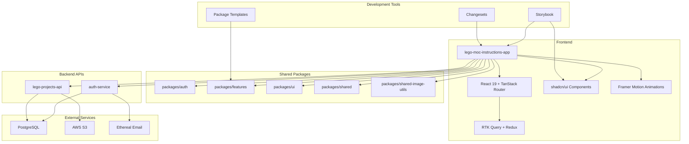

# System Architecture

## Overview

This document describes the high-level architecture of the LEGO MOC Instructions application, including service boundaries, data flow, and rationale for key technology choices.

## Architecture Diagram

## Service Boundaries

### **Frontend Application**
- **lego-moc-instructions-app**: Main React application for LEGO MOC instructions and gallery
- **Technology Stack**: React 19, TanStack Router, RTK Query, shadcn/ui, Framer Motion
- **Responsibilities**: User interface, state management, routing, authentication flow, animations

### **Backend Services**
- **auth-service**: Authentication and user management
  - User registration, login, password reset
  - JWT token management
  - Email verification and password reset flows
- **lego-projects-api**: LEGO projects and gallery management
  - Project CRUD operations
  - File upload and storage
  - Gallery management
  - Search and filtering

### **Shared Packages**
- **packages/auth**: Authentication components and utilities
- **packages/features**: Feature-specific functionality
  - FileUpload - File upload components and utilities
  - gallery - Image gallery functionality with drag & drop
  - profile - User profile management with avatar cropping
  - wishlist - Wishlist functionality with auto-save
  - moc-instructions - MOC instruction features
  - ImageUploadModal - Image upload modal component
- **packages/ui**: Reusable UI component library
- **packages/shared**: Common utilities and configurations
- **packages/shared-image-utils**: Image processing and manipulation utilities
- **packages/tech-radar**: Technology assessment tools

### **Development Tools**
- **Storybook**: Centralized component development and testing
- **Changesets**: Semantic versioning and release management
- **Package Templates**: Standardized package creation system

## Data Flow

### **Authentication Flow**
1. User submits login/signup form → Frontend
2. Frontend calls auth-service → Backend
3. Backend validates credentials → Database
4. Backend returns JWT token → Frontend
5. Frontend stores token and updates auth state

### **File Upload Flow**
1. User selects file → Frontend
2. Frontend uploads to lego-projects-api → Backend
3. Backend processes file → S3 Storage
4. Backend returns file URL → Frontend
5. Frontend updates UI with uploaded file

### **Image Processing Flow**
1. User uploads image → Frontend
2. Frontend processes with shared-image-utils → Image optimization
3. Frontend uploads optimized image → Backend
4. Backend stores in S3 → Database
5. Frontend displays processed image

### **Email Flow**
1. User requests password reset → Frontend
2. Frontend calls auth-service → Backend
3. Backend generates reset token → Database
4. Backend sends email via Ethereal → Email Service
5. User clicks link → Frontend (with token)
6. Frontend calls reset endpoint → Backend

## Key Technology Choices

### **Frontend**
- **React 19**: Latest React version with improved performance and features
- **TanStack Router**: Type-safe routing with file-based routing
- **RTK Query**: Modern, scalable state management and API caching
- **shadcn/ui**: High-quality, accessible UI components
- **Framer Motion**: Smooth animations and transitions
- **react-easy-crop**: User-friendly image cropping
- **@dnd-kit**: Modern drag and drop functionality
- **Vitest**: Fast, reliable testing framework

### **Styling & Design**
- **Tailwind CSS v4**: Latest version with improved performance and modern features
- **CSS-based configuration**: Design tokens and theme management
- **Responsive design**: Mobile-first approach with breakpoint system
- **Accessibility**: WCAG 2.1 AA compliance with proper ARIA labels

### **Backend**
- **Node.js/Express**: Fast, scalable server runtime
- **Drizzle ORM**: Type-safe, modern PostgreSQL access
- **JWT**: Stateless authentication
- **Ethereal Email**: Email testing and development
- **Sharp**: Image processing and optimization

### **Infrastructure**
- **Monorepo**: Simplifies dependency management and code sharing
- **PostgreSQL**: Reliable, ACID-compliant database
- **AWS S3**: Scalable file storage
- **Serverless-ready**: APIs designed for AWS Lambda migration

### **Development Tools**
- **Storybook**: Component development and testing
- **Changesets**: Semantic versioning and release management
- **Package Templates**: Standardized package creation
- **pnpm**: Fast, efficient package management
- **Vite**: Fast build tool with excellent developer experience
- **Turbo**: Fast monorepo build system

### **Testing**
- **Vitest**: Unit and integration testing
- **React Testing Library**: Component testing
- **Playwright**: End-to-end testing
- **vitest-axe**: Accessibility testing
- **Ethereal Email**: Email flow testing
- **Storybook**: Component development and testing

## Security Considerations

- **JWT Authentication**: Secure, stateless user sessions
- **Password Hashing**: bcrypt for secure password storage
- **File Validation**: Server-side file type and size validation
- **CORS**: Proper cross-origin request handling
- **Rate Limiting**: API endpoint protection
- **Input Sanitization**: Zod schema validation for all inputs

## Performance Optimizations

### **Frontend**
- **Code Splitting**: Route-based and component-based splitting
- **Lazy Loading**: Images and components loaded on demand
- **Bundle Optimization**: Tree shaking and dead code elimination
- **Caching**: RTK Query caching, browser caching, service worker
- **Image Optimization**: WebP format, responsive images, lazy loading

### **Backend**
- **Database Optimization**: Proper indexing, query optimization
- **Caching**: Redis for session and data caching
- **Connection Pooling**: Database connection management
- **File Processing**: Async image processing and optimization

## Extensibility

### **Adding New Features**
- New features can be added as packages in `packages/features/`
- Shared functionality goes in `packages/shared/`
- UI components in `packages/ui/`
- Image processing utilities in `packages/shared-image-utils/`

### **Adding New Services**
- New APIs can be added to `apps/api/`
- New frontend apps can be added to `apps/web/`
- All services can share common packages

### **Package Creation**
- Use package templates for consistent structure
- Follow established patterns for configuration
- Include comprehensive testing and documentation

### **Scaling Considerations**
- APIs are designed for serverless deployment
- Database can be scaled horizontally
- File storage is cloud-native
- Frontend can be deployed to CDN
- Monorepo structure supports team scaling

## Monitoring & Observability

### **Application Monitoring**
- Error tracking with comprehensive logging
- Performance monitoring for all endpoints
- User behavior analytics
- Real-time alerting for critical issues

### **Development Monitoring**
- Storybook for component development
- Automated testing with coverage reporting
- Code quality metrics and linting
- Dependency vulnerability scanning

### **Release Management**
- Semantic versioning with Changesets
- Automated changelog generation
- Staged rollouts and rollback capabilities
- Environment-specific configurations 