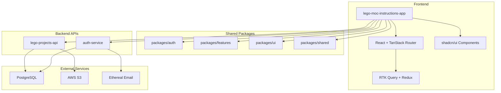

# System Architecture

## Overview

This document describes the high-level architecture of the LEGO MOC Instructions application, including service boundaries, data flow, and rationale for key technology choices.

## Architecture Diagram

## Service Boundaries

### **Frontend Application**
- **lego-moc-instructions-app**: Main React application for LEGO MOC instructions and gallery
- **Technology Stack**: React, TanStack Router, RTK Query, shadcn/ui
- **Responsibilities**: User interface, state management, routing, authentication flow

### **Backend Services**
- **auth-service**: Authentication and user management
  - User registration, login, password reset
  - JWT token management
  - Email verification and password reset flows
- **lego-projects-api**: LEGO projects and gallery management
  - Project CRUD operations
  - File upload and storage
  - Gallery management
  - Search and filtering

### **Shared Packages**
- **packages/auth**: Authentication components and utilities
- **packages/features**: Feature-specific functionality (FileUpload, gallery, profile, wishlist)
- **packages/ui**: Reusable UI component library
- **packages/shared**: Common utilities and configurations
- **packages/tech-radar**: Technology assessment tools

## Data Flow

### **Authentication Flow**
1. User submits login/signup form → Frontend
2. Frontend calls auth-service → Backend
3. Backend validates credentials → Database
4. Backend returns JWT token → Frontend
5. Frontend stores token and updates auth state

### **File Upload Flow**
1. User selects file → Frontend
2. Frontend uploads to lego-projects-api → Backend
3. Backend processes file → S3 Storage
4. Backend returns file URL → Frontend
5. Frontend updates UI with uploaded file

### **Email Flow**
1. User requests password reset → Frontend
2. Frontend calls auth-service → Backend
3. Backend generates reset token → Database
4. Backend sends email via Ethereal → Email Service
5. User clicks link → Frontend (with token)
6. Frontend calls reset endpoint → Backend

## Key Technology Choices

### **Frontend**
- **React**: Modern, component-based UI library
- **TanStack Router**: Type-safe routing with file-based routing
- **RTK Query**: Modern, scalable state management and API caching
- **shadcn/ui**: High-quality, accessible UI components
- **Vitest**: Fast, reliable testing framework

### **Backend**
- **Node.js/Express**: Fast, scalable server runtime
- **Drizzle ORM**: Type-safe, modern PostgreSQL access
- **JWT**: Stateless authentication
- **Ethereal Email**: Email testing and development

### **Infrastructure**
- **Monorepo**: Simplifies dependency management and code sharing
- **PostgreSQL**: Reliable, ACID-compliant database
- **AWS S3**: Scalable file storage
- **Serverless-ready**: APIs designed for AWS Lambda migration

### **Testing**
- **Vitest**: Unit and integration testing
- **Playwright**: End-to-end testing
- **Ethereal Email**: Email flow testing

## Security Considerations

- **JWT Authentication**: Secure, stateless user sessions
- **Password Hashing**: bcrypt for secure password storage
- **File Validation**: Server-side file type and size validation
- **CORS**: Proper cross-origin request handling
- **Rate Limiting**: API endpoint protection

## Extensibility

### **Adding New Features**
- New features can be added as packages in `packages/features/`
- Shared functionality goes in `packages/shared/`
- UI components in `packages/ui/`

### **Adding New Services**
- New APIs can be added to `apps/api/`
- New frontend apps can be added to `apps/web/`
- All services can share common packages

### **Scaling Considerations**
- APIs are designed for serverless deployment
- Database can be scaled horizontally
- File storage is cloud-native
- Frontend can be deployed to CDN 