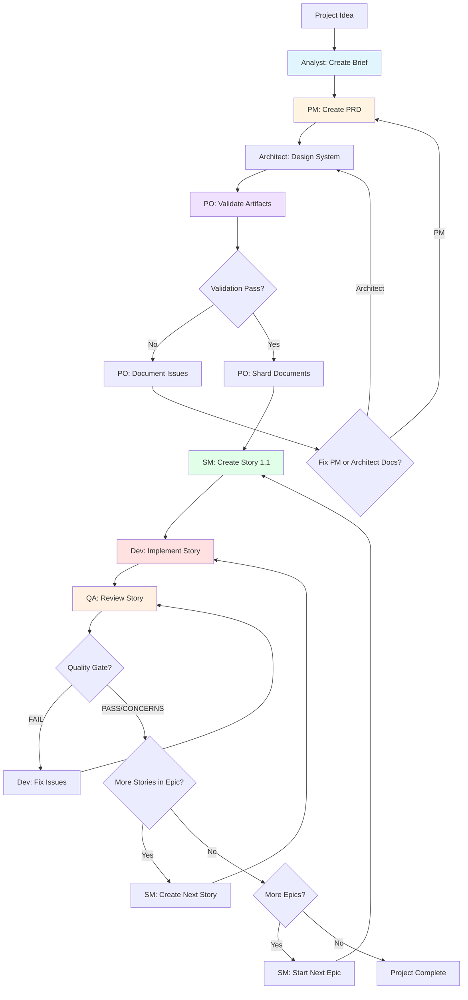
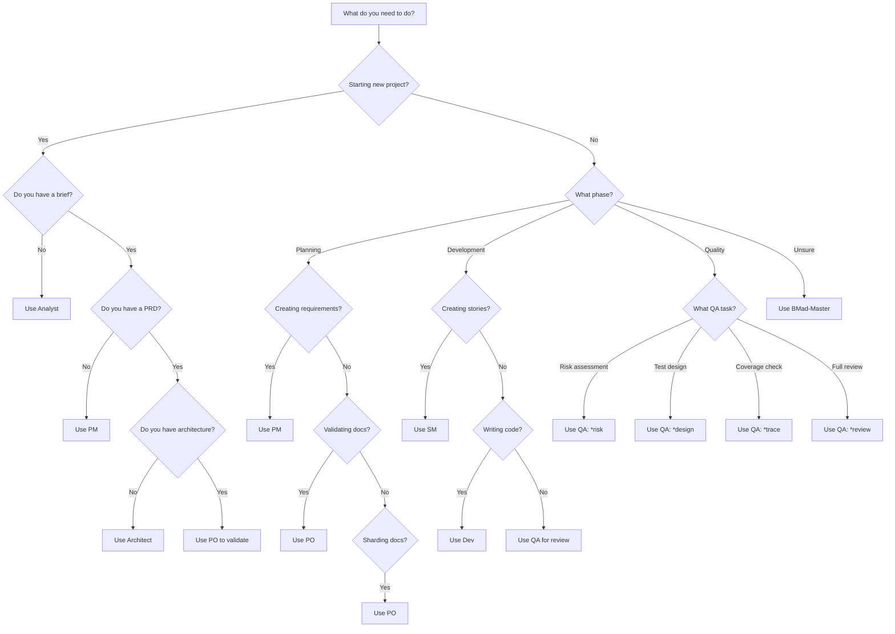

4# BMAD Agent Guide: Roles, Responsibilities, and When to Use Each Agent

## Overview

BMAD uses specialized AI agents with distinct personas to handle different phases of software development. This guide clarifies **who does what**, **when to use which agent**, and the critical differences between similar-sounding roles like PM, PO, and SM.

---

## Quick Reference Table: All BMAD Agents

| Agent | Persona Name | Primary Phase | Main Responsibility | When to Use |
|-------|--------------|---------------|---------------------|-------------|
| **Analyst** | Mary | Discovery | Business research, problem analysis, project briefs | Starting new projects, market research, understanding user needs |
| **PM** | John | Planning | Product requirements, PRD creation, feature prioritization | Translating business needs into technical requirements |
| **UX Expert** | - | Design | UI/UX specifications, design goals, user flows | Front-end projects requiring detailed design specs |
| **Architect** | - | Design | System architecture, technical design, standards | Defining technical approach, patterns, and infrastructure |
| **PO** | Sarah | Validation | Quality control, document validation, sharding | Reviewing artifacts, splitting large docs, coordinating phases |
| **SM** | - | Development | Story creation, sprint planning, backlog management | Creating detailed developer stories from epics |
| **Dev** | - | Development | Code implementation, testing, story completion | Writing code, implementing features, running tests |
| **QA** | Quinn | Quality Assurance | Test strategy, quality gates, risk assessment | Reviewing code quality, ensuring test coverage, risk analysis |
| **BMad-Master** | - | Any | Can perform any task except dev implementation | When you need flexibility or unsure which agent to use |
| **BMad-Orchestrator** | - | Coordination | Morphs into other agents, coordinates workflow | Web UI only, manages multi-agent workflows |

---

## The Critical Difference: PM vs PO vs SM

These three roles are often confused because they all work with requirements and stories, but they operate at **different levels of abstraction** and **different phases** of the workflow.

### Comparison Table

| Aspect | PM (Product Manager) | PO (Product Owner) | SM (Scrum Master) |
|--------|---------------------|-------------------|-------------------|
| **Persona** | John | Sarah | (unnamed) |
| **Phase** | Planning | Validation & Coordination | Development |
| **Input** | Project Brief | PRD, Architecture | Epic Requirements |
| **Output** | PRD with Epics & Stories | Validated & Sharded Docs | Detailed Developer Stories |
| **Abstraction Level** | **High** - Business requirements | **Medium** - Quality & Structure | **Low** - Implementation details |
| **Focus** | **What** to build and **why** | **Quality** and **readiness** | **How** to build (tasks) |
| **Typical Questions** | "What features solve the business problem?" | "Are all docs complete and consistent?" | "What specific tasks implement this epic?" |
| **Decision Authority** | Feature scope, priorities | Go/no-go on artifacts | Story sizing, task breakdown |
| **Stakeholders** | Business, users, execs | Development team, PM, Architect | Developers, QA |
| **Artifact Ownership** | PRD (entire document) | Validation reports, sharded docs | Individual story files |
| **Timeline** | Early (after brief) | Mid (before dev starts) | Ongoing (per epic/sprint) |

### Workflow Sequence

```
Project Brief
     ↓
[PM] Creates PRD with high-level epics and story outlines
     ↓
[PO] Validates PRD + Architecture are complete and consistent
     ↓
[PO] Shards documents into smaller files for agents
     ↓
[SM] Creates detailed story 1.1 from Epic 1 requirements
     ↓
[Dev] Implements story 1.1
     ↓
[SM] Creates story 1.2, 1.3, ... (continues through epic)
```

### Detailed Comparison

#### PM (Product Manager) - John

**Role**: Strategic product planner who translates business needs into technical requirements.

**When to Use**:
- After completing the project brief
- When defining what features the product needs
- When prioritizing features for MVP vs post-MVP
- When writing functional and non-functional requirements

**Responsibilities**:
1. Read and understand the project brief
2. Create comprehensive PRD with:
   - Functional requirements (FR1, FR2, ...)
   - Non-functional requirements (NFR1, NFR2, ...)
   - UI design goals (if applicable)
   - Epic breakdown (major feature groupings)
   - Story outlines (high-level descriptions)
3. Define acceptance criteria for epics
4. Prioritize features and stories
5. Estimate epic-level effort (hours/points)

**Output Example** (from PRD):
```markdown
## Epic 2: Lambda Implementation (24 hours)

### Stories:
- **Story 2.1**: Create base Lambda handler structure (4 hours)
  - Set up handler boilerplate
  - Configure event parsing
  - AC: Handler accepts S3 events and processes them

- **Story 2.2**: Implement image processing logic (8 hours)
  - Sharp integration for resizing
  - Format conversion (JPEG, PNG, WebP)
  - AC: Images processed to multiple sizes
```

**Key Insight**: PM defines **what** features exist and **why** they matter, but not the detailed **how** to implement them.

---

#### PO (Product Owner) - Sarah

**Role**: Quality gatekeeper who ensures all artifacts are complete, consistent, and ready for development.

**When to Use**:
- After PM creates PRD and Architect creates architecture
- Before starting development
- When you need to split large documents for easier consumption
- When coordinating between different phases

**Responsibilities**:
1. **Validate artifacts**:
   - PRD is complete and consistent
   - Architecture aligns with PRD requirements
   - All epics have clear acceptance criteria
   - No contradictions or gaps between documents
2. **Shard large documents**:
   - Split PRD into epic files
   - Split architecture into topic files
   - Create manageable chunks for agents to consume
3. **Coordinate handoffs**:
   - PRD → Architecture → Stories
   - Ensure all prerequisite artifacts exist before next phase
4. **Maintain traceability**:
   - Verify requirements map to architecture
   - Ensure stories trace back to epics

**Output Example** (validation checklist):
```markdown
## Artifact Validation Report

### PRD Status: ✅ APPROVED
- All 6 epics defined with clear scope
- Functional requirements complete (FR1-FR12)
- Non-functional requirements documented (NFR1-NFR5)
- Success metrics defined

### Architecture Status: ✅ APPROVED
- Tech stack aligns with NFR requirements
- All epic dependencies addressed
- Security considerations documented

### Readiness for Development: ✅ GO
- Documents sharded to docs/prd/ and docs/architecture/
- Ready for SM to create Story 1.1
```

**Key Insight**: PO doesn't create new requirements or stories—they ensure **quality and readiness** of existing artifacts.

---

#### SM (Scrum Master)

**Role**: Story specialist who creates detailed, implementation-ready developer stories.

**When to Use**:
- After PO validates and shards documents
- When starting a new epic
- When developers need the next story to implement
- Iteratively throughout development (story by story)

**Responsibilities**:
1. **Read epic requirements** from sharded PRD
2. **Read architecture context** for technical guidance
3. **Create detailed story files** with:
   - User story format ("As a X, I want Y, so that Z")
   - Specific, testable acceptance criteria
   - Task breakdown with subtasks
   - Architecture context (sourced from architecture docs)
   - Technology stack requirements
   - Testing requirements (unit, integration, e2e)
   - Dev notes with implementation guidance
4. **Size stories appropriately** (2-8 hours each)
5. **Ensure stories are self-contained** (dev shouldn't need to read PRD)

**Output Example** (Story 2.1):
```markdown
# Story 2.1: Create Base Lambda Handler Structure

## Status
Draft

## Story
As a developer,
I want a standardized Lambda handler structure,
so that I can consistently process S3 events for image uploads.

## Acceptance Criteria
1. Lambda handler accepts S3 PutObject events
2. Event parsing extracts bucket name and object key
3. Handler validates event structure before processing
4. Error handling returns proper HTTP status codes
5. Handler is typed with TypeScript interfaces

## Tasks / Subtasks
- [ ] Create handler file structure (AC: 1, 2)
  - [ ] Set up `src/functions/image-upload/handler.ts`
  - [ ] Define S3Event TypeScript interface
  - [ ] Implement event parsing function
- [ ] Add input validation (AC: 3)
  - [ ] Validate event.Records exists
  - [ ] Validate required S3 event fields
  - [ ] Add schema validation with Zod
- [ ] Implement error handling (AC: 4)
  - [ ] Catch and log parsing errors
  - [ ] Return 400 for invalid events
  - [ ] Return 500 for unexpected errors
- [ ] Add TypeScript types (AC: 5)
  - [ ] Define ImageUploadEvent interface
  - [ ] Define HandlerResponse interface
  - [ ] Export types for testing

## Dev Notes

### Architecture Context
From `docs/architecture/lambda-patterns.md`:
- Use SST `ApiHandler` wrapper for consistent responses
- Follow error handling pattern: try/catch with structured logging
- All handlers must include CloudWatch metrics

### Technology Stack
- SST v2 for Lambda definitions
- TypeScript 5.0+
- Zod for runtime validation
- AWS SDK v3 for S3 operations

### Testing Requirements
- Unit tests for event parsing (happy path + error cases)
- Mock S3Event fixtures
- Minimum 80% code coverage

## Testing
- Test file: `src/functions/image-upload/handler.test.ts`
- Use Vitest for unit tests
- Mock AWS SDK S3 client operations
```

**Key Insight**: SM provides the **detailed implementation roadmap** that developers follow, including specific tasks, files, and technical context.

---

## Complete Workflow with Agent Transitions



---

## Agent Role Details

### 1. Analyst (Mary)

**Persona**: Business analyst and researcher

**Phase**: Discovery

**Commands/Tasks**:
- `facilitate-brainstorming-session.md`
- `create-doc.md` (with project-brief-tmpl.yaml)

**Input**: Business idea, stakeholder interviews, market research

**Output**: Project Brief with:
- Executive summary
- Problem statement
- Proposed solution
- Target users
- Goals and success metrics
- MVP scope

**When to Use**:
- Starting a new project from scratch
- Need to understand market/user needs
- Conducting brainstorming sessions
- Defining business objectives

**Example Scenario**:
> "We want to build a LEGO MOC management app. We've identified some pain points but need to formalize the business case."
>
> → Use **Analyst** to facilitate brainstorming and create a comprehensive project brief.

---

### 2. PM (Product Manager) - John

**Persona**: Product strategist and requirements author

**Phase**: Planning

**Commands/Tasks**:
- `create-doc.md` (with prd-tmpl.yaml)
- Can use brownfield templates for enhancements

**Input**: Project Brief

**Output**: PRD with:
- Functional requirements (FR1-FRN)
- Non-functional requirements (NFR1-NFRN)
- UI design goals
- Epics with high-level stories
- Success metrics
- Technical assumptions

**When to Use**:
- After project brief is complete
- Defining product features and requirements
- Breaking work into epics
- Prioritizing MVP vs post-MVP features

**Example Scenario**:
> "We have a brief for our LEGO app. Now we need to define exactly what features we're building."
>
> → Use **PM** to create PRD with epics like "User Authentication," "MOC Gallery," "Image Upload," etc.

---

### 3. UX Expert

**Persona**: UI/UX designer

**Phase**: Design (optional, front-end projects)

**Commands/Tasks**:
- `create-doc.md` (with front-end-spec-tmpl.yaml)

**Input**: Project Brief, PRD

**Output**: Front-End Specification with:
- UX vision
- Interaction paradigms
- Core screens and layouts
- Accessibility requirements
- Branding and style guide

**When to Use**:
- Projects with significant UI/UX requirements
- When design system needs documentation
- Complex user flows requiring detailed specs
- Design-first projects

**Example Scenario**:
> "Our LEGO app needs a polished, user-friendly interface. We need detailed design specs."
>
> → Use **UX Expert** to define screen layouts, interaction patterns, and design system.

---

### 4. Architect

**Persona**: Technical architect and system designer

**Phase**: Design

**Commands/Tasks**:
- `create-doc.md` (with architecture-tmpl.yaml)

**Input**: PRD, technical requirements

**Output**: Architecture Document with:
- System architecture overview
- Tech stack decisions
- Data models and schemas
- API design
- Infrastructure requirements
- Security architecture
- Coding standards
- Testing strategy

**When to Use**:
- After PRD is complete
- Defining technical approach
- Making technology stack decisions
- Designing system architecture
- Establishing coding standards

**Example Scenario**:
> "We have our PRD. Now we need to decide: serverless vs containers? PostgreSQL or DynamoDB? REST or GraphQL?"
>
> → Use **Architect** to design system architecture and make tech stack decisions.

---

### 5. PO (Product Owner) - Sarah

**Persona**: Quality gatekeeper and coordinator

**Phase**: Validation & Coordination

**Commands/Tasks**:
- `validate-artifacts.md` (custom task)
- `shard-doc.md`

**Input**: PRD, Architecture, any completed artifacts

**Output**:
- Validation reports
- Sharded documents in `docs/prd/` and `docs/architecture/`
- Go/no-go decisions

**When to Use**:
- After PM completes PRD
- After Architect completes architecture
- Before starting story creation
- When documents are too large for agents
- When coordinating between phases

**Example Scenario**:
> "We have our PRD and Architecture docs. Are they complete? Do they align? Are we ready to start development?"
>
> → Use **PO** to validate all artifacts and shard them for easier consumption.

---

### 6. SM (Scrum Master)

**Persona**: Story creation specialist

**Phase**: Development Planning

**Commands/Tasks**:
- `create-next-story.md`
- `brownfield-create-story.md`

**Input**:
- Sharded PRD (epic requirements)
- Architecture docs
- Previous stories (for context)

**Output**: Detailed story files in `docs/stories/` with:
- User story
- Acceptance criteria
- Task breakdown
- Architecture context
- Tech stack requirements
- Testing requirements
- Dev notes

**When to Use**:
- Starting each new epic
- After completing previous story
- When developers need next work item
- Iteratively throughout development

**Example Scenario**:
> "We're ready to start Epic 1: Infrastructure Setup. We need Story 1.1 with all the details developers need."
>
> → Use **SM** to create detailed Story 1.1 from Epic 1 requirements.

---

### 7. Dev

**Persona**: Software developer

**Phase**: Implementation

**Commands/Tasks**: Implementation work (varies by story)

**Input**: Story file from SM

**Output**:
- Code implementation
- Unit/integration tests
- Updated story with Dev Agent Record

**When to Use**:
- After SM creates story
- Implementing features
- Writing tests
- Fixing bugs

**Example Scenario**:
> "Story 1.1 is ready. Time to write the code."
>
> → Use **Dev** to implement the story, write tests, and complete acceptance criteria.

---

### 8. QA (Quinn)

**Persona**: Test architect and quality assessor

**Phase**: Quality Assurance

**Commands/Tasks**:
- `*risk {story}` - Risk assessment
- `*design {story}` - Test strategy design
- `*trace {story}` - Requirements tracing
- `*nfr {story}` - Non-functional review
- `*review {story}` - Full quality review
- `*gate {story}` - Update quality gate

**Input**: Completed story, code, tests

**Output**: Quality Gate YAML file with:
- Gate decision (PASS/CONCERNS/FAIL/WAIVED)
- Risk summary
- Top issues with severity
- GitHub issue links
- Recommendations

**When to Use**:
- Before starting story (risk assessment)
- During development (trace coverage)
- After story completion (full review)
- Before merging code

**Example Scenario**:
> "Story 1.1 is implemented. Is the code quality good? Are tests sufficient? Any risks?"
>
> → Use **QA** to review story, assess quality, and create quality gate.

---

### 9. BMad-Master

**Persona**: Flexible generalist agent

**Phase**: Any (except dev implementation)

**Capabilities**: Can perform any task except writing code for stories

**When to Use**:
- Unsure which agent to use
- Need to combine multiple agent tasks
- Custom workflows
- Exploratory work

**Example Scenario**:
> "I need to understand the current state of Epic 2 and what's left to do."
>
> → Use **BMad-Master** to analyze epics, stories, and provide comprehensive status.

---

### 10. BMad-Orchestrator

**Persona**: Meta-agent that morphs into others

**Phase**: Coordination

**Environment**: Web UI only (not available in IDE)

**Capabilities**:
- Automatically selects appropriate agent for task
- Coordinates multi-agent workflows
- Manages agent transitions

**When to Use**:
- In web UI when you want automatic agent selection
- Complex workflows requiring multiple agents
- When you prefer BMAD to decide which agent to use

---

## Decision Tree: Which Agent Should I Use?



---

## Common Scenarios and Agent Selection

### Scenario 1: Starting a Brand New Project

**Workflow**:
1. **Analyst** → Create project brief
2. **PM** → Create PRD from brief
3. **Architect** → Design system architecture
4. **PO** → Validate PRD + Architecture
5. **PO** → Shard documents
6. **SM** → Create Story 1.1
7. **Dev** → Implement Story 1.1
8. **QA** → Review Story 1.1

---

### Scenario 2: Adding a New Feature to Existing Project (Brownfield)

**Workflow**:
1. **PM** → Create brownfield epic/PRD for new feature
2. **Architect** → Update architecture if needed (or skip if following existing patterns)
3. **PO** → Validate new epic aligns with existing architecture
4. **SM** → Create stories using brownfield template
5. **Dev** → Implement stories
6. **QA** → Review stories

---

### Scenario 3: Mid-Development Questions

| Question | Agent to Use | Why |
|----------|--------------|-----|
| "Is this story ready to implement?" | **QA** (*risk) | Assess risks before coding |
| "What should Story 3.4 contain?" | **SM** | SM creates stories |
| "Do we need to add a new NFR?" | **PM** | PM owns requirements |
| "Should this be one story or two?" | **SM** | SM sizes stories |
| "Is our test coverage sufficient?" | **QA** (*trace) | QA traces requirements |
| "Can we skip the architecture doc?" | **PO** | PO validates readiness |

---

### Scenario 4: Quality Issues Found

**Situation**: QA finds issues after dev completes story

**Workflow**:
1. **QA** → Creates quality gate with CONCERNS or FAIL
2. **QA** → Creates GitHub issues for each finding
3. **Dev** → Fixes issues
4. **QA** → Re-reviews with `*review {story}`
5. **QA** → Updates gate to PASS

**Key Point**: Don't involve PM or PO unless requirements are wrong. If implementation doesn't match requirements → Dev fixes. If requirements are wrong → PM updates PRD.

---

## Summary: The Three Confusing Roles

### Quick Mental Model

Think of **abstraction levels**:

```
HIGH LEVEL (Strategy)
    ↓
    PM: "We need a user authentication system with OAuth support"
    ↓
MEDIUM LEVEL (Quality & Structure)
    ↓
    PO: "PRD and architecture are complete and aligned. Ready for stories."
    ↓
LOW LEVEL (Implementation)
    ↓
    SM: "Story 2.3: Implement OAuth callback handler
         Tasks: Create /auth/callback route, validate state param,
         exchange code for tokens, store in session..."
```

### When to Use Which

| Situation | Use PM | Use PO | Use SM |
|-----------|--------|--------|--------|
| Defining what features to build | ✅ | ❌ | ❌ |
| Writing functional requirements | ✅ | ❌ | ❌ |
| Checking if PRD is complete | ❌ | ✅ | ❌ |
| Splitting large docs into files | ❌ | ✅ | ❌ |
| Creating detailed developer stories | ❌ | ❌ | ✅ |
| Breaking stories into tasks | ❌ | ❌ | ✅ |
| Deciding epic priorities | ✅ | ❌ | ❌ |
| Validating architecture alignment | ❌ | ✅ | ❌ |
| Defining acceptance criteria (epic-level) | ✅ | ❌ | ❌ |
| Defining acceptance criteria (story-level) | ❌ | ❌ | ✅ |

### Remember

- **PM = Product Strategy** → What to build and why
- **PO = Quality Control** → Are we ready to build it?
- **SM = Implementation Planning** → How to build it (detailed tasks)

They work **sequentially**, not in parallel:
1. PM creates the plan
2. PO validates the plan
3. SM breaks the plan into executable steps

---

## File Location Reference

### Agent Templates
```
.bmad-core/templates/
├── project-brief-tmpl.yaml      # Analyst
├── prd-tmpl.yaml                # PM
├── brownfield-prd-tmpl.yaml     # PM (enhancements)
├── architecture-tmpl.yaml       # Architect
├── front-end-spec-tmpl.yaml     # UX Expert
├── story-tmpl.yaml              # SM
└── qa-gate-tmpl.yaml            # QA
```

### Agent Tasks
```
.bmad-core/tasks/
├── facilitate-brainstorming-session.md  # Analyst
├── create-doc.md                        # PM, Architect, UX
├── shard-doc.md                         # PO
├── create-next-story.md                 # SM
├── brownfield-create-story.md           # SM
├── review-story.md                      # QA
├── risk-profile.md                      # QA
├── test-design.md                       # QA
├── trace-requirements.md                # QA
└── nfr-assess.md                        # QA
```

---

## Conclusion

The BMAD agent system is designed to **mirror real-world software development roles** with clear separation of concerns:

- **Analyst** = Business analyst
- **PM** = Product manager
- **Architect** = Technical architect
- **PO** = Product owner / Release manager
- **SM** = Scrum master / Technical lead
- **Dev** = Software engineer
- **QA** = QA engineer / Test architect

By understanding **when to use each agent** and the **critical differences between PM, PO, and SM**, you can orchestrate efficient, high-quality software development workflows.

**Golden Rule**: When in doubt, follow the workflow sequence shown in the mermaid diagrams. Each agent builds on the previous agent's work, creating a traceable chain from business idea to shipped code.
