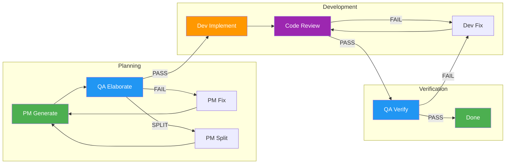
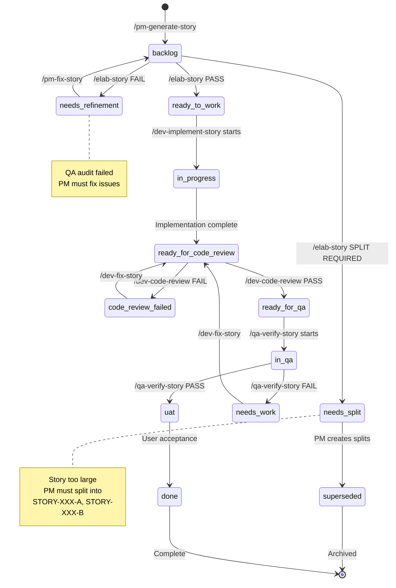
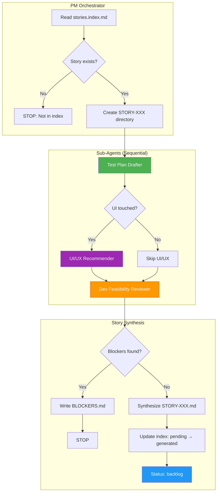
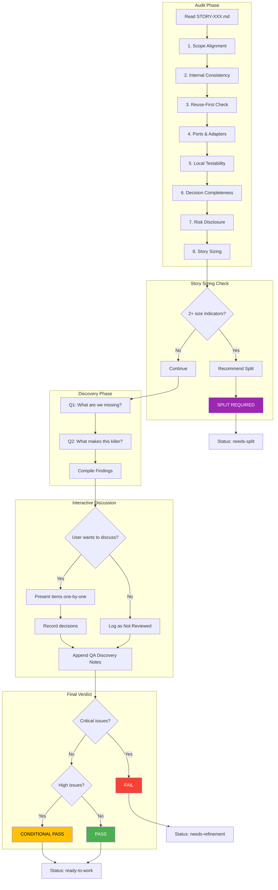
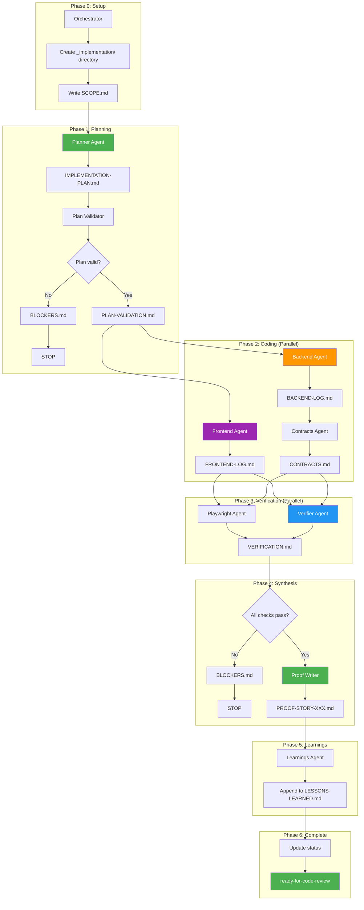
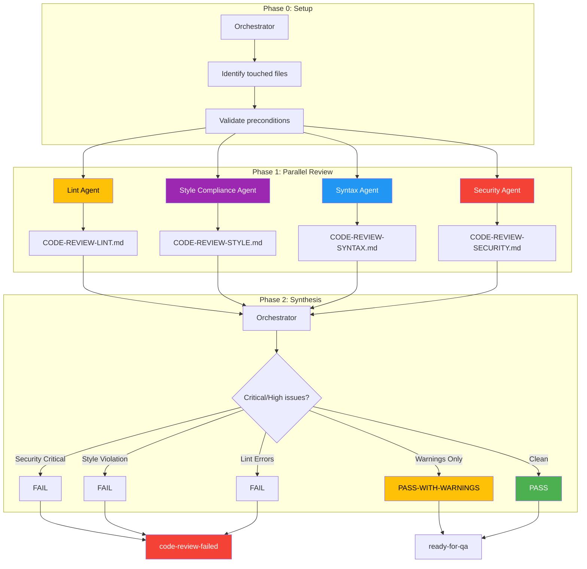
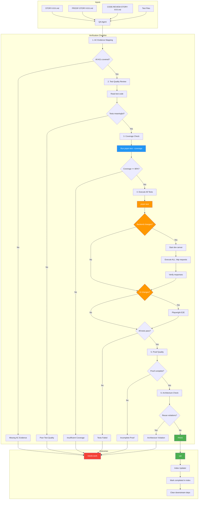
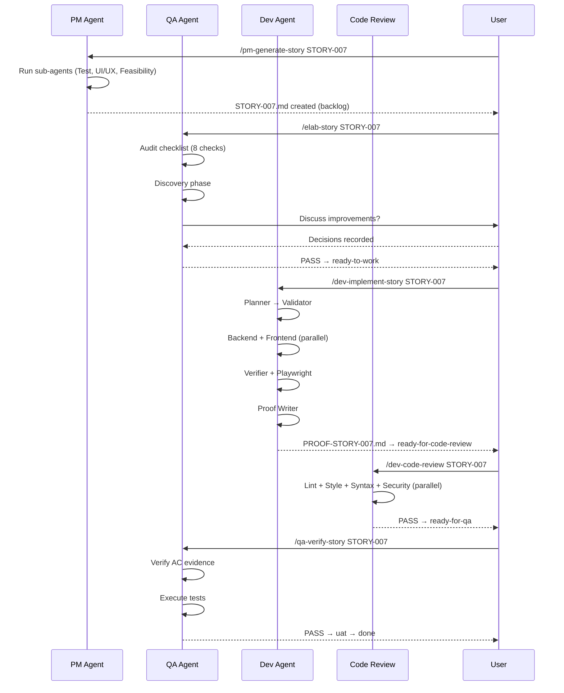

# Feature Development Workflow

A comprehensive guide for implementing features using the structured multi-agent pipeline with Claude Code commands.

## Table of Contents

1. [Overview](#1-overview)
2. [Story Lifecycle](#2-story-lifecycle)
3. [Command Reference](#3-command-reference)
4. [The Development Pipeline](#4-the-development-pipeline)
5. [Artifacts and Directory Structure](#5-artifacts-and-directory-structure)
6. [Quality Gates](#6-quality-gates)
7. [Troubleshooting](#7-troubleshooting)

---

## 1. Overview

### The Multi-Agent Pipeline

This project uses a structured, artifact-driven workflow where specialized agents handle different phases of story development. Each agent:

- Has a single responsibility
- Communicates via durable artifact files (not chat context)
- Enforces hard quality gates before passing to the next phase



### Key Principles

| Principle | Description |
|-----------|-------------|
| **Artifact-First** | Agents write to files, not chat. Artifacts are the source of truth. |
| **Hard Gates** | Each phase has pass/fail criteria. No skipping gates. |
| **Status-Driven** | Story frontmatter status controls what can happen next. |
| **Reuse-First** | Shared logic lives in `packages/**`. No per-story one-offs. |
| **Local-First** | All testing happens locally before any deployment. |

---

## 2. Story Lifecycle

### Status Flow

Stories progress through statuses in their YAML frontmatter:



### Status Definitions

| Status | Description | Next Action |
|--------|-------------|-------------|
| `backlog` | Story created, awaiting QA audit | `/elab-story` |
| `needs-refinement` | QA audit failed, PM must fix | `/pm-fix-story` |
| `needs-split` | Story too large, PM must split | PM creates split stories |
| `superseded` | Original story replaced by splits | Archive |
| `ready-to-work` | QA audit passed, ready for dev | `/dev-implement-story` |
| `in-progress` | Dev is implementing or fixing | Wait for completion |
| `ready-for-code-review` | Implementation complete, awaiting code review | `/dev-code-review` |
| `code-review-failed` | Code review failed, dev must fix | `/dev-fix-story` |
| `ready-for-qa` | Code review passed, awaiting QA verification | `/qa-verify-story` |
| `in-qa` | QA verification in progress | Wait for completion |
| `needs-work` | QA verify failed, dev must fix | `/dev-fix-story` |
| `uat` | QA passed, ready for user acceptance | Manual review |
| `done` | Story complete | Archive |

---

## 3. Command Reference

### Core Workflow Commands

| Command | Agent | Purpose | Input Status | Output Status |
|---------|-------|---------|--------------|---------------|
| `/pm-generate-story STORY-XXX` | PM | Generate story from index | pending (index) | `backlog` |
| `/elab-story STORY-XXX` | QA | Audit story before implementation | `backlog` | `ready-to-work`, `needs-refinement`, or `needs-split` |
| `/dev-implement-story STORY-XXX` | Dev | Implement the story | `ready-to-work` | `ready-for-code-review` |
| `/dev-code-review STORY-XXX` | Code Review | Review code quality and standards | `ready-for-code-review` | `ready-for-qa` (pass) or `code-review-failed` (fail) |
| `/qa-verify-story STORY-XXX` | QA | Verify implementation | `ready-for-qa` | `uat` or `needs-work` |

### Fix Commands (Remediation Loop)

| Command | Agent | Purpose | Input Status | Output Status |
|---------|-------|---------|--------------|---------------|
| `/pm-fix-story STORY-XXX` | PM | Fix story after failed audit | `needs-refinement` | `backlog` |
| `/dev-fix-story STORY-XXX` | Dev | Fix implementation after failed review/QA | `code-review-failed` or `needs-work` | `ready-for-code-review` |

### Workflow Automation Commands

| Command | Agent | Purpose |
|---------|-------|---------|
| `/workflow-run STORY-XXX` | Meta-orchestrator | Run full story lifecycle with context isolation |

### Supporting Commands

| Command | Agent | Purpose |
|---------|-------|---------|
| `/pm-generate-story next` | PM | Auto-select next ready story from index |
| `/pm-generate-bug-story` | PM | Generate a bug fix story |
| `/pm-generate-ad-hoc-story` | PM | Generate an off-index story |
| `/ui-ux-review STORY-XXX` | UI/UX | Review UI/UX after implementation |
| `/pm-generate-story-000-harness` | PM | Generate the workflow harness story |

---

## 4. The Development Pipeline

### Phase 1: Story Generation (`/pm-generate-story`)

The PM agent orchestrates sub-agents to produce a complete, implementable story.



**Sub-Agents:**
1. **Test Plan Drafter** - Creates happy path, error cases, edge cases
2. **UI/UX Recommender** - Provides component suggestions, a11y requirements (if UI touched)
3. **Dev Feasibility Reviewer** - Identifies risks, hidden dependencies, missing AC

**Artifacts Created:**
```
plans/stories/STORY-XXX/
├── STORY-XXX.md           # The story file
└── _pm/
    ├── TEST-PLAN.md       # Test plan from sub-agent
    ├── UIUX-NOTES.md      # UI/UX guidance (or SKIPPED)
    ├── DEV-FEASIBILITY.md # Risk assessment
    └── BLOCKERS.md        # Any blocking issues
```

**Hard Rules:**
- Scope must match `stories.index.md` exactly
- No blocking TBDs - PM must decide
- Test plan is mandatory
- Seed requirements must be explicit if applicable

---

### Phase 2: Story Elaboration (`/elab-story`)

QA audits the story BEFORE implementation to ensure it's safe, unambiguous, and locally testable.



**Audit Checklist:**
1. Scope alignment with index
2. Internal consistency (goals vs non-goals, AC vs scope)
3. Reuse-first enforcement
4. Ports & adapters compliance
5. Local testability (`.http` for backend, Playwright for frontend)
6. Decision completeness (no blocking TBDs)
7. Risk disclosure
8. **Story sizing** (too large detection)

**Story Sizing Detection:**

Stories should be completable in 1-3 focused dev sessions. The elaboration checks for "too large" indicators:

| Indicator | Threshold |
|-----------|-----------|
| Acceptance Criteria | > 8 ACs |
| Endpoints created/modified | > 5 endpoints |
| Full-stack scope | Significant frontend AND backend |
| Bundled features | Multiple independent features |
| Test scenarios | > 3 distinct happy path scenarios |
| Package touches | > 2 packages in `packages/**` |

If 2+ indicators are present, QA recommends story split with:
- Proposed STORY-XXX-A, STORY-XXX-B naming
- Clear boundaries between split stories
- AC allocation per split
- Dependency order (e.g., backend before frontend)

**Discovery Phase (After Audit):**

After the audit checklist, QA performs discovery analysis:

1. **Gaps & Blind Spots** - What have we not thought about?
   - Edge cases not covered in AC
   - Error scenarios not addressed
   - Security considerations overlooked
   - Performance implications
   - Accessibility gaps (if UI)
   - Data migration/backward compatibility
   - Monitoring/observability gaps

2. **Enhancement Opportunities** - What would make this a killer feature?
   - UX improvements that would delight users
   - Power-user features with minimal complexity
   - Integration opportunities
   - Analytics/insights that could be captured
   - Future-proofing enhancements

**Interactive Improvement Discussion:**

QA asks if you want to discuss improvements before finalizing. For each item:
- Add to story as new AC
- Add as follow-up story note
- Mark as out-of-scope (with justification)
- Skip / Not relevant

Decisions are recorded in a `## QA Discovery Notes` section appended to STORY-XXX.md.

**Output:**
```
plans/stories/STORY-XXX/
├── STORY-XXX.md           # Updated with QA Discovery Notes section
└── ELAB-STORY-XXX.md      # Elaboration verdict: PASS / CONDITIONAL PASS / FAIL / SPLIT REQUIRED
```

**Verdicts:**
- **PASS** → Status becomes `ready-to-work`
- **CONDITIONAL PASS** → Status becomes `ready-to-work` with warnings
- **FAIL** → Status becomes `needs-refinement`, requires `/pm-fix-story`
- **SPLIT REQUIRED** → Status becomes `needs-split`, PM must create split stories

---

### Phase 3: Implementation (`/dev-implement-story`)

The Dev orchestrator spawns parallel sub-agents to implement the story.

**Execution Flow:**



**Sub-Agents:**

| Phase | Agent | Output |
|-------|-------|--------|
| 1A | Planner | `IMPLEMENTATION-PLAN.md` |
| 1B | Plan Validator | `PLAN-VALIDATION.md` |
| 2 | Backend Coder | `BACKEND-LOG.md` |
| 2 | Frontend Coder | `FRONTEND-LOG.md` |
| 2B | Contracts | `CONTRACTS.md` |
| 3A | Verifier | `VERIFICATION.md` |
| 3B | Playwright | Appends to `VERIFICATION.md` |
| 4 | Proof Writer | `PROOF-STORY-XXX.md` |
| 5 | Learnings | Appends to `LESSONS-LEARNED.md` |

**Artifacts Created:**
```
plans/stories/STORY-XXX/
├── STORY-XXX.md
├── PROOF-STORY-XXX.md
└── _implementation/
    ├── SCOPE.md
    ├── IMPLEMENTATION-PLAN.md
    ├── PLAN-VALIDATION.md
    ├── BACKEND-LOG.md
    ├── FRONTEND-LOG.md
    ├── CONTRACTS.md
    ├── VERIFICATION.md
    └── BLOCKERS.md (if any)
```

**Fast-Fail:** Backend/Frontend coders run `pnpm check-types` after each chunk.

---

### Phase 4: Code Review (`/dev-code-review STORY-XXX`)

Code review gate ensuring implementation follows project standards before QA verification.
The orchestrator spawns 4 parallel sub-agents for efficient review.

**Execution Flow:**



**Sub-Agents:**

| Agent | Purpose | Output | Blocks? |
|-------|---------|--------|---------|
| Lint | Run linter on touched files only | `CODE-REVIEW-LINT.md` | Errors block |
| Style Compliance | Verify Tailwind/component library only | `CODE-REVIEW-STYLE.md` | **HARD RULE** |
| Syntax | Check ES7+ patterns (not stylistic) | `CODE-REVIEW-SYNTAX.md` | Violations block |
| Security | OWASP checks, secrets, injection | `CODE-REVIEW-SECURITY.md` | Critical/High block |

**HARD RULES (Zero Tolerance):**

1. **Style Compliance** - ALL styling must come from:
   - Tailwind CSS utility classes
   - `@repo/app-component-library` components
   - NO custom CSS, inline styles, or arbitrary Tailwind values

2. **Lint on Touched Files Only** - Do not lint entire codebase

3. **ES7+ Syntax** - Modern patterns required, but don't fail on:
   - Semicolons, quotes, trailing commas (Prettier handles these)

**Output:**
```
plans/stories/STORY-XXX/
├── CODE-REVIEW-STORY-XXX.md  # Final verdict
└── _implementation/
    ├── CODE-REVIEW-LINT.md
    ├── CODE-REVIEW-STYLE.md
    ├── CODE-REVIEW-SYNTAX.md
    └── CODE-REVIEW-SECURITY.md
```

**Verdicts:**
- **PASS** → Story proceeds to `/qa-verify-story`
- **PASS-WITH-WARNINGS** → Story proceeds with noted concerns
- **FAIL** → Status becomes `needs-work`, requires `/dev-fix-story`

---

### Phase 5: QA Verification (`/qa-verify-story`)

Final quality gate verifying the implementation meets all acceptance criteria.



**Verification Checklist:**
1. Every AC mapped to concrete evidence
2. **Test Implementation Quality** - Review actual test code:
   - Tests are meaningful with real assertions
   - Tests cover business logic, not just happy paths
   - No skipped tests without justification
   - No test anti-patterns (always-pass, over-mocked)
3. **Test Coverage Verification** - Run coverage reports:
   - New code: 80% line coverage minimum
   - Critical paths: 90% coverage
   - Coverage gaps documented and justified
4. **Test Execution** - RUN ALL TESTS:
   - `pnpm test` - All unit tests must pass
   - `.http` API tests (MANDATORY for backend):
     - Start local dev server
     - Execute EVERY request in relevant `.http` files
     - Verify status codes and response bodies
     - Record all request/response pairs
   - Playwright E2E tests executed (if UI changes)
   - **Any test failure = FAIL verdict**
5. Proof document is complete and verifiable
6. No architecture or reuse violations

**Output:**
```
plans/stories/STORY-XXX/
└── QA-VERIFY-STORY-XXX.md  # Verdict: PASS / FAIL
```

**Verdicts:**
- **PASS** → Status becomes `uat`, index updated
- **FAIL** → Status becomes `needs-work`, requires `/dev-fix-story`

**On PASS:** The Index Updater sub-agent:
1. Marks story as `completed` in index
2. Clears satisfied dependencies from downstream stories
3. Updates progress summary
4. Recalculates "Ready to Start" section

---

### Token Tracking System

Every agent and phase tracks token usage to enable cost analysis and optimization.

**Token Estimation Formula:**
```
Input tokens ≈ bytes_read / 4
Output tokens ≈ bytes_written / 4
```

**Agent-Level Tracking:**

Every agent output MUST include a Token Log section:

```markdown
## Token Log

| Operation | Type | Bytes | Tokens (est) |
|-----------|------|-------|--------------|
| Read: STORY-XXX.md | input | 18,397 | ~4,600 |
| Read: serverless.yml | input | 70,000 | ~17,500 |
| Write: IMPLEMENTATION-PLAN.md | output | 8,000 | ~2,000 |
| **Total Input** | — | 88,397 | **~22,100** |
| **Total Output** | — | 8,000 | **~2,000** |
```

**Story-Level Aggregation:**

The orchestrator creates `_implementation/TOKEN-SUMMARY.md` with:

```markdown
## Sub-Agent Token Usage

| Phase | Agent | Input | Output | Total |
|-------|-------|-------|--------|-------|
| 1A: Plan | Planner | ~25,000 | ~4,000 | ~29,000 |
| 1B: Validate | Validator | ~30,000 | ~3,000 | ~33,000 |
| 2: Backend | Backend Coder | ~45,000 | ~15,000 | ~60,000 |
| **Total** | — | **~100,000** | **~22,000** | **~122,000** |
```

**High-Cost Operations Reference:**

| Operation | Typical Tokens | Notes |
|-----------|----------------|-------|
| Read serverless.yml | ~17,500 | Avoid if possible |
| Full codebase Explore | ~25,000+ | Use targeted Grep |
| code-reviewer agent | ~30,000+ | Review smaller changesets |
| Read full story + PM docs | ~10,000 | Required context |

**Token Budget Template:**

Each story includes a Token Budget section (see `TOKEN-BUDGET-TEMPLATE.md`):
- Estimated tokens per phase
- Actual measurements after completion
- Comparison and optimization notes

**Global Learnings:**

Token patterns and optimization tips are captured in `plans/stories/LESSONS-LEARNED.md`.

---

### Phase 6: Remediation (if needed)

```mermaid
flowchart TB
    subgraph ElabFail["QA Audit Failed"]
        A[needs-refinement] --> B[/pm-fix-story]
        B --> C[PM fixes Critical/High issues]
        C --> D[backlog]
        D --> E[/elab-story]
        E --> F{Pass?}
        F -->|No| A
        F -->|Yes| G[ready-to-work]
    end

    subgraph SplitRequired["Story Too Large"]
        H[needs-split] --> I[PM reviews split recommendations]
        I --> J[Add splits to stories.index.md]
        J --> K[STORY-XXX-A, STORY-XXX-B]
        K --> L[Mark original as superseded]
        L --> M[/pm-generate-story for each split]
    end

    subgraph CodeReviewFail["Code Review Failed"]
        N[code-review-failed] --> O[/dev-fix-story]
        O --> P[Dev fixes code quality issues]
        P --> Q[ready-for-code-review]
        Q --> R[/dev-code-review]
        R --> S{Pass?}
        S -->|No| N
        S -->|Yes| T[ready-for-qa]
    end

    subgraph QAVerifyFail["QA Verify Failed"]
        U[needs-work] --> V[/dev-fix-story]
        V --> W[Dev fixes AC coverage issues]
        W --> X[ready-for-code-review]
        X --> Y[/dev-code-review]
        Y --> Z[/qa-verify-story]
        Z --> AA{Pass?}
        AA -->|No| U
        AA -->|Yes| AB[uat]
    end

    style G fill:#4CAF50,color:#fff
    style L fill:#9C27B0,color:#fff
    style T fill:#4CAF50,color:#fff
    style AB fill:#4CAF50,color:#fff
```

**If QA Audit Failed (`/pm-fix-story`):**
- PM revises story to address all Critical/High issues
- Cannot change story ID
- Status: `needs-refinement` → `backlog`
- Then re-run `/elab-story`

**If Story Too Large (`needs-split`):**
- PM reviews ELAB-STORY-XXX.md for split recommendations
- PM creates split stories in stories.index.md
- Original story marked as `superseded`
- Generate and elaborate each split separately

**If Code Review Failed (`/dev-fix-story`):**
- Dev fixes code quality, architecture, or security issues
- Cannot change AC or scope
- Status: `code-review-failed` → `ready-for-code-review`
- Then re-run `/dev-code-review`

**If QA Verify Failed (`/dev-fix-story`):**
- Dev fixes implementation issues related to AC coverage
- Cannot change AC or scope
- Status: `needs-work` → `ready-for-code-review`
- Then re-run `/dev-code-review` → `/qa-verify-story`

---

## 5. Artifacts and Directory Structure

### Story Directory Layout

```
plans/stories/
├── stories.index.md           # Master index with status tracking
├── LESSONS-LEARNED.md         # Accumulated learnings across stories (global)
├── TOKEN-BUDGET-TEMPLATE.md   # Template for token budget sections
│
└── STORY-XXX/
    ├── STORY-XXX.md              # The story (with status frontmatter + Token Budget)
    ├── ELAB-STORY-XXX.md         # QA audit result (includes Discovery findings)
    ├── PROOF-STORY-XXX.md        # Dev proof document
    ├── CODE-REVIEW-STORY-XXX.md  # Code review result
    ├── QA-VERIFY-STORY-XXX.md    # QA verification result
    │
    ├── _pm/                   # PM sub-agent artifacts
    │   ├── TEST-PLAN.md
    │   ├── UIUX-NOTES.md
    │   ├── DEV-FEASIBILITY.md
    │   └── BLOCKERS.md        # PM-phase blockers
    │
    └── _implementation/       # Dev sub-agent artifacts
        ├── SCOPE.md               # Backend/frontend/infra impact flags
        ├── IMPLEMENTATION-PLAN.md # Step-by-step dev plan
        ├── PLAN-VALIDATION.md     # Pre-implementation plan validation
        ├── BACKEND-LOG.md         # Backend coder output
        ├── FRONTEND-LOG.md        # Frontend coder output
        ├── CONTRACTS.md           # API contracts
        ├── VERIFICATION.md        # Build/test/lint results
        ├── TOKEN-SUMMARY.md       # Aggregated token usage per phase
        ├── BLOCKERS.md            # Implementation-phase blockers
        ├── CODE-REVIEW-LINT.md    # Lint sub-agent output
        ├── CODE-REVIEW-STYLE.md   # Style compliance sub-agent output
        ├── CODE-REVIEW-SYNTAX.md  # Syntax sub-agent output
        └── CODE-REVIEW-SECURITY.md # Security sub-agent output
```

### HTTP Contracts Location

API contracts (`.http` files) live in:
```
/__http__/<domain>.http
```

Stories reference contracts by path: `/__http__/gallery.http#listImages`

---

## 6. Quality Gates

```mermaid
flowchart LR
    subgraph Gates["Quality Gates"]
        A[Story Audit] -->|PASS| B[Plan Validation]
        B -->|PASS| C[Build/Test]
        C -->|PASS| D[Code Review]
        D -->|PASS| E[QA Verify]
        E -->|PASS| F[Done]
    end

    A -->|FAIL| A1[/pm-fix-story]
    A -->|SPLIT| A2[PM splits story]
    B -->|FAIL| B1[Block implementation]
    C -->|FAIL| C1[Block proof]
    D -->|FAIL| D1[/dev-fix-story]
    E -->|FAIL| E1[/dev-fix-story]

    style A fill:#2196F3,color:#fff
    style B fill:#FF9800,color:#fff
    style C fill:#FF9800,color:#fff
    style D fill:#9C27B0,color:#fff
    style E fill:#2196F3,color:#fff
    style F fill:#4CAF50,color:#fff
```

### Gate Summary

| Gate | Command | Checks | Fail Action |
|------|---------|--------|-------------|
| **Story Audit** | `/elab-story` | Scope, consistency, testability, completeness, sizing | `/pm-fix-story` or split |
| **Plan Validation** | (within `/dev-implement-story`) | Valid paths, existing reuse targets, complete AC coverage | Block implementation |
| **Build/Test** | (within `/dev-implement-story`) | `pnpm check-types`, `pnpm test`, `pnpm lint` | Block proof |
| **Code Review** | `/dev-code-review` | Code quality, architecture, security, testing, conventions | `/dev-fix-story` |
| **QA Verify** | `/qa-verify-story` | AC evidence, test execution, proof quality | `/dev-fix-story` |

### Hard Rules Enforced

1. **Reuse-First**
   - Shared logic in `packages/**`
   - No per-story one-off utilities

2. **Ports & Adapters**
   - Core logic is transport-agnostic
   - Adapters are explicitly identified

3. **Local Testability**
   - Backend: Runnable `.http` tests
   - Frontend: Playwright tests

4. **No Blocking TBDs**
   - PM decides or declares out of scope
   - No "TBD" in AC or test plans

5. **Story Sizing**
   - Stories completable in 1-3 dev sessions
   - 2+ "too large" indicators triggers mandatory split
   - No bundling of independent features

---

## 7. Troubleshooting

### Common Issues

#### Story Blocked on Dependencies
```bash
# Check dependencies in index
grep -A5 "STORY-XXX" plans/stories/stories.index.md
```
Stories cannot start until dependencies have `status: completed`.

#### Agent Produced BLOCKERS.md
1. Read the blockers file for details
2. If PM issue → `/pm-fix-story`
3. If Dev issue → Fix and re-run relevant phase

#### Status Mismatch
If a command fails due to wrong status:
1. Check current status in story frontmatter
2. Run the appropriate command for that status
3. Follow the status flow diagram

#### Tests Failing in Implementation
The dev sub-agents use fast-fail - they run `pnpm check-types` after each chunk. If blocked:
1. Check `_implementation/BLOCKERS.md`
2. Check `_implementation/VERIFICATION.md` for details
3. Fix issues and re-run `/dev-implement-story`

### Where to Find Logs

| Artifact | Location | Contains |
|----------|----------|----------|
| Test Plan | `_pm/TEST-PLAN.md` | Happy path, error cases, edge cases |
| PM Blockers | `_pm/BLOCKERS.md` | PM-phase blockers and decisions |
| Scope | `_implementation/SCOPE.md` | Backend/frontend/infra impact flags |
| Implementation Plan | `_implementation/IMPLEMENTATION-PLAN.md` | Step-by-step dev plan with AC mapping |
| Plan Validation | `_implementation/PLAN-VALIDATION.md` | Pre-implementation validation results |
| Backend Log | `_implementation/BACKEND-LOG.md` | What backend coder did |
| Frontend Log | `_implementation/FRONTEND-LOG.md` | What frontend coder did |
| Verification | `_implementation/VERIFICATION.md` | Build/test/lint results |
| Token Summary | `_implementation/TOKEN-SUMMARY.md` | Aggregated token usage per phase |
| Proof | `PROOF-STORY-XXX.md` | Complete evidence for QA |
| Code Review | `CODE-REVIEW-STORY-XXX.md` | Final code review verdict |
| Code Review - Lint | `_implementation/CODE-REVIEW-LINT.md` | Lint results on touched files |
| Code Review - Style | `_implementation/CODE-REVIEW-STYLE.md` | Tailwind/component compliance |
| Code Review - Syntax | `_implementation/CODE-REVIEW-SYNTAX.md` | ES7+ syntax check |
| Code Review - Security | `_implementation/CODE-REVIEW-SECURITY.md` | Security vulnerability scan |
| Learnings | `plans/stories/LESSONS-LEARNED.md` | Patterns to apply/avoid (global file) |

---

## Quick Reference

### Complete Happy Path



### Starting a New Story

```bash
# Option 1: Specific story
/pm-generate-story STORY-007

# Option 2: Auto-select next ready story
/pm-generate-story next
```

### Full Story Workflow (Manual)

```bash
# 1. Generate the story
/pm-generate-story STORY-007

# 2. QA audit the story
/elab-story STORY-007

# 3. Implement the story
/dev-implement-story STORY-007

# 4. Code review
/dev-code-review STORY-007

# 5. QA verify the implementation
/qa-verify-story STORY-007
```

### Full Story Workflow (Automated)

```bash
# Run full workflow with context isolation
/workflow-run STORY-007

# Run specific phase range
/workflow-run STORY-007 --from=3 --to=5

# Dry run to see planned phases
/workflow-run STORY-007 --dry-run

# With approval gates at key phases
/workflow-run STORY-007 --approve=elab,qa
```

### Fix Loops

```bash
# If /elab-story fails (status: needs-refinement):
/pm-fix-story STORY-007
/elab-story STORY-007

# If /elab-story requires split (status: needs-split):
# 1. PM reviews ELAB-STORY-007.md for split recommendations
# 2. PM adds split stories to stories.index.md (STORY-007-A, STORY-007-B)
# 3. PM marks STORY-007 as status: superseded
# 4. Generate and elaborate each split:
/pm-generate-story STORY-007-A
/elab-story STORY-007-A
/pm-generate-story STORY-007-B
/elab-story STORY-007-B

# If /dev-code-review fails (status: code-review-failed):
/dev-fix-story STORY-007
/dev-code-review STORY-007
# If passes → /qa-verify-story STORY-007

# If /qa-verify-story fails (status: needs-work):
/dev-fix-story STORY-007
/dev-code-review STORY-007
/qa-verify-story STORY-007
```

### Bug and Ad-Hoc Stories

```bash
# Bug discovered
/pm-generate-bug-story BUG-001

# Off-index work needed
/pm-generate-ad-hoc-story STORY-099

# UI/UX review (optional, after implementation)
/ui-ux-review STORY-007
```

---

*Document Version: 3.1*
*Last Updated: 2026-01-24*
*Covers: Multi-Agent Pipeline, Status-Driven Workflow, Artifact-Based Communication, Parallel Code Review Gate, Discovery Phase, Story Splitting, Token Tracking, Mermaid Diagrams, Workflow Automation*
