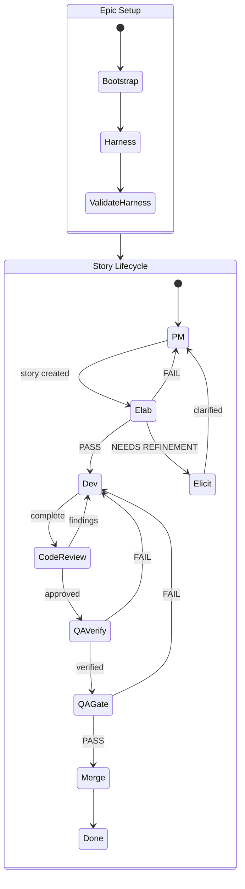
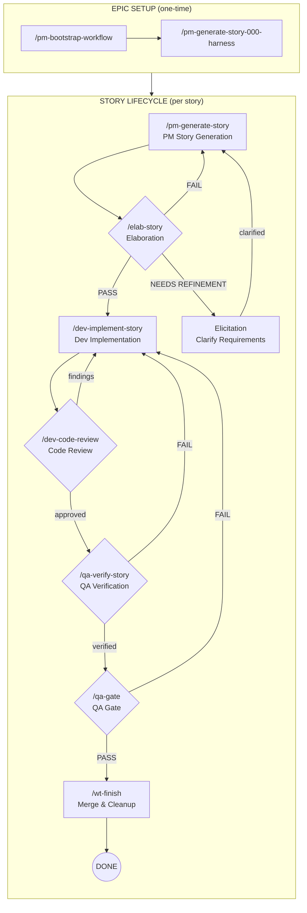

# Unified Development Flow

This document describes the end-to-end workflow combining:
- Bootstrap story setup
- Story lifecycle commands
- Multi-agent orchestration
- Skills (worktrees, review, QA gate)

## Table of Contents

- [High-Level Flow](#high-level-flow)
  - [Commands Overview](#commands-overview)
  - [State Diagram](#state-diagram)
  - [Decision Points & Verdicts](#decision-points--verdicts)
  - [Typical Cycles](#typical-cycles)
- [Core Rule](#core-rule)
- [Phase 1: Bootstrap](#phase-1-bootstrap-one-time-per-epic)
  - [Step 1a: Bootstrap Workflow](#step-1a-bootstrap-workflow)
  - [Step 1b: Harness Story](#step-1b-harness-story-story-000)
- [Phase 2: PM Story Generation](#phase-2-pm-story-generation)
- [Phase 3: QA Elaboration](#phase-3-qa-elaboration)
- [Phase 4: Dev Implementation](#phase-4-dev-implementation)
- [Phase 5: Code Review](#phase-5-code-review)
- [Phase 6: QA Verification](#phase-6-qa-verification)
- [Phase 7: QA Gate](#phase-7-qa-gate)
- [Phase 8: Merge & Cleanup](#phase-8-merge--cleanup)
- [Evidence Bundle](#evidence-bundle)
- [Skills Integration](#skills-integration)
- [Templates](#templates)
- [Quick Reference](#quick-reference)
- [What's Next / Open Questions](#whats-next--open-questions)
- [Changelog](#changelog)

---

## High-Level Flow

### Commands Overview

| Phase | Command | Purpose |
|-------|---------|---------|
| 1a | `/pm-bootstrap-workflow` | Create epic planning artifacts (one-time) |
| 1b | `/pm-generate-story-000-harness` | Validate workflow with harness story (one-time) |
| 2 | `/pm-generate-story` | Generate story specification |
| 3 | `/elab-story` | QA audit - approve or reject story |
| 4 | `/dev-implement-story` | Build the feature |
| 5 | `/dev-code-review` | Review implementation quality |
| 6 | `/qa-verify-story` | Verify acceptance criteria met |
| 7 | `/qa-gate` | Final ship decision |
| 8 | `/wt-finish` | Merge and cleanup |

### State Diagram



### Detailed Flow with Commands



### Decision Points & Verdicts

| Gate | Verdicts | Forward Path | Refinement Path |
|------|----------|--------------|-----------------|
| **Elab** | PASS | → Dev | — |
| | CONDITIONAL PASS | → Dev (after minor fixes) | — |
| | NEEDS REFINEMENT | — | → Elicitation (clarify requirements) |
| | SPLIT REQUIRED | — | → Elicitation (break into stories) |
| | FAIL (minor) | — | → PM (quick rewrite) |
| **Elicitation** | Clarified | — | → PM (rework story with new info) |
| **Code Review** | Approved | → QA Verify | — |
| | Findings | — | → Dev (fix issues) |
| **QA Verify** | Verified | → QA Gate | — |
| | Failed | — | → Dev (fix failures) |
| **QA Gate** | PASS | → Merge | — |
| | CONCERNS | → Merge (advisory) | — |
| | WAIVED | → Merge (accepted risk) | — |
| | FAIL | — | → Dev (fix blocking issues) |

### Elicitation / Refinement

When Elab identifies gaps, ambiguities, or scope issues, the story enters **Elicitation**:

- **Missing requirements** - Gather details from stakeholders
- **Ambiguous acceptance criteria** - Clarify expected behavior
- **Scope creep detection** - Decide what's in/out
- **Split decisions** - Determine how to break up oversized stories

After elicitation, the story returns to PM for rework with the new information.

### Typical Cycles

Most stories follow the happy path, but refinement cycles are common:

1. **Elab → Elicitation → PM → Elab** (1-2 cycles) - Requirement clarification
2. **Elab → PM → Elab** (1 cycle) - Minor story fixes
3. **Code Review → Dev → Code Review** (1-3 cycles) - Quality fixes
4. **QA Verify → Dev → QA Verify** (1-2 cycles) - Bug fixes
5. **QA Gate → Dev → QA Gate** (rare) - Late-found blocking issues

## Core Rule

**Commands mutate story state. Skills produce evidence only.**

---

## Phase 1: Bootstrap (One-Time per Epic)

Bootstrap consists of two steps that run once per epic/project:

### Step 1a: Bootstrap Workflow

**Command:** `/pm-bootstrap-workflow`
**When:** Once per epic/project, before any stories are generated

#### How to Use

1. Run `/pm-bootstrap-workflow`
2. Provide required inputs:
   - **Raw Plan/PRD** - The unstructured plan, migration outline, or feature description
   - **Project Name** - Short identifier (e.g., "vercel-migration", "auth-refactor")
   - **Story Prefix** - Prefix for story IDs (e.g., "STORY", "WRKF", "AUTH")
3. Claude analyzes the plan and generates planning artifacts

### Files Created

| File | Location | Purpose |
|------|----------|---------|
| `{PREFIX}.stories.index.md` | `plans/stories/` | Master story index with all stories, statuses, dependencies |
| `{PREFIX}.plan.meta.md` | `plans/` | Documentation structure, principles, package boundary rules |
| `{PREFIX}.plan.exec.md` | `plans/` | Artifact rules, naming conventions, reuse gates |
| `LESSONS-LEARNED.md` | `plans/stories/` | Empty template for accumulating learnings across stories |
| `TOKEN-BUDGET-TEMPLATE.md` | `plans/stories/` | Template for token tracking per story |

### Example

For a Vercel migration project with prefix `STORY`, Bootstrap creates:
- `plans/stories/STORY.stories.index.md`
- `plans/STORY.plan.meta.md`
- `plans/STORY.plan.exec.md`

For a workflow harness epic with prefix `WRKF`, Bootstrap creates:
- `plans/stories/WRKF.stories.index.md`
- `plans/WRKF.plan.meta.md`
- `plans/WRKF.plan.exec.md`

### Story Index Structure

The `{PREFIX}.stories.index.md` file contains:
- Progress summary (counts by status)
- Ready-to-start list (stories with no blockers)
- Per-story entries with:
  - Status (pending, generated, in-progress, completed)
  - Dependencies
  - Feature description
  - Endpoints (if applicable)
  - Infrastructure requirements
  - Risk notes

---

### Step 1b: Harness Story (Story-000)

**Command:** `/pm-generate-story-000-harness`
**When:** Immediately after bootstrap, before any feature stories

#### Purpose

Story-000 is a special "harness" story that:
- Does NOT migrate any features
- Validates the workflow mechanics work correctly
- Establishes "process law" for all future stories
- Creates reusable templates in `_templates/`

#### What It Proves

1. The story lifecycle works: PM → Elab → Dev → Code Review → QA Verify → QA Gate
2. Artifact generation for each phase
3. Reuse-first rules are enforceable
4. Local verification standards (`.http` files, Playwright)
5. Evidence requirements are clear

#### Files Created

| File | Location | Purpose |
|------|----------|---------|
| `{PREFIX}-000-HARNESS.md` | `plans/stories/{PREFIX}-000/` | Harness story specification |
| `PROOF-TEMPLATE.md` | `plans/stories/{PREFIX}-000/_templates/` | Dev proof document template |
| `QA-VERIFY-TEMPLATE.md` | `plans/stories/{PREFIX}-000/_templates/` | QA verification template |
| `ELAB-TEMPLATE.md` | `plans/stories/{PREFIX}-000/_templates/` | Elaboration/audit template |

#### Important

- Run the full workflow on Story-000 before starting feature stories
- This validates your setup and creates templates other stories will reference
- Story-000 should PASS QA gate before proceeding to Story-001

---

## Phase 2: PM Story Generation

**Command:** `/pm-generate-story {PREFIX}-XXX`
**Input:** Story entry from `{PREFIX}.stories.index.md`
**Output:** Full story file with all required sections

### Agents & Sub-Agents

```
/pm-generate-story
    │
    ├─→ pm.agent.md (orchestrator)
    │
    ├─→ pm-draft-test-plan.agent.md
    │       └─→ Generates TEST-PLAN.md
    │
    ├─→ pm-dev-feasibility-review.agent.md
    │       └─→ Generates DEV-FEASIBILITY.md
    │
    └─→ pm-uiux-recommendations.agent.md (if UI story)
            └─→ Appends UX notes to story
```

| Agent | Purpose |
|-------|---------|
| `pm.agent.md` | Orchestrates story generation, writes main story file |
| `pm-draft-test-plan.agent.md` | Drafts test plan for QA phase |
| `pm-dev-feasibility-review.agent.md` | Assesses technical feasibility, identifies risks |
| `pm-uiux-recommendations.agent.md` | Adds UX considerations for UI stories |

### Files Created

| File | Location | Purpose |
|------|----------|---------|
| `{PREFIX}-XXX.md` | `plans/stories/{PREFIX}-XXX/` | Full story specification |
| `TEST-PLAN.md` | `plans/stories/{PREFIX}-XXX/_pm/` | How QA will verify |
| `DEV-FEASIBILITY.md` | `plans/stories/{PREFIX}-XXX/_pm/` | Technical approach notes |
| `BLOCKERS.md` | `plans/stories/{PREFIX}-XXX/_pm/` | Known blockers (empty if none) |

### Required Story Sections

- YAML frontmatter (id, title, status, created_at)
- Goal / Non-Goals
- Scope (In/Out)
- Acceptance Criteria
- Reuse Plan
- Local Testing Expectations
- Token Budget

### Status Change

`{PREFIX}.stories.index.md`: pending → generated

---

## Phase 3: QA Elaboration

**Command:** `/elab-story {PREFIX}-XXX`
**Input:** Story file from PM phase
**Output:** Elaboration/audit with PASS/FAIL verdict

### Agents & Sub-Agents

```
/elab-story
    │
    └─→ qa.agent.md (single agent)
            │
            ├─→ Reads story + TEST-PLAN + DEV-FEASIBILITY
            ├─→ Runs 8-point audit checklist
            ├─→ Identifies gaps, ambiguities, risks
            └─→ Writes ELAB-{PREFIX}-XXX.md with verdict
```

| Agent | Purpose |
|-------|---------|
| `qa.agent.md` | Performs QA audit, produces elaboration document with verdict |

### Purpose

The elaboration phase determines whether the story is:
- Safe to implement
- Unambiguous
- Locally testable
- Aligned with the plan
- Compliant with reuse-first and ports & adapters rules

**This is a HARD GATE.** Stories cannot proceed to implementation without PASS.

### Files Created

| File | Location | Purpose |
|------|----------|---------|
| `ELAB-{PREFIX}-XXX.md` | `plans/stories/{PREFIX}-XXX/` | Audit results with verdict |

### Audit Checklist

1. Scope Alignment
2. Internal Consistency
3. Reuse-First Enforcement
4. Ports & Adapters Compliance
5. Local Testability
6. Decision Completeness
7. Risk Disclosure
8. Story Sizing (too large detection)

### Verdicts

| Verdict | Meaning | Status Change |
|---------|---------|---------------|
| PASS | Ready for implementation | → `ready-to-work` |
| CONDITIONAL PASS | Minor fixes needed, then proceed | → `ready-to-work` (after fixes) |
| NEEDS REFINEMENT | Gaps identified, needs elicitation | → `needs-refinement` |
| FAIL | Significant issues, needs PM revision | → `needs-refinement` |
| SPLIT REQUIRED | Story too large, must be split | → `needs-split` |

---

## Phase 4: Dev Implementation

**Command:** `/dev-implement-story {PREFIX}-XXX`
**Input:** Story with `status: ready-to-work`
**Output:** Implementation artifacts and proof

### Agents & Sub-Agents

```
/dev-implement-story
    │
    ├─→ dev.agent.md (orchestrator)
    │
    ├─→ Phase 1A: dev-implement-planner.md
    │       └─→ Creates IMPLEMENTATION-PLAN.md
    │
    ├─→ Phase 1B: dev-implement-plan-validator.agent.md
    │       └─→ Validates plan, creates PLAN-VALIDATION.md
    │
    ├─→ Phase 2A: dev-implement-backend-coder.agent.md (if backend)
    │       └─→ Implements backend, creates BACKEND-LOG.md
    │
    ├─→ Phase 2A: dev-implement-frontend-coder.agent.md (if frontend)
    │       └─→ Implements frontend, creates FRONTEND-LOG.md
    │
    ├─→ Phase 2B: dev-implement-contracts.md (if API)
    │       └─→ Creates/updates CONTRACTS.md
    │
    ├─→ Phase 3A: dev-implement-verifier.agent.md
    │       └─→ Runs build/lint/test, creates VERIFICATION.md
    │
    ├─→ Phase 3B: dev-implement-playwright.agent.md (if UI)
    │       └─→ Runs E2E tests, appends to VERIFICATION.md
    │
    ├─→ Phase 4: dev-implement-proof-writer.agent.md
    │       └─→ Creates PROOF-{PREFIX}-XXX.md
    │
    └─→ Phase 5: dev-implement-learnings.agent.md
            └─→ Appends to LESSONS-LEARNED.md
```

### Multi-Agent Pipeline

| Phase | Agent File | Output |
|-------|------------|--------|
| 1A | `dev-implement-planner.md` | `IMPLEMENTATION-PLAN.md` |
| 1B | `dev-implement-plan-validator.agent.md` | `PLAN-VALIDATION.md` |
| 2A | `dev-implement-backend-coder.agent.md` | `BACKEND-LOG.md` (if applicable) |
| 2A | `dev-implement-frontend-coder.agent.md` | `FRONTEND-LOG.md` (if applicable) |
| 2B | `dev-implement-contracts.md` | `CONTRACTS.md` (if API) |
| 3A | `dev-implement-verifier.agent.md` | `VERIFICATION.md` |
| 3B | `dev-implement-playwright.agent.md` | Appends to `VERIFICATION.md` (if UI) |
| 4 | `dev-implement-proof-writer.agent.md` | `PROOF-{PREFIX}-XXX.md` |
| 5 | `dev-implement-learnings.agent.md` | Appends to `LESSONS-LEARNED.md` |

### Related Skills

| Skill | When Used |
|-------|-----------|
| `/wt-new` | Create worktree before starting implementation |
| `/wt-sync` | Sync with upstream during long implementations |

### Files Created

| File | Location | Purpose |
|------|----------|---------|
| `SCOPE.md` | `_implementation/` | Backend/frontend/infra impact flags |
| `IMPLEMENTATION-PLAN.md` | `_implementation/` | Step-by-step plan |
| `PLAN-VALIDATION.md` | `_implementation/` | Plan validation results |
| `IMPLEMENTATION-LOG.md` | `_implementation/` | What was actually done |
| `VERIFICATION.md` | `_implementation/` | Build/lint/test results |
| `TOKEN-SUMMARY.md` | `_implementation/` | Aggregated token usage |
| `PROOF-{PREFIX}-XXX.md` | `{PREFIX}-XXX/` | Final proof document |

### Status Change

`status: ready-to-work` → `status: in-progress` → `status: ready-for-code-review`

---

## Phase 5: Code Review

**Command:** `/dev-code-review {PREFIX}-XXX`
**Input:** Implementation with proof
**Output:** Review findings and disposition

### Agents & Sub-Agents

```
/dev-code-review
    │
    ├─→ code-review.agent.md (orchestrator)
    │
    ├─→ code-review-lint.agent.md
    │       └─→ Checks lint/formatting compliance
    │
    ├─→ code-review-syntax.agent.md
    │       └─→ Validates TypeScript/syntax correctness
    │
    ├─→ code-review-style-compliance.agent.md
    │       └─→ Checks adherence to CLAUDE.md style rules
    │
    └─→ code-review-security.agent.md
            └─→ Scans for security vulnerabilities
```

### Multi-Agent Pipeline

| Agent File | Focus Area |
|------------|------------|
| `code-review.agent.md` | Orchestrates review, aggregates findings |
| `code-review-lint.agent.md` | ESLint, Prettier compliance |
| `code-review-syntax.agent.md` | TypeScript errors, type safety |
| `code-review-style-compliance.agent.md` | CLAUDE.md rules, Zod-first types, import rules |
| `code-review-security.agent.md` | OWASP top 10, injection risks, auth issues |

### Files Created

| File | Location | Purpose |
|------|----------|---------|
| `CODE-REVIEW-{PREFIX}-XXX.md` | `plans/stories/{PREFIX}-XXX/` | Review findings |

### Review Checklist

- Lint/style compliance
- Security review
- Architecture compliance
- Test coverage
- Reuse verification

### Status Change

`status: ready-for-code-review` → `status: ready-for-qa`

---

## Phase 6: QA Verification

**Command:** `/qa-verify-story {PREFIX}-XXX`
**Input:** Implementation with code review complete
**Output:** Verification results with evidence

### Agents & Sub-Agents

```
/qa-verify-story
    │
    └─→ qa.agent.md (single agent)
            │
            ├─→ Reads PROOF + CODE-REVIEW + evidence bundle
            ├─→ Executes .http tests (backend)
            ├─→ Reviews Playwright results (frontend)
            ├─→ Verifies each AC with evidence
            └─→ Writes QA-VERIFY-{PREFIX}-XXX.md
```

| Agent | Purpose |
|-------|---------|
| `qa.agent.md` | Verifies all ACs are met with evidence |

### Related Skills

| Skill | When Used |
|-------|-----------|
| `/ui-ux-review` | Optional UX audit for UI-heavy stories |

### Files Created

| File | Location | Purpose |
|------|----------|---------|
| `QA-VERIFY-{PREFIX}-XXX.md` | `plans/stories/{PREFIX}-XXX/` | Verification results |

### Verification Requirements

- All ACs verified with evidence
- Backend: `.http` tests executed
- Frontend: Playwright tests executed
- Build/lint/test all pass
- Demo script works as written

### Status Change

`status: ready-for-qa` → `status: ready-for-gate`

---

## Phase 7: QA Gate

**Command:** `/qa-gate {PREFIX}-XXX`
**Input:** Verification results
**Output:** Final ship decision

### Agents & Sub-Agents

```
/qa-gate
    │
    └─→ qa.agent.md (single agent)
            │
            ├─→ Aggregates all evidence:
            │     • ELAB-{PREFIX}-XXX.md
            │     • PROOF-{PREFIX}-XXX.md
            │     • CODE-REVIEW-{PREFIX}-XXX.md
            │     • QA-VERIFY-{PREFIX}-XXX.md
            │
            ├─→ Evaluates gate criteria
            └─→ Writes QA-GATE-{PREFIX}-XXX.yaml
```

| Agent | Purpose |
|-------|---------|
| `qa.agent.md` | Makes final ship/no-ship decision based on all evidence |

### Files Created

| File | Location | Purpose |
|------|----------|---------|
| `QA-GATE-{PREFIX}-XXX.yaml` | `plans/stories/{PREFIX}-XXX/` | Gate decision |

### Gate Decisions

| Decision | Meaning |
|----------|---------|
| PASS | Ready to merge |
| CONCERNS | Advisory issues, can still merge |
| FAIL | Blocking issues, cannot merge |
| WAIVED | Known issues accepted with justification |

### Status Change

`status: ready-for-gate` → `status: done` (on PASS)

---

## Phase 8: Merge & Cleanup

**Skill:** `/wt-finish` (or manual git operations)
**Input:** Story with PASS gate decision
**Output:** Changes merged, worktree cleaned up

### Skills Used

```
/wt-finish
    │
    ├─→ Validates QA gate passed
    ├─→ Merges feature branch to main
    ├─→ Pushes to remote
    ├─→ Deletes worktree directory
    └─→ Optionally deletes branch
```

| Skill | Purpose |
|-------|---------|
| `/wt-finish` | Automates merge, push, and worktree cleanup |
| `/wt-cleanup` | Removes stale worktrees (bulk cleanup) |

### Actions

1. Merge feature branch to main
2. Push to remote
3. Delete worktree
4. Delete branch (optional)
5. Update `{PREFIX}.stories.index.md` status to `completed`

---

## Evidence Bundle

Each story produces an `_implementation/` directory containing all evidence:
- Implementation plan and logs
- Verification results
- Token summaries

This bundle is consumed by:
- Code Review
- QA Verify
- QA Gate

**This prevents re-discovery and reduces context loading.**

---

## Skills Integration

Skills provide tooling support but **do not advance lifecycle state**.

| Skill | Purpose |
|-------|---------|
| `/wt-new` | Create worktree for story |
| `/wt-switch` | Switch between worktrees |
| `/wt-sync` | Sync with upstream |
| `/wt-status` | Check worktree status |
| `/wt-finish` | Merge and cleanup |
| `/wt-cleanup` | Remove stale worktrees |
| `/review` | Code review feedback |
| `/qa-gate` | Final ship decision |

---

## Templates

Reusable templates are available in `plans/stories/WRKF-000/_templates/`:

| Template | Purpose |
|----------|---------|
| `PROOF-TEMPLATE.md` | Dev proof document structure |
| `QA-VERIFY-TEMPLATE.md` | QA verification structure |
| `ELAB-TEMPLATE.md` | Elaboration/audit structure |

---

## Quick Reference

```
/pm-bootstrap-workflow - provide raw plan, project name, PREFIX
    ↓ creates: {PREFIX}.stories.index.md, {PREFIX}.plan.meta.md, {PREFIX}.plan.exec.md

/pm-generate-story-000-harness - run ONCE after bootstrap
    ↓ creates: {PREFIX}-000-HARNESS.md, _templates/*.md
    ↓ then run full workflow on Story-000 to validate setup

/pm-generate-story {PREFIX}-XXX - for each feature story
    ↓ creates: {PREFIX}-XXX.md, _pm/*.md
/elab-story {PREFIX}-XXX
    ↓ creates: ELAB-{PREFIX}-XXX.md
/dev-implement-story {PREFIX}-XXX
    ↓ creates: _implementation/*.md, PROOF-{PREFIX}-XXX.md
/dev-code-review {PREFIX}-XXX
    ↓ creates: CODE-REVIEW-{PREFIX}-XXX.md
/qa-verify-story {PREFIX}-XXX
    ↓ creates: QA-VERIFY-{PREFIX}-XXX.md
/qa-gate {PREFIX}-XXX
    ↓ creates: QA-GATE-{PREFIX}-XXX.yaml
/wt-finish
    ↓ merges to main, cleans up worktree
```

---

## What's Next / Open Questions

### Planned Enhancements

| Item | Priority | Description |
|------|----------|-------------|
| LangGraph orchestration | High | Automate workflow phases via `packages/orchestrator` (see `wrkf` epic) |
| Parallel story execution | Medium | Enable multiple stories to progress concurrently with dependency tracking |
| Evidence bundle schema | Medium | Formalize `EVIDENCE.md` format for cross-phase consumption |
| Token budget enforcement | Low | Automatic warnings when phases exceed token thresholds |
| Metrics dashboard | Low | Aggregate story metrics (cycle time, token costs, gate pass rates) |

### Open Questions

1. **How should cross-story dependencies be handled during parallel execution?**
   - Current: Manual dependency tracking in stories index
   - Proposed: Automated blocking based on story status

2. **Should elaboration be optional for trivial stories?**
   - Current: All stories require elaboration PASS
   - Consideration: Allow "fast-track" for < 3 AC stories

3. **How do we handle mid-implementation scope changes?**
   - Current: Return to PM phase, re-elaborate
   - Issue: Loses implementation progress and context

4. **What triggers automated learnings extraction?**
   - Current: Manual append by Learnings agent
   - Proposed: Pattern detection from token summaries and gate decisions

5. **Should code review and QA verify be parallelizable?**
   - Current: Sequential (code review → QA verify)
   - Consideration: Independent evidence gathering, merge at gate

### Known Gaps

- [ ] No automated rollback on FAIL gate (manual revert required)
- [ ] No integration with external issue trackers (Jira, Linear)
- [ ] No PR auto-creation from gate PASS
- [ ] No Slack/Discord notifications for phase transitions
- [ ] No support for "hotfix" workflow bypassing full lifecycle

---

## Changelog

All notable changes to this workflow are documented here.

### [2.3.1] - 2026-01-22 22:45 MST

#### Fixed
- Simplified Mermaid diagrams to fix rendering issues
- Removed unsupported multiline note syntax in stateDiagram
- Removed special characters that caused parsing errors
- Flowchart now shows commands in node labels for clarity

---

### [2.3.0] - 2026-01-22 22:35 MST

#### Added
- **Agents & Sub-Agents section** for each phase with ASCII diagrams
- Agent file references for all sub-agents in each phase
- Related Skills callouts showing which skills support each phase
- Multi-agent pipeline tables with agent files and outputs

#### Changed
- Phase 2 (PM): Documents `pm.agent.md` orchestrator + 3 sub-agents
- Phase 3 (Elab): Documents `qa.agent.md` single-agent flow
- Phase 4 (Dev): Documents all 9 sub-agents in implementation pipeline
- Phase 5 (Code Review): Documents `code-review.agent.md` + 4 specialist sub-agents
- Phase 6 (QA Verify): Documents `qa.agent.md` + optional `/ui-ux-review` skill
- Phase 7 (QA Gate): Documents evidence aggregation flow
- Phase 8 (Merge): Documents `/wt-finish` and `/wt-cleanup` skills

---

### [2.2.0] - 2026-01-22 22:20 MST

#### Added
- **Elicitation / Refinement state** - New state branching off Elab for requirement clarification
- `NEEDS REFINEMENT` verdict at Elab gate (distinct from FAIL)
- Elicitation section explaining when and why stories enter refinement

#### Changed
- State diagrams updated to show Elicitation state and its transitions
- Decision Points table now includes Elicitation outcomes
- Typical Cycles updated to show refinement patterns
- Renamed "Backward Path" column to "Refinement Path" for clarity
- QA Gate FAIL routes to Dev (not Elicitation) - scope issues should be caught at Elab

---

### [2.1.1] - 2026-01-22 22:15 MST

#### Changed
- Replaced ASCII state diagram with **Mermaid diagrams** for better rendering
- Added two diagram views:
  - `stateDiagram-v2`: Full state machine with nested states and annotations
  - `flowchart LR`: Simplified linear view with decision diamonds
- Diagrams now render in GitHub, GitLab, Notion, VS Code, and other Mermaid-compatible viewers

---

### [2.1.0] - 2026-01-22 22:00 MST

#### Added
- **State diagram** showing complete workflow with rejection paths and cycles
- Commands overview table with all phases and their purpose
- Decision points & verdicts table explaining each gate's outcomes
- Typical cycles section documenting common rejection patterns
- Visual representation of epic setup vs story lifecycle separation

#### Changed
- Restructured High-Level Flow section for presentation clarity
- Now clearly shows non-linear nature of the workflow

---

### [2.0.1] - 2026-01-22 21:45 MST

#### Added
- Step 1b: Harness Story documentation (`/pm-generate-story-000-harness`)
- Table of contents with nested subsections for Phase 1
- Clarified two-step bootstrap sequence in High-Level Flow

#### Changed
- Updated Quick Reference to show harness story step
- Phase 1 now explicitly documents both bootstrap workflow and harness story

---

### [2.0.0] - 2026-01-22 21:30 MST

#### Added
- Bootstrap phase documentation with `{PREFIX}.stories.index.md` generation
- Multi-agent pipeline for dev implementation (Planner, Validator, Coders, Verifier, Proof Writer, Learnings)
- Evidence bundle concept (`_implementation/` directory)
- Skills integration section (worktree commands, review, qa-gate)
- Templates reference (`WRKF-000/_templates/`)
- Token budget tracking requirement per story
- Reuse-first enforcement in elaboration and proof

#### Changed
- Renamed from "Story Workflow" to "Unified Development Flow"
- Expanded elaboration from simple review to full audit with 8-point checklist
- Added `SPLIT REQUIRED` verdict for oversized stories
- Clarified that commands mutate state, skills produce evidence only

#### Fixed
- Clarified status transitions at each phase
- Added explicit file locations for all artifacts

### [1.0.0] - 2026-01-15 10:00 MST

#### Added
- Initial workflow documentation
- Basic lifecycle: generate → elaborate → implement → verify → gate
- Story folder structure with `_pm/` subdirectory
