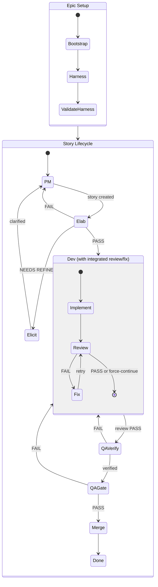
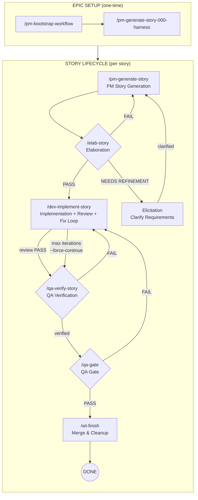

# Unified Development Flow

This document describes the end-to-end workflow combining:
- Bootstrap story setup
- Story lifecycle commands
- Multi-agent orchestration
- Skills (worktrees, review, QA gate)

## Table of Contents

- [High-Level Flow](#high-level-flow)
  - [Commands Overview](#commands-overview)
  - [State Diagram](#state-diagram)
  - [Decision Points & Verdicts](#decision-points--verdicts)
  - [Typical Cycles](#typical-cycles)
- [Core Rule](#core-rule)
- [Phase 1: Bootstrap](#phase-1-bootstrap-one-time-per-epic)
  - [Step 1a: Bootstrap Workflow](#step-1a-bootstrap-workflow)
  - [Step 1b: Harness Story](#step-1b-harness-story-story-000)
- [Phase 2: PM Story Generation](#phase-2-pm-story-generation)
- [Phase 3: QA Elaboration](#phase-3-qa-elaboration)
- [Phase 4: Dev Implementation](#phase-4-dev-implementation)
- [Phase 5: Code Review](#phase-5-code-review)
- [Phase 6: QA Verification](#phase-6-qa-verification)
- [Phase 7: QA Gate](#phase-7-qa-gate)
- [Phase 8: Merge & Cleanup](#phase-8-merge--cleanup)
- [Evidence Bundle](#evidence-bundle)
- [Skills Integration](#skills-integration)
- [Templates](#templates)
- [Quick Reference](#quick-reference)
- [Extending the Workflow](#extending-the-workflow)
  - [Architecture Overview](#architecture-overview)
  - [Adding Checks to an Existing Phase](#adding-checks-to-an-existing-phase)
  - [Adding Parallel Workers to a Phase](#adding-parallel-workers-to-a-phase)
  - [Adding a New Sub-Phase](#adding-a-new-sub-phase)
  - [Adding an Entirely New Phase](#adding-an-entirely-new-phase)
  - [Extension Checklist](#extension-checklist)
  - [Model Selection Guidelines](#model-selection-guidelines)
  - [Common Extension Patterns](#common-extension-patterns)
- [What's Next / Open Questions](#whats-next--open-questions)
- [Changelog](#changelog)

---

## High-Level Flow

### Commands Overview

| Phase | Command | Purpose |
|-------|---------|---------|
| 1a | `/pm-bootstrap-workflow` | Create epic planning artifacts (one-time) |
| 1b | `/pm-generate-story-000-harness` | Validate workflow with harness story (one-time) |
| 1c | `/pm-refine-story` | Vet and prioritize feature ideas (ongoing) |
| 2 | `/pm-story generate` | Generate story specification |
| 2 | `/pm-story generate --ad-hoc` | Generate emergent/one-off story |
| 2 | `/pm-story bug` | Generate bug/defect story |
| 2 | `/pm-story followup` | Generate follow-up from QA findings |
| 2 | `/pm-story split` | Split oversized story |
| 3 | `/elab-story` | QA audit - approve or reject story |
| 4 | `/dev-implement-story` | Build feature + code review + fix loop (integrated) |
| 5 | `/dev-code-review` | Standalone code review (optional, usually integrated) |
| 6 | `/qa-verify-story` | Verify acceptance criteria met |
| 7 | `/qa-gate` | Final ship decision |
| 8 | `/wt-finish` | Merge and cleanup |

### State Diagram



### Detailed Flow with Commands



**Note:** `/dev-implement-story` now includes an integrated review/fix loop. Code review is no longer a separate manual step.

### Decision Points & Verdicts

| Gate | Verdicts | Forward Path | Refinement Path |
|------|----------|--------------|-----------------|
| **Elab** | PASS | → Dev | — |
| | CONDITIONAL PASS | → Dev (after minor fixes) | — |
| | NEEDS REFINEMENT | — | → Elicitation (clarify requirements) |
| | SPLIT REQUIRED | — | → Elicitation (break into stories) |
| | FAIL (minor) | — | → PM (quick rewrite) |
| **Elicitation** | Clarified | — | → PM (rework story with new info) |
| **Dev (integrated review)** | REVIEW PASS | → QA Verify | — |
| | REVIEW FAIL | — | → Fix (auto-loop, up to N iterations) |
| | FORCE CONTINUE | → QA Verify (with warnings) | — |
| | MAX ITERATIONS | Blocked (manual intervention) | — |
| **QA Verify** | Verified | → QA Gate | — |
| | Failed | — | → Dev (fix failures) |
| **QA Gate** | PASS | → Merge | — |
| | CONCERNS | → Merge (advisory) | — |
| | WAIVED | → Merge (accepted risk) | — |
| | FAIL | — | → Dev (fix blocking issues) |

### Elicitation / Refinement

When Elab identifies gaps, ambiguities, or scope issues, the story enters **Elicitation**:

- **Missing requirements** - Gather details from stakeholders
- **Ambiguous acceptance criteria** - Clarify expected behavior
- **Scope creep detection** - Decide what's in/out
- **Split decisions** - Determine how to break up oversized stories

After elicitation, the story returns to PM for rework with the new information.

### PM Fix Story (Remediation)

**Command:** `/pm-fix-story STORY-XXX`
**When:** Story has `status: needs-refinement` after failed elaboration

#### Agents & Sub-Agents

```
/pm-fix-story
    │
    └─→ Phase 0: pm-story-fix-leader.agent.md (sonnet)
            ├─→ Load story + QA feedback
            ├─→ Analyze gaps (inline)
            ├─→ Apply fixes to story
            └─→ Update status → backlog
```

| Phase | Agent | Output |
|-------|-------|--------|
| 0 | `pm-story-fix-leader.agent.md` | Updated `STORY-XXX.md` |

#### Status Transition

`needs-refinement` → `backlog`

**Next Step:** `/elab-story STORY-XXX` (re-audit)

### Typical Cycles

Most stories follow the happy path, but refinement cycles are common:

1. **Elab → Elicitation → PM → Elab** (1-2 cycles) - Requirement clarification
2. **Elab → PM → Elab** (1 cycle) - Minor story fixes
3. **Dev internal: Review → Fix → Review** (1-3 cycles) - Integrated quality fixes (automatic)
4. **QA Verify → Dev → QA Verify** (1-2 cycles) - Bug fixes
5. **QA Gate → Dev → QA Gate** (rare) - Late-found blocking issues

**Note:** Code review cycles are now handled automatically within `/dev-implement-story`. The command includes a review/fix loop (default max 3 iterations) that runs until code review passes or `--force-continue` is used.

## Core Rule

**Commands mutate story state. Skills produce evidence only.**

---

## Phase 1: Bootstrap (One-Time per Epic)

Bootstrap consists of two steps that run once per epic/project:

### Step 1a: Bootstrap Workflow

**Command:** `/pm-bootstrap-workflow`
**When:** Once per epic/project, before any stories are generated

#### Agents & Sub-Agents

```
/pm-bootstrap-workflow
    │
    ├─→ Phase 0: pm-bootstrap-setup-leader.agent.md (haiku)
    │       └─→ Validates inputs, creates AGENT-CONTEXT.md
    │
    ├─→ Phase 1: pm-bootstrap-analysis-leader.agent.md (sonnet)
    │       └─→ Analyzes plan, creates ANALYSIS.yaml
    │
    └─→ Phase 2: pm-bootstrap-generation-leader.agent.md (haiku)
            └─→ Generates all artifact files
```

| Phase | Agent | Output |
|-------|-------|--------|
| 0 | `pm-bootstrap-setup-leader.agent.md` | `AGENT-CONTEXT.md`, `CHECKPOINT.md` |
| 1 | `pm-bootstrap-analysis-leader.agent.md` | `ANALYSIS.yaml` |
| 2 | `pm-bootstrap-generation-leader.agent.md` | All artifact files |

#### How to Use

1. Run `/pm-bootstrap-workflow`
2. Provide required inputs:
   - **Raw Plan/PRD** - The unstructured plan, migration outline, or feature description
   - **Project Name** - Short identifier (e.g., "vercel-migration", "auth-refactor")
   - **Story Prefix** - Prefix for story IDs (e.g., "STORY", "WRKF", "AUTH")
3. Claude analyzes the plan and generates planning artifacts

#### Features

- `--dry-run` - Run analysis only, don't generate files
- Checkpoint & resume on interruption

### Files Created

| File | Location | Purpose |
|------|----------|---------|
| `AGENT-CONTEXT.md` | `plans/{PREFIX}.bootstrap/` | Bootstrap context |
| `CHECKPOINT.md` | `plans/{PREFIX}.bootstrap/` | Resume state |
| `ANALYSIS.yaml` | `plans/{PREFIX}.bootstrap/` | Structured story data |
| `{PREFIX}.stories.index.md` | `plans/stories/` | Master story index with all stories, statuses, dependencies |
| `{PREFIX}.plan.meta.md` | `plans/` | Documentation structure, principles, package boundary rules |
| `{PREFIX}.plan.exec.md` | `plans/` | Artifact rules, naming conventions, reuse gates |
| `{PREFIX}.roadmap.md` | `plans/` | Visual dependency graphs with Mermaid |
| `LESSONS-LEARNED.md` | `plans/stories/` | Empty template for accumulating learnings across stories |
| `TOKEN-BUDGET-TEMPLATE.md` | `plans/stories/` | Template for token tracking per story |

### Example

For a Vercel migration project with prefix `STORY`, Bootstrap creates:
- `plans/stories/STORY.stories.index.md`
- `plans/STORY.plan.meta.md`
- `plans/STORY.plan.exec.md`

For a workflow harness epic with prefix `WRKF`, Bootstrap creates:
- `plans/stories/WRKF.stories.index.md`
- `plans/WRKF.plan.meta.md`
- `plans/WRKF.plan.exec.md`

### Story Index Structure

The `{PREFIX}.stories.index.md` file contains:
- Progress summary (counts by status)
- Ready-to-start list (stories with no blockers)
- Per-story entries with:
  - Status (see lifecycle below)
  - Dependencies
  - Feature description
  - Endpoints (if applicable)
  - Infrastructure requirements
  - Risk notes

### Story Status Lifecycle

| Status | Directory | Meaning |
|--------|-----------|---------|
| `pending` | `backlog/` | Not yet generated, just an entry in index |
| `generated` | `backlog/` | Story file created by PM |
| `in-elaboration` | `elaboration/` | QA audit in progress |
| `needs-refinement` | `elaboration/` | Failed elab, needs PM fixes |
| `needs-split` | `elaboration/` | Too large, requires splitting |
| `ready-to-work` | `ready-to-work/` | Passed elab, awaiting development |
| `in-progress` | `in-progress/` | Dev actively implementing |
| `ready-for-code-review` | `in-progress/` | Implementation done, awaiting review |
| `ready-for-qa` | `ready-for-qa/` | Dev complete, awaiting QA verification |
| `in-qa` | `UAT/` | QA verification in progress |
| `uat` | `UAT/` | QA passed, awaiting gate |
| `completed` | `UAT/` | QA gate passed, ready to merge |
| `blocked` | varies | Waiting on external dependency |
| `cancelled` | `cancelled/` | No longer needed |

---

### Step 1b: Harness Story (Story-000)

**Command:** `/pm-generate-story-000-harness {PREFIX}`
**When:** Immediately after bootstrap, before any feature stories

#### Agents & Sub-Agents

```
/pm-generate-story-000-harness
    │
    ├─→ Phase 0: pm-harness-setup-leader.agent.md (haiku)
    │       ├─→ Validate prefix provided
    │       ├─→ Check harness doesn't exist
    │       ├─→ Verify bootstrap completed
    │       └─→ Create directory structure
    │
    └─→ Phase 1: pm-harness-generation-leader.agent.md (haiku)
            ├─→ Generate {PREFIX}-000-HARNESS.md
            ├─→ Generate _pm/TEST-PLAN.md
            ├─→ Generate _pm/DEV-FEASIBILITY.md
            └─→ Generate _pm/BLOCKERS.md
```

| Phase | Agent | Output |
|-------|-------|--------|
| 0 | `pm-harness-setup-leader.agent.md` | `AGENT-CONTEXT.md` |
| 1 | `pm-harness-generation-leader.agent.md` | Story + PM artifacts |

#### Purpose

Story-000 is a special "harness" story that:
- Does NOT migrate any features
- Validates the workflow mechanics work correctly
- Establishes "process law" for all future stories
- Creates reusable templates in `_templates/`

#### What It Proves

1. The story lifecycle works: PM → Elab → Dev → Code Review → QA Verify → QA Gate
2. Artifact generation for each phase
3. Reuse-first rules are enforceable
4. Local verification standards (`.http` files, Playwright)
5. Evidence requirements are clear

#### Files Created

| File | Location | Purpose |
|------|----------|---------|
| `AGENT-CONTEXT.md` | `plans/stories/{PREFIX}-000/_implementation/` | Context for all phases |
| `{PREFIX}-000-HARNESS.md` | `plans/stories/{PREFIX}-000/` | Harness story specification |
| `TEST-PLAN.md` | `plans/stories/{PREFIX}-000/_pm/` | Verification approach |
| `DEV-FEASIBILITY.md` | `plans/stories/{PREFIX}-000/_pm/` | Technical notes |
| `BLOCKERS.md` | `plans/stories/{PREFIX}-000/_pm/` | Known blockers |

#### Important

- Run the full workflow on Story-000 before starting feature stories
- This validates your setup and creates templates other stories will reference
- Story-000 should PASS QA gate before proceeding to Story-001

---

### Step 1c: Epic Elaboration (Optional but Recommended)

**Command:** `/elab-epic {PREFIX}`
**When:** After bootstrap and harness validation, before generating feature stories

#### Purpose

Multi-stakeholder review of the entire epic to:
- Find gaps in story coverage
- Identify missing dependencies
- Validate technical approach
- Ensure user value is clear
- Surface risks early
- Recommend improvements

#### Agents & Sub-Agents

```
/elab-epic
    │
    ├─→ elab-epic-setup-leader.agent.md (haiku)
    │       └─→ Validates inputs, creates AGENT-CONTEXT.md, CHECKPOINT.md
    │
    ├─→ elab-epic-reviews-leader.agent.md (haiku)
    │       ├─→ elab-epic-engineering.agent.md ──┐
    │       ├─→ elab-epic-product.agent.md ──────┤
    │       ├─→ elab-epic-qa.agent.md ───────────┼─→ 6 parallel
    │       ├─→ elab-epic-ux.agent.md ───────────┤
    │       ├─→ elab-epic-platform.agent.md ─────┤
    │       └─→ elab-epic-security.agent.md ─────┘
    │
    ├─→ elab-epic-aggregation-leader.agent.md (haiku)
    │       └─→ Merges findings to EPIC-REVIEW.yaml
    │
    ├─→ elab-epic-interactive-leader.agent.md (sonnet)
    │       └─→ Presents findings, collects user decisions
    │
    └─→ elab-epic-updates-leader.agent.md (haiku)
            └─→ Applies approved changes to artifacts
```

#### Files Created

| File | Location | Purpose |
|------|----------|---------|
| `AGENT-CONTEXT.md` | `plans/{PREFIX}.epic-elab/` | Context for all phases |
| `CHECKPOINT.md` | `plans/{PREFIX}.epic-elab/` | Resume state |
| `EPIC-REVIEW.yaml` | `plans/{PREFIX}.epic-elab/` | Unified findings |
| `DECISIONS.yaml` | `plans/{PREFIX}.epic-elab/` | User decisions |
| `UPDATES-LOG.yaml` | `plans/{PREFIX}.epic-elab/` | Changes made |

#### Verdicts

| Verdict | Meaning | Next Step |
|---------|---------|-----------|
| `READY` | No critical issues | → `/pm-story generate {PREFIX}-001` |
| `CONCERNS` | Minor issues noted | → `/pm-story generate {PREFIX}-001` (with notes) |
| `BLOCKED` | Critical issues | Address findings, re-run |

---

### Step 1d: Feature Triage (Ongoing)

**Command:** `/pm-refine-story [FEAT-ID | all | top <N>]`
**When:** Anytime to vet and prioritize features in the backlog

#### Purpose

Interactive PM-led brainstorming session to:
- Evaluate feature ideas critically
- Challenge assumptions and necessity
- Define scope and MVP
- Set informed priorities
- Promote features to story-ready status

#### Agents & Sub-Agents

```
/pm-refine-story
    │
    ├─→ Phase 0: (orchestrator, haiku)
    │       ├─→ Parse arguments
    │       ├─→ Bootstrap FEATURES.md if missing
    │       └─→ Load and filter features
    │
    └─→ Phase 1: pm-triage-leader.agent.md (sonnet)
            ├─→ Interactive triage conversation
            ├─→ Update priorities in FEATURES.md
            ├─→ Save session log to YAML
            └─→ Offer chain to /pm-story generate
```

| Phase | Agent | Output |
|-------|-------|--------|
| 0 | (orchestrator) | Setup, bootstrap |
| 1 | `pm-triage-leader.agent.md` | Updated `FEATURES.md`, session log |

#### Files Created

| File | Location | Purpose |
|------|----------|---------|
| `FEATURES.md` | `plans/future/` | Feature backlog |
| `<date>.yaml` | `plans/future/triage-sessions/` | Session log |

#### Conversation Phases

| Phase | Purpose | Example Questions |
|-------|---------|-------------------|
| Understanding | Learn about feature | "What problem does this solve?" |
| Challenge | Test assumptions | "What if users don't need this?" |
| Scope | Define boundaries | "What's the MVP version?" |
| Prioritize | Set priority | "Based on discussion, what priority?" |

#### Quick Commands

| Command | Action |
|---------|--------|
| `skip` | Next feature, no changes |
| `stop` | End session, save progress |
| `promote` | Mark ready for story |
| `archive` | Mark as not doing |

#### Feature Statuses

- `pending` → `promoted` | `archived`
- Promoted features are candidates for `/pm-story generate`

---

## Phase 2: PM Story Generation

**Command:** `/pm-story <action> [args]`
**Input:** Story entry from `{PREFIX}.stories.index.md` (for generate action)
**Output:** Full story file with all required sections

### Unified Command Actions

| Action | Usage | Purpose |
|--------|-------|---------|
| `generate` | `/pm-story generate {PREFIX}-XXX \| next` | Create story from index |
| `generate --ad-hoc` | `/pm-story generate --ad-hoc [ID]` | Create emergent/one-off story |
| `bug` | `/pm-story bug [BUG-XXX]` | Create bug/defect story |
| `followup` | `/pm-story followup STORY-XXX [#]` | Create follow-up from QA findings |
| `split` | `/pm-story split STORY-XXX` | Split oversized story |

### Agents & Sub-Agents

```
/pm-story <action>
    │
    ├─→ action: generate ──→ pm-story-generation-leader.agent.md
    │                            ├─→ pm-draft-test-plan.agent.md (parallel)
    │                            ├─→ pm-dev-feasibility-review.agent.md (parallel)
    │                            └─→ pm-uiux-recommendations.agent.md (parallel, if UI)
    │
    ├─→ action: generate --ad-hoc ──→ pm-story-adhoc-leader.agent.md
    │
    ├─→ action: bug ──→ pm-story-bug-leader.agent.md
    │
    ├─→ action: followup ──→ pm-story-followup-leader.agent.md
    │
    └─→ action: split ──→ pm-story-split-leader.agent.md
```

| Agent | Purpose |
|-------|---------|
| `pm-story-generation-leader.agent.md` | Orchestrates standard story generation |
| `pm-story-adhoc-leader.agent.md` | Generates emergent/one-off stories |
| `pm-story-bug-leader.agent.md` | Generates bug/defect stories |
| `pm-story-followup-leader.agent.md` | Generates follow-up stories from QA findings |
| `pm-story-split-leader.agent.md` | Splits oversized stories |
| `pm-draft-test-plan.agent.md` | Worker: Drafts test plan |
| `pm-dev-feasibility-review.agent.md` | Worker: Assesses technical feasibility |
| `pm-uiux-recommendations.agent.md` | Worker: Adds UX considerations |

### Files Created

| File | Location | Purpose |
|------|----------|---------|
| `{PREFIX}-XXX.md` | `plans/stories/{PREFIX}-XXX/` | Full story specification |
| `TEST-PLAN.md` | `plans/stories/{PREFIX}-XXX/_pm/` | How QA will verify |
| `DEV-FEASIBILITY.md` | `plans/stories/{PREFIX}-XXX/_pm/` | Technical approach notes |
| `BLOCKERS.md` | `plans/stories/{PREFIX}-XXX/_pm/` | Known blockers (empty if none) |

### Required Story Sections

- YAML frontmatter (id, title, status, created_at)
- Goal / Non-Goals
- Scope (In/Out)
- Acceptance Criteria
- Reuse Plan
- Local Testing Expectations
- Token Budget

### Status Change

`{PREFIX}.stories.index.md`: pending → generated

---

## Phase 3: QA Elaboration

**Command:** `/elab-story {PREFIX}-XXX`
**Input:** Story file from PM phase
**Output:** Elaboration/audit with PASS/FAIL verdict

### Agents & Sub-Agents

```
/elab-story
    │
    ├─→ Phase 0: elab-setup-leader.agent.md (haiku)
    │       └─→ Validates story, moves to elaboration/
    │
    ├─→ Phase 1: elab-analyst.agent.md (sonnet)
    │       ├─→ Reads story + TEST-PLAN + DEV-FEASIBILITY
    │       ├─→ Runs 8-point audit checklist
    │       ├─→ Identifies gaps, ambiguities, risks
    │       └─→ Writes _implementation/ANALYSIS.md
    │
    ├─→ Interactive Discussion (orchestrator)
    │       └─→ Presents findings, collects user decisions
    │
    └─→ Phase 2: elab-completion-leader.agent.md (haiku)
            └─→ Writes ELAB-{PREFIX}-XXX.md with verdict
```

| Phase | Agent | Purpose |
|-------|-------|---------|
| 0 | `elab-setup-leader.agent.md` | Validates story exists, moves to elaboration directory |
| 1 | `elab-analyst.agent.md` | Performs audit and discovery analysis |
| — | (orchestrator) | Interactive discussion with user |
| 2 | `elab-completion-leader.agent.md` | Writes final elaboration report, updates status |

### Purpose

The elaboration phase determines whether the story is:
- Safe to implement
- Unambiguous
- Locally testable
- Aligned with the plan
- Compliant with reuse-first and ports & adapters rules

**This is a HARD GATE.** Stories cannot proceed to implementation without PASS.

### Files Created

| File | Location | Purpose |
|------|----------|---------|
| `ANALYSIS.md` | `plans/stories/{PREFIX}-XXX/_implementation/` | Audit and discovery findings |
| `ELAB-{PREFIX}-XXX.md` | `plans/stories/{PREFIX}-XXX/` | Final elaboration report with verdict |

### Audit Checklist

1. Scope Alignment
2. Internal Consistency
3. Reuse-First Enforcement
4. Ports & Adapters Compliance
5. Local Testability
6. Decision Completeness
7. Risk Disclosure
8. Story Sizing (too large detection)

### Verdicts

| Verdict | Meaning | Status Change |
|---------|---------|---------------|
| PASS | Ready for implementation | → `ready-to-work` |
| CONDITIONAL PASS | Minor fixes needed, then proceed | → `ready-to-work` (after fixes) |
| NEEDS REFINEMENT | Gaps identified, needs elicitation | → `needs-refinement` |
| FAIL | Significant issues, needs PM revision | → `needs-refinement` |
| SPLIT REQUIRED | Story too large, must be split | → `needs-split` (then prompts for split) |

### Split Handling

When verdict is `SPLIT REQUIRED`, the command:
1. Updates story status to `needs-split`
2. Asks user: "Would you like to split now?"
3. If yes: Chains to `/pm-story split` which creates splits and **deletes the original**
4. If no: Leaves story for manual split later

This streamlines the workflow by allowing immediate continuation after split.

---

## Phase 4: Dev Implementation (with Integrated Code Review)

**Command:** `/dev-implement-story {PREFIX}-XXX [--max-iterations=N] [--force-continue]`
**Input:** Story with `status: ready-to-work`
**Output:** Implementation artifacts, proof, and passing code review

### Flags

| Flag | Default | Purpose |
|------|---------|---------|
| `--max-iterations=N` | 3 | Max review/fix loop iterations |
| `--force-continue` | false | Proceed to QA with warnings after max iterations |
| `--dry-run` | — | Analyze story without executing |

### Architecture: Context Boundaries

```
/dev-implement-story
    │
    ORCHESTRATOR (minimal context, manages loop)
    │
    ├─► IMPLEMENTATION AGENT (spawned fresh)
    │     ├─→ dev-setup-leader (Phase 0)
    │     ├─→ dev-implement-planning-leader (Phase 1)
    │     │     ├── dev-implement-planner (worker)
    │     │     └── dev-implement-plan-validator (worker)
    │     ├─→ dev-implement-implementation-leader (Phase 2)
    │     │     ├── dev-implement-backend-coder (parallel)
    │     │     ├── dev-implement-frontend-coder (parallel)
    │     │     └── dev-implement-contracts (after backend)
    │     ├─→ dev-verification-leader (Phase 3)
    │     │     ├── dev-implement-verifier
    │     │     └── dev-implement-playwright (if UI)
    │     └─→ dev-documentation-leader (Phase 4)
    │           ├── dev-implement-proof-writer
    │           └── dev-implement-learnings
    │
    └─► REVIEW/FIX LOOP (max N iterations)
          │
          ├─► REVIEW AGENT (spawned fresh each iteration)
          │     └─→ 6 parallel workers:
          │           ├── code-review-lint
          │           ├── code-review-style-compliance
          │           ├── code-review-syntax
          │           ├── code-review-security
          │           ├── code-review-typecheck
          │           └── code-review-build
          │     └─→ Aggregate → VERIFICATION.yaml
          │
          │   PASS → exit loop
          │   FAIL ↓
          │
          └─► FIX AGENT (spawned fresh each iteration)
                ├─→ dev-fix-fix-leader
                ├─→ dev-verification-leader (mode: fix)
                └─→ dev-documentation-leader (mode: fix)
                └─→ Loop back to REVIEW AGENT
```

**Context is cleared between Implementation, Review, and Fix agents.**

### Auto-Resume

No `--resume` flag needed. The orchestrator automatically detects existing artifacts:

1. **CHECKPOINT.md** → Resume from checkpoint stage
2. **VERIFICATION.yaml with FAIL** → Skip to Fix
3. **VERIFICATION.yaml with PASS** → Done
4. **PROOF + LOGs exist** → Skip to Review
5. **Nothing** → Start from Implementation

### Multi-Agent Pipeline

| Stage | Phase | Agent File | Output |
|-------|-------|------------|--------|
| Implementation | 0 | `dev-setup-leader.agent.md` | `SCOPE.md`, `CHECKPOINT.md` |
| Implementation | 1A | `dev-implement-planner.agent.md` | `IMPLEMENTATION-PLAN.md` |
| Implementation | 1B | `dev-implement-plan-validator.agent.md` | `PLAN-VALIDATION.md` |
| Implementation | 2A | `dev-implement-backend-coder.agent.md` | `BACKEND-LOG.md` |
| Implementation | 2A | `dev-implement-frontend-coder.agent.md` | `FRONTEND-LOG.md` |
| Implementation | 2B | `dev-implement-contracts.agent.md` | `CONTRACTS.md` |
| Implementation | 3A | `dev-implement-verifier.agent.md` | `VERIFICATION.md` |
| Implementation | 3B | `dev-implement-playwright.agent.md` | Appends to `VERIFICATION.md` |
| Implementation | 4 | `dev-implement-proof-writer.agent.md` | `PROOF-{PREFIX}-XXX.md` |
| Implementation | 5 | `dev-implement-learnings.agent.md` | Appends to `LESSONS-LEARNED.md` |
| Review | 5-6 | 6 code-review workers | `VERIFICATION.yaml` |
| Fix | 7-9 | fix-leader, verification, documentation | Updated artifacts |

### Related Skills

| Skill | When Used |
|-------|-----------|
| `/wt-new` | Create worktree before starting implementation |
| `/wt-sync` | Sync with upstream during long implementations |

### Files Created

| File | Location | Purpose |
|------|----------|---------|
| `CHECKPOINT.md` | `_implementation/` | Stage tracking, resume state |
| `SCOPE.md` | `_implementation/` | Backend/frontend/infra impact flags |
| `IMPLEMENTATION-PLAN.md` | `_implementation/` | Step-by-step plan |
| `PLAN-VALIDATION.md` | `_implementation/` | Plan validation results |
| `BACKEND-LOG.md` | `_implementation/` | Backend implementation log |
| `FRONTEND-LOG.md` | `_implementation/` | Frontend implementation log |
| `VERIFICATION.md` | `_implementation/` | Build/lint/test results |
| `VERIFICATION.yaml` | `_implementation/` | Code review results (schema v3) |
| `TOKEN-SUMMARY.md` | `_implementation/` | Aggregated token usage |
| `PROOF-{PREFIX}-XXX.md` | `{PREFIX}-XXX/` | Final proof document |

### Status Change

- **Clean pass**: `ready-to-work` → `in-progress` → `ready-for-qa`
- **Forced continue**: `ready-to-work` → `in-progress` → `ready-for-qa-with-warnings`
- **Blocked**: `ready-to-work` → `in-progress` → `blocked` (after max iterations without pass)

---

## Phase 5: Code Review (Standalone - Usually Integrated)

**Command:** `/dev-code-review {PREFIX}-XXX`
**Input:** Implementation with proof
**Output:** Review findings and disposition

> **Note:** Code review is now **integrated into `/dev-implement-story`** with an automatic fix loop. This standalone command is available for:
> - Re-running code review manually after external changes
> - Running code review on stories implemented outside the workflow
> - Debugging specific review failures

### Agents & Sub-Agents

```
/dev-code-review
    │
    ├─→ Phase 0: Setup (validates preconditions)
    │
    ├─→ Phase 1: Parallel Review (6 workers)
    │     ├─→ code-review-lint.agent.md
    │     ├─→ code-review-syntax.agent.md
    │     ├─→ code-review-style-compliance.agent.md
    │     ├─→ code-review-security.agent.md
    │     ├─→ code-review-typecheck.agent.md
    │     └─→ code-review-build.agent.md
    │
    ├─→ Phase 2: Aggregate results
    │
    └─→ Phase 3: Finalize (update status)
```

### Multi-Agent Pipeline

| Agent File | Focus Area |
|------------|------------|
| `code-review-lint.agent.md` | ESLint, Prettier compliance |
| `code-review-syntax.agent.md` | TypeScript errors, type safety |
| `code-review-style-compliance.agent.md` | CLAUDE.md rules, Zod-first types, import rules |
| `code-review-security.agent.md` | OWASP top 10, injection risks, auth issues |
| `code-review-typecheck.agent.md` | TypeScript type checking (`pnpm check-types`) |
| `code-review-build.agent.md` | Production build verification (`pnpm build`) |

### Files Created

| File | Location | Purpose |
|------|----------|---------|
| `VERIFICATION.yaml` | `_implementation/` | Review findings (schema v3) |

### Review Verdict

- **All 6 PASS** → Overall PASS → `status: ready-for-qa`
- **Any FAIL** → Overall FAIL → `status: code-review-failed`

### Status Change (standalone mode)

`status: ready-for-code-review` → `status: ready-for-qa` (PASS) or `status: code-review-failed` (FAIL)

---

## Phase 6: QA Verification

**Command:** `/qa-verify-story {PREFIX}-XXX`
**Input:** Implementation with code review complete
**Output:** Verification results with evidence

### Agents & Sub-Agents

```
/qa-verify-story
    │
    ├─→ Phase 0: qa-verify-setup-leader.agent.md (haiku)
    │       ├─→ Validate preconditions (4 gates)
    │       ├─→ Move story to QA directory
    │       ├─→ Update status to in-qa
    │       └─→ Create AGENT-CONTEXT.md
    │
    ├─→ Phase 1: qa-verify-verification-leader.agent.md (sonnet)
    │       ├─→ 1. AC Verification (HARD GATE)
    │       ├─→ 2. Test Quality Review (HARD GATE)
    │       ├─→ 3. Test Coverage Check (HARD GATE)
    │       ├─→ 4. Test Execution (HARD GATE)
    │       ├─→ 5. Proof Quality Check
    │       ├─→ 6. Architecture Compliance
    │       └─→ Update VERIFICATION.yaml
    │
    └─→ Phase 2: qa-verify-completion-leader.agent.md (haiku)
            ├─→ Write gate decision to VERIFICATION.yaml
            ├─→ Update story status (uat or needs-work)
            ├─→ Move story to UAT or back to in-progress
            ├─→ Spawn Index Updater (on PASS only)
            └─→ Log tokens via /token-log
```

| Phase | Agent | Model | Purpose |
|-------|-------|-------|---------|
| 0 | `qa-verify-setup-leader.agent.md` | haiku | Validates preconditions, moves story |
| 1 | `qa-verify-verification-leader.agent.md` | sonnet | Executes all verification checks |
| 2 | `qa-verify-completion-leader.agent.md` | haiku | Updates status, finalizes gate |

### Related Skills

| Skill | When Used |
|-------|-----------|
| `/ui-ux-review` | Optional UX audit for UI-heavy stories |
| `/token-log` | Called by completion leader to log phase tokens |

### Files Created

| File | Location | Purpose |
|------|----------|---------|
| `AGENT-CONTEXT.md` | `_implementation/` | Context for all phases |
| `VERIFICATION.yaml` | `_implementation/` | qa_verify + gate sections |

### Verification Requirements (6 Hard Gates)

1. AC Verification - All ACs mapped to evidence
2. Test Quality - No anti-patterns
3. Coverage - 80% new code, 90% critical paths
4. Test Execution - All tests pass (.http, unit, E2E)
5. Proof Quality - Complete and verifiable
6. Architecture - No violations

### Status Change

- PASS: `ready-for-qa` → `in-qa` → `uat` (story moves to `UAT/`)
- FAIL: `ready-for-qa` → `in-qa` → `needs-work` (story moves to `in-progress/`)

---

## Phase 7: QA Gate

**Command:** `/qa-gate {PREFIX}-XXX`
**Input:** Verification results
**Output:** Final ship decision

### Agents & Sub-Agents

```
/qa-gate
    │
    └─→ qa.agent.md (single agent)
            │
            ├─→ Aggregates all evidence:
            │     • ELAB-{PREFIX}-XXX.md
            │     • PROOF-{PREFIX}-XXX.md
            │     • CODE-REVIEW-{PREFIX}-XXX.md
            │     • QA-VERIFY-{PREFIX}-XXX.md
            │
            ├─→ Evaluates gate criteria
            └─→ Writes QA-GATE-{PREFIX}-XXX.yaml
```

| Agent | Purpose |
|-------|---------|
| `qa.agent.md` | Makes final ship/no-ship decision based on all evidence |

### Files Created

| File | Location | Purpose |
|------|----------|---------|
| `QA-GATE-{PREFIX}-XXX.yaml` | `plans/stories/{PREFIX}-XXX/` | Gate decision |

### Gate Decisions

| Decision | Meaning |
|----------|---------|
| PASS | Ready to merge |
| CONCERNS | Advisory issues, can still merge |
| FAIL | Blocking issues, cannot merge |
| WAIVED | Known issues accepted with justification |

### Status Change

`status: ready-for-gate` → `status: done` (on PASS)

---

## Phase 8: Merge & Cleanup

**Skill:** `/wt-finish` (or manual git operations)
**Input:** Story with PASS gate decision
**Output:** Changes merged, worktree cleaned up

### Skills Used

```
/wt-finish
    │
    ├─→ Validates QA gate passed
    ├─→ Merges feature branch to main
    ├─→ Pushes to remote
    ├─→ Deletes worktree directory
    └─→ Optionally deletes branch
```

| Skill | Purpose |
|-------|---------|
| `/wt-finish` | Automates merge, push, and worktree cleanup |
| `/wt-cleanup` | Removes stale worktrees (bulk cleanup) |

### Actions

1. Merge feature branch to main
2. Push to remote
3. Delete worktree
4. Delete branch (optional)
5. Update `{PREFIX}.stories.index.md` status to `completed`

---

## Evidence Bundle

Each story produces an `_implementation/` directory containing all evidence:
- Implementation plan and logs
- Verification results
- Token summaries

This bundle is consumed by:
- Code Review
- QA Verify
- QA Gate

**This prevents re-discovery and reduces context loading.**

---

## Skills Integration

Skills provide tooling support but **do not advance lifecycle state**.

| Skill | Purpose |
|-------|---------|
| `/wt-new` | Create worktree for story |
| `/wt-switch` | Switch between worktrees |
| `/wt-sync` | Sync with upstream |
| `/wt-status` | Check worktree status |
| `/wt-finish` | Merge and cleanup |
| `/wt-cleanup` | Remove stale worktrees |
| `/review` | Code review feedback |
| `/qa-gate` | Final ship decision |

---

## Templates

Reusable templates are available in `plans/stories/WRKF-000/_templates/`:

| Template | Purpose |
|----------|---------|
| `PROOF-TEMPLATE.md` | Dev proof document structure |
| `QA-VERIFY-TEMPLATE.md` | QA verification structure |
| `ELAB-TEMPLATE.md` | Elaboration/audit structure |

---

## Quick Reference

```
/pm-bootstrap-workflow - provide raw plan, project name, PREFIX
    ↓ creates: {PREFIX}.stories.index.md, {PREFIX}.plan.meta.md, {PREFIX}.plan.exec.md

/pm-generate-story-000-harness - run ONCE after bootstrap
    ↓ creates: {PREFIX}-000-HARNESS.md, _templates/*.md
    ↓ then run full workflow on Story-000 to validate setup

/elab-epic {PREFIX} - OPTIONAL but recommended
    ↓ creates: plans/{PREFIX}.epic-elab/EPIC-REVIEW.yaml
    ↓ 6 stakeholder reviews in parallel, interactive decisions

/pm-refine-story [FEAT-ID | all | top N] - vet and prioritize features
    ↓ updates: plans/future/FEATURES.md
    ↓ saves: plans/future/triage-sessions/<date>.yaml
    ↓ promoted features → /pm-story generate

/pm-story generate {PREFIX}-XXX - for each feature story
    ↓ creates: {PREFIX}-XXX.md, _pm/*.md
/pm-story generate --ad-hoc - for emergent/one-off stories
    ↓ creates: AD-HOC-XXX.md
/pm-story bug - for bug/defect stories
    ↓ creates: BUG-XXX.md
/pm-story followup STORY-XXX - from QA findings
    ↓ creates: STORY-NNN.md, updates index
/pm-story split STORY-XXX - for oversized stories
    ↓ creates: STORY-XXX-A.md, STORY-XXX-B.md
    ↓ DELETES: original STORY-XXX directory (superseded stories are removed)
/elab-story {PREFIX}-XXX
    ↓ creates: ELAB-{PREFIX}-XXX.md
/dev-implement-story {PREFIX}-XXX [--max-iterations=N] [--force-continue]
    ↓ creates: _implementation/*.md, PROOF-{PREFIX}-XXX.md, VERIFICATION.yaml
    ↓ includes: integrated code review + fix loop (auto-retry until pass)
    ↓ auto-resumes from existing artifacts
/dev-code-review {PREFIX}-XXX (standalone, usually integrated)
    ↓ creates: VERIFICATION.yaml
/qa-verify-story {PREFIX}-XXX
    ↓ creates: QA-VERIFY-{PREFIX}-XXX.md
/qa-gate {PREFIX}-XXX
    ↓ creates: QA-GATE-{PREFIX}-XXX.yaml
/wt-finish
    ↓ merges to main, cleans up worktree
```

---

## Extending the Workflow

This section explains how to add new functionality to the workflow system.

### Architecture Overview

The workflow follows a **phase leader pattern**:

```
/command
    │
    ├─→ Phase 0: setup-leader.agent.md (haiku)
    │       └─→ Validates inputs, creates context
    │
    ├─→ Phase 1: work-leader.agent.md (sonnet)
    │       ├─→ worker-a.agent.md ──┐
    │       ├─→ worker-b.agent.md ──┼─→ parallel workers
    │       └─→ worker-c.agent.md ──┘
    │
    └─→ Phase 2: completion-leader.agent.md (haiku)
            └─→ Aggregates results, updates status
```

Key concepts:
- **Commands** (`.claude/commands/*.md`) - Entry points that orchestrate phases
- **Phase Leaders** (`.claude/agents/*-leader.agent.md`) - Manage a phase of work
- **Workers** (`.claude/agents/*.agent.md`) - Do specific tasks within a phase

### Adding Checks to an Existing Phase

**Example: Add type checking to QA Verification**

The verification leader (`qa-verify-verification-leader.agent.md`) runs checks sequentially. To add type checking:

1. **Edit the verification leader agent:**

```markdown
<!-- In .claude/agents/qa-verify-verification-leader.agent.md -->

## Verification Steps

1. AC Verification (HARD GATE)
2. Test Quality Review (HARD GATE)
3. Test Coverage Check (HARD GATE)
4. Test Execution (HARD GATE)
5. **Type Check (HARD GATE)** ← NEW
6. Proof Quality Check
7. Architecture Compliance
```

2. **Add the check logic to the agent:**

```markdown
### Step 5: Type Check

Run TypeScript compilation:

\`\`\`bash
pnpm check-types
\`\`\`

**HARD GATE:** If type errors exist, FAIL the verification.

Record in VERIFICATION.yaml:
\`\`\`yaml
type_check:
  status: PASS | FAIL
  errors: []
  timestamp: <ISO-8601>
\`\`\`
```

### Adding Parallel Workers to a Phase

**Example: Add Vercel build check to Code Review**

Code review already runs 4 parallel workers. To add a 5th:

1. **Create the new worker agent:**

```bash
# Create .claude/agents/code-review-vercel.agent.md
```

```markdown
---
name: code-review-vercel
description: Validates Vercel build succeeds
model: haiku
---

# Code Review: Vercel Build

## Purpose
Verify the implementation builds successfully for Vercel deployment.

## Process

1. Run Vercel build locally:
   \`\`\`bash
   pnpm build
   \`\`\`

2. Check for build errors

3. Report findings in structured format:
   \`\`\`yaml
   vercel_build:
     status: PASS | FAIL
     errors: []
     warnings: []
   \`\`\`

## Output
Append findings to CODE-REVIEW findings structure.
```

2. **Update the orchestrator command to spawn the new worker:**

```markdown
<!-- In .claude/commands/dev-code-review.md -->

## Phase 1: Run Reviews (Parallel)

Spawn these agents in parallel using Task tool:
- code-review-lint.agent.md
- code-review-syntax.agent.md
- code-review-style-compliance.agent.md
- code-review-security.agent.md
- **code-review-vercel.agent.md** ← NEW
```

3. **Update this documentation** (FULL_WORKFLOW.md) to reflect the new worker.

### Adding a New Sub-Phase

**Example: Add architectural review to Dev Implementation**

To add an architectural review after planning but before coding:

1. **Create the new phase leader:**

```bash
# Create .claude/agents/dev-implement-arch-review-leader.agent.md
```

```markdown
---
name: dev-implement-arch-review-leader
description: Reviews implementation plan for architectural compliance
model: sonnet
---

# Dev Implementation: Architecture Review

## Purpose
Validate implementation plan follows project architecture patterns.

## Inputs
- IMPLEMENTATION-PLAN.md
- CLAUDE.md (project guidelines)
- Existing codebase patterns

## Checks

1. **Import Rules** - Follows @repo/ui, @repo/logger patterns
2. **Component Structure** - Matches required directory structure
3. **Zod-First Types** - No TypeScript interfaces
4. **No Barrel Files** - Direct imports only
5. **Ports & Adapters** - Proper layering

## Output
Write `ARCH-REVIEW.md` to `_implementation/`:

\`\`\`yaml
verdict: PASS | CONCERNS | FAIL
findings:
  - category: import_rules
    status: PASS
  - category: component_structure
    status: CONCERNS
    details: "Missing __tests__ directory"
```

2. **Update the command to include the new phase:**

```markdown
<!-- In .claude/commands/dev-implement-story.md -->

## Phases

| Phase | Agent | Output |
|-------|-------|--------|
| 1A | dev-implement-planner.agent.md | IMPLEMENTATION-PLAN.md |
| 1B | dev-implement-plan-validator.agent.md | PLAN-VALIDATION.md |
| **1C** | **dev-implement-arch-review-leader.agent.md** | **ARCH-REVIEW.md** ← NEW |
| 2A | dev-implement-backend-coder.agent.md | BACKEND-LOG.md |
...
```

### Adding an Entirely New Phase

**Example: Add a "Security Scan" phase after Code Review**

1. **Create the command:**

```bash
# Create .claude/commands/security-scan.md
```

2. **Create phase leaders:**
   - `security-scan-setup-leader.agent.md`
   - `security-scan-analysis-leader.agent.md`
   - `security-scan-completion-leader.agent.md`

3. **Define status transitions:**
   - Input status: `ready-for-security-scan`
   - Output status: `ready-for-qa` (on PASS) or `needs-security-fixes` (on FAIL)

4. **Update the state diagram** in this document

5. **Add to the Commands Overview table**

### Extension Checklist

When extending the workflow:

- [ ] **Agent file created** with proper YAML frontmatter (name, description, model)
- [ ] **Command updated** to spawn new agents
- [ ] **FULL_WORKFLOW.md updated** with:
  - [ ] Agent diagram showing new component
  - [ ] Files Created table
  - [ ] Status transitions (if changed)
  - [ ] Changelog entry
- [ ] **Reference doc created** (`.claude/docs/<command>-reference.md`) if adding new command
- [ ] **Test on a story** to verify the extension works

### Model Selection Guidelines

| Complexity | Model | Use Case |
|------------|-------|----------|
| Simple validation | `haiku` | Setup leaders, completion leaders, simple checks |
| Analysis/reasoning | `sonnet` | Workers that analyze code, make decisions |
| Complex judgment | `opus` | Reserved for critical decisions (rarely needed) |

### Common Extension Patterns

| Goal | Pattern |
|------|---------|
| Add a check | Edit the relevant `-leader.agent.md` to add a step |
| Add parallel analysis | Create new worker, update orchestrator to spawn it |
| Add sequential step | Create new agent, insert in phase sequence |
| Add new gate | Create new command with setup/work/completion leaders |
| Add optional step | Add conditional logic in orchestrator based on story metadata |

---

## What's Next / Open Questions

### Planned Enhancements

| Item | Priority | Description |
|------|----------|-------------|
| LangGraph orchestration | High | Automate workflow phases via `packages/orchestrator` (see `wrkf` epic) |
| Parallel story execution | Medium | Enable multiple stories to progress concurrently with dependency tracking |
| Evidence bundle schema | Medium | Formalize `EVIDENCE.md` format for cross-phase consumption |
| Token budget enforcement | Low | Automatic warnings when phases exceed token thresholds |
| Metrics dashboard | Low | Aggregate story metrics (cycle time, token costs, gate pass rates) |

### Open Questions

1. **How should cross-story dependencies be handled during parallel execution?**
   - Current: Manual dependency tracking in stories index
   - Proposed: Automated blocking based on story status

2. **Should elaboration be optional for trivial stories?**
   - Current: All stories require elaboration PASS
   - Consideration: Allow "fast-track" for < 3 AC stories

3. **How do we handle mid-implementation scope changes?**
   - Current: Return to PM phase, re-elaborate
   - Issue: Loses implementation progress and context

4. **What triggers automated learnings extraction?**
   - Current: Manual append by Learnings agent
   - Proposed: Pattern detection from token summaries and gate decisions

5. **Should code review and QA verify be parallelizable?**
   - Current: Sequential (code review → QA verify)
   - Consideration: Independent evidence gathering, merge at gate

### Known Gaps

- [ ] No automated rollback on FAIL gate (manual revert required)
- [ ] No integration with external issue trackers (Jira, Linear)
- [ ] No PR auto-creation from gate PASS
- [ ] No Slack/Discord notifications for phase transitions
- [ ] No support for "hotfix" workflow bypassing full lifecycle

---

## Changelog

All notable changes to this workflow are documented here.

### [2.19.0] - 2026-01-25 MST

#### Added
- **`ready-for-qa/` directory** - Dedicated directory for stories awaiting QA verification
- `/dev-implement-story` now moves completed stories to `ready-for-qa/` directory

#### Changed
- `/story-status` command displays `ready-for-qa` count in all views
- Swimlane view now has separate READY-QA and IN-QA columns
- Feature summary table includes "Ready-QA" column
- Status lifecycle table updated with `ready-for-qa` → `ready-for-qa/` mapping

---

### [2.18.0] - 2026-01-25 MST

#### Added
- **Story Status Lifecycle** - New comprehensive table documenting all story statuses
- `ready-to-work` status for stories that passed elaboration and await development
- Status-to-directory mapping for all workflow stages

#### Changed
- `/story-status` command now displays `ready-to-work` count in all views
- Feature summary table includes "Ready" column
- Swimlane view groups `ready-to-work` stories in READY column

---

### [2.17.0] - 2026-01-25 MST

#### Changed
- **Story Elaboration** (`/elab-story`) - Now offers to chain to split on SPLIT REQUIRED verdict
- User prompted: "Would you like to split now?"
- If yes: Chains to `/pm-story split` automatically
- Streamlines workflow by allowing immediate continuation after split

---

### [2.16.0] - 2026-01-25 MST

#### Changed
- **Story Split** (`/pm-story split`) - Superseded stories are now deleted instead of marked
- Original story directory is removed after splits are created
- Index entry for original story is removed (not marked as superseded)
- Split stories contain lineage in "Split Context" section

#### Rationale
Superseded stories created confusion and stale references. The split context in each child story provides lineage tracking without keeping dead artifacts.

---

### [2.15.0] - 2026-01-25 MST

#### Changed
- **Dev Implementation** (`/dev-implement-story`) - Now includes integrated code review and fix loop
- Command runs until code review passes (or max iterations reached)
- Context cleared between Implementation, Review, and Fix stages (fresh agents each time)
- Auto-detects existing artifacts and resumes from appropriate stage (no `--resume` flag needed)

#### Added
- `--max-iterations=N` flag (default 3) - configurable review/fix loop limit
- `--force-continue` flag - proceed to QA with warnings after max iterations
- Two new code review workers: `code-review-typecheck.agent.md`, `code-review-build.agent.md`
- `VERIFICATION.yaml` schema v3 with 6 review categories
- `CHECKPOINT.md` tracks stage (implementation/review/fix/done) and iteration count

#### Deprecated
- Manual `/dev-code-review` step is now optional (code review is integrated)
- `--resume` flag (replaced by automatic artifact detection)

---

### [2.14.0] - 2026-01-24 MST

#### Added
- **Extending the Workflow** section - Comprehensive guide for workflow customization
- Architecture overview explaining phase leader pattern
- How to add checks to existing phases (example: type checking in QA)
- How to add parallel workers (example: Vercel build in code review)
- How to add new sub-phases (example: architectural review)
- How to add entirely new phases (example: security scan)
- Extension checklist for contributors
- Model selection guidelines (haiku/sonnet/opus)
- Common extension patterns quick reference

---

### [2.13.0] - 2026-01-24 MST

#### Added
- **Workflow Run** (`/workflow-run`) - Meta-orchestrator for full story lifecycle
- Runs phases as isolated Tasks with fresh context (prevents context bloat)
- Checkpoint & resume via `_workflow/STATE.md`
- `--dry-run` mode for planning
- `--approve=phases` for approval gates at critical phases
- `--from` and `--to` for phase range execution
- Token tracking per phase
- Phase output capture to `_workflow/PHASE-N-OUTPUT.md`

#### Changed
- Refactored `/workflow-run` to phase leader pattern
- Reduced orchestrator from 229 lines to ~100 lines (~56% reduction)
- Added 2 phase leaders: setup, loop
- Added reference doc: `.claude/docs/workflow-run-reference.md`

---

### [2.12.0] - 2026-01-24 MST

#### Changed
- **UI/UX Review** (`/ui-ux-review`) - Refactored to phase leader pattern
- Reduced orchestrator from 143 lines to ~50 lines (~65% reduction)
- Added 3 phase leaders: setup, reviewer, report
- Added reference doc: `.claude/docs/ui-ux-review-reference.md`
- Added SKIPPED fast-path when story doesn't touch UI
- Output format remains `UI-UX-REVIEW-STORY-XXX.md` for human readability
- Intermediate artifact: `UI-UX-FINDINGS.yaml` (structured findings)

---

### [2.11.0] - 2026-01-24 MST

#### Changed
- **QA Verify Story** (`/qa-verify-story`) - Refactored to phase leader pattern
- Reduced orchestrator from 314 lines to ~62 lines (~80% reduction)
- Added 3 phase leaders: setup, verification, completion
- Added reference doc: `.claude/docs/qa-verify-story-reference.md`
- Status transition now includes intermediate `in-qa` state
- Story moves between directories (`in-progress/` → `QA/` → `UAT/` or back)
- Output format remains `VERIFICATION.yaml` (qa_verify + gate sections)

---

### [2.10.0] - 2026-01-24 MST

#### Added
- **Feature Triage** (`/pm-refine-story`) - New PM command for backlog management
- Step 1d in Bootstrap section documenting feature triage
- Interactive triage workflow with conversation phases
- Session logging to YAML files
- Bootstrap capability for FEATURES.md
- Chain to `/pm-story generate` for promoted features

#### Changed
- Refactored `/pm-refine-story` command to phase leader pattern
- Reduced orchestrator from 250 lines to ~97 lines (~61% reduction)
- Updated pm-triage-leader.agent.md with quick wins (session log, chain to story)
- Added reference doc: `.claude/docs/pm-refine-story-reference.md`
- Updated Commands Overview table to include `/pm-refine-story`
- Updated Quick Reference section

---

### [2.9.0] - 2026-01-24 MST

#### Changed
- **PM Story** (`/pm-story`) - Unified command consolidates story generation actions
- Reduced orchestrator from 910 lines to ~89 lines (~90% reduction)
- Added 4 new phase leaders: adhoc, bug, followup, split
- Reuses existing `pm-story-generation-leader.agent.md` for generate action
- Added reference doc: `.claude/docs/pm-story-reference.md`
- Deprecated individual commands: `/pm-generate-story`, `/pm-generate-ad-hoc-story`, `/pm-generate-bug-story`

#### Added
- **Follow-up action** (`/pm-story followup`) - Generate stories from QA findings
- **Split action** (`/pm-story split`) - Split oversized stories into smaller parts
- Updated Commands Overview table in High-Level Flow
- Updated Phase 2 documentation with unified command structure
- Updated Quick Reference section

---

### [2.8.0] - 2026-01-24 MST

#### Changed
- **Harness Story** (`/pm-generate-story-000-harness`) - Refactored to phase leader pattern
- Reduced orchestrator from 76 lines to ~55 lines
- Added 2 phase leaders: setup, generation
- Added reference doc: `.claude/docs/pm-generate-story-000-harness-reference.md`
- Command now requires `{PREFIX}` argument
- Added precondition checks (bootstrap complete, harness doesn't exist)
- Updated Step 1b section with agent diagrams

---

### [2.7.0] - 2026-01-24 MST

#### Changed
- **PM Fix Story** (`/pm-fix-story`) - Refactored to phase leader pattern
- Reduced orchestrator from 107 lines to ~54 lines
- Added reference doc: `.claude/docs/pm-fix-story-reference.md`
- Added agent diagram to "PM Fix Story (Remediation)" section
- Reuses existing `pm-story-fix-leader.agent.md` (no new agents created)

---

### [2.6.0] - 2026-01-24 MST

#### Changed
- **Bootstrap Workflow** (`/pm-bootstrap-workflow`) - Refactored to phase leader pattern
- Reduced orchestrator from 596 lines to ~100 lines
- Added 3 phase leaders: setup, analysis, generation
- Added reference doc: `.claude/docs/pm-bootstrap-workflow-reference.md`
- Added checkpoint & resume capability
- Added `--dry-run` mode for analysis without file generation
- Added ANALYSIS.yaml as intermediate artifact

---

### [2.5.0] - 2026-01-24 MST

#### Changed
- **Story Elaboration** (`/elab-story`) - Refactored to phase leader pattern
- Added YAML frontmatter to all elab-story agents
- Replaced single qa.agent.md with 3 phase leaders: setup, analyst, completion
- Added reference doc: `.claude/docs/elab-story-reference.md`
- Updated ANALYSIS.md as intermediate artifact before final ELAB file

---

### [2.4.0] - 2026-01-24 MST

#### Added
- **Epic Elaboration phase** (`/elab-epic`) - Multi-stakeholder review before story work
- Step 1c in Bootstrap section documenting epic elaboration
- 6 parallel stakeholder perspective agents (engineering, product, qa, ux, platform, security)
- 5 phase leader agents for setup, reviews, aggregation, interactive, updates
- Checkpoint & resume capability for epic elaboration
- Token estimation before running epic elaboration

#### Changed
- Refactored `/elab-epic` command from 456 lines to ~60 lines
- Moved detailed logic into phase leader agents
- All stakeholder agents now output YAML (lean-docs compliant)

---

### [2.3.1] - 2026-01-22 22:45 MST

#### Fixed
- Simplified Mermaid diagrams to fix rendering issues
- Removed unsupported multiline note syntax in stateDiagram
- Removed special characters that caused parsing errors
- Flowchart now shows commands in node labels for clarity

---

### [2.3.0] - 2026-01-22 22:35 MST

#### Added
- **Agents & Sub-Agents section** for each phase with ASCII diagrams
- Agent file references for all sub-agents in each phase
- Related Skills callouts showing which skills support each phase
- Multi-agent pipeline tables with agent files and outputs

#### Changed
- Phase 2 (PM): Documents `pm.agent.md` orchestrator + 3 sub-agents
- Phase 3 (Elab): Documents `qa.agent.md` single-agent flow
- Phase 4 (Dev): Documents all 9 sub-agents in implementation pipeline
- Phase 5 (Code Review): Documents `code-review.agent.md` + 4 specialist sub-agents
- Phase 6 (QA Verify): Documents `qa.agent.md` + optional `/ui-ux-review` skill
- Phase 7 (QA Gate): Documents evidence aggregation flow
- Phase 8 (Merge): Documents `/wt-finish` and `/wt-cleanup` skills

---

### [2.2.0] - 2026-01-22 22:20 MST

#### Added
- **Elicitation / Refinement state** - New state branching off Elab for requirement clarification
- `NEEDS REFINEMENT` verdict at Elab gate (distinct from FAIL)
- Elicitation section explaining when and why stories enter refinement

#### Changed
- State diagrams updated to show Elicitation state and its transitions
- Decision Points table now includes Elicitation outcomes
- Typical Cycles updated to show refinement patterns
- Renamed "Backward Path" column to "Refinement Path" for clarity
- QA Gate FAIL routes to Dev (not Elicitation) - scope issues should be caught at Elab

---

### [2.1.1] - 2026-01-22 22:15 MST

#### Changed
- Replaced ASCII state diagram with **Mermaid diagrams** for better rendering
- Added two diagram views:
  - `stateDiagram-v2`: Full state machine with nested states and annotations
  - `flowchart LR`: Simplified linear view with decision diamonds
- Diagrams now render in GitHub, GitLab, Notion, VS Code, and other Mermaid-compatible viewers

---

### [2.1.0] - 2026-01-22 22:00 MST

#### Added
- **State diagram** showing complete workflow with rejection paths and cycles
- Commands overview table with all phases and their purpose
- Decision points & verdicts table explaining each gate's outcomes
- Typical cycles section documenting common rejection patterns
- Visual representation of epic setup vs story lifecycle separation

#### Changed
- Restructured High-Level Flow section for presentation clarity
- Now clearly shows non-linear nature of the workflow

---

### [2.0.1] - 2026-01-22 21:45 MST

#### Added
- Step 1b: Harness Story documentation (`/pm-generate-story-000-harness`)
- Table of contents with nested subsections for Phase 1
- Clarified two-step bootstrap sequence in High-Level Flow

#### Changed
- Updated Quick Reference to show harness story step
- Phase 1 now explicitly documents both bootstrap workflow and harness story

---

### [2.0.0] - 2026-01-22 21:30 MST

#### Added
- Bootstrap phase documentation with `{PREFIX}.stories.index.md` generation
- Multi-agent pipeline for dev implementation (Planner, Validator, Coders, Verifier, Proof Writer, Learnings)
- Evidence bundle concept (`_implementation/` directory)
- Skills integration section (worktree commands, review, qa-gate)
- Templates reference (`WRKF-000/_templates/`)
- Token budget tracking requirement per story
- Reuse-first enforcement in elaboration and proof

#### Changed
- Renamed from "Story Workflow" to "Unified Development Flow"
- Expanded elaboration from simple review to full audit with 8-point checklist
- Added `SPLIT REQUIRED` verdict for oversized stories
- Clarified that commands mutate state, skills produce evidence only

#### Fixed
- Clarified status transitions at each phase
- Added explicit file locations for all artifacts

### [1.0.0] - 2026-01-15 10:00 MST

#### Added
- Initial workflow documentation
- Basic lifecycle: generate → elaborate → implement → verify → gate
- Story folder structure with `_pm/` subdirectory
