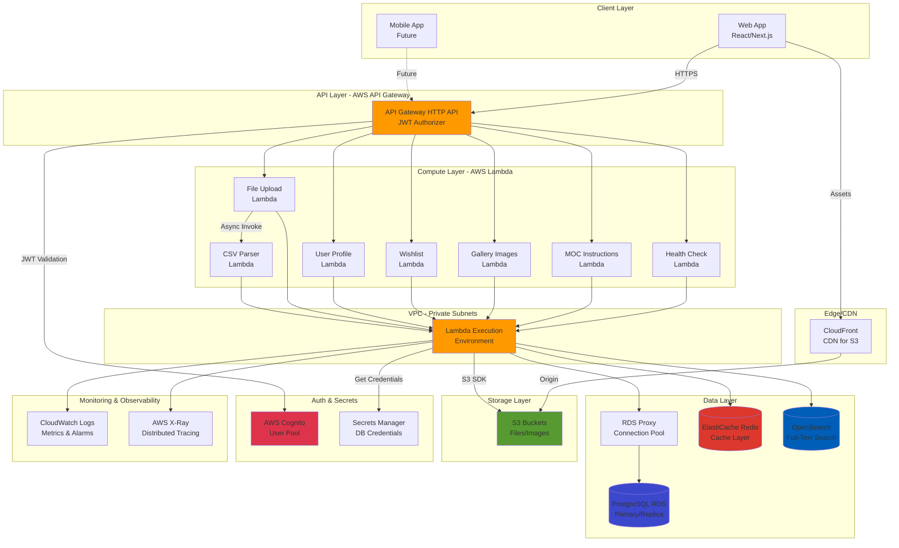

# High-Level Architecture

## Technical Summary

The migrated architecture transforms the existing Express.js monolith into discrete Lambda functions exposed via API Gateway HTTP API (v2), leveraging SST v3 (Ion) for infrastructure as code. Each API route becomes a focused Lambda function handler, sharing business logic through extracted service modules. RDS Proxy enables efficient database connection pooling for the serverless execution model, while VPC networking maintains secure access to PostgreSQL, Redis, and OpenSearch. The architecture preserves all existing functionality including file uploads (S3), image processing (Sharp in Lambda), caching (Redis), search (OpenSearch), and authentication (AWS Cognito JWT), ensuring 100% backward compatibility with frontend clients. SST's resource linking eliminates hardcoded configuration, providing type-safe runtime access to infrastructure values across all Lambda functions.

## Platform and Infrastructure Choice

**Platform**: AWS Serverless Stack
**Key Services**:

- **Compute**: AWS Lambda (Node.js 20 runtime)
- **API Layer**: API Gateway HTTP API (v2) with JWT authorizer
- **Database**: Amazon RDS PostgreSQL 15 with RDS Proxy
- **Caching**: Amazon ElastiCache Redis 7.x
- **Search**: Amazon OpenSearch 2.x
- **Storage**: Amazon S3 with CloudFront (optional CDN)
- **Authentication**: AWS Cognito (existing, no changes)
- **Secrets**: AWS Secrets Manager + Systems Manager Parameter Store
- **Networking**: VPC with private subnets, NAT Gateway, VPC endpoints
- **Monitoring**: CloudWatch Logs, X-Ray, CloudWatch Metrics & Alarms
- **IaC**: SST v3 (Ion) built on Pulumi

**Deployment Host and Regions**: us-east-1 (primary), multi-AZ for RDS/OpenSearch in production

## Repository Structure

**Structure**: Monorepo (existing Turborepo)
**SST Project Location**: `/apps/api/lego-api-serverless/`
**Package Organization**:

- Shared packages continue to be reused (`@monorepo/file-validator`, `@repo/upload`)
- Lambda functions live in `/apps/api/lego-api-serverless/src/functions/`
- Shared business logic extracted to `/apps/api/lego-api-serverless/src/lib/`
- SST infrastructure defined in `/apps/api/lego-api-serverless/sst.config.ts`

## High-Level Architecture Diagram

## Architectural Patterns

- **Serverless Architecture**: Event-driven Lambda functions with API Gateway - _Rationale:_ Eliminates server management, provides automatic scaling, and reduces costs by paying only for actual compute time used.

- **Microservices (Lambda Functions)**: Each API domain (MOCs, Gallery, Wishlist, Profile) has dedicated Lambda functions - _Rationale:_ Enables independent scaling and deployment of API endpoints based on usage patterns.

- **Backend for Frontend (BFF)**: API Gateway as single entry point with domain-specific Lambda backends - _Rationale:_ Centralizes authentication, CORS, rate limiting while allowing specialized Lambda implementations.

- **Connection Pooling via RDS Proxy**: All database connections route through RDS Proxy - _Rationale:_ Solves serverless connection pooling challenges by maintaining persistent connections to PostgreSQL.

- **Repository Pattern**: Data access abstraction in shared libraries - _Rationale:_ Enables testability, maintainability, and potential database migration flexibility.

- **Cache-Aside Pattern**: Redis caching with explicit invalidation on mutations - _Rationale:_ Reduces database load and improves response times for frequently accessed data.

- **Circuit Breaker Pattern**: Graceful degradation when Redis/OpenSearch unavailable - _Rationale:_ Maintains core functionality even when auxiliary services fail.

- **Event-Driven Processing**: S3 events trigger asynchronous Lambda for CSV parsing - _Rationale:_ Decouples heavy processing from API request lifecycle, preventing timeouts.

---
