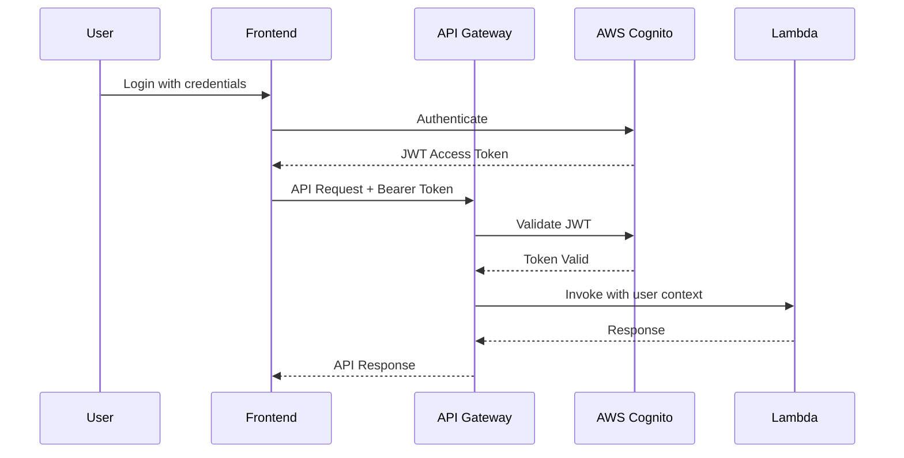

# Security Model

## Authentication Flow



## API Gateway JWT Authorizer

**Configuration**:

- **Issuer**: Cognito User Pool URL
- **Audience**: Cognito App Client ID
- **Token Location**: `Authorization` header or `token` cookie
- **Claims Mapping**: `sub` → `requestContext.authorizer.jwt.claims.sub`

**Lambda Access to User ID**:

```typescript
export const handler = async (event: APIGatewayProxyEventV2) => {
  const userId = event.requestContext.authorizer?.jwt.claims.sub
  // Use userId for authorization checks
}
```

## IAM Roles and Policies

**Lambda Execution Role** (example for MOC Lambda):

```json
{
  "Version": "2012-10-17",
  "Statement": [
    {
      "Effect": "Allow",
      "Action": ["logs:CreateLogGroup", "logs:CreateLogStream", "logs:PutLogEvents"],
      "Resource": "arn:aws:logs:*:*:*"
    },
    {
      "Effect": "Allow",
      "Action": [
        "ec2:CreateNetworkInterface",
        "ec2:DescribeNetworkInterfaces",
        "ec2:DeleteNetworkInterface"
      ],
      "Resource": "*"
    },
    {
      "Effect": "Allow",
      "Action": ["secretsmanager:GetSecretValue"],
      "Resource": "arn:aws:secretsmanager:*:*:secret:lego-api-db-*"
    },
    {
      "Effect": "Allow",
      "Action": ["rds-db:connect"],
      "Resource": "arn:aws:rds-db:*:*:dbuser:*/*"
    },
    {
      "Effect": "Allow",
      "Action": ["s3:PutObject", "s3:GetObject", "s3:DeleteObject"],
      "Resource": "arn:aws:s3:::lego-moc-files-*/*"
    }
  ]
}
```

## Secrets Management

**Database Credentials**:

- Stored in AWS Secrets Manager: `lego-api-db-credentials-{stage}`
- Automatic rotation enabled (30 days)
- Accessed by Lambda via `secretsmanager:GetSecretValue`
- Injected into Lambda environment via SST Resource

**Other Secrets**:

- JWT Secret (if needed for CSRF): Systems Manager Parameter Store (SecureString)
- API keys for external services: Secrets Manager

## CORS Configuration

**API Gateway CORS**:

```yaml
AllowOrigins:
  - https://app.lego-moc.example.com (production)
  - https://staging.lego-moc.example.com (staging)
  - http://localhost:3002 (development)
AllowMethods:
  - GET
  - POST
  - PATCH
  - DELETE
  - OPTIONS
AllowHeaders:
  - Content-Type
  - Authorization
  - X-Requested-With
  - X-CSRF-Token
AllowCredentials: true
MaxAge: 3600
```

## Rate Limiting

**API Gateway Throttling**:

- **Burst Limit**: 500 requests
- **Rate Limit**: 1000 requests per second (account-level)

**Per-Route Throttling** (if needed):

- Upload endpoints: 100 requests/second
- Auth endpoints: 50 requests/second

**Future Enhancement**: AWS WAF for advanced rate limiting and DDoS protection.

## Input Validation

All Lambda functions validate inputs using Zod schemas:

```typescript
const createMOCSchema = z.object({
  title: z.string().min(1).max(200),
  type: z.enum(['moc', 'set']),
  description: z.string().optional(),
  author: z.string().optional(),
  partsCount: z.number().int().positive().optional(),
})

// In handler
const result = createMOCSchema.safeParse(JSON.parse(event.body))
if (!result.success) {
  return {
    statusCode: 400,
    body: JSON.stringify({ error: 'Validation failed', details: result.error.flatten() }),
  }
}
```

---
