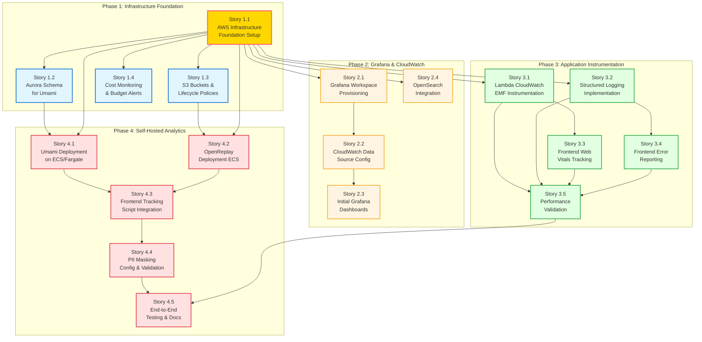

# Story Dependency Graph - User Metrics Implementation

## Overview

This document visualizes the dependencies between all 18 stories in the User Metrics epic, showing which stories can be implemented in parallel and which have sequential dependencies.

**Key Benefits:**

- **Parallelization:** Identify stories that can be worked on simultaneously
- **Critical Path:** Understand which stories block others
- **Sprint Planning:** Optimize team velocity by maximizing parallel work
- **Risk Management:** Identify bottlenecks and single points of failure

---

## Dependency Graph Visualization

### Mermaid Diagram

---

## Critical Path Analysis

### Critical Path (Longest Dependency Chain)

**Total Stories on Critical Path:** 11 stories

**Path:**

1. Story 1.1: AWS Infrastructure Foundation Setup ⚠️ **CRITICAL BLOCKER**
2. Story 2.1: Grafana Workspace Provisioning
3. Story 2.2: CloudWatch Data Source Configuration
4. Story 2.3: Initial Grafana Dashboards Creation
5. Story 3.1: Lambda CloudWatch EMF Instrumentation
6. Story 3.5: Performance Validation and Optimization
7. Story 4.1: Umami Deployment on ECS/Fargate
8. Story 4.3: Frontend Tracking Script Integration
9. Story 4.4: PII Masking Configuration and Validation
10. Story 4.5: End-to-End Testing and Documentation

**Critical Path Duration Estimate:** 16-20 days (assuming 1-2 days per story)

**Bottleneck:** Story 1.1 blocks 13 out of 18 stories (72% of epic)

---

## Parallelization Opportunities

### Wave 1: Start Immediately (No Dependencies)

**Only Story 1.1 can start first** - it's the foundation for everything else.

| Story         | Duration Estimate | Resources Needed                    |
| ------------- | ----------------- | ----------------------------------- |
| **Story 1.1** | 2-3 days          | DevOps Engineer, AWS Console access |

**Action:** Complete Story 1.1 ASAP - it unblocks 72% of remaining work.

---

### Wave 2: After Story 1.1 Completes (Parallel Work Begins)

Once Story 1.1 is complete, **6 stories can be parallelized** immediately:

| Story         | Can Start After | Duration Estimate | Can Parallelize With         |
| ------------- | --------------- | ----------------- | ---------------------------- |
| **Story 1.2** | 1.1             | 1 day             | 1.3, 1.4, 2.1, 2.4, 3.1, 3.2 |
| **Story 1.3** | 1.1             | 1 day             | 1.2, 1.4, 2.1, 2.4, 3.1, 3.2 |
| **Story 1.4** | 1.1             | 1 day             | 1.2, 1.3, 2.1, 2.4, 3.1, 3.2 |
| **Story 2.1** | 1.1             | 1-2 days          | 1.2, 1.3, 1.4, 2.4, 3.1, 3.2 |
| **Story 2.4** | 1.1             | 1-2 days          | 1.2, 1.3, 1.4, 2.1, 3.1, 3.2 |
| **Story 3.1** | 1.1             | 2 days            | 1.2, 1.3, 1.4, 2.1, 2.4, 3.2 |
| **Story 3.2** | 1.1             | 2 days            | 1.2, 1.3, 1.4, 2.1, 2.4, 3.1 |

**Optimal Team Allocation (Wave 2):**

- **Developer 1:** Story 1.2 (Aurora schema) → Story 4.1 (Umami deployment)
- **Developer 2:** Story 1.3 (S3 buckets) → Story 4.2 (OpenReplay deployment)
- **Developer 3:** Story 3.1 (Lambda EMF) → Story 3.3 (Web Vitals)
- **Developer 4:** Story 3.2 (Structured logging) → Story 3.4 (Error reporting)
- **DevOps:** Story 2.1 (Grafana workspace) → Story 2.2 (CloudWatch config)
- **Any Developer:** Story 1.4 (Cost monitoring) + Story 2.4 (OpenSearch)

**Time Savings:** With 4+ developers, Wave 2 completes in **2-3 days** instead of 10+ days sequentially.

---

### Wave 3: Mid-Epic Parallelization

After Wave 2 stories complete, additional parallel opportunities:

| Story         | Depends On | Can Parallelize With                | Duration |
| ------------- | ---------- | ----------------------------------- | -------- |
| **Story 2.2** | 2.1        | (none, sequential with 2.3)         | 1 day    |
| **Story 2.3** | 2.2        | (none, but can overlap with Wave 2) | 1-2 days |
| **Story 3.3** | 3.1        | 3.4                                 | 1-2 days |
| **Story 3.4** | 3.2        | 3.3                                 | 1-2 days |

**Optimal Allocation (Wave 3):**

- **DevOps:** Story 2.2 → Story 2.3 (sequential, Grafana setup)
- **Frontend Developer 1:** Story 3.3 (Web Vitals)
- **Frontend Developer 2:** Story 3.4 (Error reporting)

---

### Wave 4: ECS Deployments (Parallel)

After Aurora schema (1.2) and S3 buckets (1.3) are ready:

| Story         | Depends On | Can Parallelize With | Duration |
| ------------- | ---------- | -------------------- | -------- |
| **Story 4.1** | 1.1, 1.2   | 4.2                  | 2-3 days |
| **Story 4.2** | 1.1, 1.3   | 4.1                  | 2-3 days |

**Optimal Allocation (Wave 4):**

- **Backend Developer 1:** Story 4.1 (Umami ECS deployment)
- **Backend Developer 2:** Story 4.2 (OpenReplay ECS deployment)

**Time Savings:** 2-3 days instead of 4-6 days sequentially.

---

### Wave 5: Final Integration

After all infrastructure and instrumentation complete:

| Story         | Depends On         | Can Parallelize | Duration |
| ------------- | ------------------ | --------------- | -------- |
| **Story 3.5** | 3.1, 3.2, 3.3, 3.4 | (none)          | 1-2 days |
| **Story 4.3** | 4.1, 4.2           | (none)          | 1-2 days |
| **Story 4.4** | 4.3                | (none)          | 1 day    |
| **Story 4.5** | 3.5, 4.4           | (none)          | 2-3 days |

**Sequential Path:** 3.5 → 4.3 → 4.4 → 4.5 (5-8 days)

**Note:** Story 3.5 (performance validation) and Story 4.3 (frontend integration) can overlap partially, but 3.5 should complete first to establish performance baseline.

---

## Dependency Matrix

| Story   | Direct Dependencies | Blocks These Stories                        | Parallelizable                       |
| ------- | ------------------- | ------------------------------------------- | ------------------------------------ |
| **1.1** | (none)              | 1.2, 1.3, 1.4, 2.1, 2.4, 3.1, 3.2, 4.1, 4.2 | ❌ Must be first                     |
| **1.2** | 1.1                 | 4.1                                         | ✅ With 1.3, 1.4, 2.1, 2.4, 3.1, 3.2 |
| **1.3** | 1.1                 | 4.2                                         | ✅ With 1.2, 1.4, 2.1, 2.4, 3.1, 3.2 |
| **1.4** | 1.1                 | (none)                                      | ✅ With 1.2, 1.3, 2.1, 2.4, 3.1, 3.2 |
| **2.1** | 1.1                 | 2.2                                         | ✅ With 1.2, 1.3, 1.4, 2.4, 3.1, 3.2 |
| **2.2** | 2.1                 | 2.3                                         | ❌ Sequential with 2.1, 2.3          |
| **2.3** | 2.2                 | (none)                                      | ❌ Sequential with 2.2               |
| **2.4** | 1.1                 | (none)                                      | ✅ With 1.2, 1.3, 1.4, 2.1, 3.1, 3.2 |
| **3.1** | 1.1                 | 3.3, 3.5                                    | ✅ With 1.2, 1.3, 1.4, 2.1, 2.4, 3.2 |
| **3.2** | 1.1                 | 3.4, 3.5                                    | ✅ With 1.2, 1.3, 1.4, 2.1, 2.4, 3.1 |
| **3.3** | 3.1                 | 3.5                                         | ✅ With 3.4                          |
| **3.4** | 3.2                 | 3.5                                         | ✅ With 3.3                          |
| **3.5** | 3.1, 3.2, 3.3, 3.4  | 4.5                                         | ❌ Convergence point                 |
| **4.1** | 1.1, 1.2            | 4.3                                         | ✅ With 4.2                          |
| **4.2** | 1.1, 1.3            | 4.3                                         | ✅ With 4.1                          |
| **4.3** | 4.1, 4.2            | 4.4                                         | ❌ Convergence point                 |
| **4.4** | 4.3                 | 4.5                                         | ❌ Sequential                        |
| **4.5** | 3.5, 4.4            | (none)                                      | ❌ Final story                       |

---

## Recommended Sprint Structure

### Option 1: 3-Sprint Approach (Optimal for Team of 4+)

**Sprint 1 (5-7 days): Foundation & Grafana**

- **Must Complete:** Story 1.1 (days 1-3)
- **Parallel Work (days 3-7):** Stories 1.2, 1.3, 1.4, 2.1, 2.4
- **Sequential:** Stories 2.2, 2.3 (days 5-7, after 2.1)
- **Deliverable:** Complete infrastructure, Grafana dashboards operational

**Sprint 2 (5-7 days): Application Instrumentation**

- **Parallel Work (days 1-4):** Stories 3.1, 3.2, 3.3, 3.4
- **Sequential:** Story 3.5 (days 5-7, after all instrumentation)
- **Deliverable:** All Lambda and frontend instrumentation complete, performance validated

**Sprint 3 (7-10 days): Self-Hosted Analytics & Integration**

- **Parallel Work (days 1-5):** Stories 4.1, 4.2
- **Sequential:** Story 4.3 (days 6-7), 4.4 (day 8), 4.5 (days 9-10)
- **Deliverable:** Production-ready observability stack, fully tested

**Total Duration: 17-24 days**

---

### Option 2: 2-Sprint Approach (Aggressive, Team of 6+)

**Sprint 1 (7-10 days): Foundation + Instrumentation**

- **Days 1-3:** Story 1.1 (critical blocker)
- **Days 3-7:** Parallel: 1.2, 1.3, 1.4, 2.1, 2.2, 2.3, 2.4, 3.1, 3.2
- **Days 7-10:** Parallel: 3.3, 3.4; Sequential: 3.5
- **Deliverable:** Infrastructure + instrumentation complete

**Sprint 2 (7-10 days): Analytics Tools + Final Integration**

- **Days 1-5:** Parallel: 4.1, 4.2
- **Days 6-7:** Story 4.3
- **Day 8:** Story 4.4
- **Days 9-10:** Story 4.5
- **Deliverable:** Production launch

**Total Duration: 14-20 days**

---

### Option 3: Single-Developer Sequential (Slowest)

If only one developer is available, follow this optimal sequence:

1. Story 1.1 (3 days)
2. Story 1.2 (1 day)
3. Story 1.3 (1 day)
4. Story 1.4 (1 day)
5. Story 2.1 (2 days)
6. Story 2.2 (1 day)
7. Story 2.3 (2 days)
8. Story 2.4 (2 days)
9. Story 3.1 (2 days)
10. Story 3.2 (2 days)
11. Story 3.3 (2 days)
12. Story 3.4 (2 days)
13. Story 3.5 (2 days)
14. Story 4.1 (3 days)
15. Story 4.2 (3 days)
16. Story 4.3 (2 days)
17. Story 4.4 (1 day)
18. Story 4.5 (3 days)

**Total Duration: 35-40 days (7-8 weeks)**

---

## Risk Analysis by Dependency

### High-Risk Stories (Block Many Others)

| Story         | Risk Level  | Blocks           | Mitigation                                           |
| ------------- | ----------- | ---------------- | ---------------------------------------------------- |
| **Story 1.1** | 🔴 CRITICAL | 13 stories (72%) | **Complete first, allocate best DevOps engineer**    |
| **Story 2.1** | 🟡 HIGH     | 2 stories        | Provision Grafana workspace early in Sprint 1        |
| **Story 3.5** | 🟡 MEDIUM   | 1 story (4.5)    | Can defer if needed, not on critical path to 4.1-4.4 |
| **Story 4.3** | 🟡 MEDIUM   | 2 stories        | Convergence point, requires both 4.1 and 4.2         |

### Low-Risk Stories (Can Be Deferred)

| Story         | Dependency Risk | Deferrable? | Reason                                                                             |
| ------------- | --------------- | ----------- | ---------------------------------------------------------------------------------- |
| **Story 1.4** | 🟢 LOW          | ✅ Yes      | Cost monitoring is important but doesn't block technical work                      |
| **Story 2.4** | 🟢 LOW          | ✅ Yes      | OpenSearch integration is "nice to have" - CloudWatch Logs Insights can substitute |
| **Story 3.5** | 🟢 MEDIUM       | ⚠️ Partial  | Performance validation recommended but not blocking 4.1-4.3                        |

---

## Parallelization Summary

### Maximum Parallel Stories by Phase

- **Phase 1:** Up to **6 stories** in parallel after 1.1 completes (1.2, 1.3, 1.4, and can start 2.1, 2.4, 3.1, 3.2)
- **Phase 2:** Up to **2 stories** in parallel (2.2 sequential with 2.1/2.3, but 2.4 can run alongside)
- **Phase 3:** Up to **2 stories** in parallel (3.3 + 3.4 after 3.1/3.2 complete)
- **Phase 4:** Up to **2 stories** in parallel (4.1 + 4.2)

### Optimal Team Size

**Recommended:** 4-6 developers for maximum parallelization without coordination overhead.

| Team Size     | Stories in Parallel | Est. Total Duration | Efficiency                           |
| ------------- | ------------------- | ------------------- | ------------------------------------ |
| 1 developer   | 1 story             | 35-40 days          | 100% utilization, 0% parallelization |
| 2 developers  | 2 stories           | 20-25 days          | 90% utilization, 40% time savings    |
| 4 developers  | 4-6 stories         | 17-24 days          | 75% utilization, 50% time savings    |
| 6+ developers | 6-7 stories         | 14-20 days          | 60% utilization, 60% time savings    |

**Diminishing Returns:** Beyond 6 developers, coordination overhead outweighs parallelization benefits.

---

## Quick Reference: "Can I Start This Story?"

Use this checklist to quickly determine if a story is ready:

### Story 1.1

- [ ] ✅ START IMMEDIATELY (no dependencies)

### Story 1.2

- [ ] Story 1.1 complete? → ✅ START

### Story 1.3

- [ ] Story 1.1 complete? → ✅ START

### Story 1.4

- [ ] Story 1.1 complete? → ✅ START

### Story 2.1

- [ ] Story 1.1 complete? → ✅ START

### Story 2.2

- [ ] Story 2.1 complete? → ✅ START

### Story 2.3

- [ ] Story 2.2 complete? → ✅ START

### Story 2.4

- [ ] Story 1.1 complete? → ✅ START

### Story 3.1

- [ ] Story 1.1 complete? → ✅ START

### Story 3.2

- [ ] Story 1.1 complete? → ✅ START

### Story 3.3

- [ ] Story 3.1 complete? → ✅ START

### Story 3.4

- [ ] Story 3.2 complete? → ✅ START

### Story 3.5

- [ ] Story 3.1 complete?
- [ ] Story 3.2 complete?
- [ ] Story 3.3 complete?
- [ ] Story 3.4 complete? → ✅ START

### Story 4.1

- [ ] Story 1.1 complete?
- [ ] Story 1.2 complete? → ✅ START

### Story 4.2

- [ ] Story 1.1 complete?
- [ ] Story 1.3 complete? → ✅ START

### Story 4.3

- [ ] Story 4.1 complete?
- [ ] Story 4.2 complete? → ✅ START

### Story 4.4

- [ ] Story 4.3 complete? → ✅ START

### Story 4.5

- [ ] Story 3.5 complete?
- [ ] Story 4.4 complete? → ✅ START

---

## Conclusion

**Key Takeaways:**

1. ⚠️ **Story 1.1 is the critical bottleneck** - prioritize completing it ASAP
2. 💡 **Maximum parallelization: 6-7 stories** can run concurrently after 1.1
3. 🚀 **Optimal team size: 4-6 developers** balances speed with coordination
4. ⏱️ **Time savings: 50-60%** with proper parallelization vs sequential
5. 📊 **3-sprint structure recommended** for balanced velocity and quality

**Recommended Action Plan:**

- **Week 1:** Complete Story 1.1 (days 1-3), start parallel work on 1.2, 1.3, 1.4, 2.1, 2.4, 3.1, 3.2
- **Week 2:** Complete Phase 1 & 2, progress Phase 3 instrumentation
- **Week 3:** Complete Phase 3, start Phase 4 ECS deployments
- **Week 4:** Finalize integration, testing, documentation

---

**Version:** 1.0
**Created:** 2025-11-23
**Maintained By:** Sarah (Product Owner)
