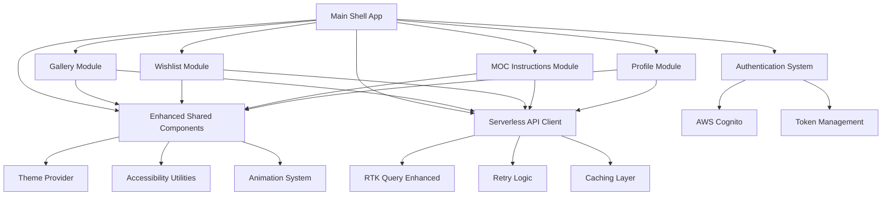

# LEGO MOC Instructions App - Frontend Modernization Architecture

## Introduction

This document outlines the architectural approach for enhancing the LEGO MOC Instructions App with comprehensive frontend modernization including modular architecture refactor, serverless backend integration, and UX enhancement. Its primary goal is to serve as the guiding architectural blueprint for AI-driven development of new features while ensuring seamless integration with the existing system.

**Relationship to Existing Architecture:**
This document supplements the existing brownfield architecture analysis by defining how the modernized components will integrate with current systems. The architecture leverages the existing strong foundation (React 19, Tailwind CSS v4, modular packages) while transforming the monolithic structure into a modular micro-frontend system.

### Existing Project Analysis

Based on comprehensive analysis of the current LEGO MOC Instructions application:

#### Current Project State

- **Primary Purpose:** LEGO MOC (My Own Creation) instructions sharing platform with gallery, wishlist, creation tools, and user profiles
- **Current Tech Stack:** React 19, TanStack Router, Redux Toolkit with RTK Query, Tailwind CSS v4, Vite, Turborepo monorepo
- **Architecture Style:** Monolithic React SPA with well-organized modular packages in monorepo structure
- **Deployment Method:** SST (Serverless Stack) for AWS deployment with CloudFront distribution

#### Available Documentation

- Comprehensive brownfield architecture analysis documenting current system state
- Detailed PRD covering all three modernization components with 11 strategic stories
- Complete UI/UX specification with design system, user flows, and accessibility requirements
- Existing package structure analysis showing alignment with target modular architecture

#### Identified Constraints

- Must maintain existing AWS Cognito authentication integration throughout migration
- Current RTK Query patterns and caching strategies must be preserved during API migration
- Existing Turborepo build system and deployment processes must continue functioning
- All current user data and functionality must remain accessible without interruption
- Performance must improve (15% load time, 50% build time reduction) rather than degrade

### Change Log

| Change               | Date       | Version | Description                                                                | Author    |
| -------------------- | ---------- | ------- | -------------------------------------------------------------------------- | --------- |
| Initial Architecture | 2024-11-24 | 1.0     | Frontend modernization architecture for modular refactor + serverless + UX | Architect |

## Enhancement Scope and Integration Strategy

### Enhancement Overview

**Enhancement Type:** Major architectural transformation with three integrated components
**Scope:** Modular architecture refactor + Serverless backend integration + Comprehensive UX enhancement
**Integration Impact:** Significant - affects all layers of the application while maintaining existing functionality

### Integration Approach

**Code Integration Strategy:** Extract existing pages into separate modular applications while preserving current functionality. Leverage existing `packages/features/` structure that already aligns with target modular apps. Create main shell app for unified routing and shared services.

**Database Integration:** No direct database changes required - all data access continues through API layer. Serverless backend handles any necessary data model evolution while maintaining existing API contracts.

**API Integration:** Migrate RTK Query endpoints from current backend to serverless architecture with enhanced patterns for retry logic, cold start optimization, and error handling. Maintain existing caching strategies and authentication token injection.

**UI Integration:** Build upon existing Tailwind CSS v4 foundation and `@repo/ui` components. Enhance design system while maintaining visual consistency during phased rollout. Implement progressive enhancement approach.

### Compatibility Requirements

- **Existing API Compatibility:** All current API data contracts and response formats maintained during serverless migration
- **Database Schema Compatibility:** Existing data structures remain fully accessible through evolved API layer
- **UI/UX Consistency:** New design system components maintain visual consistency with existing patterns during transition
- **Performance Impact:** Must achieve 15% improvement in load times and 50% reduction in build times for individual modules

## Tech Stack

### Existing Technology Stack

| Category           | Current Technology | Version | Usage in Enhancement              | Notes                                        |
| ------------------ | ------------------ | ------- | --------------------------------- | -------------------------------------------- |
| Frontend Framework | React              | 19.0.0  | Core framework for all modules    | Latest version, excellent foundation         |
| Routing            | TanStack Router    | 1.130.2 | Enhanced for modular routing      | File-based routing, perfect for modules      |
| State Management   | Redux Toolkit      | 2.8.2   | Enhanced with modular patterns    | RTK Query for API, modular store design      |
| Styling            | Tailwind CSS       | 4.1.11  | Enhanced design system foundation | Latest v4 with custom colors, excellent base |
| Build Tool         | Vite               | 6.3.5   | Optimized for modular builds      | Fast builds, perfect for micro-frontends     |
| Testing            | Vitest             | 3.0.5   | Enhanced with module testing      | Vite-native, excellent performance           |
| Monorepo           | Turborepo          | 2.5.4   | Enhanced for modular architecture | Incremental builds, perfect for modules      |
| Package Manager    | pnpm               | 9.0.0   | Workspace management              | Efficient, supports modular structure        |
| Authentication     | AWS Amplify        | 6.15.7  | Maintained across all modules     | Cognito integration preserved                |
| Deployment         | SST                | Latest  | Enhanced for modular deployment   | Serverless Stack for AWS                     |

### New Technology Additions

| Technology           | Version  | Purpose                                    | Rationale                                     | Integration Method                        |
| -------------------- | -------- | ------------------------------------------ | --------------------------------------------- | ----------------------------------------- |
| Framer Motion        | 12.23.24 | Enhanced animations and micro-interactions | Already in use, expanding for UX improvements | Integrate with design system components   |
| React Query DevTools | 5.66.5   | Enhanced API debugging for serverless      | Better debugging for serverless patterns      | Development environment enhancement       |
| Lucide React         | 0.476.0  | Consistent icon system                     | Already in use, expanding for design system   | Integrate with enhanced component library |

## Data Models and Schema Changes

### New Data Models

#### Enhanced User Preferences Model

**Purpose:** Support new theme switching, accessibility preferences, and modular app settings
**Integration:** Extends existing user profile data through API evolution

**Key Attributes:**

- theme_preference: string - User's preferred theme (light/dark/system)
- accessibility_settings: object - Screen reader, motion, contrast preferences
- module_preferences: object - Per-module settings and customizations
- ui_density: string - Compact/comfortable/spacious layout preference

**Relationships:**

- **With Existing:** Extends current user profile model through API
- **With New:** Links to module-specific preference storage

#### Module Analytics Model

**Purpose:** Track performance and usage metrics for individual modular applications
**Integration:** New analytics data collected through enhanced monitoring

**Key Attributes:**

- module_id: string - Identifier for specific module (gallery, wishlist, etc.)
- load_time: number - Module loading performance metrics
- user_interactions: object - Interaction patterns and usage data
- error_events: array - Module-specific error tracking

**Relationships:**

- **With Existing:** Links to existing user sessions and analytics
- **With New:** Aggregates data across all modular applications

### Schema Integration Strategy

**Database Changes Required:**

- **New Tables:** user_preferences, module_analytics, ui_component_usage
- **Modified Tables:** users (add preference references), sessions (add module tracking)
- **New Indexes:** module performance queries, user preference lookups
- **Migration Strategy:** Additive changes only, no breaking modifications to existing schema

**Backward Compatibility:**

- All existing API endpoints continue to function without modification
- New preference and analytics data is optional and defaults to current behavior
- Existing user data remains fully accessible and functional

## Component Architecture

### New Components

#### Enhanced Shared Component Library (@repo/ui-enhanced)

**Responsibility:** Provide modern, accessible, themeable components for all modular applications
**Integration Points:** Replaces and extends existing @repo/ui components with backward compatibility

**Key Interfaces:**

- Theme Provider API for consistent theming across modules
- Accessibility hooks and utilities for WCAG 2.1 AA compliance
- Animation system integration with Framer Motion
- Responsive design utilities with consistent breakpoints

**Dependencies:**

- **Existing Components:** Extends current @repo/ui components
- **New Components:** Theme system, accessibility utilities, animation library

**Technology Stack:** React 19, Tailwind CSS v4, Framer Motion, Lucide React icons

#### Modular Application Shell (Main App)

**Responsibility:** Provide unified routing, authentication, and layout management for all modular applications
**Integration Points:** Coordinates between modular apps and shared services

**Key Interfaces:**

- Module loading and lazy loading coordination
- Authentication state management across modules
- Shared layout and navigation components
- Error boundary and loading state management

**Dependencies:**

- **Existing Components:** Current authentication, routing, and layout systems
- **New Components:** Module loader, enhanced navigation, theme provider

**Technology Stack:** React 19, TanStack Router, Redux Toolkit, AWS Amplify

#### Serverless API Client (Enhanced)

**Responsibility:** Optimized API communication with serverless backend including retry logic and performance optimization
**Integration Points:** Replaces current API client with enhanced serverless patterns

**Key Interfaces:**

- RTK Query endpoint definitions with serverless optimization
- Retry logic and error handling for cold starts
- Request/response caching optimized for serverless patterns
- Authentication token management with serverless endpoints

**Dependencies:**

- **Existing Components:** Current RTK Query setup and caching strategies
- **New Components:** Serverless optimization utilities, enhanced error handling

**Technology Stack:** RTK Query, custom retry logic, enhanced caching layer

#### Gallery Module Application

**Responsibility:** Standalone gallery application with enhanced UI and serverless integration
**Integration Points:** Integrates with main shell app and shared component library

**Key Interfaces:**

- Gallery browsing and filtering with enhanced UX
- Image optimization and progressive loading
- Integration with wishlist functionality
- Search and discovery features

**Dependencies:**

- **Existing Components:** Current gallery features from packages/features/gallery
- **New Components:** Enhanced UI components, serverless API integration

**Technology Stack:** React 19, enhanced @repo/ui components, optimized image handling

#### Wishlist Module Application

**Responsibility:** Standalone wishlist management with improved organization and sharing features
**Integration Points:** Integrates with gallery module and user profile systems

**Key Interfaces:**

- Wishlist creation, organization, and management
- Drag-and-drop functionality for list organization
- Sharing and collaboration features
- Integration with gallery for item addition

**Dependencies:**

- **Existing Components:** Current wishlist features from packages/features/wishlist
- **New Components:** Enhanced list management UI, sharing utilities

**Technology Stack:** React 19, drag-and-drop libraries, enhanced UI components

#### MOC Instructions Module Application

**Responsibility:** Standalone MOC creation and management with enhanced file handling and step-by-step interface
**Integration Points:** Integrates with file upload services and user profile systems

**Key Interfaces:**

- MOC creation wizard with improved UX
- Enhanced file upload with progress indicators
- Step-by-step instruction builder
- Parts list management and integration

**Dependencies:**

- **Existing Components:** Current MOC features from packages/features/moc-instructions
- **New Components:** Enhanced creation UI, file management utilities

**Technology Stack:** React 19, file upload optimization, enhanced form components

#### Profile Module Application

**Responsibility:** Standalone user profile management with enhanced settings and preferences
**Integration Points:** Integrates with authentication system and user data management

**Key Interfaces:**

- User profile editing and management
- Preference and settings management
- Activity tracking and statistics
- Account security and privacy controls

**Dependencies:**

- **Existing Components:** Current profile features from packages/features/profile
- **New Components:** Enhanced settings UI, preference management

**Technology Stack:** React 19, form validation, settings management utilities

### Component Interaction Diagram



## API Design and Integration

### API Integration Strategy

**API Integration Strategy:** Migrate existing RTK Query endpoints to serverless architecture while maintaining all current functionality and data contracts
**Authentication:** Preserve existing AWS Cognito JWT token injection with enhanced serverless endpoint support
**Versioning:** Maintain API compatibility during migration with gradual endpoint transition

### New API Endpoints

#### Enhanced Gallery API

- **Method:** GET
- **Endpoint:** `/api/v2/gallery/search`
- **Purpose:** Enhanced gallery search with improved filtering and performance optimization for serverless
- **Integration:** Replaces existing gallery search with enhanced capabilities

##### Request

```json
{
  "query": "string",
  "filters": {
    "category": "string",
    "difficulty": "string",
    "piece_count_range": [100, 500],
    "tags": ["string"]
  },
  "pagination": {
    "page": 1,
    "limit": 20
  },
  "sort": {
    "field": "created_at",
    "direction": "desc"
  }
}
```

##### Response

```json
{
  "items": [
    {
      "id": "string",
      "title": "string",
      "description": "string",
      "image_url": "string",
      "creator": {
        "id": "string",
        "username": "string",
        "avatar_url": "string"
      },
      "metadata": {
        "difficulty": "string",
        "piece_count": 150,
        "tags": ["string"],
        "created_at": "2024-11-24T00:00:00Z"
      }
    }
  ],
  "pagination": {
    "total": 100,
    "page": 1,
    "limit": 20,
    "has_next": true
  },
  "performance": {
    "query_time_ms": 45,
    "cache_hit": true
  }
}
```

#### Enhanced Wishlist API

- **Method:** POST
- **Endpoint:** `/api/v2/wishlist/items`
- **Purpose:** Add items to wishlist with enhanced organization and sharing capabilities
- **Integration:** Extends existing wishlist functionality with new features

##### Request

```json
{
  "moc_id": "string",
  "category": "string",
  "priority": "high|medium|low",
  "notes": "string",
  "tags": ["string"]
}
```

##### Response

````json
{
  "id": "string",
  "moc_id": "string",
  "category": "string",
  "priority": "high",
  "notes": "string",
  "tags": ["string"],
  "added_at": "2024-11-24T00:00:00Z",
  "moc_details": {
    "title": "string",
    "image_url": "string",
    "creator": "string"
  }
}

## Source Tree

### Existing Project Structure
```plaintext
apps/web/lego-moc-instructions-app/
├── src/
│   ├── pages/                          # Current monolithic pages (to be extracted)
│   │   ├── HomePage/
│   │   ├── InspirationGallery/         # → gallery-app
│   │   ├── WishlistGalleryPage/        # → wishlist-app
│   │   ├── MocInstructionsGallery/     # → moc-instructions-app
│   │   └── ProfilePage/                # → profile-app
│   ├── routes/                         # TanStack Router (to be restructured)
│   ├── components/                     # Mixed components (to be organized)
│   ├── services/                       # API services (to be enhanced)
│   └── store/                          # Redux store (to be modularized)
packages/
├── features/                           # Already modular (perfect alignment!)
│   ├── gallery/                        # → gallery-app foundation
│   ├── wishlist/                       # → wishlist-app foundation
│   ├── moc-instructions/               # → moc-instructions-app foundation
│   └── profile/                        # → profile-app foundation
├── core/
│   ├── ui/                             # → enhanced shared components
│   └── design-system/                  # → expanded design system
````

### New File Organization

```plaintext
apps/web/
├── main-app/                           # New shell application
│   ├── src/
│   │   ├── components/
│   │   │   ├── Layout/                 # Unified layout components
│   │   │   ├── Navigation/             # Enhanced navigation
│   │   │   └── ErrorBoundary/          # Global error handling
│   │   ├── routes/                     # Module routing coordination
│   │   ├── services/
│   │   │   ├── auth/                   # Centralized auth management
│   │   │   ├── api/                    # Enhanced API client
│   │   │   └── analytics/              # Performance tracking
│   │   ├── store/                      # Shared store configuration
│   │   └── App.tsx                     # Main shell app entry
│   └── package.json                    # Shell app dependencies
├── gallery-app/                        # Extracted gallery module
│   ├── src/
│   │   ├── components/                 # Gallery-specific components
│   │   ├── pages/                      # Gallery pages
│   │   ├── services/                   # Gallery API services
│   │   ├── store/                      # Gallery state management
│   │   └── App.tsx                     # Gallery app entry
│   └── package.json                    # Gallery dependencies
├── wishlist-app/                       # Extracted wishlist module
│   ├── src/
│   │   ├── components/                 # Wishlist-specific components
│   │   ├── pages/                      # Wishlist pages
│   │   ├── services/                   # Wishlist API services
│   │   ├── store/                      # Wishlist state management
│   │   └── App.tsx                     # Wishlist app entry
│   └── package.json                    # Wishlist dependencies
├── moc-instructions-app/               # Extracted MOC module
│   ├── src/
│   │   ├── components/                 # MOC-specific components
│   │   ├── pages/                      # MOC pages
│   │   ├── services/                   # MOC API services
│   │   ├── store/                      # MOC state management
│   │   └── App.tsx                     # MOC app entry
│   └── package.json                    # MOC dependencies
├── profile-app/                        # Extracted profile module
│   ├── src/
│   │   ├── components/                 # Profile-specific components
│   │   ├── pages/                      # Profile pages
│   │   ├── services/                   # Profile API services
│   │   ├── store/                      # Profile state management
│   │   └── App.tsx                     # Profile app entry
│   └── package.json                    # Profile dependencies
└── shared-components/                  # Enhanced shared library
    ├── src/
    │   ├── components/                 # Enhanced UI components
    │   ├── design-system/              # Comprehensive design system
    │   ├── hooks/                      # Shared React hooks
    │   ├── utils/                      # Utility functions
    │   ├── types/                      # Shared TypeScript types
    │   └── index.ts                    # Centralized exports
    └── package.json                    # Shared component dependencies

packages/
├── core/
│   ├── ui-enhanced/                    # Enhanced UI components
│   │   ├── components/                 # Modern, accessible components
│   │   ├── themes/                     # Theme system
│   │   ├── animations/                 # Animation utilities
│   │   └── accessibility/              # A11y utilities
│   ├── api-client/                     # Enhanced serverless API client
│   │   ├── client/                     # Base API client
│   │   ├── retry/                      # Retry logic
│   │   ├── cache/                      # Enhanced caching
│   │   └── types/                      # API type definitions
│   └── performance/                    # Performance monitoring
│       ├── metrics/                    # Performance metrics
│       ├── analytics/                  # Usage analytics
│       └── monitoring/                 # Error monitoring
```

### Integration Guidelines

- **File Naming:** Maintain existing kebab-case for files, PascalCase for components
- **Folder Organization:** Follow existing patterns with clear separation between apps, packages, and shared code
- **Import/Export Patterns:** Use centralized exports from packages, maintain existing import patterns for compatibility

## Infrastructure and Deployment Integration

### Existing Infrastructure

**Current Deployment:** SST (Serverless Stack) for AWS deployment with CloudFront distribution and S3 static hosting
**Infrastructure Tools:** AWS CDK through SST, Turborepo for build orchestration, GitHub Actions for CI/CD
**Environments:** Local development, staging, and production with environment-specific configurations

### Enhancement Deployment Strategy

**Deployment Approach:** Maintain single CloudFront distribution with enhanced routing for modular applications. Use SST's existing infrastructure with additional Lambda functions for serverless backend.
**Infrastructure Changes:** Add serverless backend Lambda functions, enhance CloudFront routing rules for module loading, implement module-specific caching strategies
**Pipeline Integration:** Extend existing Turborepo build pipeline with module-specific builds and deployment stages

### Rollback Strategy

**Rollback Method:** Feature flags for gradual module rollout, ability to route traffic back to monolithic version during transition
**Risk Mitigation:** Blue-green deployment for serverless backend, gradual traffic shifting for frontend modules
**Monitoring:** Enhanced CloudWatch monitoring for module performance, error tracking, and user experience metrics

## Coding Standards

### Existing Standards Compliance

**Code Style:** ESLint with TypeScript rules, Prettier for formatting, existing React and TypeScript patterns
**Linting Rules:** Current ESLint configuration with React hooks, TypeScript strict mode, accessibility rules
**Testing Patterns:** Vitest for unit tests, Testing Library for component tests, Playwright for E2E testing
**Documentation Style:** JSDoc comments for functions, README files for packages, inline code comments for complex logic

### Enhancement-Specific Standards

- **Module Boundaries:** Clear separation between modules with defined interfaces and no direct cross-module imports
- **Shared Component Usage:** All modules must use enhanced shared components for consistency
- **API Integration:** Standardized error handling and retry patterns for serverless endpoints
- **Performance Standards:** Bundle size limits per module, loading time targets, accessibility compliance

### Critical Integration Rules

- **Existing API Compatibility:** All new API calls must maintain backward compatibility during transition period
- **Database Integration:** No direct database access from frontend modules, all data through API layer
- **Error Handling:** Consistent error boundaries and user feedback across all modules
- **Logging Consistency:** Structured logging with module identification for debugging and monitoring

## Testing Strategy

### Integration with Existing Tests

**Existing Test Framework:** Vitest with Testing Library for React components, Playwright for end-to-end testing
**Test Organization:** Tests co-located with components, integration tests in dedicated folders, E2E tests in separate directory
**Coverage Requirements:** Maintain current coverage levels (80%+) with enhanced coverage for new components

### New Testing Requirements

#### Unit Tests for New Components

- **Framework:** Vitest with Testing Library React
- **Location:** Co-located with components in each module
- **Coverage Target:** 85% for new components, maintain 80%+ overall
- **Integration with Existing:** Extend current test setup with module-specific configurations

#### Integration Tests

- **Scope:** Module boundaries, API integration, shared component usage
- **Existing System Verification:** Ensure existing functionality continues working during migration
- **New Feature Testing:** Comprehensive testing of enhanced UX features and serverless integration

#### Regression Tests

- **Existing Feature Verification:** Automated tests to ensure no functionality is lost during modular migration
- **Automated Regression Suite:** Enhanced Playwright tests covering all user flows across modules
- **Manual Testing Requirements:** UX testing for design system implementation, accessibility testing with screen readers

## Security Integration

### Existing Security Measures

**Authentication:** AWS Cognito with JWT tokens, automatic token refresh, secure session management
**Authorization:** Role-based access control through Cognito groups, API-level authorization
**Data Protection:** HTTPS everywhere, secure cookie handling, input validation and sanitization
**Security Tools:** AWS security best practices, dependency vulnerability scanning, secure headers

### Enhancement Security Requirements

**New Security Measures:** Enhanced CSP for modular loading, secure module communication, serverless function security
**Integration Points:** Maintain existing authentication across all modules, secure API communication with serverless backend
**Compliance Requirements:** Continue GDPR compliance for user data, accessibility compliance (WCAG 2.1 AA)

### Security Testing

**Existing Security Tests:** Automated dependency scanning, security headers validation, authentication flow testing
**New Security Test Requirements:** Module boundary security testing, serverless endpoint security validation
**Penetration Testing:** Enhanced testing for modular architecture and serverless integration points

## Next Steps

### Story Manager Handoff

For the Story Manager to begin implementation of this comprehensive frontend modernization:

**Reference Documents:** This architecture document, the comprehensive PRD (docs/prd.md), UI/UX specification (docs/front-end-spec.md), and brownfield analysis (docs/brownfield-architecture.md)

**Key Integration Requirements:** Maintain existing AWS Cognito authentication, preserve all current functionality during modular migration, ensure backward compatibility with existing API contracts, implement progressive enhancement for UX improvements

**Existing System Constraints:** Must work within current Turborepo monorepo structure, maintain SST deployment pipeline, preserve existing performance levels while achieving 15% improvement targets

**First Story Implementation:** Begin with Story 1.1 (Enhanced Shared Component Library) as it provides the foundation for all subsequent modular applications. This story has clear integration checkpoints and minimal risk to existing functionality.

**System Integrity Focus:** Each story implementation must include verification that existing functionality continues working, with specific rollback procedures if any issues arise during development.

### Developer Handoff

For developers beginning implementation of the modular architecture:

**Architecture Reference:** This document provides the complete technical blueprint based on actual project analysis, with all integration requirements validated against the existing LEGO MOC Instructions codebase

**Integration Requirements:** Follow existing React 19, TypeScript, and Tailwind CSS patterns while implementing enhanced components. Maintain current ESLint and Prettier configurations. Preserve existing test patterns while adding module-specific testing.

**Key Technical Decisions:** Leverage existing packages/features/ structure for module extraction, build upon current @repo/ui components for enhanced design system, maintain RTK Query patterns while adding serverless optimization

**Compatibility Requirements:** All changes must maintain existing functionality, preserve current authentication flows, and ensure existing user data remains accessible. Implement comprehensive testing at module boundaries to prevent integration issues.

**Implementation Sequencing:** Follow the 11-story sequence defined in the PRD, starting with shared component library enhancement, then shell application, followed by individual module extraction. This sequence minimizes risk to existing functionality while building the foundation for modular architecture.

```

```
