# Authentication System Architecture

## Overview

This document describes the complete authentication system for the LEGO MOC Instructions application. The system is built on **AWS Cognito** via **AWS Amplify v6**, integrated with **React 19**, **Redux Toolkit**, and **TanStack Router**.

### Key Features

- Email/password authentication with Cognito User Pools
- Multi-factor authentication (SMS, Email, TOTP)
- Email verification flow for new signups
- Password reset with verification codes
- Global sign-out across all devices
- Automatic token refresh with retry logic
- Cross-tab session synchronization via Amplify Hub
- Route protection with role-based access control

---

## System Architecture

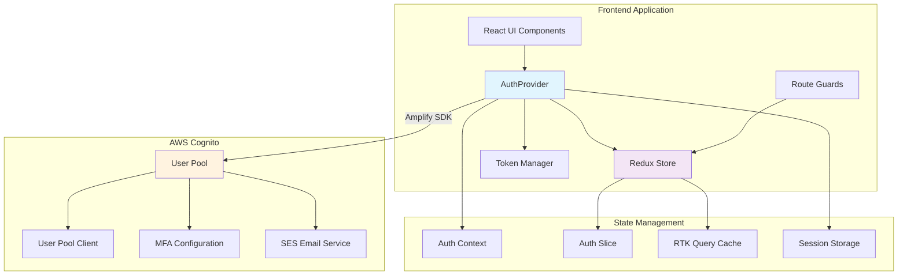

---

## Authentication Flows

### 1. Sign Up Flow

New user registration with email verification.

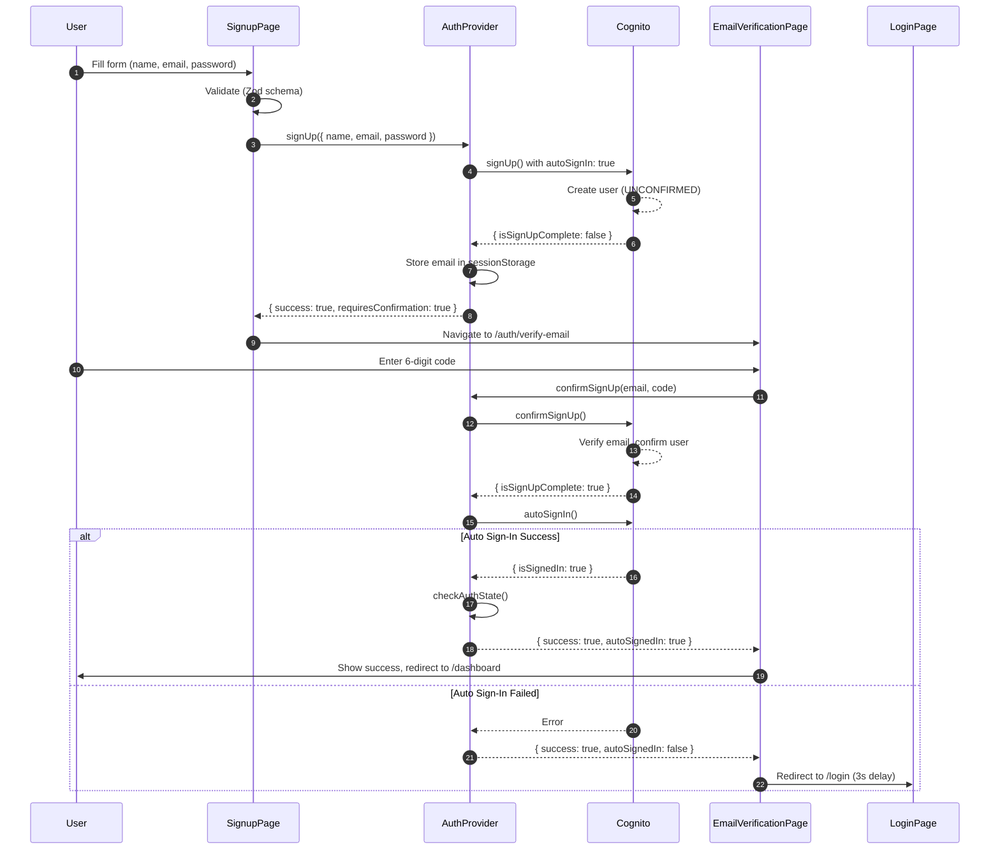

### 2. Sign In Flow

Standard login with optional MFA challenge handling.

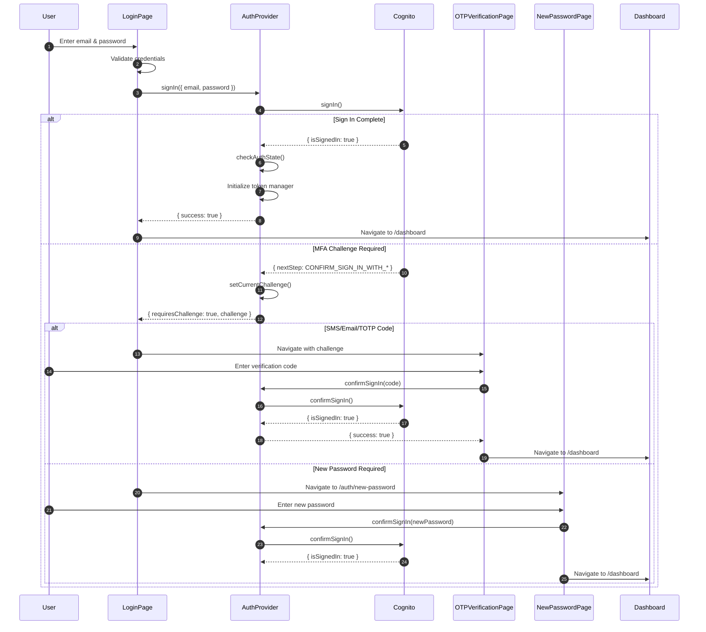

### 3. Forgot Password Flow

Password recovery with email verification.

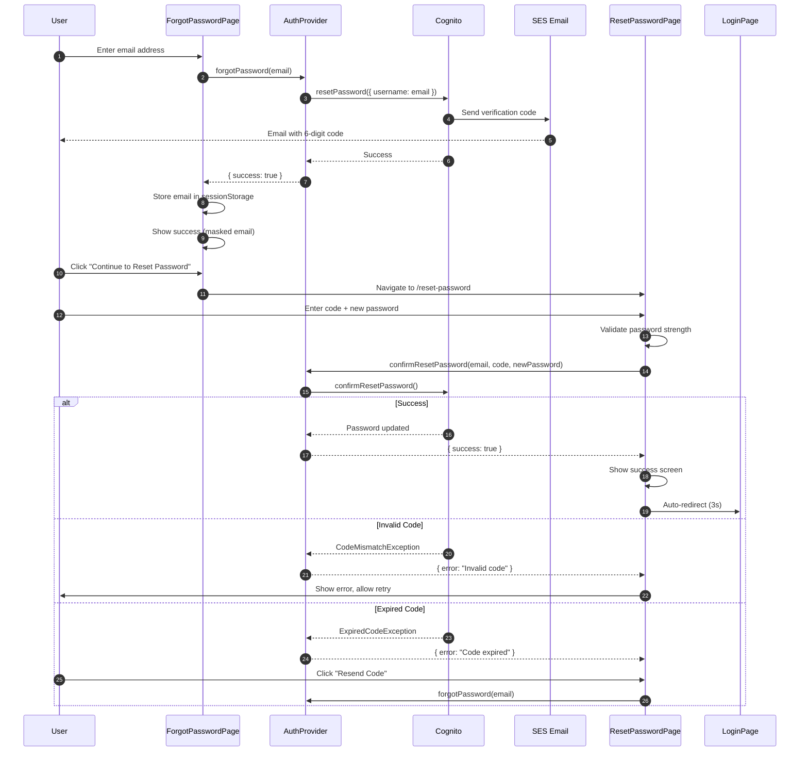

### 4. Logout Flow

Global sign-out with state cleanup.

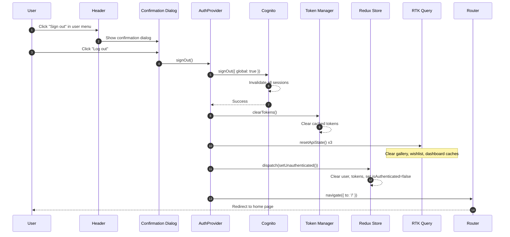

### 5. Token Refresh Flow

Automatic token refresh with Hub event synchronization.

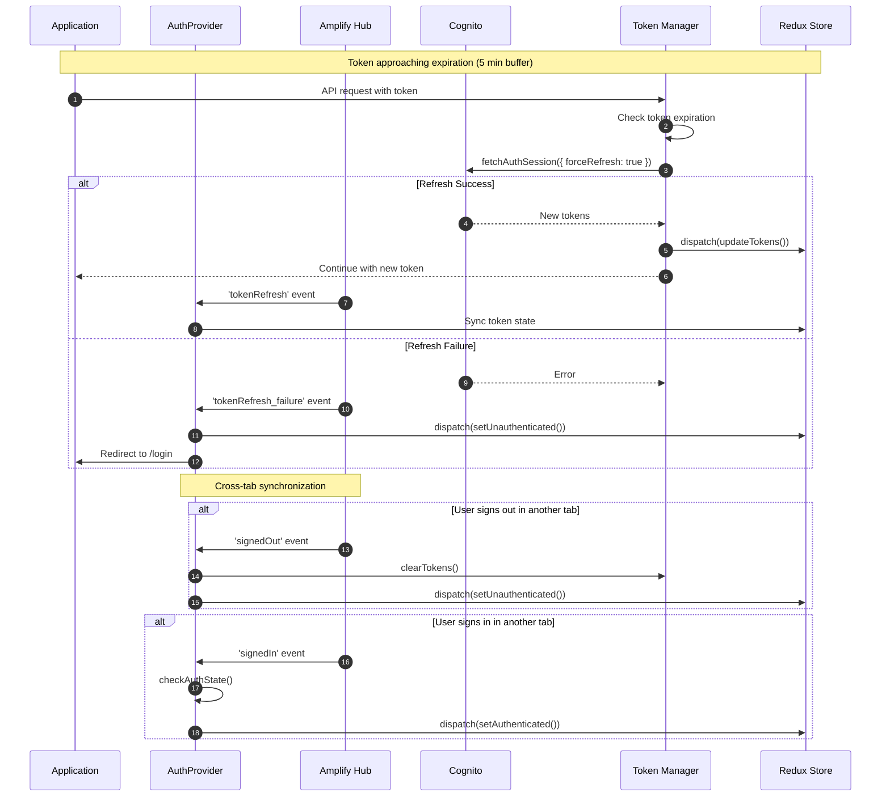

---

## Component Architecture

### Auth Provider Structure

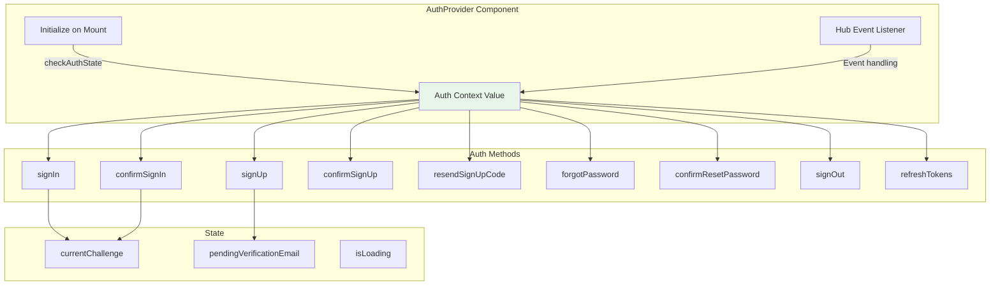

### Page Component Hierarchy

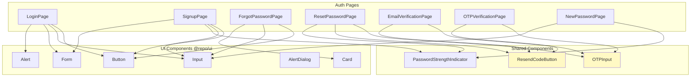

---

## Route Protection

### Guard System

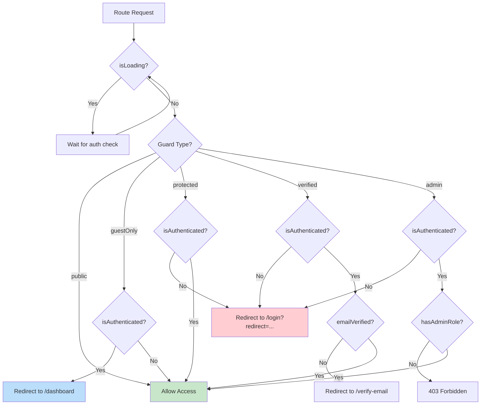

### Route Configuration

| Route | Guard | Component | Purpose |
|-------|-------|-----------|---------|
| `/` | public | HomePage | Landing page |
| `/login` | guestOnly | LoginPage | User sign in |
| `/register` | guestOnly | SignupPage | New user registration |
| `/forgot-password` | guestOnly | ForgotPasswordPage | Password recovery |
| `/reset-password` | guestOnly | ResetPasswordPage | Complete password reset |
| `/auth/verify-email` | guestOnly | EmailVerificationPage | Email verification |
| `/auth/otp-verification` | guestOnly | OTPVerificationPage | MFA challenge |
| `/auth/new-password` | guestOnly | NewPasswordPage | Force password change |
| `/dashboard` | protected | DashboardModule | User dashboard |
| `/wishlist` | protected | WishlistModule | User wishlist |
| `/instructions` | protected | InstructionsModule | MOC instructions |

---

## State Management

### Redux Auth Slice

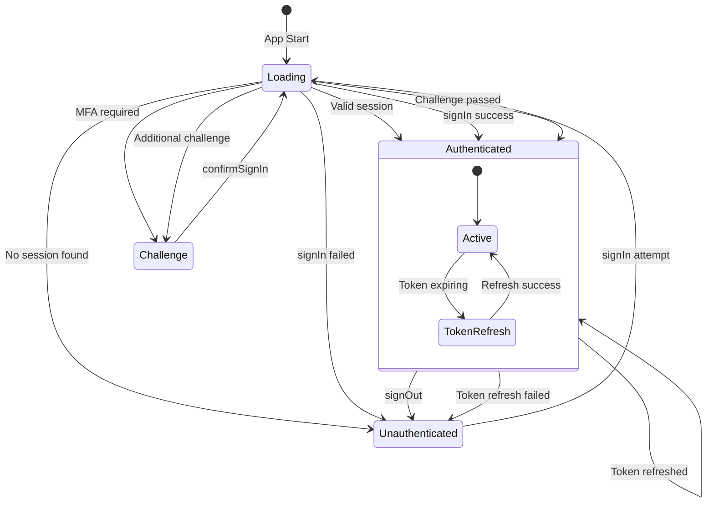

### Auth State Interface

```typescript
interface AuthState {
  isAuthenticated: boolean
  isLoading: boolean
  user: User | null
  tokens: {
    accessToken?: string
    idToken?: string
    refreshToken?: string
  } | null
  error: string | null
}

interface User {
  id: string
  email: string
  name?: string
  avatar?: string
  roles?: string[]
  preferences?: {
    theme?: 'light' | 'dark' | 'system'
    language?: string
    notifications?: boolean
  }
}
```

### Session Storage Usage

| Key | Purpose | Lifecycle |
|-----|---------|-----------|
| `pendingVerificationEmail` | Email awaiting verification | Cleared on verification success |
| `pendingResetEmail` | Email for password reset | Cleared on reset success |
| `auth_resend_cooldown` | Resend button cooldown expiry | Expires after cooldown |
| `auth_resend_attempts` | Number of resend attempts | Resets after 30 min inactivity |
| `auth_resend_attempt_reset` | Attempt count reset time | Updated on each attempt |

---

## Error Handling

### Cognito Error Mapping

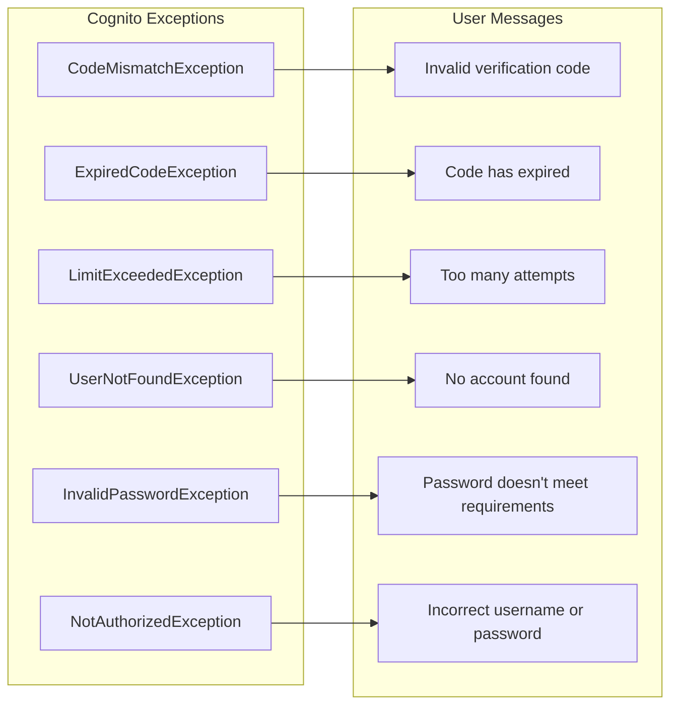

### Error Display Pattern

```typescript
// Component-level error handling
const [error, setError] = useState<string | null>(null)

try {
  const result = await authMethod()
  if (!result.success) {
    setError(result.error)
  }
} catch (e) {
  setError('An unexpected error occurred')
}

// Display
{error && (
  <Alert variant="destructive" role="alert">
    <AlertDescription>{error}</AlertDescription>
  </Alert>
)}
```

---

## Security Considerations

### Password Requirements

- Minimum 8 characters
- At least one uppercase letter
- At least one lowercase letter
- At least one number
- Optional: special characters (Cognito default)

### Rate Limiting

The ResendCodeButton implements exponential backoff:

```
Attempt 1: 60 seconds cooldown
Attempt 2: 120 seconds cooldown
Attempt 3: 240 seconds cooldown
Attempt 4: 480 seconds cooldown
Attempt 5+: 600 seconds cooldown (max)
```

Attempt count resets after 30 minutes of inactivity.

### Security Best Practices

1. **Account Enumeration Prevention**: Forgot password always shows success message
2. **Email Masking**: Display as `user***@domain.com`
3. **Global Sign-Out**: Invalidates all sessions across devices
4. **Token Security**: Tokens stored in memory, not localStorage
5. **HTTPS Only**: All Cognito communication over TLS
6. **Session Expiry**: Automatic logout on token refresh failure

---

## Amplify Configuration

### Environment Variables

```bash
VITE_AWS_USER_POOL_ID=us-east-1_xxxxxxxxx
VITE_AWS_USER_POOL_WEB_CLIENT_ID=xxxxxxxxxxxxxxxxxxxxxxxxxx
```

### Configuration Object

```typescript
const amplifyConfig = {
  Auth: {
    Cognito: {
      userPoolId: import.meta.env.VITE_AWS_USER_POOL_ID,
      userPoolClientId: import.meta.env.VITE_AWS_USER_POOL_WEB_CLIENT_ID,
      loginWith: {
        email: true
      }
    }
  }
}
```

### Token Manager Configuration

```typescript
initializeCognitoTokenManager(tokens, refreshFn, {
  enableRetryLogic: true,
  enablePerformanceMonitoring: true,
  maxRefreshRetries: 3,
  refreshRetryDelay: 1000,
  tokenExpirationBuffer: 300, // 5 minutes
  enableCircuitBreaker: true
})
```

---

## Testing Considerations

### Unit Test Coverage

| Component | Test File | Coverage Areas |
|-----------|-----------|----------------|
| AuthProvider | AuthProvider.test.tsx | All auth methods, Hub events |
| OTPInput | OTPInput.test.tsx | Input handling, keyboard nav, paste |
| ResendCodeButton | ResendCodeButton.test.tsx | Cooldown, attempts, callbacks |
| Header (logout) | Header.test.tsx | Confirmation dialog, signOut call |
| LoginPage | LoginPage.test.tsx | Form validation, challenge routing |
| SignupPage | SignupPage.test.tsx | Validation, password strength |

### Integration Test Scenarios

1. Full signup → verification → auto-login flow
2. Login → MFA challenge → dashboard access
3. Forgot password → reset → login with new password
4. Token refresh during active session
5. Cross-tab sign-out synchronization
6. Protected route redirect with return URL

---

## Accessibility

### ARIA Implementation

- `aria-live="polite"` for status updates
- `aria-invalid` on fields with validation errors
- `aria-describedby` linking error messages to fields
- `role="alert"` on error notifications
- Proper `<label>` associations for all inputs

### Keyboard Navigation

- Tab navigation through all form fields
- Enter to submit forms
- Escape to close dialogs
- Arrow keys for OTP input navigation
- Focus management on page transitions

---

## Change Log

| Date | Version | Description | Author |
|------|---------|-------------|--------|
| 2025-11-29 | 1.0 | Initial documentation | Architect Agent |

---

*Last Updated: 2025-11-29*
