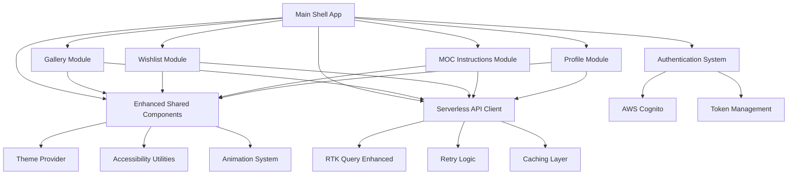

# Component Architecture

## New Components

### Enhanced Shared Component Library (@repo/ui-enhanced)

**Responsibility:** Provide modern, accessible, themeable components for all modular applications
**Integration Points:** Replaces and extends existing @repo/ui components with backward compatibility

**Key Interfaces:**

- Theme Provider API for consistent theming across modules
- Accessibility hooks and utilities for WCAG 2.1 AA compliance
- Animation system integration with Framer Motion
- Responsive design utilities with consistent breakpoints

**Dependencies:**

- **Existing Components:** Extends current @repo/ui components
- **New Components:** Theme system, accessibility utilities, animation library

**Technology Stack:** React 19, Tailwind CSS v4, Framer Motion, Lucide React icons

### Modular Application Shell (Main App)

**Responsibility:** Provide unified routing, authentication, and layout management for all modular applications
**Integration Points:** Coordinates between modular apps and shared services

**Key Interfaces:**

- Module loading and lazy loading coordination
- Authentication state management across modules
- Shared layout and navigation components
- Error boundary and loading state management

**Dependencies:**

- **Existing Components:** Current authentication, routing, and layout systems
- **New Components:** Module loader, enhanced navigation, theme provider

**Technology Stack:** React 19, TanStack Router, Redux Toolkit, AWS Amplify

### Serverless API Client (Enhanced)

**Responsibility:** Optimized API communication with serverless backend including retry logic and performance optimization
**Integration Points:** Replaces current API client with enhanced serverless patterns

**Key Interfaces:**

- RTK Query endpoint definitions with serverless optimization
- Retry logic and error handling for cold starts
- Request/response caching optimized for serverless patterns
- Authentication token management with serverless endpoints

**Dependencies:**

- **Existing Components:** Current RTK Query setup and caching strategies
- **New Components:** Serverless optimization utilities, enhanced error handling

**Technology Stack:** RTK Query, custom retry logic, enhanced caching layer

### Gallery Module Application

**Responsibility:** Standalone gallery application with enhanced UI and serverless integration
**Integration Points:** Integrates with main shell app and shared component library

**Key Interfaces:**

- Gallery browsing and filtering with enhanced UX
- Image optimization and progressive loading
- Integration with wishlist functionality
- Search and discovery features

**Dependencies:**

- **Existing Components:** Current gallery features from packages/features/gallery
- **New Components:** Enhanced UI components, serverless API integration

**Technology Stack:** React 19, enhanced @repo/ui components, optimized image handling

### Wishlist Module Application

**Responsibility:** Standalone wishlist management with improved organization and sharing features
**Integration Points:** Integrates with gallery module and user profile systems

**Key Interfaces:**

- Wishlist creation, organization, and management
- Drag-and-drop functionality for list organization
- Sharing and collaboration features
- Integration with gallery for item addition

**Dependencies:**

- **Existing Components:** Current wishlist features from packages/features/wishlist
- **New Components:** Enhanced list management UI, sharing utilities

**Technology Stack:** React 19, drag-and-drop libraries, enhanced UI components

### MOC Instructions Module Application

**Responsibility:** Standalone MOC creation and management with enhanced file handling and step-by-step interface
**Integration Points:** Integrates with file upload services and user profile systems

**Key Interfaces:**

- MOC creation wizard with improved UX
- Enhanced file upload with progress indicators
- Step-by-step instruction builder
- Parts list management and integration

**Dependencies:**

- **Existing Components:** Current MOC features from packages/features/moc-instructions
- **New Components:** Enhanced creation UI, file management utilities

**Technology Stack:** React 19, file upload optimization, enhanced form components

### Profile Module Application

**Responsibility:** Standalone user profile management with enhanced settings and preferences
**Integration Points:** Integrates with authentication system and user data management

**Key Interfaces:**

- User profile editing and management
- Preference and settings management
- Activity tracking and statistics
- Account security and privacy controls

**Dependencies:**

- **Existing Components:** Current profile features from packages/features/profile
- **New Components:** Enhanced settings UI, preference management

**Technology Stack:** React 19, form validation, settings management utilities

## Component Interaction Diagram

