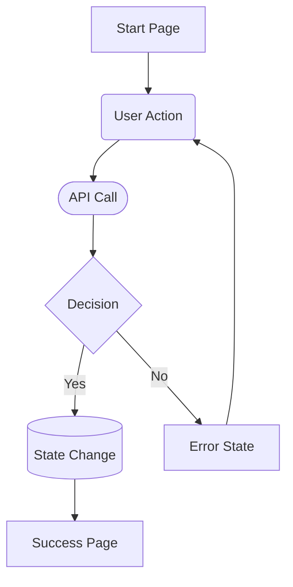

# [Flow Name]

## Overview

[Brief description of what this flow accomplishes and why it exists.]

## Prerequisites

- [Auth state required]
- [Data dependencies]
- [Feature flags if any]

## Flow Diagram

## Steps

1. User navigates to [entry point]
2. User performs [action]
3. System [response]
4. On success: [outcome]
5. On failure: [outcome]

## Error States

| Error | Trigger | User Message | Recovery |
|-------|---------|--------------|----------|
| [Error name] | [What causes it] | [Message shown] | [How user recovers] |

## Edge Cases

- [Describe edge case and how it's handled]

## UX Gaps / TODOs

- [ ] [Known issue or improvement needed]

## Related Flows

- [Link to related flow if applicable]

---

## Changelog

| Date | Author | Change |
|------|--------|--------|
| YYYY-MM-DD | [name] | Initial draft |
