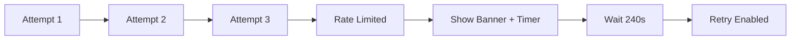

# Forgot Password Flow

## Overview

Users who forget their password can request a reset code. For security, the system always shows a success message regardless of whether the email exists (prevents account enumeration attacks). The user is then directed to the reset password page.

## Prerequisites

- User must be logged out (guestOnly route guard)

## Flow Diagram

```mermaid
flowchart TD
    A[/forgot-password] --> B(Enter email address)
    B --> C{Valid email format?}

    C -->|No| D[Show validation error]
    D --> B

    C -->|Yes| E([authProvider.forgotPassword])
    E --> F{Response?}

    F -->|Success| G[(Store email in sessionStorage)]
    F -->|UserNotFoundException| G

    G --> H[Show success message]
    H --> I[Display masked email]
    I --> J(Click "Continue to Reset Password")
    J --> K[/reset-password]

    F -->|LimitExceededException| L[Show rate limit error]
    L --> B

    F -->|NetworkError| M[Show network error]
    M --> B
```

## Steps

1. User navigates to `/forgot-password` (often via login page link)
2. User enters email address
3. Frontend validates email format
4. User clicks "Send Reset Code"
5. `authProvider.forgotPassword(email)` called
6. **Security**: Always shows success, even if email not found
7. Email stored in `sessionStorage.pendingResetEmail`
8. Success message displayed with masked email
9. User has options:
   - "Continue to Reset Password" → `/reset-password`
   - "Try a different email" → clear form, retry
10. If email exists in Cognito, reset code sent to inbox

## Security Considerations

**Account Enumeration Prevention**:
- System always returns success message
- No indication whether email exists in system
- Attacker cannot determine valid accounts
- Rate limiting prevents brute force attempts

## Error States

| Error | Trigger | User Message | Recovery |
|-------|---------|--------------|----------|
| InvalidParameterException | Invalid email format | "Please enter a valid email address" | Fix email format |
| LimitExceededException | Too many requests | "Too many attempts. Please try again later." | Wait and retry |
| NetworkError | API unreachable | "Unable to connect. Please try again." | Check connection, retry |

Note: `UserNotFoundException` is intentionally handled as success for security.

## Edge Cases

- **User not found**: Success shown anyway (security)
- **User already verified**: Normal reset flow proceeds
- **Unverified user**: May receive both verification and reset codes
- **Multiple requests**: Each generates new code, invalidates previous

## UX Gaps / TODOs

- [ ] No E2E test coverage
- [ ] No "check spam folder" hint on success
- [ ] No loading state on submit button

## Related Flows

- [Reset Password](./reset-password.md) - Next step after this flow
- [Login](./login.md) - Return path

---

## Changelog

| Date | Author | Change |
|------|--------|--------|
| 2026-01-25 | michael | Initial documentation |

## Rate Limiting

AWS Cognito enforces service-level rate limiting on `forgotPassword` operations to prevent abuse. After multiple rapid requests (~5 per minute), Cognito returns a `LimitExceededException`.

**Frontend Handling**:
- Track attempts in sessionStorage
- Calculate exponential backoff (60s → 120s → 240s → 480s → 600s max)
- Display `RateLimitBanner` with countdown timer
- Disable submit button during cooldown

**UX Flow**:


**Technical Details**: See [Password Reset Rate Limiting Implementation Guide](../../guides/password-reset-rate-limiting.md)

**Related Story**: [BUGF-027](../../../plans/future/bug-fix/in-progress/BUGF-027/BUGF-027.md), [BUGF-019](../../../plans/future/bug-fix/ready-to-work/BUGF-019/BUGF-019.md)
