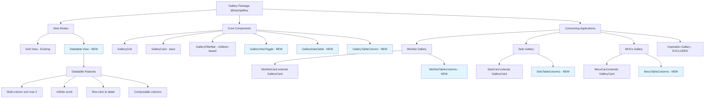
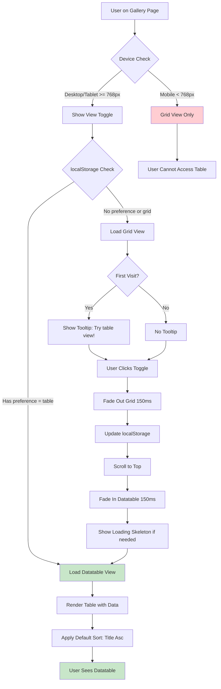
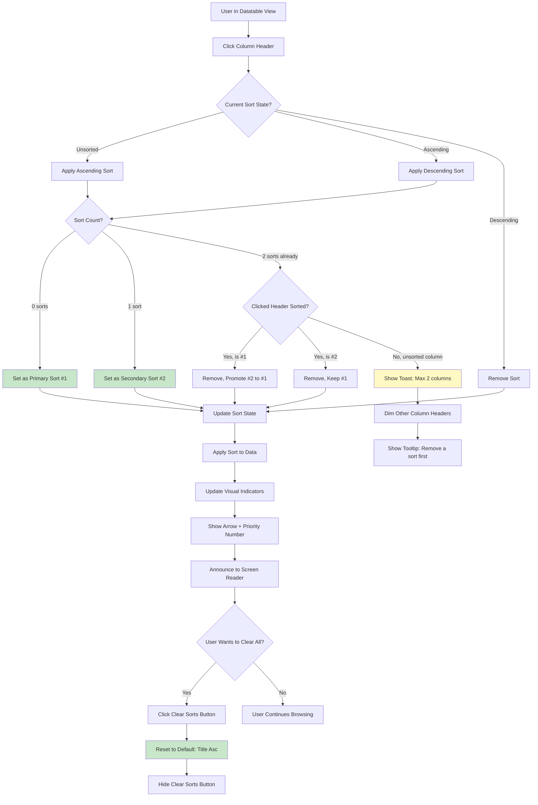
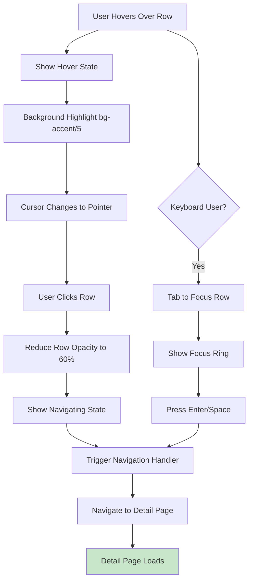

# Gallery Datatable View Mode UI/UX Specification

## Introduction

This document defines the user experience goals, information architecture, user flows, and visual design specifications for the Gallery Datatable View Mode user interface. It serves as the foundation for visual design and frontend development, ensuring a cohesive and user-centered experience.

**Project:** Gallery Datatable View Mode - Brownfield Enhancement
**Package:** `@repo/gallery`
**Epic Reference:** `/docs/stories/epic-3-shared-gallery/EPIC-datatable-view-mode.md`
**Target Users:** Desktop/tablet users viewing wishlist, sets, and MOCs galleries

**Technology Stack:**
- **UI Framework:** React 19
- **Styling:** Tailwind CSS v3+
- **Component Library:** shadcn/ui (Radix UI primitives)
- **Table Library:** TanStack Table v8
- **Animation:** Framer Motion
- **Validation:** Zod (schemas for all props and data)
- **Forms:** React Hook Form (with Zod resolver)
- **Testing:** Vitest + React Testing Library
- **Type Safety:** TypeScript strict mode

### Change Log

| Date | Version | Description | Author |
|------|---------|-------------|--------|
| 2025-12-28 | 1.0 | Initial front-end specification created | Sally (UX Expert) |
| 2025-12-28 | 1.1 | Updated with Tailwind, shadcn, Framer Motion, Vitest, Zod, React Hook Form examples and implementation details | Sally (UX Expert) |

## Overall UX Goals & Principles

### Target User Personas

**Power Users (Data-Oriented):**
- LEGO collectors managing large wishlist/sets databases (100+ items)
- Need to compare multiple attributes simultaneously (price, piece count, release date)
- Prefer keyboard shortcuts and efficient workflows
- Comfortable with spreadsheet-like interfaces

**Casual Users (Visual Browsers):**
- LEGO enthusiasts casually browsing galleries
- Prefer visual grid view for inspiration
- May occasionally switch to table for quick comparisons
- Value simplicity and clear visual feedback

**Mobile Users (Grid-Only):**
- Users on phones/small tablets (< 768px)
- Always see grid view (datatable hidden)
- Need touch-friendly interactions
- Value performance and quick loading

### Usability Goals

- **Discoverability:** Users discover table view option within 30 seconds of viewing gallery
- **View switching:** Toggle between grid/table views in < 1 second with smooth transition
- **Sorting clarity:** Users understand multi-column sort priority at a glance (visual indicators)
- **Accessibility:** All interactions keyboard-navigable, screen reader compatible
- **Performance:** Table renders 100 items in < 100ms, infinite scroll remains smooth
- **Learnability:** New users can sort by multiple columns without instructions
- **Persistence:** View preference remembered across sessions (localStorage)

### Design Principles

1. **Progressive Enhancement** - Grid view is the baseline; datatable is an enhancement for power users
2. **Clarity over Density** - Prioritize readable layouts over cramming maximum data
3. **Consistent Interactions** - Row clicks match card clicks; filters work identically across views
4. **Accessible by Default** - Keyboard navigation, ARIA labels, screen reader support built-in from start
5. **Immediate Feedback** - Every interaction (hover, click, sort) has clear visual response within 150ms

## Information Architecture (IA)

### Site Map / Screen Inventory



### Navigation Structure

**Primary Navigation (Gallery Toolbar):**
- Left side: Filter components (passed as children, varies per gallery type)
- Right side: View toggle (Grid/Table icons), "Clear sorts" button (conditional)
- Responsive: Mobile (< 768px) hides view toggle, shows filters only

**Secondary Navigation (Within Datatable):**
- Column headers: Clickable for sorting, visual indicators for active sorts
- Table footer: Infinite scroll indicator ("Scroll for more" or loading spinner)
- No pagination controls (infinite scroll pattern)

**State Management:**
- View mode: Stored in `localStorage` per gallery (e.g., `gallery_view_mode_wishlist`)
- Sort state: In-memory only, resets on page load to default (title ascending)
- Filter state: Managed by existing `useGalleryState` hook, persists in URL

## User Flows

### Flow 1: Switch from Grid to Datatable View

**User Goal:** View gallery items in a structured table format to compare attributes

**Entry Points:**
- User lands on gallery page (wishlist/sets/mocs)
- First-time user sees tooltip hint on view toggle
- Returning user may have table view as saved preference

**Success Criteria:** User successfully switches to datatable view and sees data in table format within 1 second

#### Flow Diagram



#### Edge Cases & Error Handling:

- **localStorage unavailable (private mode):** Fall back to URL param, then default grid
- **Tooltip dismissed:** Store dismissal in localStorage, don't show again
- **Large dataset (500+ items):** Show skeleton while table renders, maintain smooth transition
- **User clicks toggle rapidly:** Debounce toggle to prevent animation conflicts
- **View preference conflicts (localStorage vs URL):** localStorage takes precedence

**Notes:** Transition uses Framer Motion with `mode="wait"` to prevent layout shift. Active view icon highlighted with accent color.

---

### Flow 2: Sort by Multiple Columns

**User Goal:** Sort gallery items by up to 2 attributes (e.g., price ascending, then piece count descending)

**Entry Points:**
- User in datatable view
- User wants to organize items by multiple criteria

**Success Criteria:** User successfully applies multi-column sort with clear visual feedback showing priority

#### Flow Diagram



#### Edge Cases & Error Handling:

- **Third column click when 2 sorted:** Disable header, show tooltip "Remove a sort column first (max 2)"
- **Rapidly clicking column header:** Debounce by 200ms to prevent state conflicts
- **Sorting while infinite scroll loading:** Queue sort until current batch loads
- **Removing primary sort:** Automatically promote secondary sort to primary position
- **No sortable columns:** Hide sort-related UI entirely
- **Screen reader:** Announce "Sorted by [column] [direction], priority [number]" via aria-live

**Notes:** Sort indicators use superscript Unicode (₁, ₂) for priority. "Clear sorts" button only visible when user has active sorts.

---

### Flow 3: View Item Details from Datatable Row

**User Goal:** Navigate to item detail page by clicking a table row

**Entry Points:**
- User browsing datatable
- User wants to see full details of a specific item

**Success Criteria:** Clicking row navigates to detail page, matching grid card click behavior

#### Flow Diagram



#### Edge Cases & Error Handling:

- **Click on sortable column header:** Don't navigate, only sort (event propagation stopped)
- **Double-click:** Prevent double navigation with loading state
- **Slow network:** Show loading state (reduced opacity) until navigation completes
- **Navigation cancelled:** Restore row to normal state
- **Keyboard focus on non-interactive cell:** Entire row is focusable, Enter navigates
- **Touch device:** Ensure row has adequate touch target (min 44px height)

**Notes:** Row click behavior matches existing card click pattern. Hover transitions use 150ms ease for smoothness.

---

## Component Library / Design System

### Design System Approach

**Existing Foundation:** This project uses **shadcn/ui** components from `@repo/app-component-library` built on Radix UI primitives. The datatable implementation will leverage shadcn's Data Table component (built on TanStack Table v8).

**Technology Integration:**
- **Tailwind CSS:** All styling using utility classes, no custom CSS files
- **shadcn/ui:** Leverage existing components (Button, Tooltip, Toast) from `@repo/app-component-library`
- **Zod:** Schema-first validation for all component props and form data
- **React Hook Form:** Form state management with Zod resolver for validation
- **Framer Motion:** Declarative animations via `<motion.*>` components
- **Vitest:** Unit tests for all components with React Testing Library
- **TanStack Table:** Headless table logic with shadcn UI layer

**New Components Strategy:**
- Extend existing gallery component patterns (composable, children-based)
- **Zod-first type definitions** - All props validated with schemas, types inferred via `z.infer<>`
- **Tailwind-only styling** - No custom CSS, use design tokens from theme
- **Framer Motion animations** - Declarative, respect `prefers-reduced-motion`
- **Vitest + RTL testing** - Minimum 80% coverage, accessibility tests with jest-axe
- Maintain accessibility-first approach (ARIA labels, keyboard nav)

### Core Components

#### 1. GalleryViewToggle

**Purpose:** Allow users to switch between grid and datatable view modes on desktop/tablet devices

**Variants:**
- **Default:** Two-button toggle group (Grid icon | Table icon)
- **With tooltip:** First-time users see dismissible hint

**States:**
- **Active:** Currently selected view (highlighted with accent color)
- **Inactive:** Available alternative view (neutral color)
- **Hidden:** Mobile devices (< 768px) - component not rendered

**Props (Zod Schema):**
```typescript
import { z } from 'zod'

const ViewModeSchema = z.enum(['grid', 'datatable'])

const GalleryViewTogglePropsSchema = z.object({
  currentView: ViewModeSchema,
  onViewChange: z.function().args(ViewModeSchema).returns(z.void()),
  showFirstTimeHint: z.boolean().optional(),
  onDismissHint: z.function().args().returns(z.void()).optional(),
  className: z.string().optional(),
})

type GalleryViewToggleProps = z.infer<typeof GalleryViewTogglePropsSchema>
```

**Implementation Notes:**
- Use shadcn `ToggleGroup` component from `@repo/app-component-library`
- Wrap in Framer Motion `<motion.div>` for first-time hint animation
- Tooltip uses shadcn `Tooltip` component
- Styled entirely with Tailwind classes (no custom CSS)

**Usage Guidelines:**
- Place in gallery toolbar, right-aligned with filter controls on left
- Ensure 44x44px minimum touch target size
- Use lucide-react icons: `LayoutGrid` for grid, `Table` for datatable
- Tooltip hint: "Try table view!" - dismissible, stored in localStorage
- Active view icon should have `aria-pressed="true"`

---

#### 2. GalleryDataTable

**Purpose:** Render gallery items in a structured table format with sortable columns and infinite scroll

**Variants:**
- **Default:** Standard table with all features
- **Loading:** Skeleton state while data fetches
- **Empty:** No items to display
- **Error:** Failed to load data

**States:**
- **Normal:** Displaying data with interaction enabled
- **Loading:** Initial render or infinite scroll loading
- **Sorting:** Column sort in progress (debounced)
- **Navigating:** Row clicked, navigation in progress

**Props (Zod Schema):**
```typescript
import { z } from 'zod'

const SortDirectionSchema = z.enum(['asc', 'desc'])
const SortPrioritySchema = z.union([z.literal(1), z.literal(2)])

const SortColumnSchema = z.object({
  field: z.string(),
  direction: SortDirectionSchema,
  priority: SortPrioritySchema,
})

type SortColumn = z.infer<typeof SortColumnSchema>

// Generic schema factory for any item type
const GalleryDataTablePropsSchema = <TItem extends z.ZodTypeAny>(itemSchema: TItem) =>
  z.object({
    items: z.array(itemSchema),
    isLoading: z.boolean().optional(),
    error: z.instanceof(Error).nullable().optional(),
    onRowClick: z.function().args(itemSchema).returns(z.void()),
    sortState: z.array(SortColumnSchema).max(2).optional(),
    onSortChange: z.function().args(z.array(SortColumnSchema)).returns(z.void()).optional(),
    children: z.custom<React.ReactNode>(), // GalleryTableColumn components
    onLoadMore: z.function().args().returns(z.void()).optional(),
    hasMore: z.boolean().optional(),
    className: z.string().optional(),
  })
```

**Implementation Notes:**
- Built on **TanStack Table v8** (`@tanstack/react-table`)
- Use shadcn Data Table pattern as foundation
- Row virtualization via TanStack's `useVirtualizer` hook
- Infinite scroll with Intersection Observer API
- All table elements use semantic HTML (`<table>`, `<thead>`, `<tbody>`)
- Styled with Tailwind utility classes only

**Usage Guidelines:**
- Only render on desktop/tablet (>= md: 768px)
- Children should be `GalleryTableColumn` components defining columns
- Row clicks navigate to detail view (matches card behavior)
- Infinite scroll triggers `onLoadMore` when 200px from bottom
- TanStack Table handles virtualization for performance
- Entire row is keyboard-focusable (not individual cells)

---

#### 3. GalleryTableColumn

**Purpose:** Define individual column configuration using children pattern (composable)

**Variants:**
- **Sortable:** Column header clickable for sorting
- **Non-sortable:** Display-only column
- **Custom render:** Accepts render function for complex cell content

**States:**
- **Unsorted:** No active sort on this column
- **Sorted ascending:** Arrow up (↑) + priority number if multi-column
- **Sorted descending:** Arrow down (↓) + priority number
- **Disabled:** When sort limit reached (2 columns), dim header

**Props (Zod Schema):**
```typescript
import { z } from 'zod'

const ColumnFormatSchema = z.enum(['text', 'currency', 'date', 'number', 'custom'])

const GalleryTableColumnPropsSchema = <TItem extends z.ZodTypeAny>(itemSchema: TItem) =>
  z.object({
    field: z.string(), // keyof TItem inferred from usage
    label: z.string().min(1),
    sortable: z.boolean().optional().default(false),
    format: ColumnFormatSchema.optional().default('text'),
    render: z.function().args(z.any(), itemSchema).returns(z.custom<React.ReactNode>()).optional(),
    width: z.union([z.string(), z.number()]).optional(),
    className: z.string().optional(),
  })

type GalleryTableColumnProps<TItem> = z.infer<ReturnType<typeof GalleryTableColumnPropsSchema>>
```

**Implementation Notes:**
- Uses TanStack Table's `createColumnHelper` for type safety
- Format functions use existing utilities (e.g., `formatCurrency`, `formatDate`)
- Styled with Tailwind utilities for headers and cells
- Column width accepts Tailwind width classes (`w-32`, `w-1/4`) or CSS values

**Usage Guidelines:**
- Pass as children to `GalleryDataTable`
- Sortable columns show subtle hover state on header
- Format prop auto-formats common types (e.g., currency: $12.99)
- Custom render function for complex cells (e.g., priority badges)
- Max 2 columns can be sorted simultaneously
- Sort priority shown as superscript: ₁ (primary), ₂ (secondary)

**Example:**
```tsx
<GalleryDataTable items={wishlistItems} onRowClick={handleRowClick}>
  <GalleryTableColumn field="title" label="Title" sortable />
  <GalleryTableColumn field="price" label="Price" sortable format="currency" />
  <GalleryTableColumn field="store" label="Store" />
  <GalleryTableColumn
    field="priority"
    label="Priority"
    render={(val) => <PriorityBadge level={val} />}
  />
</GalleryDataTable>
```

---

#### 4. GalleryDataTableSkeleton

**Purpose:** Loading placeholder while table data fetches

**Variants:**
- **Dynamic columns:** Adjusts to expected column count
- **Fixed rows:** Always shows 10 skeleton rows

**States:**
- **Shimmer animation:** Pulse effect (Tailwind animate-pulse)

**Props:**
```typescript
interface GalleryDataTableSkeletonProps {
  columns: number // Number of columns to show
  rows?: number // Default 10
  className?: string
}
```

**Usage Guidelines:**
- Shown during initial table load or view switch
- Shimmer effect uses `bg-muted animate-pulse`
- Match column widths to actual table for smooth transition
- Automatically hidden when real data loads

---

#### 5. GalleryTableError

**Purpose:** Display error state when table data fails to load

**Variants:**
- **With retry:** Shows retry button
- **Generic:** Simple error message

**States:**
- **Default:** Error displayed
- **Retrying:** Retry action in progress

**Props:**
```typescript
interface GalleryTableErrorProps {
  error: Error
  onRetry?: () => void
  className?: string
}
```

**Usage Guidelines:**
- Center-aligned in table container
- Shows error message with retry button if `onRetry` provided
- Icon: Alert circle (lucide-react `AlertCircle`)
- Button: "Try Again" using shadcn Button component
- Announce error to screen reader via aria-live="assertive"

---

#### 6. GalleryTableEmpty

**Purpose:** Display when no items exist or no results match filters

**Variants:**
- **No items:** Empty gallery (CTA: "Add your first item")
- **No results:** After filtering (CTA: "Clear filters")

**States:**
- **Default:** Message displayed
- **With action:** CTA button enabled

**Props:**
```typescript
interface GalleryTableEmptyProps {
  variant: 'no-items' | 'no-results'
  onClearFilters?: () => void
  onAddItem?: () => void
  className?: string
}
```

**Usage Guidelines:**
- Center-aligned in table container
- Icon varies by variant (inbox for no-items, search-x for no-results)
- Message text adapts to context
- CTA button prominence (primary for no-items, secondary for no-results)
- Maintain consistent height with table to prevent layout shift

---

## Branding & Style Guide

### Visual Identity

**Brand Guidelines:** This project follows a LEGO-inspired design theme with a Sky/Teal color palette. The visual identity emphasizes playful professionalism, clarity, and accessibility.

**Design System:** shadcn/ui (Radix UI primitives + Tailwind CSS)

### Color Palette

| Color Type | Hex Code | Usage |
|------------|----------|-------|
| Primary | `hsl(199 89% 48%)` | Main brand color (Sky blue), primary actions, active states |
| Secondary | `hsl(173 80% 40%)` | Teal accent, secondary actions, highlights |
| Accent | `hsl(199 89% 48%)` | Interactive elements, view toggle active state |
| Success | `hsl(142 76% 36%)` | Positive feedback, confirmations, success states |
| Warning | `hsl(38 92% 50%)` | Cautions, important notices, sort limit warnings |
| Error | `hsl(0 84% 60%)` | Errors, destructive actions, failed states |
| Muted | `hsl(210 40% 96%)` | Backgrounds, disabled states, skeleton loaders |
| Border | `hsl(214 32% 91%)` | Table borders, dividers, separators |

**Datatable-Specific Colors:**
- **Row hover:** `bg-accent/5` (very subtle highlight)
- **Row focus:** `ring-2 ring-primary` (keyboard focus ring)
- **Sorted column header:** `bg-muted/50` (active sort indicator)
- **Disabled header:** `opacity-40` (when 2 sorts active)

### Typography

#### Font Families
- **Primary:** `Inter` (system font stack fallback)
- **Secondary:** Same as primary (single font for consistency)
- **Monospace:** `ui-monospace, SFMono-Regular, Menlo` (for data values if needed)

#### Type Scale

| Element | Size | Weight | Line Height |
|---------|------|--------|-------------|
| Table Header | 0.875rem (14px) | 600 (semi-bold) | 1.25rem |
| Table Cell | 0.875rem (14px) | 400 (normal) | 1.5rem |
| Sort Priority | 0.75rem (12px) | 600 (semi-bold) | 1rem |
| Empty State Title | 1.125rem (18px) | 600 (semi-bold) | 1.75rem |
| Empty State Body | 0.875rem (14px) | 400 (normal) | 1.5rem |
| Tooltip | 0.875rem (14px) | 400 (normal) | 1.25rem |

**Notes:**
- Table text uses 14px for optimal readability in data-dense layouts
- Sort indicators (₁, ₂) use superscript Unicode, not CSS positioning
- All text meets WCAG AA contrast requirements

### Iconography

**Icon Library:** lucide-react (already in project dependencies)

**Core Icons:**
- **Grid view:** `LayoutGrid` (3x3 grid icon)
- **Table view:** `Table` (table rows icon)
- **Sort ascending:** `ArrowUp` (↑ alternative if Unicode fails)
- **Sort descending:** `ArrowDown` (↓ alternative if Unicode fails)
- **Loading:** `Loader2` with spin animation
- **Error:** `AlertCircle`
- **Empty (no items):** `Inbox`
- **Empty (no results):** `SearchX`

**Usage Guidelines:**
- Icons sized at 16px (w-4 h-4) for table headers
- Icons sized at 20px (w-5 h-5) for view toggle buttons
- Use `strokeWidth={2}` for all icons (consistent visual weight)
- Apply `aria-hidden="true"` since text labels present

### Spacing & Layout

**Grid System:** Tailwind CSS default (12-column responsive grid)

**Spacing Scale:** Tailwind default (4px base unit)

**Datatable-Specific Spacing:**
- **Column padding:** `px-4 py-3` (16px horizontal, 12px vertical)
- **Row height:** Minimum 44px for touch targets
- **Table container padding:** `p-4` (16px all sides)
- **View toggle gap:** `gap-1` (4px between grid/table buttons)
- **Toolbar spacing:** `justify-between` (filters left, actions right)

**Responsive Breakpoints:**
- **Mobile:** `< 768px` (grid view only, toggle hidden)
- **Tablet:** `768px - 1024px` (both views available)
- **Desktop:** `>= 1024px` (both views available)
- **Wide:** `>= 1280px` (optimal table width, more columns visible)

---

## Accessibility Requirements

### Compliance Target

**Standard:** WCAG 2.1 Level AA

**Rationale:** Level AA compliance ensures the datatable is usable by the widest range of users, including those with visual, motor, and cognitive disabilities. This aligns with the project's "Accessible by Default" design principle.

### Key Requirements

#### Visual

**Color Contrast Ratios:**
- Normal text (14px table cells): Minimum 4.5:1 contrast ratio
- Large text (18px+ empty states): Minimum 3:1 contrast ratio
- Interactive elements: Minimum 3:1 for boundaries/states
- **Verified combinations:**
  - Text on white: `hsl(0 0% 15%)` = 12.63:1 ✓
  - Primary on white: `hsl(199 89% 48%)` = 3.64:1 ✓
  - Border on white: `hsl(214 32% 91%)` = 1.27:1 (decorative only)

**Focus Indicators:**
- Keyboard focus ring: `ring-2 ring-primary ring-offset-2`
- Focus ring contrast: Minimum 3:1 against background
- Focus ring size: 2px solid, 2px offset
- All interactive elements must have visible focus state

**Text Sizing:**
- Users can zoom to 200% without loss of functionality
- Table layout remains usable at 200% zoom (horizontal scroll if needed)
- No fixed pixel heights that break responsive scaling

#### Interaction

**Keyboard Navigation:**
- **Tab order:** Filters → View toggle → Table (if datatable) or Grid (if grid)
- **View toggle:** Tab to focus, Enter/Space to activate, Arrow keys to switch
- **Table rows:** Tab to focus, Enter/Space to navigate to detail
- **Column headers:** Tab to focus, Enter/Space to sort, Escape to clear focus
- **Clear sorts button:** Tab to focus, Enter/Space to clear all sorts
- **No keyboard traps:** User can Tab out of all components

**Screen Reader Support:**
- **Table semantics:** `<table>`, `<thead>`, `<tbody>`, `<tr>`, `<th>`, `<td>` with proper nesting
- **View toggle:** `role="group"` with `aria-label="View mode selector"`
- **Active view:** `aria-pressed="true"` on selected button
- **Sort state:** `aria-sort="ascending"` or `aria-sort="descending"` on `<th>`
- **Sort priority:** `aria-label="Title, sorted ascending, priority 1 of 2"`
- **Live regions:** `aria-live="polite"` announces sort changes and result counts
- **Row count:** `aria-rowcount` and `aria-colcount` attributes on table

**Touch Targets:**
- Minimum size: 44x44px for all interactive elements
- View toggle buttons: 44x44px each (meets requirement)
- Table rows: Minimum 44px height (enforced in CSS)
- Column headers: Minimum 44px height with padding
- Adequate spacing between targets (minimum 8px gap)

#### Content

**Alternative Text:**
- All icons have `aria-hidden="true"` since accompanying text labels present
- View toggle: Text labels "Grid view" and "Table view" (visually hidden if needed)
- Loading spinner: `aria-label="Loading more items"`
- Empty state icons: Decorative, hidden from screen readers

**Heading Structure:**
- Table container has `<h2>` or appropriate level (context-dependent)
- Empty state titles use semantic headings (`<h3>`)
- Logical heading hierarchy maintained (no skipped levels)

**Form Labels:**
- View toggle buttons have accessible labels (text or aria-label)
- Sort controls have descriptive labels
- All interactive elements identifiable to assistive tech

### Testing Strategy

**Automated Testing:**
- **Vitest:** Unit tests for all components with React Testing Library
- **jest-axe (via Vitest):** Accessibility violation tests for all states
- **axe DevTools:** Manual browser testing on all datatable states
- **Lighthouse Accessibility:** Achieve score of 95+ in CI
- **Pa11y CI:** Automated checks in CI/CD pipeline

**Vitest Test Structure:**
```typescript
import { describe, it, expect, vi } from 'vitest'
import { render, screen } from '@testing-library/react'
import userEvent from '@testing-library/user-event'
import { axe, toHaveNoViolations } from 'jest-axe'
import { GalleryDataTable } from './GalleryDataTable'

expect.extend(toHaveNoViolations)

describe('GalleryDataTable', () => {
  it('renders table with items', () => {
    // Test implementation
  })

  it('has no accessibility violations', async () => {
    const { container } = render(<GalleryDataTable {...props} />)
    const results = await axe(container)
    expect(results).toHaveNoViolations()
  })

  it('sorts column on header click', async () => {
    const user = userEvent.setup()
    const onSortChange = vi.fn()
    render(<GalleryDataTable onSortChange={onSortChange} {...props} />)

    await user.click(screen.getByRole('columnheader', { name: /title/i }))
    expect(onSortChange).toHaveBeenCalledWith([
      { field: 'title', direction: 'asc', priority: 1 }
    ])
  })
})
```

**Test Coverage Requirements:**
- **Minimum 80% coverage** for all datatable components
- **100% coverage** for sort logic and state management
- **Accessibility tests** for all interactive elements
- **Keyboard navigation tests** for all user flows

**Manual Testing:**
- **Keyboard-only navigation:** Complete all user flows without mouse
- **Screen readers:** Test with NVDA (Windows) and VoiceOver (macOS)
- **Zoom testing:** Verify functionality at 200% zoom
- **Color blindness:** Test with deuteranopia and protanopia simulators
- **High contrast mode:** Verify visibility in Windows High Contrast

**Test Scenarios:**
1. Tab through entire datatable interface
2. Sort by 2 columns using keyboard only
3. Switch between grid and table views using keyboard
4. Navigate to item detail from table row using keyboard
5. Screen reader announces all sort changes correctly
6. Touch targets work on mobile devices (in grid view)
7. Table remains usable at 200% browser zoom

---

## Animation & Micro-interactions

### Motion Principles

**Core Philosophy:** Motion should provide **immediate feedback** and **spatial continuity** without distracting from the user's task. All animations respect `prefers-reduced-motion` media query for users with vestibular disorders.

**Key Principles:**
1. **Purposeful Motion** - Every animation serves a functional purpose (feedback, state change, spatial relationship)
2. **Snappy Performance** - All animations < 300ms to feel instant, not sluggish
3. **Respect User Preferences** - Honor `prefers-reduced-motion: reduce` by disabling/reducing animations
4. **Consistent Timing** - Use standard easing curves (ease-out for entrances, ease-in for exits)
5. **Layered Animations** - Stagger related elements for natural, non-robotic feel

### Key Animations

- **View Mode Transition:** Fade out current view (150ms) → Fade in new view (150ms) with subtle Y-axis slide (±20px), Framer Motion `<AnimatePresence mode="wait">` (Duration: 300ms total, Easing: ease-in-out)
- **Row Hover State:** Background color transition from transparent to `bg-accent/5` (Duration: 150ms, Easing: ease-out)
- **Column Header Click Feedback:** Brief scale pulse (0.98 → 1.0) + ripple effect from click point (Duration: 200ms, Easing: ease-out)
- **Sort Indicator Transition:** Fade in/out + 180° rotation when switching asc ↔ desc (Duration: 200ms, Easing: ease-in-out)
- **Loading Skeleton Shimmer:** Gradient sweep left to right, continuous loop (Duration: 1500ms, Easing: ease-in-out)
- **Infinite Scroll Loading Spinner:** Continuous rotation using `Loader2` icon with `animate-spin` (Duration: 1000ms per rotation, Easing: linear)
- **Empty State Entrance:** Fade in + subtle scale up (0.95 → 1.0) on mount (Duration: 300ms, Easing: ease-out)
- **Error State Shake:** Horizontal shake with decreasing amplitude (-10px, +10px, -5px, +5px, 0) for attention (Duration: 400ms, Easing: custom keyframe)
- **Toast Notification Slide-In:** Slide from bottom-right (+50px Y → 0) + fade in, spring-like easing (Duration: 250ms, Easing: cubic-bezier(0.16, 1, 0.3, 1))
- **Focus Ring Appearance:** Scale from 0.95 → 1.0 + fade in on `:focus-visible` (Duration: 150ms, Easing: ease-out)

### Prefers-Reduced-Motion Strategy

**Implementation:**
```css
@media (prefers-reduced-motion: reduce) {
  *,
  *::before,
  *::after {
    animation-duration: 0.01ms !important;
    animation-iteration-count: 1 !important;
    transition-duration: 0.01ms !important;
  }
}
```

**Exceptions (still allowed with reduced motion):**
- Opacity fades (gentle, no movement)
- Hover background color changes (instant)
- Focus ring appearance (instant)

**Disabled entirely:**
- Slides, scales, rotations
- Shakes, bounces, springs
- Parallax, scroll-linked animations

---

## Performance Considerations

### Performance Goals

- **Page Load:** Initial table render < 100ms for 100 items
- **Interaction Response:** Sort operation completes < 200ms (including debounce)
- **Animation FPS:** All animations maintain 60 FPS (no jank)
- **Infinite Scroll:** New batch loads within 300ms, no scroll blocking
- **View Switch:** Grid ↔ Table transition < 1 second total (including animation)
- **Memory:** Table with 500 items uses < 50MB additional heap

### Design Strategies

**Virtualization:**
- TanStack Table handles row virtualization for large datasets (500+ items)
- Only render visible rows + small buffer (10 rows above/below viewport)
- Recycle row DOM elements as user scrolls (prevents memory leaks)

**Debouncing & Throttling:**
- Sort operations debounced by 200ms (prevents rapid-click issues)
- Infinite scroll throttled to 1 request per 500ms minimum
- Search filter debounced by 300ms (if applicable)

**Code Splitting:**
- Datatable components lazy-loaded only when user switches to table view
- TanStack Table bundle loaded on-demand (not in initial bundle)
- Reduces initial JavaScript bundle size for grid-only users

**Optimized Rendering:**
- React.memo() on GalleryTableColumn to prevent unnecessary re-renders
- useMemo() for sort computations and column definitions
- useCallback() for event handlers passed to rows/headers
- Avoid inline function definitions in render (causes re-renders)

**Image Optimization:**
- Lazy load images in table cells (below-fold images only load when scrolled into view)
- Use responsive images (srcset) for different screen sizes
- Optimize icon SVGs (already handled by lucide-react)

**Animation Performance:**
- Use CSS transforms (GPU-accelerated) over top/left positioning
- Avoid animating layout-triggering properties (width, height, padding)
- `will-change` hint for view transition container
- Framer Motion uses RAF (requestAnimationFrame) for smooth 60 FPS

**Caching:**
- Memoize sort results for unchanged data + sort state
- Cache formatted values (currency, dates) per item
- localStorage caching for view preference (already specified)

### Performance Monitoring

**Metrics to Track:**
- Lighthouse Performance score (target: 90+)
- First Contentful Paint (FCP) < 1.5s
- Time to Interactive (TTI) < 3.0s
- Cumulative Layout Shift (CLS) < 0.1
- Total Blocking Time (TBT) < 300ms

**Tools:**
- Chrome DevTools Performance panel (profiling)
- React DevTools Profiler (component render times)
- Lighthouse CI (automated performance checks)
- Bundle analyzer (webpack-bundle-analyzer) for code splitting verification

---

## Next Steps

### Immediate Actions

1. **Review this specification with stakeholders** (PM, Dev team, QA)
2. **Verify tech stack dependencies** are installed:
   ```bash
   pnpm add @tanstack/react-table@^8
   pnpm add framer-motion@^11
   pnpm add react-hook-form@^7
   pnpm add zod@^3
   pnpm add -D vitest@^3 @testing-library/react@^16 @testing-library/user-event@^14 jest-axe@^9
   ```
3. **Create/update visual designs in Figma** based on component specs
4. **Set up Vitest config** with jest-axe and React Testing Library
5. **Write Storybook stories** for all 6 new components (isolated testing)
6. **Create Zod schemas file** at `packages/core/gallery/src/schemas/datatable.ts`
7. **Begin Story 1 development** (View mode infrastructure + toggle component)

### Design Handoff Checklist

- [x] All user flows documented
- [x] Component inventory complete (6 new components specified)
- [x] Accessibility requirements defined (WCAG 2.1 AA)
- [x] Responsive strategy clear (mobile < 768px grid-only)
- [x] Brand guidelines incorporated (LEGO theme, Sky/Teal colors)
- [x] Performance goals established (< 100ms table render)
- [x] Animation specs detailed (10 micro-interactions)
- [x] Epic reference linked (`/docs/stories/epic-3-shared-gallery/EPIC-datatable-view-mode.md`)

### Open Questions

1. **Storybook organization:** Should datatable components live in separate Storybook category or under "Gallery"?
2. **Column width strategy:** Should we provide preset width options (sm/md/lg) or allow arbitrary CSS values?
3. **Sort persistence:** If we add sort persistence in future, should it be per-gallery or global preference?
4. **Error retry strategy:** Should retry use exponential backoff or fixed intervals?
5. **Tooltip library:** Use shadcn Tooltip component or build custom for view toggle hint?

### Dependencies & Coordination

**Blocking Dependencies:**
- **glry-1001a:** Generic Filter State Management (must complete before starting this work)
- **Design System:** Confirm shadcn/ui components are up-to-date
- **TanStack Table v8:** Install and configure in project

**Parallel Work:**
- Grid view enhancements can proceed independently
- Filter refactor (glry-1001a) in progress, sync on completion timeline
- Storybook setup for gallery components can start now

### Handoff to Development

**Development Team Notes:**
- Start with Story 1 (glry-1004) - View mode infrastructure is foundational
- **All components must use Zod schemas** - Define props with `z.object()`, infer types with `z.infer<>`
- **Tailwind-only styling** - No custom CSS files, use utility classes exclusively
- **Vitest TDD approach** - Write tests first, aim for 80%+ coverage
- **React Hook Form** - Use for any form state (filters, settings) with Zod resolver
- **Framer Motion** - Use `<motion.*>` components for animations, include `prefers-reduced-motion` support
- Reference shadcn Data Table example: `https://ui.shadcn.com/docs/components/data-table`
- TanStack Table v8 docs: `https://tanstack.com/table/v8`

**Code Example - Component with Zod + Tailwind + Framer Motion:**
```tsx
import { z } from 'zod'
import { motion } from 'framer-motion'
import { Button } from '@repo/app-component-library'

const MyComponentPropsSchema = z.object({
  title: z.string().min(1),
  onClick: z.function().args().returns(z.void()),
})

type MyComponentProps = z.infer<typeof MyComponentPropsSchema>

export function MyComponent({ title, onClick }: MyComponentProps) {
  return (
    <motion.div
      initial={{ opacity: 0 }}
      animate={{ opacity: 1 }}
      className="flex items-center gap-2 p-4"
    >
      <Button onClick={onClick} className="hover:bg-accent/10 transition-colors">
        {title}
      </Button>
    </motion.div>
  )
}
```

**Test Example - Vitest + RTL + jest-axe:**
```tsx
import { describe, it, expect, vi } from 'vitest'
import { render, screen } from '@testing-library/react'
import userEvent from '@testing-library/user-event'
import { axe } from 'jest-axe'
import { MyComponent } from './MyComponent'

describe('MyComponent', () => {
  it('calls onClick when button clicked', async () => {
    const onClick = vi.fn()
    const user = userEvent.setup()

    render(<MyComponent title="Click me" onClick={onClick} />)
    await user.click(screen.getByRole('button', { name: /click me/i }))

    expect(onClick).toHaveBeenCalledOnce()
  })

  it('has no a11y violations', async () => {
    const { container } = render(<MyComponent title="Test" onClick={vi.fn()} />)
    expect(await axe(container)).toHaveNoViolations()
  })
})
```

**QA Team Notes:**
- Prepare accessibility testing environment (NVDA, VoiceOver, axe DevTools)
- Focus on keyboard navigation testing (critical for datatable)
- Test at 200% zoom on multiple browsers
- Validate touch targets on tablet devices (minimum 44px)

**Design Team Notes:**
- Create high-fidelity mockups for all UI states (normal, loading, empty, error)
- Design sort indicators (↑₁, ↓₂) in Figma for visual consistency
- Provide hover/focus state designs for all interactive elements
- Document responsive behavior at all breakpoints (768px, 1024px, 1280px)

---

**Document Complete!**

This front-end specification provides comprehensive guidance for implementing the Gallery Datatable View Mode using the project's standard tech stack:

**Technology Stack Summary:**
- ✅ **Tailwind CSS** - All styling via utility classes (no custom CSS)
- ✅ **shadcn/ui** - Component primitives from `@repo/app-component-library`
- ✅ **Zod** - Schema-first validation for all props and data
- ✅ **React Hook Form** - Form state with Zod resolver integration
- ✅ **Framer Motion** - Declarative animations with accessibility support
- ✅ **Vitest + RTL** - Unit testing with 80%+ coverage target
- ✅ **TanStack Table v8** - Headless table logic with shadcn UI layer

All components, interactions, and states are defined with code examples demonstrating the tech stack integration. Development can proceed with Story 1 (glry-1004).

**Questions or need clarification on any section?** Feel free to ask!

