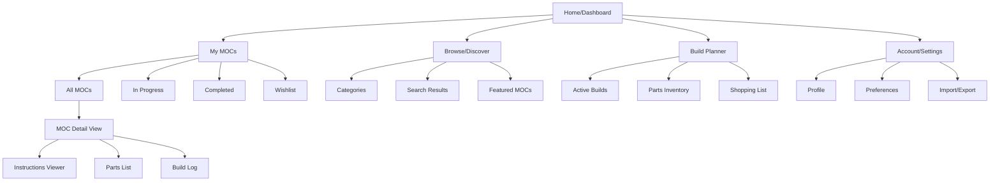
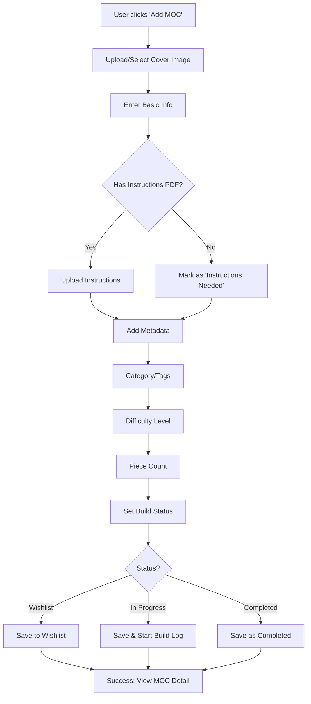
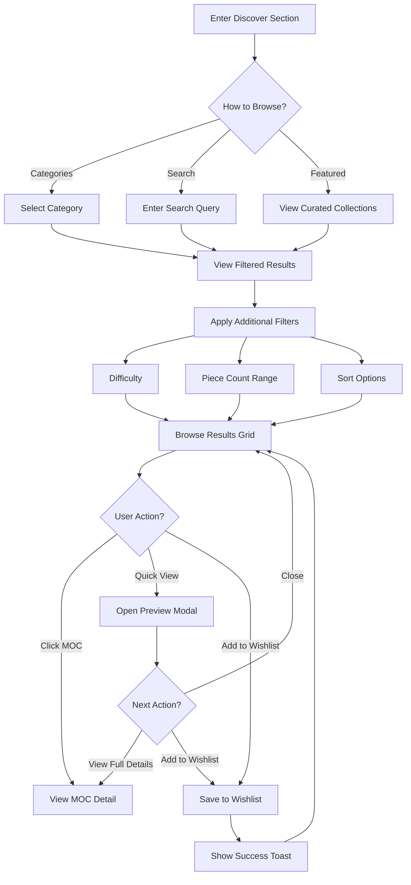
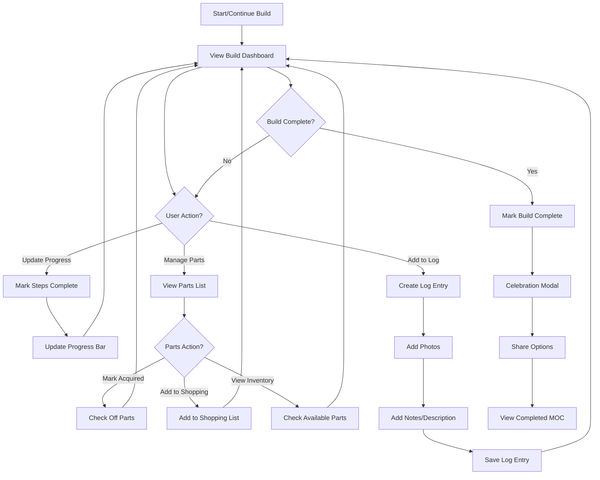

# LEGO MOC Inventory UI/UX Specification

## Introduction

This document defines the user experience goals, information architecture, user flows, and visual design specifications for **LEGO MOC Inventory**'s user interface. It serves as the foundation for visual design and frontend development, ensuring a cohesive and user-centered experience.

### Overall UX Goals & Principles

#### Target User Personas

1. **LEGO Enthusiast Builder** - Adult hobbyists who create and document their own MOC designs. They need efficient cataloging, clear organization, and the ability to share their creations.

2. **Collection Manager** - Users who maintain large LEGO collections and want to track instructions, parts inventory, and build planning. They prioritize searchability and systematic organization.

3. **Casual Browser** - Users exploring MOC ideas for inspiration. They value visual appeal, easy navigation, and quick access to interesting builds.

#### Usability Goals

- **Ease of cataloging:** Users can add new MOC instructions within 2 minutes with clear, guided inputs
- **Efficient search & discovery:** Find specific builds or browse by category with minimal clicks
- **Visual clarity:** High-quality imagery and clean layouts make browsing enjoyable
- **Build planning:** Easily track build progress, parts needed, and completion status

#### Design Principles

1. **Nature-Inspired Calm** - Use earthy, soothing colors that create a relaxing browsing experience, moving away from overwhelming digital aesthetics
2. **Clarity Through Simplicity** - Prioritize clean layouts and clear information hierarchy over decorative elements
3. **Playful Yet Professional** - Honor the creative, playful nature of LEGO while maintaining a polished, organized interface
4. **Accessible to All** - Design for diverse users with varying technical abilities and accessibility needs
5. **Visual-First Experience** - Let MOC imagery shine through generous use of photos and visual previews

#### Change Log

| Date | Version | Description | Author |
|------|---------|-------------|--------|
| 2025-12-10 | 1.0 | Initial specification created | Sally (UX Expert) |

---

## Information Architecture (IA)

### Site Map / Screen Inventory

### Navigation Structure

**Primary Navigation:**
Top-level horizontal navigation bar with 4 main sections:
- **Dashboard** - Overview of recent activity, stats, and quick actions
- **My MOCs** - Personal collection management and cataloging
- **Discover** - Browse and search for inspiration
- **Planner** - Build planning and parts tracking tools

**Secondary Navigation:**
Context-sensitive sidebar that appears within each main section:
- In "My MOCs": Filter by status (All, In Progress, Completed, Wishlist)
- In "Discover": Filter by category, difficulty, piece count
- In "Planner": Switch between active builds, inventory, shopping list

**Breadcrumb Strategy:**
Breadcrumbs appear on detail pages to show hierarchy:
- `My MOCs > Architecture > Modular Building > [MOC Name]`
- Helps users understand location and navigate back through categories
- Particularly useful when deep-linking or returning from search results

---

## User Flows

### Flow 1: Add New MOC to Collection

**User Goal:** Catalog a new MOC with instructions, images, and metadata

**Entry Points:**
- "Add MOC" button on Dashboard
- "Add MOC" action in My MOCs section
- Quick action from empty state

**Success Criteria:**
- MOC is saved with all required information
- User can immediately view the MOC detail page
- MOC appears in appropriate filtered views (status, category)

#### Flow Diagram

#### Edge Cases & Error Handling:

- **Large file uploads:** Show progress indicator, allow cancellation, validate file size (max 50MB)
- **Missing required fields:** Inline validation with clear error messages, prevent submission until resolved
- **Duplicate detection:** Warn if similar MOC name exists, allow user to proceed or cancel
- **Network interruption:** Auto-save draft locally, resume when connection restored
- **Invalid file formats:** Accept only PDF, JPG, PNG for instructions; show format requirements upfront

**Notes:** Consider adding bulk import feature for users migrating from other systems. May want to allow saving partial entries as drafts.

---

### Flow 2: Browse and Discover MOCs

**User Goal:** Find inspiration or specific MOC ideas by browsing categories and searching

**Entry Points:**
- "Discover" section from main navigation
- Search bar (global, available everywhere)
- Category links from Dashboard

**Success Criteria:**
- User finds relevant MOCs matching their interest
- Can preview MOC details without leaving browse view
- Can save interesting MOCs to wishlist

#### Flow Diagram

#### Edge Cases & Error Handling:

- **No results found:** Show helpful message with suggestions to broaden search or try different filters
- **Slow loading:** Show skeleton screens, lazy load images as user scrolls
- **Filter combinations with zero results:** Disable incompatible filter options or show count preview
- **Search typos:** Implement fuzzy search, show "Did you mean...?" suggestions
- **Pagination limits:** Implement infinite scroll with "Load More" fallback for accessibility

**Notes:** Consider adding "Recently Viewed" history and "Recommended for You" based on browsing patterns. May want to allow users to share specific search/filter combinations via URL.

---

### Flow 3: Plan and Track a Build

**User Goal:** Track progress on an active build, manage parts inventory, and document the building process

**Entry Points:**
- "Start Build" from MOC detail page
- "Build Planner" from main navigation
- "Continue Build" from Dashboard quick actions

**Success Criteria:**
- User can mark build progress (percentage or step-based)
- Parts needed are tracked and can be marked as acquired
- Build log captures photos and notes chronologically

#### Flow Diagram

#### Edge Cases & Error Handling:

- **Accidental completion:** Allow undo/reopen build with confirmation dialog
- **Photo upload failures:** Queue failed uploads for retry, show clear status
- **Parts list conflicts:** Handle cases where parts inventory doesn't match MOC requirements
- **Long-running builds:** Show time elapsed, allow pausing/resuming without data loss
- **Multiple simultaneous builds:** Clear indication of which build is active, easy switching

**Notes:** Consider gamification elements (badges, streaks) to encourage consistent logging. May want to allow exporting build log as PDF or sharing on social media.

---

## Wireframes & Mockups

### Primary Design Files

Based on your existing media kit at `/Users/michaelmenard/Downloads/media-kit-interview`, you have a Next.js application with a comprehensive design system already implemented. The design system includes:

- **Live Component Library:** React components in `/components/media-kit/`
- **Design Tokens:** Defined in `/app/globals.css` with CSS custom properties
- **Interactive Showcase:** Running media kit page demonstrating all design elements

**Recommendation:** Continue using your existing Next.js implementation as the living design system. For new screens and features, create new components following the established patterns.

**External Design Tool:** If you need high-fidelity mockups for stakeholder review or detailed interaction specs, consider using **Figma** to create design files that reference your existing color palette and components.

---

### Key Screen Layouts

#### Screen 1: Dashboard (Home)

**Purpose:** Provide an at-a-glance overview of the user's MOC collection, recent activity, and quick actions to jump into key tasks.

**Key Elements:**
- **Hero Stats Section:** Total MOCs, In Progress builds, Completed builds, Wishlist count (displayed as cards with icons)
- **Recent Activity Feed:** Last 5 MOCs added or updated with thumbnails and timestamps
- **Quick Actions Bar:** "Add New MOC", "Continue Build", "Browse Discover" as prominent CTAs
- **Active Builds Widget:** Carousel of in-progress builds showing progress bars and "Continue" buttons
- **Recommended/Featured Section:** Curated MOCs or personalized recommendations based on user's collection

**Interaction Notes:**
- Stats cards should be clickable to filter the collection view
- Recent activity items link directly to MOC detail pages
- Active builds carousel auto-advances but allows manual navigation
- Entire layout is responsive: stacks vertically on mobile, 2-column on tablet, 3-column on desktop

**Design File Reference:** Create as `Dashboard.tsx` component, using existing Card, Button, and Progress components from your media kit

---

#### Screen 2: My MOCs (Collection Grid)

**Purpose:** Display the user's complete MOC collection in a scannable, filterable grid layout with sorting and search capabilities.

**Key Elements:**
- **Filter Sidebar:** Status filters (All, In Progress, Completed, Wishlist), Category checkboxes, Difficulty range, Piece count slider
- **Search Bar:** Global search with autocomplete suggestions
- **Sort Dropdown:** Sort by Date Added, Name (A-Z), Piece Count, Difficulty
- **MOC Grid:** Responsive grid (1 col mobile, 2 col tablet, 3-4 col desktop) with MOC cards showing cover image, title, piece count, status badge
- **Empty State:** Friendly illustration and "Add Your First MOC" CTA when collection is empty
- **Pagination/Infinite Scroll:** Load more as user scrolls with "Back to Top" button

**Interaction Notes:**
- Hover on MOC card reveals quick actions: View, Edit, Delete, Add to Wishlist
- Click anywhere on card navigates to MOC detail page
- Filters update URL parameters for shareable/bookmarkable filtered views
- Filter sidebar collapses on mobile, accessible via "Filters" button

**Design File Reference:** Create as `MyMOCs.tsx` component, using Card, Badge, Slider, Checkbox components from media kit

---

#### Screen 3: MOC Detail View

**Purpose:** Show comprehensive information about a single MOC including images, instructions, parts list, and build tracking.

**Key Elements:**
- **Image Gallery:** Large hero image with thumbnail carousel, lightbox view on click
- **MOC Header:** Title, category badges, difficulty indicator, piece count, status
- **Tabbed Content Area:**
  - **Overview Tab:** Description, metadata, tags
  - **Instructions Tab:** Embedded PDF viewer or downloadable link
  - **Parts List Tab:** Searchable table of parts with quantities, colors, part numbers
  - **Build Log Tab:** Chronological timeline of build progress with photos and notes
- **Action Sidebar:** "Start Build", "Edit MOC", "Delete", "Share", "Export" buttons
- **Progress Indicator:** If build is in progress, show completion percentage and last updated date

**Interaction Notes:**
- Image gallery supports keyboard navigation and swipe gestures on mobile
- Tabs persist state in URL hash for deep linking
- Parts list allows filtering by color/category and exporting to CSV
- Build log entries can be added inline without leaving the page
- "Start Build" transitions to build planner view with this MOC pre-selected

**Design File Reference:** Create as `MOCDetail.tsx` component, using Tabs, AspectRatio, Table, Dialog components from media kit

---

#### Screen 4: Build Planner

**Purpose:** Active workspace for tracking build progress, managing parts inventory, and documenting the building journey.

**Key Elements:**
- **Build Header:** MOC title, cover image, overall progress bar (0-100%)
- **Three-Column Layout:**
  - **Left Column:** Step-by-step checklist or progress tracker
  - **Center Column:** Build log feed with photo upload area and note editor
  - **Right Column:** Parts tracker showing needed vs. acquired parts
- **Quick Actions Toolbar:** "Add Log Entry", "Update Progress", "Mark Parts Acquired", "Complete Build"
- **Shopping List Panel:** Collapsible panel showing parts needed across all active builds

**Interaction Notes:**
- Progress can be updated via checklist completion or manual percentage input
- Drag-and-drop photo upload with preview before saving
- Parts can be marked acquired individually or in bulk
- "Complete Build" triggers celebration modal with confetti animation and sharing options
- Auto-save drafts of log entries to prevent data loss

**Design File Reference:** Create as `BuildPlanner.tsx` component, using Progress, Checkbox, Textarea, Toast components from media kit

---

#### Screen 5: Discover/Browse

**Purpose:** Help users explore and find MOC inspiration through categories, search, and curated collections.

**Key Elements:**
- **Hero Search Bar:** Large, prominent search with placeholder text "Search for MOCs, categories, or themes..."
- **Category Pills:** Horizontal scrollable row of category chips (Architecture, Vehicles, Space, etc.)
- **Filter Bar:** Difficulty, Piece Count, Sort options in a sticky toolbar
- **Results Grid:** Similar to My MOCs grid but with "Add to Wishlist" heart icon on hover
- **Quick View Modal:** Clicking MOC opens modal with preview, key details, and "View Full Details" or "Add to Wishlist" actions
- **Featured Collections:** Curated sections like "Trending This Week", "Beginner Friendly", "Advanced Builds"

**Interaction Notes:**
- Search provides real-time suggestions as user types
- Category pills highlight active selection and update results instantly
- Quick View modal allows browsing multiple MOCs without losing place in grid
- Wishlist heart icon animates on click with haptic feedback on mobile
- Infinite scroll with skeleton loading states for smooth experience

**Design File Reference:** Create as `Discover.tsx` component, using Input, Badge, Dialog, HoverCard components from media kit

---

## Component Library / Design System

### Design System Approach

**Existing Foundation:** You have a well-established design system already implemented in your media kit at `/Users/michaelmenard/Downloads/media-kit-interview`. The system is built on:

- **shadcn/ui** - Radix UI primitives with Tailwind CSS styling
- **Custom Design Tokens** - Nature-inspired color palette (teal, sage, taupe) defined in CSS custom properties
- **React 19 + Next.js 16** - Modern React with server components support
- **Tailwind CSS v4** - Utility-first styling with custom theme configuration

**Strategy:** Continue building on this existing foundation. All new components should follow the established patterns:
- Use existing color tokens (primary, secondary, accent, muted)
- Follow the spacing scale (4px base unit)
- Maintain the earthy, calming aesthetic
- Ensure accessibility (WCAG 2.1 AA minimum)
- Support both light and dark modes

**Component Documentation:** The live media kit page serves as the living style guide, showcasing all available components with usage examples.

---

### Core Components

#### Component: Button

**Purpose:** Primary interactive element for triggering actions throughout the application

**Variants:**
- `default` - Solid primary color background (teal)
- `secondary` - Subtle secondary background (warm taupe)
- `outline` - Border with transparent background
- `ghost` - No background, minimal styling
- `destructive` - Error color for dangerous actions
- `link` - Text-only, underlined on hover

**States:**
- Default, Hover, Active, Focus, Disabled
- Loading state with spinner icon
- Icon-only variant with proper ARIA labels

**Usage Guidelines:**
- Use `default` variant for primary actions (Save, Submit, Add)
- Use `outline` or `ghost` for secondary actions (Cancel, Back)
- Use `destructive` for delete/remove actions with confirmation
- Maintain minimum 44x44px touch target size
- Include loading state for async actions

---

#### Component: Card

**Purpose:** Container component for grouping related content with consistent spacing and elevation

**Variants:**
- `default` - Standard card with border and subtle background
- `elevated` - Card with shadow for emphasis
- `interactive` - Hover state with subtle lift animation
- `flat` - No border or shadow, minimal styling

**States:**
- Default, Hover (for interactive variant), Focus (when clickable)

**Usage Guidelines:**
- Use for MOC grid items, dashboard widgets, and content grouping
- Interactive variant for clickable cards (MOC thumbnails)
- Include CardHeader, CardContent, CardFooter sub-components for consistent structure
- Maintain 16px internal padding, 8px border radius
- Support both light and dark mode backgrounds

---

#### Component: Input

**Purpose:** Text input fields for forms and search functionality

**Variants:**
- `default` - Standard text input
- `search` - Input with search icon prefix
- `error` - Error state with red border and error message
- `disabled` - Non-editable state

**States:**
- Default, Focus, Error, Disabled, Read-only

**Usage Guidelines:**
- Always pair with Label component for accessibility
- Show inline validation errors below input
- Use placeholder text sparingly (not a replacement for labels)
- Support keyboard navigation and autocomplete
- Include clear/reset button for search inputs

---

#### Component: Badge

**Purpose:** Small status indicators and category labels

**Variants:**
- `default` - Neutral gray background
- `primary` - Teal background for emphasis
- `secondary` - Warm taupe background
- `success` - Green for completed/positive states
- `warning` - Gold for caution/in-progress states
- `destructive` - Red for errors/critical states
- `outline` - Border with transparent background

**States:**
- Static (no interactive states)
- Optional dismiss button for removable tags

**Usage Guidelines:**
- Use for MOC status (In Progress, Completed, Wishlist)
- Use for category tags and difficulty indicators
- Keep text concise (1-2 words maximum)
- Ensure sufficient color contrast for readability
- Support both light and dark mode color variants

---

#### Component: Dialog/Modal

**Purpose:** Overlay component for focused tasks, confirmations, and detailed views

**Variants:**
- `default` - Standard centered modal
- `fullscreen` - Full viewport on mobile, large centered on desktop
- `drawer` - Slide-in from bottom (mobile) or side (desktop)

**States:**
- Open, Closed, Opening (animation), Closing (animation)

**Usage Guidelines:**
- Use for Quick View in Discover section
- Use for confirmations (delete MOC, complete build)
- Use for multi-step forms (Add MOC wizard)
- Include close button (X) and ESC key support
- Trap focus within modal when open
- Prevent body scroll when modal is active
- Include backdrop overlay with click-to-close

---

#### Component: Tabs

**Purpose:** Organize related content into switchable panels

**Variants:**
- `default` - Horizontal tabs with underline indicator
- `pills` - Rounded pill-style tabs with background
- `vertical` - Vertical tab list for sidebar navigation

**States:**
- Active, Inactive, Hover, Focus, Disabled

**Usage Guidelines:**
- Use for MOC Detail view (Overview, Instructions, Parts, Build Log)
- Persist active tab in URL hash for deep linking
- Support keyboard navigation (arrow keys)
- Show active tab indicator clearly
- Lazy load tab content for performance
- Ensure tab labels are concise and descriptive

---

#### Component: Progress

**Purpose:** Visual indicator of completion status for builds and uploads

**Variants:**
- `linear` - Horizontal progress bar
- `circular` - Circular/radial progress indicator
- `stepped` - Multi-step progress with checkpoints

**States:**
- Determinate (known percentage), Indeterminate (loading spinner)

**Usage Guidelines:**
- Use linear for build completion tracking
- Use circular for dashboard stats widgets
- Use stepped for multi-step forms (Add MOC wizard)
- Always include percentage text for accessibility
- Animate progress changes smoothly
- Use success color (green) when complete

---

#### Component: Table

**Purpose:** Display structured data in rows and columns, particularly for parts lists

**Variants:**
- `default` - Standard table with borders
- `striped` - Alternating row backgrounds
- `compact` - Reduced padding for dense data
- `interactive` - Hoverable/clickable rows

**States:**
- Default, Hover (for rows), Selected, Sorted

**Usage Guidelines:**
- Use for MOC parts lists with sortable columns
- Include search/filter functionality for large datasets
- Support column sorting (click header to sort)
- Make responsive: stack columns on mobile or horizontal scroll
- Include pagination or virtual scrolling for 100+ rows
- Ensure proper table semantics for screen readers

---

#### Component: Toast/Notification

**Purpose:** Temporary feedback messages for user actions

**Variants:**
- `default` - Neutral informational message
- `success` - Green checkmark for successful actions
- `error` - Red alert for errors
- `warning` - Gold caution for warnings

**States:**
- Entering, Visible, Exiting

**Usage Guidelines:**
- Use for action confirmations (MOC saved, build completed)
- Auto-dismiss after 3-5 seconds
- Allow manual dismissal with close button
- Stack multiple toasts vertically
- Position in bottom-right on desktop, bottom-center on mobile
- Include undo action when appropriate (e.g., "MOC deleted - Undo")
- Ensure sufficient contrast and readability

---

## Branding & Style Guide

### Visual Identity

**Brand Guidelines:** Your existing media kit at `/Users/michaelmenard/Downloads/media-kit-interview` serves as the living brand reference. The design system embodies:

- **Nature-Inspired Aesthetic** - Earthy, calming colors that evoke natural landscapes
- **Clean & Modern** - Minimalist approach that lets LEGO imagery shine
- **Approachable & Inviting** - Warm tones that feel welcoming, not sterile
- **Professional Yet Playful** - Balances the creative nature of LEGO with organized functionality

**Design Philosophy:** Moving away from cyberpunk/digital aesthetics toward a more organic, grounded visual language that creates a relaxing browsing experience.

---

### Color Palette

| Color Type | Hex Code | Usage |
|------------|----------|-------|
| Primary | `#1b5e6d` (Light) / `#5fa3b8` (Dark) | Primary actions, buttons, links, active states, brand emphasis |
| Secondary | `#f5f1ed` (Light) / `#3d4a52` (Dark) | Secondary buttons, subtle backgrounds, card surfaces |
| Accent | `#a8b8a3` (Light) / `#8fa88a` (Dark) | Focus states, highlights, interactive elements, badges |
| Success | `#2d5f4f` | Positive feedback, confirmations, completed builds |
| Warning | `#d4a574` | Cautions, important notices, in-progress states |
| Error | `#a85b4b` | Errors, destructive actions, validation failures |
| Neutral | `#f9f7f5` to `#2c2c2c` | Text, borders, backgrounds across light/dark modes |

**Additional Accent Colors:**
- **Clay** `#b89968` - Warm earth tone for special highlights
- **Dusty Blue** `#7b8fa3` - Soft blue for informational elements
- **Gold** `#b8a876` - Subtle metallic accent for achievements/badges

**Color Usage Guidelines:**
- Maintain WCAG 2.1 AA contrast ratios (4.5:1 for text, 3:1 for UI components)
- Primary teal is the hero color - use sparingly for maximum impact
- Sage green accent creates visual interest without overwhelming
- Warm taupe neutrals provide earthy foundation
- Dark mode uses slightly brighter, desaturated versions for better legibility
- Semantic colors (success, warning, error) remain consistent across themes

---

### Typography

#### Font Families

- **Primary:** Geist (sans-serif) - Clean, modern, highly legible
- **Secondary:** Geist (sans-serif) - Same family for consistency
- **Monospace:** Geist Mono - For code, part numbers, technical data

**Font Loading:** Fonts are loaded via Next.js Google Fonts integration with automatic optimization and subsetting.

#### Type Scale

| Element | Size | Weight | Line Height |
|---------|------|--------|-------------|
| H1 | 3rem (48px) | 700 (Bold) | 1.2 (tight) |
| H2 | 2.25rem (36px) | 700 (Bold) | 1.25 (tight) |
| H3 | 1.875rem (30px) | 600 (Semibold) | 1.3 (snug) |
| Body | 1rem (16px) | 400 (Normal) | 1.5 (normal) |
| Small | 0.875rem (14px) | 400 (Normal) | 1.5 (normal) |

**Additional Type Styles:**
- **H4:** 1.5rem (24px), 600 weight, 1.375 line height
- **H5:** 1.25rem (20px), 600 weight, 1.5 line height
- **Large Body:** 1.125rem (18px), 400 weight, 1.625 line height (for hero text)
- **Caption:** 0.75rem (12px), 400 weight, 1.5 line height (for metadata)

**Typography Guidelines:**
- Use H1 sparingly - typically once per page for main heading
- Maintain clear hierarchy with consistent heading levels
- Body text at 16px minimum for readability
- Increase line height for longer text blocks (1.625 for paragraphs)
- Use semibold (600) for emphasis rather than bold in body text
- Ensure sufficient color contrast for all text sizes
- Support dynamic type scaling for accessibility

---

### Iconography

**Icon Library:** Lucide React - Consistent, open-source icon set with 1000+ icons

**Icon Specifications:**
- **Default Size:** 24x24px (1.5rem)
- **Small:** 16x16px (1rem) for inline text icons
- **Large:** 32x32px (2rem) for feature highlights
- **Stroke Width:** 2px for consistency with Lucide defaults

**Usage Guidelines:**
- Use icons to reinforce meaning, not replace text labels
- Maintain consistent icon style throughout (outline style, not filled)
- Ensure icons have proper ARIA labels when used without text
- Use semantic icons (trash for delete, plus for add, check for complete)
- Color icons using current text color for consistency
- Provide 8px spacing between icon and adjacent text
- Common icons: Plus (add), Trash (delete), Edit (pencil), Search (magnifying glass), Heart (wishlist), Check (complete)

---

### Spacing & Layout

**Grid System:**
- **Container Max Width:** 1280px (7xl) for main content
- **Responsive Breakpoints:**
  - Mobile: 0-640px
  - Tablet: 641-1024px
  - Desktop: 1025px+
- **Gutter:** 16px mobile, 24px tablet, 32px desktop
- **Column Grid:** 4 columns mobile, 8 columns tablet, 12 columns desktop

**Spacing Scale:** 4px base unit (0.25rem)

- **1:** 4px - Tight spacing within components
- **2:** 8px - Default spacing between related elements
- **3:** 12px - Small gaps in layouts
- **4:** 16px - Standard component padding
- **6:** 24px - Section spacing
- **8:** 32px - Large gaps between sections
- **12:** 48px - Major section breaks
- **16:** 64px - Page-level spacing
- **20:** 80px - Hero section padding

**Layout Guidelines:**
- Use consistent spacing scale - avoid arbitrary values
- Maintain generous whitespace for breathing room
- Group related elements with tighter spacing (8px)
- Separate distinct sections with larger spacing (32px+)
- Ensure minimum 16px padding on mobile edges
- Use 8px grid for alignment consistency

---

## Accessibility Requirements

### Compliance Target

**Standard:** WCAG 2.1 Level AA compliance

**Rationale:** Level AA provides a strong baseline for accessibility without the more stringent requirements of AAA. This ensures the application is usable by people with diverse abilities including visual, auditory, motor, and cognitive disabilities.

**Additional Considerations:**
- Follow WAI-ARIA 1.2 authoring practices for interactive components
- Support keyboard-only navigation throughout the application
- Ensure compatibility with major screen readers (NVDA, JAWS, VoiceOver)
- Test with browser zoom up to 200% without loss of functionality

---

### Key Requirements

#### Visual:

- **Color contrast ratios:**
  - Minimum 4.5:1 for normal text (16px and below)
  - Minimum 3:1 for large text (18px+ or 14px+ bold)
  - Minimum 3:1 for UI components and graphical objects
  - All color combinations in the palette have been validated for contrast
  - Never rely on color alone to convey information (use icons, text, or patterns)

- **Focus indicators:**
  - Visible focus outline on all interactive elements (2px solid ring)
  - Focus ring uses primary color with 50% opacity for visibility
  - Focus order follows logical reading order (top to bottom, left to right)
  - Skip to main content link for keyboard users
  - No focus traps except in modals (with proper escape handling)

- **Text sizing:**
  - Base font size of 16px minimum for body text
  - Support browser text zoom up to 200% without horizontal scrolling
  - Use relative units (rem, em) rather than fixed pixels
  - Maintain readable line length (45-75 characters optimal)
  - Sufficient line height (1.5 for body text) for readability

#### Interaction:

- **Keyboard navigation:**
  - All functionality available via keyboard (no mouse-only interactions)
  - Tab order follows visual layout and logical flow
  - Arrow keys for navigating within components (tabs, menus, carousels)
  - Enter/Space to activate buttons and links
  - Escape to close modals, dropdowns, and overlays
  - Keyboard shortcuts documented and discoverable (optional enhancement)

- **Screen reader support:**
  - Semantic HTML elements (nav, main, article, aside, header, footer)
  - Proper heading hierarchy (H1 → H2 → H3, no skipping levels)
  - ARIA labels for icon-only buttons and controls
  - ARIA live regions for dynamic content updates (toasts, notifications)
  - Alt text for all meaningful images (MOC photos, icons)
  - Form labels properly associated with inputs
  - Status messages announced to screen readers

- **Touch targets:**
  - Minimum 44x44px touch target size for all interactive elements
  - Adequate spacing between touch targets (8px minimum)
  - Support for both tap and long-press gestures where appropriate
  - Avoid hover-only interactions (ensure mobile alternatives)
  - Swipe gestures have keyboard/button alternatives

#### Content:

- **Alternative text:**
  - Descriptive alt text for MOC images (e.g., "Modular building MOC with detailed storefront and interior")
  - Empty alt="" for decorative images
  - Complex images (diagrams, charts) have extended descriptions
  - Icons paired with visible text labels or ARIA labels
  - Avoid "image of" or "picture of" in alt text

- **Heading structure:**
  - One H1 per page (page title)
  - Logical heading hierarchy without skipping levels
  - Headings describe the content that follows
  - Use headings to create document outline for screen reader navigation
  - Avoid using headings for styling purposes only

- **Form labels:**
  - Every form input has an associated <label> element
  - Labels are visible and positioned near their inputs
  - Required fields clearly marked with text (not just asterisk)
  - Error messages associated with inputs via aria-describedby
  - Inline validation provides helpful, specific error messages
  - Group related inputs with <fieldset> and <legend>

---

### Testing Strategy

**Automated Testing:**
- Run axe DevTools or Lighthouse accessibility audits on every page
- Integrate automated a11y testing in CI/CD pipeline (e.g., jest-axe, pa11y)
- Catch common issues: missing alt text, color contrast, ARIA errors
- Target: Zero critical accessibility violations before deployment

**Manual Testing:**
- **Keyboard Navigation:** Tab through entire application, verify all functionality accessible
- **Screen Reader Testing:** Test with VoiceOver (macOS/iOS), NVDA (Windows), TalkBack (Android)
- **Zoom Testing:** Test at 200% browser zoom, verify no horizontal scrolling or content loss
- **Color Blindness:** Use color blindness simulators to verify information isn't color-dependent
- **Focus Management:** Verify focus moves logically, especially in modals and dynamic content

**User Testing:**
- Conduct usability testing with users who rely on assistive technologies
- Gather feedback on real-world accessibility barriers
- Prioritize fixes based on user impact
- Iterate on accessibility improvements continuously

**Testing Checklist:**
- [ ] All images have appropriate alt text
- [ ] Color contrast meets WCAG AA standards
- [ ] Keyboard navigation works throughout
- [ ] Focus indicators are visible
- [ ] Screen reader announces all content correctly
- [ ] Forms have proper labels and error handling
- [ ] Modals trap focus and can be closed with Escape
- [ ] Dynamic content updates are announced
- [ ] Touch targets meet minimum size requirements
- [ ] Application works at 200% zoom

---

## Responsiveness Strategy

### Breakpoints

| Breakpoint | Min Width | Max Width | Target Devices |
|------------|-----------|-----------|----------------|
| Mobile | 0px | 640px | Smartphones (portrait and landscape) |
| Tablet | 641px | 1024px | iPads, Android tablets, small laptops |
| Desktop | 1025px | 1536px | Standard desktop monitors, laptops |
| Wide | 1537px | - | Large monitors, ultra-wide displays |

**Breakpoint Strategy:**
- Mobile-first approach: Base styles for mobile, progressively enhance for larger screens
- Breakpoints align with Tailwind CSS defaults for consistency
- Test at common device sizes: iPhone (375px), iPad (768px), Desktop (1280px)
- Fluid typography and spacing scale between breakpoints

---

### Adaptation Patterns

#### Layout Changes:

**Mobile (0-640px):**
- Single column layouts throughout
- Full-width cards and components
- Stacked navigation (hamburger menu)
- Reduced padding and margins (16px edges)
- Simplified data tables (stack columns or horizontal scroll)
- Bottom navigation bar for primary actions (optional enhancement)

**Tablet (641-1024px):**
- Two-column grid for MOC cards
- Sidebar navigation becomes visible (collapsible)
- Increased padding (24px edges)
- Tables show more columns, horizontal scroll if needed
- Dashboard widgets in 2-column layout
- Modal dialogs sized appropriately (not full-screen)

**Desktop (1025px+):**
- Three to four-column grid for MOC cards
- Persistent sidebar navigation
- Maximum content width (1280px) with centered layout
- Full data tables with all columns visible
- Dashboard widgets in 3-column layout
- Hover states and interactions enabled
- Generous whitespace (32px+ edges)

**Wide (1537px+):**
- Four to five-column grid for MOC cards
- Utilize extra space for larger images and previews
- Side-by-side layouts (e.g., MOC detail with parts list visible)
- Optional: Picture-in-picture build planner
- Maintain maximum content width to prevent excessive line length

#### Navigation Changes:

**Mobile:**
- Hamburger menu icon in top-left
- Slide-out drawer navigation from left
- Bottom tab bar for primary sections (Dashboard, My MOCs, Discover, Planner)
- Search icon opens full-screen search overlay
- User profile/settings in hamburger menu

**Tablet:**
- Collapsible sidebar navigation (icon + text labels)
- Top navigation bar with primary sections
- Search bar visible in header (not hidden)
- User profile in top-right corner
- Breadcrumbs appear on detail pages

**Desktop:**
- Persistent sidebar navigation (always visible)
- Full text labels with icons
- Search bar prominent in header
- Breadcrumbs on all sub-pages
- User profile with dropdown menu in top-right

#### Content Priority:

**Mobile:**
- Show essential information first (MOC title, image, status)
- Hide secondary metadata (date added, piece count) until detail view
- Collapse filters into "Filter" button with modal overlay
- Reduce dashboard widgets to 2-3 most important
- Simplify forms to one field per row
- Use accordions to hide less critical content

**Tablet:**
- Show more metadata on cards (piece count, difficulty)
- Filters visible in collapsible sidebar
- Dashboard shows 4-6 widgets
- Forms can have 2 fields per row for shorter inputs
- More content visible without scrolling

**Desktop:**
- All metadata visible on cards
- Filters always visible in sidebar
- Dashboard shows 6-9 widgets
- Forms optimized for horizontal layout
- Minimal scrolling required for primary content
- Rich previews and hover states

#### Interaction Changes:

**Mobile:**
- Touch-optimized interactions (44px minimum touch targets)
- Swipe gestures for carousels and image galleries
- Pull-to-refresh on list views (optional)
- Long-press for contextual actions
- Bottom sheets for action menus
- Full-screen modals for forms and detail views
- Tap to expand/collapse sections

**Tablet:**
- Hybrid touch and mouse support
- Hover states available but not required
- Larger touch targets maintained (44px)
- Modals sized appropriately (not full-screen)
- Drag-and-drop for reordering (optional)
- Split-screen friendly layouts

**Desktop:**
- Mouse and keyboard optimized
- Hover states for additional information
- Right-click context menus (optional)
- Keyboard shortcuts for power users
- Drag-and-drop interactions
- Multi-select with Shift/Cmd+Click
- Tooltips on hover for additional context

---

## Animation & Micro-interactions

### Motion Principles

**1. Purposeful, Not Decorative**
- Every animation serves a functional purpose: providing feedback, guiding attention, or showing relationships
- Avoid gratuitous motion that doesn't enhance understanding or usability
- Motion should feel natural and organic, not mechanical or robotic

**2. Subtle and Calming**
- Animations should reinforce the earthy, inviting aesthetic
- Use gentle easing curves that feel smooth and natural
- Avoid jarring, aggressive, or overly fast animations
- Respect `prefers-reduced-motion` for users with vestibular disorders

**3. Fast Enough to Feel Responsive**
- Micro-interactions complete in 150-300ms
- Larger transitions take 300-500ms
- Never make users wait for animations to complete critical tasks
- Prioritize perceived performance over elaborate effects

**4. Consistent Timing and Easing**
- Use a limited set of duration and easing values
- Standard easing: `cubic-bezier(0.4, 0.0, 0.2, 1)` (ease-in-out)
- Entrance: `cubic-bezier(0.0, 0.0, 0.2, 1)` (ease-out)
- Exit: `cubic-bezier(0.4, 0.0, 1, 1)` (ease-in)
- Bounce/Spring effects for celebratory moments only

**5. Respect User Preferences**
- Honor `prefers-reduced-motion` media query
- Provide instant transitions or simple fades for reduced motion
- Never rely solely on animation to convey information
- Allow users to disable non-essential animations in settings

---

### Key Animations

- **Button Press:** Subtle scale down (0.98) on active state (Duration: 100ms, Easing: ease-in-out)

- **Card Hover:** Gentle lift with shadow increase, scale up slightly (1.02) (Duration: 200ms, Easing: ease-out)

- **Page Transitions:** Fade in new content with slight upward slide (20px) (Duration: 300ms, Easing: ease-out)

- **Modal Open/Close:** Backdrop fade in (200ms) + content scale from 0.95 to 1.0 with fade (Duration: 250ms, Easing: ease-out)

- **Toast Notifications:** Slide in from bottom-right with fade, pause, slide out (Duration: 300ms in, 200ms out, Easing: ease-out)

- **Loading Spinner:** Smooth rotation with subtle pulse (Duration: 1000ms, Easing: linear for rotation)

- **Progress Bar Fill:** Smooth width transition with slight ease (Duration: 400ms, Easing: ease-in-out)

- **Accordion Expand/Collapse:** Height animation with content fade (Duration: 300ms, Easing: ease-in-out)

- **Image Gallery Transition:** Crossfade between images with slight zoom (Duration: 400ms, Easing: ease-in-out)

- **Dropdown Menu:** Fade in with slight downward slide (8px) (Duration: 200ms, Easing: ease-out)

- **Tab Switch:** Underline indicator slides to new position, content crossfades (Duration: 250ms, Easing: ease-in-out)

- **Checkbox/Toggle:** Smooth background color transition, checkmark draws in (Duration: 200ms, Easing: ease-out)

- **Skeleton Loading:** Gentle shimmer effect moving left to right (Duration: 1500ms, Easing: linear)

- **Build Complete Celebration:** Confetti animation with success message scale-in (Duration: 600ms, Easing: spring/bounce)

- **Drag and Drop:** Element follows cursor with slight lag, drop zone highlights (Duration: 150ms, Easing: ease-out)

- **Focus Ring:** Instant appearance (no animation) for accessibility, but can pulse gently on keyboard navigation (Duration: 200ms, Easing: ease-in-out)

---

### Reduced Motion Fallbacks

For users with `prefers-reduced-motion: reduce`:
- Replace all animations with instant state changes or simple opacity fades (100ms)
- Disable parallax, auto-playing carousels, and decorative animations
- Maintain functional animations (loading indicators) but simplify them
- Ensure all information conveyed through motion is also available statically

---

## Performance Considerations

### Performance Goals

- **Page Load:** Initial page load under 2 seconds on 3G connection, under 1 second on broadband
- **Interaction Response:** UI responds to user input within 100ms (perceived as instant)
- **Animation FPS:** Maintain 60fps for all animations and scrolling interactions

**Additional Metrics:**
- **First Contentful Paint (FCP):** Under 1.5 seconds
- **Largest Contentful Paint (LCP):** Under 2.5 seconds
- **Time to Interactive (TTI):** Under 3.5 seconds
- **Cumulative Layout Shift (CLS):** Under 0.1 (minimal visual instability)
- **First Input Delay (FID):** Under 100ms

---

### Design Strategies

**Image Optimization:**
- Use Next.js Image component for automatic optimization and lazy loading
- Serve images in modern formats (WebP, AVIF) with fallbacks
- Implement responsive images with appropriate sizes for each breakpoint
- Lazy load images below the fold
- Use blur-up placeholders for better perceived performance
- Compress MOC images to balance quality and file size (target: <200KB per image)
- Consider CDN for image delivery (Cloudflare, Vercel Edge)

**Code Splitting:**
- Leverage Next.js automatic code splitting by route
- Lazy load heavy components (image gallery, PDF viewer, rich text editor)
- Use dynamic imports for modals and overlays
- Split vendor bundles to improve caching
- Analyze bundle size with `@next/bundle-analyzer`
- Target: Initial JavaScript bundle under 200KB gzipped

**Lazy Loading:**
- Implement intersection observer for infinite scroll
- Lazy load tab content (only load active tab initially)
- Defer non-critical JavaScript (analytics, chat widgets)
- Use `loading="lazy"` attribute on images
- Lazy load below-the-fold components
- Prioritize above-the-fold content for faster FCP

**Caching:**
- Leverage Next.js static generation for public pages (Discover, landing)
- Use SWR or React Query for client-side data caching
- Implement service worker for offline support (optional)
- Cache API responses with appropriate TTL
- Use HTTP caching headers for static assets
- Implement optimistic UI updates for better perceived performance

**Skeleton Screens:**
- Show skeleton loaders while content is loading
- Match skeleton layout to actual content structure
- Use subtle shimmer animation for visual feedback
- Avoid layout shift when content loads
- Implement for: MOC grid, dashboard widgets, detail pages
- Ensure skeletons are accessible (ARIA live regions)

**Prefetching:**
- Prefetch next/previous MOC in detail view
- Prefetch on hover for navigation links (Next.js default)
- Preload critical fonts and images
- Use `<link rel="prefetch">` for likely next pages
- Balance prefetching with bandwidth considerations
- Respect user's data saver preferences

---

## Next Steps

### Immediate Actions

1. **Review this specification with stakeholders** - Share with product owner, development team, and any other key stakeholders for feedback and alignment

2. **Create high-fidelity mockups in Figma** - Using the existing media kit as foundation, design the 5 key screens (Dashboard, My MOCs, MOC Detail, Build Planner, Discover) with actual content and interactions

3. **Validate user flows with usability testing** - Test the proposed flows (Add MOC, Browse/Discover, Build Tracking) with 3-5 target users to identify friction points before development

4. **Prioritize features for MVP** - Determine which features are essential for initial launch vs. nice-to-haves for future iterations (e.g., is Build Log essential or can it come in v2?)

5. **Set up development environment** - Ensure all developers have access to the media kit repository, design tokens, and component library

6. **Create component specifications** - Document each component's props, states, variants, and usage examples for developer handoff

7. **Establish design QA process** - Define how designs will be reviewed and approved during development (design reviews, visual regression testing)

---

### Handoff Checklist

**Design Deliverables:**
- [x] Frontend specification document (this document)
- [ ] High-fidelity mockups created in Figma
- [ ] Interactive prototype for key flows
- [ ] Design tokens exported (colors, spacing, typography)
- [ ] Component specifications with states and variants
- [ ] Accessibility annotations on designs
- [ ] Responsive breakpoint examples
- [ ] Animation specifications with timing/easing
- [ ] Asset library (icons, images, illustrations)
- [ ] Developer handoff meeting scheduled
- [ ] Design QA process established

**Development Readiness:**
- [ ] Component library documented and accessible
- [ ] Design tokens integrated into codebase
- [ ] Accessibility testing tools configured
- [ ] Performance monitoring set up (Lighthouse CI, Web Vitals)
- [ ] Responsive testing devices/tools identified
- [ ] Animation library chosen (Framer Motion recommended)
- [ ] Image optimization pipeline configured
- [ ] Development environment matches design system

**Collaboration:**
- [ ] Design-dev communication channel established (Slack, Discord)
- [ ] Regular design review meetings scheduled
- [ ] Feedback loop for design iterations defined
- [ ] Version control for design files (Figma branching)
- [ ] Design system governance process established
- [ ] Documentation for updating design system

---

### Open Questions

1. **Build Log Scope:** Should the build log feature be included in MVP, or can it be deferred to a later release? It adds significant complexity but provides unique value.

2. **Social Features:** Are social features (sharing builds, following other builders, comments) in scope for this application, or is it purely personal inventory management?

3. **Data Source:** Where does MOC data come from? Is there an API integration with Rebrickable, BrickLink, or similar services, or is all data user-entered?

4. **Authentication:** What authentication method will be used? (Email/password, OAuth, magic links?) This affects the onboarding flow design.

5. **Offline Support:** Is offline functionality a requirement? Should users be able to access their collection without internet?

6. **Multi-device Sync:** Should the application sync across devices in real-time, or is it acceptable to have device-specific data?

7. **Export/Backup:** What export formats are needed? (CSV, JSON, PDF reports?) This affects the data architecture.

8. **Monetization:** Is this a free application, freemium, or paid? This affects feature gating and upgrade flows.

9. **Localization:** Is internationalization (i18n) required? If so, which languages should be supported initially?

10. **Analytics:** What user analytics are needed? This affects privacy policy and data collection design.

---

### Success Metrics

**Usability:**
- Task completion rate >90% for core flows (Add MOC, Find MOC, Track Build)
- Average time to add a new MOC <2 minutes
- User satisfaction score (SUS) >80
- Accessibility audit score >95 (Lighthouse)

**Performance:**
- Lighthouse Performance score >90
- Core Web Vitals all in "Good" range
- Page load time <2s on 3G
- Time to Interactive <3.5s

**Engagement:**
- Daily active users (DAU) growth
- Average session duration >5 minutes
- Return user rate >60% within 7 days
- MOCs added per user per month

**Quality:**
- Bug report rate <5 per 100 users per month
- Critical accessibility violations: 0
- Browser compatibility: 95%+ of target browsers
- Mobile responsiveness: 100% of target devices

---

## Appendix

### Design System Reference

**Existing Media Kit Location:** `/Users/michaelmenard/Downloads/media-kit-interview`

**Key Files:**
- `app/globals.css` - Complete design token system
- `components/media-kit/` - Component showcase
- `app/page.tsx` - Living style guide

**Technology Stack:**
- React 19
- Next.js 16
- Tailwind CSS v4
- shadcn/ui (Radix UI primitives)
- Lucide React (icons)
- Geist font family

### Resources

**Design Tools:**
- Figma - High-fidelity mockups and prototypes
- Excalidraw - Quick wireframes and diagrams
- Mermaid - Flow diagrams and architecture

**Accessibility:**
- axe DevTools - Automated accessibility testing
- WAVE - Web accessibility evaluation tool
- Lighthouse - Performance and accessibility audits
- Screen readers: NVDA (Windows), VoiceOver (macOS/iOS)

**Performance:**
- Lighthouse CI - Automated performance monitoring
- Web Vitals - Core Web Vitals tracking
- @next/bundle-analyzer - Bundle size analysis
- Chrome DevTools - Performance profiling

**Testing:**
- BrowserStack - Cross-browser testing
- Responsively App - Responsive design testing
- Percy - Visual regression testing
- Playwright - E2E testing

---

**Document Version:** 1.0
**Last Updated:** 2025-12-10
**Author:** UX Expert Agent (Sally)
**Status:** Complete - Ready for Stakeholder Review