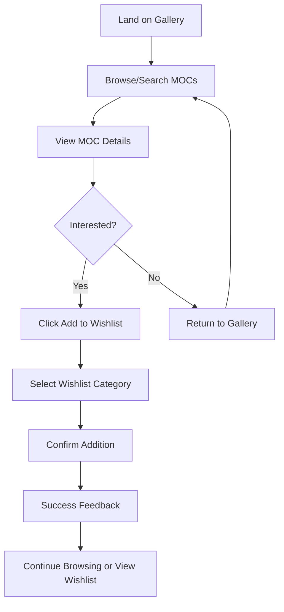
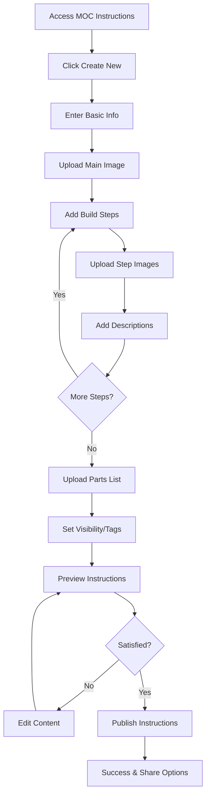
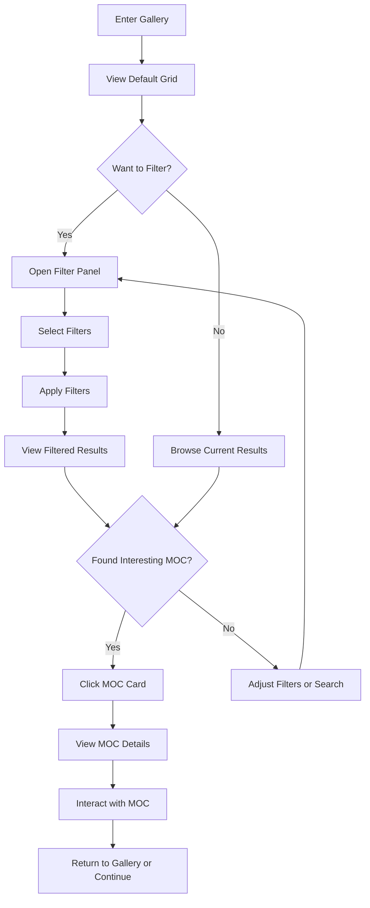

# LEGO MOC Instructions App - UI/UX Specification

## Introduction

This document defines the user experience goals, information architecture, user flows, and visual design specifications for the LEGO MOC Instructions App's modernized user interface. It serves as the foundation for visual design and frontend development, ensuring a cohesive and user-centered experience across all modular applications.

### Overall UX Goals & Principles

#### Target User Personas

**LEGO Enthusiast Builder**: Adult fans of LEGO (AFOLs) who create custom MOCs and want to document and share their building instructions. They value detailed documentation, high-quality images, and community features.

**Inspiration Seeker**: LEGO fans looking for new building ideas and inspiration. They prioritize easy browsing, visual discovery, and the ability to save interesting builds to their wishlist.

**Instruction Creator**: Advanced builders who create comprehensive step-by-step instructions for their MOCs. They need robust file management, editing capabilities, and tools for organizing complex builds.

**Community Member**: Social users who engage with the LEGO building community through sharing, commenting, and collaborating. They value social features, user profiles, and community interaction.

#### Usability Goals

- **Intuitive Discovery**: New users can find and explore MOC instructions within 2 minutes of landing on the site
- **Efficient Creation**: Experienced users can upload and organize a new MOC instruction set in under 10 minutes
- **Seamless Navigation**: Users can move between gallery, wishlist, instructions, and profile without losing context
- **Mobile Optimization**: All core functionality works efficiently on mobile devices with touch-friendly interactions
- **Accessibility First**: All users, including those using assistive technologies, can access and use all features

#### Design Principles

1. **Visual Clarity over Complexity** - Prioritize clear, scannable layouts that highlight LEGO builds and instructions
2. **Progressive Enhancement** - Start with essential functionality and layer on advanced features
3. **Consistent Interaction Patterns** - Use familiar UI patterns that users recognize from modern web applications
4. **Immediate Visual Feedback** - Every user action provides clear, immediate visual confirmation
5. **Inclusive Design** - Design for all users regardless of ability, device, or technical expertise

### Change Log

| Date       | Version | Description                                          | Author    |
| ---------- | ------- | ---------------------------------------------------- | --------- |
| 2024-11-24 | 1.0     | Initial UI/UX specification for modular architecture | UX Expert |

## Information Architecture (IA)

### Site Map / Screen Inventory

```mermaid
graph TD
    A[Home/Landing] --> B[Gallery]
    A --> C[Wishlist]
    A --> D[MOC Instructions]
    A --> E[Profile]
    A --> F[Auth]

    B --> B1[Browse Gallery]
    B --> B2[Search Results]
    B --> B3[MOC Detail View]
    B --> B4[Category Filter]

    C --> C1[My Wishlist]
    C --> C2[Wishlist Categories]
    C --> C3[Shared Wishlists]

    D --> D1[My Instructions]
    D --> D2[Create New MOC]
    D --> D3[Edit Instructions]
    D --> D4[Step-by-Step View]
    D --> D5[File Management]

    E --> E1[User Profile]
    E --> E2[Account Settings]
    E --> E3[My Activity]
    E --> E4[Preferences]

    F --> F1[Login]
    F --> F2[Sign Up]
    F --> F3[Password Reset]
    F --> F4[Email Verification]
```

### Navigation Structure

**Primary Navigation:** Persistent top navigation bar with main sections (Gallery, Wishlist, MOC Instructions, Profile) accessible from any page. Logo/home link on the left, user avatar and settings on the right.

**Secondary Navigation:** Context-sensitive navigation within each module. Gallery has filtering and sorting options, MOC Instructions has creation/editing tools, Profile has settings tabs.

**Breadcrumb Strategy:** Breadcrumbs for deep navigation within MOC instruction editing and multi-step processes. Not needed for main section navigation due to persistent primary nav.

## User Flows

### Flow 1: Discover and Save MOC to Wishlist

**User Goal:** Find interesting LEGO MOC builds and save them for future reference

**Entry Points:** Home page, direct link to gallery, search results

**Success Criteria:** User successfully adds MOC to wishlist and can access it later

#### Flow Diagram

#### Edge Cases & Error Handling:

- User not logged in: Prompt to sign in before adding to wishlist
- Network error during save: Show retry option with offline queue
- Duplicate item: Confirm if user wants to add again or move to different category
- Full wishlist: Suggest creating new category or removing old items

**Notes:** Include visual feedback (heart icon animation) and toast notification for successful additions

### Flow 2: Create and Upload MOC Instructions

**User Goal:** Document a custom LEGO build with step-by-step instructions and share with community

**Entry Points:** MOC Instructions section, profile page, direct creation link

**Success Criteria:** User successfully creates complete MOC instruction set with images and descriptions

#### Flow Diagram

#### Edge Cases & Error Handling:

- Large file uploads: Show progress indicators and allow resuming interrupted uploads
- Missing required fields: Highlight incomplete sections with clear error messages
- Image processing failures: Provide alternative upload methods and format guidance
- Save draft functionality: Auto-save progress and allow returning to incomplete instructions

**Notes:** Implement drag-and-drop file uploads and real-time preview of instruction layout

### Flow 3: Browse and Filter Gallery

**User Goal:** Explore LEGO MOC builds using various filters and search criteria

**Entry Points:** Home page, main navigation, search results

**Success Criteria:** User finds relevant MOCs using filters and can easily view details

#### Flow Diagram

#### Edge Cases & Error Handling:

- No results found: Suggest alternative filters or popular MOCs
- Slow loading: Implement skeleton screens and progressive loading
- Filter combinations with no results: Show which filters to remove
- Mobile filter experience: Collapsible filter drawer with clear apply/reset actions

**Notes:** Include sorting options (newest, most popular, difficulty) and infinite scroll for large result sets

## Wireframes & Mockups

**Primary Design Files:** Design system and detailed mockups will be created in Figma with component library and responsive layouts

### Key Screen Layouts

#### Gallery Grid View

**Purpose:** Primary discovery interface for browsing LEGO MOC builds

**Key Elements:**

- Responsive card grid with MOC thumbnails, titles, and creator info
- Filter sidebar with categories, difficulty, piece count, and tags
- Search bar with autocomplete and recent searches
- Sort dropdown with options for relevance, date, popularity
- Pagination or infinite scroll for large result sets

**Interaction Notes:** Hover effects on cards show quick actions (wishlist, share). Filter sidebar collapses on mobile. Cards use lazy loading for performance.

**Design File Reference:** [Figma Gallery Screens - to be created]

#### MOC Detail View

**Purpose:** Comprehensive view of individual MOC with all details and actions

**Key Elements:**

- Hero image carousel with zoom functionality
- MOC metadata (title, creator, difficulty, pieces, tags)
- Step-by-step instruction viewer with navigation
- Parts list with quantities and colors
- Action buttons (add to wishlist, download, share)
- Creator profile link and related MOCs

**Interaction Notes:** Image carousel supports swipe gestures on mobile. Instruction steps can be viewed in full-screen mode. Parts list is searchable and filterable.

**Design File Reference:** [Figma MOC Detail Screens - to be created]

#### MOC Creation Interface

**Purpose:** Comprehensive tool for creating and editing MOC instructions

**Key Elements:**

- Multi-step wizard with progress indicator
- Drag-and-drop file upload areas with preview
- Rich text editor for descriptions and notes
- Step management with reordering capabilities
- Parts list builder with LEGO part database integration
- Preview mode showing final instruction layout

**Interaction Notes:** Auto-save functionality prevents data loss. Drag-and-drop for reordering steps. Real-time preview updates as content is added.

**Design File Reference:** [Figma Creation Interface - to be created]

## Component Library / Design System

**Design System Approach:** Build upon existing Tailwind CSS v4 foundation and `@repo/ui` components, creating a comprehensive design system that extends current patterns while introducing modern, accessible components for enhanced user experience.

### Core Components

#### Button Component

**Purpose:** Primary interaction element for all user actions throughout the application

**Variants:**

- Primary (solid background, high contrast)
- Secondary (outline style, medium emphasis)
- Ghost (text-only, low emphasis)
- Icon (icon-only with tooltip)

**States:** Default, hover, active, disabled, loading (with spinner)

**Usage Guidelines:** Use primary for main actions, secondary for alternative actions, ghost for tertiary actions. Maintain consistent sizing (small, medium, large) across modules.

#### Card Component

**Purpose:** Container for MOC displays, content grouping, and information hierarchy

**Variants:**

- MOC Card (image, title, metadata, actions)
- Info Card (icon, title, description)
- Interactive Card (hover effects, clickable)
- Compact Card (reduced padding, smaller text)

**States:** Default, hover, selected, loading (skeleton), error

**Usage Guidelines:** Use consistent spacing and typography. Include proper alt text for images. Ensure touch targets meet accessibility requirements (44px minimum).

#### Modal/Dialog Component

**Purpose:** Overlay interface for focused tasks, confirmations, and detailed views

**Variants:**

- Confirmation Dialog (small, action-focused)
- Content Modal (medium, scrollable content)
- Full-Screen Modal (large content, mobile-friendly)
- Image Viewer (optimized for image display)

**States:** Opening animation, open, closing animation, closed

**Usage Guidelines:** Include proper focus management and keyboard navigation. Provide clear close actions. Use backdrop click to close for non-critical modals.

#### Form Components

**Purpose:** Comprehensive form elements for user input across all modules

**Variants:**

- Text Input (single line, validation states)
- Textarea (multi-line, auto-resize)
- Select Dropdown (single/multi-select)
- File Upload (drag-drop, progress indicators)
- Checkbox/Radio (custom styled, accessible)

**States:** Default, focused, filled, error, disabled, loading

**Usage Guidelines:** Include proper labels and error messages. Implement real-time validation feedback. Ensure keyboard navigation works correctly.

#### Navigation Components

**Purpose:** Consistent navigation patterns across all modular applications

**Variants:**

- Top Navigation Bar (primary navigation)
- Sidebar Navigation (secondary navigation)
- Breadcrumb Navigation (hierarchical navigation)
- Tab Navigation (section switching)

**States:** Default, active, hover, disabled

**Usage Guidelines:** Maintain consistent active states. Include proper ARIA labels. Ensure mobile-responsive behavior.

## Branding & Style Guide

### Visual Identity

**Brand Guidelines:** Building upon existing LEGO-inspired color palette while introducing modern, accessible design patterns that reflect creativity, precision, and community.

### Color Palette

| Color Type | Hex Code                  | Usage                                       |
| ---------- | ------------------------- | ------------------------------------------- |
| Primary    | #2563eb                   | Main actions, links, primary buttons        |
| Secondary  | #64748b                   | Secondary actions, supporting elements      |
| Accent     | #f59e0b                   | Highlights, notifications, special features |
| Tertiary   | #8b5cf6                   | Creative elements, inspiration features     |
| Success    | #10b981                   | Confirmations, successful actions           |
| Warning    | #f59e0b                   | Cautions, important notices                 |
| Error      | #ef4444                   | Errors, destructive actions                 |
| Info       | #3b82f6                   | Information, tips, guidance                 |
| Neutral    | #1f2937, #6b7280, #f9fafb | Text, borders, backgrounds                  |

### Typography

#### Font Families

- **Primary:** Inter (clean, modern, excellent readability)
- **Secondary:** JetBrains Mono (code, technical content)
- **Display:** Inter (headings, large text)

#### Type Scale

| Element | Size            | Weight | Line Height |
| ------- | --------------- | ------ | ----------- |
| H1      | 2.25rem (36px)  | 700    | 1.2         |
| H2      | 1.875rem (30px) | 600    | 1.3         |
| H3      | 1.5rem (24px)   | 600    | 1.4         |
| H4      | 1.25rem (20px)  | 500    | 1.4         |
| Body    | 1rem (16px)     | 400    | 1.6         |
| Small   | 0.875rem (14px) | 400    | 1.5         |
| Caption | 0.75rem (12px)  | 400    | 1.4         |

### Iconography

**Icon Library:** Lucide React (consistent, modern, accessible icons with excellent React integration)

**Usage Guidelines:** Use 16px, 20px, 24px sizes consistently. Maintain 2px stroke width. Include proper alt text or aria-labels. Use semantic icons that match user mental models.

### Spacing & Layout

**Grid System:** CSS Grid and Flexbox with Tailwind CSS spacing scale (4px base unit)

**Spacing Scale:** 4px, 8px, 12px, 16px, 20px, 24px, 32px, 40px, 48px, 64px, 80px, 96px (following Tailwind's spacing system)

## Accessibility Requirements

### Compliance Target

**Standard:** WCAG 2.1 AA compliance with progressive enhancement toward AAA where feasible

### Key Requirements

**Visual:**

- Color contrast ratios: 4.5:1 for normal text, 3:1 for large text, 3:1 for UI components
- Focus indicators: 2px solid outline with high contrast color, visible on all interactive elements
- Text sizing: Minimum 16px for body text, scalable up to 200% without horizontal scrolling

**Interaction:**

- Keyboard navigation: All functionality accessible via keyboard with logical tab order
- Screen reader support: Proper semantic HTML, ARIA labels, and descriptive text for all content
- Touch targets: Minimum 44px x 44px for all interactive elements on mobile devices

**Content:**

- Alternative text: Descriptive alt text for all images, especially MOC photos and instruction diagrams
- Heading structure: Logical heading hierarchy (h1-h6) for proper document outline
- Form labels: Clear, descriptive labels for all form inputs with error message association

### Testing Strategy

Automated testing with axe-core integrated into development workflow, manual testing with screen readers (NVDA, JAWS, VoiceOver), keyboard-only navigation testing, and color contrast validation for all design elements.

## Responsiveness Strategy

### Breakpoints

| Breakpoint | Min Width | Max Width | Target Devices                     |
| ---------- | --------- | --------- | ---------------------------------- |
| Mobile     | 320px     | 767px     | Smartphones, small tablets         |
| Tablet     | 768px     | 1023px    | Tablets, small laptops             |
| Desktop    | 1024px    | 1439px    | Laptops, desktop monitors          |
| Wide       | 1440px    | -         | Large monitors, ultrawide displays |

### Adaptation Patterns

**Layout Changes:** Single column on mobile, multi-column grid on tablet/desktop. Navigation collapses to hamburger menu on mobile. Sidebar filters become bottom sheet on mobile.

**Navigation Changes:** Top navigation becomes collapsible drawer on mobile. Tab navigation becomes horizontal scroll on mobile. Breadcrumbs hide on mobile except for deep navigation.

**Content Priority:** Hide secondary information on mobile, prioritize primary actions. Image carousels become swipeable on touch devices. Long lists implement virtual scrolling on mobile.

**Interaction Changes:** Hover states become touch states on mobile. Drag-and-drop becomes long-press and drag on touch devices. Context menus become action sheets on mobile.

## Animation & Micro-interactions

### Motion Principles

Animations should feel natural and purposeful, providing feedback and guiding user attention. Use easing curves that feel organic (ease-out for entrances, ease-in for exits). Keep animations fast (200-300ms) for UI feedback, longer (400-500ms) for page transitions. Respect user preferences for reduced motion.

### Key Animations

- **Page Transitions:** Slide transitions between main sections (Duration: 300ms, Easing: ease-out)
- **Modal Entrance:** Scale and fade in from center (Duration: 200ms, Easing: ease-out)
- **Button Feedback:** Subtle scale on press (Duration: 100ms, Easing: ease-out)
- **Card Hover:** Gentle lift with shadow increase (Duration: 200ms, Easing: ease-out)
- **Loading States:** Skeleton shimmer and spinner animations (Duration: 1.5s loop, Easing: ease-in-out)
- **Success Feedback:** Checkmark animation with color transition (Duration: 400ms, Easing: ease-out)
- **Image Loading:** Progressive blur-to-sharp transition (Duration: 300ms, Easing: ease-out)

## Performance Considerations

### Performance Goals

- **Page Load:** First Contentful Paint under 1.5 seconds, Largest Contentful Paint under 2.5 seconds
- **Interaction Response:** All user interactions respond within 100ms with visual feedback
- **Animation FPS:** Maintain 60fps for all animations and transitions

### Design Strategies

Optimize images with modern formats (WebP, AVIF) and responsive sizing. Implement lazy loading for images and components below the fold. Use CSS transforms for animations to leverage GPU acceleration. Minimize layout shifts with proper sizing for dynamic content. Implement progressive loading with skeleton screens for better perceived performance.

## Next Steps

### Immediate Actions

1. **Stakeholder Review:** Present this specification to development team and product stakeholders for feedback and approval
2. **Design System Creation:** Begin creating detailed Figma components based on the specifications outlined above
3. **Prototype Development:** Create interactive prototypes for key user flows to validate design decisions
4. **Accessibility Audit:** Conduct initial accessibility review of current application to identify specific improvement areas
5. **Performance Baseline:** Establish current performance metrics to measure improvement against

### Design Handoff Checklist

- ✅ All user flows documented with detailed interaction patterns
- ✅ Component inventory complete with variants and states
- ✅ Accessibility requirements defined with specific compliance targets
- ✅ Responsive strategy clear with breakpoints and adaptation patterns
- ✅ Brand guidelines incorporated with extended color palette and typography
- ✅ Performance goals established with measurable targets

**Ready for Architecture Phase:** This UI/UX specification provides the foundation for the frontend architecture phase, where technical implementation details will be defined to support these design requirements across the modular application structure.
