# Information Architecture (IA)

## Site Map / Screen Inventory

```mermaid
graph TD
    A[Home/Landing] --> B[Gallery]
    A --> C[Wishlist]
    A --> D[MOC Instructions]
    A --> E[Profile]
    A --> F[Auth]

    B --> B1[Browse Gallery]
    B --> B2[Search Results]
    B --> B3[MOC Detail View]
    B --> B4[Category Filter]

    C --> C1[My Wishlist]
    C --> C2[Wishlist Categories]
    C --> C3[Shared Wishlists]

    D --> D1[My Instructions]
    D --> D2[Create New MOC]
    D --> D3[Edit Instructions]
    D --> D4[Step-by-Step View]
    D --> D5[File Management]

    E --> E1[User Profile]
    E --> E2[Account Settings]
    E --> E3[My Activity]
    E --> E4[Preferences]

    F --> F1[Login]
    F --> F2[Sign Up]
    F --> F3[Password Reset]
    F --> F4[Email Verification]
```

## Navigation Structure

**Primary Navigation:** Persistent top navigation bar with main sections (Gallery, Wishlist, MOC Instructions, Profile) accessible from any page. Logo/home link on the left, user avatar and settings on the right.

**Secondary Navigation:** Context-sensitive navigation within each module. Gallery has filtering and sorting options, MOC Instructions has creation/editing tools, Profile has settings tabs.

**Breadcrumb Strategy:** Breadcrumbs for deep navigation within MOC instruction editing and multi-step processes. Not needed for main section navigation due to persistent primary nav.
