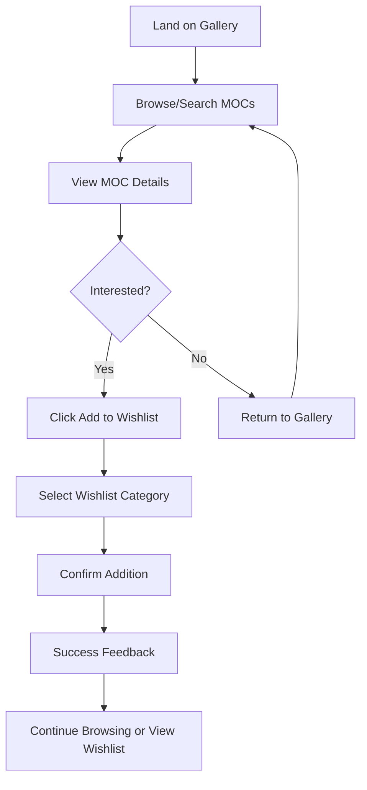
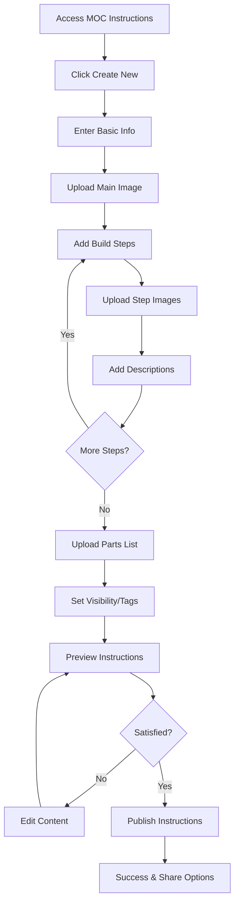
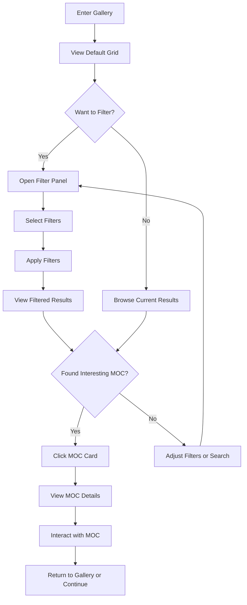

# User Flows

## Flow 1: Discover and Save MOC to Wishlist

**User Goal:** Find interesting LEGO MOC builds and save them for future reference

**Entry Points:** Home page, direct link to gallery, search results

**Success Criteria:** User successfully adds MOC to wishlist and can access it later

### Flow Diagram

### Edge Cases & Error Handling:

- User not logged in: Prompt to sign in before adding to wishlist
- Network error during save: Show retry option with offline queue
- Duplicate item: Confirm if user wants to add again or move to different category
- Full wishlist: Suggest creating new category or removing old items

**Notes:** Include visual feedback (heart icon animation) and toast notification for successful additions

## Flow 2: Create and Upload MOC Instructions

**User Goal:** Document a custom LEGO build with step-by-step instructions and share with community

**Entry Points:** MOC Instructions section, profile page, direct creation link

**Success Criteria:** User successfully creates complete MOC instruction set with images and descriptions

### Flow Diagram

### Edge Cases & Error Handling:

- Large file uploads: Show progress indicators and allow resuming interrupted uploads
- Missing required fields: Highlight incomplete sections with clear error messages
- Image processing failures: Provide alternative upload methods and format guidance
- Save draft functionality: Auto-save progress and allow returning to incomplete instructions

**Notes:** Implement drag-and-drop file uploads and real-time preview of instruction layout

## Flow 3: Browse and Filter Gallery

**User Goal:** Explore LEGO MOC builds using various filters and search criteria

**Entry Points:** Home page, main navigation, search results

**Success Criteria:** User finds relevant MOCs using filters and can easily view details

### Flow Diagram

### Edge Cases & Error Handling:

- No results found: Suggest alternative filters or popular MOCs
- Slow loading: Implement skeleton screens and progressive loading
- Filter combinations with no results: Show which filters to remove
- Mobile filter experience: Collapsible filter drawer with clear apply/reset actions

**Notes:** Include sorting options (newest, most popular, difficulty) and infinite scroll for large result sets
