# API Portability & Local Development PRD

## Document Info

| Field       | Value                                    |
| ----------- | ---------------------------------------- |
| **Project** | LEGO MOC Instructions App                |
| **Type**    | Architecture & Infrastructure PRD        |
| **Version** | 1.0                                      |
| **Created** | 2025-12-27                               |
| **Author**  | Platform Engineering                     |
| **Status**  | Draft - Pending Decision                 |

---

## 1. Executive Summary

### 1.1 Problem Statement

The current AWS Lambda + VPC + Aurora architecture presents two challenges:

| Challenge | Impact |
|-----------|--------|
| **High development costs** | $150-400+/month for a single-user portfolio project |
| **Slow local iteration** | No way to run the API locally; every change requires Lambda deployment |

### 1.2 Proposed Solution

Implement a **Hexagonal Architecture** (Ports & Adapters) that:

1. **Extracts business logic** into a shared `@repo/api-services` package
2. **Enables local development** with Express + Docker PostgreSQL
3. **Preserves AWS Lambda** as a deployment option (portfolio + professional skills)
4. **Optionally enables Vercel** for $0 hosting if cost reduction is prioritized

### 1.3 Architecture Overview

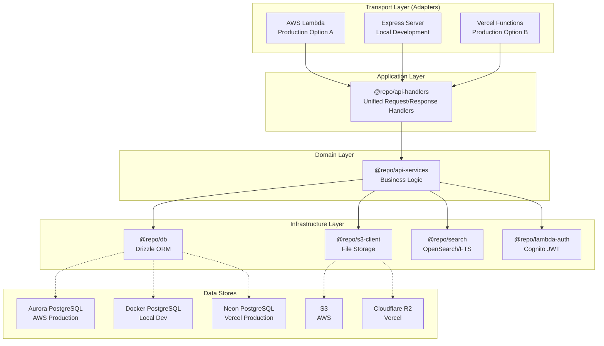

### 1.4 Goals

| Priority | Goal | Metric |
|----------|------|--------|
| **P0** | Enable local API development | Express server running against Docker PostgreSQL |
| **P0** | Preserve AWS deployment capability | Lambda handlers continue to work |
| **P1** | Reduce code duplication | Single source of truth for business logic |
| **P1** | Maintain professional AWS skills | Keep Lambda as viable production option |
| **P2** | Enable cost reduction path | Vercel migration possible without rewrite |
| **P2** | Improve deployment speed | < 2 min local restart vs 5+ min Lambda deploy |

### 1.5 Non-Goals

- Rewriting existing Lambda handlers (they work; we're extracting, not replacing)
- Choosing between AWS and Vercel now (architecture supports both)
- Multi-region deployment
- Changing the frontend architecture

---

## 2. Current State Analysis

### 2.1 Current Architecture

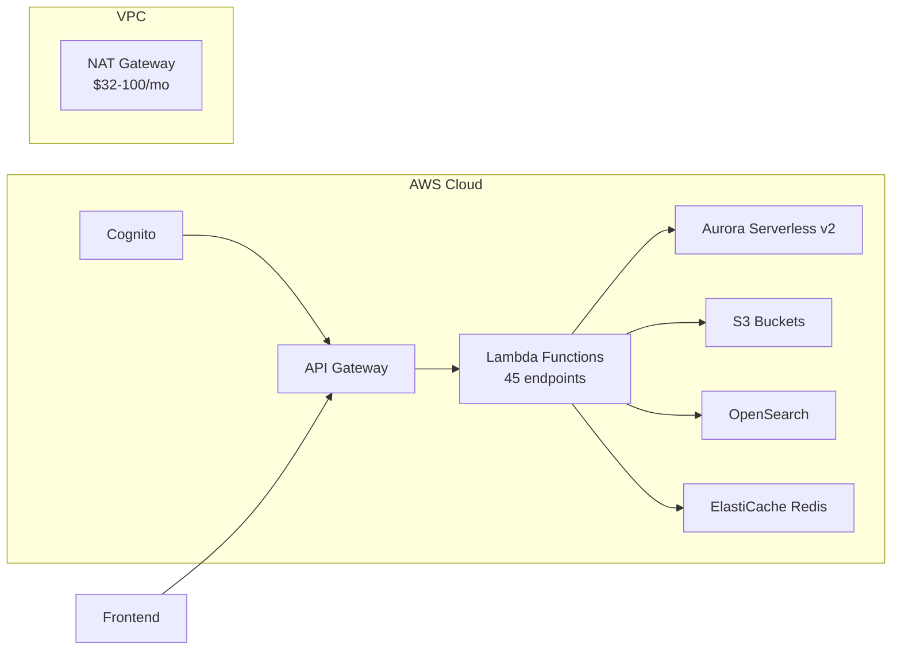

### 2.2 Current Costs (AWS)

| Service | Purpose | Monthly Cost |
|---------|---------|--------------|
| Aurora Serverless v2 | PostgreSQL database | $50-200 |
| OpenSearch | Full-text search | $25-300 |
| NAT Gateway | VPC outbound traffic | $32-100 |
| Lambda + API Gateway | API compute | $15-70 |
| S3 + CloudFront | File storage + CDN | $10-40 |
| CloudWatch | Logging/metrics | $20-50 |
| Other (Secrets, VPC) | Infrastructure | $12-30 |
| **Total** | | **$164-790/month** |

### 2.3 Current Pain Points

| Pain Point | Impact | Root Cause |
|------------|--------|------------|
| No local development | Slow iteration, high AWS bill | All logic in Lambda handlers |
| Expensive for 1 user | $150+/mo for portfolio project | Over-provisioned infrastructure |
| Slow deployments | 3-5 min per `serverless deploy` | CloudFormation overhead |
| Coupled architecture | Hard to test, hard to migrate | Business logic mixed with Lambda event handling |

### 2.4 API Endpoints Inventory

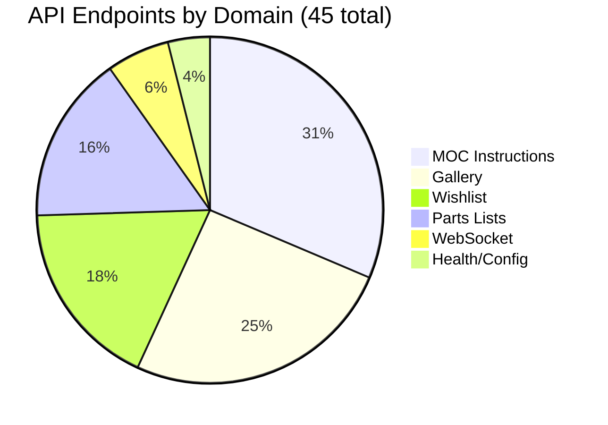

| Domain | Endpoints | Complexity | Key Dependencies |
|--------|-----------|------------|------------------|
| MOC Instructions | 16 | High | S3, OpenSearch, Redis |
| Gallery | 13 | High | S3, OpenSearch |
| Wishlist | 9 | Medium | S3 |
| Parts Lists | 8 | Medium | S3, XML/CSV parsing |
| WebSocket | 3 | Medium | DynamoDB, API Gateway |
| Health/Config | 2 | Low | Database |

---

## 3. Target Architecture

### 3.1 Hexagonal Architecture (Ports & Adapters)

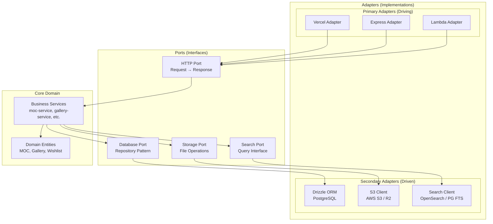

### 3.2 Package Structure

```
packages/
├── backend/
│   ├── api-services/          # NEW: Core business logic
│   │   ├── src/
│   │   │   ├── moc/
│   │   │   │   ├── moc-service.ts
│   │   │   │   ├── moc-file-service.ts
│   │   │   │   ├── moc-search-service.ts
│   │   │   │   └── index.ts
│   │   │   ├── gallery/
│   │   │   ├── wishlist/
│   │   │   ├── parts-list/
│   │   │   └── shared/
│   │   │       ├── errors.ts
│   │   │       └── pagination.ts
│   │   └── package.json
│   │
│   ├── api-handlers/          # NEW: Unified handlers (web standard)
│   │   ├── src/
│   │   │   ├── moc/
│   │   │   │   ├── list.handler.ts
│   │   │   │   ├── get.handler.ts
│   │   │   │   ├── create.handler.ts
│   │   │   │   └── index.ts
│   │   │   ├── gallery/
│   │   │   ├── wishlist/
│   │   │   └── lib/
│   │   │       ├── request.ts
│   │   │       └── response.ts
│   │   └── package.json
│   │
│   ├── lambda-adapter/        # NEW: Lambda ↔ Web Standard conversion
│   │   ├── src/
│   │   │   ├── request.ts
│   │   │   ├── response.ts
│   │   │   └── index.ts
│   │   └── package.json
│   │
│   ├── db/                    # EXISTING: Drizzle ORM
│   ├── s3-client/             # EXISTING: S3 operations
│   ├── lambda-auth/           # EXISTING: Cognito JWT
│   └── ...

apps/
├── api/                       # EXISTING: Lambda handlers (keep working)
├── api-express/               # NEW: Express server for local dev
│   ├── src/
│   │   ├── index.ts
│   │   ├── app.ts
│   │   ├── middleware/
│   │   │   ├── auth.ts
│   │   │   ├── error-handler.ts
│   │   │   └── cors.ts
│   │   └── routes/
│   │       ├── moc.routes.ts
│   │       ├── gallery.routes.ts
│   │       └── index.ts
│   └── package.json
│
├── api-vercel/                # FUTURE: Vercel functions (optional)
│   ├── api/
│   │   ├── mocs/
│   │   ├── gallery/
│   │   └── wishlist/
│   └── vercel.json
│
└── web/                       # EXISTING: Frontend apps
```

### 3.3 Request Flow Comparison

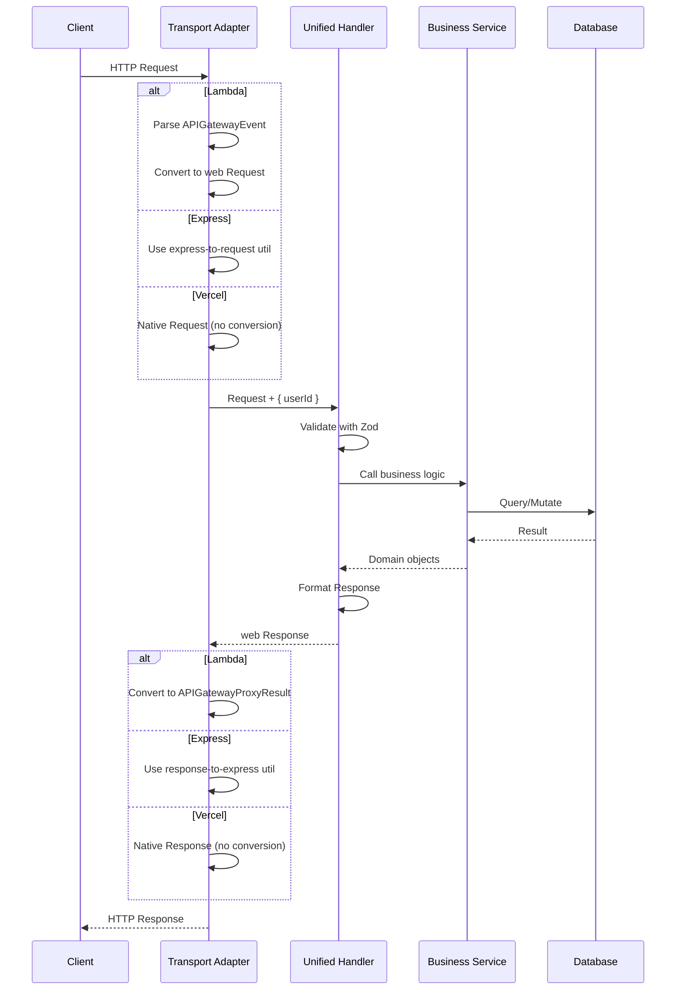

---

## 4. Unified Handler Pattern

### 4.1 Handler Implementation (Write Once)

```typescript
// packages/backend/api-handlers/src/moc/list.handler.ts
import { listMocs } from '@repo/api-services/moc'
import { MocListQuerySchema } from '@repo/api-types/moc'

export interface HandlerContext {
  userId: string
  // Add other context as needed (e.g., permissions, tenant)
}

export async function handleListMocs(
  request: Request,
  ctx: HandlerContext
): Promise<Response> {
  try {
    const url = new URL(request.url)
    const params = Object.fromEntries(url.searchParams)

    // Validate input
    const query = MocListQuerySchema.parse(params)

    // Call business logic
    const result = await listMocs(ctx.userId, query)

    // Return standard Response
    return Response.json(result)
  } catch (error) {
    return handleError(error)
  }
}
```

### 4.2 Adapter Implementations

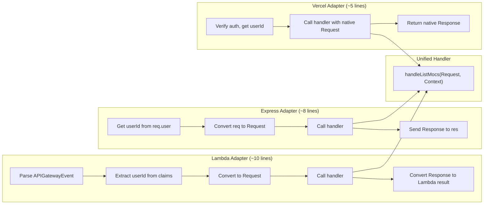

#### Lambda Adapter

```typescript
// apps/api/endpoints/moc-instructions/list/handler.ts
import { APIGatewayProxyEvent, APIGatewayProxyResult } from 'aws-lambda'
import { handleListMocs } from '@repo/api-handlers/moc'
import { toLambdaRequest, fromLambdaResponse, getUserId } from '@repo/lambda-adapter'

export const handler = async (
  event: APIGatewayProxyEvent
): Promise<APIGatewayProxyResult> => {
  const userId = getUserId(event)
  if (!userId) {
    return { statusCode: 401, body: JSON.stringify({ error: 'Unauthorized' }) }
  }

  const request = toLambdaRequest(event)
  const response = await handleListMocs(request, { userId })
  return fromLambdaResponse(response)
}
```

#### Express Adapter

```typescript
// apps/api-express/src/routes/moc.routes.ts
import { Router } from 'express'
import { handleListMocs } from '@repo/api-handlers/moc'
import { toRequest, fromResponse } from '../lib/adapters'
import { authMiddleware } from '../middleware/auth'

const router = Router()

router.get('/mocs', authMiddleware, async (req, res, next) => {
  try {
    const request = toRequest(req)
    const response = await handleListMocs(request, { userId: req.user.sub })
    fromResponse(res, response)
  } catch (error) {
    next(error)
  }
})

export default router
```

#### Vercel Adapter

```typescript
// apps/api-vercel/api/mocs/route.ts
import { handleListMocs } from '@repo/api-handlers/moc'
import { auth } from '@/lib/auth'

export async function GET(request: Request) {
  const session = await auth(request)
  if (!session?.userId) {
    return Response.json({ error: 'Unauthorized' }, { status: 401 })
  }

  return handleListMocs(request, { userId: session.userId })
}
```

### 4.3 Effort Per Endpoint

| Task | Lines of Code | Time |
|------|---------------|------|
| Unified Handler | ~20-40 | 10-15 min |
| Lambda Adapter | ~10 | 2 min |
| Express Adapter | ~8 | 2 min |
| Vercel Adapter | ~5 | 1 min |
| **Total per endpoint** | ~45-65 | ~15-20 min |

### 4.4 Effort Summary (45 Endpoints)

| Component | One-Time Setup | Per Endpoint | 45 Endpoints Total |
|-----------|----------------|--------------|-------------------|
| `@repo/api-services` | 2-3 hours | - | (already exists in handlers) |
| `@repo/api-handlers` | 1 hour | 15 min | ~12 hours |
| Lambda adapters | 1 hour | 2 min | ~2.5 hours |
| Express adapters | 1 hour | 2 min | ~2.5 hours |
| Vercel adapters | 30 min | 1 min | ~1 hour |

**Total estimated effort: 3-4 days** (including testing)

---

## 5. Platform Comparison

### 5.1 Decision Matrix

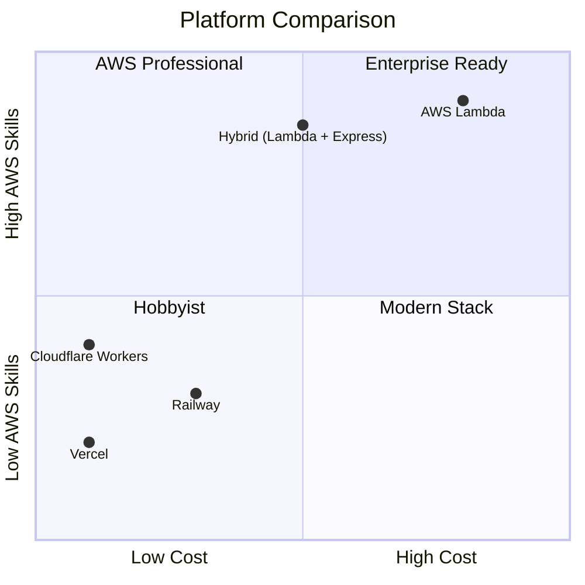

### 5.2 Detailed Comparison

| Criteria | AWS Lambda | Vercel | Cloudflare Workers | Railway |
|----------|------------|--------|-------------------|---------|
| **Monthly Cost** | $150-400+ | $0 | $0 | $5-20 |
| **Free Tier** | Limited | Generous | Generous | Limited |
| **Cold Start** | 200-500ms | 200-500ms | <50ms | None (container) |
| **Max Timeout** | 15 min | 10s (free) / 60s (pro) | 30s (free) | Unlimited |
| **WebSocket** | ✅ Native | ❌ Needs workaround | ✅ Durable Objects | ✅ Native |
| **PostgreSQL** | Aurora | Neon (external) | Neon/D1 | Included |
| **File Storage** | S3 | R2 (S3-compatible) | R2 | S3/R2 |
| **Deploy Speed** | 3-5 min | 30 sec | 30 sec | 1-2 min |
| **Local Dev** | SAM/Localstack | `vercel dev` | `wrangler dev` | Docker |
| **Learning Value** | Enterprise AWS | Modern web | Edge computing | Containers |
| **Vendor Lock-in** | High (events) | Low (web std) | Medium (Workers) | Low (Docker) |

### 5.3 AWS Lambda - Detailed Analysis

#### Pros

| Benefit | Details |
|---------|---------|
| **Enterprise relevance** | AWS is the #1 cloud platform; Lambda skills are highly marketable |
| **Mature ecosystem** | Extensive documentation, community, and tooling |
| **WebSocket support** | Native API Gateway WebSocket with DynamoDB connections |
| **15-minute timeout** | Long-running tasks are possible |
| **VPC integration** | Access to RDS, ElastiCache, OpenSearch |
| **IAM integration** | Fine-grained permissions |
| **Already working** | Your current production is Lambda; no migration risk |

#### Cons

| Limitation | Impact | Mitigation |
|------------|--------|------------|
| **High cost** | $150-400+/mo for single user | Extract services for local dev |
| **Slow deploys** | 3-5 min CloudFormation | Use Express locally |
| **Cold starts** | 200-500ms in VPC | Keep Lambda warm, or accept for portfolio |
| **Complex local dev** | SAM/Localstack is clunky | Use Express + Docker |
| **Event format** | Proprietary APIGatewayEvent | Abstract with adapter |

### 5.4 Vercel - Detailed Analysis

#### Pros

| Benefit | Details |
|---------|---------|
| **$0 for your use case** | 100GB bandwidth, 100GB-hrs compute free |
| **Git-push deploys** | No CLI, no CloudFormation, instant |
| **Preview deployments** | Every PR gets a unique URL |
| **Web-standard APIs** | `Request`/`Response` - portable |
| **Edge network** | Fast globally without config |
| **Modern portfolio piece** | Shows awareness of current trends |

#### Cons

| Limitation | Impact | Mitigation |
|------------|--------|------------|
| **10s timeout (free)** | Large file parsing could fail | Chunked uploads, or $20/mo Pro |
| **No WebSocket** | Upload progress breaks | Polling (fine for 1 user) or Pusher |
| **Cold starts** | 200-500ms | Acceptable for portfolio |
| **Limited compute** | Not for heavy processing | Offload to background jobs |
| **Less AWS experience** | Doesn't build Lambda skills | Keep Lambda adapter maintained |

### 5.5 Hybrid Approach (Recommended)

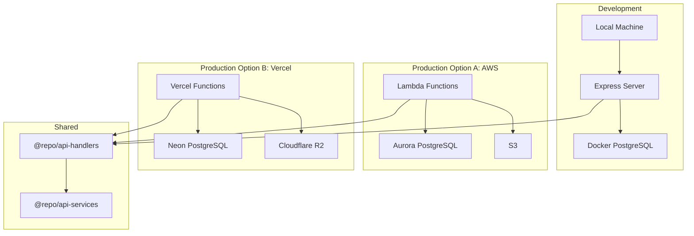

**Benefits of Hybrid:**
- ✅ Local development with Express ($0)
- ✅ Keep AWS Lambda skills current (portfolio + professional)
- ✅ Vercel available for cost reduction when ready
- ✅ Single business logic implementation
- ✅ Flexibility to choose production platform based on needs

---

## 6. WebSocket Considerations

### 6.1 Current WebSocket Usage

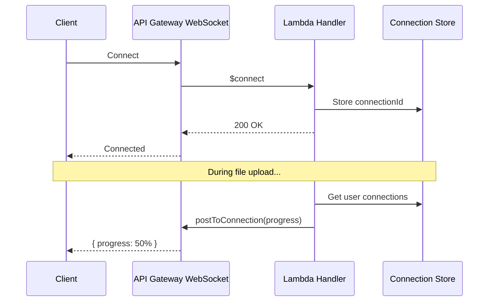

### 6.2 WebSocket Alternatives by Platform

| Platform | WebSocket Support | Alternative | Effort |
|----------|------------------|-------------|--------|
| **AWS Lambda** | ✅ Native via API Gateway | - | Already implemented |
| **Express (local)** | ✅ Native via `ws` package | - | Simple to add |
| **Vercel** | ❌ Not supported | Polling, Pusher, Ably | Medium |
| **Cloudflare** | ✅ Durable Objects | - | Requires Workers migration |

### 6.3 Polling Fallback (Simple Solution)

```typescript
// Client-side polling (works everywhere)
async function pollUploadProgress(uploadId: string) {
  while (true) {
    const response = await fetch(`/api/uploads/${uploadId}/progress`)
    const { progress, status } = await response.json()

    updateProgressUI(progress)

    if (status === 'complete' || status === 'error') break
    await sleep(2000) // Poll every 2 seconds
  }
}
```

**For a single-user portfolio app, polling is completely acceptable.**

---

## 7. Local Development Setup

### 7.1 Docker Compose

```yaml
# docker/docker-compose.local.yml
version: '3.8'

services:
  postgres:
    image: postgres:16-alpine
    container_name: lego-moc-postgres
    ports:
      - "5432:5432"
    environment:
      POSTGRES_USER: lego_moc_user
      POSTGRES_PASSWORD: local_dev_password
      POSTGRES_DB: lego_moc_db
    volumes:
      - postgres_data:/var/lib/postgresql/data
      - ./init-scripts:/docker-entrypoint-initdb.d
    healthcheck:
      test: ["CMD-SHELL", "pg_isready -U lego_moc_user -d lego_moc_db"]
      interval: 5s
      timeout: 5s
      retries: 5

  # Optional: Redis for caching
  redis:
    image: redis:7-alpine
    container_name: lego-moc-redis
    ports:
      - "6379:6379"
    profiles:
      - with-cache

  # Optional: MinIO for S3-compatible storage
  minio:
    image: minio/minio
    container_name: lego-moc-minio
    ports:
      - "9000:9000"
      - "9001:9001"
    environment:
      MINIO_ROOT_USER: minioadmin
      MINIO_ROOT_PASSWORD: minioadmin
    command: server /data --console-address ":9001"
    profiles:
      - with-storage

volumes:
  postgres_data:
```

### 7.2 Environment Configuration

```bash
# .env.local (for Express development)

# Database (Docker)
POSTGRES_HOST=localhost
POSTGRES_PORT=5432
POSTGRES_USERNAME=lego_moc_user
POSTGRES_PASSWORD=local_dev_password
POSTGRES_DATABASE=lego_moc_db

# Auth (real Cognito - it's free for 1 user)
COGNITO_USER_POOL_ID=us-east-1_xxxxx
COGNITO_CLIENT_ID=xxxxxxxxx
COGNITO_REGION=us-east-1

# S3 (options: real S3, MinIO, or mock)
S3_BUCKET=lego-moc-files-dev
S3_ENDPOINT=http://localhost:9000  # MinIO
# S3_ENDPOINT=                      # Real S3 (comment out for AWS)

# Search (disable OpenSearch, use PostgreSQL FTS)
OPENSEARCH_ENABLED=false

# Redis (optional)
REDIS_ENABLED=false

# Server
PORT=4000
NODE_ENV=development
```

### 7.3 Development Workflow

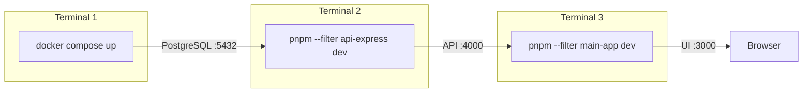

```bash
# One-time setup
docker compose -f docker/docker-compose.local.yml up -d
pnpm --filter @repo/db migrate:local
pnpm --filter @repo/db seed:local  # Optional: seed test data

# Daily development
pnpm dev:local  # Starts Express API + Frontend concurrently
```

---

## 8. Migration Strategy

### 8.1 Phased Approach

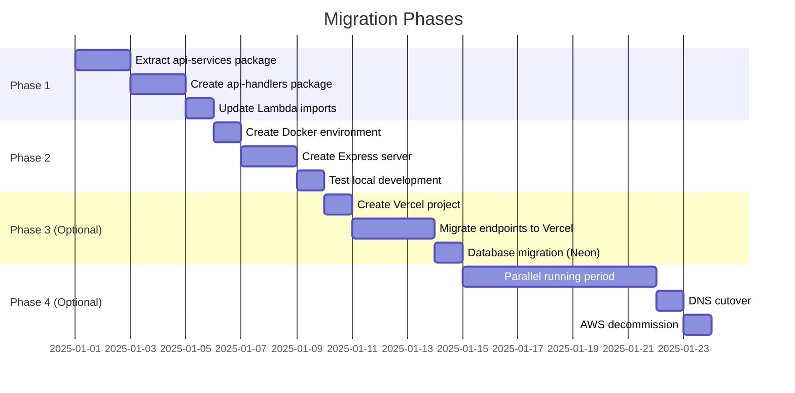

### 8.2 Phase Details

#### Phase 1: Service Extraction (Required)

| Story | Description | Effort |
|-------|-------------|--------|
| 1.1 | Create `@repo/api-services` package scaffold | 2 hours |
| 1.2 | Move MOC services (moc-service, moc-file-service, etc.) | 4 hours |
| 1.3 | Move Gallery services | 2 hours |
| 1.4 | Move Wishlist services | 2 hours |
| 1.5 | Move Parts List services | 2 hours |
| 1.6 | Create `@repo/api-handlers` with unified handlers | 8 hours |
| 1.7 | Create `@repo/lambda-adapter` utilities | 2 hours |
| 1.8 | Update Lambda handlers to use new packages | 4 hours |
| 1.9 | Verify all Lambda tests pass | 2 hours |

**Phase 1 Total: ~3-4 days**

#### Phase 2: Local Development (Required)

| Story | Description | Effort |
|-------|-------------|--------|
| 2.1 | Create Docker Compose configuration | 2 hours |
| 2.2 | Create database migration scripts for local | 2 hours |
| 2.3 | Create `apps/api-express` package scaffold | 2 hours |
| 2.4 | Implement Cognito JWT middleware for Express | 3 hours |
| 2.5 | Create Express routes for all endpoints | 6 hours |
| 2.6 | Create error handling middleware | 2 hours |
| 2.7 | Add file upload handling (multer) | 3 hours |
| 2.8 | Test complete local development flow | 4 hours |

**Phase 2 Total: ~3 days**

#### Phase 3: Vercel Migration (Optional)

| Story | Description | Effort |
|-------|-------------|--------|
| 3.1 | Create Vercel project and configuration | 2 hours |
| 3.2 | Create Vercel function adapters | 4 hours |
| 3.3 | Migrate database to Neon | 4 hours |
| 3.4 | Migrate files to Cloudflare R2 | 4 hours |
| 3.5 | Implement WebSocket alternative (polling) | 4 hours |
| 3.6 | Update frontend API base URL | 1 hour |
| 3.7 | End-to-end testing on Vercel | 4 hours |

**Phase 3 Total: ~3 days**

#### Phase 4: AWS Decommission (Optional)

| Story | Description | Effort |
|-------|-------------|--------|
| 4.1 | Run parallel for 1-2 weeks | - |
| 4.2 | DNS cutover to Vercel | 1 hour |
| 4.3 | Create AWS teardown script | 2 hours |
| 4.4 | Execute teardown, verify billing | 2 hours |
| 4.5 | Archive Lambda code as portfolio reference | 1 hour |

**Phase 4 Total: ~1 day**

---

## 9. Decision Points

### 9.1 Immediate Decisions Required

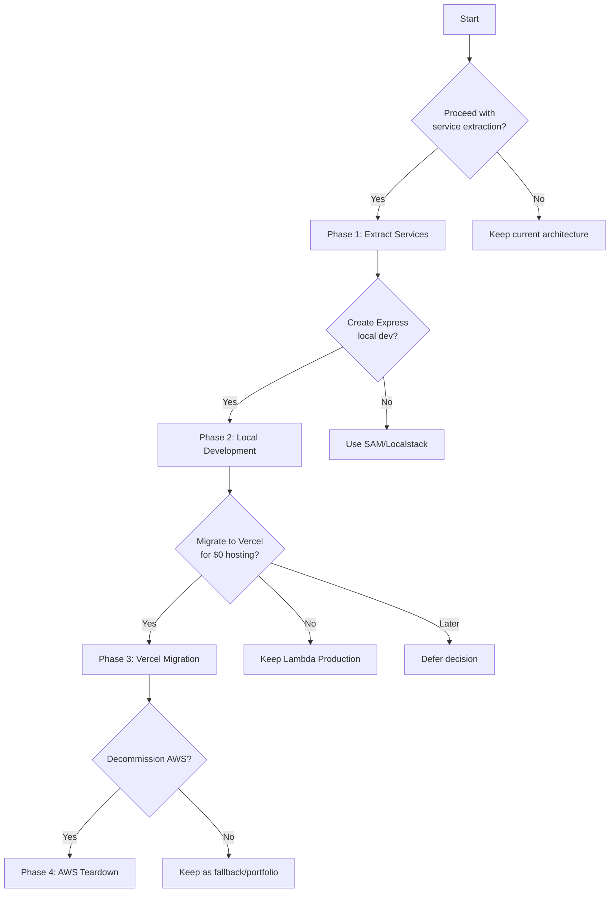

### 9.2 Decision: Keep Lambda Maintained?

| Option | Pros | Cons |
|--------|------|------|
| **A: Freeze Lambda** | Less maintenance, focus on one platform | Skills may get stale, no fallback |
| **B: Keep Lambda updated** | AWS skills current, fallback option, portfolio | ~2 min extra per new endpoint |
| **C: Lambda as primary** | Enterprise skills, proven production | High cost, slow local dev |

**Recommendation:** Option B - Keep Lambda adapters updated with minimal effort (~2 min per endpoint). This maintains AWS skills while enabling local development.

### 9.3 Decision: Production Platform

| Option | Cost | AWS Skills | Risk | Best For |
|--------|------|------------|------|----------|
| **Stay on Lambda** | $150-400/mo | ✅ High | Low | Professional growth |
| **Migrate to Vercel** | $0/mo | ❌ Limited | Medium | Cost savings |
| **Hybrid (both)** | $150-400/mo | ✅ High | Low | Maximum flexibility |

**Recommendation:** Start with Hybrid - implement local dev with Express, keep Lambda production, and evaluate Vercel later when you have working local development.

---

## 10. Success Criteria

### 10.1 Phase 1 Success (Service Extraction)

- [ ] `@repo/api-services` package created with all business logic
- [ ] `@repo/api-handlers` package created with unified handlers
- [ ] `@repo/lambda-adapter` package created with conversion utilities
- [ ] All existing Lambda handlers updated to use new packages
- [ ] All existing tests passing
- [ ] No regression in production

### 10.2 Phase 2 Success (Local Development)

- [ ] Docker Compose starts PostgreSQL successfully
- [ ] Express server starts and connects to local database
- [ ] All 45 endpoints accessible via localhost:4000
- [ ] Authentication works with Cognito JWT
- [ ] File uploads work (to S3 or local MinIO)
- [ ] Frontend can connect to local API
- [ ] Development workflow documented

### 10.3 Phase 3 Success (Vercel - Optional)

- [ ] All endpoints deployed to Vercel Functions
- [ ] Database migrated to Neon
- [ ] Files migrated to R2
- [ ] WebSocket alternative implemented
- [ ] Performance acceptable (< 500ms p95)
- [ ] Monthly cost < $10

### 10.4 Phase 4 Success (AWS Decommission - Optional)

- [ ] DNS pointing to Vercel
- [ ] AWS resources deleted
- [ ] Monthly AWS bill < $5 (residual)
- [ ] Lambda code archived in repository

---

## 11. Risks and Mitigations

| Risk | Probability | Impact | Mitigation |
|------|-------------|--------|------------|
| Service extraction breaks production | Medium | High | Comprehensive testing, staged rollout |
| Cognito doesn't work with Express | Low | Medium | Already verified; JWT validation is standard |
| Local PostgreSQL differs from Aurora | Low | Low | Use same PostgreSQL version; Drizzle abstracts differences |
| Vercel timeouts for large uploads | Medium | Medium | Chunked uploads already implemented |
| WebSocket removal hurts UX | Low | Low | Polling is acceptable for single user |
| Maintaining 3 adapters becomes burden | Low | Medium | Unified handlers minimize per-endpoint effort |

---

## 12. Appendix

### A. Files to Move (Phase 1)

| Source | Destination |
|--------|-------------|
| `apps/api/endpoints/moc-instructions/_shared/moc-service.ts` | `packages/backend/api-services/src/moc/moc-service.ts` |
| `apps/api/endpoints/moc-instructions/_shared/moc-file-service.ts` | `packages/backend/api-services/src/moc/moc-file-service.ts` |
| `apps/api/endpoints/moc-instructions/_shared/opensearch-moc.ts` | `packages/backend/api-services/src/moc/moc-search-service.ts` |
| `apps/api/endpoints/moc-instructions/_shared/parts-list-parser.ts` | `packages/backend/api-services/src/parts-list/parser.ts` |
| `apps/api/endpoints/moc-instructions/_shared/parts-validators/*` | `packages/backend/api-services/src/parts-list/validators/*` |
| `apps/api/endpoints/moc-parts-lists/_shared/parts-list-service.ts` | `packages/backend/api-services/src/parts-list/s3-service.ts` |
| `apps/api/endpoints/websocket/_shared/*` | `packages/backend/api-services/src/websocket/*` |
| `apps/api/endpoints/gallery/schemas/*` | `packages/backend/api-services/src/gallery/schemas.ts` |
| `apps/api/endpoints/wishlist/schemas/*` | `packages/backend/api-services/src/wishlist/schemas.ts` |

### B. Lambda Adapter Utility (Complete Implementation)

```typescript
// packages/backend/lambda-adapter/src/index.ts
import { APIGatewayProxyEvent, APIGatewayProxyResult } from 'aws-lambda'

export function toLambdaRequest(event: APIGatewayProxyEvent): Request {
  const protocol = event.headers['x-forwarded-proto'] || 'https'
  const host = event.headers.host || 'localhost'
  const url = new URL(event.path, `${protocol}://${host}`)

  // Add query parameters
  if (event.queryStringParameters) {
    Object.entries(event.queryStringParameters).forEach(([key, value]) => {
      if (value) url.searchParams.set(key, value)
    })
  }

  // Build headers
  const headers = new Headers()
  Object.entries(event.headers).forEach(([key, value]) => {
    if (value) headers.set(key, value)
  })

  // Create Request
  const init: RequestInit = {
    method: event.httpMethod,
    headers,
  }

  // Add body for non-GET requests
  if (event.body && event.httpMethod !== 'GET') {
    init.body = event.isBase64Encoded
      ? Buffer.from(event.body, 'base64')
      : event.body
  }

  return new Request(url, init)
}

export async function fromLambdaResponse(
  response: Response
): Promise<APIGatewayProxyResult> {
  const headers: Record<string, string> = {}
  response.headers.forEach((value, key) => {
    headers[key] = value
  })

  const body = await response.text()

  return {
    statusCode: response.status,
    headers,
    body,
  }
}

export function getUserId(event: APIGatewayProxyEvent): string | null {
  return event.requestContext.authorizer?.claims?.sub || null
}

export function getUser(event: APIGatewayProxyEvent) {
  const claims = event.requestContext.authorizer?.claims
  if (!claims) return null

  return {
    sub: claims.sub,
    email: claims.email,
    emailVerified: claims.email_verified === 'true',
  }
}
```

### C. Express Adapter Utility (Complete Implementation)

```typescript
// apps/api-express/src/lib/adapters.ts
import { Request as ExpressRequest, Response as ExpressResponse } from 'express'

export function toRequest(req: ExpressRequest): Request {
  const protocol = req.protocol
  const host = req.get('host') || 'localhost'
  const url = new URL(req.originalUrl, `${protocol}://${host}`)

  const headers = new Headers()
  Object.entries(req.headers).forEach(([key, value]) => {
    if (typeof value === 'string') {
      headers.set(key, value)
    } else if (Array.isArray(value)) {
      value.forEach(v => headers.append(key, v))
    }
  })

  const init: RequestInit = {
    method: req.method,
    headers,
  }

  if (req.body && req.method !== 'GET' && req.method !== 'HEAD') {
    init.body = typeof req.body === 'string'
      ? req.body
      : JSON.stringify(req.body)
  }

  return new Request(url, init)
}

export async function fromResponse(
  res: ExpressResponse,
  response: Response
): Promise<void> {
  // Set status
  res.status(response.status)

  // Set headers
  response.headers.forEach((value, key) => {
    res.setHeader(key, value)
  })

  // Send body
  const contentType = response.headers.get('content-type')
  if (contentType?.includes('application/json')) {
    const json = await response.json()
    res.json(json)
  } else {
    const text = await response.text()
    res.send(text)
  }
}
```

### D. Cost Comparison Summary

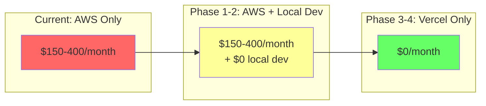

---

## 13. Related Documents

- [Hexagonal API Architecture](../architecture/hexagonal-api-architecture.md)
- [API Design and Integration](../architecture/api-design-and-integration.md)

---

## 14. Decision Log

| Date | Decision | Rationale |
|------|----------|-----------|
| 2025-12-27 | Use Hexagonal Architecture | Enables platform flexibility without business logic duplication |
| 2025-12-27 | Web-standard Request/Response | Maximizes portability; native on Vercel, minimal adapters elsewhere |
| 2025-12-27 | Keep Lambda as option | Maintains AWS skills for professional development |
| 2025-12-27 | Express for local dev | Mature ecosystem, good debugging, similar to Vercel |
| 2025-12-27 | Defer Vercel decision | Get local dev working first; evaluate Vercel with working system |
| 2025-12-27 | Keep Cognito | Already free, works everywhere, no migration needed |

---

## 15. Next Steps

1. **Review this PRD** - Validate approach and make platform decisions
2. **Decide on Phase 3/4** - Commit to Vercel migration or defer
3. **Start Phase 1** - Begin service extraction (benefits regardless of platform choice)
4. **Complete Phase 2** - Get local development working
5. **Re-evaluate** - With working local dev, decide on production platform

---

*Document consolidates API Portability architecture with Vercel migration planning*
*Supports both AWS Lambda continuation and Vercel migration paths*
