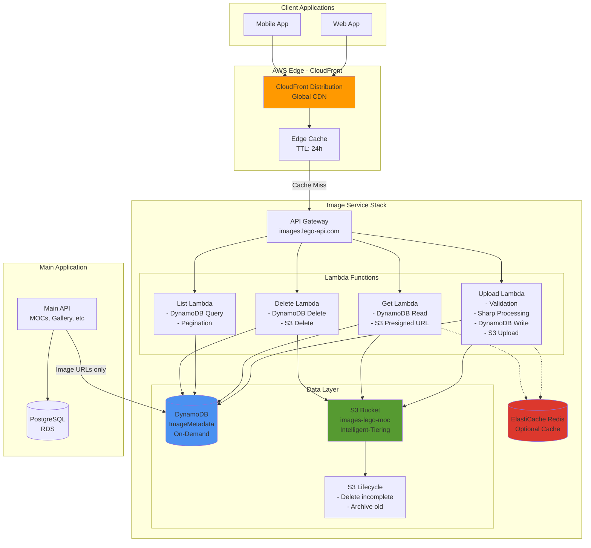
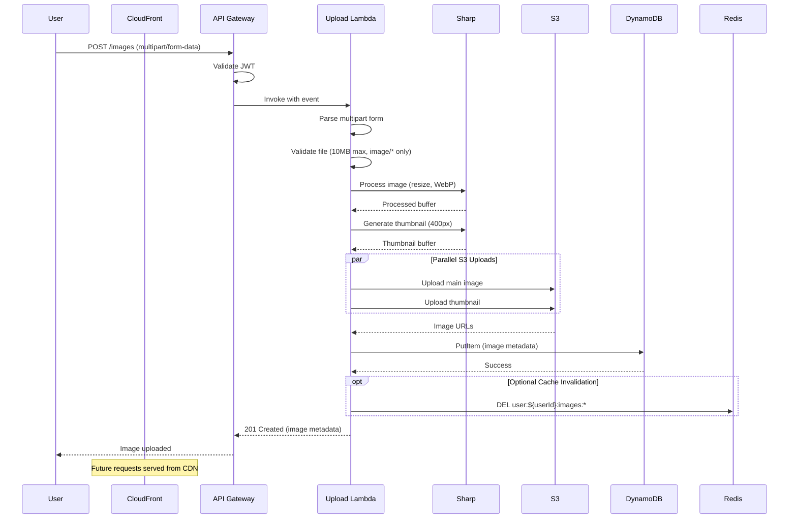
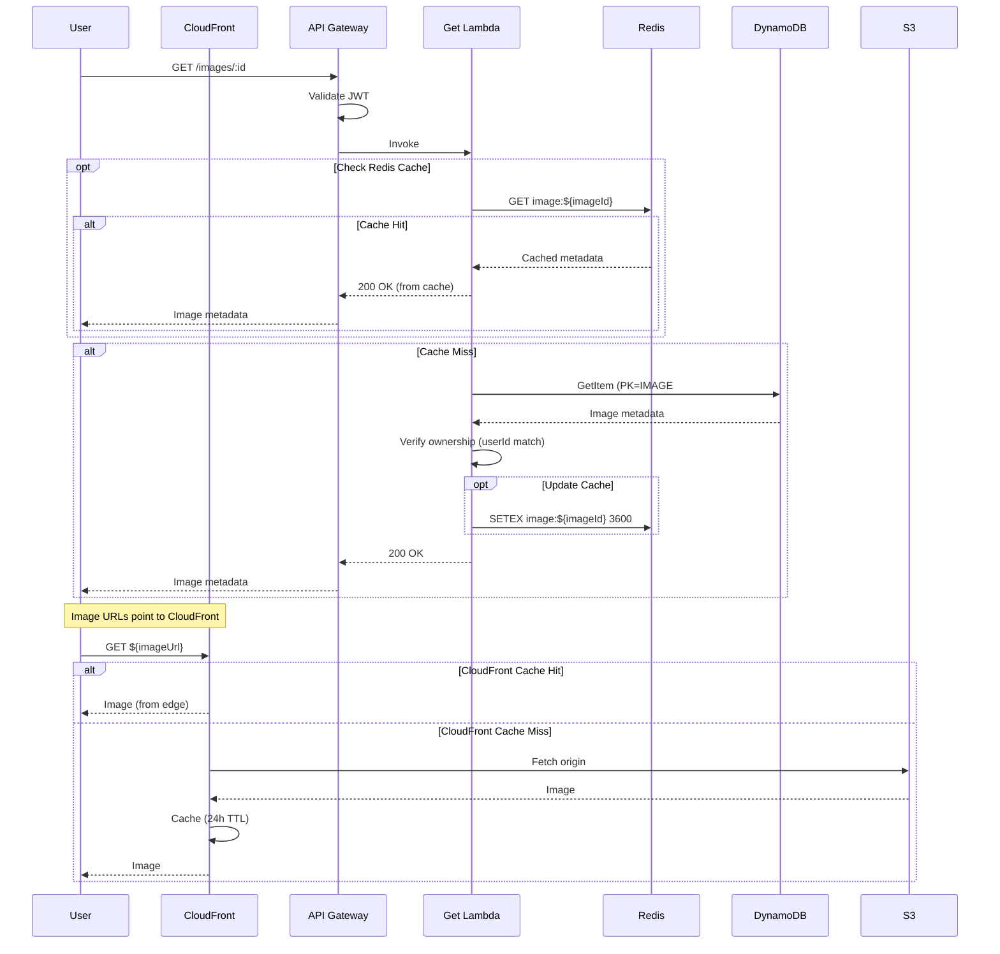
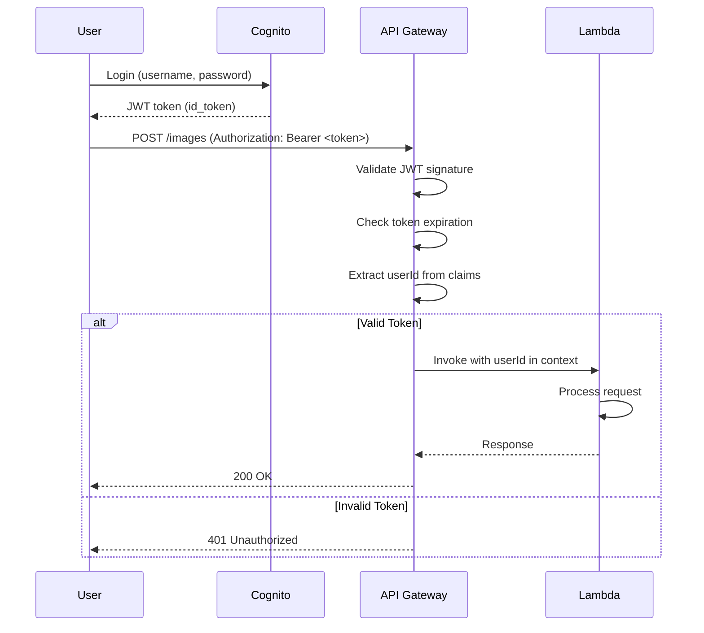

# Image Service Migration - Architecture

**Document:** 01-architecture.md
**Version:** 1.0

---

## High-Level Architecture

### System Overview



---

## Component Responsibilities

### 1. API Gateway (HTTP API)

- **Purpose:** Entry point for all image operations
- **Features:**
  - Custom domain: `images.lego-api.com`
  - JWT authorizer (AWS Cognito)
  - Request throttling: 1000 req/sec per user
  - CORS configuration
- **Routing:**
  - `POST /images` → Upload Lambda
  - `GET /images/:id` → Get Lambda
  - `GET /images` → List Lambda
  - `PATCH /images/:id` → Update Lambda
  - `DELETE /images/:id` → Delete Lambda

---

### 2. Lambda Functions

#### Upload Lambda

- **Responsibility:** Process and store new images
- **Operations:**
  1. Validate file (size, type, magic number)
  2. Process with Sharp (resize, optimize, WebP conversion)
  3. Generate thumbnail
  4. Upload to S3 (parallel: main + thumbnail)
  5. Write metadata to DynamoDB
  6. Return CloudFront URLs
- **Memory:** 1024 MB
- **Timeout:** 30s

#### Get Lambda

- **Responsibility:** Retrieve single image metadata
- **Operations:**
  1. Check Redis cache (optional)
  2. Query DynamoDB by image ID
  3. Verify user ownership
  4. Return metadata with CloudFront URLs
- **Memory:** 512 MB
- **Timeout:** 10s

#### List Lambda

- **Responsibility:** List user's images with pagination
- **Operations:**
  1. Check Redis cache (optional)
  2. Query DynamoDB UserIndex GSI
  3. Apply filters (albumId, tags)
  4. Paginate with DynamoDB tokens
  5. Return results with pagination metadata
- **Memory:** 512 MB
- **Timeout:** 10s

#### Delete Lambda

- **Responsibility:** Remove images and metadata
- **Operations:**
  1. Query DynamoDB for image metadata
  2. Verify user ownership
  3. Delete from S3 (main + thumbnail)
  4. Delete from DynamoDB
  5. Invalidate CloudFront cache (async)
- **Memory:** 512 MB
- **Timeout:** 15s

---

### 3. DynamoDB

**Table:** `ImageMetadata`
**Capacity:** On-Demand
**Encryption:** AWS managed keys (SSE)

**Features:**

- Single-digit millisecond latency
- Automatic scaling
- Point-in-Time Recovery (PITR)
- DynamoDB Streams (for future analytics)

**Access Patterns:**

1. Get image by ID (Primary Key)
2. List user's images (UserIndex GSI)
3. List album images (AlbumIndex GSI)
4. Query by upload date (UserIndex with sort key)

_See [02-data-model.md](./02-data-model.md) for detailed schema_

---

### 4. S3 Bucket

**Bucket:** `images-lego-moc-${stage}`
**Storage Class:** Intelligent-Tiering

**Features:**

- Transfer Acceleration (global uploads)
- Lifecycle policies (delete incomplete uploads)
- CloudFront Origin Access Identity (OAI)
- Encryption at rest (AES256)

**Folder Structure:**

```
images-lego-moc-prod/
├── images/
│   └── ${userId}/
│       ├── ${imageId}.webp
│       └── thumbnails/
│           └── ${imageId}.webp
└── temp/  (auto-deleted after 24h)
```

---

### 5. CloudFront Distribution

**Purpose:** Global CDN for image delivery

**Features:**

- Edge caching (24-hour TTL)
- HTTPS only (TLS 1.2+)
- Brotli + Gzip compression
- Origin Access Identity (OAI) for S3

**Cache Behavior:**

- Cache key: URL only (no query strings)
- Default TTL: 86400s (24 hours)
- Max TTL: 31536000s (1 year)

**Price Class:** PriceClass_100 (US, Canada, Europe)

---

### 6. ElastiCache Redis (Optional)

**Purpose:** Cache DynamoDB queries for hot images

**Configuration:**

- **Node Type:** `cache.t4g.micro` (0.5 GB)
- **Engine:** Redis 7.x
- **Multi-AZ:** Production only

**Caching Strategy:**

```typescript
// Cache keys
image:${imageId}              // Single image (TTL: 1 hour)
user:${userId}:images:page:${page}  // List query (TTL: 5 minutes)

// Cache tag sets (for invalidation)
user:${userId}:cache_keys     // Set of all cache keys for user
```

**Decision:** Make Redis optional - only enable if cache hit rate >50%

---

## Data Flow Diagrams

### Upload Flow



---

### Get Image Flow



---

## Integration Points

### Main Application → Image Service

**Direction:** Main API calls Image Service

**Use Cases:**

1. **Create MOC with cover image** - Upload image, get URL, store in `mocs` table
2. **Create gallery album** - Upload multiple images, associate with album
3. **Display image galleries** - Fetch image URLs from Image Service

**Communication:**

```typescript
// Main API calls Image Service
const response = await fetch('https://images.lego-api.com/images', {
  method: 'POST',
  headers: {
    Authorization: `Bearer ${userToken}`,
    'Content-Type': 'multipart/form-data',
  },
  body: formData,
})

const { id, imageUrl, thumbnailUrl } = await response.json()

// Store only the image ID and URLs in main database
await db.insert(mocs).values({
  id: mocId,
  coverImageId: id, // Reference to Image Service
  coverImageUrl: imageUrl, // CloudFront URL
})
```

**No Shared Database** - Main API does not query `ImageMetadata` table directly

---

### Image Service → Main Application

**Direction:** Image Service does NOT call Main API

**Principle:** One-way dependency (Main → Image)

**Shared Context:** User ID from JWT token (issued by shared Cognito)

---

## Security Architecture

### Authentication Flow



**JWT Claims Used:**

- `sub` - User ID (primary identifier)
- `exp` - Token expiration
- `aud` - Audience (client ID)

---

### Authorization Model

**Owner-Only Access:**

- Users can only access their own images
- Verified by comparing `image.userId` with `jwt.claims.sub`

**Exceptions:**

- Public galleries (future feature) - TBD
- Admin access (future feature) - TBD

---

## Deployment Architecture

### AWS Regions

**Primary Region:** `us-east-1` (N. Virginia)
**Future:** Multi-region replication (Phase 3)

### Environments

| Environment     | Purpose        | Domain                        | Auto-Deploy                 |
| --------------- | -------------- | ----------------------------- | --------------------------- |
| **Development** | Local testing  | `images-dev.lego-api.com`     | On push to `dev` branch     |
| **Staging**     | Pre-production | `images-staging.lego-api.com` | On push to `staging` branch |
| **Production**  | Live           | `images.lego-api.com`         | On tag `v*`                 |

---

### Infrastructure as Code

**Tool:** SST v3 (Ion)
**Repository:** `apps/api/image-service/`

**Stack Structure:**

```
image-service/
├── sst.config.ts          # Infrastructure definition
├── src/
│   ├── functions/         # Lambda handlers
│   │   ├── upload.ts
│   │   ├── get.ts
│   │   ├── list.ts
│   │   └── delete.ts
│   ├── lib/
│   │   ├── db/            # DynamoDB client
│   │   ├── storage/       # S3 client
│   │   ├── cache/         # Redis client
│   │   └── utils/         # Shared utilities
│   └── types/             # TypeScript types
└── tests/
    ├── unit/
    └── integration/
```

_See [04-infrastructure.md](./04-infrastructure.md) for SST configuration_

---

## Architectural Decisions

### ADR 001: DynamoDB vs PostgreSQL

**Decision:** Use DynamoDB for image metadata

**Rationale:**

- 1-5ms latency vs 10-50ms (PostgreSQL)
- No connection pooling required
- Auto-scaling (no capacity planning)
- Pay-per-request pricing (on-demand)

**Trade-off:** Limited query patterns (no full-text search)

---

### ADR 002: CloudFront vs Direct S3

**Decision:** Use CloudFront in front of S3

**Rationale:**

- Global edge caching (reduced latency)
- HTTPS termination
- Custom domain support
- Reduced S3 request costs

**Trade-off:** +$16/month cost, eventual consistency on cache invalidation

---

### ADR 003: Synchronous vs Async Thumbnails

**Decision:** Synchronous thumbnail generation (for now)

**Rationale:**

- Simpler implementation (Phase 1)
- Acceptable P95 latency (<1s)
- UI can display thumbnails immediately

**Future:** Move to async if P95 >1s (See [06-performance-optimization.md](./06-performance-optimization.md))

---

### ADR 004: Redis Optional vs Required

**Decision:** Make Redis optional

**Rationale:**

- DynamoDB is fast enough for most queries (<10ms)
- Adds operational complexity
- Cost savings ($10/month)

**Trigger:** Enable if cache hit rate >50% in load testing

---

## Scalability Considerations

### Horizontal Scaling

✅ **Auto-scaling components:**

- Lambda (concurrency: 100 → 1000)
- DynamoDB (on-demand capacity)
- CloudFront (global edge network)

### Vertical Limits

⚠️ **Bottlenecks to monitor:**

- Lambda concurrent executions (soft limit: 1000)
- DynamoDB partition hot keys (>3000 RCU/partition)
- S3 request rate (>3500 PUT/s per prefix)

**Mitigation:**

- Request AWS limit increases
- Use DynamoDB partition key sharding
- Add random prefix to S3 keys

---

## Next Steps

1. Review [02-data-model.md](./02-data-model.md) - DynamoDB schema design
2. Review [03-api-specification.md](./03-api-specification.md) - REST API contracts
3. Review [04-infrastructure.md](./04-infrastructure.md) - SST configuration

---

[← Back to Overview](./00-overview.md) | [Next: Data Model →](./02-data-model.md)
