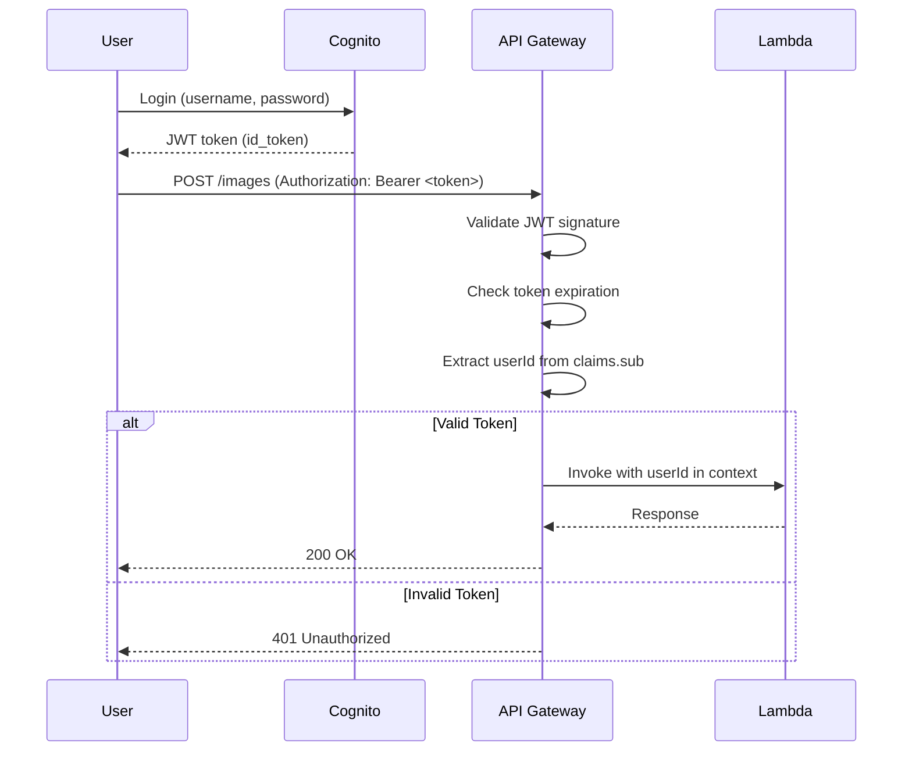

# Image Service Migration - Security

**Document:** 07-security.md
**Version:** 1.0

---

## Security Overview

The Image Service implements **defense-in-depth** security with multiple layers:

1. Network security (VPC, security groups)
2. Authentication (JWT tokens)
3. Authorization (owner-only access)
4. Encryption (at rest + in transit)
5. Input validation (Zod schemas)
6. Rate limiting
7. Audit logging

---

## Authentication

### AWS Cognito JWT Tokens

**Flow:**



---

### API Gateway JWT Authorizer

```typescript
// sst.config.ts
const api = new ApiGatewayV2(stack, 'ImageApi', {
  authorizers: {
    jwt: {
      type: 'jwt',
      jwt: {
        issuer: `https://cognito-idp.us-east-1.amazonaws.com/${process.env.COGNITO_USER_POOL_ID}`,
        audience: [process.env.COGNITO_CLIENT_ID!],
      },
    },
  },
  routes: {
    'POST /images': {
      function: uploadLambda,
      authorizer: 'jwt', // Requires valid JWT
    },
    'GET /images/{id}': {
      function: getLambda,
      authorizer: 'jwt',
    },
  },
})
```

**JWT Claims Validation:**

- `iss` - Issuer must match Cognito User Pool
- `aud` - Audience must match Client ID
- `exp` - Token must not be expired
- `sub` - User ID (primary identifier)

**Token Expiration:**

- ID token: 1 hour
- Refresh token: 30 days

---

### Lambda Authorization Logic

```typescript
// src/functions/upload.ts
export const handler: APIGatewayProxyHandlerV2 = async event => {
  // Extract userId from JWT claims (validated by API Gateway)
  const userId = event.requestContext.authorizer?.jwt.claims.sub as string

  if (!userId) {
    return {
      statusCode: 401,
      body: JSON.stringify({ error: 'Unauthorized', code: 'MISSING_USER_ID' }),
    }
  }

  // Proceed with upload (userId is trusted)
  // ...
}
```

```typescript
// src/functions/get.ts
export const handler: APIGatewayProxyHandlerV2 = async event => {
  const imageId = event.pathParameters?.id
  const userId = event.requestContext.authorizer?.jwt.claims.sub as string

  // Fetch image from DynamoDB
  const image = await getImage(imageId)

  // Verify ownership
  if (image.userId !== userId) {
    return {
      statusCode: 403,
      body: JSON.stringify({ error: 'Forbidden', code: 'NOT_AUTHORIZED' }),
    }
  }

  return {
    statusCode: 200,
    body: JSON.stringify(image),
  }
}
```

---

## Authorization

### Owner-Only Access Model

**Principle:** Users can only access their own images

**Implementation:**

1. **API Gateway** validates JWT and extracts `userId`
2. **Lambda** queries DynamoDB for image
3. **Lambda** compares `image.userId` with JWT `userId`
4. **Lambda** returns `403 Forbidden` if mismatch

**Example:**

```typescript
async function authorizeImageAccess(imageId: string, requestUserId: string): Promise<boolean> {
  const image = await dynamodb.getItem({
    TableName: 'ImageMetadata',
    Key: {
      PK: { S: `IMAGE#${imageId}` },
      SK: { S: 'METADATA' },
    },
  })

  if (!image.Item) {
    return false // Image not found
  }

  return image.Item.userId.S === requestUserId
}
```

---

### Future: Role-Based Access Control (RBAC)

**Future Enhancement (Phase 3):**

Add `role` claim to JWT for admin access:

```typescript
interface JWTClaims {
  sub: string // User ID
  email: string // User email
  role: 'user' | 'admin' | 'moderator' // Role
}

// Admin can access any image
if (requestUserRole === 'admin') {
  // Skip ownership check
  return image
}

// Regular users can only access their own images
if (image.userId !== requestUserId) {
  throw new ForbiddenError('Not authorized')
}
```

---

## Encryption

### Encryption at Rest

**DynamoDB:**

- AWS managed keys (SSE-DDB)
- Automatically encrypts all data
- Encryption applied to table, GSIs, and backups

```typescript
{
  cdk: {
    table: {
      encryption: TableEncryption.AWS_MANAGED,
    },
  },
}
```

---

**S3:**

- SSE-S3 (AES256 encryption)
- Encryption applied to all objects
- Bucket policy enforces encryption

```typescript
{
  cdk: {
    bucket: {
      encryption: BucketEncryption.S3_MANAGED,
      enforceSSL: true,  // Reject non-HTTPS uploads
    },
  },
}
```

**S3 Bucket Policy (Enforce Encryption):**

```json
{
  "Version": "2012-10-17",
  "Statement": [
    {
      "Sid": "DenyUnencryptedObjectUploads",
      "Effect": "Deny",
      "Principal": "*",
      "Action": "s3:PutObject",
      "Resource": "arn:aws:s3:::images-lego-moc-prod/*",
      "Condition": {
        "StringNotEquals": {
          "s3:x-amz-server-side-encryption": "AES256"
        }
      }
    }
  ]
}
```

---

### Encryption in Transit

**HTTPS Only:**

- CloudFront: HTTPS only (TLS 1.2+)
- API Gateway: HTTPS only
- S3: Enforce SSL via bucket policy

**CloudFront HTTPS Configuration:**

```typescript
{
  viewerProtocolPolicy: ViewerProtocolPolicy.REDIRECT_TO_HTTPS,
  httpsVersion: HttpVersion.HTTP2,
  minimumProtocolVersion: SecurityPolicyProtocol.TLS_V1_2_2021,
}
```

**API Gateway HTTPS:**

- API Gateway HTTP API enforces HTTPS by default
- Custom domain uses ACM certificate

---

## Input Validation

### Zod Schemas for All Inputs

```typescript
// src/lib/utils/validation.ts
import { z } from 'zod'

export const uploadImageSchema = z.object({
  file: z.object({
    buffer: z.instanceof(Buffer),
    originalname: z.string().max(255),
    mimetype: z.enum(['image/jpeg', 'image/png', 'image/webp']),
    size: z.number().max(10 * 1024 * 1024), // 10 MB max
  }),
  albumId: z.string().uuid().optional(),
  title: z.string().max(255).optional(),
  description: z.string().max(5000).optional(),
  altText: z.string().max(255).optional(),
  tags: z.array(z.string().max(50)).max(20).optional(),
})

export const updateImageSchema = z.object({
  title: z.string().max(255).optional(),
  description: z.string().max(5000).optional(),
  altText: z.string().max(255).optional(),
  tags: z.array(z.string().max(50)).max(20).optional(),
  version: z.number().int().positive(),
})

export const listImagesSchema = z.object({
  limit: z.number().int().min(1).max(100).default(20),
  cursor: z.string().optional(),
  albumId: z.string().uuid().optional(),
  sortOrder: z.enum(['asc', 'desc']).default('desc'),
})
```

**Usage in Lambda:**

```typescript
export const handler: APIGatewayProxyHandlerV2 = async event => {
  try {
    const input = parseMultipartForm(event.body)
    const validated = uploadImageSchema.parse(input) // Throws if invalid

    // Proceed with validated data
  } catch (error) {
    if (error instanceof z.ZodError) {
      return {
        statusCode: 400,
        body: JSON.stringify({
          error: 'ValidationError',
          details: error.errors,
        }),
      }
    }
  }
}
```

---

### File Magic Number Validation

**Problem:** Users can rename malicious files to bypass MIME type checks

**Solution:** Validate file magic numbers (file signatures)

```typescript
import fileType from 'file-type'

async function validateImageFile(buffer: Buffer): Promise<void> {
  const detected = await fileType.fromBuffer(buffer)

  if (!detected) {
    throw new ValidationError('Could not detect file type')
  }

  const allowedTypes = ['image/jpeg', 'image/png', 'image/webp']
  if (!allowedTypes.includes(detected.mime)) {
    throw new ValidationError(`Unsupported file type: ${detected.mime}`)
  }
}

// Usage
await validateImageFile(file.buffer) // Throws if not a real image
```

---

## Rate Limiting

### API Gateway Throttling

```typescript
{
  defaultRouteSettings: {
    throttlingBurstLimit: 5000,    // Max burst
    throttlingRateLimit: 1000,     // Sustained rate (req/sec)
  },
}
```

**Per-User Rate Limits:**

- Uploads: 10 requests/minute
- Reads: 1000 requests/second
- Updates: 50 requests/minute
- Deletes: 50 requests/minute

---

### Lambda Concurrency Limits

```typescript
{
  reservedConcurrentExecutions: 100,  // Prevent runaway costs
}
```

**Prevents:**

- Accidental DDoS from client bugs
- Runaway AWS bills
- Resource exhaustion

---

### DynamoDB Throttling Protection

**On-Demand Capacity:**

- Auto-scales to handle traffic
- No throttling for normal usage

**Exponential Backoff:**

```typescript
async function queryWithRetry<T>(operation: () => Promise<T>, maxRetries = 3): Promise<T> {
  let attempt = 0

  while (attempt < maxRetries) {
    try {
      return await operation()
    } catch (error) {
      if (error.name === 'ProvisionedThroughputExceededException') {
        attempt++
        const delay = Math.min(100 * 2 ** attempt, 5000) // Max 5s delay
        await new Promise(resolve => setTimeout(resolve, delay))
      } else {
        throw error
      }
    }
  }

  throw new Error('DynamoDB operation failed after retries')
}
```

---

## CORS Configuration

```typescript
{
  cors: {
    allowMethods: ['GET', 'POST', 'PATCH', 'DELETE', 'OPTIONS'],
    allowOrigins: [
      'https://lego-moc.com',
      'https://*.lego-moc.com',
      'http://localhost:3002',  // Development only
    ],
    allowHeaders: ['Authorization', 'Content-Type', 'X-Requested-With'],
    maxAge: 86400,  // 24 hours
  },
}
```

**Security Notes:**

- Whitelist specific origins (no `*` wildcard)
- Only allow necessary headers
- Short `maxAge` for production

---

## Audit Logging

### CloudWatch Logs

**All Lambda functions log:**

- Request metadata (userId, imageId, operation)
- Authentication events (successful/failed logins)
- Authorization failures (403 Forbidden)
- Input validation errors
- S3/DynamoDB operations

**Example Log Entry:**

```json
{
  "timestamp": "2025-01-15T10:30:00Z",
  "level": "info",
  "requestId": "abc123",
  "userId": "user-456",
  "operation": "uploadImage",
  "imageId": "01ARZ3NDEKTSV4RRFFQ69G5FAV",
  "s3Key": "images/user-456/01ARZ3NDEKTSV4RRFFQ69G5FAV.webp",
  "fileSize": 524288,
  "duration": 847
}
```

---

### DynamoDB Streams (Future)

**Use Case:** Audit trail for all image changes

```typescript
// Enable DynamoDB Streams
{
  stream: 'new-and-old-images',  // Capture before/after states
}

// Stream Lambda (triggered on DynamoDB changes)
export const handler = async (event: DynamoDBStreamEvent) => {
  for (const record of event.Records) {
    if (record.eventName === 'MODIFY') {
      const oldImage = record.dynamodb?.OldImage
      const newImage = record.dynamodb?.NewImage

      // Log what changed
      logger.info({
        eventName: record.eventName,
        userId: newImage?.userId.S,
        imageId: newImage?.id.S,
        changes: diff(oldImage, newImage),
      }, 'Image modified')
    }
  }
}
```

---

## Security Headers

### CloudFront Response Headers

```typescript
new ResponseHeadersPolicy(stack, 'SecurityHeaders', {
  customHeadersBehavior: {
    customHeaders: [
      {
        header: 'Strict-Transport-Security',
        value: 'max-age=31536000; includeSubDomains',
        override: true,
      },
      {
        header: 'X-Content-Type-Options',
        value: 'nosniff',
        override: true,
      },
      {
        header: 'X-Frame-Options',
        value: 'DENY',
        override: true,
      },
      {
        header: 'X-XSS-Protection',
        value: '1; mode=block',
        override: true,
      },
      {
        header: 'Referrer-Policy',
        value: 'strict-origin-when-cross-origin',
        override: true,
      },
    ],
  },
})
```

---

## Secrets Management

### AWS Systems Manager Parameter Store

**Store sensitive configuration:**

```bash
# Store secrets
aws ssm put-parameter \
  --name "/image-service/prod/jwt-secret" \
  --value "super-secret-key" \
  --type "SecureString"

aws ssm put-parameter \
  --name "/image-service/prod/cloudfront-private-key" \
  --value "$(cat cloudfront-private-key.pem)" \
  --type "SecureString"
```

**Access in Lambda:**

```typescript
import { SSMClient, GetParameterCommand } from '@aws-sdk/client-ssm'

const ssm = new SSMClient({})

async function getSecret(name: string): Promise<string> {
  const result = await ssm.send(
    new GetParameterCommand({
      Name: name,
      WithDecryption: true,
    }),
  )

  return result.Parameter?.Value || ''
}

// Cache secret in Lambda environment (reuse across invocations)
let jwtSecret: string | null = null

async function getJwtSecret(): Promise<string> {
  if (!jwtSecret) {
    jwtSecret = await getSecret('/image-service/prod/jwt-secret')
  }
  return jwtSecret
}
```

---

## WAF (Optional - Production)

**AWS Web Application Firewall:**

```typescript
import { CfnWebACL } from 'aws-cdk-lib/aws-wafv2'

new CfnWebACL(stack, 'ImageServiceWAF', {
  scope: 'CLOUDFRONT',
  defaultAction: { allow: {} },
  rules: [
    {
      name: 'RateLimitRule',
      priority: 1,
      statement: {
        rateBasedStatement: {
          limit: 2000, // Max 2000 req/5min per IP
          aggregateKeyType: 'IP',
        },
      },
      action: { block: {} },
    },
    {
      name: 'AWSManagedRulesCommonRuleSet',
      priority: 2,
      statement: {
        managedRuleGroupStatement: {
          vendorName: 'AWS',
          name: 'AWSManagedRulesCommonRuleSet',
        },
      },
      overrideAction: { none: {} },
    },
  ],
  visibilityConfig: {
    sampledRequestsEnabled: true,
    cloudWatchMetricsEnabled: true,
    metricName: 'ImageServiceWAF',
  },
})
```

**Cost:** ~$10/month (optional for production)

---

## Vulnerability Management

### Dependency Scanning

```bash
# Run on every PR
pnpm audit
pnpm outdated
```

**GitHub Actions:**

```yaml
- name: Security audit
  run: pnpm audit --audit-level=high
```

---

### Lambda Layer Security

**Use AWS-managed layers when possible:**

- Sharp layer (AWS-managed, auto-updated)
- Node.js runtime (AWS-managed)

**Custom layers:** Pin versions, audit dependencies

---

## Incident Response

### Security Incident Playbook

**1. Detection:**

- CloudWatch alarms trigger SNS notification
- Security team receives alert

**2. Assessment:**

- Review CloudWatch logs
- Identify affected users/images
- Determine scope of breach

**3. Containment:**

```bash
# Disable compromised Lambda
aws lambda put-function-concurrency \
  --function-name UploadFunction \
  --reserved-concurrent-executions 0

# Rotate JWT secrets
aws cognito-idp update-user-pool \
  --user-pool-id us-east-1_ABC123 \
  --user-pool-tags "SecurityIncident=2025-01-15"
```

**4. Eradication:**

- Patch vulnerability
- Redeploy Lambda functions
- Rotate all secrets

**5. Recovery:**

- Re-enable Lambda
- Monitor for anomalies

**6. Lessons Learned:**

- Document incident
- Update security policies

---

## Compliance

### GDPR (Future)

**User Data Deletion:**

```typescript
// DELETE /users/:userId (future endpoint)
export const handler: APIGatewayProxyHandlerV2 = async event => {
  const userId = event.pathParameters?.userId

  // 1. List all user's images
  const images = await listUserImages(userId)

  // 2. Delete from S3
  for (const image of images) {
    await s3.deleteObject({ Bucket, Key: image.s3Key })
    await s3.deleteObject({ Bucket, Key: image.thumbnailKey })
  }

  // 3. Delete from DynamoDB
  for (const image of images) {
    await dynamodb.deleteItem({
      TableName: 'ImageMetadata',
      Key: { PK: `IMAGE#${image.id}`, SK: 'METADATA' },
    })
  }

  logger.info({ userId, deletedImages: images.length }, 'User data deleted (GDPR)')
}
```

---

## Security Checklist

### Pre-Launch Security Review

- [ ] JWT validation enabled on all endpoints
- [ ] Ownership checks in all Lambda handlers
- [ ] Zod validation for all inputs
- [ ] File magic number validation
- [ ] Rate limiting configured
- [ ] HTTPS enforced (CloudFront, API Gateway, S3)
- [ ] Encryption at rest (DynamoDB, S3)
- [ ] Security headers configured
- [ ] CORS whitelist configured
- [ ] Secrets stored in Parameter Store
- [ ] Audit logging enabled
- [ ] CloudWatch alarms configured
- [ ] Dependency audit passed
- [ ] Incident response playbook documented

---

## Next Steps

1. Review [08-cost-analysis.md](./08-cost-analysis.md) - Cost breakdown
2. Review [09-monitoring.md](./09-monitoring.md) - Observability setup
3. Complete security checklist before production launch

---

[← Back to Performance Optimization](./06-performance-optimization.md) | [Next: Cost Analysis →](./08-cost-analysis.md)
