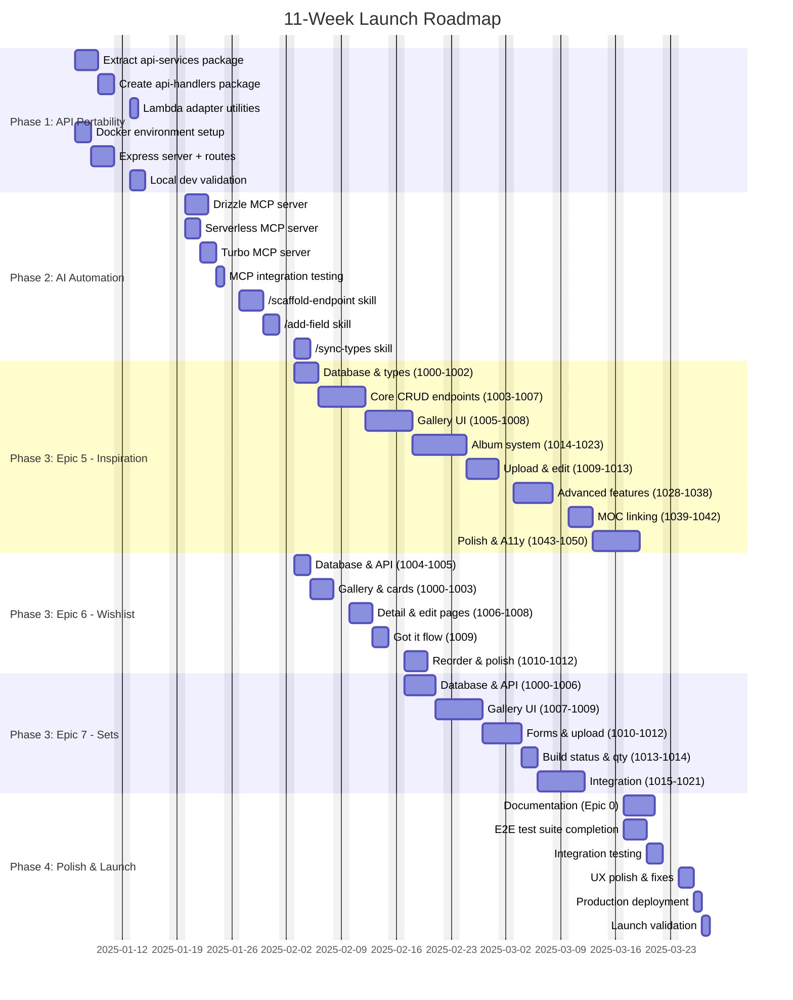
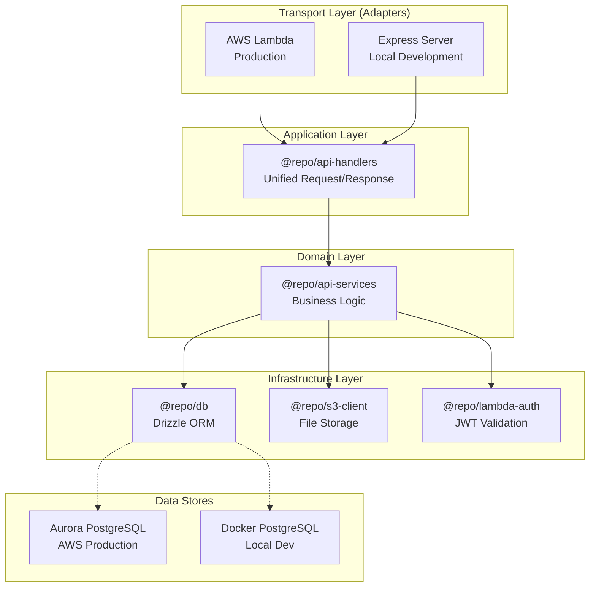
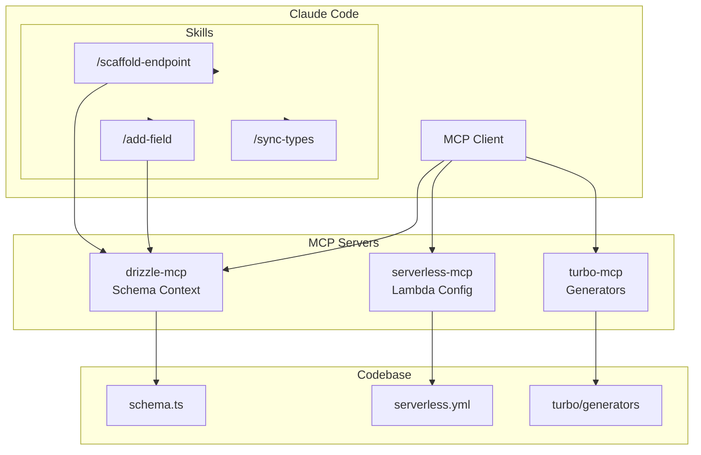
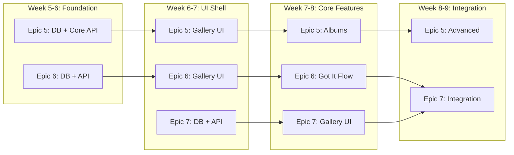
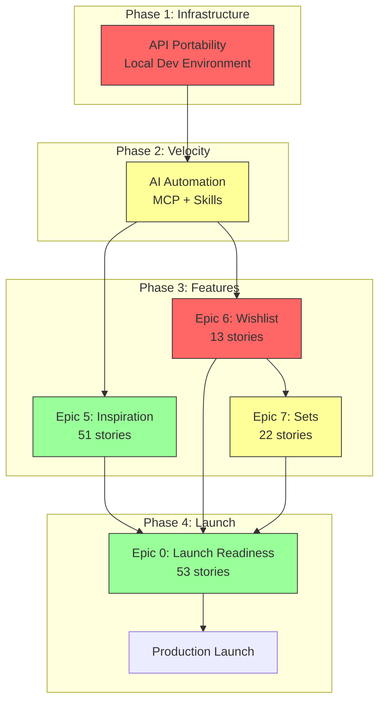
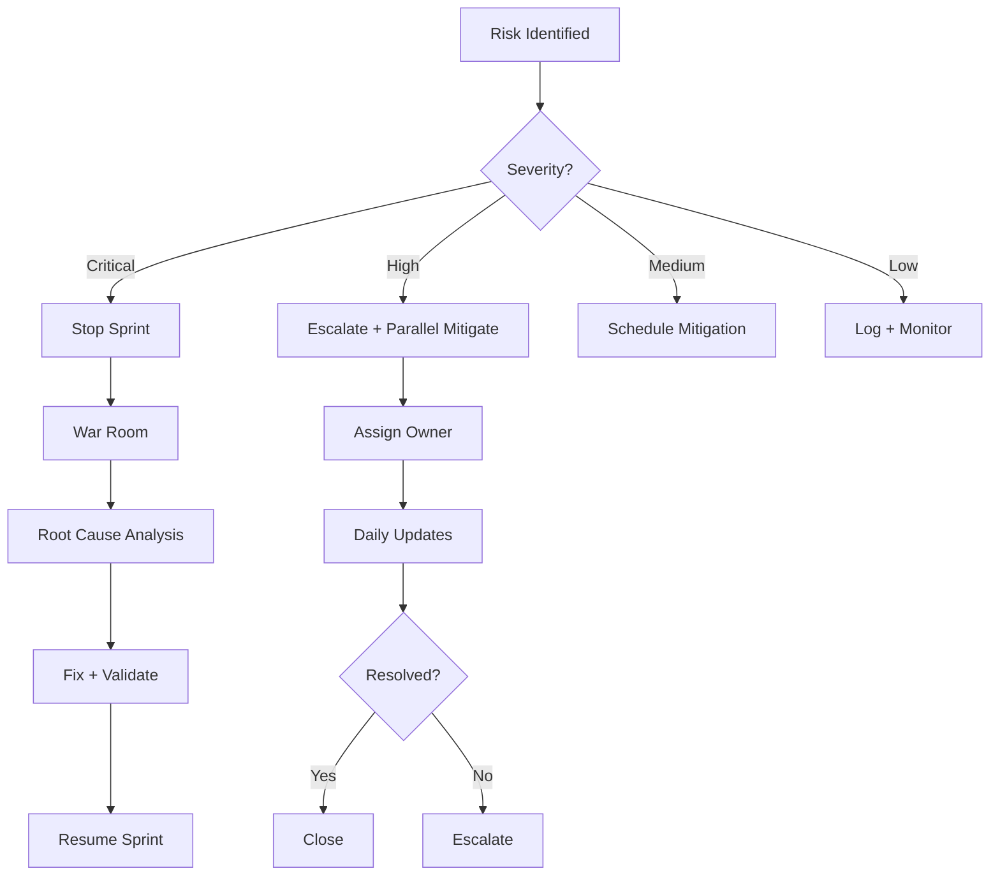
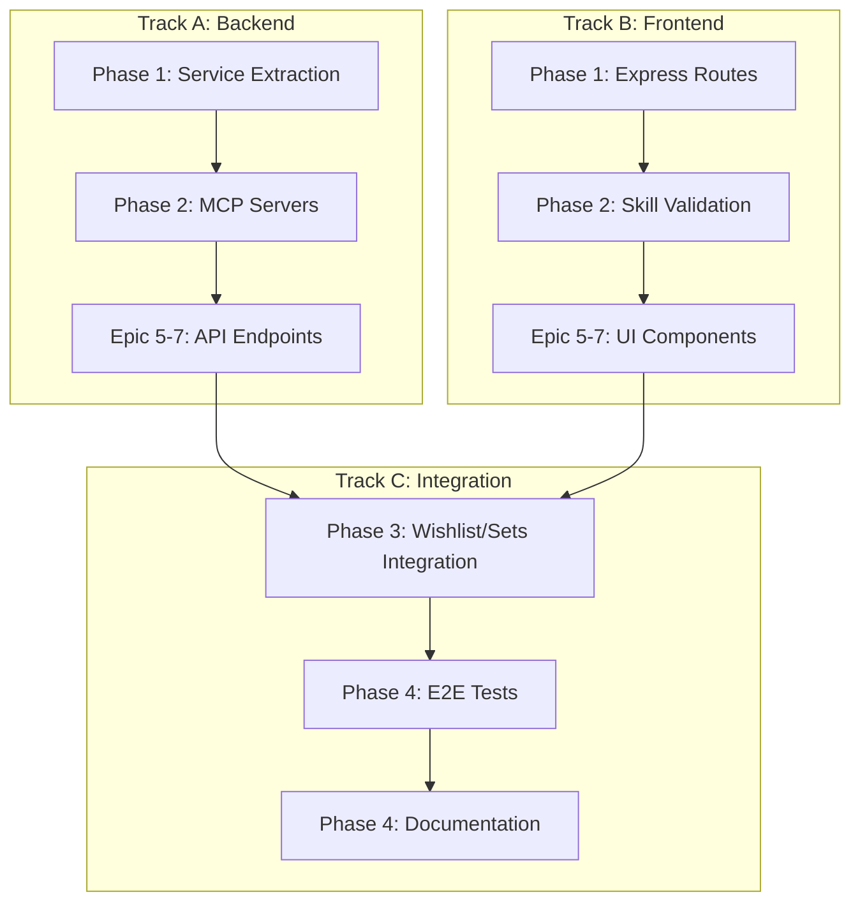
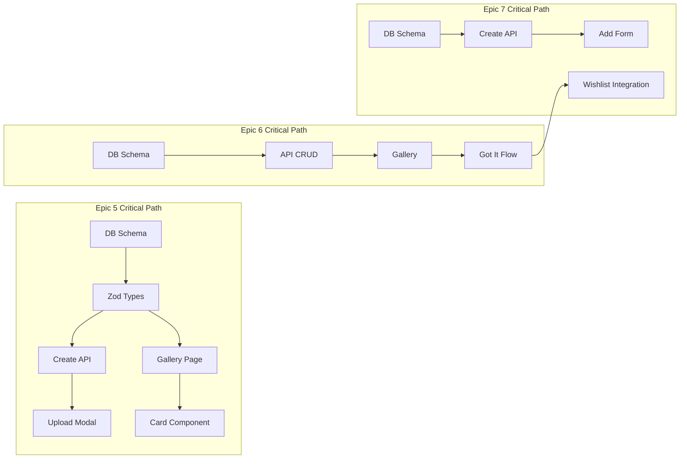

# Unified Launch Roadmap

## Document Info

| Field       | Value                                    |
| ----------- | ---------------------------------------- |
| **Project** | LEGO MOC Instructions Platform           |
| **Type**    | Strategic Roadmap                        |
| **Version** | 1.0                                      |
| **Created** | 2025-12-27                               |
| **Author**  | Platform Engineering                     |
| **Status**  | Active                                   |

---

## 1. Executive Summary

### The 11-Week Path to Launch

This roadmap consolidates four major initiatives into a unified 11-week sprint to production launch:

| Phase | Duration | Focus | Key Deliverable |
|-------|----------|-------|-----------------|
| **Phase 1** | Weeks 1-2 | API Portability | Local development environment, hexagonal architecture |
| **Phase 2** | Weeks 3-4 | AI Automation Foundation | MCP servers, scaffold skills, 10x development velocity |
| **Phase 3** | Weeks 5-9 | Accelerated Story Implementation | 3 epics (107 stories) with AI-assisted development |
| **Phase 4** | Weeks 10-11 | Polish & Launch | Integration testing, UX polish, production deployment |

### Story Count by Epic

| Epic | Total Stories | New | Existing | Complexity |
|------|--------------|-----|----------|------------|
| **Epic 5: Inspiration Gallery** | 51 | 51 | 0 | High (nested albums, DAG) |
| **Epic 6: Wishlist** | 13 | 13 | 0 | Medium (scraping, Got it flow) |
| **Epic 7: Sets Gallery** | 22 | 22 | 0 | Medium (Wishlist integration) |
| **Epic 0: Launch Readiness** | 53 | 53 | 0 | Low (documentation) |
| **Total** | **139** | **139** | **0** | - |

### Why This Order Matters

1. **API Portability First** - Enables fast local iteration (2 min vs 5+ min deploys)
2. **AI Automation Second** - Multiplies development velocity before the big push
3. **Accelerated Implementation** - 107 feature stories in 5 weeks (21+/week average)
4. **Polish Last** - Quality gates and integration testing with complete features

### Success Definition

**Launch Criteria:**
- All 3 feature epics complete and integrated
- E2E test suites passing
- Production deployment validated
- Operational runbooks in place
- Cost: $0 local dev + AWS production maintained

---

## 2. Critical Path Visualization



---

## 3. Phase Breakdown

### Phase 1: API Portability (Weeks 1-2)

**Goal:** Enable local API development while preserving AWS Lambda deployment.

#### Architecture



#### Stories

| ID | Story | Effort | Dependencies |
|----|-------|--------|--------------|
| P1.1 | Create `@repo/api-services` package scaffold | 2h | - |
| P1.2 | Extract MOC services | 4h | P1.1 |
| P1.3 | Extract Gallery services | 2h | P1.1 |
| P1.4 | Extract Wishlist services | 2h | P1.1 |
| P1.5 | Extract Parts List services | 2h | P1.1 |
| P1.6 | Create `@repo/api-handlers` with unified handlers | 8h | P1.2-5 |
| P1.7 | Create `@repo/lambda-adapter` utilities | 2h | P1.6 |
| P1.8 | Update Lambda handlers to use new packages | 4h | P1.7 |
| P1.9 | Create Docker Compose configuration | 2h | - |
| P1.10 | Create `apps/api-express` package | 2h | P1.9 |
| P1.11 | Express routes for all endpoints | 6h | P1.10 |
| P1.12 | Local development validation | 4h | P1.11 |

**Phase 1 Total: ~40 hours (1.5-2 weeks)**

#### Success Criteria

- [ ] `pnpm dev:local` starts Express + Docker PostgreSQL
- [ ] All 45 endpoints accessible via localhost:4000
- [ ] Lambda handlers continue to work unchanged
- [ ] Development workflow documented

---

### Phase 2: AI Automation Foundation (Weeks 3-4)

**Goal:** Build AI development infrastructure for 10x velocity in Phase 3.

#### Architecture



#### Stories

| ID | Story | Effort | Priority |
|----|-------|--------|----------|
| A2.1 | Drizzle MCP server | 6h | P0 |
| A2.2 | Serverless MCP server | 4h | P0 |
| A2.3 | Turbo MCP server | 4h | P1 |
| A2.4 | MCP integration testing | 2h | P0 |
| A2.5 | `/scaffold-endpoint` skill | 8h | P0 |
| A2.6 | Test fixture generation | 4h | P1 |
| A2.7 | `/add-field` skill | 6h | P0 |
| A2.8 | `/add-endpoint` skill | 4h | P1 |
| A2.9 | `/sync-types` skill | 4h | P1 |

**Phase 2 Total: ~42 hours (2 weeks)**

#### Velocity Multiplier

| Without AI Automation | With AI Automation | Improvement |
|-----------------------|-------------------|-------------|
| 2-4 hours per endpoint | 15-30 min per endpoint | **8-16x** |
| Manual cross-file updates | Atomic multi-file changes | **Consistency** |
| Manual test fixtures | Generated from schemas | **100% coverage** |

---

### Phase 3: Accelerated Story Implementation (Weeks 5-9)

**Goal:** Complete 86 feature stories across 3 epics using AI-assisted development.

#### Parallel Execution Strategy



#### Epic 5: Inspiration Gallery (51 Stories)

**Core Path (Must Have):**

| Story Group | Stories | Description | Effort |
|-------------|---------|-------------|--------|
| Foundation | 1000-1002 | Database, Zod schemas, S3 presign | 3 days |
| Core CRUD | 1003-1007 | Create, list, get endpoints | 4 days |
| Gallery UI | 1005-1008 | Page, card, detail view | 4 days |
| Album System | 1014-1023 | Album CRUD + membership | 5 days |
| Upload/Edit | 1009-1013 | Modals, delete flows | 4 days |

**Advanced Features (Should Have):**

| Story Group | Stories | Description | Effort |
|-------------|---------|-------------|--------|
| Nested Albums | 1028-1029 | Hierarchy, breadcrumbs | 2 days |
| Multi-Upload | 1030-1032 | Batch upload, progress | 3 days |
| Reorder | 1033-1034 | Drag-drop, keyboard | 3 days |
| Stack Gesture | 1035-1036 | Stack-to-album, undo | 2 days |
| Multi-Select | 1037-1038 | Bulk operations | 2 days |
| MOC Linking | 1039-1042 | Link/unlink flows | 3 days |

**Polish (Nice to Have):**

| Story Group | Stories | Description | Effort |
|-------------|---------|-------------|--------|
| Empty States | 1043 | All empty scenarios | 1 day |
| Loading States | 1044 | Skeletons, spinners | 1 day |
| Error Handling | 1045 | Toast, retry flows | 1 day |
| A11y | 1046-1047 | Keyboard, screen reader | 2 days |
| Tags | 1048 | Tag management | 1 day |
| Onboarding | 1049 | Tooltips | 1 day |
| E2E Tests | 1050 | Test suite | 2 days |

**Epic 5 Total: 32 days (~6.5 weeks solo, 3.2 weeks with parallelization)**

#### Epic 6: Wishlist (13 Stories)

| Story ID | Description | Effort | Dependencies |
|----------|-------------|--------|--------------|
| wish-1004 | Database schema + Zod types | 2h | - |
| wish-1005 | Verify shared gallery compatibility | 2h | wish-1004 |
| wish-1000 | Gallery scaffolding | 4h | wish-1005 |
| wish-1001 | Card component | 4h | wish-1000 |
| wish-1002 | API endpoints (CRUD) | 6h | wish-1004 |
| wish-1003 | Add item page | 6h | wish-1002 |
| wish-1006 | Detail page | 4h | wish-1001 |
| wish-1007 | Edit page | 4h | wish-1006 |
| wish-1008 | Delete confirmation modal | 2h | wish-1006 |
| wish-1009 | Got it flow modal | 6h | wish-1006, sets-1000+ |
| wish-1010 | Drag-and-drop reorder | 4h | wish-1000 |
| wish-1011 | Empty states | 2h | wish-1000 |
| wish-1012 | Keyboard nav + accessibility | 4h | wish-1000 |

**Epic 6 Total: ~50 hours (1.5 weeks)**

#### Epic 7: Sets Gallery (22 Stories)

| Story ID | Description | Effort | Dependencies |
|----------|-------------|--------|--------------|
| sets-1000 | Database schema | 2h | - |
| sets-1001 | Zod schemas | 2h | sets-1000 |
| sets-1002 | List sets endpoint | 3h | sets-1001 |
| sets-1003 | Get set endpoint | 2h | sets-1001 |
| sets-1004 | Create set endpoint | 3h | sets-1001 |
| sets-1005 | Update set endpoint | 3h | sets-1001 |
| sets-1006 | Delete set endpoint | 2h | sets-1001 |
| sets-1007 | Gallery page | 6h | sets-1002 |
| sets-1008 | Set card component | 4h | sets-1007 |
| sets-1009 | Detail page | 6h | sets-1003 |
| sets-1010 | Add set form | 6h | sets-1004 |
| sets-1011 | Edit set form | 4h | sets-1005 |
| sets-1012 | Image upload | 4h | sets-1010 |
| sets-1013 | Build status toggle | 3h | sets-1009 |
| sets-1014 | Quantity stepper | 3h | sets-1009 |
| sets-1015 | Delete confirmation | 2h | sets-1006 |
| sets-1016 | MOC linking | 4h | sets-1009 |
| sets-1017 | Wishlist integration ("Got it" receiver) | 6h | wish-1009 |
| sets-1018 | Empty states | 2h | sets-1007 |
| sets-1019 | Accessibility | 4h | sets-1007 |
| sets-1020 | Duplicate detection | 4h | sets-1004 |
| sets-1021 | E2E tests | 6h | All above |

**Epic 7 Total: ~81 hours (2 weeks)**

---

### Phase 4: Polish & Launch (Weeks 10-11)

**Goal:** Production-ready deployment with operational documentation.

#### Epic 0: Launch Readiness (53 Stories)

| Category | Stories | Description |
|----------|---------|-------------|
| **Package Documentation** | lnch-1000 to 1008 | README files for all packages |
| **Deployment Runbooks** | lnch-1009 to 1012 | API and frontend deployment |
| **Troubleshooting** | lnch-1013 to 1023 | Lambda, DB, VPC, cache, etc. |
| **Incident Response** | lnch-1024 to 1028 | Playbook, escalation, templates |
| **Monitoring** | lnch-1029 to 1032 | Dashboards, alarms, logs |
| **Security** | lnch-1033 to 1038 | Secrets, IAM, data privacy |
| **UX Polish** | lnch-1039 to 1050 | Onboarding, error states, mobile |
| **E2E Validation** | lnch-1051 to 1052 | Happy path, UX verification |

#### Final Checklist

- [ ] All E2E tests passing
- [ ] All feature epics integrated
- [ ] Runbooks reviewed and validated
- [ ] Production environment verified
- [ ] Monitoring dashboards active
- [ ] Error tracking configured
- [ ] Launch announcement prepared

---

## 4. Dependency Graph



### Critical Dependencies Explained

| Dependency | Why It Matters |
|------------|----------------|
| **Portability -> Automation** | MCP servers need local environment to test against |
| **Automation -> Features** | Skills multiply velocity 8-16x during implementation |
| **Wishlist -> Sets** | "Got it" flow creates Sets items from Wishlist |
| **All Features -> Launch Readiness** | Documentation must cover implemented features |

---

## 5. Story Inventory

### Complete Story Listing

#### Epic 5: Inspiration Gallery (51 Stories)

| ID | Story | Type | Effort | Priority |
|----|-------|------|--------|----------|
| insp-1000 | Database schema | Backend | 4h | P0 |
| insp-1001 | Zod schemas + shared types | Backend | 3h | P0 |
| insp-1002 | S3 presign infrastructure | Backend | 4h | P0 |
| insp-1003 | Create inspiration endpoint | Backend | 3h | P0 |
| insp-1004 | List inspirations endpoint | Backend | 3h | P0 |
| insp-1005 | Gallery page scaffolding | Frontend | 6h | P0 |
| insp-1006 | Inspiration card component | Frontend | 4h | P0 |
| insp-1007 | Get inspiration endpoint | Backend | 2h | P0 |
| insp-1008 | Inspiration detail view | Frontend | 6h | P0 |
| insp-1009 | Upload modal (single image) | Frontend | 6h | P0 |
| insp-1010 | Update inspiration endpoint | Backend | 3h | P0 |
| insp-1011 | Edit inspiration modal | Frontend | 4h | P0 |
| insp-1012 | Delete inspiration endpoint | Backend | 2h | P0 |
| insp-1013 | Delete inspiration UI | Frontend | 3h | P0 |
| insp-1014 | Create album endpoint | Backend | 3h | P0 |
| insp-1015 | Create album modal | Frontend | 4h | P0 |
| insp-1016 | List albums endpoint | Backend | 3h | P0 |
| insp-1017 | Album card component | Frontend | 4h | P0 |
| insp-1018 | Get album contents endpoint | Backend | 3h | P0 |
| insp-1019 | Album view page | Frontend | 6h | P0 |
| insp-1020 | Update album endpoint | Backend | 3h | P0 |
| insp-1021 | Edit album modal | Frontend | 4h | P0 |
| insp-1022 | Delete album endpoint | Backend | 3h | P0 |
| insp-1023 | Delete album UI | Frontend | 3h | P0 |
| insp-1024 | Add to album endpoint | Backend | 3h | P0 |
| insp-1025 | Add to album UI | Frontend | 4h | P0 |
| insp-1026 | Remove from album endpoint | Backend | 2h | P0 |
| insp-1027 | Remove from album UI | Frontend | 3h | P0 |
| insp-1028 | Nested albums endpoint | Backend | 4h | P1 |
| insp-1029 | Album breadcrumb navigation | Frontend | 4h | P1 |
| insp-1030 | Multi-image upload modal | Frontend | 6h | P1 |
| insp-1031 | Create-as-album flow | Frontend | 4h | P1 |
| insp-1032 | Upload progress + partial failure | Frontend | 4h | P1 |
| insp-1033 | Drag-and-drop reorder | Frontend | 6h | P1 |
| insp-1034 | Keyboard reorder | Frontend | 3h | P1 |
| insp-1035 | Stack-to-create-album gesture | Frontend | 6h | P1 |
| insp-1036 | Stack undo toast | Frontend | 2h | P1 |
| insp-1037 | Multi-select mode | Frontend | 4h | P2 |
| insp-1038 | Bulk operations menu | Frontend | 4h | P2 |
| insp-1039 | Link inspiration to MOC endpoint | Backend | 3h | P1 |
| insp-1040 | Link album to MOC endpoint | Backend | 3h | P1 |
| insp-1041 | MOC link UI | Frontend | 4h | P1 |
| insp-1042 | Unlink MOC | Full-stack | 3h | P1 |
| insp-1043 | Empty states | Frontend | 4h | P1 |
| insp-1044 | Loading states | Frontend | 4h | P1 |
| insp-1045 | Error handling | Frontend | 4h | P1 |
| insp-1046 | Keyboard navigation | Frontend | 6h | P1 |
| insp-1047 | Screen reader support | Frontend | 4h | P1 |
| insp-1048 | Tag management integration | Full-stack | 4h | P2 |
| insp-1049 | Onboarding tooltips | Frontend | 3h | P2 |
| insp-1050 | E2E test suite | Testing | 8h | P1 |

#### Epic 6: Wishlist (13 Stories)

| ID | Story | Type | Effort | Priority |
|----|-------|------|--------|----------|
| wish-1000 | Gallery scaffolding | Frontend | 4h | P0 |
| wish-1001 | Card component | Frontend | 4h | P0 |
| wish-1002 | API endpoints (CRUD) | Backend | 6h | P0 |
| wish-1003 | Add item page | Frontend | 6h | P0 |
| wish-1004 | Database schema + Zod types | Backend | 4h | P0 |
| wish-1005 | Verify shared gallery compatibility | Frontend | 2h | P0 |
| wish-1006 | Detail page | Frontend | 4h | P0 |
| wish-1007 | Edit page | Frontend | 4h | P0 |
| wish-1008 | Delete confirmation modal | Frontend | 2h | P0 |
| wish-1009 | Got it flow modal | Full-stack | 6h | P0 |
| wish-1010 | Drag-and-drop reorder | Frontend | 4h | P1 |
| wish-1011 | Empty states | Frontend | 2h | P1 |
| wish-1012 | Keyboard nav + accessibility | Frontend | 4h | P1 |

#### Epic 7: Sets Gallery (22 Stories)

| ID | Story | Type | Effort | Priority |
|----|-------|------|--------|----------|
| sets-1000 | Database schema | Backend | 2h | P0 |
| sets-1001 | Zod schemas | Backend | 2h | P0 |
| sets-1002 | List sets endpoint | Backend | 3h | P0 |
| sets-1003 | Get set endpoint | Backend | 2h | P0 |
| sets-1004 | Create set endpoint | Backend | 3h | P0 |
| sets-1005 | Update set endpoint | Backend | 3h | P0 |
| sets-1006 | Delete set endpoint | Backend | 2h | P0 |
| sets-1007 | Gallery page | Frontend | 6h | P0 |
| sets-1008 | Set card component | Frontend | 4h | P0 |
| sets-1009 | Detail page | Frontend | 6h | P0 |
| sets-1010 | Add set form | Frontend | 6h | P0 |
| sets-1011 | Edit set form | Frontend | 4h | P0 |
| sets-1012 | Image upload | Frontend | 4h | P0 |
| sets-1013 | Build status toggle | Frontend | 3h | P0 |
| sets-1014 | Quantity stepper | Frontend | 3h | P0 |
| sets-1015 | Delete confirmation | Frontend | 2h | P0 |
| sets-1016 | MOC linking | Full-stack | 4h | P1 |
| sets-1017 | Wishlist integration | Full-stack | 6h | P0 |
| sets-1018 | Empty states | Frontend | 2h | P1 |
| sets-1019 | Accessibility | Frontend | 4h | P1 |
| sets-1020 | Duplicate detection | Full-stack | 4h | P1 |
| sets-1021 | E2E tests | Testing | 6h | P1 |

---

## 6. Success Metrics

### Phase 1 Success (API Portability)

| Metric | Target | Measurement |
|--------|--------|-------------|
| Local dev startup time | < 30 seconds | `time pnpm dev:local` |
| API restart time | < 2 seconds | Express HMR |
| Endpoint coverage | 100% (45/45) | Manual verification |
| Lambda regression | 0 failures | `pnpm test:api` |

### Phase 2 Success (AI Automation)

| Metric | Target | Measurement |
|--------|--------|-------------|
| MCP server response time | < 500ms | Performance testing |
| Endpoint scaffold time | < 30 min | Developer survey |
| Generated code lint pass | 100% | `pnpm lint` |
| Generated code type pass | 100% | `pnpm check-types` |

### Phase 3 Success (Feature Implementation)

| Metric | Target | Measurement |
|--------|--------|-------------|
| Stories completed | 86/86 | Story tracking |
| Test coverage | >= 45% | `pnpm test --coverage` |
| TypeScript errors | 0 | `pnpm check-types` |
| Lint errors | 0 | `pnpm lint` |

### Phase 4 Success (Launch)

| Metric | Target | Measurement |
|--------|--------|-------------|
| E2E tests passing | 100% | Playwright |
| Runbooks complete | 15/15 | Documentation review |
| Production health | All green | CloudWatch dashboard |
| Mobile responsive | All pages | Manual testing |

---

## 7. Risk Management

### Critical Risks

| Risk | Probability | Impact | Mitigation |
|------|-------------|--------|------------|
| **Service extraction breaks production** | Medium | High | Comprehensive testing, staged rollout, feature flags |
| **AI automation doesn't deliver 10x** | Low | High | Start Phase 3 with automation done; fallback to manual if needed |
| **Wishlist/Sets integration complexity** | Medium | Medium | Build "Got it" flow early; test transaction handling |
| **11-week timeline too aggressive** | Medium | Medium | P2 stories can be deferred to post-launch |

### Medium Risks

| Risk | Probability | Impact | Mitigation |
|------|-------------|--------|------------|
| **MCP servers have undiscovered issues** | Medium | Low | Graceful fallback to file reading |
| **Nested album DAG complexity** | Low | Medium | Thorough cycle detection testing |
| **Scraper maintenance burden** | High | Low | Modular design, error logging, manual fallback |
| **Large uploads timeout** | Low | Low | Chunked upload, progress indicators |

### Risk Response Plan



---

## 8. Team Structure

### Recommended Parallelization



### AI-Assisted Development Workflow

1. **Planning:** Human defines story scope
2. **Scaffolding:** AI generates initial code via skills
3. **Review:** Human reviews generated code
4. **Refinement:** Human adjusts, AI assists with edge cases
5. **Testing:** AI generates fixtures, human writes integration tests
6. **PR:** Human creates PR, AI assists with description

---

## 9. Decision Log

| Date | Decision | Rationale | Owner |
|------|----------|-----------|-------|
| 2025-12-27 | Use Hexagonal Architecture | Enables platform flexibility without business logic duplication | Platform Eng |
| 2025-12-27 | Keep Lambda as primary production | Maintains AWS skills for professional development | Platform Eng |
| 2025-12-27 | Express for local development | Fast iteration, mature ecosystem, similar to Vercel | Platform Eng |
| 2025-12-27 | MCP before features | Velocity multiplier must be ready before large implementation push | Platform Eng |
| 2025-12-27 | Epic 6 before Epic 7 | Sets depends on Wishlist for "Got it" flow | Product |
| 2025-12-27 | Hard delete for galleries | Simplified UX for single-user portfolio app | Product |
| 2025-12-27 | 11-week timeline | Balances aggressive delivery with quality | Leadership |

---

## 10. Appendices

### A. Quick Reference: Weekly Goals

| Week | Focus | Key Deliverables |
|------|-------|------------------|
| 1 | API Service Extraction | `@repo/api-services`, `@repo/api-handlers` |
| 2 | Local Dev Environment | Docker, Express, dev workflow |
| 3 | MCP Servers | drizzle-mcp, serverless-mcp |
| 4 | Skills + Polish | `/scaffold-endpoint`, `/add-field` |
| 5 | Epic 5 Foundation | DB, types, core CRUD |
| 6 | Epic 5+6 UI | Gallery pages, cards |
| 7 | Epic 5 Albums + Epic 6 Detail | Album system, Got it prep |
| 8 | Epic 7 + Integration | Sets gallery, Wishlist integration |
| 9 | Advanced Features | Nested albums, multi-upload, reorder |
| 10 | Documentation | Runbooks, playbooks |
| 11 | Launch | E2E tests, production deploy |

### B. Commands Cheat Sheet

```bash
# Phase 1: Development
pnpm dev:local              # Start local dev environment
docker compose up -d        # Start PostgreSQL
pnpm --filter @repo/db migrate:local

# Phase 2: AI Automation
/scaffold-endpoint "list all inspirations"
/add-field inspirations priority "sort order integer"
/sync-types --check

# Phase 3: Development
pnpm dev                    # Full dev environment
pnpm test                   # Run tests
pnpm lint                   # Lint code
pnpm check-types            # Type check

# Phase 4: Validation
pnpm test:e2e               # E2E tests
pnpm build                  # Production build
```

### C. Story Dependencies Visualization



---

## Document History

| Version | Date | Changes | Author |
|---------|------|---------|--------|
| 1.0 | 2025-12-27 | Initial unified roadmap | Platform Engineering |

---

*This document consolidates:*
- *API Portability & Local Development PRD*
- *AI-Empowered Developer Automation PRD*
- *Epic 5: Inspiration Gallery PRD*
- *Epic 6: Wishlist PRD*
- *Epic 7: Sets Gallery PRD*
