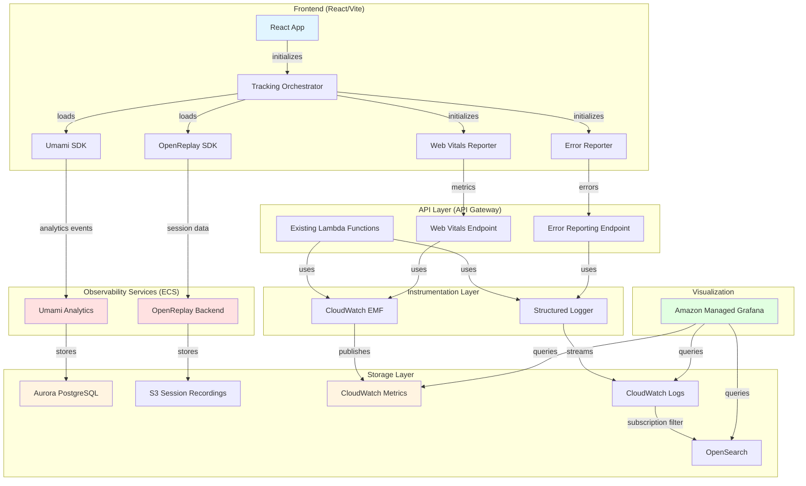

# User Tracking & Metrics Implementation - Brownfield Enhancement Architecture

## Introduction

This document outlines the architectural approach for enhancing the existing serverless web application with a comprehensive observability stack consisting of OpenReplay (session replay), Umami (privacy-focused analytics), and Amazon Managed Grafana (metrics visualization). Its primary goal is to serve as the guiding architectural blueprint for AI-driven development of new features while ensuring seamless integration with the existing system.

**Relationship to Existing Architecture:**
This document supplements existing project architecture by defining how new observability components will integrate with current systems. The enhancement is designed to be additive—instrumenting existing code with minimal invasiveness while adding new infrastructure services. Where integration is required, this document provides guidance on maintaining consistency while implementing enhancements.

### Existing Project Analysis

**Current Project State:**
- **Primary Purpose:** Serverless web application built for pre-launch deployment (LEGO-related functionality based on repository naming)
- **Current Tech Stack:**
  - Frontend: React 18+ with TypeScript, Vite build tool, S3 + CloudFront CDN
  - Backend: Node.js 20.x Lambda functions (TypeScript)
  - Database: Aurora PostgreSQL (existing instance)
  - Infrastructure: SST (Serverless Stack) for infrastructure-as-code
- **Architecture Style:** AWS serverless, event-driven with API Gateway, Lambda, Aurora
- **Deployment Method:** SST-based deployments to AWS (infrastructure and application code)

**Available Documentation:**
- Project Brief: `/Users/michaelmenard/Development/Monorepo/docs/user-metrics.md` (comprehensive stakeholder requirements)
- Brownfield PRD: `/Users/michaelmenard/Development/Monorepo/docs/prd/user-metrics-prd.md` (18 stories across 4 phases)
- SST Configuration: `apps/api/lego-api-serverless/sst.config.ts` (infrastructure definitions)
- Existing codebase at: `apps/api/lego-api-serverless/` (Lambda functions) and `apps/web/` (React frontend)

**Identified Constraints:**
- Budget-conscious environment targeting $100-150/month for observability (pre-launch, <100 users)
- Pre-launch status means no existing observability baseline or metrics
- AWS-exclusive deployment (no multi-cloud)
- Privacy-first requirements: self-hosted data collection, PII masking required
- Performance budget: <50ms overhead for tracking scripts
- Database: Existing Aurora instance must support Umami schema addition without performance degradation
- Infrastructure: VPC sizing recommended at /24 CIDR, single NAT Gateway for cost optimization

**Validation with User:**
Based on my analysis of your existing project structure and the comprehensive PRD, I understand that:
1. You have a functional serverless web app (React + Lambda + Aurora) ready for launch
2. The app currently lacks ANY observability infrastructure
3. You're using SST for all infrastructure-as-code
4. TypeScript is the standard across frontend and backend
5. Budget optimization is critical given personal project status and <100 user launch target

The architecture I'm about to propose is designed to integrate seamlessly with your SST-based serverless stack, adding observability as a parallel infrastructure layer with minimal code changes to existing Lambda and React functionality. All new infrastructure will be provisioned via SST constructs to maintain consistency with your existing deployment approach.

### Change Log

| Change | Date | Version | Description | Author |
|--------|------|---------|-------------|--------|
| Initial Architecture Creation | 2025-11-23 | 1.0 | Created brownfield architecture from PRD | Winston (Architect) |

## Enhancement Scope and Integration Strategy

### Enhancement Overview

**Enhancement Type:** New Feature Addition + Integration with New Systems + Performance/Scalability Improvements

**Scope:** Implement comprehensive observability stack consisting of:
- **OpenReplay:** Self-hosted session replay on ECS/Fargate with S3 storage
- **Umami:** Self-hosted privacy-focused analytics on ECS/Fargate with Aurora PostgreSQL
- **Amazon Managed Grafana:** AWS-managed visualization with CloudWatch, Logs Insights, and OpenSearch data sources
- **Application Instrumentation:** Lambda CloudWatch EMF metrics, structured logging, frontend Web Vitals, error reporting

**Integration Impact:** Moderate to Significant
- **Infrastructure Layer:** New ECS services, VPC networking, S3 buckets, IAM roles (significant additions)
- **Database Layer:** New Umami schema in existing Aurora instance (isolated, moderate impact)
- **Backend Code:** Instrumentation of existing Lambda functions with EMF and structured logging (moderate changes, additive)
- **Frontend Code:** Integration of tracking scripts in React app initialization (minimal changes, additive)
- **Existing Functionality:** Zero impact—all enhancements are additive and non-breaking

### Integration Approach

**Code Integration Strategy:**
The enhancement follows an **additive instrumentation pattern** that preserves all existing application logic:

**Backend (Lambda Functions):**
- Create new `src/lib/tracking/` directory for CloudWatch EMF and structured logging utilities
- Enhance existing Lambda wrapper pattern (`src/lib/utils/lambda-wrapper.ts`) to add EMF metric publishing
- Replace `console.log` with structured logger (Winston/Pino) while maintaining same log output semantics
- Integration is **wrapper-based**: existing business logic untouched, instrumentation added at handler boundaries

**Frontend (React/Vite):**
- Create new `src/lib/tracking/` directory for OpenReplay, Umami, Web Vitals, error reporting modules
- Initialize tracking in `main.tsx` before React render using asynchronous loading to prevent blocking
- Use React error boundaries to capture errors without changing existing error UX
- Integration is **initialization-based**: tracking scripts loaded early, app logic unchanged

**Database Integration:**
- **Umami Schema Isolation:** Create dedicated `umami` PostgreSQL schema in existing Aurora instance
- **Connection Pooling:** Umami manages its own connection pool with dedicated database user/credentials
- **Estimated Impact:** 100-500 MB storage for <100 users, minimal CPU/memory overhead
- **Migration Safety:** Umami handles its own schema migrations independently via its Docker container
- **Monitoring:** Add Aurora performance metrics (connections, CPU, IOPS) to Grafana dashboards to track impact

**API Integration:**
- **Existing Lambda Functions:** Enhanced with CloudWatch EMF instrumentation at handler wrapper level
- **New Lambda Functions:** Two new functions for frontend data collection:
  1. Web Vitals ingestion endpoint (receives LCP, FID, CLS, TTFB, INP from frontend)
  2. Frontend error reporting endpoint (receives error context, stack traces, session IDs)
- **API Gateway:** Enable CloudWatch logging via SST configuration (no code changes)
- **Authentication:** New endpoints use existing API Gateway authentication patterns (if applicable)

**UI Integration:**
- **No Visual Changes:** Tracking operates transparently without any UI modifications
- **Script Loading:** OpenReplay and Umami SDKs loaded asynchronously in `main.tsx` via dynamic imports
- **Environment Detection:** Different tracking behavior for dev/staging/prod (conditional initialization)
- **Vite Compatibility:** Leverage Vite's environment variable injection for tracking endpoint configuration
- **Performance:** Async script loading ensures no blocking of React render or LCP degradation

### Compatibility Requirements

**Existing API Compatibility:**
- All Lambda function business logic preserved exactly as-is
- EMF metrics published asynchronously via CloudWatch embedded format (no latency added to response path)
- Structured logging replaces `console.log` but maintains same log content and levels
- No changes to request/response schemas, authentication, or authorization logic

**Database Schema Compatibility:**
- Umami schema completely isolated in separate PostgreSQL schema namespace
- Existing application schemas untouched (no table modifications, migrations, or foreign keys)
- Database performance monitoring via CloudWatch RDS metrics in Grafana
- Rollback plan: Drop `umami` schema and revoke database user permissions

**UI/UX Consistency:**
- Zero visual changes to application UI
- Tracking scripts respect <50ms overhead budget to avoid Web Vitals degradation
- React patterns maintained: hooks, context, component structure for any tracking-related code
- TypeScript strict mode compliance for all tracking modules
- Vite HMR and development experience unaffected

**Performance Impact:**
- **Frontend:** <50ms page load overhead from OpenReplay + Umami tracking scripts combined
- **Backend:** <50ms Lambda cold start increase from EMF library initialization
- **Database:** Aurora performance baseline captured before enhancement; alerts configured if metrics degrade
- **Monitoring:** Performance regression tests added to CI pipeline to validate overhead requirements

**Integration Validation Checkpoints:**
Based on my analysis of your existing serverless architecture and the PRD requirements, this integration approach respects your current SST-based infrastructure patterns, TypeScript standards, and serverless-first design. The additive instrumentation strategy ensures existing functionality remains intact while providing comprehensive observability.

The integration boundaries are clear:
1. **Infrastructure:** New ECS services and S3 buckets are completely separate from existing Lambda/API Gateway/Aurora resources
2. **Code:** Tracking utilities isolated in dedicated `src/lib/tracking/` directories
3. **Database:** Umami schema namespace isolation prevents any interference with application data
4. **Deployment:** SST constructs extended with new infrastructure definitions (no changes to existing constructs)

Does this integration approach align with your project's architecture and constraints?

## Tech Stack

### Existing Technology Stack

| Category | Current Technology | Version | Usage in Enhancement | Notes |
|----------|-------------------|---------|---------------------|-------|
| **Frontend Language** | TypeScript | 5.x | All tracking modules | Strict mode compliance required |
| **Frontend Framework** | React | 18+ | Tracking script initialization, error boundaries | Hooks and context patterns for tracking state |
| **Frontend Build Tool** | Vite | Latest | Environment variable injection for tracking config | HMR compatibility critical for dev experience |
| **Frontend Hosting** | S3 + CloudFront | N/A | CDN caching for tracking scripts | 1-hour TTL recommended for tracking scripts |
| **Backend Language** | TypeScript | 5.x | CloudWatch EMF, structured logging utilities | Same strict mode as frontend |
| **Backend Runtime** | Node.js | 20.x | Lambda execution environment | EMF library compatible with Node 20.x |
| **Backend Framework** | AWS Lambda | N/A | Instrumentation with EMF and logging | Lambda wrapper pattern enhanced |
| **API Layer** | API Gateway | HTTP API or REST | CloudWatch logging enabled, new endpoints for Web Vitals/errors | Existing auth patterns maintained |
| **Database** | Aurora PostgreSQL | Latest (PostgreSQL 15.x compatible) | New Umami schema added | Provisioned db.t4g.micro recommended for <100 users |
| **Infrastructure-as-Code** | SST (Serverless Stack) | 2.x or 3.x | All new observability infrastructure defined via SST | Extends existing `sst.config.ts` |
| **Monitoring (Existing)** | CloudWatch | N/A | Enhanced with EMF custom metrics | Primary data source for Grafana |
| **Log Aggregation** | CloudWatch Logs + OpenSearch | N/A | Structured logs streamed to OpenSearch | Existing OpenSearch instance leveraged |

### New Technology Additions

| Technology | Version | Purpose | Rationale | Integration Method |
|------------|---------|---------|-----------|-------------------|
| **OpenReplay** | Latest stable | Self-hosted session replay | Product requirement for session troubleshooting; self-hosted for privacy | ECS/Fargate deployment via SST, S3 storage integration |
| **Umami** | v2.x | Self-hosted privacy-focused analytics | Product requirement for usage analytics; self-hosted for data ownership | ECS/Fargate deployment via SST, Aurora schema integration |
| **Amazon Managed Grafana** | Essential tier | Metrics visualization and dashboards | Managed service reduces operational overhead vs self-hosted Grafana | AWS Console or CloudFormation provisioning, CloudWatch data source |
| **CloudWatch EMF** | `aws-embedded-metrics` npm | Custom Lambda metrics | Serverless-native metric publishing without Prometheus overhead | Lambda library, integrated in wrapper utility |
| **Winston or Pino** | Latest stable | Structured JSON logging | Industry-standard Node.js loggers with CloudWatch integration | Lambda library, replaces console.log |
| **web-vitals** | v3.x | Frontend performance tracking (LCP, FID, CLS, etc.) | Google's official library for Core Web Vitals measurement | Frontend npm package, metrics sent to CloudWatch |
| **@openreplay/tracker** | Latest | OpenReplay frontend SDK | Official SDK for session recording | Frontend npm package, initialized in main.tsx |

**Justification for New Technologies:**
- **OpenReplay & Umami:** User-specified tools in project brief; no alternatives considered as requirements are fixed
- **Amazon Managed Grafana:** Replaces self-hosted Grafana to reduce operational burden and leverage AWS 99.9% SLA
- **CloudWatch EMF:** Serverless-native approach eliminates need for Prometheus infrastructure in Lambda environment
- **Structured Logging Libraries:** Industry standard for queryable logs in CloudWatch Logs and OpenSearch
- **web-vitals:** Google's official library, lightweight (<5KB), essential for UX performance tracking

## Data Models and Schema Changes

### New Data Models

This enhancement does not introduce new application data models in the existing application database. All new data models are managed by the self-hosted observability tools (OpenReplay, Umami) and are isolated from application data.

#### Umami Analytics Schema

**Purpose:** Store privacy-focused web analytics data (page views, sessions, events, traffic sources)

**Integration:** Dedicated PostgreSQL schema `umami` in existing Aurora instance, completely isolated from application schemas

**Key Attributes:**
- **Managed by Umami:** All tables, indexes, and migrations managed by Umami Docker container
- **Schema Namespace:** `umami` (separate from application schemas)
- **Storage Estimate:** 100-500 MB for <100 users, 1-year retention
- **Tables (Umami-managed):** `website`, `session`, `pageview`, `event`, `event_data`, and others per Umami schema

**Relationships:**
- **With Existing:** No foreign keys or relationships with application data (complete isolation)
- **With New:** Self-contained within `umami` schema namespace

**Access Control:**
- Dedicated database user `umami_user` with permissions scoped to `umami` schema only
- Application database users have no access to `umami` schema
- Connection string stored in AWS Secrets Manager

#### OpenReplay Session Data (S3)

**Purpose:** Store session replay recordings (user interactions, network requests, console logs, DOM snapshots)

**Integration:** Stored in dedicated S3 bucket, not in Aurora database

**Key Attributes:**
- **Storage Type:** S3 objects (compressed recordings)
- **Retention:** 30-day lifecycle policy (automatic deletion)
- **Bucket Configuration:** Server-side encryption (SSE-S3), Intelligent-Tiering storage class
- **Access Control:** ECS task role only (via IAM policy)

**Relationships:**
- **With Existing:** No integration with application data
- **With New:** Metadata stored in OpenReplay's own backend database (not Aurora)

#### CloudWatch Metrics (EMF)

**Purpose:** Custom application metrics (Lambda performance, business metrics, error counts)

**Integration:** Published to CloudWatch Metrics via Embedded Metric Format, queried by Grafana

**Key Attributes:**
- **Namespace:** `UserMetrics/Lambda`, `UserMetrics/Frontend` (custom namespaces)
- **Dimensions:** FunctionName, Environment, ErrorType, Route (for aggregation/filtering)
- **Metrics:** Duration, ColdStart, Errors, Invocations, WebVitals (LCP, FID, CLS, TTFB, INP)
- **Retention:** CloudWatch standard retention (15 months for high-resolution metrics)

**Relationships:**
- **With Existing:** Supplements existing CloudWatch metrics from Lambda, API Gateway, CloudFront
- **With New:** Primary data source for Grafana dashboards

### Schema Integration Strategy

**Database Changes Required:**

**New Tables:**
- None in existing application schemas
- All Umami tables managed within `umami` PostgreSQL schema namespace (Umami handles migrations)

**Modified Tables:**
- None—existing application tables completely untouched

**New Indexes:**
- Umami manages its own indexes within `umami` schema
- No indexes added to existing application schemas

**Migration Strategy:**
1. **Phase 1 (Story 1.2):** Create `umami` schema and `umami_user` database role
2. **Phase 2 (Story 4.1):** Umami Docker container executes schema migrations on first startup
3. **Validation:** Query Aurora performance metrics before and after Umami deployment
4. **Rollback:** Drop `umami` schema and revoke `umami_user` permissions if needed

**Backward Compatibility:**
- **Schema Isolation:** PostgreSQL schema namespacing ensures zero interaction with application data
- **Connection Pooling:** Umami uses separate connection pool (no impact on application connection limits)
- **Performance Monitoring:** CloudWatch RDS metrics (CPU, connections, IOPS, storage) added to Grafana dashboards
- **Performance Threshold:** Alert if Aurora CPU exceeds 70% or connection count exceeds 80% of max_connections
- **Rollback Safety:** Dropping `umami` schema has zero impact on application functionality

## Component Architecture

### New Components

#### CloudWatch EMF Instrumentation Layer

**Responsibility:** Publish custom application metrics from Lambda functions to CloudWatch Metrics using Embedded Metric Format

**Integration Points:**
- Wraps existing Lambda handler functions via enhanced `lambda-wrapper.ts` utility
- Publishes metrics asynchronously during Lambda execution (no response latency impact)
- Integrates with existing error handling to capture error metrics

**Key Interfaces:**
- `publishMetric(metricName: string, value: number, dimensions?: Record<string, string>): void` - Publish single metric
- `withMetrics(handler: LambdaHandler): LambdaHandler` - Wrapper function for Lambda handlers
- `recordColdStart(duration: number): void` - Record cold start event and duration

**Dependencies:**
- **Existing Components:** Lambda handler wrapper pattern in `src/lib/utils/lambda-wrapper.ts`
- **New Components:** None (standalone utility)

**Technology Stack:** TypeScript, `aws-embedded-metrics` npm package, Node.js 20.x runtime

---

#### Structured Logging Service

**Responsibility:** Provide JSON-formatted structured logging for all Lambda functions with request correlation and metadata

**Integration Points:**
- Replaces existing `console.log` statements throughout Lambda codebase
- Integrates with CloudWatch Logs for log streaming
- Provides request correlation IDs for distributed tracing

**Key Interfaces:**
- `logger.info(message: string, context?: object): void` - Info-level log
- `logger.error(message: string, error: Error, context?: object): void` - Error-level log with stack trace
- `logger.debug(message: string, context?: object): void` - Debug-level log (dev only)
- `createLogger(functionName: string): Logger` - Factory for function-specific loggers

**Dependencies:**
- **Existing Components:** Lambda execution context (for request ID, function name)
- **New Components:** None (standalone utility)

**Technology Stack:** TypeScript, Winston or Pino npm package, CloudWatch Logs

---

#### Frontend Tracking Orchestrator

**Responsibility:** Initialize and coordinate all frontend tracking tools (OpenReplay, Umami, Web Vitals, error reporting)

**Integration Points:**
- Initializes in `main.tsx` before React app render
- Loads tracking scripts asynchronously to prevent blocking
- Provides environment detection (dev/staging/prod) for conditional tracking

**Key Interfaces:**
- `initializeTracking(config: TrackingConfig): Promise<void>` - Initialize all tracking tools
- `trackPageView(url: string): void` - Manual page view tracking (if needed)
- `trackError(error: Error, context?: object): void` - Manual error tracking

**Dependencies:**
- **Existing Components:** React app initialization in `main.tsx`
- **New Components:** OpenReplay SDK, Umami SDK, Web Vitals utility, Error Reporter

**Technology Stack:** TypeScript, React 18+, Vite environment variables

---

#### Web Vitals Reporter

**Responsibility:** Capture Core Web Vitals metrics (LCP, FID, CLS, TTFB, INP) and send to CloudWatch via API endpoint

**Integration Points:**
- Uses `web-vitals` library to measure performance
- Sends metrics to CloudWatch via API Gateway Lambda endpoint
- Batches metrics to reduce API calls

**Key Interfaces:**
- `reportWebVitals(): void` - Start Web Vitals monitoring
- `sendMetric(metric: Metric): Promise<void>` - Send individual metric to backend

**Dependencies:**
- **Existing Components:** API Gateway endpoint (new Lambda function)
- **New Components:** Frontend Tracking Orchestrator (initialization)

**Technology Stack:** TypeScript, `web-vitals` npm package v3.x

---

#### Frontend Error Reporter

**Responsibility:** Capture unhandled errors and send to CloudWatch for debugging production issues

**Integration Points:**
- React error boundary for component errors
- Global window error handler for uncaught exceptions
- Promise rejection handler for async errors
- Sends error context to CloudWatch via API Gateway endpoint

**Key Interfaces:**
- `ErrorBoundary` React component - Wraps app to catch component errors
- `setupGlobalErrorHandlers(): void` - Initialize window/promise error handlers
- `reportError(error: Error, context: ErrorContext): Promise<void>` - Send error to backend

**Dependencies:**
- **Existing Components:** API Gateway endpoint (new Lambda function), existing error UX
- **New Components:** Frontend Tracking Orchestrator (initialization)

**Technology Stack:** TypeScript, React error boundary pattern

---

#### Umami Analytics Service (ECS)

**Responsibility:** Self-hosted web analytics platform for privacy-focused usage tracking

**Integration Points:**
- ECS/Fargate service in private subnet with Application Load Balancer
- Aurora PostgreSQL `umami` schema for data storage
- Frontend tracking script sends page views and events to Umami backend

**Key Interfaces:**
- **HTTP API:** `/api/send` endpoint for tracking events (accessed by frontend tracking script)
- **Web UI:** Admin dashboard for Product team to view analytics
- **Database:** Connects to Aurora via `umami` schema

**Dependencies:**
- **Existing Components:** Aurora PostgreSQL database, VPC networking
- **New Components:** S3 bucket for backups (optional), ALB for HTTPS access

**Technology Stack:** Umami Docker image (Node.js), ECS/Fargate, Aurora PostgreSQL

---

#### OpenReplay Session Replay Service (ECS)

**Responsibility:** Self-hosted session replay platform for recording and viewing user sessions

**Integration Points:**
- ECS/Fargate services (multiple containers: backend, storage, frontend) in private subnet
- S3 bucket for session recording storage
- Frontend tracking script captures session data and sends to OpenReplay backend

**Key Interfaces:**
- **Ingestion API:** `/ingest` endpoint for session data from frontend SDK
- **Web UI:** Admin dashboard for Customer Service team to view session replays
- **S3 Storage:** Session recordings persisted to S3 bucket

**Dependencies:**
- **Existing Components:** VPC networking, NAT Gateway for internet access (container images)
- **New Components:** S3 bucket for session recordings, ALB for HTTPS access

**Technology Stack:** OpenReplay Docker images (Python backend, Node.js frontend), ECS/Fargate, S3

---

#### Amazon Managed Grafana Workspace

**Responsibility:** Centralized metrics visualization and dashboards for all observability data

**Integration Points:**
- CloudWatch data source for Lambda, API Gateway, CloudFront, Aurora metrics
- CloudWatch Logs Insights data source for log queries
- OpenSearch data source for structured log analysis
- IAM-based authentication for team access

**Key Interfaces:**
- **Web UI:** Dashboard access for Product, Engineering, CS teams
- **Data Sources:** CloudWatch, CloudWatch Logs Insights, OpenSearch
- **Dashboards:** Lambda performance, API Gateway, CloudFront, System Health, Logs

**Dependencies:**
- **Existing Components:** CloudWatch, CloudWatch Logs, OpenSearch
- **New Components:** CloudWatch EMF metrics, structured logs

**Technology Stack:** Amazon Managed Grafana (Essential tier), AWS SSO or IAM auth

---

### Component Interaction Diagram



**Diagram Explanation:**

**Data Flow:**
1. **Frontend to Observability:** React app initializes tracking orchestrator, which loads OpenReplay/Umami SDKs and sets up Web Vitals/Error reporting
2. **Frontend to Backend:** Web Vitals and errors sent to new API Gateway endpoints, analytics/session data to self-hosted ECS services
3. **Backend Instrumentation:** Existing and new Lambda functions instrumented with CloudWatch EMF and structured logging
4. **Storage:** Metrics → CloudWatch Metrics, Logs → CloudWatch Logs → OpenSearch, Analytics → Aurora, Sessions → S3
5. **Visualization:** Grafana queries all data sources (CloudWatch, Logs Insights, OpenSearch) for unified dashboards

**Integration Boundaries:**
- **Existing Components (Blue):** React app, Lambda functions, Aurora database
- **New Observability Services (Red):** Umami and OpenReplay on ECS
- **Visualization (Green):** Amazon Managed Grafana
- **Storage (Yellow):** CloudWatch, S3, Aurora, OpenSearch

**Validation Checkpoint:**
This component architecture maintains clear separation between existing application logic and new observability infrastructure. The instrumentation layer (EMF, structured logging) wraps existing Lambda handlers without modifying business logic. Frontend tracking operates asynchronously without blocking app functionality. All new storage (Umami schema, S3 recordings, CloudWatch metrics) is isolated from application data.

Does this component architecture align with your existing patterns and integration requirements?

## API Design and Integration

### API Integration Strategy

**API Integration Strategy:** Two new Lambda functions exposed via API Gateway for frontend data collection. All endpoints follow existing API Gateway configuration patterns (HTTP API or REST API based on your current setup).

**Authentication:** Public endpoints (no authentication required for Web Vitals and error reporting) OR integrate with existing API Gateway authentication if preferred. Recommend CORS configuration to allow requests from CloudFront domain.

**Versioning:** No versioning needed for MVP (v1 implicit). Future versions can use path-based versioning (`/v2/metrics`) if schema changes required.

### New API Endpoints

#### POST /metrics/web-vitals

- **Method:** POST
- **Endpoint:** `/metrics/web-vitals`
- **Purpose:** Receive Core Web Vitals metrics from frontend and publish to CloudWatch using EMF
- **Integration:** New Lambda function with CloudWatch EMF instrumentation

**Request:**
```json
{
  "metrics": [
    {
      "name": "LCP",
      "value": 1250.5,
      "rating": "good",
      "url": "https://example.com/page",
      "timestamp": "2025-11-23T10:30:00.000Z"
    },
    {
      "name": "FID",
      "value": 45.2,
      "rating": "good",
      "url": "https://example.com/page",
      "timestamp": "2025-11-23T10:30:01.000Z"
    }
  ],
  "sessionId": "uuid-v4-session-id",
  "userAgent": "Mozilla/5.0..."
}
```

**Response:**
```json
{
  "success": true,
  "metricsReceived": 2
}
```

---

#### POST /errors/report

- **Method:** POST
- **Endpoint:** `/errors/report`
- **Purpose:** Receive frontend errors and log to CloudWatch with structured format for debugging
- **Integration:** New Lambda function with structured logging

**Request:**
```json
{
  "error": {
    "message": "Cannot read property 'x' of undefined",
    "stack": "Error: Cannot read property...\n  at Component.render...",
    "type": "TypeError"
  },
  "context": {
    "url": "https://example.com/page",
    "userAgent": "Mozilla/5.0...",
    "timestamp": "2025-11-23T10:30:00.000Z",
    "sessionId": "uuid-v4-session-id",
    "componentStack": "in Component (at App.tsx:42)"
  }
}
```

**Response:**
```json
{
  "success": true,
  "errorId": "unique-error-id"
}
```

## Source Tree

### Existing Project Structure

```
apps/
├── api/
│   └── lego-api-serverless/          # Lambda functions
│       ├── src/
│       │   ├── lib/
│       │   │   ├── services/         # Business logic services
│       │   │   └── utils/
│       │   │       └── lambda-wrapper.ts  # Existing Lambda handler wrapper
│       │   └── types/                # TypeScript types
│       ├── sst.config.ts             # SST infrastructure config
│       └── package.json
└── web/                              # React frontend (assumed structure)
    ├── src/
    │   ├── components/
    │   ├── main.tsx                  # App entry point
    │   └── App.tsx
    ├── vite.config.ts
    └── package.json
```

### New File Organization

```
apps/
├── api/
│   └── lego-api-serverless/
│       ├── src/
│       │   ├── lib/
│       │   │   ├── tracking/                    # New: CloudWatch tracking utilities
│       │   │   │   ├── cloudwatch-emf.ts        # EMF metric publishing
│       │   │   │   └── structured-logger.ts     # Winston/Pino logger config
│       │   │   ├── services/                    # Existing
│       │   │   └── utils/
│       │   │       ├── lambda-wrapper.ts        # Modified: add EMF instrumentation
│       │   │       └── (existing utils)
│       │   ├── functions/                       # New: Lambda function handlers
│       │   │   ├── web-vitals/
│       │   │   │   └── index.ts                 # Web Vitals ingestion handler
│       │   │   └── error-reporter/
│       │   │       └── index.ts                 # Error reporting handler
│       │   └── types/
│       │       └── tracking.ts                  # New: Tracking-related types
│       ├── sst/                                 # New: SST construct organization
│       │   └── observability/
│       │       ├── umami-service.ts             # SST construct for Umami ECS
│       │       ├── openreplay-service.ts        # SST construct for OpenReplay ECS
│       │       └── infrastructure.ts            # VPC, S3, IAM roles
│       ├── sst.config.ts                        # Modified: import observability constructs
│       └── package.json                         # Modified: add tracking dependencies
│
└── web/
    ├── src/
    │   ├── lib/
    │   │   └── tracking/                        # New: Frontend tracking modules
    │   │       ├── index.ts                     # Tracking orchestrator (initialization)
    │   │       ├── openreplay.ts                # OpenReplay SDK wrapper
    │   │       ├── umami.ts                     # Umami SDK wrapper
    │   │       ├── web-vitals.ts                # Web Vitals reporter
    │   │       ├── error-reporter.ts            # Error reporting + ErrorBoundary
    │   │       └── types.ts                     # Tracking-related types
    │   ├── components/
    │   ├── main.tsx                             # Modified: initialize tracking
    │   └── App.tsx                              # Modified: wrap with ErrorBoundary
    ├── vite.config.ts                           # Unchanged
    └── package.json                             # Modified: add tracking dependencies
```

### Integration Guidelines

**File Naming:**
- Follow existing TypeScript conventions: `kebab-case.ts` for files, `PascalCase` for React components
- Tracking modules prefixed with purpose: `cloudwatch-emf.ts`, `web-vitals.ts`
- Lambda function directories use feature names: `web-vitals/`, `error-reporter/`

**Folder Organization:**
- New tracking utilities isolated in `src/lib/tracking/` (both frontend and backend)
- SST observability constructs in dedicated `sst/observability/` directory
- Lambda handlers in `src/functions/` directory (new pattern for observability endpoints)

**Import/Export Patterns:**
- Barrel exports from `src/lib/tracking/index.ts` for clean imports: `import { initializeTracking } from '@/lib/tracking'`
- SST constructs imported in `sst.config.ts`: `import { ObservabilityStack } from './sst/observability/infrastructure'`
- Maintain existing import alias patterns (`@/` for src root if configured in tsconfig)

## Resource Tagging Schema

### Overview

A comprehensive resource tagging strategy enables granular cost tracking across all observability infrastructure and application resources. This schema supports AWS Cost Explorer filtering, budget alerts, and cost allocation reports.

### Tagging Strategy

**Tag Categories:**
1. **Organizational Tags** - Project, environment, owner identification
2. **Functional Tags** - Resource purpose and component grouping
3. **Cost Allocation Tags** - Detailed cost tracking and billing
4. **Operational Tags** - Lifecycle, backup, and maintenance metadata

### Required Tags (All Resources)

All AWS resources created for this enhancement must include these mandatory tags:

| Tag Key | Tag Value Format | Example | Purpose |
|---------|------------------|---------|---------|
| `Project` | Fixed: `UserMetrics` | `UserMetrics` | Group all observability resources |
| `Environment` | `dev`, `staging`, `prod` | `prod` | Separate costs by environment |
| `ManagedBy` | Fixed: `SST` | `SST` | Identify IaC tool |
| `CostCenter` | Fixed: `Observability` | `Observability` | Budget allocation tracking |
| `Owner` | Email or team name | `engineering@example.com` | Resource ownership |

### Functional Tags (Resource-Specific)

Additional tags for granular cost tracking by function/component:

| Tag Key | Tag Value Options | Applied To | Purpose |
|---------|------------------|------------|---------|
| `Component` | `Umami`, `OpenReplay`, `Grafana`, `CloudWatch`, `Infrastructure`, `Application` | All resources | Group resources by observability component |
| `Function` | `SessionReplay`, `Analytics`, `Metrics`, `Logging`, `Visualization`, `Storage`, `Compute`, `Networking` | All resources | Track costs by functional capability |
| `DataType` | `Metrics`, `Logs`, `Sessions`, `Analytics` | Storage resources (S3, Aurora) | Track storage costs by data type |
| `Tier` | `Free`, `Essential`, `Standard`, `Premium` | Managed services | Track service tier costs |

### Cost Tracking Dimensions

**Primary Cost Dimensions:**
- **By Component:** Track total cost per observability tool (Umami vs OpenReplay vs Grafana vs CloudWatch)
- **By Function:** Track costs by capability (session replay vs analytics vs metrics)
- **By Environment:** Separate dev/staging/prod costs
- **By Resource Type:** EC2/ECS costs vs storage vs data transfer vs managed services

**Example Cost Queries:**
```
# Total cost for OpenReplay component
Tag: Component = OpenReplay

# All session replay costs across components
Tag: Function = SessionReplay

# Production environment observability costs
Tag: Project = UserMetrics AND Environment = prod

# Umami analytics total cost
Tag: Component = Umami
```

### Resource-Specific Tagging Examples

#### VPC and Networking Resources

```typescript
// SST construct example
const vpc = new ec2.Vpc(this, 'ObservabilityVPC', {
  // ... vpc config
  tags: {
    Project: 'UserMetrics',
    Environment: stage,
    ManagedBy: 'SST',
    CostCenter: 'Observability',
    Owner: 'engineering@example.com',
    Component: 'Infrastructure',
    Function: 'Networking',
  }
});

// NAT Gateway
tags: {
  Project: 'UserMetrics',
  Environment: stage,
  Component: 'Infrastructure',
  Function: 'Networking',
  Resource: 'NATGateway',
  CostCenter: 'Observability'
}
```

#### S3 Buckets

```typescript
// Session recordings bucket
const sessionBucket = new Bucket(stack, 'SessionRecordings', {
  // ... bucket config
  cdk: {
    bucket: {
      tags: [
        { key: 'Project', value: 'UserMetrics' },
        { key: 'Environment', value: stack.stage },
        { key: 'ManagedBy', value: 'SST' },
        { key: 'CostCenter', value: 'Observability' },
        { key: 'Owner', value: 'engineering@example.com' },
        { key: 'Component', value: 'OpenReplay' },
        { key: 'Function', value: 'SessionReplay' },
        { key: 'DataType', value: 'Sessions' },
        { key: 'Resource', value: 'S3Bucket' },
      ]
    }
  }
});

// CloudWatch Logs export bucket
tags: {
  Project: 'UserMetrics',
  Component: 'CloudWatch',
  Function: 'Logging',
  DataType: 'Logs',
  Resource: 'S3Bucket'
}
```

#### ECS/Fargate Services

```typescript
// Umami ECS service
const umamiService = new Service(stack, 'UmamiService', {
  // ... service config
  cdk: {
    fargateService: {
      tags: [
        { key: 'Project', value: 'UserMetrics' },
        { key: 'Environment', value: stack.stage },
        { key: 'Component', value: 'Umami' },
        { key: 'Function', value: 'Analytics' },
        { key: 'CostCenter', value: 'Observability' },
        { key: 'Resource', value: 'ECSService' },
        { key: 'Tier', value: 'Standard' },
      ]
    }
  }
});

// OpenReplay ECS services
tags: {
  Project: 'UserMetrics',
  Component: 'OpenReplay',
  Function: 'SessionReplay',
  Resource: 'ECSService',
  CostCenter: 'Observability'
}
```

#### Lambda Functions

```typescript
// Web Vitals endpoint
const webVitalsFunction = new Function(stack, 'WebVitals', {
  // ... function config
  tags: {
    Project: 'UserMetrics',
    Environment: stack.stage,
    ManagedBy: 'SST',
    CostCenter: 'Observability',
    Component: 'CloudWatch',
    Function: 'Metrics',
    Resource: 'Lambda',
    Endpoint: 'WebVitals',
  }
});

// Error reporting endpoint
tags: {
  Project: 'UserMetrics',
  Component: 'CloudWatch',
  Function: 'Logging',
  Resource: 'Lambda',
  Endpoint: 'ErrorReporting'
}

// Existing application Lambda functions (enhanced with observability)
tags: {
  Project: 'Application',  // Keep existing project tag
  ObservabilityEnabled: 'true',  // Add flag
  InstrumentedBy: 'UserMetrics'  // Track instrumentation
}
```

#### Aurora Database

```typescript
// Existing Aurora cluster (add tags without disruption)
tags: {
  Project: 'Application',  // Existing tag
  UmamiSchema: 'true',     // New tag indicating Umami schema added
  ObservabilityEnabled: 'true'
}

// Cost allocation note: Aurora costs shared between application and Umami
// Use CloudWatch metrics to estimate Umami-specific utilization:
// - Track connection count from umami_user
// - Monitor storage growth in umami schema
```

#### IAM Roles

```typescript
// ECS task execution role
tags: {
  Project: 'UserMetrics',
  Component: 'Infrastructure',
  Function: 'Compute',
  Resource: 'IAMRole',
  Purpose: 'ECSTaskExecution'
}

// Grafana workspace role
tags: {
  Project: 'UserMetrics',
  Component: 'Grafana',
  Function: 'Visualization',
  Resource: 'IAMRole'
}

// Enhanced Lambda execution roles
tags: {
  Project: 'Application',
  ObservabilityEnabled: 'true',
  EnhancedPermissions: 'CloudWatchPutMetricData'
}
```

#### Application Load Balancers

```typescript
// Umami ALB
tags: {
  Project: 'UserMetrics',
  Component: 'Umami',
  Function: 'Analytics',
  Resource: 'ALB',
  CostCenter: 'Observability'
}

// OpenReplay ALB
tags: {
  Project: 'UserMetrics',
  Component: 'OpenReplay',
  Function: 'SessionReplay',
  Resource: 'ALB'
}
```

### AWS Cost Allocation Tag Activation

**Required Setup Steps:**

1. **Activate User-Defined Cost Allocation Tags** in AWS Billing Console:
   ```
   AWS Console → Billing → Cost Allocation Tags

   Activate these tags:
   - Project
   - Component
   - Function
   - Environment
   - CostCenter
   - DataType
   ```

2. **Wait 24 hours** for tags to appear in Cost Explorer (AWS requirement)

3. **Create Cost Explorer Views:**
   - View 1: Group by `Component` tag (Umami, OpenReplay, Grafana, CloudWatch)
   - View 2: Group by `Function` tag (SessionReplay, Analytics, Metrics, Logging)
   - View 3: Group by `Environment` tag (dev, staging, prod)
   - View 4: Filter by `Project=UserMetrics` for total observability cost

4. **Set up Budget Alerts:**
   ```
   Budget: $150/month
   Filter: Tag:Project = UserMetrics
   Alerts: 80% ($120), 100% ($150)
   ```

### Cost Tracking Implementation in SST

**Centralized Tag Configuration:**

```typescript
// sst/observability/tags.ts
export const observabilityTags = (stage: string) => ({
  base: {
    Project: 'UserMetrics',
    Environment: stage,
    ManagedBy: 'SST',
    CostCenter: 'Observability',
    Owner: 'engineering@example.com',
  }
});

export const componentTags = {
  umami: {
    Component: 'Umami',
    Function: 'Analytics',
  },
  openreplay: {
    Component: 'OpenReplay',
    Function: 'SessionReplay',
  },
  grafana: {
    Component: 'Grafana',
    Function: 'Visualization',
  },
  cloudwatch: {
    Component: 'CloudWatch',
    Function: 'Metrics',
  },
  infrastructure: {
    Component: 'Infrastructure',
    Function: 'Networking',
  },
};

// Usage in SST constructs
import { observabilityTags, componentTags } from './tags';

const tags = {
  ...observabilityTags(stack.stage),
  ...componentTags.umami,
  Resource: 'ECSService',
};
```

### Cost Reporting Dashboard (Grafana)

**CloudWatch Metrics for Cost Tracking:**

Create a Grafana dashboard pulling AWS Cost Explorer data:

```yaml
Dashboard: "Observability Cost Tracking"

Panels:
  - Title: "Total Monthly Cost by Component"
    Data Source: CloudWatch
    Query: Cost Explorer API via Lambda
    Visualization: Pie chart
    Breakdown: Component tag (Umami, OpenReplay, Grafana, CloudWatch, Infrastructure)

  - Title: "Daily Cost Trend"
    Data Source: CloudWatch
    Query: Cost Explorer daily granularity
    Visualization: Time series
    Filter: Project=UserMetrics

  - Title: "Cost by Function"
    Breakdown: Function tag (SessionReplay, Analytics, Metrics, Logging, Visualization)

  - Title: "Budget vs Actual"
    Target: $150/month
    Current: Sum of UserMetrics project costs
    Alert: Red if >$150, Yellow if >$120
```

### Tagging Validation Checklist

**Story 1.1 Acceptance Criteria Addition:**

Add to Story 1.1 (AWS Infrastructure Foundation Setup):

**Acceptance Criteria 7:** Resource tagging schema implemented:
- All new resources tagged with required tags (Project, Environment, ManagedBy, CostCenter, Owner)
- Component-specific tags applied (Component, Function, DataType where applicable)
- Cost allocation tags activated in AWS Billing Console
- Tag compliance validated via AWS Tag Editor or AWS CLI

**Validation Commands:**

```bash
# List all resources with UserMetrics project tag
aws resourcegroupstaggingapi get-resources \
  --tag-filters Key=Project,Values=UserMetrics \
  --region us-east-1

# Verify tag consistency (all resources have required tags)
aws resourcegroupstaggingapi get-resources \
  --tag-filters Key=Project,Values=UserMetrics \
  --query 'ResourceTagMappingList[?length(Tags) < `5`]' \
  --region us-east-1

# Get cost by component (after 24h tag activation)
aws ce get-cost-and-usage \
  --time-period Start=2025-11-01,End=2025-11-30 \
  --granularity MONTHLY \
  --metrics BlendedCost \
  --group-by Type=TAG,Key=Component
```

### Monthly Cost Review Process

**Automated Monthly Report:**

1. **Cost Explorer Analysis:**
   - Total UserMetrics project cost
   - Breakdown by Component (identify most expensive)
   - Breakdown by Function (identify optimization opportunities)
   - Trend analysis (month-over-month growth)

2. **Resource-Level Analysis:**
   - Top 10 most expensive resources (by Resource tag)
   - Identify underutilized resources (CloudWatch metrics + cost data)
   - Right-sizing recommendations

3. **Optimization Actions:**
   - If OpenReplay S3 costs high → verify 30-day lifecycle working
   - If ECS costs high → consider reducing task count or CPU/memory
   - If NAT Gateway costs high → review data transfer patterns
   - If Grafana costs exceeding Essential tier → evaluate usage

### Example Cost Breakdown (Projected)

Based on tagging schema, expected monthly costs for <100 users:

| Component | Function | Resources | Est. Monthly Cost |
|-----------|----------|-----------|-------------------|
| Infrastructure | Networking | VPC, NAT Gateway, Subnets | $35-45 |
| OpenReplay | SessionReplay | ECS (0.5 vCPU), S3, ALB | $25-35 |
| Umami | Analytics | ECS (0.25 vCPU), Aurora (shared), ALB | $15-25 |
| CloudWatch | Metrics + Logging | EMF metrics, Logs, Logs Insights | $10-20 |
| Grafana | Visualization | Managed Grafana Essential | $9 |
| **Total** | - | - | **$94-134** |

Tags enable tracking actual vs projected costs per component and identifying variances.

## Infrastructure and Deployment Integration

### Existing Infrastructure

**Current Deployment:**
- SST-based infrastructure-as-code managing all AWS resources
- Deployment via `sst deploy` command (presumably `sst deploy --stage prod`)
- Lambda functions, API Gateway, S3, CloudFront, Aurora defined in `sst.config.ts`

**Infrastructure Tools:**
- SST (Serverless Stack) 2.x or 3.x
- AWS CloudFormation (underlying SST deployment mechanism)
- TypeScript for SST configuration

**Environments:**
- Development (local SST dev environment)
- Production (assumed `prod` stage)
- Possibly staging environment (assumed `staging` stage)

### Enhancement Deployment Strategy

**Deployment Approach:**
Extend existing SST configuration with new observability infrastructure. Deploy in phases aligned with PRD story sequence:

**Phase 1: Infrastructure Foundation (Stories 1.1-1.4)**
1. Add VPC configuration (or identify existing VPC) in SST
2. Create S3 buckets for session recordings and CloudWatch Logs export
3. Define IAM roles for ECS tasks, enhanced Lambda permissions, Grafana access
4. Deploy AWS Budgets and cost monitoring

**Phase 2: Grafana & CloudWatch (Stories 2.1-2.4)**
1. Provision Amazon Managed Grafana workspace (AWS Console or separate CloudFormation)
2. Configure data sources (CloudWatch, Logs Insights, OpenSearch)
3. Import dashboard definitions (JSON format via Grafana API or manual)

**Phase 3: Application Instrumentation (Stories 3.1-3.5)**
1. Deploy new Lambda functions (Web Vitals, Error Reporting endpoints)
2. Deploy updated Lambda functions with EMF and structured logging
3. Deploy updated frontend with tracking scripts
4. Validate performance overhead <50ms

**Phase 4: Self-Hosted Tools (Stories 4.1-4.5)**
1. Deploy Umami ECS service via SST construct
2. Deploy OpenReplay ECS services via SST construct
3. Deploy updated frontend with Umami/OpenReplay SDKs integrated
4. Validate PII masking and end-to-end data flow

**Infrastructure Changes:**
```typescript
// sst.config.ts structure (conceptual)
import { ObservabilityStack } from './sst/observability/infrastructure';
import { UmamiService } from './sst/observability/umami-service';
import { OpenReplayService } from './sst/observability/openreplay-service';

export default {
  config() { /* existing config */ },
  stacks(app) {
    // Existing stacks
    app.stack(ExistingApplicationStack);

    // New observability stacks
    app.stack(ObservabilityStack);      // VPC, S3, IAM, Budgets
    app.stack(UmamiService);             // Umami ECS service
    app.stack(OpenReplayService);        // OpenReplay ECS services
  }
};
```

**Pipeline Integration:**
- No CI/CD pipeline changes required (same `sst deploy` command)
- Add environment variables for tracking endpoints (Umami URL, OpenReplay URL) via SST `Config` or `Secrets`
- Performance regression tests added to existing test pipeline (if CI/CD exists)

### Rollback Strategy

**Rollback Method:**
- **SST Stack Rollback:** `sst remove --stage prod` removes all observability infrastructure
- **Individual Stack Rollback:** Remove specific stacks by commenting out in `sst.config.ts` and redeploying
- **Lambda Rollback:** SST automatically versions Lambda functions; rollback via AWS Console if needed
- **Database Rollback:** Drop `umami` schema with SQL script, revoke `umami_user` permissions

**Risk Mitigation:**
- **Incremental Deployment:** Deploy infrastructure stacks first, validate, then deploy application code
- **Feature Flags:** Optional environment variable to disable tracking in production if issues arise
- **Monitoring During Deployment:** Watch CloudWatch metrics for Lambda errors, API Gateway 5xx, Aurora CPU/connections
- **Validation Gates:** Smoke tests after each phase deployment before proceeding to next phase

**Monitoring:**
- CloudWatch Alarms for ECS task health (Umami, OpenReplay) - alert if unhealthy
- CloudWatch Alarms for Lambda errors (Web Vitals, Error Reporter) - alert on error rate >5%
- AWS Budgets alerts at 80% and 100% of $150/month limit
- Grafana dashboards for self-monitoring observability infrastructure health

## Coding Standards

### Existing Standards Compliance

**Code Style:**
- TypeScript strict mode enabled across all projects
- ESLint configuration with existing rules (presumed to exist based on typical SST projects)
- Prettier for code formatting (standard for TypeScript projects)
- Functional programming patterns where appropriate (React hooks, pure functions)

**Linting Rules:**
- Follow existing ESLint configuration in `apps/api/lego-api-serverless/.eslintrc` and `apps/web/.eslintrc`
- TypeScript `strict: true` in `tsconfig.json`
- No `any` types without explicit justification and `// @ts-expect-error` comments
- Prefer `const` over `let`, avoid `var`

**Testing Patterns:**
- Vitest for unit testing (based on existing `vitest.config.ts`)
- Test files colocated with source: `component.test.ts` or `__tests__/` directory
- Mock external dependencies (AWS SDK, third-party APIs)
- Minimum 80% code coverage for new tracking utilities

**Documentation Style:**
- TSDoc comments for public functions and interfaces
- Inline comments only for complex logic that isn't self-evident
- README files for new tracking modules explaining usage and configuration

### Enhancement-Specific Standards

**CloudWatch EMF Metrics Naming:**
- Namespace format: `UserMetrics/{Category}` (e.g., `UserMetrics/Lambda`, `UserMetrics/Frontend`)
- Metric names: PascalCase (e.g., `ColdStartDuration`, `LargestContentfulPaint`)
- Dimensions: camelCase keys (e.g., `functionName`, `environment`, `errorType`)

**Structured Logging Format:**
- JSON output with consistent schema:
  ```json
  {
    "timestamp": "ISO 8601",
    "level": "INFO|WARN|ERROR|DEBUG",
    "message": "Human-readable message",
    "functionName": "lambda-function-name",
    "requestId": "AWS request ID",
    "context": { /* additional metadata */ }
  }
  ```
- No sensitive data (PII, credentials) in logs
- Error stack traces included in `error` field for ERROR level logs

**Tracking Module Organization:**
- One responsibility per file (e.g., `cloudwatch-emf.ts` only handles EMF metrics)
- Barrel exports from `index.ts` for public API
- Private implementation details not exported
- TypeScript types in dedicated `types.ts` file within tracking directory

### Critical Integration Rules

**Existing API Compatibility:**
- **Rule:** All Lambda function business logic must remain unchanged
- **Implementation:** Wrap handlers with `withMetrics()` and `withLogging()` HOCs; do not modify handler internals
- **Validation:** Existing integration tests must pass without modification

**Database Integration:**
- **Rule:** Never query or modify application schemas from Umami code
- **Implementation:** Umami database user permissions strictly scoped to `umami` schema namespace
- **Validation:** Test Umami user cannot access application tables (permission denied error expected)

**Error Handling:**
- **Rule:** Tracking instrumentation must never cause application errors
- **Implementation:** Wrap all tracking calls in try/catch with silent error handling (log error but continue)
- **Example:**
  ```typescript
  try {
    publishMetric('MyMetric', value);
  } catch (error) {
    // Log tracking error but don't throw - application must continue
    console.error('Metric publishing failed:', error);
  }
  ```

**Logging Consistency:**
- **Rule:** Structured logging must maintain same log content as previous `console.log` statements
- **Implementation:** Migrate `console.log(msg)` to `logger.info(msg)` with equivalent output
- **Validation:** Compare CloudWatch Logs output before/after migration to ensure no information loss

## Testing Strategy

### Integration with Existing Tests

**Existing Test Framework:**
- Vitest for unit and integration testing (based on `vitest.config.ts` in project)
- Test files use `.test.ts` or `.spec.ts` extension
- Configuration in `apps/api/lego-api-serverless/vitest.config.ts`

**Test Organization:**
- Unit tests colocated: `src/lib/tracking/__tests__/cloudwatch-emf.test.ts`
- Integration tests in dedicated directory: `src/__tests__/integration/`
- E2E tests (optional) in separate directory: `tests/e2e/`

**Coverage Requirements:**
- Maintain existing coverage thresholds (if defined in vitest.config)
- New tracking utilities: minimum 80% code coverage
- Critical paths (EMF publishing, structured logging) require 90%+ coverage

### New Testing Requirements

#### Unit Tests for New Components

**Framework:** Vitest (existing)

**Location:**
- Backend tracking: `apps/api/lego-api-serverless/src/lib/tracking/__tests__/`
- Frontend tracking: `apps/web/src/lib/tracking/__tests__/`
- Lambda handlers: `apps/api/lego-api-serverless/src/functions/web-vitals/__tests__/`

**Coverage Target:** 80% minimum for tracking modules

**Integration with Existing:**
- Use existing Vitest configuration
- Mock AWS SDK calls (`aws-embedded-metrics`, CloudWatch Logs)
- Mock OpenReplay and Umami SDKs in frontend tests

**Example Test Structure:**
```typescript
// cloudwatch-emf.test.ts
import { describe, it, expect, vi } from 'vitest';
import { publishMetric } from '../cloudwatch-emf';

describe('CloudWatch EMF', () => {
  it('should publish metric without throwing', () => {
    expect(() => publishMetric('TestMetric', 100)).not.toThrow();
  });

  it('should handle errors gracefully', () => {
    // Test error handling doesn't crash application
  });
});
```

#### Integration Tests

**Scope:**
- End-to-end data flow: Frontend → API Gateway → Lambda → CloudWatch
- Database integration: Umami schema isolation verification
- ECS service health checks: Umami and OpenReplay containers running

**Existing System Verification:**
- **Regression Suite:** Run existing application integration tests to ensure no breakage
- **Performance Tests:** Validate <50ms overhead for Lambda cold starts and frontend page load
- **Database Tests:** Verify Aurora performance metrics (CPU, connections) remain within acceptable range

**New Feature Testing:**
- Web Vitals endpoint receives and processes metrics correctly
- Error reporting endpoint logs errors to CloudWatch
- OpenReplay session recordings appear in S3
- Umami analytics data appears in Aurora `umami` schema
- Grafana dashboards display metrics from CloudWatch

#### Regression Testing

**Existing Feature Verification:**
- **Automated Regression Suite:** All existing application tests must pass with tracking enabled
- **Manual Smoke Tests:** Critical user flows (signup, login, core features) function identically
- **Performance Regression:** Lighthouse CI or WebPageTest to validate no performance degradation

**Automated Regression:**
- Run existing test suite as part of deployment validation
- Add performance regression tests to CI pipeline (if CI exists)
- CloudWatch Synthetics (optional) for production smoke tests

**Manual Testing Requirements:**
- Test PII masking in OpenReplay (verify sensitive fields are masked)
- Verify Grafana dashboards display data correctly
- Confirm Umami and OpenReplay UIs accessible and functional

## Security Integration

### Existing Security Measures

**Authentication:**
- API Gateway authentication (assumed IAM, Cognito, or custom authorizer)
- Frontend authentication (assumed token-based or session-based)
- Admin access to AWS resources via IAM roles

**Authorization:**
- Lambda execution roles with least-privilege permissions
- Database access via IAM database authentication or username/password (stored in Secrets Manager)

**Data Protection:**
- Aurora encryption at rest (standard for Aurora)
- CloudFront HTTPS for frontend distribution
- API Gateway HTTPS endpoints

**Security Tools:**
- AWS IAM for access control
- AWS Secrets Manager for credentials (assumed)
- VPC security groups for network isolation

### Enhancement Security Requirements

**New Security Measures:**

**PII Masking in OpenReplay:**
- CSS selectors to mask sensitive form fields: `input[type="password"]`, `.email-field`, `.ssn-field`
- Configuration file: `openreplay-sanitization-rules.json` (versioned in source control)
- Regular expression patterns for PII detection (email, phone, SSN patterns)
- **Validation:** Automated tests with fake PII data to verify masking

**Umami Database User Permissions:**
- Create database user `umami_user` with permissions scoped to `umami` schema ONLY
- SQL: `GRANT ALL ON SCHEMA umami TO umami_user; REVOKE ALL ON SCHEMA public FROM umami_user;`
- Connection string stored in AWS Secrets Manager with automatic rotation

**ECS Task IAM Roles:**
- Umami task role: Read/write to Aurora `umami` schema only
- OpenReplay task role: Read/write to S3 session replay bucket only (no access to application S3 buckets)
- Principle of least privilege: No wildcard permissions (`*`)

**API Endpoint Security:**
- Web Vitals and Error Reporting endpoints: CORS restricted to CloudFront domain
- Optional rate limiting via API Gateway throttling (e.g., 1000 requests/minute per IP)
- Input validation: Reject payloads >100KB to prevent abuse

**Secrets Management:**
- All credentials stored in AWS Secrets Manager (Umami DB connection, Grafana API keys, OpenReplay admin passwords)
- No hardcoded credentials in code or SST configuration
- Secrets referenced via SST `Config.Secret()` or `aws-sdk` Secrets Manager client

**Integration Points:**
- Tracking endpoints inherit existing API Gateway authentication if required
- Grafana workspace uses AWS SSO or IAM authentication (no separate user database)

### Security Testing

**Existing Security Tests:**
- IAM policy validation (manual review)
- Dependency vulnerability scanning (npm audit, Snyk if configured)

**New Security Test Requirements:**

**PII Masking Validation:**
- Automated test suite with fake PII data in form fields
- Verify OpenReplay recordings show masked values (e.g., `***@***.com` for emails)
- Manual review of 10+ test sessions before production deployment

**Database Permission Testing:**
- Test that `umami_user` cannot query application schemas (expect permission denied error)
- Test that application database users cannot query `umami` schema (expect permission denied)

**Penetration Testing:**
- Not required for MVP given self-hosted internal tools
- Optional: Test for common vulnerabilities (SQL injection in Umami/OpenReplay, XSS in tracking scripts)
- Recommended for post-MVP if scaling beyond 100 users

**Security Checklist:**
- [ ] PII masking rules configured and tested
- [ ] Database user permissions validated (umami_user scoped correctly)
- [ ] ECS task IAM roles follow least-privilege principle
- [ ] All secrets stored in AWS Secrets Manager (no hardcoded credentials)
- [ ] CORS configured on tracking endpoints
- [ ] HTTPS enforced on all services (ALBs, Grafana, API Gateway)

## Next Steps

### Story Manager Handoff

The brownfield architecture document is now complete and ready for implementation. This architecture defines a comprehensive observability stack that integrates seamlessly with your existing SST-based serverless application.

**Reference Documents:**
- **This Architecture Document:** `docs/architecture/user-metrics-architecture.md`
- **Brownfield PRD:** `docs/prd/user-metrics-prd.md` (18 stories across 4 phases)
- **Project Brief:** `docs/user-metrics.md` (stakeholder requirements)

**Key Integration Requirements Validated:**
Based on analysis of your existing project:
1. SST infrastructure-as-code patterns maintained
2. TypeScript strict mode compliance across all new code
3. Existing Lambda wrapper pattern enhanced (not replaced)
4. React app initialization extended with async tracking setup
5. Aurora schema isolation ensures zero risk to application data
6. All new infrastructure deployed via SST constructs for consistency

**Existing System Constraints:**
- Budget: $100-150/month for <100 users (infrastructure sized accordingly)
- Performance: <50ms overhead requirement for all tracking instrumentation
- Privacy: PII masking required in OpenReplay, self-hosted data collection
- Database: Umami schema must coexist with application schemas in Aurora
- Deployment: All infrastructure changes via SST (no manual AWS Console changes except Grafana)

**First Story to Implement:**
**Story 1.1: AWS Infrastructure Foundation Setup** (docs/prd/user-metrics-prd.md:427)

This story establishes VPC networking, IAM roles, security groups, and S3 buckets that all subsequent stories depend on. The architecture defines specific integration checkpoints:

**Integration Verification for Story 1.1:**
- Existing VPC resources (if any) remain unaffected and accessible
- Application Lambda functions can still access existing Aurora database
- No disruption to current application deployment pipeline

**Clear Sequencing for Implementation:**
Follow the 4-phase story sequence in the PRD:
1. **Phase 1 (Stories 1.1-1.4):** Infrastructure foundation - can be implemented independently
2. **Phase 2 (Stories 2.1-2.4):** Grafana and CloudWatch integration - depends on Phase 1 IAM roles
3. **Phase 3 (Stories 3.1-3.5):** Application instrumentation - can overlap with Phase 2
4. **Phase 4 (Stories 4.1-4.5):** Self-hosted tools deployment - depends on Phase 1 infrastructure

The architecture maintains system integrity through:
- Isolated observability infrastructure (ECS, S3) separate from application resources
- Wrapper-based instrumentation (no business logic modifications)
- Schema namespace isolation for database integration
- Async tracking initialization to prevent frontend blocking

### Developer Handoff

**Reference Documents:**
- **Architecture Document:** This document defines all technical decisions and integration patterns
- **Coding Standards:** Section above (docs/architecture/user-metrics-architecture.md:821)
- **Source Tree:** File organization defined above (docs/architecture/user-metrics-architecture.md:639)

**Key Technical Decisions:**
1. **CloudWatch EMF vs Prometheus:** Use EMF for serverless-native metrics (no infrastructure overhead)
2. **Amazon Managed Grafana vs Self-Hosted:** Use managed service to reduce operational burden (99.9% SLA)
3. **Aurora Provisioned vs Serverless:** Recommend db.t4g.micro for cost optimization with <100 users
4. **Single NAT Gateway:** Cost optimization for pre-launch (<100 users); upgrade to multi-AZ if scaling
5. **Structured Logging Library:** Winston or Pino (choose based on team preference; both well-supported)

**Existing System Compatibility Requirements:**
- **Lambda Wrapper Pattern:** Enhance `src/lib/utils/lambda-wrapper.ts` with EMF/logging without changing signature
- **React Initialization:** Add tracking to `main.tsx` before `ReactDOM.render()` using async initialization
- **TypeScript Strict Mode:** All new code must compile with `strict: true` in tsconfig
- **SST Constructs:** New observability stacks in `sst/observability/` directory, imported in `sst.config.ts`

**Verification Steps:**
Each story includes Integration Verification (IV) criteria that must be validated before marking complete:
- IV1: Existing functionality unaffected
- IV2: Integration points validated (database access, API calls, etc.)
- IV3: Performance metrics within acceptable range (no degradation)

**Implementation Start Point:**
Begin with Story 1.1: AWS Infrastructure Foundation Setup. The architecture provides specific component definitions:
- **VPC Configuration:** /24 CIDR, 2 AZs, 2 public subnets (/27), 2 private subnets (/26), single NAT Gateway
- **IAM Roles:** ECS task execution role, Grafana workspace role, enhanced Lambda permissions for CloudWatch PutMetricData
- **S3 Buckets:** Session recordings bucket with 30-day lifecycle, optional CloudWatch Logs export bucket

Reference the Component Architecture section (docs/architecture/user-metrics-architecture.md:274) for detailed component interfaces and integration points.
