# Unified Development Workflow
## Technical Presentation for Engineering Leadership

**Date:** February 2026
**Audience:** Technical Dev Management
**Purpose:** Demonstrate the architecture, guardrails, and value of our AI-driven development workflow

---

## Table of Contents

1. [Executive Summary](#1-executive-summary)
2. [The Problem We're Solving](#2-the-problem-were-solving)
3. [Solution at a Glance](#3-solution-at-a-glance)
4. [Architecture & Design Patterns](#4-architecture--design-patterns)
5. [The Complete Story Lifecycle](#5-the-complete-story-lifecycle)
6. [Multi-Agent Orchestration Deep Dive](#6-multi-agent-orchestration-deep-dive)
7. [Agent Guardrails & Safety Model](#7-agent-guardrails--safety-model)
8. [Expert Intelligence Framework](#8-expert-intelligence-framework)
9. [Knowledge Base & Institutional Memory](#9-knowledge-base--institutional-memory)
10. [Metrics, Observability & Auditability](#10-metrics-observability--auditability)
11. [Developer Experience & Onboarding](#11-developer-experience--onboarding)
12. [The Workflow Intelligence Program](#12-the-workflow-intelligence-program)
13. [Implementation & Rollout Strategy](#13-implementation--rollout-strategy)
14. [Key Takeaways](#14-key-takeaways)
15. [What's Next: The 6-Epic Roadmap](#15-whats-next-the-6-epic-roadmap)

---

## 1. Executive Summary

AI coding agents are extraordinarily productive -- and extraordinarily good at creating the illusion of progress. They'll tell you a feature is "fully implemented" when critical paths are stubbed out. They'll report "all tests passing" when the tests mock the very code they're supposed to verify. They'll generate a confident summary of work that, upon inspection, doesn't actually work.

This workflow exists to solve that problem. It's an automation system built on a simple premise: **if an AI agent says something is done, there must be independently verifiable evidence that it's actually done.** Every phase produces artifacts. Every gate checks those artifacts. No agent's self-assessment is trusted -- only objective proof advances a story forward.

The result is a system that captures AI's productivity benefits -- parallel specialist agents, automated code review, institutional memory -- while eliminating AI's most dangerous failure mode: false confidence.

**Key numbers:**
- **8 phases** from idea to merged code, each with hard gates
- **~45 specialized AI agents** with defined roles and boundaries
- **4 verification checkpoints** where objective evidence is required to proceed
- **6 parallel code review specialists** on every story
- **5-tier decision classification** with ironclad rules on what agents can and cannot decide
- **0 self-assessed gates** -- no agent can mark its own work as complete

**Design patterns in use:**
- Fan-Out / Fan-In Orchestration (parallel specialist agents with unified aggregation)
- Research-First Context Building (KB queries + artifact reads before every phase)
- Confidence-Driven Elaboration (8-point audit, confidence-scored findings, gap analysis that generates future opportunities)
- Evidence Bundle Pattern (cross-phase artifact sharing -- proof, not promises)
- MCP Server / Sidecar Pattern (Knowledge Base, Context7)
- Circuit Breaker Pattern (error escalation)
- Expert Persona Pattern (domain-specialized agent intelligence)

---

## 2. The Problem We're Solving

### The AI Productivity Trap

Before this workflow, we went through multiple iterations of AI-assisted development. The agents were fast. They were confident. And they were routinely wrong in ways that were invisible until something broke in production.

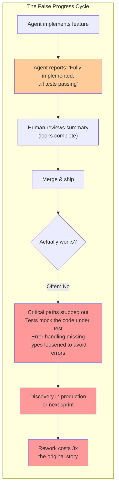

**Real failure modes we encountered:**

| What the Agent Said | What Was Actually True |
|---------------------|----------------------|
| "All tests passing" | Tests mocked the code they were supposed to test -- asserting that mocks return what mocks were told to return |
| "Feature fully implemented" | Happy path worked; every error path threw unhandled exceptions |
| "Type-safe implementation" | Agent used `as any` casts and loosened types to eliminate compiler errors rather than fixing the underlying issues |
| "Comprehensive test coverage" | 90% coverage, but tests only exercised the trivial branches. Complex logic paths had 0% coverage. |
| "Refactored to match codebase patterns" | Agent invented new patterns that looked plausible but didn't match the actual codebase conventions |

The core problem isn't that AI agents make mistakes -- humans do too. The problem is that **AI agents make mistakes with high confidence and no self-doubt.** A human developer who cuts a corner knows they cut a corner. An AI agent that mocks the code under test genuinely believes it wrote a thorough test suite. The confident summary it generates isn't a lie -- it's a hallucination that reads exactly like the truth.

**This means you cannot use AI agent self-reporting as evidence of completion.** You need independent verification at every stage, and you need it built into the architecture so it can't be skipped.

### The Traditional Team Problems (Still Real)

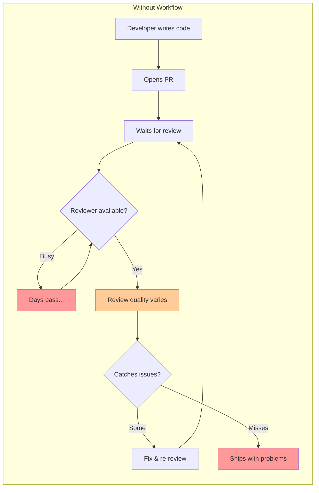

| Problem | Impact |
|---------|--------|
| Standards live in people's heads | New devs don't know them, seniors enforce them inconsistently |
| Code review is a bottleneck | Senior devs spend 30-40% of time reviewing, PRs wait days |
| Same mistakes repeat across stories | No institutional memory, lessons learned get lost |
| Quality is unmeasurable | "I think things are getting better" -- no data to prove it |
| Onboarding is slow and expensive | Weeks of pairing, tribal knowledge transfer |
| No audit trail | Can't trace why a decision was made 3 months ago |

### The Combined Challenge

We needed a system that captures AI's genuine productivity advantages -- speed, parallelism, tirelessness, pattern recognition -- while eliminating its most dangerous property: the ability to produce work that *looks* done but *isn't* done. And we needed that same system to solve the traditional team bottlenecks around code review, onboarding, and institutional knowledge.

The answer: **hard gates with objective evidence at every phase transition.** No story advances because an agent says it's ready. It advances because independently verifiable artifacts prove it's ready.

---

## 3. Solution at a Glance

### With This Workflow

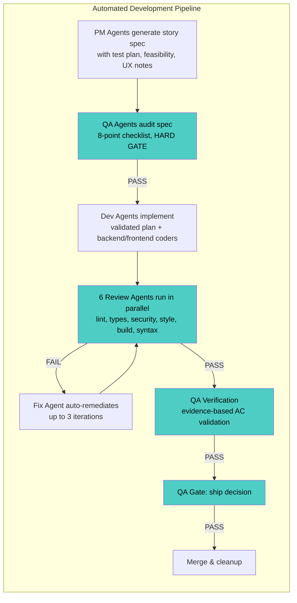

**Every story. Every developer. Every time. And every claim is verified.**

The quality floor is the same regardless of who wrote the code, how busy the team is, or whether it's a Tuesday or a Friday afternoon. More importantly: every gate in this pipeline checks **objective artifacts** (build output, test results, lint results, type-check output), not agent self-assessments. An agent cannot mark its own work as complete. A different agent -- or a deterministic tool -- must independently confirm it.

---

## 4. Architecture & Design Patterns

### 4.1 Multi-Agent Orchestration Pattern

We do NOT use a single monolithic AI agent. Instead, we decompose work into specialized agents with bounded responsibilities.

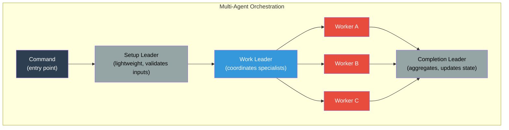

**Why this matters:**

| Benefit | Explanation |
|---------|-------------|
| **Bounded context** | Each agent has a single job. The security agent only thinks about security. It can't be distracted by formatting concerns. |
| **Parallel execution** | Independent workers run simultaneously, reducing wall-clock time |
| **Fault isolation** | If one worker fails, others still produce results. Circuit breaker prevents cascading failure. |
| **Model optimization** | Simple tasks use lightweight models (Haiku). Complex analysis uses capable models (Sonnet). Costs stay controlled. |
| **Testable** | Each agent can be unit-tested in isolation with fixture data |

### 4.2 Phase Leader Pattern

Every command follows the same three-phase structure:

```
Phase 0: Setup Leader (Haiku - lightweight)
    - Validate inputs and preconditions
    - Create context for downstream agents
    - Fast-fail if prerequisites aren't met

Phase 1: Work Leader (Sonnet - capable)
    - Spawn parallel workers
    - Coordinate analysis or implementation
    - Aggregate intermediate results

Phase 2: Completion Leader (Haiku - lightweight)
    - Finalize artifacts
    - Update story status
    - Log metrics and tokens
```

This pattern appears in every command: bootstrap, story generation, elaboration, implementation, code review, QA verification -- all follow the same structure. Consistency in the system itself enables consistency in its output.

### 4.3 MCP Server & Sidecar Pattern

The workflow uses the Model Context Protocol (MCP) to connect agents to external capabilities without embedding that logic in the agents themselves.

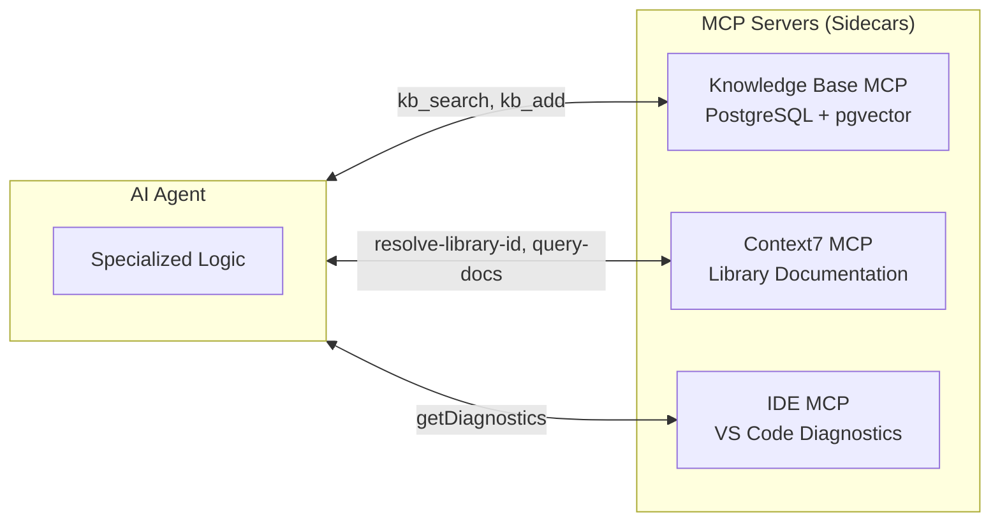

**What MCP provides:**

| MCP Server | What It Does | Why It Matters |
|------------|-------------|----------------|
| **Knowledge Base** | Semantic search over institutional knowledge (lessons, decisions, patterns) | Agents learn from past stories without re-reading every file |
| **Context7** | Up-to-date library documentation (Zod, React, Tailwind, etc.) | Agents use current API docs, not stale training data |
| **IDE Integration** | Real-time TypeScript diagnostics from VS Code | Agents see the same errors the developer sees |

**The sidecar pattern means:**
- Agents stay focused on their domain logic
- External capabilities are swappable (replace PostgreSQL KB with a different backend without changing agents)
- Each MCP server can be versioned, tested, and scaled independently
- New capabilities (e.g., a Jira MCP server) plug in without modifying existing agents

### 4.4 Fan-Out / Fan-In Pattern

The system's most powerful orchestration technique: a leader spawns multiple specialist agents in parallel, waits for all to complete, then aggregates their independent results into a unified output.

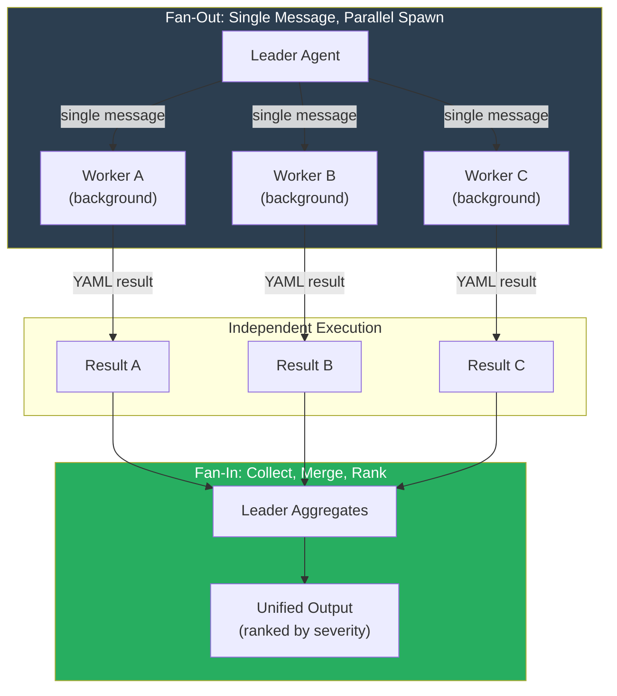

**Critical rule:** All parallel workers are spawned in a **single message**. This isn't just a performance optimization -- it's how Claude's tool-calling works. One message with multiple Task calls = true parallelism.

**Where it appears:**

| Workflow | Workers Spawned | What Gets Aggregated |
|----------|----------------|---------------------|
| Story Generation | test-plan, feasibility, UI/UX, risk predictor | Complete story specification |
| Epic Elaboration | 6 stakeholder perspectives (eng, product, QA, UX, platform, security) | EPIC-REVIEW.yaml |
| Code Review | 6 specialist reviewers (lint, style, syntax, security, types, build) | REVIEW.yaml with ranked patches |
| Verification | verifier + Playwright E2E runner | VERIFICATION-SUMMARY.md |

**Selective re-review optimization:** On iteration 2+, only failed workers re-run. Workers that passed on the previous iteration are carried forward with `skipped: true`, saving tokens and time.

### 4.5 Research-First Context Building Pattern

Before any agent does its real work, it gathers context. This isn't optional -- it's architecturally enforced. Every major phase starts with a research step that queries the Knowledge Base, reads prior artifacts, and builds a working context.

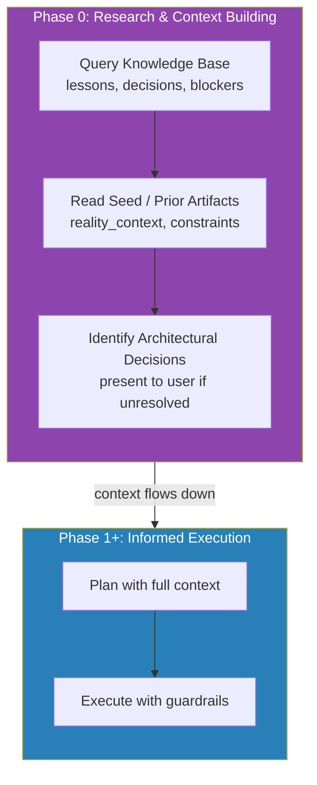

**What gets queried before work begins:**

| Agent | KB Queries | Why |
|-------|-----------|-----|
| Dev Setup Leader | `"setup blockers common issues"`, `"fix iteration patterns"` | Avoid known pitfalls |
| Implementation Planner | `"lessons learned {domain}"` | Apply patterns that worked, avoid patterns that failed |
| Security Reviewer | `"security vulnerabilities OWASP"`, `"security exception approved"` | Check for known risks AND approved exceptions |
| Story Generator | `"prior stories in {domain}"`, `"sizing insights"` | Seed the spec with institutional knowledge |

**The compounding effect:** Story 1 has zero KB context. Story 50 has hundreds of lessons, decisions, and patterns flowing into every agent's research phase. The system gets meaningfully smarter with every story completed.

**Token optimization:** Agents don't read entire story files. Setup leaders read only the frontmatter (~50 lines). Execution leaders read PLAN.yaml and SCOPE.yaml instead of the full story. This prevents context window bloat while preserving essential information.

### 4.6 Evidence Bundle Pattern

Every story produces an `_implementation/` directory that serves as a shared evidence bundle consumed by all downstream phases.

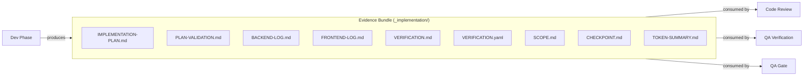

**This prevents re-discovery.** Code review doesn't need to re-analyze what changed -- it reads the implementation logs. QA doesn't need to guess the test strategy -- it reads the verification results. The gate doesn't need to re-run checks -- it aggregates existing evidence.

### 4.7 Multi-Agent Patterns: What We Chose, What We Didn't, and When Each Shines

Choosing the right multi-agent architecture meant evaluating a landscape of well-known patterns. For each, we asked: does this give us auditability, deterministic flow, cost control, and human oversight? Some patterns are excellent -- just not for this problem. Understanding *when* a pattern is the right tool matters as much as understanding why we didn't use it here.

#### Blackboard Pattern (Shared Memory)

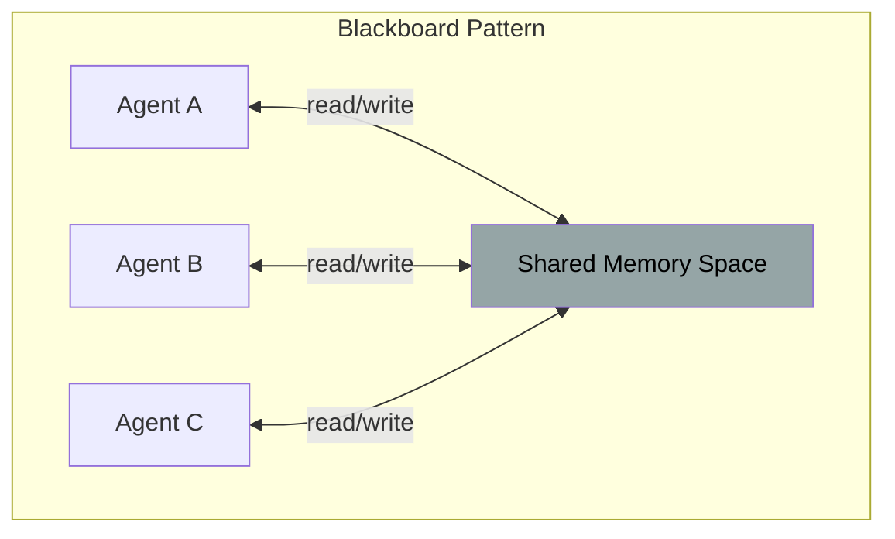

**How it works:** All agents read from and write to a shared memory space. Any agent can react to any change. No central coordinator -- agents self-organize around the evolving state of the blackboard.

**Why we didn't choose it:**

| Concern | Why It Matters Here |
|---------|-------------------|
| **Non-deterministic ordering** | Agent A's write could change Agent B's behavior unpredictably. Two runs of the same story could produce different results depending on timing. |
| **Audit trail breaks down** | When any agent can write at any time, tracing "who decided what and why" becomes forensic archaeology rather than reading a log. |
| **Hallucination amplification** | If one agent writes a subtly wrong finding to shared memory, every downstream agent consumes it as fact. No isolation boundary. |
| **Token cost explosion** | Every agent must read the full blackboard state on every cycle to check for relevant changes. |

**When it's a good fit:** Blackboard excels in **open-ended exploration problems** where the solution path is unknown. Scientific hypothesis generation, creative brainstorming systems, or complex diagnosis where one agent's discovery fundamentally reframes the problem for all others. If you're building an AI research assistant where Agent A's literature finding should immediately redirect Agent B's experiment design and Agent C's data analysis -- blackboard is the right call. The non-determinism is a feature, not a bug, when you *want* emergent behavior.

**What we took instead:** The Evidence Bundle pattern (4.6) gives us the *useful* property of blackboard (shared artifacts across phases) without the dangerous ones. Artifacts are written by specific phases in a defined order, consumed read-only by downstream phases. One-way data flow, not a free-for-all.

#### Autonomous Swarm (Self-Organizing Agents)

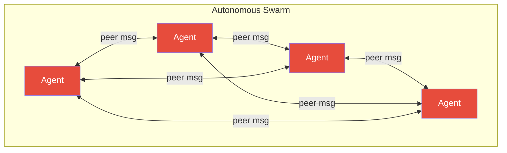

**How it works:** Agents communicate peer-to-peer with no central leader. They self-organize, negotiate tasks, and collectively converge on a solution. Popular in robotics and simulation research.

**Why we didn't choose it:**

| Concern | Why It Matters Here |
|---------|-------------------|
| **No convergence guarantee** | Swarms can oscillate, deadlock, or converge on suboptimal solutions. We need deterministic story completion, not emergent behavior. |
| **Ungovernable** | Our Tier 4 iron rule (destructive actions always escalate to humans) requires a central authority that can enforce it. In a swarm, who enforces the rules? |
| **Unobservable** | Peer-to-peer agent communication is invisible to the orchestrator. You can't build a TRACE.jsonl when agents are talking to each other in side channels. |
| **Unbounded cost** | Without a leader managing agent lifecycles, there's no mechanism to enforce token budgets or circuit breakers. Agents could spawn more agents indefinitely. |

**When it's a good fit:** Swarms shine in **massively parallel, homogeneous task environments** where agents are interchangeable and the work naturally decomposes. Web scraping farms where hundreds of identical crawlers negotiate which URLs to visit. Load testing where agents independently probe different endpoints. Distributed data processing where each agent handles a shard. The key requirement: agents must be **stateless and replaceable** -- if one dies, others absorb its work. If your agents are specialized (ours are), swarm is the wrong model.

**What we took instead:** The Phase Leader pattern (4.2) gives us a clear command hierarchy. Leaders spawn workers, workers return results, leaders aggregate. Every interaction is logged, budgeted, and traceable.

#### Debate / Adversarial Pattern

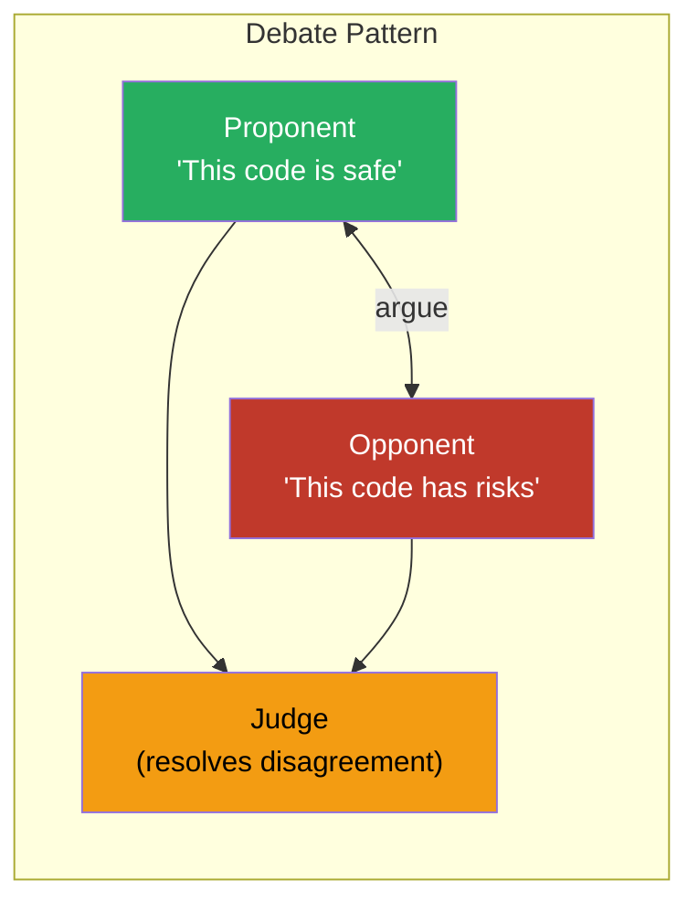

**How it works:** Two agents take opposing positions on a question. A third "judge" agent evaluates both arguments and renders a verdict. Used in some AI safety research to surface hidden risks.

**Why we didn't choose it:**

| Concern | Why It Matters Here |
|---------|-------------------|
| **3x token cost for every finding** | Every question requires a proponent, opponent, and judge. Our 6-specialist code review would become 18 agents per story. |
| **Artificial disagreement** | Forcing an "opponent" agent to argue against a clearly correct finding produces noise, not insight. If the linter says there's a missing semicolon, we don't need a debate about it. |
| **Judge hallucination** | The judge agent can be swayed by the more eloquently-argued (not more correct) position. LLMs are susceptible to rhetorical quality over factual accuracy. |
| **Latency** | Sequential argue-counterargue-judge adds 3 serial round-trips per finding, destroying the parallelism that makes our system fast. |

**When it's a good fit:** Debate is powerful for **high-stakes, genuinely ambiguous decisions** where there's no objectively right answer and the cost of being wrong is severe. Architecture decisions with 10-year consequences ("monolith vs microservices"). Legal document review where both sides of an argument must be explored. AI safety alignment research where you *need* to stress-test an AI's reasoning by forcing it to defend against adversarial challenges. The key: the question must be genuinely debatable, and you must be willing to pay the 3x cost for the added rigor.

**What we took instead:** Cross-domain verification (8.4). Rather than staging a debate, we let independent specialists flag the same issue from different angles. When 2+ domains flag the same finding, severity is automatically upgraded. This gets us the "surface hidden risks" benefit without the cost or noise.

#### Voting / Consensus Pattern

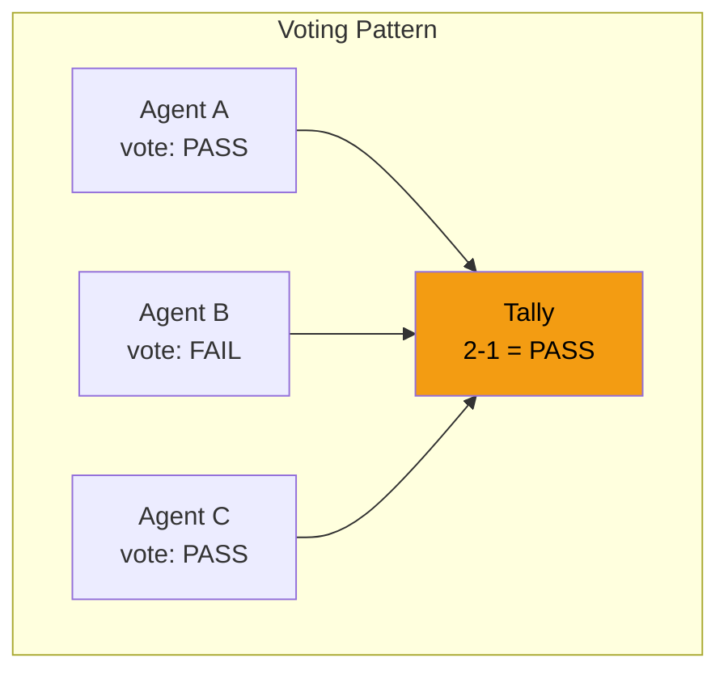

**How it works:** Multiple agents independently evaluate the same question, then vote. The majority wins. Used in ensemble methods and some multi-agent decision systems.

**Why we didn't choose it:**

| Concern | Why It Matters Here |
|---------|-------------------|
| **Domains aren't interchangeable** | A security agent and a style agent aren't peers on a security question. The security agent's opinion should dominate, not be outvoted by two non-experts. |
| **Masks the signal** | A 4-2 vote to PASS hides that the two dissenting agents were security and architecture. Aggregation by tally loses critical context. |
| **Token waste on redundancy** | Multiple agents doing the same analysis to build a quorum means paying for the same work N times. |
| **Majority != correct** | If 3 agents miss a vulnerability and 1 catches it, majority-rules ships the vulnerability. |

**When it's a good fit:** Voting works brilliantly for **classification tasks where agents are peers solving the same problem.** Sentiment analysis where 5 agents independently classify a document and majority-rules smooths out individual errors. Content moderation where you want to reduce false positives by requiring 3-of-5 agreement before flagging. Translation quality where multiple translation agents produce candidates and a vote selects the best. The prerequisite: all voters must be **equally qualified** on the same question. Our agents are domain-specialized, which makes them unequal voters on cross-domain questions.

**What we took instead:** Domain-authoritative fan-out (4.4). Each specialist agent is authoritative for its domain. The lint agent's PASS/FAIL on linting is final -- it doesn't need confirmation from the security agent. ANY single specialist can fail the entire review. This is the opposite of voting: one expert veto > five non-expert approvals.

#### Reflection / Self-Critique Loop

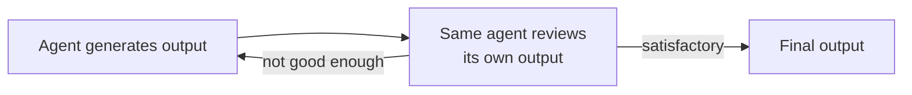

**How it works:** An agent generates output, then critiques its own work in a second pass. If the critique finds issues, it regenerates. Common in chain-of-thought refinement.

**Why we didn't choose it as the primary pattern:**

| Concern | Why It Matters Here |
|---------|-------------------|
| **Blind spots persist** | An agent that misunderstands a requirement will miss the same issue in self-review. The same mental model produces the same errors. |
| **Diminishing returns** | After 1-2 self-critique rounds, agents tend to make cosmetic changes rather than meaningful improvements. |
| **Context window pollution** | Each reflection round adds the previous attempt + critique to the context, consuming tokens and increasing hallucination risk. |

**When it's a good fit:** Self-critique is ideal for **single-domain generation tasks** where the quality criteria are clear and self-verifiable. Writing a SQL query, running it, seeing it fail, and iterating. Generating a regex, testing it against examples, and refining. Drafting a document and checking it against a rubric. The pattern works when the *verification* is objective (the test passes or it doesn't) even if the generation is creative. It breaks down when the failure mode is "you didn't know what you didn't know" -- which is exactly the case in multi-domain code review.

**What we took instead:** Fresh-context review by different agents. The code review phase clears context and spawns independent specialist agents that have never seen the implementation context. Each reviewer brings a genuinely different perspective, not the same agent pretending to be its own critic. This is why context is cleared between Implementation, Review, and Fix stages (6.2).

#### Router / Dispatcher Pattern

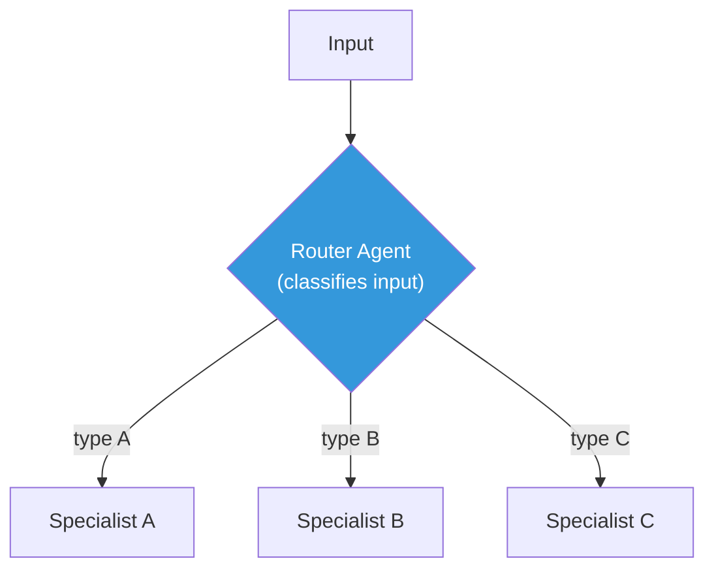

**How it works:** A single classifier agent examines the input and routes it to one specialist. Only one specialist runs per input. Common in customer service bots and tool-selection agents.

**Why we didn't choose it:**

| Concern | Why It Matters Here |
|---------|-------------------|
| **Single-specialist is insufficient** | A code change isn't "a security problem" or "a style problem" -- it's potentially both. Every change needs all 6 review perspectives. |
| **Router becomes a bottleneck** | The router must be smart enough to classify correctly. A misroute means the wrong specialist runs and the right one never sees the code. |
| **Loses parallel benefit** | Routing to one agent at a time is inherently sequential. Our fan-out runs all 6 reviewers simultaneously. |

**When it's a good fit:** Router is the right pattern for **high-volume, heterogeneous request streams** where each request genuinely belongs to one domain. Customer support ticketing where an incoming message is billing, technical, or account-related. API gateway middleware where requests route to different backend services. Document processing where each file type (PDF, image, spreadsheet) needs a different extraction pipeline. The key: the categories must be **mutually exclusive and well-defined**. Code changes aren't -- a single file can have security, style, and performance implications simultaneously.

**What we took instead:** Unconditional fan-out (4.4). Every story gets every specialist, every time. The cost is acceptable because workers use Haiku (cheap, fast). The benefit is that we never miss a cross-cutting concern because a router decided it "wasn't that kind of problem."

#### Map-Reduce Pattern

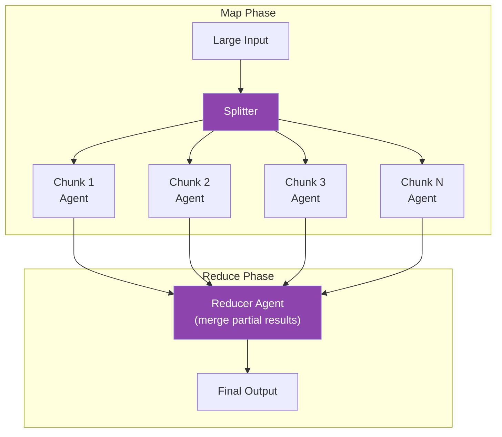

**How it works:** A large input is split into chunks. Identical agents process each chunk in parallel. A reducer merges the partial results into a final output. Borrowed directly from distributed computing.

**Why we didn't choose it:**

| Concern | Why It Matters Here |
|---------|-------------------|
| **Code isn't chunkable** | You can't split a React component across 4 agents and get meaningful partial results. Understanding code requires cross-file context -- imports, type definitions, shared state. |
| **Semantic boundaries matter** | A naive split (by file, by line count) would sever functions from their callers, types from their consumers. The "map" agents would each have incomplete context. |
| **Reducer complexity** | Merging partial code reviews is non-trivial. If Agent A says "this function is safe" and Agent B says "this function's caller passes untrusted input," the reducer needs deep understanding to reconcile. |

**When it's a good fit:** Map-Reduce is the right tool for **volume problems with naturally chunkable input.** Processing 10,000 customer reviews where each review is independent. Analyzing a large codebase for license compliance where each file can be checked in isolation. Translating a 500-page document where each paragraph stands alone. Scanning log files where each line is an independent event. The prerequisite: chunks must be **semantically independent** -- processing chunk 3 shouldn't require reading chunk 1. Code analysis rarely satisfies this.

#### Pipeline / Chain Pattern

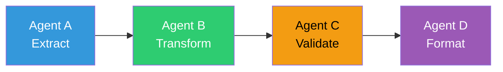

**How it works:** Each agent processes the output of the previous agent and passes its result to the next. A linear chain of transformations. Common in data processing and ETL systems.

**Why we didn't choose it as the primary pattern:**

| Concern | Why It Matters Here |
|---------|-------------------|
| **Sequential bottleneck** | Each agent must wait for the previous one to finish. A 6-agent pipeline takes 6x the latency of a single agent. Our fan-out runs all 6 in parallel. |
| **Error propagation** | An early agent's mistake flows downstream and compounds. Agent C can't question Agent A's output -- it only sees Agent B's transformation of it. |
| **No independence** | Every agent is coupled to the output format of the previous agent. Changing Agent B requires updating Agent C. Our specialists are completely independent. |

**When it's a good fit:** Pipelines are ideal for **sequential transformation tasks** where each step genuinely depends on the previous step's output. ETL data processing (extract from source, transform schema, load to warehouse). Document generation where you outline, then draft, then edit, then format. Image processing where you crop, then resize, then compress, then watermark. The key: the ordering must be **logically required**, not just convenient. We do use pipeline-like sequencing *between* phases (you can't review code that hasn't been written yet) -- but *within* phases, independence is maximized.

**What we took instead:** Phase Leader with fan-out (4.2 + 4.4). Between phases, we have a sequential dependency chain (setup -> plan -> implement -> review -> QA). Within phases, we maximize parallelism. This gives us the logical ordering of a pipeline between phases without the latency penalty within them.

#### Hierarchical Delegation (Manager of Managers)

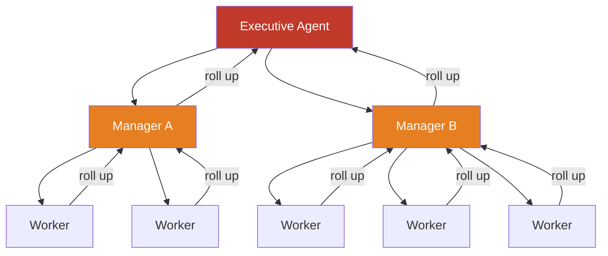

**How it works:** A tree of managers. The top-level agent delegates to middle managers, who delegate to workers. Results roll up through the hierarchy. Each manager only communicates with its direct reports and its own manager.

**Why we didn't choose it:**

| Concern | Why It Matters Here |
|---------|-------------------|
| **Information loss at each layer** | Each manager summarizes before passing results up. By the time findings reach the top, nuance is lost. A critical detail from Worker 4 might be compressed away by Manager B. |
| **Latency stacking** | Three-level hierarchy means 3 serial round-trips minimum. Our two-level structure (leader -> workers) has only 1 round-trip before aggregation. |
| **Middle management overhead** | Manager agents consume tokens to coordinate, not to produce analysis. That's pure overhead. With Haiku-priced workers, the management cost can exceed the work cost. |
| **Scope for our scale** | We have ~6 specialists per phase. That's not enough agents to justify middle management. Hierarchies pay off at 50+ agents, not 6. |

**When it's a good fit:** Hierarchies are the right choice when you have **large agent populations with natural groupings** and the work is too big for a single leader to manage. A system with 100+ agents analyzing a massive codebase where you need a "frontend manager" coordinating 20 UI agents, a "backend manager" coordinating 20 API agents, and a "data manager" coordinating 20 schema agents. Enterprise document processing where legal, financial, and operational documents each require their own management layer. The key: you need the hierarchy when a single leader literally **cannot hold the context** of all workers' output in a single aggregation pass.

**What we took instead:** Flat fan-out (4.4) with a single leader. Our 6 workers fit comfortably in one leader's context window. One level of coordination, zero information loss from intermediate summarization. If the system grows to 30+ specialists, we'd reconsider.

#### Mixture of Experts (MoE / Weighted Ensemble)

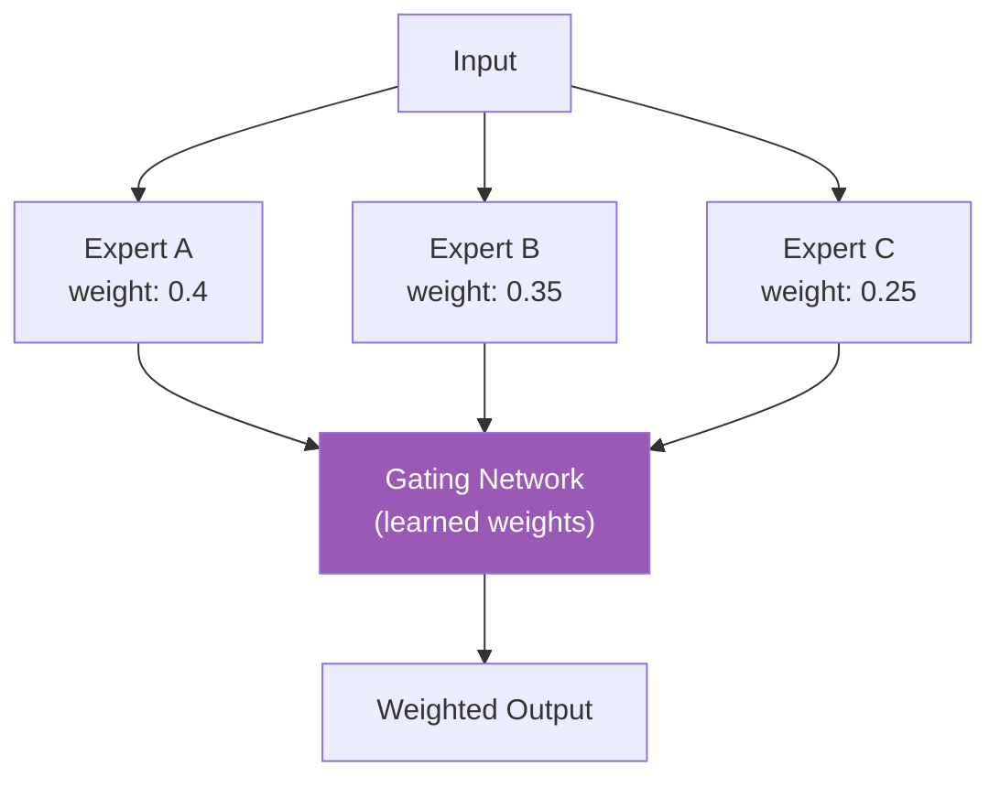

**How it works:** All experts process the input. A gating network assigns dynamic weights to each expert's output based on the input characteristics. The final result is a weighted combination. Used in large language models internally and in ensemble ML systems.

**Why we didn't choose it:**

| Concern | Why It Matters Here |
|---------|-------------------|
| **Outputs aren't blendable** | You can't "blend" a security review at 0.4 weight with a lint review at 0.35 weight. Code either has a vulnerability or it doesn't. Findings are discrete, not continuous. |
| **Requires training data** | The gating network needs historical data to learn which expert to trust on which input type. We'd need hundreds of labeled stories before the weights are meaningful. |
| **Soft signals, hard decisions** | Our pipeline needs binary PASS/FAIL at gates. A weighted confidence score of 0.73 doesn't tell the orchestrator whether to advance the story or block it. |

**When it's a good fit:** MoE excels at **continuous-valued prediction tasks** with historical training data. Sentiment scoring where multiple models' confidence scores are blended. Fraud detection where different models specialize in different fraud types and the system learns which model to trust for which transaction pattern. Recommendation engines where multiple ranking models are weighted by user segment. The prerequisite: outputs must be **numerically combinable** and you need enough labeled data to train the gating function.

#### ReAct Loop (Reason + Act, Single Agent)

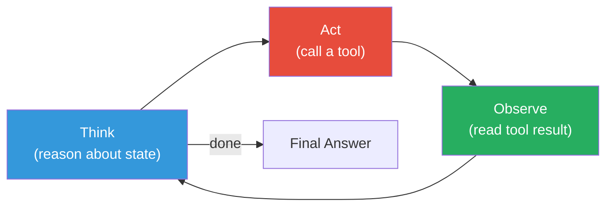

**How it works:** A single agent loops through think-act-observe cycles. It reasons about what to do, takes an action (tool call), observes the result, and reasons again. This is the default pattern for most LLM-based coding agents (ChatGPT with tools, single-agent Claude Code usage, etc.).

**Why we didn't choose it as the system-level architecture:**

| Concern | Why It Matters Here |
|---------|-------------------|
| **Context window exhaustion** | A single agent running through an entire story lifecycle would exhaust its context window. Our stories produce 10+ artifacts across 8 phases. |
| **No parallelism** | One agent, one thought at a time. Six review specialists that could run in 30 seconds take 3 minutes sequentially. |
| **God-agent risk** | A single agent making all decisions has no checks or balances. It can't review its own code from a fresh perspective. |
| **No fault isolation** | If the agent hallucinates in minute 5, everything from minute 5 onward is contaminated. No way to isolate the damage. |

**When it's a good fit:** ReAct is the ideal pattern for **focused, single-domain tasks** where an individual agent needs to reason through a problem step by step. Debugging a specific bug by reading code, forming hypotheses, and testing them. Answering a research question by searching, reading results, and synthesizing. Writing a single function by checking types, consulting docs, and iterating. We *do* use ReAct -- inside individual worker agents. Each specialist agent uses think-act-observe internally. But the *system-level* orchestration uses multi-agent fan-out, not a single ReAct loop.

**What we took instead:** Multi-agent orchestration (4.1) at the system level, with ReAct loops *inside* individual agents. Best of both worlds: each agent gets focused reasoning, the system gets parallelism and fault isolation.

#### Critic-Generator (Generative Adversarial)

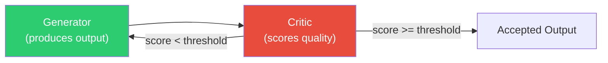

**How it works:** One agent generates output, a different agent scores it against quality criteria. If the score is below threshold, the generator tries again with the critic's feedback. Unlike self-critique, the critic is a *separate* agent with different instructions and perspective.

**Why we didn't choose it as the primary pattern:**

| Concern | Why It Matters Here |
|---------|-------------------|
| **Binary quality isn't scorable** | Code either compiles or it doesn't. Tests either pass or they don't. A critic scoring "code quality: 7.3/10" doesn't help the generator fix the actual compilation error. |
| **Feedback loop cost** | Each generate-critique cycle is 2 full agent calls. Three rounds to converge means 6 calls for one output. |
| **Critic calibration** | Without ground truth, how do you know the critic's scores are meaningful? A critic that always says "8/10" provides no signal. |

**When it's a good fit:** Critic-Generator excels at **creative generation with subjective quality criteria.** Writing marketing copy where a brand-voice critic ensures tone consistency. Generating UI designs where a UX critic evaluates usability heuristics. Producing data visualizations where a clarity critic checks if the chart communicates the intended insight. The pattern works when quality is **gradient** (better/worse, not pass/fail) and the critic has genuine expertise the generator lacks. In code, we can verify quality objectively (build, lint, test), so we use those tools directly rather than an AI critic.

**What we took instead:** The review/fix loop (6.2) is structurally similar but uses **objective verification** (build, lint, type-check, test) as the "critic" rather than another AI agent's opinion. The 6 specialist reviewers are closer to critics, but they produce specific findings, not scores -- and they run in parallel rather than gating a generate-retry loop.

#### Plan-then-Execute (Two-Phase Decomposition)

```mermaid
flowchart LR
    P["Planner Agent<br/>(decomposes task<br/>into sub-steps)"] --> E1["Executor 1"] & E2["Executor 2"] & E3["Executor 3"]
    E1 & E2 & E3 --> V["Verifier<br/>(checks plan was followed)"]

    style P fill:#8e44ad,color:#fff
    style V fill:#f39c12,color:#000
```

**How it works:** A planning agent breaks the task into discrete sub-steps. Separate executor agents carry out each step. A verifier checks that the plan was followed correctly. The planner never executes; the executors never plan.

**We partially adopted this one.** Our dev implementation workflow (6.2) uses exactly this structure: a Planner agent produces IMPLEMENTATION-PLAN.md, backend/frontend Coder agents execute it, and a Verifier agent confirms the results. The plan is validated by a separate Plan Validator before execution begins.

**Where we diverged:** Pure plan-then-execute assumes the plan is complete and correct. We add:
- **Plan Validation** -- a separate agent that stress-tests the plan before execution
- **Architectural Decision gates** -- unresolved decisions in the plan are surfaced to humans before coders start
- **Evidence Bundle** -- executors produce structured evidence that the verifier checks against the plan, not just "did it work?"

**When it's a perfect fit:** Plan-then-execute is ideal for **well-understood tasks with clear decomposition.** Infrastructure provisioning (plan the resources, provision each one, verify they're up). Database migrations (plan the schema changes, execute each migration, verify data integrity). Test suite generation (plan which cases to cover, generate each test, verify they pass). The key: the planning agent must have enough domain knowledge to produce a **complete and correct plan** without needing feedback from executors during execution.

#### Summary: Pattern Selection Guide

```mermaid
flowchart TB
    subgraph Chosen["What We Chose"]
        direction TB
        C1["Fan-Out / Fan-In<br/><i>Parallel specialists,<br/>unified aggregation</i>"]
        C2["Phase Leader<br/><i>Deterministic flow,<br/>clear hierarchy</i>"]
        C3["Research-First<br/><i>Context before action,<br/>KB-enriched</i>"]
        C4["Evidence Bundle<br/><i>Shared artifacts,<br/>one-way data flow</i>"]
        C5["Fresh-Context Review<br/><i>Independent perspectives,<br/>no pollution</i>"]
        C6["Plan-then-Execute<br/><i>Adopted for dev phase,<br/>with validation gates</i>"]
    end

    subgraph Rejected["What We Evaluated"]
        direction TB
        R1["Blackboard<br/><i>Great for exploration,<br/>not for auditable pipelines</i>"]
        R2["Swarm<br/><i>Great for homogeneous scale,<br/>not for specialized domains</i>"]
        R3["Debate<br/><i>Great for high-stakes ambiguity,<br/>not for deterministic checks</i>"]
        R4["Voting<br/><i>Great for peer classification,<br/>not for domain authority</i>"]
        R5["Self-Critique<br/><i>Great for iterative generation,<br/>not for cross-domain review</i>"]
        R6["Router<br/><i>Great for heterogeneous streams,<br/>not for multi-concern analysis</i>"]
        R7["Map-Reduce<br/><i>Great for chunkable volume,<br/>not for semantic code analysis</i>"]
        R8["Pipeline<br/><i>Great for sequential transforms,<br/>not for independent specialists</i>"]
        R9["Hierarchy<br/><i>Great for 50+ agents,<br/>overkill for 6</i>"]
        R10["MoE<br/><i>Great for continuous predictions,<br/>not for binary gates</i>"]
        R11["ReAct<br/><i>Great inside agents,<br/>not as system architecture</i>"]
        R12["Critic-Generator<br/><i>Great for creative quality,<br/>not for objective verification</i>"]
    end

    style Chosen fill:#27ae60,color:#fff
    style Rejected fill:#34495e,color:#fff
```

No pattern is universally wrong. The question is always: **does this pattern's strength align with this problem's constraints?**

| Our Constraint | Patterns That Support It | Patterns That Violate It |
|----------------|------------------------|-------------------------|
| **Auditability** (trace every decision) | Phase Leader, Evidence Bundle, Plan-then-Execute | Blackboard, Swarm, ReAct (single long loop) |
| **Determinism** (same input = same flow) | Fan-Out/Fan-In, Pipeline, Router | Swarm, Blackboard, MoE (weight drift) |
| **Cost control** (token budgets, circuit breakers) | Phase Leader, Fan-Out with Haiku workers | Swarm (unbounded), Debate (3x), Hierarchy (management overhead) |
| **Human oversight** (Tier 4 iron rule) | Phase Leader (central authority) | Swarm (no authority), Debate (judge may override human intent) |
| **Parallelism** (minimize wall-clock time) | Fan-Out/Fan-In, Map-Reduce | Pipeline, ReAct, Debate (sequential) |
| **Fault isolation** (one bad agent can't corrupt others) | Fan-Out (independent workers), Fresh-Context | Blackboard (shared state), Pipeline (error propagation) |

The through-line: **auditability, determinism, cost control, and human oversight.** Every pattern we chose supports all four. Every pattern we passed on fails at least two -- but would be the right choice in a different problem domain.

---

## 5. The Complete Story Lifecycle

### 5.1 State Machine (17 Statuses)

```mermaid
stateDiagram-v2
    direction LR

    [*] --> pending

    state "PM Phase" as pm {
        pending --> generated : /pm-story generate
    }

    state "Elaboration Phase" as elab {
        generated --> in_elaboration : /elab-story
        in_elaboration --> ready_to_work : PASS
        in_elaboration --> needs_refinement : NEEDS REFINEMENT
        in_elaboration --> needs_split : SPLIT REQUIRED
        needs_refinement --> generated : /pm-fix-story
        needs_split --> generated : /pm-story split
    }

    state "Dev Phase" as dev {
        ready_to_work --> in_progress : /dev-implement-story
        in_progress --> ready_for_code_review : implementation done
        ready_for_code_review --> code_review_failed : REVIEW FAIL
        code_review_failed --> in_progress : auto-fix loop
        ready_for_code_review --> ready_for_qa : REVIEW PASS
    }

    state "QA Phase" as qa {
        ready_for_qa --> in_qa : /qa-verify-story
        in_qa --> uat : VERIFIED
        in_qa --> needs_work : FAIL
        needs_work --> in_progress : fix required
        uat --> completed : /qa-gate PASS
        uat --> in_progress : /qa-gate FAIL
    }

    completed --> [*]
```

Every transition is triggered by a specific command and produces specific artifacts. No story can skip a phase. No status change happens without evidence.

### 5.2 Command-to-Phase Mapping

| Phase | Command | What Happens | Who Benefits |
|-------|---------|-------------|--------------|
| **1a** | `/pm-bootstrap-workflow` | Creates epic planning artifacts, story index, execution plan | PM, entire team |
| **1b** | `/pm-generate-story-000-harness` | Validates workflow mechanics with a test story | Team (confidence the system works) |
| **1c** | `/elab-epic` | 6 parallel stakeholder reviews of the full epic | PM, architects, QA |
| **1d** | `/pm-refine-story` | Interactive feature triage and prioritization | PM, product |
| **2** | `/pm-story generate` | Full story spec with test plan, feasibility, UX notes | Developers, QA |
| **3** | `/elab-story` | 8-point quality audit before any code is written | QA, developers |
| **4** | `/dev-implement-story` | Implementation + integrated review/fix loop | Developers |
| **5** | `/dev-code-review` | 6 parallel specialist reviews (usually integrated into Phase 4) | Developers, architects |
| **6** | `/qa-verify-story` | Evidence-based acceptance criteria verification | QA |
| **7** | `/qa-gate` | Final ship/no-ship decision | QA, management |
| **8** | `/wt-finish` | Merge, push, cleanup | DevOps |

### 5.3 Detailed Flow with Decision Points

```mermaid
flowchart TB
    subgraph Setup["EPIC SETUP (one-time)"]
        direction LR
        A["Bootstrap<br/>Create planning artifacts"] --> AH["Harness Story<br/>Validate workflow"]
        AH --> AE["Epic Elaboration<br/>6 stakeholder reviews"]
    end

    subgraph Lifecycle["STORY LIFECYCLE (per story)"]
        direction TB
        C["PM Story Generation<br/>Spec + test plan + feasibility"]

        C --> D{"Elaboration<br/>8-point audit"}

        D -->|"PASS"| E["Dev Implementation<br/>Plan, code, verify, prove"]
        D -->|"NEEDS REFINEMENT"| K["Elicitation<br/>Clarify requirements"]
        D -->|"SPLIT REQUIRED"| SP["Split Story<br/>Break into smaller stories"]
        D -->|"FAIL"| C

        K --> C
        SP --> C

        E --> CR{"Code Review<br/>6 parallel specialists"}
        CR -->|"FAIL"| FX["Auto-Fix Loop<br/>up to 3 iterations"]
        FX --> CR
        CR -->|"PASS"| G{"QA Verification<br/>Evidence-based"}

        G -->|"VERIFIED"| H{"QA Gate<br/>Ship decision"}
        G -->|"FAIL"| E

        H -->|"PASS"| I["Merge & Cleanup"]
        H -->|"FAIL"| E

        I --> J(("DONE"))
    end

    Setup --> Lifecycle

    style D fill:#f39c12,color:#000
    style CR fill:#f39c12,color:#000
    style G fill:#f39c12,color:#000
    style H fill:#f39c12,color:#000
```

**Four hard gates (shown in gold) that every story must pass. No exceptions. No bypasses.**

### 5.4 Gate Decisions at Each Checkpoint

| Gate | Possible Outcomes | What Happens Next |
|------|-------------------|-------------------|
| **Elaboration** | PASS, CONDITIONAL PASS, NEEDS REFINEMENT, SPLIT REQUIRED, FAIL | Forward to dev, or back to PM for rework |
| **Code Review** | PASS, FAIL (auto-fix loop, max 3 tries), FORCE CONTINUE | Forward to QA, or blocked for manual intervention |
| **QA Verification** | VERIFIED, FAIL | Forward to gate, or back to dev |
| **QA Gate** | PASS, CONCERNS (advisory), WAIVED (accepted risk), FAIL | Merge, or back to dev |

---

## 6. Multi-Agent Orchestration Deep Dive

### 6.1 Story Generation: Multi-Agent Fan-Out

```mermaid
flowchart TB
    CMD["/pm-story generate WISH-001"]
    CMD --> LEADER["pm-story-generation-leader<br/>(Sonnet)"]

    LEADER --> SEED["pm-story-seed-agent<br/>Seeds story with codebase reality"]
    SEED --> KCL["knowledge-context-loader<br/>Queries KB for lessons + ADRs"]

    LEADER --> TP["pm-draft-test-plan<br/>(parallel)"] & DF["pm-dev-feasibility-review<br/>(parallel)"] & UX["pm-uiux-recommendations<br/>(parallel, if UI)"]

    KCL -.->|"lessons, ADRs"| LEADER
    TP -.->|"TEST-PLAN.md"| LEADER
    DF -.->|"DEV-FEASIBILITY.md"| LEADER
    UX -.->|"UX notes"| LEADER

    LEADER --> OUT["Complete Story Specification<br/>with all PM artifacts"]
```

**Key insight:** The story isn't written by one agent guessing. It's assembled from:
- Real codebase analysis (seed agent reads actual code)
- Institutional memory (KB loader pulls lessons from past stories)
- Parallel specialist perspectives (test, feasibility, UX)

### 6.2 Dev Implementation: Full Agent Pipeline

```mermaid
flowchart TB
    CMD["/dev-implement-story WISH-001"]

    subgraph Implementation["IMPLEMENTATION (fresh context)"]
        direction TB
        S["Phase 0: Setup Leader<br/>(Haiku)<br/>SCOPE.md, CHECKPOINT.md"]
        S --> PL["Phase 1A: Planner<br/>(Sonnet)<br/>IMPLEMENTATION-PLAN.md"]
        PL --> PV["Phase 1B: Plan Validator<br/>(Sonnet)<br/>PLAN-VALIDATION.md"]
        PV --> BE["Phase 2A: Backend Coder<br/>(Sonnet)"] & FE["Phase 2A: Frontend Coder<br/>(Sonnet)"]
        BE --> CT["Phase 2B: Contracts<br/>(after backend)"]
        FE --> VR
        CT --> VR["Phase 3: Verifier<br/>build, lint, test"]
        VR --> PW["Phase 4: Proof Writer"]
        PW --> LR["Phase 5: Learnings<br/>writes to KB"]
    end

    subgraph ReviewLoop["REVIEW/FIX LOOP (fresh context each iteration)"]
        direction TB
        R1["Lint"] & R2["Style"] & R3["Syntax"] & R4["Security"] & R5["TypeCheck"] & R6["Build"]
        R1 & R2 & R3 & R4 & R5 & R6 --> AGG{"Aggregate<br/>VERIFICATION.yaml"}
        AGG -->|"FAIL"| FIX["Fix Agent<br/>(fresh context)"]
        FIX -->|"retry"| R1 & R2 & R3 & R4 & R5 & R6
        AGG -->|"PASS"| DONE["Ready for QA"]
    end

    CMD --> Implementation
    Implementation --> ReviewLoop

    style R1 fill:#e74c3c,color:#fff
    style R2 fill:#e74c3c,color:#fff
    style R3 fill:#e74c3c,color:#fff
    style R4 fill:#e74c3c,color:#fff
    style R5 fill:#e74c3c,color:#fff
    style R6 fill:#e74c3c,color:#fff
```

**Context is cleared between Implementation, Review, and Fix stages.** Each stage gets fresh agents with no accumulated context pollution. This prevents hallucination drift and ensures each review is independent.

### 6.3 Epic Elaboration: 6 Stakeholder Perspectives

```mermaid
flowchart TB
    CMD["/elab-epic WISH"]

    CMD --> SETUP["Setup Leader<br/>(Haiku)"]
    SETUP --> REVIEWS["Reviews Leader<br/>(Haiku, spawns 6 parallel)"]

    REVIEWS --> ENG["Engineering<br/>Technical feasibility"] & PROD["Product<br/>User value clarity"] & QA["QA<br/>Testability"] & UXR["UX<br/>Design coherence"] & PLAT["Platform<br/>Infrastructure needs"] & SEC["Security<br/>Threat modeling"]

    ENG & PROD & QA & UXR & PLAT & SEC --> AGG["Aggregation Leader<br/>Merges to EPIC-REVIEW.yaml"]
    AGG --> INT["Interactive Leader<br/>(Sonnet)<br/>Presents findings, collects decisions"]
    INT --> UPD["Updates Leader<br/>Applies approved changes"]
```

**Six independent perspectives run in parallel**, then aggregate. This mirrors a real architecture review board but runs in minutes instead of scheduling a meeting.

### 6.4 Elaboration Deep Dive: Confidence-Driven Verdicts & Gap Analysis

This is where the system does something genuinely novel. The elaboration phase doesn't just check a box -- it runs an **8-point audit**, scores findings by **confidence level**, performs a **gap analysis** that separates MVP-critical gaps from future opportunities, and arrives at a verdict through structured reasoning rather than simple thresholds.

#### The 8-Point Audit

Every story is evaluated against eight dimensions before a single line of code is written:

```mermaid
flowchart TB
    subgraph Audit["8-Point Elaboration Audit"]
        direction TB
        A1["1. Scope Alignment<br/>Does the story match the epic?"]
        A2["2. Internal Consistency<br/>Do ACs contradict each other?"]
        A3["3. Reuse-First<br/>Are existing packages leveraged?"]
        A4["4. Ports & Adapters<br/>Clean architecture boundaries?"]
        A5["5. Local Testability<br/>Can every AC be verified?"]
        A6["6. Decision Completeness<br/>Are all TBDs resolved?"]
        A7["7. Risk Disclosure<br/>Are risks identified and mitigated?"]
        A8["8. Story Sizing<br/>Right-sized for one dev cycle?"]
    end

    A1 & A2 & A3 & A4 & A5 & A6 & A7 & A8 --> V{"Verdict<br/>Engine"}

    V -->|"All pass, no MVP gaps"| PASS["PASS"]
    V -->|"Minor issues, auto-resolved"| CP["CONDITIONAL PASS"]
    V -->|"Unresolvable audit failures"| FAIL["FAIL"]
    V -->|"Too large for one cycle"| SPLIT["SPLIT REQUIRED"]

    style V fill:#f39c12,color:#000
    style PASS fill:#27ae60,color:#fff
    style CP fill:#f1c40f,color:#000
    style FAIL fill:#c0392b,color:#fff
    style SPLIT fill:#8e44ad,color:#fff
```

#### Confidence-Driven Findings

Every finding in the elaboration is annotated with a confidence level. This is what prevents the system from crying wolf:

| Confidence | Definition | Can It Block? | Example |
|-----------|-----------|--------------|---------|
| **High** | Provable via static analysis or direct evidence | Yes -- can block the story | "AC-3 references `UserSchema` but no Zod schema exists in codebase" |
| **Medium** | Strong evidence with some ambiguity | Included with caveat | "Upload flow may exceed Lambda timeout at 10MB based on similar stories" |
| **Low** | Pattern-based intuition | Flagged for human review only | "Component complexity suggests future maintainability risk" |
| **Cannot determine** | Insufficient context to judge | Escalated -- agent does not opine | "Third-party API behavior untestable without credentials" |

**The iron rule:** A critical-severity finding requires high confidence. A low-confidence finding can never block a story. This prevents agents from generating noise that erodes trust in the system.

Design decisions made during elaboration are also confidence-scored:

```yaml
design_decisions:
  - id: 1
    question: "Position Conflict Resolution: Fixed positions vs flexible props?"
    decision: "Use fixed positions (checkbox=top-left, drag=top-right)"
    confidence: high   # Documented recommendation in DEV-FEASIBILITY.md

  - id: 4
    question: "renderDragHandle Prop: MVP requirement or future work?"
    decision: "Include in MVP but document as optional/advanced"
    confidence: medium  # No current consumers identified
```

#### Gap Analysis: The Two-Document Split

This is where the elaboration produces its most valuable output. Gaps are split into two categories with two separate documents:

```mermaid
flowchart TB
    ANALYST["Elaboration Analyst"] --> GAPS{"Gap Classification"}

    GAPS -->|"Blocks core<br/>user journey?"| MVP["ANALYSIS.md<br/>(MVP-Critical Gaps)"]
    GAPS -->|"Nice to have,<br/>future value?"| FUT["FUTURE-OPPORTUNITIES.md<br/>(Non-Blocking)"]

    MVP --> RESOLVE["Must be resolved<br/>before PASS"]
    FUT --> KB["Logged to KB for<br/>future story generation"]

    style MVP fill:#c0392b,color:#fff
    style FUT fill:#2980b9,color:#fff
    style RESOLVE fill:#e74c3c,color:#fff
    style KB fill:#3498db,color:#fff
```

**ANALYSIS.md** -- MVP-Critical Gaps (must resolve):

| # | Gap | Blocks | Required Fix |
|---|-----|--------|--------------|
| 1 | No error handling for S3 upload timeout | Core upload journey | Add AC for timeout + retry |
| 2 | Missing responsive breakpoint decision | Grid layout on mobile | Resolve in Architecture Notes |

**FUTURE-OPPORTUNITIES.md** -- Non-Blocking Gaps + Enhancement Possibilities:

| # | Finding | Impact | Effort | Recommendation |
|---|---------|--------|--------|----------------|
| 1 | WCAG AAA compliance (7:1 contrast) | Low | Medium | Future story |
| 2 | Migrate accessibility hooks to @repo/accessibility | High | Medium | After production validation |
| 3 | React Aria GridCollection integration | Medium | Medium | Performance enhancement story |
| 4 | Automated screen reader testing (@guidepup) | Medium | High | Test infrastructure story |

**Why this matters:** The gap analysis doesn't just find problems -- it finds **opportunities**. A story about keyboard navigation surfaces the possibility of migrating accessibility hooks to a shared package. A story about image upload surfaces the opportunity for background compression. These future opportunities feed directly back into story generation for the next sprint.

#### How Gaps Become Actions

In **autonomous mode**, the system resolves gaps automatically:

| Finding Type | Auto-Decision | Output |
|--------------|---------------|--------|
| MVP-Critical Gap | Add as new Acceptance Criteria | Updated story with new AC |
| Missing Decision | Resolve with sensible default | TBD replaced with concrete decision |
| Audit Failure (Reuse-First) | Add implementation note | AC clarified with package reference |
| Non-Blocking Gap | Log to Knowledge Base | Future story generation picks it up |
| Enhancement Opportunity | Log to Knowledge Base | Tagged for pattern mining |

In **interactive mode**, each gap is presented to the user with options: add as AC, create follow-up story, mark out-of-scope, or skip.

#### The Verdict Flow

The verdict isn't a number -- it's a structured decision:

```
if no MVP-critical gaps AND all 8 audit checks pass:
    → PASS (move to ready-to-work)

elif MVP gaps auto-resolved AND minor audit issues noted:
    → CONDITIONAL PASS (move to ready-to-work with notes)

elif unresolvable audit failures (Scope, Consistency):
    → FAIL (return to PM for rework)

elif story sizing exceeds one dev cycle:
    → SPLIT REQUIRED (break into smaller stories)
```

**What gets appended to the story:**

```markdown
## QA Discovery Notes (Auto-Generated)

### Gaps Identified
| # | Finding | Resolution | Notes |
|---|---------|------------|-------|

### Enhancement Opportunities
| # | Finding | Resolution | Notes |
|---|---------|------------|-------|

### Follow-up Stories Suggested
- [ ] Migrate a11y hooks to @repo/accessibility
- [ ] Add @guidepup screen reader testing

### KB Entries Created
- kb_entry_42: "Upload timeout handling pattern"
- kb_entry_43: "Responsive grid breakpoint decision"
```

#### Story Disposition: Split, Follow Up, or Ship

The most nuanced part of elaboration isn't finding gaps -- it's deciding what to *do* about them. The system reasons its way to one of four verdicts, and each verdict triggers a different downstream path. This isn't a checklist. It's a structured decision tree where the system weighs multiple signals, distinguishes between what blocks the current story and what creates future value, and produces actionable outcomes -- not just a pass/fail stamp.

```mermaid
flowchart TB
    STORY["Story enters elaboration"] --> AUDIT["8-Point Audit"]
    AUDIT --> SIZE{"Sizing Check<br/>(6 indicators)"}

    SIZE -->|"2+ indicators<br/>triggered"| SPLIT["SPLIT REQUIRED<br/>Decompose into smaller stories"]
    SIZE -->|"0-1 indicators"| GAPS{"MVP-Critical<br/>Gaps?"}

    GAPS -->|"Yes"| RESOLVE{"Can gaps be<br/>resolved as ACs?"}
    GAPS -->|"No gaps"| SCOPE{"Scope &<br/>Consistency?"}

    RESOLVE -->|"Yes"| ADD["Add as new ACs<br/>+ note non-blocking<br/>as future opportunities"]
    RESOLVE -->|"No — needs PM"| FAIL["FAIL<br/>Return to PM"]
    ADD --> SCOPE

    SCOPE -->|"Pass"| VERDICT{"Minor issues<br/>remaining?"}
    SCOPE -->|"Fail"| FAIL

    VERDICT -->|"None"| PASS["PASS<br/>Ready to work"]
    VERDICT -->|"Non-blocking"| CP["CONDITIONAL PASS<br/>Ready to work + logged risks"]

    SPLIT --> SPLITTER["Generate split stories<br/>(A, B, C...)"]
    SPLITTER --> REELAB["Each split re-enters<br/>elaboration independently"]

    style SPLIT fill:#8e44ad,color:#fff
    style FAIL fill:#c0392b,color:#fff
    style PASS fill:#27ae60,color:#fff
    style CP fill:#f1c40f,color:#000
    style SIZE fill:#f39c12,color:#000
    style GAPS fill:#f39c12,color:#000
```

**The sizing check: when a story is too big to ship as one unit.**

The system evaluates six indicators of story complexity. Any one indicator can be legitimately large -- a feature might naturally have 9 acceptance criteria. But when **two or more indicators fire simultaneously**, it's a signal that the story is trying to do too much:

| Indicator | Threshold | What It Measures |
|-----------|-----------|-----------------|
| Acceptance Criteria | > 8 | Scope breadth -- how many distinct behaviors? |
| API Endpoints | > 5 created or modified | Backend surface area |
| Full-Stack | Significant frontend AND backend | Architectural breadth across skill domains |
| Bundled Features | Multiple independent features | Could these ship separately? |
| Happy Path Scenarios | > 3 distinct test paths | Testing complexity |
| Package Touches | > 2 packages modified | Cross-cutting dependency risk |

**Why "2 or more" and not a single threshold?** Because any one indicator can occur legitimately. A rich UI component might touch 3 packages but have only 4 ACs. A backend migration might modify 6 endpoints but be entirely one-domain. The combinatorial signal -- multiple dimensions of complexity stacking up -- is what reliably predicts a story that will stall, get stuck in review, or deliver a messy PR.

When a split is triggered, the analyst doesn't just say "too big." It produces a concrete decomposition:

| Split | Scope | ACs Assigned | Depends On |
|-------|-------|-------------|------------|
| WISH-2030-A | Backend API + data model | AC 1, 2, 3, 4 | None |
| WISH-2030-B | Frontend UI + integration | AC 5, 6, 7 | WISH-2030-A |

Each split gets its own clear scope, non-overlapping AC allocation, explicit dependencies, and must be independently testable. The splits re-enter elaboration individually -- a split that's still too big will be split again.

**The MVP-critical distinction: what blocks shipping vs. what creates future value.**

This is the decision the system makes for every gap it discovers: is this a blocker, or an opportunity?

```mermaid
flowchart LR
    GAP["Gap Discovered"] --> Q{"Does this block<br/>the core user journey?"}

    Q -->|"User can't complete<br/>the primary flow"| MVP["MVP-Critical<br/>→ Must resolve now"]
    Q -->|"User can complete flow,<br/>but experience could improve"| FUT["Future Opportunity<br/>→ Capture for later"]

    MVP --> AC["Add as Acceptance Criteria<br/>to current story"]
    FUT --> FORK{"Interactive or<br/>Autonomous mode?"}

    FORK -->|"Interactive"| USER["Present to user:<br/>follow-up story? out-of-scope? skip?"]
    FORK -->|"Autonomous"| KB["Log to Knowledge Base<br/>for future story generation"]

    style MVP fill:#c0392b,color:#fff
    style FUT fill:#2980b9,color:#fff
    style AC fill:#e74c3c,color:#fff
    style KB fill:#3498db,color:#fff
```

The bar for "MVP-critical" is intentionally high: the user literally cannot complete the primary happy path without this being addressed. Missing input validation on a core form? MVP-critical. A friendlier error message? Future opportunity. A performance optimization? Future opportunity. A WCAG AAA contrast ratio upgrade? Future opportunity.

This prevents scope creep during elaboration. Every story enters with a defined scope; the elaboration phase is not allowed to silently grow that scope by upgrading nice-to-haves into requirements. It can only add ACs for genuine blockers.

**Follow-up stories: how discovered value doesn't get lost.**

The non-blocking gaps and enhancement opportunities don't disappear. In interactive mode, the user chooses what to do with each one:

| Option | When to Use | What Happens |
|--------|------------|-------------|
| **Create follow-up story** | Valuable work that should happen eventually | A new story is generated with its own ID, linked back to the parent with an explicit dependency |
| **Mark out-of-scope** | Valid finding, but explicitly excluded for this project | Documented with justification so the decision isn't relitigated later |
| **Skip** | Already covered elsewhere, or not relevant | No action taken |

Follow-up stories are real stories: they get their own ID, show up in the index with a dependency on the parent, and enter the same pipeline (generation → elaboration → implementation → review → QA). They aren't sticky notes -- they're first-class work items that trace back to the discovery that created them.

In autonomous mode, follow-up story creation is deliberately disabled. Creating new work items is a PM judgment call, not something an AI should do unilaterally. Instead, findings are written to the Knowledge Base, where they surface during future story generation. The intelligence is captured; the decision about *when* to act on it stays with humans.

**The four verdicts and what makes each one trigger.**

| Verdict | Trigger | What Happens Next |
|---------|---------|------------------|
| **PASS** | All 8 audit checks pass. No MVP-critical gaps. Sizing within bounds. | Story moves to `ready-to-work`. Developers can begin. |
| **CONDITIONAL PASS** | MVP-critical gaps were found and resolved (added as ACs). Minor non-blocking issues logged. | Story moves to `ready-to-work` with risk notes attached. Developers proceed with awareness. |
| **FAIL** | Scope Alignment or Internal Consistency audit checks failed. These cannot be auto-resolved -- they indicate the story spec itself is contradictory or misaligned with the epic. | Story stays in elaboration. PM must fix the spec via `/pm-fix-story` and re-elaborate. |
| **SPLIT REQUIRED** | 2+ sizing indicators fired. The story is too complex for a single development cycle. | Story is decomposed into smaller stories with clear boundaries, dependencies, and AC allocation. Each split re-enters elaboration independently. |

The hierarchy is important: sizing is checked first (a story that's too big can't be evaluated meaningfully on other dimensions). Scope and consistency are checked next (these are unfixable without PM intervention). Everything else -- reuse, testability, decision completeness, risk disclosure -- can be auto-resolved or noted as advisory.

Two audit checks are **never auto-resolved**: Scope Alignment and Internal Consistency. If the story contradicts its own ACs or doesn't align with the epic's goals, no amount of automated patching will fix that. The system recognizes the limits of what it can reason about and escalates to humans.

The elaboration phase doesn't just gate quality -- it **generates intelligence** that compounds across the entire project.

### 6.5 Model Assignment Strategy

Not all agents need the same capability. We optimize cost and latency by matching model to task complexity:

| Agent Role | Model | Rationale | Relative Cost |
|-----------|-------|-----------|--------------|
| Setup Leaders | Haiku | Simple validation, input checking | $ |
| Completion Leaders | Haiku | Status updates, artifact finalization | $ |
| Code Review Workers | Haiku | Focused single-check validation | $ |
| Work Leaders | Sonnet | Complex analysis and coordination | $$ |
| Code Generation Workers | Sonnet | Writing code requires capability | $$ |
| Critical Decisions | Opus | Reserved for highest-stakes judgment | $$$ (rare) |

This means a full story lifecycle doesn't cost "45 Opus calls." Most calls are Haiku. The expensive model is used only where it matters.

---

## 7. Agent Guardrails & Safety Model

### 7.1 The Core Rule

> **Commands mutate story state. Agents produce evidence only.**

An agent cannot move a story forward. It can analyze, recommend, write reports, and produce findings -- but the command orchestrator is the only thing that changes a story's status. A rogue agent output is contained: it produces a bad report, but the pipeline doesn't advance.

### 7.2 The 5-Tier Decision Classification

```mermaid
flowchart TB
    D["Decision Encountered"] --> C{"Classify Tier"}

    C -->|"Tier 1: Clarification<br/>Missing info, reasonable default"| T1["Auto or Escalate<br/>(depends on autonomy level)"]
    C -->|"Tier 2: Preference<br/>Human taste matters"| T2["Usually Escalate"]
    C -->|"Tier 3: Ambiguous Scope<br/>Multiple valid interpretations"| T3["Auto or Escalate<br/>(depends on autonomy level)"]
    C -->|"Tier 4: Destructive<br/>Cannot be undone"| T4["ALWAYS ESCALATE<br/>No override. No exception."]
    C -->|"Tier 5: External<br/>Cross-team, external services"| T5["Escalate unless low-risk"]

    style T4 fill:#c0392b,color:#fff
```

**Tier 4 is the iron rule.** Regardless of configuration, autonomy level, or any other setting:
- Deleting files or branches
- Force-pushing
- Changing authentication or security
- Breaking API changes
- Production deployments

These ALWAYS require human approval. The system is architecturally incapable of making these decisions autonomously.

### 7.3 Configurable Autonomy Levels

Three levels, configurable per-phase:

| Level | Tier 1 | Tier 2 | Tier 3 | Tier 4 | Tier 5 |
|-------|--------|--------|--------|--------|--------|
| **Conservative** | Escalate | Escalate | Escalate | Escalate | Escalate |
| **Moderate** | Auto | Escalate | Auto | Escalate | Escalate |
| **Aggressive** | Auto | Auto | Auto | Escalate | Auto (low-risk) |

**Example phase configuration:**

| Phase | Recommended Level | Reasoning |
|-------|-------------------|-----------|
| PM Story Generation | Conservative | Requirements need human validation |
| Dev Implementation | Moderate | Code decisions can use established conventions |
| Code Review | Aggressive | Automated checks are deterministic and reliable |
| QA Verification | Conservative | Quality gates need human oversight |

### 7.4 Circuit Breaker Pattern

```mermaid
flowchart LR
    E1["Error 1"] --> R1["Retry"]
    R1 --> E2["Error 2<br/>(same type)"]
    E2 --> R2["Retry"]
    R2 --> E3["Error 3<br/>(same type)"]
    E3 --> CB["CIRCUIT BREAKER<br/>Stop retrying"]
    CB --> LOG["Write ERROR-LOG.yaml"]
    LOG --> BLOCK["Story status: blocked"]
    BLOCK --> HUMAN["Require manual intervention"]

    style CB fill:#c0392b,color:#fff
    style BLOCK fill:#e74c3c,color:#fff
```

After 3 consecutive failures of the same type within a phase:
1. **Stop retrying** -- don't burn tokens on a dead end
2. **Write error log** -- document what went wrong
3. **Block the story** -- make it visible that intervention is needed
4. **Wait for humans** -- the system admits when it can't solve a problem

### 7.5 Retry Configuration by Error Type

| Error Type | Retryable? | Max Retries | Strategy |
|-----------|-----------|-------------|----------|
| Agent spawn failure | Yes | 1 | 2s fixed delay |
| Agent timeout | No | 0 | Kill and fail |
| Malformed output | Yes | 2 | 1s fixed delay |
| Precondition failure | No | 0 | Fail immediately |
| External service down | Yes | 3 | Exponential backoff (5s base, 60s max) |

### 7.6 Artifact Locking (Prevents Concurrent Corruption)

During execution, phases write a `.phase-lock` file:
- If lock exists and is < 1 hour old: command fails with "Phase in progress"
- If lock is > 1 hour old: considered stale, ignored
- Prevents two agents from writing to the same story simultaneously

### 7.7 Idempotent Commands (Safe to Re-run)

| Command | If Already Complete | Behavior |
|---------|---------------------|----------|
| `/pm-story generate` | Story exists | ERROR (use `--force` to overwrite) |
| `/elab-story` | ELAB file exists | SKIP (use `--force` to re-run) |
| `/dev-implement-story` | Artifacts exist | AUTO-RESUME from checkpoint |
| `/dev-code-review` | Previous review exists | RE-RUN (code may have changed) |
| `/qa-verify-story` | Already verified | SKIP |
| `/qa-gate` | Gate file exists | RE-RUN (may have new evidence) |

The system is safe to re-run at any point. Interrupted work resumes from the last checkpoint, not from scratch.

---

## 8. Expert Intelligence Framework

### 8.1 Beyond Checklists: Expert Personas

Each specialist agent isn't just running rules -- it embodies a domain expert with mental models, intuitions, and judgment:

```mermaid
flowchart TB
    subgraph Security["Security Expert Persona"]
        S1["Mental Model:<br/>'Attacker perspective -- how would I exploit this?'"]
        S2["Mental Model:<br/>'Blast radius -- if compromised, what else falls?'"]
        S3["Mental Model:<br/>'Defense in depth -- what other layers protect this?'"]
    end

    subgraph Architecture["Architecture Expert Persona"]
        A1["Mental Model:<br/>'Future reader -- will someone understand this in 6 months?'"]
        A2["Mental Model:<br/>'Coupling awareness -- what depends on this decision?'"]
        A3["Mental Model:<br/>'Reversibility -- how hard to change if wrong?'"]
    end

    subgraph QA["QA Expert Persona"]
        Q1["Mental Model:<br/>'Reality check -- does this actually work, or just pass tests?'"]
        Q2["Mental Model:<br/>'Edge case hunting -- what if empty? 10,000 items?'"]
        Q3["Mental Model:<br/>'Mock detection -- testing real behavior or assumptions?'"]
    end
```

### 8.2 The RAPID Decision Framework

For gray areas where rules don't clearly apply, agents use structured reasoning:

| Step | Question | What It Determines |
|------|----------|-------------------|
| **R** - Risk | What's the worst-case outcome? | Severity floor |
| **A** - Attack surface | Who has access? Public? Admin? | Exposure level |
| **P** - Precedent | Does the KB show approved/rejected patterns? | Historical guidance |
| **I** - Intent | What was the developer trying to achieve? | Context for judgment |
| **D** - Defense | Are there other protective layers? | Mitigation assessment |

### 8.3 Confidence Requirements

Every finding must declare a confidence level:

| Confidence | Definition | Impact on Pipeline |
|-----------|-----------|-------------------|
| **High** | Provable via static analysis | Can block the story |
| **Medium** | Strong evidence, some ambiguity | Included with caveat |
| **Low** | Pattern-based intuition | Flagged for human review only |
| **Cannot determine** | Insufficient context | Escalated, agent does not opine |

**Critical rule:** A critical-severity finding requires high confidence. Low-confidence findings can never block a story. This prevents the system from crying wolf.

### 8.4 Cross-Domain Verification

Specialist agents check each other's work:

```mermaid
flowchart LR
    SEC["Security Agent"] <-->|"checks"| ARCH["Architecture Agent"]
    ARCH <-->|"checks"| QA["QA Agent"]
    QA <-->|"checks"| UX["UI/UX Agent"]
    UX <-->|"checks"| SEC

    SEC -.->|"auth patterns"| ARCH
    ARCH -.->|"pattern risks"| SEC
    QA -.->|"verify all claims testable"| SEC & ARCH & UX
```

When 2+ domains flag the same issue, severity is upgraded. Conflicting findings trigger a disagreement protocol. No single agent has unchecked authority.

---

## 9. Knowledge Base & Institutional Memory

### 9.1 Architecture

```mermaid
flowchart TB
    subgraph Write["Knowledge Capture (Write Path)"]
        DEV["Story Completion"] -->|"learnings agent"| KBW["kb-writer agent"]
        QAV["QA Verification"] -->|"test strategies"| KBW
        ELAB["Elaboration"] -->|"gap patterns"| KBW
        KBW -->|"deduplicate at 0.85 similarity"| KB
    end

    subgraph Store["Knowledge Base"]
        KB["PostgreSQL + pgvector<br/>Vector embeddings for semantic search<br/>Tagged entries with source tracking"]
    end

    subgraph Read["Knowledge Retrieval (Read Path)"]
        KB -->|"kb_search"| PM["Story Generation<br/>(lessons, past blockers)"]
        KB -->|"kb_search"| AGENTS["Expert Agents<br/>(precedent lookup)"]
        KB -->|"kb_search"| PLAN["Implementation Planning<br/>(patterns to follow/avoid)"]
    end

    style KB fill:#2ecc71,color:#000
```

### 9.2 What Gets Stored and When

| Lifecycle Stage | What Gets Written | Example |
|----------------|-------------------|---------|
| Story completion | Blockers encountered, patterns that worked, time sinks | "DI pattern from album functions saved 4 hours on image functions" |
| QA verification | Test strategies, edge cases discovered | "Empty array edge case caused crash in gallery sort" |
| Elaboration | Sizing insights, gap patterns | "Stories touching upload flow consistently underestimate by 2x" |
| Architecture | Confirmed decisions (ADRs) | "JWT refresh: 15-min access tokens, 7-day refresh, refresh on 401" |
| Bug fixes | Debug patterns, root causes | "CORS errors always trace back to missing API Gateway config" |

### 9.3 The Compounding Effect

```
Story 1:   Developer hits CORS issue. Spends 3 hours debugging.
           → KB learns: "CORS errors trace to API Gateway config"

Story 15:  New developer's story touches API Gateway.
           → Story generation includes warning about CORS configuration
           → Implementation plan includes CORS setup step
           → Developer avoids the 3-hour detour entirely

Story 50:  KB contains 200+ lessons across all domains.
           → Every new story benefits from the full history
           → New hires are as informed as the team's collective experience
```

### 9.4 Documentation as Searchable Knowledge

All workflow documentation is chunked and stored in the KB with vector embeddings:

| Feature | How It Works |
|---------|-------------|
| **Chunking** | Split on `##` headers, code blocks never split mid-block |
| **Tagging** | Source file, version, section, entry type |
| **Semantic search** | "How do I start a new story?" finds the right phase docs |
| **Atomic updates** | `--replace` mode deletes old chunks and re-imports cleanly |

---

## 10. Metrics, Observability & Auditability

### 10.1 What Gets Measured

Every story automatically produces structured metrics:

```mermaid
flowchart LR
    subgraph PerStory["Per-Story Metrics"]
        T["Tokens used<br/>by phase"]
        D["Duration<br/>by phase"]
        A["Agent spawns<br/>and tool calls"]
        G["Gate pass/fail<br/>at every checkpoint"]
        I["Review iterations<br/>before passing"]
    end

    subgraph Derived["Derived Insights"]
        T --> C["Cost per story<br/>by complexity"]
        D --> CY["Cycle time<br/>trends"]
        G --> QT["Quality trends<br/>over time"]
        I --> DV["Developer skill<br/>progression"]
    end
```

### 10.2 Trace-Level Observability

Every phase emits structured events to `TRACE.jsonl`:

| Event | Data Captured |
|-------|--------------|
| `phase_start` | Phase name, story ID, timestamp |
| `agent_spawn` | Agent name, model used, timestamp |
| `tool_call` | Tool name, parameters, timestamp |
| `agent_complete` | Tokens in/out, duration, timestamp |
| `phase_complete` | Status (PASS/FAIL), total duration, timestamp |

**If a story gets stuck, you can see exactly where and why.** Not "it failed somewhere" but "the security agent timed out at 4:23 PM after 300 seconds analyzing routes.ts."

### 10.3 Token Budget Management

| Phase | Warning Threshold | Hard Limit |
|-------|-------------------|------------|
| PM Story Generation | 50K tokens | 100K tokens |
| Elaboration | 30K tokens | 60K tokens |
| Dev Implementation | 200K tokens | 500K tokens |
| Code Review | 50K tokens | 100K tokens |
| QA Verification | 50K tokens | 100K tokens |

Four enforcement levels: advisory (log only), warning (log + display), soft gate (require confirmation), hard gate (fail and require budget increase).

### 10.4 The Audit Trail

Every story produces a complete evidence bundle:

| Artifact | Purpose | Who Consumes It |
|----------|---------|-----------------|
| `IMPLEMENTATION-PLAN.md` | What was planned | Code review, QA |
| `BACKEND-LOG.md` / `FRONTEND-LOG.md` | What was built | Code review |
| `VERIFICATION.md` | Test results, build/lint output | QA verification |
| `VERIFICATION.yaml` | Structured review findings (6 categories) | QA gate |
| `PROOF-{STORY}.md` | Human-readable evidence of what was done | QA gate, auditors |
| `TOKEN-SUMMARY.md` | Cost of this story | Management, budgeting |
| `TRACE.jsonl` | Every event that occurred | Debugging, forensics |

**Three months from now, if someone asks "why did we ship this?" -- you can trace every decision, every review finding, and every gate verdict.**

---

## 11. Developer Experience & Onboarding

### 11.1 What a New Developer's First Story Looks Like

```mermaid
flowchart TB
    subgraph Before["WITHOUT Workflow"]
        B1["Read docs (if they exist)"] --> B2["Ask senior dev questions"]
        B2 --> B3["Write code, hope it's right"]
        B3 --> B4["Wait days for review"]
        B4 --> B5["Get feedback on patterns<br/>they didn't know about"]
        B5 --> B6["Rewrite, re-submit"]
        B6 --> B4
    end

    subgraph After["WITH Workflow"]
        A1["Pick up story with spec,<br/>test plan, feasibility notes"] --> A2["Read validated implementation plan<br/>based on actual codebase patterns"]
        A2 --> A3["Write code following the plan"]
        A3 --> A4["6 review agents give<br/>specific, actionable feedback"]
        A4 --> A5["Auto-fix resolves<br/>mechanical issues"]
        A5 --> A6["Ship with confidence"]
    end

    style B4 fill:#ff9999
    style B5 fill:#ff9999
    style A1 fill:#90EE90,color:#000
    style A2 fill:#90EE90,color:#000
    style A6 fill:#90EE90,color:#000
```

### 11.2 Where the Workflow Teaches Conventions

| Convention | How the Workflow Enforces It |
|-----------|------------------------------|
| Zod-first types (no interfaces) | Style compliance agent checks every file |
| Import from `@repo/ui`, not individual paths | Style compliance agent flags violations |
| Use `@repo/logger`, not `console.log` | Lint agent + style compliance agent |
| Component directory structure | Architecture compliance in QA verification |
| No barrel files | Style compliance agent |
| Semantic test queries (`getByRole`, `getByLabelText`) | QA verification test quality review |

The developer learns these conventions through feedback in context, not by reading a doc they'll forget.

### 11.3 Senior Developer Time Reclaimed

| Activity | Before (per story) | After (per story) |
|----------|--------------------|--------------------|
| Reviewing code for style/lint/types | 30-60 min | 0 (automated) |
| Reviewing code for architecture | 30 min | 10 min (agent pre-screens) |
| Answering "how do we do X here?" | 20 min | 0 (KB + story spec covers it) |
| Re-reviewing after fixes | 20-40 min | 0 (auto-fix loop) |
| **Total review burden** | **100-130 min** | **10 min** |

Senior devs shift from mechanical reviewers to architects and mentors.

---

## 12. The Workflow Intelligence Program

### 12.1 Vision: A Platform That Improves Itself

The current workflow is effective but static -- its rules don't change based on experience, it runs every agent on commercial Anthropic models regardless of task difficulty, and its orchestration is implicit in markdown files. The **Workflow Intelligence Program** addresses all three: it adds a learning feedback loop, makes the orchestration explicit via LangGraph, and introduces a model-agnostic runtime where the system discovers the cheapest model that meets quality thresholds for each task.

```mermaid
flowchart TB
    subgraph Current["Current: Static Workflow on Claude Code"]
        S1["Standards defined<br/>(in markdown)"] --> S2["Agents enforce standards<br/>(all on Anthropic API)"]
        S2 --> S3["Stories completed"]
    end

    subgraph Target["Target: Self-Improving Platform on LangGraph"]
        L1["Standards defined"] --> L2["Agents enforce standards<br/>(model-agnostic, right-sized)"]
        L2 --> L3["Stories completed"]
        L3 --> L4["Events captured"]
        L4 --> L5["Patterns mined"]
        L5 --> L6["Calibration checked"]
        L6 --> L7["Models + heuristics<br/>auto-optimized"]
        L7 --> L2
        L4 --> L8["Dashboards +<br/>alerts"]
    end

    style L4 fill:#3498db,color:#fff
    style L5 fill:#3498db,color:#fff
    style L6 fill:#3498db,color:#fff
    style L7 fill:#3498db,color:#fff
    style L8 fill:#3498db,color:#fff
```

### 12.2 Program Structure: 6 Focused Epics

The program is decomposed into 6 epics with clear dependency ordering. Three can run in parallel from day one.

```mermaid
flowchart TB
    subgraph F["Foundation (COMPLETE)"]
        direction LR
        F1["Retro Agent ✓"]
        F2["Feedback ✓"]
        F3["Doc Sync"]
    end

    subgraph P1["Phase 1 — Start Immediately (parallel)"]
        direction LR
        INFR["INFR<br/>Infrastructure<br/>& Persistence<br/>(6 stories)"]
        AUDT["AUDT<br/>Code Audit<br/>Engine<br/>(3 stories)"]
        MODL["MODL<br/>Model<br/>Experimentation<br/>(4 stories)"]
    end

    subgraph P2["Phase 2"]
        TELE["TELE<br/>Telemetry &<br/>Observability<br/>(4 stories)"]
    end

    subgraph P3["Phase 3"]
        LERN["LERN<br/>Learning &<br/>Self-Optimization<br/>(7 stories)"]
    end

    subgraph P4["Phase 4 — Capstone"]
        SDLC["SDLC<br/>Agent Roles &<br/>Decision Loops<br/>(5 stories)"]
    end

    F --> INFR & AUDT & MODL
    INFR --> TELE
    INFR & MODL --> LERN
    TELE & LERN --> SDLC

    style F fill:#27ae60,color:#fff
    style P1 fill:#3498db,color:#fff
    style P2 fill:#f39c12,color:#000
    style P3 fill:#e74c3c,color:#fff
    style P4 fill:#8e44ad,color:#fff
```

**29 stories total across 6 epics.**

### 12.3 What Each Epic Delivers

| Epic | What It Builds | Business Value |
|------|---------------|----------------|
| **INFR** — Infrastructure & Persistence | Postgres artifact storage (3-tier: DB + S3 + pgvector), structured workflow events, event SDK | **"We can store and query everything the system does."** Agents produce artifacts that are versioned, searchable, and linked to stories/runs. Events enable everything downstream. |
| **AUDT** — Code Audit Engine | 9-lens automated audit (security, duplication, React, TypeScript, a11y, UI/UX, performance, test coverage, code quality), pipeline and roundtable modes | **"The codebase is continuously audited."** Find tech debt, security issues, and pattern violations proactively -- not just on touched files during code review. |
| **MODL** — Model Experimentation | Provider adapters (OpenRouter, Ollama, Anthropic), Task Contracts, multi-armed bandit model selector, quality evaluator, leaderboards | **"The system finds the cheapest model that works for each task."** 60-70% API cost reduction with zero quality degradation. Vendor flexibility. |
| **TELE** — Telemetry & Observability | OTel + Prometheus + Grafana stack, 5 dashboards (velocity, quality, cost, agent performance, model comparison), alerting rules | **"We can see what's happening in real time."** Story velocity, cost per story, model convergence, gate pass rates -- all visible in Grafana. |
| **LERN** — Learning & Self-Optimization | Confidence calibration, cross-story pattern mining, KB compression, heuristic evolution, risk predictor, improvement proposals, A/B experimentation | **"The system gets smarter over time."** It learns which agents over/under-predict confidence, discovers recurring issues, predicts story risk, and proposes its own improvements. |
| **SDLC** — Agent Roles & Decision Loops | Virtual PO/PM/SM agents, machine-readable PLAN.md schema, DecisionRecord artifacts, hard budgets, confidence scoring, escalation gates | **"Agents operate like a governed team."** Every agent decision is recorded, budgeted, and auditable. The PO triages, the PM sequences, the SM manages WIP. |

### 12.4 Foundation Already Complete

| Component | Status | What It Does |
|-----------|--------|-------------|
| **Retro Agent** (WKFL-001) | Complete | Captures OUTCOME.yaml for every story. "What happened" vs. "what we planned." |
| **Feedback Capture** (WKFL-004) | Complete | `/feedback` command captures human corrections. Expertise flows back in. |
| **Doc Sync** (WKFL-005) | UAT | Auto-updates docs when agent files change. Documentation stays current. |

### 12.5 Key Design Decisions

| Decision | Rationale |
|----------|-----------|
| **No MongoDB** | Postgres handles relational queries, JSONB for flexible fields, pgvector for embeddings. One database engine, not three. |
| **Three-tier storage** | Small artifacts inline in Postgres (< 500KB). Large artifacts in MinIO/S3. Semantic search via pgvector. |
| **Events as source of truth** | 5 core events + 6 learning events feed dashboards, learning, and decisions. Structured, versioned, idempotent. |
| **Task Contracts, not hard-coded models** | Nodes declare *what they need* (reasoning depth, budget, context window). The multi-armed bandit learns *which model* delivers it cheapest. |
| **Code first, models later** | Start Tier 0 (pure code -- regex, AST, heuristics). Add model assistance only when code can't do the job. The bandit naturally gravitates to the cheapest option. |
| **Proposals over auto-changes** | All learning outputs are proposals. No automatic modification of prompts, configs, or thresholds without human approval. |

### 12.6 Validation Approach

Each epic has a burn-in validation:

| Stories | Components Active | What We Learn |
|---------|------------------|---------------|
| 1-3 | INFR + AUDT (code-only) | Do events flow? Do artifacts persist? Does the audit produce real findings? |
| 4-6 | + MODL + TELE | Does the model selector converge? Do dashboards render from real data? |
| 7-9 | + LERN | Does calibration work? Do patterns emerge? Do proposals make sense? |
| 10 | + SDLC | Do agent roles stay within budget? Are DecisionRecords useful? |

**Target metrics:**

| Metric | Target |
|--------|--------|
| Audit findings precision | >80% |
| Model selector convergence | <50 runs per task |
| Non-Claude model usage | >60% of calls |
| API cost reduction | >50% per story |
| Quality (gate pass rates) | No degradation |

### 12.7 Rollback Safety

Every component is optional. Learning components cannot break core workflow.

| Condition | Automatic Action |
|-----------|-----------------|
| Gate pass rate drops >10% | Disable adaptation components |
| All model providers down | Fall back to Tier 0 (code-only) |
| KB size >2x baseline | Disable writes, run compression |
| Calibration drift >20% | Reset thresholds to defaults |
| Proposal rejection >90% | Disable proposal generator |

---

## 13. Implementation & Rollout Strategy

### 13.1 Recommended Approach

```mermaid
flowchart LR
    subgraph W1["Week 1-2"]
        direction TB
        A["Bootstrap epic"]
        B["Run harness story (000)"]
        C["Validate mechanics"]
    end

    subgraph W2["Week 3-4"]
        direction TB
        D["5 real stories<br/>through full pipeline"]
        E["Measure cost & quality"]
    end

    subgraph W3["Month 2"]
        direction TB
        F["Enable learning<br/>(Phases 1-2)"]
        G["Capture outcomes<br/>and patterns"]
    end

    subgraph W4["Month 3+"]
        direction TB
        H["Full team rollout"]
        I["Enable adaptation<br/>(Phases 3-4)"]
    end

    W1 --> W2 --> W3 --> W4
```

### 13.2 Gradual Enablement

| Week | Components Active | What You Learn |
|------|-------------------|----------------|
| 1-2 | Core pipeline only | Does the workflow run? What are the rough edges? |
| 3-4 | + Outcome capture, feedback, doc sync | What does a story actually cost? Where does time go? |
| 5-6 | + Calibration, pattern mining | Are the agents accurate? What patterns emerge? |
| 7-8 | + Heuristic adjustment, risk prediction | Does the system improve from its own data? |
| 9+ | Full system with experimentation | Self-improving pipeline |

### 13.3 What to Watch

| Signal | Good Sign | Warning Sign |
|--------|-----------|--------------|
| Code review first-pass rate | Improving over time | Flat or declining |
| Time per story | Decreasing for similar complexity | Increasing (overhead problem) |
| Token cost per story | Stable or decreasing | Runaway growth |
| Developer satisfaction | "The feedback is useful" | "The feedback is wrong/noisy" |
| KB growth | Steady, deduplicated | Explosive, redundant |

---

## 14. Key Takeaways

### For the Dev Manager

1. **"Done" means done.** The single most important property of this system: no story advances on an agent's self-assessment. Every gate checks objective artifacts -- build output, test results, lint results, type-check output. The agent that wrote the code is never the agent that verifies the code. AI creates real productivity gains, but only when you can trust what it tells you. This system makes that trust verifiable.

2. **Consistency is mechanical, not aspirational.** Every story passes the same 4 gates regardless of who wrote it or when. Your standards are enforced, not suggested.

3. **Guardrails prevent both destruction and false progress.** Tier 4 decisions always escalate. Circuit breakers prevent runaway failures. Agents produce evidence, not state changes. The system is designed so that the worst case is "the story doesn't advance" -- never "the agent did something destructive" and never "the agent said it was done but it wasn't."

4. **You get data you've never had.** Token costs, cycle times, gate pass rates, review iteration counts, calibration accuracy. For the first time, you can answer "is code quality improving?" with numbers -- not with an agent's optimistic summary.

5. **New devs are productive faster.** They get validated specs, implementation plans based on real codebase patterns, and specific feedback from 6 review specialists. The system teaches your conventions through correction, not documentation.

6. **Senior devs are freed up.** Mechanical review is automated. They focus on architecture, mentorship, and the decisions that actually require human judgment.

7. **The system improves itself.** The learning roadmap adds outcome capture, calibration, pattern mining, and risk prediction. Over 50+ stories, the workflow has seen every failure mode in your codebase and warns about them proactively.

8. **It's incremental and reversible.** Start with one epic, run 5 stories, measure results. Every component has rollback triggers. You're never locked in.

### Design Pattern Summary

| Pattern | Where Used | Purpose |
|---------|-----------|---------|
| **Multi-Agent Orchestration** | Every command | Decompose work, parallelize, isolate faults |
| **Fan-Out / Fan-In** | Story gen, epic elab, code review, verification | Parallel specialist execution with unified aggregation |
| **Research-First Context Building** | Every phase (KB queries, seed loading, artifact reads) | Agents never work blind -- context is gathered before execution |
| **Phase Leader** | Every command | Consistent 3-phase structure (setup/work/complete) |
| **MCP Sidecar** | KB, Context7, IDE | External capabilities without agent coupling |
| **Evidence Bundle** | `_implementation/` | Cross-phase artifact sharing, no re-discovery |
| **Circuit Breaker** | Error handling | Prevent cascading failures |
| **Confidence-Driven Verdicts** | Elaboration, code review, QA | Findings are confidence-scored; low confidence can never block |
| **Gap Analysis (MVP / Future split)** | Elaboration | Separates blockers from opportunities, feeds future story generation |
| **Expert Persona** | Specialist agents | Domain expertise beyond checklists |
| **RAPID Heuristics** | Gray-area decisions | Structured reasoning for ambiguous cases |
| **5-Tier Classification** | Decision management | Right level of autonomy for each decision type |

---

## 15. What's Next: The 6-Epic Roadmap

### 15.1 Where We Are

The current system works. Stories go through hard gates, evidence is verified, and "done" actually means done. The foundation learning components (outcome capture, feedback, doc sync) are operational.

But the architecture has three limitations we're addressing:
1. **Coupled to Claude Code** -- orchestration lives in markdown files; can only run in Claude Code's runtime
2. **Single-vendor models** -- every agent runs on commercial Anthropic models regardless of task difficulty
3. **No persistent memory** -- artifacts live as files on disk, events aren't captured, dashboards don't exist

The 6-epic program addresses all three. Here's the concrete roadmap.

### 15.2 High-Level Timeline

```mermaid
gantt
    title Workflow Intelligence Program
    dateFormat  YYYY-MM-DD

    section Foundation (COMPLETE)
    Retro Agent              :done, a1, 2026-02-07, 3d
    Feedback Capture         :done, a4, 2026-02-07, 1d
    Doc Sync                 :active, a5, 2026-02-08, 2d

    section INFR: Infrastructure (parallel)
    Artifact Schemas         :i1, 2026-02-12, 2d
    MinIO Setup              :i3, 2026-02-12, 1d
    Writer/Reader Service    :i2, after i1, 2d
    Events Table             :i4, 2026-02-12, 2d
    Event SDK                :i5, after i4, 2d
    Instrument Orchestrator  :i6, after i5, 2d

    section AUDT: Code Audit (parallel)
    Graph + Schema           :u1, 2026-02-12, 2d
    9 Lens Nodes             :u2, after u1, 3d
    Orchestration Nodes      :u3, after u2, 2d

    section MODL: Model Experimentation (parallel)
    Provider Adapters        :m1, 2026-02-12, 2d
    Task Contracts + Selector:m2, after m1, 3d
    Quality Evaluator        :m3, after m2, 2d
    Leaderboards             :m4, after m3, 2d

    section TELE: Telemetry
    Docker Stack             :t1, 2026-02-22, 2d
    Metrics Mapping          :t2, after t1, 2d
    Dashboards-as-Code       :t3, after t2, 2d
    Alerting Rules           :t4, after t2, 1d

    section LERN: Learning Loop
    Calibration              :l1, 2026-02-24, 2d
    Pattern Mining           :l2, 2026-02-24, 3d
    KB Compression           :l3, after l2, 1d
    Heuristic Evolution      :l4, after l1, 2d
    Risk Predictor           :l5, after l2, 2d
    Improvement Proposals    :l6, after l4, 2d
    Experimentation          :l7, 2026-02-24, 3d

    section SDLC: Agent Roles
    PLAN Schema              :s1, 2026-03-08, 2d
    PO Agent                 :s2, after s1, 2d
    PM Agent                 :s3, after s1, 2d
    SM Agent                 :s4, after s1, 2d
    Decisions + Budgets      :s5, after s2, 2d

    section Validation
    10-Story Burn-in         :v1, 2026-03-16, 5d
    Metrics Review           :v2, after v1, 2d
```

### 15.3 Epic-by-Epic: What Changes and Why

#### Epic 1: INFR — Infrastructure & Persistence (6 stories)

**The problem:** Today, artifacts live as markdown/YAML files scattered across the repo. Events aren't captured. There's no queryable history of what agents did, when, or why.

**What we're building:**
- **Postgres artifact storage** with immutable versioning (every artifact has a content-addressed hash, updates create new versions)
- **Three-tier storage strategy**: small artifacts inline in Postgres (< 500KB), large artifacts in MinIO/S3, semantic search via pgvector
- **Structured workflow events**: 5 core events (`item_state_changed`, `step_completed`, `story_changed`, `gap_found`, `flow_issue`) + 6 learning events, all with Zod schemas and idempotent ingestion
- **Event SDK**: a shared package that any LangGraph node can import to emit events without knowing the storage details

**How it improves the system:**
| Before | After |
|--------|-------|
| Artifacts are files on disk, no search | Queryable by type, story, date, extracted fields |
| No event history | Every state change, step completion, and finding is recorded |
| No audit trail | Full provenance: who created what artifact, when, from which run |
| KB is the only persistent memory | Artifacts + events + KB form a complete operational record |

---

#### Epic 2: AUDT — Code Audit Engine (3 stories)

**The problem:** Code review runs on touched files during story development. There's no mechanism to proactively scan the entire codebase for tech debt, security issues, or pattern violations.

**What we're building:**
- **9 specialist analysis lenses**: security, duplication, React patterns, TypeScript patterns, accessibility, UI/UX, performance, test coverage, code quality
- **Two execution modes**: pipeline (fast, parallel lenses + synthesize) and roundtable (adds devil's advocate + cross-specialist challenge)
- **Deduplication**: findings are compared against existing stories using similarity scoring, so we don't create duplicates
- **Trend tracking**: every audit run produces `FINDINGS.yaml`; trends are aggregated across runs

**How it improves the system:**
| Before | After |
|--------|-------|
| Issues found only when code is touched | Proactive full-codebase scanning on any cadence |
| 6 review dimensions | 9 lenses including accessibility, performance, duplication |
| No trend data | "Is security debt increasing or decreasing?" becomes answerable |
| Findings are one-off | Recurring findings auto-link to existing stories |

---

#### Epic 3: MODL — Model Experimentation Platform (4 stories)

**The problem:** Every agent call goes to Anthropic. Setup leaders that validate file paths use the same frontier model as complex code generation. This is expensive and unnecessary.

**What we're building:**
- **Provider adapters** for OpenRouter (200+ models), Ollama (local/free), and Anthropic direct -- all behind a unified interface
- **Task Contracts**: nodes declare *what they need* (reasoning depth, budget, context window), not *which model* to use
- **Multi-armed bandit model selector**: explores models during the first ~20 runs per task, then exploits the best performer. Convergence detection reduces exploration to 5%
- **Quality evaluator**: automatic scoring via schema compliance (30%), completeness (20%), baseline comparison (30%), and human feedback (20%)
- **Per-task leaderboards**: tracks quality/cost/latency per model per task type

**How it improves the system:**
| Before | After |
|--------|-------|
| All calls on Anthropic (~45 per story) | Right-sized: ~20 on free local models, ~15 on cheap models, ~10 on frontier |
| ~$X per story (all frontier pricing) | ~60-70% cost reduction, validated by leaderboard data |
| Locked to one vendor | Swap providers without changing any agent logic |
| Model assignment is a human guess | Model assignment is a data-driven, continuously optimized decision |

---

#### Epic 4: TELE — Telemetry & Observability (4 stories)

**The problem:** You can't see what the system is doing without reading log files and counting YAML artifacts by hand. There are no dashboards, no alerts, no trend visualization.

**What we're building:**
- **Docker telemetry stack**: OpenTelemetry Collector + Prometheus + Grafana
- **5 dashboards**: story velocity, quality gate trends, model cost/quality comparison, agent performance heatmap, audit findings over time
- **5 alerting rules**: churn spike (>3 review cycles), success rate drop (>10%), cost anomaly, cycle time regression, prompt drift detection
- **Dashboards-as-code**: Grafana JSON stored in the repo, version-controlled alongside the codebase

**How it improves the system:**
| Before | After |
|--------|-------|
| "How are we doing?" requires manual investigation | Real-time Grafana dashboards with historical trends |
| No alerts | Automated alerts for quality/cost/velocity regressions |
| Cost data scattered in TOKEN-LOG files | Unified cost dashboard with per-model, per-task breakdowns |
| No visibility into model performance | Side-by-side model comparison on quality, cost, and latency |

---

#### Epic 5: LERN — Learning & Self-Optimization (7 stories)

**The problem:** The workflow is static. It doesn't learn from its own experience. If the same type of bug keeps appearing, no one notices until a human spots the pattern.

**What we're building:**
- **Confidence calibration**: tracks stated confidence vs. actual outcomes per agent, alerts when "high confidence" drops below 90% accuracy
- **Cross-story pattern mining**: weekly analysis across all outcomes to find recurring issues, anti-patterns, and successful approaches
- **KB compression**: monthly deduplication via embedding clustering, keeping institutional memory clean
- **Heuristic evolution**: proposes adjustments to decision autonomy tiers based on tracked outcomes
- **Story risk predictor**: predicts likely blockers for new stories based on AC count, file count, and similar story history
- **Improvement proposals**: weekly generation of actionable proposals ranked by impact/effort
- **Workflow experimentation**: A/B test workflow variations with metrics tracking and controlled rollout

**How it improves the system:**
| Before | After |
|--------|-------|
| Static rules | Rules evolve based on outcome data |
| "We keep hitting this issue" is anecdotal | Pattern mining makes it quantified and actionable |
| Confidence signals are untested | Calibration scores tell you exactly how much to trust each agent |
| Risk assessment is a gut feeling | Data-driven prediction based on similar story history |
| Improvements come from human observation | The system proposes its own improvements, humans approve |

---

#### Epic 6: SDLC — Agent Roles & Decision Loops (5 stories)

**The problem:** Agent orchestration is flat -- commands spawn workers, workers do tasks. There's no product ownership, no sprint management, no budgetary governance. Agents can't triage, sequence, or manage work-in-progress.

**What we're building:**
- **Machine-readable PLAN.md schema**: YAML front matter with objectives, scope, roles, workflows, events, metrics, alerts, and budgets. Plans become queryable data, not just prose
- **Virtual PO (Product Owner) agent**: triages incoming work, scores by urgency/impact/confidence, detects story churn
- **Virtual PM agent**: sequences stories across dependencies, identifies bottlenecks, maintains a risk register
- **Virtual SM (Scrum Master) agent**: enforces WIP limits, detects blocked stories, manages the ready queue
- **DecisionRecord artifacts**: every significant agent decision produces an ADR-lite artifact with context, options considered, decision made, and confidence score
- **Hard budgets**: every agent run has a token/cost ceiling. Exceed it and the agent must escalate, not continue

**How it improves the system:**
| Before | After |
|--------|-------|
| Flat orchestration | Governed team with roles and responsibilities |
| No decision audit trail | Every decision recorded with reasoning and confidence |
| No budget enforcement | Hard ceilings prevent runaway cost |
| Prioritization is manual | PO agent triages, PM sequences, SM manages flow |
| Plans are free-form prose | Machine-readable plans enable automated validation and tracking |

### 15.4 Architecture: Today vs. Tomorrow

```mermaid
flowchart TB
    subgraph Today["Today: Claude Code + Anthropic Only"]
        CC["Claude Code Runtime"] --> A1["~45 agents on<br/>Anthropic API"]
        A1 --> F1["File-based artifacts<br/>(YAML on disk)"]
    end

    subgraph Tomorrow["Tomorrow: LangGraph + Multi-Model + Persistent"]
        LG["LangGraph Runtime"]
        LG --> T1["Tier 0: Code-only nodes<br/>(free, deterministic)"]
        LG --> T2["Tier 1: Local models<br/>(Ollama, free)"]
        LG --> T3["Tier 2: Commercial<br/>(Haiku, $)"]
        LG --> T4["Tier 3: Frontier<br/>(Sonnet/Opus, $$$)"]

        T1 & T2 & T3 & T4 --> EV["Event Bus"]
        EV --> PG["Postgres<br/>(artifacts + events)"]
        EV --> S3["MinIO/S3<br/>(large blobs)"]
        EV --> GR["Grafana<br/>(dashboards)"]
        PG --> LRN["Learning Loop<br/>(calibration, patterns,<br/>proposals)"]
        LRN --> LG
    end

    subgraph Constant["What Doesn't Change"]
        P["Hard gates & evidence"]
        Q["Expert personas & prompts"]
        R["Confidence scoring"]
        S["No self-assessed gates"]
    end

    Today -.->|"migrate"| Tomorrow
    Constant -.->|"preserved"| Today
    Constant -.->|"preserved"| Tomorrow

    style Today fill:#34495e,color:#fff
    style Tomorrow fill:#27ae60,color:#fff
    style Constant fill:#3498db,color:#fff
```

**What doesn't change:** Hard gates, evidence bundles, expert personas, confidence-driven verdicts, the principle that no agent marks its own work complete. The discipline is permanent. The plumbing is upgradeable.

### 15.5 Migration Approach

This is not a big-bang migration. It's a gradual transition validated at every step:

| Phase | What Happens | Validation |
|-------|-------------|------------|
| **1. Infrastructure** | Stand up Postgres schemas, MinIO, event SDK. Begin capturing events from existing workflow. | Events flow and are queryable. Artifacts persist and retrieve. |
| **2. Parallel build** | Build LangGraph audit graph alongside existing Claude Code agents. Run both on the same codebase. | LangGraph audit produces equivalent findings to agent-based audit. |
| **3. Model swap** | Introduce provider adapters. Begin running commodity tasks on Ollama. | Gate pass rates unchanged. Token costs drop for swapped tasks. |
| **4. Telemetry** | Stand up Prometheus + Grafana. Dashboards light up from real events. | Dashboards render. Alerts fire on test conditions. |
| **5. Learning activation** | Enable calibration, pattern mining, proposals. | First calibration report generated. First patterns discovered. |
| **6. Full platform** | SDLC agents operational. Full learning flywheel active. | 10-story burn-in passes all target metrics. |

**Rollback at every phase:** If a LangGraph node produces worse results than the Claude Code equivalent, swap it back. If a local model degrades quality, the selector falls back to Anthropic. If a learning component introduces noise, disable it -- core workflow continues unchanged.

### 15.6 What This Enables Long-Term

| Capability | Why It Matters |
|-----------|---------------|
| **Self-hosted pipeline** | LangGraph + local models means the commodity tier runs on your infrastructure. Sensitive code never leaves your network for simple tasks. |
| **Fine-tuned specialists** | Thousands of REVIEW.yaml and FINDINGS.yaml files become training data. A fine-tuned 7B model that's seen 500 lint reviews can match Haiku on that task. |
| **Horizontal scaling** | LangGraph can distribute nodes across workers. Fan-out to 20 parallel reviewers instead of 6. |
| **Vendor flexibility** | Swap providers without touching graph topology or agent prompts. |
| **Cost trajectory** | As open-source models improve, tasks migrate Tier 3 → 2 → 1. The system gets cheaper without getting worse. |
| **Self-improvement** | After 50+ stories, the system has seen every failure mode in your codebase, predicts risk proactively, and proposes its own improvements. |

The through-line from Section 1 still holds: **the workflow's value is in its gates, its evidence, and its verification -- not in any specific model or runtime.** Models are interchangeable. The discipline of "prove it's done before it advances" is not.

---

*Document version: 2.0.0 | Updated: February 11, 2026 | Based on Unified Development Flow v3.1.0 + Workflow Intelligence Program*
