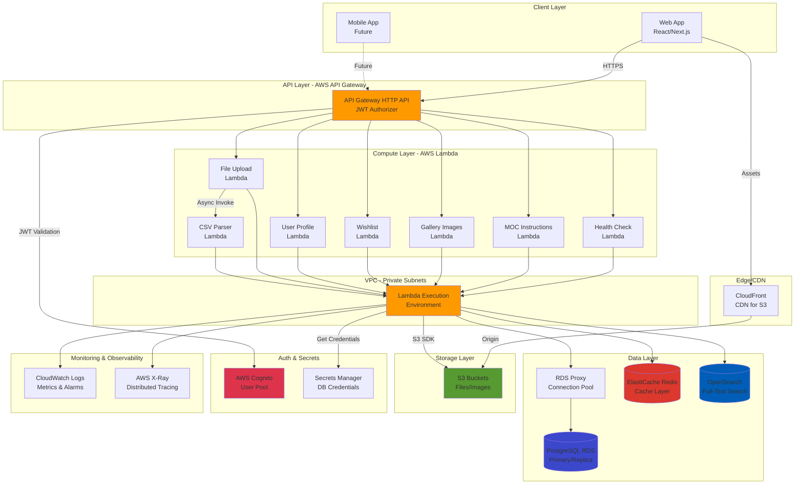
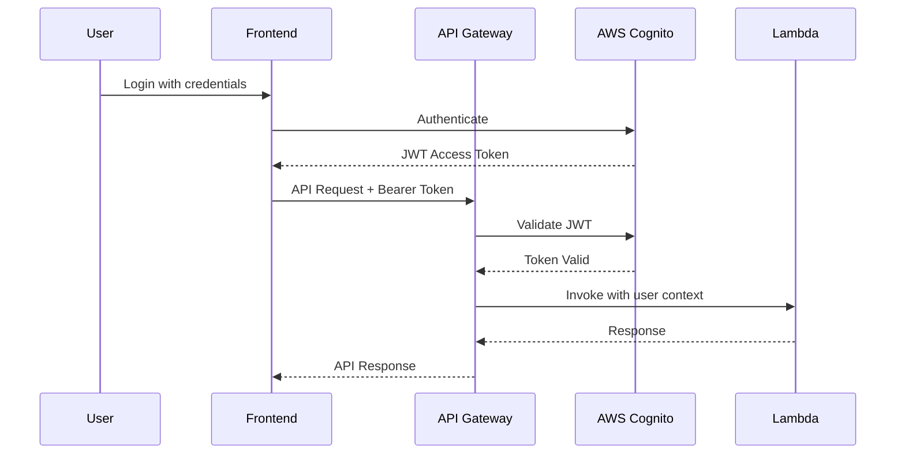

# LEGO Projects API - SST Serverless Migration Architecture

## Introduction

This architecture document defines the complete technical implementation for migrating the LEGO Projects API from ECS Fargate to AWS Lambda using SST v3 (Ion). It provides detailed specifications for Lambda functions, infrastructure components, data flows, and integration patterns to guide AI-driven development.

### Migration Context

**Current State**: Express.js API running on ECS Fargate with PostgreSQL (RDS), Redis (ElastiCache), OpenSearch, and S3.

**Target State**: Serverless architecture using AWS Lambda with API Gateway HTTP API, maintaining the same external interfaces while leveraging serverless benefits (cost reduction, auto-scaling, improved developer experience).

### Change Log

| Date | Version | Description | Author |
|------|---------|-------------|--------|
| 2025-11-02 | 1.0 | Initial architecture document for SST migration | Winston (Architect Agent) |

---

## High-Level Architecture

### Technical Summary

The migrated architecture transforms the existing Express.js monolith into discrete Lambda functions exposed via API Gateway HTTP API (v2), leveraging SST v3 (Ion) for infrastructure as code. Each API route becomes a focused Lambda function handler, sharing business logic through extracted service modules. RDS Proxy enables efficient database connection pooling for the serverless execution model, while VPC networking maintains secure access to PostgreSQL, Redis, and OpenSearch. The architecture preserves all existing functionality including file uploads (S3), image processing (Sharp in Lambda), caching (Redis), search (OpenSearch), and authentication (AWS Cognito JWT), ensuring 100% backward compatibility with frontend clients. SST's resource linking eliminates hardcoded configuration, providing type-safe runtime access to infrastructure values across all Lambda functions.

### Platform and Infrastructure Choice

**Platform**: AWS Serverless Stack
**Key Services**:
- **Compute**: AWS Lambda (Node.js 20 runtime)
- **API Layer**: API Gateway HTTP API (v2) with JWT authorizer
- **Database**: Amazon RDS PostgreSQL 15 with RDS Proxy
- **Caching**: Amazon ElastiCache Redis 7.x
- **Search**: Amazon OpenSearch 2.x
- **Storage**: Amazon S3 with CloudFront (optional CDN)
- **Authentication**: AWS Cognito (existing, no changes)
- **Secrets**: AWS Secrets Manager + Systems Manager Parameter Store
- **Networking**: VPC with private subnets, NAT Gateway, VPC endpoints
- **Monitoring**: CloudWatch Logs, X-Ray, CloudWatch Metrics & Alarms
- **IaC**: SST v3 (Ion) built on Pulumi

**Deployment Host and Regions**: us-east-1 (primary), multi-AZ for RDS/OpenSearch in production

### Repository Structure

**Structure**: Monorepo (existing Turborepo)
**SST Project Location**: `/apps/api/lego-api-serverless/`
**Package Organization**:
- Shared packages continue to be reused (`@monorepo/file-validator`, `@repo/upload`)
- Lambda functions live in `/apps/api/lego-api-serverless/src/functions/`
- Shared business logic extracted to `/apps/api/lego-api-serverless/src/lib/`
- SST infrastructure defined in `/apps/api/lego-api-serverless/sst.config.ts`

### High-Level Architecture Diagram



### Architectural Patterns

- **Serverless Architecture**: Event-driven Lambda functions with API Gateway - _Rationale:_ Eliminates server management, provides automatic scaling, and reduces costs by paying only for actual compute time used.

- **Microservices (Lambda Functions)**: Each API domain (MOCs, Gallery, Wishlist, Profile) has dedicated Lambda functions - _Rationale:_ Enables independent scaling and deployment of API endpoints based on usage patterns.

- **Backend for Frontend (BFF)**: API Gateway as single entry point with domain-specific Lambda backends - _Rationale:_ Centralizes authentication, CORS, rate limiting while allowing specialized Lambda implementations.

- **Connection Pooling via RDS Proxy**: All database connections route through RDS Proxy - _Rationale:_ Solves serverless connection pooling challenges by maintaining persistent connections to PostgreSQL.

- **Repository Pattern**: Data access abstraction in shared libraries - _Rationale:_ Enables testability, maintainability, and potential database migration flexibility.

- **Cache-Aside Pattern**: Redis caching with explicit invalidation on mutations - _Rationale:_ Reduces database load and improves response times for frequently accessed data.

- **Circuit Breaker Pattern**: Graceful degradation when Redis/OpenSearch unavailable - _Rationale:_ Maintains core functionality even when auxiliary services fail.

- **Event-Driven Processing**: S3 events trigger asynchronous Lambda for CSV parsing - _Rationale:_ Decouples heavy processing from API request lifecycle, preventing timeouts.

---

## Tech Stack

### Technology Stack Table

| Category | Technology | Version | Purpose | Rationale |
|----------|-----------|---------|---------|-----------|
| Infrastructure as Code | SST (Ion) | 3.x | Serverless infrastructure definition | Type-safe IaC with Pulumi backend, unified dev/deploy experience, resource linking |
| IaC Backend | Pulumi | Latest | Cloud resource provisioning | 150+ providers, mature state management, SST v3 foundation |
| Runtime | Node.js | 20 LTS | Lambda execution environment | Matches existing API, fast cold starts, native async/await, ES modules support |
| API Gateway | AWS API Gateway HTTP API | v2 | REST API endpoint management | Lower cost than REST API v1, improved performance, simpler pricing |
| Compute | AWS Lambda | Latest | Serverless function execution | Auto-scaling, pay-per-use, no server management, millisecond billing |
| Language | TypeScript | 5.8+ | Lambda function development | Type safety, matches existing codebase, shared types with frontend |
| ORM | Drizzle ORM | 0.44+ | Database query builder | Lightweight, PostgreSQL-focused, excellent TypeScript support, existing schemas |
| Validation | Zod | 4.0+ | Runtime type validation | Schema-based validation, TypeScript integration, existing patterns |
| Database | PostgreSQL | 15 | Relational data storage | Existing database, mature JSON support, full-text search capabilities |
| Database Proxy | AWS RDS Proxy | Latest | Connection pooling | Mandatory for Lambda-RDS connectivity, manages connection lifecycle |
| Cache | ElastiCache Redis | 7.x | Query result caching | Fast in-memory cache, reduces database load, supports TTL |
| Search Engine | AWS OpenSearch | 2.x | Full-text search indexing | Elasticsearch compatibility, managed service, JSON document store |
| File Storage | AWS S3 | Latest | Object storage for uploads | Scalable, durable, cost-effective, existing file storage |
| Image Processing | Sharp | 0.34+ | Image optimization/resizing | Fast, memory-efficient, supports WebP conversion |
| Authentication | AWS Cognito | Latest | User authentication | Existing auth provider, JWT tokens, no changes required |
| Secrets Management | AWS Secrets Manager | Latest | Database credentials | Automatic rotation, IAM-based access |
| Lambda Bundler | esbuild | Latest (via SST) | JavaScript bundling | Ultra-fast builds, tree-shaking, automatic via SST |
| Testing Framework | Vitest | Latest | Unit/integration tests | Fast, Vite-based, existing monorepo standard |
| E2E Testing | Playwright | Latest | End-to-end testing | Existing E2E framework, cross-browser support |
| API Testing | Supertest | 7.x | Lambda handler testing | HTTP assertions, integration test support |
| Logging | Pino | 9.x | Structured logging | Fast, JSON logging, existing standard |
| Monitoring | AWS CloudWatch | Latest | Logs, metrics, alarms | Native AWS integration, Lambda default |
| Tracing | AWS X-Ray | Latest | Distributed tracing | Service map visualization, performance insights |
| CI/CD | GitHub Actions | Latest | Automated deployments | Existing monorepo CI/CD, OIDC auth to AWS |
| Package Manager | pnpm | 9.x | Dependency management | Existing monorepo standard, fast installs |

---

## Data Models

The existing data models from the Express API remain unchanged. All Drizzle schema definitions are preserved and migrated to the SST project.

### Core Entities

#### Gallery Image

**Purpose**: Represents user-uploaded images of LEGO builds with metadata and organizational features.

**Key Attributes**:
- `id`: UUID - Primary identifier
- `userId`: String - Cognito user ID (sub claim)
- `title`: String - Image title
- `description`: String (optional) - Descriptive text
- `tags`: String[] - Searchable tags
- `imageUrl`: String - S3 URL to full-size image
- `thumbnailUrl`: String - S3 URL to thumbnail
- `albumId`: UUID (optional) - Reference to gallery album
- `flagged`: Boolean - Moderation flag
- `createdAt`: Timestamp - Creation date
- `lastUpdatedAt`: Timestamp - Last modification date

**TypeScript Interface**:
```typescript
export interface GalleryImage {
  id: string;
  userId: string;
  title: string;
  description?: string;
  tags?: string[];
  imageUrl: string;
  thumbnailUrl?: string;
  albumId?: string;
  flagged: boolean;
  createdAt: Date;
  lastUpdatedAt: Date;
}
```

**Relationships**:
- Belongs to one Gallery Album (optional)
- Can have multiple Gallery Flags
- Can be linked to MOC Instructions via join table

#### MOC Instruction

**Purpose**: Represents a LEGO MOC (My Own Creation) or official Set with associated files and metadata.

**Key Attributes**:
- `id`: UUID - Primary identifier
- `userId`: String - Cognito user ID (owner)
- `title`: String - MOC/Set title (unique per user)
- `description`: String (optional) - Build description
- `type`: Enum('moc', 'set') - Build type
- `author`: String (optional) - MOC designer name
- `partsCount`: Integer (optional) - Estimated part count
- `theme`: String (optional) - LEGO theme (City, Star Wars, etc.)
- `subtheme`: String (optional) - Subtheme category
- `brand`: String (optional) - 'LEGO' for official sets
- `setNumber`: String (optional) - Set/MOC number
- `releaseYear`: Integer (optional) - Set release year
- `retired`: Boolean (optional) - Set retirement status
- `tags`: String[] - Searchable tags
- `thumbnailUrl`: String (optional) - Cover image URL
- `totalPieceCount`: Integer - Sum of all parts list pieces
- `createdAt`: Timestamp
- `updatedAt`: Timestamp

**TypeScript Interface**:
```typescript
export interface MOCInstruction {
  id: string;
  userId: string;
  title: string;
  description?: string;
  type: 'moc' | 'set';
  // MOC-specific
  author?: string;
  partsCount?: number;
  theme?: string;
  subtheme?: string;
  uploadedDate?: Date;
  // Set-specific
  brand?: string;
  setNumber?: string;
  releaseYear?: number;
  retired?: boolean;
  // Common
  tags?: string[];
  thumbnailUrl?: string;
  totalPieceCount?: number;
  createdAt: Date;
  updatedAt: Date;
}
```

**Relationships**:
- Has many MOC Files (instruction PDFs, parts lists)
- Can be linked to many Gallery Images via join table
- Has many Parts Lists

#### Wishlist Item

**Purpose**: User's wish list entry for desired LEGO sets or MOCs.

**Key Attributes**:
- `id`: UUID - Primary identifier
- `userId`: String - Cognito user ID
- `title`: String - Item title
- `description`: String (optional) - Item description
- `productLink`: String (optional) - URL to product page
- `imageUrl`: String (optional) - Product image
- `category`: String (optional) - LEGO category
- `sortOrder`: String - User-defined sort position
- `createdAt`: Timestamp
- `updatedAt`: Timestamp

**TypeScript Interface**:
```typescript
export interface WishlistItem {
  id: string;
  userId: string;
  title: string;
  description?: string;
  productLink?: string;
  imageUrl?: string;
  category?: string;
  sortOrder: string;
  createdAt: Date;
  updatedAt: Date;
}
```

**Relationships**:
- Belongs to User (via userId)

#### User Profile (Cognito)

**Purpose**: User account information stored in AWS Cognito.

**Note**: User data lives in Cognito User Pool, not PostgreSQL.

**Key Attributes** (Cognito Standard Attributes):
- `sub`: String - Unique Cognito user ID
- `email`: String - User email (verified)
- `name`: String (optional) - Display name
- `picture`: String (optional) - Avatar S3 URL

**TypeScript Interface**:
```typescript
export interface UserProfile {
  sub: string; // Cognito user ID
  email: string;
  name?: string;
  picture?: string; // Avatar URL
  // Aggregated stats (computed)
  stats?: {
    totalMOCs: number;
    totalImages: number;
    totalWishlistItems: number;
  };
}
```

**Relationships**:
- Implicit ownership of Gallery Images (via userId)
- Implicit ownership of MOC Instructions (via userId)
- Implicit ownership of Wishlist Items (via userId)

---

## API Specification

The migrated API maintains 100% backward compatibility with the existing Express.js API. All endpoints, request/response formats, and authentication mechanisms remain unchanged from the client perspective.

### API Style: REST (HTTP JSON API)

### Base URLs

- **Development**: `https://dev-api.lego-moc.example.com`
- **Staging**: `https://staging-api.lego-moc.example.com`
- **Production**: `https://api.lego-moc.example.com`

### Authentication

**Method**: JWT Bearer Token (AWS Cognito)

**Header**: `Authorization: Bearer <jwt-token>`

**Alternative**: Cookie-based auth (`token` cookie)

**Token Claims**:
- `sub`: Cognito user ID
- `email`: User email
- `iss`: Token issuer (Cognito User Pool)
- `exp`: Expiration timestamp

### OpenAPI 3.0 Specification (Core Endpoints)

```yaml
openapi: 3.0.0
info:
  title: LEGO Projects API - Serverless
  version: 2.0.0
  description: Serverless RESTful API for managing LEGO MOC instructions, gallery images, and wishlists
servers:
  - url: https://api.lego-moc.example.com
    description: Production
  - url: https://staging-api.lego-moc.example.com
    description: Staging

security:
  - BearerAuth: []

paths:
  /health:
    get:
      summary: Health check endpoint
      operationId: healthCheck
      security: []
      responses:
        '200':
          description: Service is healthy
          content:
            application/json:
              schema:
                type: object
                properties:
                  status:
                    type: string
                    enum: [healthy, degraded, unhealthy]
                  service:
                    type: string
                  components:
                    type: object
                    properties:
                      database:
                        type: string
                        enum: [healthy, unhealthy]
                      redis:
                        type: string
                        enum: [healthy, unhealthy]
                      opensearch:
                        type: string
                        enum: [healthy, unhealthy]

  /api/mocs:
    get:
      summary: List all MOC instructions for authenticated user
      operationId: listMOCs
      parameters:
        - name: page
          in: query
          schema:
            type: integer
            default: 1
        - name: limit
          in: query
          schema:
            type: integer
            default: 20
        - name: search
          in: query
          schema:
            type: string
        - name: tag
          in: query
          schema:
            type: string
      responses:
        '200':
          description: List of MOCs
          content:
            application/json:
              schema:
                type: object
                properties:
                  success:
                    type: boolean
                  data:
                    type: array
                    items:
                      $ref: '#/components/schemas/MOCInstruction'
                  total:
                    type: integer
                  page:
                    type: integer
    post:
      summary: Create a new MOC instruction
      operationId: createMOC
      requestBody:
        required: true
        content:
          application/json:
            schema:
              type: object
              required:
                - title
                - type
              properties:
                title:
                  type: string
                type:
                  type: string
                  enum: [moc, set]
                description:
                  type: string
                author:
                  type: string
                partsCount:
                  type: integer
                theme:
                  type: string
      responses:
        '201':
          description: MOC created successfully
          content:
            application/json:
              schema:
                type: object
                properties:
                  success:
                    type: boolean
                  data:
                    $ref: '#/components/schemas/MOCInstruction'

  /api/mocs/{id}:
    get:
      summary: Get MOC instruction details
      operationId: getMOC
      parameters:
        - name: id
          in: path
          required: true
          schema:
            type: string
            format: uuid
      responses:
        '200':
          description: MOC details
          content:
            application/json:
              schema:
                type: object
                properties:
                  success:
                    type: boolean
                  data:
                    $ref: '#/components/schemas/MOCInstructionDetail'
    patch:
      summary: Update MOC instruction
      operationId: updateMOC
      parameters:
        - name: id
          in: path
          required: true
          schema:
            type: string
            format: uuid
      requestBody:
        content:
          application/json:
            schema:
              type: object
              properties:
                title:
                  type: string
                description:
                  type: string
      responses:
        '200':
          description: MOC updated
    delete:
      summary: Delete MOC instruction
      operationId: deleteMOC
      parameters:
        - name: id
          in: path
          required: true
          schema:
            type: string
            format: uuid
      responses:
        '200':
          description: MOC deleted

  /api/images:
    post:
      summary: Upload a gallery image
      operationId: uploadImage
      requestBody:
        required: true
        content:
          multipart/form-data:
            schema:
              type: object
              required:
                - image
              properties:
                image:
                  type: string
                  format: binary
                title:
                  type: string
                description:
                  type: string
                tags:
                  type: array
                  items:
                    type: string
                albumId:
                  type: string
                  format: uuid
      responses:
        '201':
          description: Image uploaded successfully

components:
  securitySchemes:
    BearerAuth:
      type: http
      scheme: bearer
      bearerFormat: JWT

  schemas:
    MOCInstruction:
      type: object
      required:
        - id
        - userId
        - title
        - type
      properties:
        id:
          type: string
          format: uuid
        userId:
          type: string
        title:
          type: string
        description:
          type: string
        type:
          type: string
          enum: [moc, set]
        thumbnailUrl:
          type: string
        createdAt:
          type: string
          format: date-time
        updatedAt:
          type: string
          format: date-time

    MOCInstructionDetail:
      allOf:
        - $ref: '#/components/schemas/MOCInstruction'
        - type: object
          properties:
            files:
              type: array
              items:
                type: object
            images:
              type: array
              items:
                type: object
            partsLists:
              type: array
              items:
                type: object
```

*(Full OpenAPI spec available in `docs/openapi.yaml` after migration)*

---

## Lambda Functions Specification

### Function Organization Strategy

Lambda functions are organized by API domain with one function per primary resource type. Each function handles multiple HTTP methods for its resource using a route-based handler pattern.

### Shared Lambda Configuration

**Runtime**: Node.js 20.x
**Architecture**: arm64 (Graviton2 for cost/performance)
**VPC**: Enabled for database access
**Tracing**: AWS X-Ray enabled
**Environment Variables** (injected via SST Resource):
- `POSTGRES_HOST`: From `Resource.MyPostgres.host`
- `POSTGRES_PORT`: From `Resource.MyPostgres.port`
- `REDIS_ENDPOINT`: From `Resource.MyRedis.endpoint`
- `OPENSEARCH_ENDPOINT`: From `Resource.MyOpenSearch.endpoint`
- `S3_BUCKET`: From `Resource.MyBucket.name`
- `NODE_ENV`: `production`

### Lambda Layer Strategy

**Shared Dependencies Layer**:
- Sharp (image processing)
- Drizzle ORM
- AWS SDK v3 clients
- Zod
- Common utilities

**Size Optimization**: Layer reduces individual function bundle sizes from ~50MB to ~5MB.

---

### 1. Health Check Lambda

**Function Name**: `lego-api-health-{stage}`
**Handler**: `src/functions/health.handler`
**Memory**: 512 MB
**Timeout**: 10 seconds
**Concurrency**: Reserved 5 (always warm)

**Purpose**: Validates connectivity to PostgreSQL, Redis, and OpenSearch. Provides service status for monitoring and load balancing.

**API Routes**:
- `GET /health`

**Dependencies**:
- PostgreSQL via RDS Proxy
- Redis client
- OpenSearch client

**Response Format**:
```typescript
{
  status: 'healthy' | 'degraded' | 'unhealthy',
  service: 'lego-projects-api',
  components: {
    database: 'healthy' | 'unhealthy',
    redis: 'healthy' | 'unhealthy',
    opensearch: 'healthy' | 'unhealthy'
  },
  timestamp: string
}
```

**Error Handling**: Returns `degraded` if Redis or OpenSearch unavailable but PostgreSQL healthy. Returns `unhealthy` if PostgreSQL unavailable.

---

### 2. MOC Instructions Lambda

**Function Name**: `lego-api-mocs-{stage}`
**Handler**: `src/functions/mocs.handler`
**Memory**: 1024 MB
**Timeout**: 30 seconds
**Concurrency**: Auto-scale (no reservation)

**Purpose**: Handles all CRUD operations for MOC instructions including search, file associations, and parts lists.

**API Routes**:
- `GET /api/mocs` - List user's MOCs with pagination and search
- `GET /api/mocs/{id}` - Retrieve MOC details with relationships
- `POST /api/mocs` - Create new MOC
- `PATCH /api/mocs/{id}` - Update MOC metadata
- `DELETE /api/mocs/{id}` - Delete MOC and cascade to files

**Dependencies**:
- PostgreSQL (Drizzle ORM)
- Redis (caching)
- OpenSearch (search indexing)
- S3 (file deletion on MOC delete)

**Caching Strategy**:
- List queries: 5 min TTL, key pattern `moc:user:{userId}:list:{page}:{limit}`
- Detail queries: 10 min TTL, key pattern `moc:detail:{mocId}`
- Invalidation: On create, update, delete operations

**Search Integration**:
- Full-text search via OpenSearch on `title`, `description`, `tags`
- Fallback to PostgreSQL `ILIKE` if OpenSearch unavailable
- Fuzzy matching enabled (typo tolerance)

**Business Logic**:
- Enforce unique title per user (database constraint)
- Type-specific validation (MOC requires `author`, Set requires `brand`)
- Cascade delete to `mocFiles`, `mocGalleryImages`, `mocPartsLists`

---

### 3. Gallery Images Lambda

**Function Name**: `lego-api-gallery-{stage}`
**Handler**: `src/functions/gallery.handler`
**Memory**: 2048 MB (for Sharp image processing)
**Timeout**: 60 seconds
**Concurrency**: Auto-scale

**Purpose**: Manages gallery images including upload with Sharp processing, CRUD operations, album management, and search.

**API Routes**:
- `GET /api/images` - List standalone images
- `GET /api/images/{id}` - Get image details
- `POST /api/images` - Upload and process image
- `PATCH /api/images/{id}` - Update metadata
- `DELETE /api/images/{id}` - Delete image and S3 objects
- `GET /api/albums` - List user's albums
- `GET /api/albums/{id}` - Get album with images
- `POST /api/albums` - Create album
- `PATCH /api/albums/{id}` - Update album
- `DELETE /api/albums/{id}` - Delete album (images stay)

**Dependencies**:
- PostgreSQL (image metadata)
- Redis (caching)
- OpenSearch (image search)
- S3 (image storage)
- Sharp (image processing)

**Image Processing Pipeline**:
1. Validate file (type, size via `@monorepo/file-validator`)
2. Sharp resize to max 2048px width, quality 80%, convert to WebP
3. Generate thumbnail (400px width)
4. Upload full image to S3: `images/{userId}/{uuid}.webp`
5. Upload thumbnail to S3: `images/{userId}/thumbnails/{uuid}.webp`
6. Store metadata in PostgreSQL
7. Index in OpenSearch
8. Invalidate Redis cache

**Caching Strategy**:
- Image lists: 5 min TTL
- Image details: 10 min TTL
- Album lists: 5 min TTL
- Album details: 10 min TTL

---

### 4. Wishlist Lambda

**Function Name**: `lego-api-wishlist-{stage}`
**Handler**: `src/functions/wishlist.handler`
**Memory**: 1024 MB
**Timeout**: 30 seconds
**Concurrency**: Auto-scale

**Purpose**: Handles wishlist CRUD operations, image uploads, category filtering, and reordering.

**API Routes**:
- `GET /api/wishlist` - List user's wishlist items
- `GET /api/wishlist/{id}` - Get item details
- `POST /api/wishlist` - Create wishlist item
- `PATCH /api/wishlist/{id}` - Update item
- `DELETE /api/wishlist/{id}` - Delete item
- `POST /api/wishlist/reorder` - Batch update sort order
- `POST /api/wishlist/{id}/image` - Upload item image

**Dependencies**:
- PostgreSQL
- Redis (caching)
- OpenSearch (search)
- S3 (item images)
- Sharp (image processing for uploads)

**Image Processing** (for wishlist images):
- Resize to max 800px, optimize, convert to WebP
- Store at `wishlist/{userId}/{itemId}.webp`

**Caching Strategy**:
- Wishlist list: 5 min TTL, key `wishlist:user:{userId}:all`
- Invalidation on create, update, delete, reorder

---

### 5. User Profile Lambda

**Function Name**: `lego-api-profile-{stage}`
**Handler**: `src/functions/profile.handler`
**Memory**: 1024 MB
**Timeout**: 30 seconds
**Concurrency**: Auto-scale

**Purpose**: Manages user profile data from Cognito including avatar uploads and aggregated statistics.

**API Routes**:
- `GET /api/users/{id}` - Get user profile
- `PATCH /api/users/{id}` - Update profile (name)
- `POST /api/users/{id}/avatar` - Upload avatar
- `DELETE /api/users/{id}/avatar` - Remove avatar

**Dependencies**:
- AWS Cognito (user attributes via Admin APIs)
- PostgreSQL (aggregated stats queries)
- Redis (profile caching)
- S3 (avatar storage)
- Sharp (avatar processing)

**Avatar Processing**:
- Crop to square (1:1 aspect ratio)
- Resize to 256x256
- Optimize and convert to WebP
- Store at `avatars/{userId}/avatar.webp` (overwrites previous)
- Update Cognito `picture` attribute

**Profile Aggregation**:
- Query PostgreSQL for counts: total MOCs, gallery images, wishlist items
- Combine with Cognito attributes
- Cache for 10 minutes

---

### 6. File Upload Lambda

**Function Name**: `lego-api-upload-{stage}`
**Handler**: `src/functions/upload.handler`
**Memory**: 2048 MB
**Timeout**: 120 seconds
**Concurrency**: Auto-scale

**Purpose**: Handles file uploads for MOC instructions, parts lists, and multi-file uploads with validation and virus scanning.

**API Routes**:
- `POST /api/mocs/{id}/files` - Upload MOC files (PDF, XML, CSV)
- `POST /api/mocs/{id}/upload-parts-list` - Upload CSV parts list

**Dependencies**:
- PostgreSQL
- S3 (file storage)
- `@monorepo/file-validator` (validation)
- CSV parser (for parts lists)

**File Upload Flow**:
1. Parse multipart form data (using `busboy` or `formidable`)
2. Validate file type, size (max 10MB per file)
3. Virus scan (optional: ClamAV Lambda layer or S3 + Lambda trigger)
4. Upload to S3: `mocs/{userId}/{mocId}/{uuid}.{ext}`
5. Insert record into `mocFiles` table
6. For CSV: Invoke CSV Parser Lambda asynchronously
7. Return file metadata to client

**Multi-File Support**: Accepts up to 10 files per request, processes in parallel using `Promise.all()`.

---

### 7. CSV Parser Lambda

**Function Name**: `lego-api-csv-parser-{stage}`
**Handler**: `src/functions/parse-csv.handler`
**Memory**: 512 MB
**Timeout**: 300 seconds (5 minutes)
**Concurrency**: Auto-scale
**Invocation**: Asynchronous (invoked by File Upload Lambda)

**Purpose**: Parses CSV parts lists for MOCs, validates data, and stores in `mocPartsLists` table.

**Trigger**: Invoked asynchronously by File Upload Lambda with S3 key

**Dependencies**:
- S3 (read CSV file)
- PostgreSQL (insert parts list)
- `csv-parser` library

**CSV Processing Flow**:
1. Receive S3 key and MOC ID from event
2. Stream CSV file from S3
3. Parse CSV rows (expected columns: Part ID, Part Name, Quantity, Color)
4. Validate each row (required fields, data types)
5. Aggregate total parts count
6. Insert batch into `mocPartsLists` table in transaction
7. Update MOC's `totalPieceCount` field
8. Log results to CloudWatch

**Error Handling**: Malformed CSV or validation errors logged; partial success handled gracefully.

---

### Lambda IAM Roles

Each Lambda function has a dedicated IAM role with least-privilege permissions:

**Common Permissions** (all Lambdas):
- `logs:CreateLogGroup`, `logs:CreateLogStream`, `logs:PutLogEvents` (CloudWatch)
- `xray:PutTraceSegments`, `xray:PutTelemetryRecords` (X-Ray)
- `ec2:CreateNetworkInterface`, `ec2:DescribeNetworkInterfaces`, `ec2:DeleteNetworkInterface` (VPC)

**Database Access Lambdas** (MOC, Gallery, Wishlist, Profile, Health):
- `secretsmanager:GetSecretValue` (RDS credentials)
- `rds-db:connect` (RDS Proxy)

**S3 Access Lambdas** (Gallery, Wishlist, Profile, Upload):
- `s3:PutObject`, `s3:GetObject`, `s3:DeleteObject` on `lego-moc-files-{stage}` bucket

**Cognito Access Lambda** (Profile):
- `cognito-idp:AdminGetUser`, `cognito-idp:AdminUpdateUserAttributes`

**Lambda Invocation** (Upload Lambda):
- `lambda:InvokeFunction` for CSV Parser Lambda

---

## Database Architecture

### Connection Strategy

**RDS Proxy Configuration**:
- **Max Connections**: 100 (configurable per environment)
- **Connection Borrowing Timeout**: 30 seconds
- **Idle Timeout**: 1800 seconds (30 minutes)
- **IAM Authentication**: Enabled for Lambda roles

**Connection Pooling in Lambda**:
- Drizzle client initialized outside handler (reused across invocations)
- Connection lazily established on first query
- Lambda execution context reuse leverages warm connections
- RDS Proxy manages connection lifecycle

**Example Connection Setup**:
```typescript
// src/lib/db.ts
import { drizzle } from 'drizzle-orm/node-postgres';
import { Pool } from 'pg';
import { Resource } from 'sst';

// Initialize pool outside handler for connection reuse
const pool = new Pool({
  host: Resource.MyPostgres.host,
  port: Resource.MyPostgres.port,
  database: Resource.MyPostgres.database,
  user: Resource.MyPostgres.username,
  password: Resource.MyPostgres.password,
  max: 1, // Lambda concurrency = 1, single connection per container
  idleTimeoutMillis: 30000,
  connectionTimeoutMillis: 10000,
});

export const db = drizzle(pool);
```

### Database Schema

The schema is unchanged from the existing Express API. All Drizzle definitions are migrated as-is.

**Tables**:
- `gallery_images`
- `gallery_albums`
- `gallery_flags`
- `moc_instructions`
- `moc_files`
- `moc_gallery_images` (join table)
- `moc_gallery_albums` (join table)
- `moc_parts_lists`
- `wishlist_items`

**Migration Strategy**:
- Existing database and schema remain in place
- No data migration required
- SST project includes Drizzle migration runner
- Migrations applied during SST deployment via `DevCommand` or deploy hook

---

## Caching Architecture

### Redis Configuration

**ElastiCache Redis**:
- **Node Type**: cache.t4g.micro (dev), cache.r6g.large (production)
- **Cluster Mode**: Disabled (dev), enabled (production with 2-3 shards)
- **Persistence**: AOF enabled in production
- **Maxmemory Policy**: `allkeys-lru` (evict least recently used)

### Cache Patterns

**Cache-Aside Pattern** (read-through):
```typescript
async function getOrSetCache<T>(key: string, fetchFn: () => Promise<T>, ttl: number): Promise<T> {
  const cached = await redisClient.get(key);
  if (cached) return JSON.parse(cached);

  const fresh = await fetchFn();
  await redisClient.setex(key, ttl, JSON.stringify(fresh));
  return fresh;
}
```

**Cache Invalidation** (write-through):
```typescript
async function invalidateCache(pattern: string): Promise<void> {
  const keys = await redisClient.keys(pattern);
  if (keys.length > 0) {
    await redisClient.del(...keys);
  }
}
```

### Cache Key Patterns

**MOC Instructions**:
- List: `moc:user:{userId}:list:{page}:{limit}:{search?}:{tag?}`
- Detail: `moc:detail:{mocId}`
- Invalidation: `moc:user:{userId}:*` on mutations

**Gallery Images**:
- List: `gallery:images:user:{userId}:{page}:{limit}`
- Detail: `gallery:image:detail:{imageId}`
- Albums: `gallery:albums:user:{userId}`
- Album Detail: `gallery:album:detail:{albumId}`

**Wishlist**:
- List: `wishlist:user:{userId}:all`
- Detail: `wishlist:item:{itemId}`

**User Profile**:
- Profile: `profile:user:{userId}`

### Cache TTLs

- **Short (5 min)**: List queries (frequently updated)
- **Medium (10 min)**: Detail queries
- **Long (30 min)**: Aggregated statistics

### Graceful Degradation

If Redis is unavailable:
- Lambda logs warning
- Query proceeds directly to PostgreSQL
- Response still succeeds (no user-facing error)
- Cache write skipped

---

## Search Architecture

### OpenSearch Configuration

**Domain**:
- **Node Type**: t3.small.search (dev), r6g.large.search (production)
- **Node Count**: 1 (dev), 3 (production with dedicated master)
- **EBS Volume**: 20 GB (dev), 100 GB (production)
- **Fine-Grained Access Control**: Enabled with IAM-based authentication

### Index Definitions

**MOC Instructions Index**: `moc_instructions`

**Mappings**:
```json
{
  "mappings": {
    "properties": {
      "id": { "type": "keyword" },
      "userId": { "type": "keyword" },
      "title": {
        "type": "text",
        "analyzer": "standard",
        "fields": { "keyword": { "type": "keyword" } }
      },
      "description": { "type": "text", "analyzer": "standard" },
      "tags": {
        "type": "keyword",
        "fields": { "text": { "type": "text", "analyzer": "standard" } }
      },
      "type": { "type": "keyword" },
      "createdAt": { "type": "date" },
      "updatedAt": { "type": "date" }
    }
  }
}
```

**Gallery Images Index**: `gallery_images`
**Wishlist Items Index**: `wishlist_items`

### Indexing Strategy

**Async Indexing**:
- After successful database write, index document in OpenSearch
- Non-blocking operation (errors logged but don't fail request)
- Eventual consistency acceptable

**Bulk Indexing** (for initial migration):
- SST deployment task or one-time script
- Stream existing data from PostgreSQL
- Bulk insert to OpenSearch indices

### Search Query Pattern

**Multi-Match Query**:
```json
{
  "query": {
    "bool": {
      "must": [
        { "term": { "userId": "user-123" } },
        {
          "multi_match": {
            "query": "search term",
            "fields": ["title^3", "description", "tags^2"],
            "fuzziness": "AUTO",
            "type": "best_fields"
          }
        }
      ]
    }
  },
  "sort": [{ "_score": { "order": "desc" } }, { "updatedAt": { "order": "desc" } }]
}
```

### Fallback to PostgreSQL

If OpenSearch unavailable or query fails:
```typescript
async function searchMOCs(userId: string, query: string) {
  try {
    return await searchOpenSearch(userId, query);
  } catch (error) {
    logger.warn('OpenSearch unavailable, falling back to PostgreSQL');
    return await searchPostgreSQL(userId, query);
  }
}

async function searchPostgreSQL(userId: string, query: string) {
  return await db
    .select()
    .from(mocInstructions)
    .where(
      and(
        eq(mocInstructions.userId, userId),
        or(
          ilike(mocInstructions.title, `%${query}%`),
          ilike(mocInstructions.description, `%${query}%`)
        )
      )
    );
}
```

---

## Security Model

### Authentication Flow



### API Gateway JWT Authorizer

**Configuration**:
- **Issuer**: Cognito User Pool URL
- **Audience**: Cognito App Client ID
- **Token Location**: `Authorization` header or `token` cookie
- **Claims Mapping**: `sub` → `requestContext.authorizer.jwt.claims.sub`

**Lambda Access to User ID**:
```typescript
export const handler = async (event: APIGatewayProxyEventV2) => {
  const userId = event.requestContext.authorizer?.jwt.claims.sub;
  // Use userId for authorization checks
};
```

### IAM Roles and Policies

**Lambda Execution Role** (example for MOC Lambda):
```json
{
  "Version": "2012-10-17",
  "Statement": [
    {
      "Effect": "Allow",
      "Action": [
        "logs:CreateLogGroup",
        "logs:CreateLogStream",
        "logs:PutLogEvents"
      ],
      "Resource": "arn:aws:logs:*:*:*"
    },
    {
      "Effect": "Allow",
      "Action": [
        "ec2:CreateNetworkInterface",
        "ec2:DescribeNetworkInterfaces",
        "ec2:DeleteNetworkInterface"
      ],
      "Resource": "*"
    },
    {
      "Effect": "Allow",
      "Action": ["secretsmanager:GetSecretValue"],
      "Resource": "arn:aws:secretsmanager:*:*:secret:lego-api-db-*"
    },
    {
      "Effect": "Allow",
      "Action": ["rds-db:connect"],
      "Resource": "arn:aws:rds-db:*:*:dbuser:*/*"
    },
    {
      "Effect": "Allow",
      "Action": ["s3:PutObject", "s3:GetObject", "s3:DeleteObject"],
      "Resource": "arn:aws:s3:::lego-moc-files-*/*"
    }
  ]
}
```

### Secrets Management

**Database Credentials**:
- Stored in AWS Secrets Manager: `lego-api-db-credentials-{stage}`
- Automatic rotation enabled (30 days)
- Accessed by Lambda via `secretsmanager:GetSecretValue`
- Injected into Lambda environment via SST Resource

**Other Secrets**:
- JWT Secret (if needed for CSRF): Systems Manager Parameter Store (SecureString)
- API keys for external services: Secrets Manager

### CORS Configuration

**API Gateway CORS**:
```yaml
AllowOrigins:
  - https://app.lego-moc.example.com (production)
  - https://staging.lego-moc.example.com (staging)
  - http://localhost:3002 (development)
AllowMethods:
  - GET
  - POST
  - PATCH
  - DELETE
  - OPTIONS
AllowHeaders:
  - Content-Type
  - Authorization
  - X-Requested-With
  - X-CSRF-Token
AllowCredentials: true
MaxAge: 3600
```

### Rate Limiting

**API Gateway Throttling**:
- **Burst Limit**: 500 requests
- **Rate Limit**: 1000 requests per second (account-level)

**Per-Route Throttling** (if needed):
- Upload endpoints: 100 requests/second
- Auth endpoints: 50 requests/second

**Future Enhancement**: AWS WAF for advanced rate limiting and DDoS protection.

### Input Validation

All Lambda functions validate inputs using Zod schemas:
```typescript
const createMOCSchema = z.object({
  title: z.string().min(1).max(200),
  type: z.enum(['moc', 'set']),
  description: z.string().optional(),
  author: z.string().optional(),
  partsCount: z.number().int().positive().optional(),
});

// In handler
const result = createMOCSchema.safeParse(JSON.parse(event.body));
if (!result.success) {
  return {
    statusCode: 400,
    body: JSON.stringify({ error: 'Validation failed', details: result.error.flatten() }),
  };
}
```

---

## Migration Strategy

### Blue/Green Deployment Plan

**Phase 1: Infrastructure Deployment** (Week 1)
- Deploy SST infrastructure to dev environment
- Provision VPC, RDS Proxy, Redis, OpenSearch
- Deploy Lambda functions
- Run integration tests against dev environment
- Validate all endpoints return expected responses

**Phase 2: Staging Deployment** (Week 2)
- Deploy to staging environment
- Run full E2E test suite (Playwright)
- Load testing with Artillery (100 RPS sustained, 500 RPS spike)
- Measure cold start times and response latency
- Validate cost projections against actual usage

**Phase 3: Production Deployment - 10% Traffic** (Week 3)
- Deploy Lambda stack to production
- Configure Route53 weighted routing: 10% Lambda, 90% ECS
- Monitor for 48 hours:
  - Error rates (<1% threshold)
  - Latency (p95 < 500ms threshold)
  - Cold start frequency
  - Database connection pool usage
- Rollback trigger: Error rate >2% or latency >1000ms p95

**Phase 4: Production Deployment - 50% Traffic** (Week 4)
- Increase Route53 weighting: 50% Lambda, 50% ECS
- Monitor for 72 hours with same metrics
- Validate auto-scaling behavior under increased load
- Check cost accumulation vs projections

**Phase 5: Production Deployment - 100% Traffic** (Week 5)
- Route53 weighting: 100% Lambda, 0% ECS
- Monitor for 7 days before decommissioning ECS
- Final validation of all metrics
- User acceptance testing

**Phase 6: ECS Decommission** (Week 6)
- Scale ECS tasks to 0
- Keep ECS infrastructure for 48 hours (emergency rollback)
- Delete ECS service, ALB, target groups
- Archive ECR images to S3 (90-day retention)
- Update DNS to point solely to API Gateway
- Celebrate cost savings! 🎉

### Rollback Procedure

If any phase exceeds error/latency thresholds:

1. **Immediate**: Shift Route53 to 100% ECS (takes <2 minutes)
2. Investigate Lambda CloudWatch logs and X-Ray traces
3. Identify root cause (cold starts, connection pool saturation, code bug)
4. Fix and redeploy to dev/staging for validation
5. Resume blue/green deployment from last stable phase

### Data Migration

**No Data Migration Required**: Existing PostgreSQL database remains in place. Lambda functions connect to the same RDS instance via RDS Proxy.

**OpenSearch Re-indexing**:
- One-time bulk indexing of existing data
- Script: `scripts/reindex-opensearch.ts`
- Executes during staging deployment as SST `DevCommand` or post-deploy hook

---

## Monitoring & Observability

### CloudWatch Dashboards

**Dashboard: LEGO-API-Serverless-{Stage}**

**Widgets**:

**Lambda Metrics** (per function):
- Invocations (total, success, errors, throttles)
- Duration (avg, p50, p95, p99, max)
- Concurrent Executions
- Cold Starts (custom metric)
- Error Rate (%)

**API Gateway Metrics**:
- Request Count
- 4xx Error Rate
- 5xx Error Rate
- Latency (p50, p95, p99)

**Database Metrics**:
- RDS Proxy Connections (active, idle, borrow latency)
- RDS CPU Utilization
- RDS Freeable Memory
- RDS Database Connections

**Cache Metrics**:
- Redis Cache Hit Rate (custom metric)
- Redis Memory Usage
- Redis Evictions

**Search Metrics**:
- OpenSearch Cluster Status
- OpenSearch Indexing Rate
- OpenSearch Search Latency

**Business KPIs** (custom metrics):
- MOCs Created (per hour)
- Images Uploaded (per hour)
- Searches Performed (per hour)

### CloudWatch Alarms

**Critical Alarms** (SNS → Email/Slack):
- Lambda Error Rate >5% (5 min window)
- API Gateway 5xx Error Rate >3% (5 min window)
- RDS CPU >80% (10 min window)
- OpenSearch Cluster Status RED
- Lambda Cold Start >2s (p99)

**Warning Alarms**:
- Lambda Throttles >10 (5 min window)
- API Gateway Latency >1s (p99)
- RDS Freeable Memory <1GB
- Redis Evictions >100/min

### AWS X-Ray Tracing

**Enabled for All Lambdas**: Active tracing with custom subsegments

**Instrumentation**:
```typescript
import { captureAWSv3Client } from 'aws-xray-sdk-core';
import { S3Client } from '@aws-sdk/client-s3';

const s3Client = captureAWSv3Client(new S3Client({}));

// Custom subsegments
import AWSXRay from 'aws-xray-sdk-core';

export const handler = async (event) => {
  const segment = AWSXRay.getSegment();
  const subsegment = segment.addNewSubsegment('DatabaseQuery');

  try {
    const result = await db.select().from(mocInstructions);
    subsegment.close();
    return result;
  } catch (error) {
    subsegment.addError(error);
    subsegment.close();
    throw error;
  }
};
```

**Service Map**: Visualizes request flow through API Gateway → Lambda → RDS/Redis/OpenSearch/S3

### Logging Strategy

**Structured JSON Logging** (Pino):
```typescript
import pino from 'pino';

const logger = pino({
  level: process.env.LOG_LEVEL || 'info',
  formatters: {
    level: (label) => ({ level: label }),
  },
});

logger.info({ userId, mocId, action: 'CREATE_MOC' }, 'MOC created successfully');
logger.error({ error, userId, requestId }, 'Failed to upload image');
```

**Log Aggregation**: CloudWatch Logs Insights for querying

**Sample Query** (find all errors for a user):
```
fields @timestamp, message, userId, error
| filter level = "error" and userId = "user-123"
| sort @timestamp desc
| limit 100
```

### Cost Monitoring

**AWS Cost Explorer Tags**:
- `Project: LEGO-API`
- `Environment: dev|staging|production`
- `Service: Lambda|RDS|Redis|OpenSearch|S3`

**Budget**: $200/month with 80% and 100% threshold alerts

**Cost Breakdown Tracking**:
- Lambda invocations + duration
- RDS instance + storage + backups
- ElastiCache node hours
- OpenSearch node hours
- S3 storage + requests
- Data transfer (VPC → Internet)

---

## Deployment Architecture

### SST Deployment Workflow

**SST Stages**:
- `dev`: Personal developer environments (ephemeral)
- `staging`: Shared pre-production environment
- `production`: Live environment

**Deployment Commands**:
```bash
# Development (local + remote)
sst dev

# Deploy to staging
sst deploy --stage staging

# Deploy to production
sst deploy --stage production

# Remove stack
sst remove --stage dev
```

### CI/CD Pipeline

**GitHub Actions Workflow** (`.github/workflows/sst-deploy.yml`):

```yaml
name: Deploy SST Serverless API

on:
  push:
    branches: [main]
    paths:
      - 'apps/api/lego-api-serverless/**'
  workflow_dispatch:

jobs:
  test:
    runs-on: ubuntu-latest
    steps:
      - uses: actions/checkout@v4
      - uses: pnpm/action-setup@v4
        with:
          version: 9
      - uses: actions/setup-node@v4
        with:
          node-version: '20'
          cache: 'pnpm'
      - run: pnpm install --frozen-lockfile
      - run: pnpm --filter lego-api-serverless lint
      - run: pnpm --filter lego-api-serverless check-types
      - run: pnpm --filter lego-api-serverless test
      - run: pnpm --filter lego-api-serverless build

  deploy-staging:
    needs: test
    runs-on: ubuntu-latest
    environment: staging
    permissions:
      id-token: write
      contents: read
    steps:
      - uses: actions/checkout@v4
      - uses: pnpm/action-setup@v4
        with:
          version: 9
      - uses: actions/setup-node@v4
        with:
          node-version: '20'
          cache: 'pnpm'
      - run: pnpm install --frozen-lockfile
      - uses: aws-actions/configure-aws-credentials@v4
        with:
          role-to-assume: ${{ secrets.AWS_ROLE_ARN }}
          aws-region: us-east-1
      - run: npx sst deploy --stage staging
        working-directory: apps/api/lego-api-serverless
      - name: Run Integration Tests
        run: pnpm --filter lego-api-serverless test:integration

  deploy-production:
    needs: deploy-staging
    runs-on: ubuntu-latest
    environment: production
    permissions:
      id-token: write
      contents: read
    steps:
      - uses: actions/checkout@v4
      - uses: pnpm/action-setup@v4
        with:
          version: 9
      - uses: actions/setup-node@v4
        with:
          node-version: '20'
          cache: 'pnpm'
      - run: pnpm install --frozen-lockfile
      - uses: aws-actions/configure-aws-credentials@v4
        with:
          role-to-assume: ${{ secrets.AWS_ROLE_ARN_PROD }}
          aws-region: us-east-1
      - run: npx sst deploy --stage production
        working-directory: apps/api/lego-api-serverless
```

**Deployment Gates**:
- Linting and type checking must pass
- Unit tests >95% coverage
- Integration tests against staging must pass
- Manual approval required for production deployment

### Environment Variables

**Development** (`.env.local`):
```bash
AWS_PROFILE=lego-moc-dev
AWS_REGION=us-east-1
STAGE=dev
```

**Staging/Production** (GitHub Secrets):
- `AWS_ROLE_ARN`: OIDC role for staging deployments
- `AWS_ROLE_ARN_PROD`: OIDC role for production deployments

**Runtime Env Vars** (injected by SST via Resource):
- All database, Redis, OpenSearch, S3 values
- No hardcoded configuration in code

---

## Performance Optimization

### Cold Start Mitigation

**Strategies**:

1. **Provisioned Concurrency** (production only):
   - Health Check Lambda: 5 reserved instances (always warm)
   - MOC Lambda: 2 reserved instances
   - Gallery Lambda: 2 reserved instances

2. **Lambda Architecture**: arm64 (Graviton2) for faster cold starts and lower cost

3. **Code Splitting**: Shared dependencies in Lambda Layer, minimal function code

4. **Bundle Optimization**:
   - esbuild tree-shaking
   - Exclude AWS SDK v3 from bundle (already in Lambda runtime)
   - Minification enabled

5. **Connection Reuse**:
   - Database client initialized outside handler
   - Redis client persistent across invocations
   - HTTP clients with keep-alive

**Measured Cold Start Targets**:
- Health Check: <500ms
- CRUD Lambdas: <1500ms
- Upload Lambda: <2000ms

### Response Time Optimization

**Database Query Optimization**:
- Proper indexes on frequently queried columns
- Eager loading of relationships with Drizzle
- Pagination for large result sets
- Limit result columns with `.select()`

**Caching Strategy**:
- Redis for frequently accessed data (5-10 min TTL)
- CDN (CloudFront) for S3 assets

**S3 Presigned URLs**:
- Offload file downloads to S3 (direct client → S3)
- Reduces Lambda invocation time

**Async Processing**:
- CSV parsing offloaded to separate Lambda (async invocation)
- Image uploads processed synchronously (user waits for confirmation)

---

## Project Structure

```plaintext
apps/api/lego-api-serverless/
├── sst.config.ts                     # SST infrastructure definition
├── package.json
├── tsconfig.json
├── vitest.config.ts
├── .env.example
├── src/
│   ├── functions/                    # Lambda handlers
│   │   ├── health.ts                 # Health check
│   │   ├── mocs.ts                   # MOC Instructions CRUD
│   │   ├── gallery.ts                # Gallery Images CRUD + Albums
│   │   ├── wishlist.ts               # Wishlist CRUD
│   │   ├── profile.ts                # User Profile + Avatar
│   │   ├── upload.ts                 # File uploads
│   │   └── parse-csv.ts              # CSV parts list parser
│   ├── lib/                          # Shared business logic
│   │   ├── db/                       # Database utilities
│   │   │   ├── client.ts             # Drizzle client setup
│   │   │   ├── schema.ts             # Drizzle schema definitions
│   │   │   └── migrations/           # Migration files
│   │   ├── cache/                    # Redis utilities
│   │   │   ├── client.ts             # Redis client setup
│   │   │   ├── keys.ts               # Cache key patterns
│   │   │   └── utils.ts              # Cache helpers
│   │   ├── search/                   # OpenSearch utilities
│   │   │   ├── client.ts             # OpenSearch client
│   │   │   ├── indexers.ts           # Index document functions
│   │   │   └── queries.ts            # Search queries
│   │   ├── storage/                  # S3 utilities
│   │   │   ├── client.ts             # S3 client setup
│   │   │   ├── upload.ts             # Upload helpers
│   │   │   └── delete.ts             # Delete helpers
│   │   ├── auth/                     # Auth utilities
│   │   │   ├── cognito.ts            # Cognito Admin API
│   │   │   └── jwt.ts                # JWT validation (if needed)
│   │   ├── image/                    # Image processing
│   │   │   └── sharp-processor.ts    # Sharp utilities
│   │   ├── validation/               # Zod schemas
│   │   │   ├── moc.ts                # MOC validation schemas
│   │   │   ├── gallery.ts            # Gallery schemas
│   │   │   ├── wishlist.ts           # Wishlist schemas
│   │   │   └── profile.ts            # Profile schemas
│   │   ├── errors/                   # Error classes
│   │   │   ├── api-error.ts          # Base API error
│   │   │   └── handlers.ts           # Error handler utilities
│   │   └── utils/                    # Common utilities
│   │       ├── response.ts           # Standard response builders
│   │       ├── logger.ts             # Pino logger setup
│   │       └── retry.ts              # Retry logic
│   └── types/                        # TypeScript types
│       ├── api.ts                    # API request/response types
│       ├── lambda.ts                 # Lambda event types
│       └── index.ts                  # Barrel exports
├── scripts/                          # Utility scripts
│   ├── reindex-opensearch.ts         # Bulk re-indexing
│   └── seed-dev-data.ts              # Dev data seeding
└── __tests__/                        # Tests
    ├── unit/                         # Unit tests
    │   ├── functions/                # Handler tests
    │   └── lib/                      # Library tests
    └── integration/                  # Integration tests
        ├── mocs.test.ts              # MOC API integration
        ├── gallery.test.ts           # Gallery API integration
        └── setup.ts                  # Test setup/teardown
```

---

## Development Workflow

### Local Development Setup

**Prerequisites**:
```bash
# Install Node.js 20 and pnpm 9
node --version  # v20.x
pnpm --version  # 9.x

# Install SST CLI globally
npm install -g sst
```

**Initial Setup**:
```bash
# Clone repo and install dependencies
git clone <repo-url>
cd Monorepo
pnpm install

# Navigate to SST project
cd apps/api/lego-api-serverless

# Copy environment template
cp .env.example .env.local

# Configure AWS credentials
export AWS_PROFILE=lego-moc-dev
export AWS_REGION=us-east-1
```

**Start Development**:
```bash
# Start SST dev mode (Live Lambda Development)
sst dev

# In another terminal, run tests
pnpm test:watch

# Run integration tests
pnpm test:integration

# Run type checking
pnpm check-types
```

**SST Dev Mode**:
- Deploys infrastructure to your personal AWS account (stage: `dev-{username}`)
- Runs Lambda functions locally connected to remote AWS resources
- Hot reload on code changes
- Access to RDS, Redis, OpenSearch in AWS

### Testing Strategy

**Unit Tests** (Vitest):
- Test handler logic with mocked dependencies
- Test utility functions in isolation
- Coverage target: >95%

**Example Unit Test**:
```typescript
// __tests__/unit/functions/mocs.test.ts
import { describe, it, expect, vi, beforeEach } from 'vitest';
import { handler } from '@/functions/mocs';
import * as dbModule from '@/lib/db/client';

vi.mock('@/lib/db/client');

describe('MOC Handler', () => {
  beforeEach(() => {
    vi.clearAllMocks();
  });

  it('should create a new MOC', async () => {
    const mockDb = vi.spyOn(dbModule, 'db').mockReturnValue({
      insert: vi.fn().mockReturnValue({
        values: vi.fn().mockReturnValue({
          returning: vi.fn().mockResolvedValue([{ id: 'moc-123', title: 'Test MOC' }]),
        }),
      }),
    });

    const event = {
      requestContext: {
        http: { method: 'POST' },
        authorizer: { jwt: { claims: { sub: 'user-123' } } },
      },
      body: JSON.stringify({ title: 'Test MOC', type: 'moc' }),
    };

    const response = await handler(event);

    expect(response.statusCode).toBe(201);
    expect(JSON.parse(response.body).data.id).toBe('moc-123');
  });
});
```

**Integration Tests**:
- Test against actual deployed resources in dev environment
- Use `sst deploy --stage test` for ephemeral test stack
- Validate end-to-end API behavior

**Example Integration Test**:
```typescript
// __tests__/integration/mocs.test.ts
import { describe, it, expect } from 'vitest';
import { Resource } from 'sst';

const API_URL = Resource.MyApi.url;
const TEST_TOKEN = process.env.TEST_USER_TOKEN;

describe('MOC API Integration', () => {
  it('should create and retrieve a MOC', async () => {
    const createResponse = await fetch(`${API_URL}/api/mocs`, {
      method: 'POST',
      headers: {
        'Content-Type': 'application/json',
        Authorization: `Bearer ${TEST_TOKEN}`,
      },
      body: JSON.stringify({ title: 'Integration Test MOC', type: 'moc' }),
    });

    expect(createResponse.status).toBe(201);
    const { data } = await createResponse.json();

    const getResponse = await fetch(`${API_URL}/api/mocs/${data.id}`, {
      headers: { Authorization: `Bearer ${TEST_TOKEN}` },
    });

    expect(getResponse.status).toBe(200);
    const retrievedMOC = await getResponse.json();
    expect(retrievedMOC.data.title).toBe('Integration Test MOC');
  });
});
```

**E2E Tests** (Playwright):
- Existing Playwright tests run against serverless API
- No changes required (API contracts unchanged)
- Run against staging before production deployment

---

## Error Handling Strategy

### Error Response Format

```typescript
interface ApiError {
  error: {
    code: string;           // Machine-readable error code
    message: string;        // User-friendly message
    details?: Record<string, any>;  // Validation errors, etc.
    timestamp: string;      // ISO 8601 timestamp
    requestId: string;      // Unique request ID for tracing
  };
}
```

### Error Codes

**4xx Client Errors**:
- `VALIDATION_ERROR` (400): Input validation failed
- `UNAUTHORIZED` (401): Missing or invalid JWT
- `FORBIDDEN` (403): User lacks permission
- `NOT_FOUND` (404): Resource not found
- `CONFLICT` (409): Duplicate resource (e.g., unique constraint)
- `PAYLOAD_TOO_LARGE` (413): File upload exceeds size limit

**5xx Server Errors**:
- `INTERNAL_SERVER_ERROR` (500): Unexpected error
- `SERVICE_UNAVAILABLE` (503): Dependency unavailable (Redis, OpenSearch)
- `GATEWAY_TIMEOUT` (504): Lambda timeout

### Lambda Error Handler

```typescript
// src/lib/errors/handlers.ts
import { APIGatewayProxyResultV2 } from 'aws-lambda';
import { logger } from '@/lib/utils/logger';

export class ApiError extends Error {
  constructor(
    public code: string,
    public statusCode: number,
    public message: string,
    public details?: any
  ) {
    super(message);
    this.name = 'ApiError';
  }
}

export function handleError(error: unknown, requestId: string): APIGatewayProxyResultV2 {
  if (error instanceof ApiError) {
    logger.warn({ error, requestId }, 'API Error');
    return {
      statusCode: error.statusCode,
      body: JSON.stringify({
        error: {
          code: error.code,
          message: error.message,
          details: error.details,
          timestamp: new Date().toISOString(),
          requestId,
        },
      }),
    };
  }

  logger.error({ error, requestId }, 'Unexpected Error');
  return {
    statusCode: 500,
    body: JSON.stringify({
      error: {
        code: 'INTERNAL_SERVER_ERROR',
        message: 'An unexpected error occurred',
        timestamp: new Date().toISOString(),
        requestId,
      },
    }),
  };
}
```

### Retry Logic

**Exponential Backoff with Jitter**:
```typescript
// src/lib/utils/retry.ts
export async function retryWithBackoff<T>(
  fn: () => Promise<T>,
  maxRetries: number = 3,
  baseDelay: number = 100
): Promise<T> {
  for (let i = 0; i < maxRetries; i++) {
    try {
      return await fn();
    } catch (error) {
      if (i === maxRetries - 1 || !isRetryableError(error)) {
        throw error;
      }
      const delay = baseDelay * Math.pow(2, i) + Math.random() * 100;
      await new Promise((resolve) => setTimeout(resolve, delay));
    }
  }
  throw new Error('Max retries exceeded');
}

function isRetryableError(error: any): boolean {
  // Retry on network errors, throttling, timeouts
  return (
    error.code === 'ECONNRESET' ||
    error.code === 'ETIMEDOUT' ||
    error.statusCode === 429 ||
    error.statusCode === 503
  );
}
```

---

## Cost Model

### Projected Monthly Costs (Production)

**Lambda**:
- **Invocations**: 10M requests/month @ $0.20 per 1M = $2.00
- **Duration**: Avg 500ms @ 1024MB = 5M GB-seconds @ $0.0000166667/GB-second = $83.33
- **Provisioned Concurrency**: 5 instances × 730 hours × $0.0000041667/GB-second × 512MB = $7.60
- **Total Lambda**: ~$93

**API Gateway HTTP API**:
- 10M requests @ $1.00 per 1M = $10.00

**RDS PostgreSQL**:
- db.r6g.large (2 vCPU, 16GB) = $238/month (On-Demand)
- Storage 100GB @ $0.115/GB = $11.50
- **RDS Proxy**: $0.015/hour/vCPU × 2 vCPU × 730 hours = $21.90
- **Total RDS**: ~$271

**ElastiCache Redis**:
- cache.r6g.large (2 vCPU, 13GB) = $157/month (On-Demand)

**OpenSearch**:
- r6g.large.search × 2 nodes = $200/month (On-Demand)
- EBS 100GB @ $0.10/GB = $10
- **Total OpenSearch**: ~$210

**S3**:
- Storage 50GB @ $0.023/GB = $1.15
- GET requests 1M @ $0.40/1M = $0.40
- PUT requests 100K @ $2.00/1M = $0.20
- **Total S3**: ~$2

**Data Transfer**:
- ~$15/month

**CloudWatch**:
- Logs 10GB @ $0.50/GB = $5.00
- Custom Metrics 50 @ $0.30/metric = $15.00
- **Total CloudWatch**: ~$20

**VPC**:
- NAT Gateway: $0.045/hour × 730 hours = $32.85
- Data processing 50GB @ $0.045/GB = $2.25
- **Total VPC**: ~$35

---

**Grand Total (Production)**: ~$813/month

**Current ECS Cost** (estimate): ~$1,200/month
**Savings**: ~$387/month (~32% reduction)

**Note**: Costs will decrease further with Reserved Instances for RDS/OpenSearch (~40% savings) and optimized Lambda memory tuning.

---

## Success Criteria

### Performance Metrics

- **API Response Time**: p95 < 500ms, p99 < 1000ms
- **Lambda Cold Start**: p99 < 2 seconds
- **Error Rate**: <1% of requests
- **Availability**: 99.9% uptime (43 minutes downtime/month allowed)

### Cost Metrics

- **Target Savings**: >30% reduction vs ECS
- **Lambda Cost**: <$100/month
- **Total Infrastructure**: <$850/month

### Developer Experience

- **Local Development**: `sst dev` starts in <2 minutes
- **Deployment Time**: <10 minutes for full stack
- **Test Coverage**: >95% unit test coverage

### Migration Success

- **Zero Downtime**: No service interruption during migration
- **Backward Compatibility**: 100% of existing API contracts preserved
- **Data Integrity**: No data loss or corruption
- **User Impact**: No user-facing issues or complaints

---

## Document Metadata

- **Architecture Version**: 1.0
- **Created**: 2025-11-02
- **Author**: Winston (Architect Agent)
- **Framework**: SST v3 (Ion)
- **Target Platform**: AWS Lambda + Serverless Ecosystem
- **Based on PRD**: docs/sst-migration-prd.md
