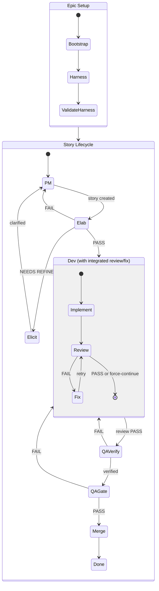
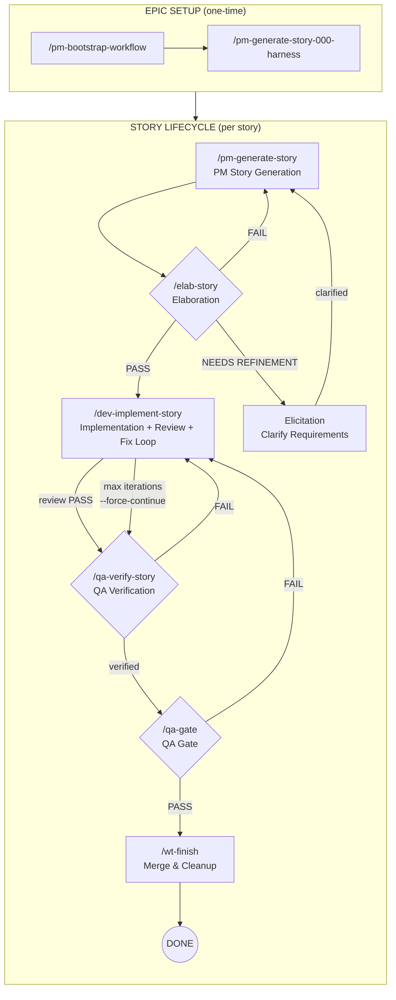

# Unified Development Flow

This document describes the end-to-end workflow for developing features in the LEGO MOC platform. The workflow combines:
- Bootstrap story setup
- Story lifecycle commands
- Multi-agent orchestration
- Skills (worktrees, review, QA gate)

## Documentation Structure

| Document | Description |
|----------|-------------|
| [README.md](./README.md) | This file - overview, commands, state diagrams |
| [phases.md](./phases.md) | Detailed documentation for each workflow phase (1-8) |
| [agent-system.md](./agent-system.md) | Expert intelligence framework, agent architecture, testing |
| [orchestration.md](./orchestration.md) | Error handling, parallel workers, state machine, observability |
| [autonomous-decisions.md](./autonomous-decisions.md) | Decision classification, auto-accept, batch processing |
| [context-caching.md](./context-caching.md) | Three-tier cache, session inheritance, Context7 |
| [extending.md](./extending.md) | How to add phases, workers, and checks |
| [knowledge-base.md](./knowledge-base.md) | KB integration, semantic search, doc migration |
| [changelog.md](./changelog.md) | Version history |

---

## Commands Overview

| Phase | Command | Purpose |
|-------|---------|---------|
| 1a | `/pm-bootstrap-workflow` | Create epic planning artifacts (one-time) |
| 1b | `/pm-generate-story-000-harness` | Validate workflow with harness story (one-time) |
| 1c | `/pm-refine-story` | Vet and prioritize feature ideas (ongoing) |
| 2 | `/pm-story generate` | Generate story specification |
| 2 | `/pm-story generate --elab` | Generate + elaborate (interactive) |
| 2+3 | `/pm-story generate --elab --autonomous` | Generate + elaborate (autonomous, ready-to-work) |
| 2 | `/pm-story generate --ad-hoc` | Generate emergent/one-off story |
| 2 | `/pm-story bug` | Generate bug/defect story |
| 2 | `/pm-story followup` | Generate follow-up from QA findings |
| 2 | `/pm-story split` | Split oversized story |
| 3 | `/elab-story` | QA audit - approve or reject story (interactive) |
| 3 | `/elab-story --autonomous` | QA audit with auto-decisions (autonomous) |
| 4 | `/dev-implement-story` | Build feature + code review + fix loop (integrated) |
| 5 | `/dev-code-review` | Standalone code review (optional, usually integrated) |
| 6 | `/qa-verify-story` | Verify acceptance criteria met |
| 7 | `/qa-gate` | Final ship decision |
| 8 | `/wt-finish` | Merge and cleanup |

---

## State Diagram



## Detailed Flow with Commands



**Note:** `/dev-implement-story` now includes an integrated review/fix loop. Code review is no longer a separate manual step.

---

## Decision Points & Verdicts

| Gate | Verdicts | Forward Path | Refinement Path |
|------|----------|--------------|-----------------|
| **Elab** | PASS | → Dev | — |
| | CONDITIONAL PASS | → Dev (after minor fixes) | — |
| | NEEDS REFINEMENT | — | → Elicitation (clarify requirements) |
| | SPLIT REQUIRED | — | → Elicitation (break into stories) |
| | FAIL (minor) | — | → PM (quick rewrite) |
| **Elicitation** | Clarified | — | → PM (rework story with new info) |
| **Dev (integrated review)** | REVIEW PASS | → QA Verify | — |
| | REVIEW FAIL | — | → Fix (auto-loop, up to N iterations) |
| | FORCE CONTINUE | → QA Verify (with warnings) | — |
| | MAX ITERATIONS | Blocked (manual intervention) | — |
| **QA Verify** | Verified | → QA Gate | — |
| | Failed | — | → Dev (fix failures) |
| **QA Gate** | PASS | → Merge | — |
| | CONCERNS | → Merge (advisory) | — |
| | WAIVED | → Merge (accepted risk) | — |
| | FAIL | — | → Dev (fix blocking issues) |

---

## Story Status Lifecycle

| Status | Directory | Meaning |
|--------|-----------|---------|
| `pending` | `backlog/` | Not yet generated, just an entry in index |
| `generated` | `backlog/` | Story file created by PM |
| `in-elaboration` | `elaboration/` | QA audit in progress |
| `needs-refinement` | `elaboration/` | Failed elab, needs PM fixes |
| `needs-split` | `elaboration/` | Too large, requires splitting |
| `ready-to-work` | `ready-to-work/` | Passed elab, awaiting development |
| `in-progress` | `in-progress/` | Dev actively implementing |
| `ready-for-code-review` | `in-progress/` | Implementation done, awaiting review |
| `ready-for-qa` | `ready-for-qa/` | Dev complete, awaiting QA verification |
| `in-qa` | `UAT/` | QA verification in progress |
| `uat` | `UAT/` | QA passed, awaiting gate |
| `completed` | `UAT/` | QA gate passed, ready to merge |
| `blocked` | varies | Waiting on external dependency |
| `cancelled` | `cancelled/` | No longer needed |

---

## Typical Cycles

Most stories follow the happy path, but refinement cycles are common:

1. **Elab → Elicitation → PM → Elab** (1-2 cycles) - Requirement clarification
2. **Elab → PM → Elab** (1 cycle) - Minor story fixes
3. **Dev internal: Review → Fix → Review** (1-3 cycles) - Integrated quality fixes (automatic)
4. **QA Verify → Dev → QA Verify** (1-2 cycles) - Bug fixes
5. **QA Gate → Dev → QA Gate** (rare) - Late-found blocking issues

**Note:** Code review cycles are now handled automatically within `/dev-implement-story`. The command includes a review/fix loop (default max 3 iterations) that runs until code review passes or `--force-continue` is used.

---

## Core Rule

**Commands mutate story state. Skills produce evidence only.**

---

## Evidence Bundle

Each story produces an `_implementation/` directory containing all evidence:
- Implementation plan and logs
- Verification results
- Token summaries

This bundle is consumed by:
- Code Review
- QA Verify
- QA Gate

**This prevents re-discovery and reduces context loading.**

---

## Skills Integration

Skills provide tooling support but **do not advance lifecycle state**.

| Skill | Purpose |
|-------|---------|
| `/wt-new` | Create worktree for story |
| `/wt-switch` | Switch between worktrees |
| `/wt-sync` | Sync with upstream |
| `/wt-status` | Check worktree status |
| `/wt-finish` | Merge and cleanup |
| `/wt-cleanup` | Remove stale worktrees |
| `/review` | Code review feedback |
| `/qa-gate` | Final ship decision |

---

## Templates

Reusable templates are available in `plans/stories/WRKF-000/_templates/`:

| Template | Purpose |
|----------|---------|
| `PROOF-TEMPLATE.md` | Dev proof document structure |
| `QA-VERIFY-TEMPLATE.md` | QA verification structure |
| `ELAB-TEMPLATE.md` | Elaboration/audit structure |

---

## Quick Reference

```
/pm-bootstrap-workflow - provide raw plan, project name, PREFIX
    ↓ creates: {PREFIX}.stories.index.md, {PREFIX}.plan.meta.md, {PREFIX}.plan.exec.md

/pm-generate-story-000-harness - run ONCE after bootstrap
    ↓ creates: {PREFIX}-000-HARNESS.md, _templates/*.md
    ↓ then run full workflow on Story-000 to validate setup

/elab-epic {PREFIX} - OPTIONAL but recommended
    ↓ creates: plans/{PREFIX}.epic-elab/EPIC-REVIEW.yaml
    ↓ 6 stakeholder reviews in parallel, interactive decisions

/pm-refine-story [FEAT-ID | all | top N] - vet and prioritize features
    ↓ updates: plans/future/FEATURES.md
    ↓ saves: plans/future/triage-sessions/<date>.yaml
    ↓ promoted features → /pm-story generate

/pm-story generate {PREFIX}-XXX - for each feature story
    ↓ creates: {PREFIX}-XXX.md, _pm/*.md
/pm-story generate --ad-hoc - for emergent/one-off stories
    ↓ creates: AD-HOC-XXX.md
/pm-story bug - for bug/defect stories
    ↓ creates: BUG-XXX.md
/pm-story followup STORY-XXX - from QA findings
    ↓ creates: STORY-NNN.md, updates index
/pm-story split STORY-XXX - for oversized stories
    ↓ creates: STORY-XXX-A.md, STORY-XXX-B.md
    ↓ DELETES: original STORY-XXX directory (superseded stories are removed)
/elab-story {PREFIX}-XXX
    ↓ creates: ELAB-{PREFIX}-XXX.md
/dev-implement-story {PREFIX}-XXX [--max-iterations=N] [--force-continue]
    ↓ creates: _implementation/*.md, PROOF-{PREFIX}-XXX.md, VERIFICATION.yaml
    ↓ includes: integrated code review + fix loop (auto-retry until pass)
    ↓ auto-resumes from existing artifacts
/dev-code-review {PREFIX}-XXX (standalone, usually integrated)
    ↓ creates: VERIFICATION.yaml
/qa-verify-story {PREFIX}-XXX
    ↓ creates: QA-VERIFY-{PREFIX}-XXX.md
/qa-gate {PREFIX}-XXX
    ↓ creates: QA-GATE-{PREFIX}-XXX.yaml
/wt-finish
    ↓ merges to main, cleans up worktree
```

---

## What's Next / Open Questions

See [orchestration.md](./orchestration.md#planned-enhancements) for planned enhancements and open questions.
