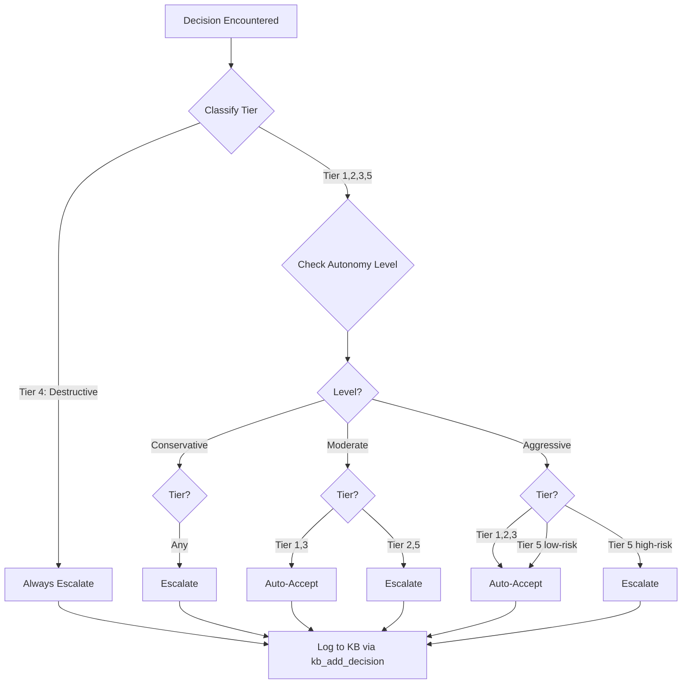
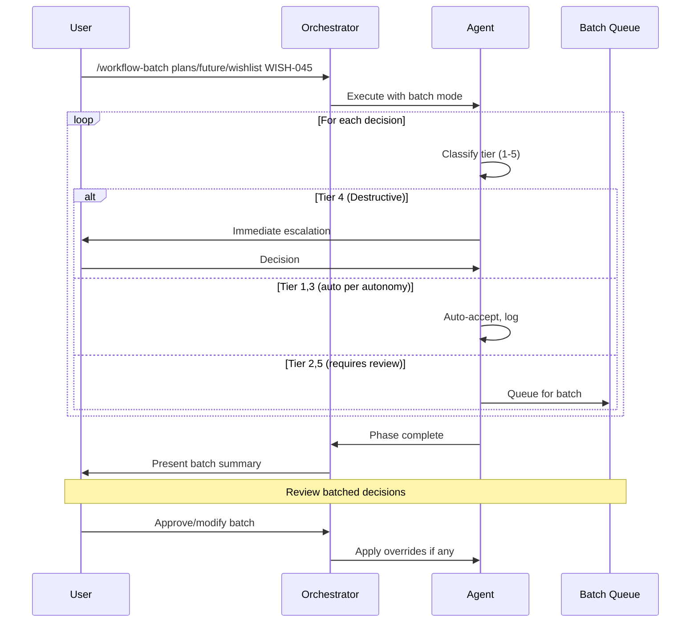

# Autonomous Decision Management

> **Source of Truth:** `.claude/agents/_shared/decision-handling.md` (protocol)
> **Tier Definitions:** `.claude/agents/_shared/autonomy-tiers.md`
> **Config:** `.claude/config/decision-classification.yaml`, `.claude/config/autonomy.yaml`, `.claude/config/preferences.yaml`

The workflow system supports autonomous decision-making to reduce Human-in-the-Loop (HiTL) interrupts while maintaining quality gates for critical decisions.

## Table of Contents

- [Decision Classification System](#decision-classification-system)
- [Auto-Accept Logic](#auto-accept-logic)
- [Deferred Backlog Management](#deferred-backlog-management)
- [Batch Processing Mode](#batch-processing-mode)
- [Preference Learning](#preference-learning)

---

## Decision Classification System

All decisions encountered during workflow execution are classified into the 5-tier system defined in `.claude/agents/_shared/autonomy-tiers.md`:

| Tier | Name | Description | Conservative | Moderate | Aggressive |
|------|------|-------------|--------------|----------|------------|
| 1 | **Clarification** | Missing info with reasonable default | Escalate | Auto | Auto |
| 2 | **Preference** | Valid alternatives, human preference matters | Escalate | Escalate | Auto |
| 3 | **Ambiguous Scope** | Requirements interpreted multiple ways | Escalate | Auto | Auto |
| 4 | **Destructive** | Cannot be undone, production impact | **Always Escalate** | **Always Escalate** | **Always Escalate** |
| 5 | **External Dependency** | External services, cross-team coordination | Escalate | Escalate | Auto (low-risk) |

### Classification Patterns

Pattern-based rules in `.claude/config/decision-classification.yaml` help auto-classify decisions:

```yaml
# .claude/config/decision-classification.yaml

rules:
  tier_4_destructive:
    patterns:
      - "delete|drop|truncate|destroy|remove.*permanently"
      - "force.*push|reset.*hard"
      - "production|prod.*deploy|prod.*config"
      - "auth.*change|security.*change"
      - "breaking.*change|backwards.*compat"
    always_escalate: true

  tier_5_external:
    patterns:
      - "npm.*install|add.*dependency"
      - "infrastructure|infra.*change"
      - "third.*party|external.*service"
    risk_assessment: true

  tier_3_ambiguous:
    patterns:
      - "validation|validate.*what"
      - "improve.*performance|optimize"
      - "handle.*edge.*case"

  tier_2_preference:
    patterns:
      - "component.*library|ui.*framework"
      - "state.*management|redux|zustand"
      - "naming.*convention|style.*choice"

  tier_1_clarification:
    patterns:
      - "file.*naming|directory.*structure"
      - "which.*pattern|existing.*pattern"

# Moonshot detection (auto-defer, never block workflow)
moonshot_patterns:
  - "future|nice.*to.*have|stretch.*goal"
  - "out.*of.*scope|beyond.*current"
```

---

## Auto-Accept Logic

The workflow can automatically accept decisions based on tier, autonomy level, and learned preferences:



### Autonomy Levels

Set via command flag, story frontmatter, or global config (`.claude/config/autonomy.yaml`):

```bash
# Command-line flag
/dev-implement-story plans/future/wishlist WISH-001 --autonomous=moderate

# Batch mode defaults to moderate
/workflow-batch plans/future/wishlist WISH-001
```

```yaml
# Story-level override in frontmatter
---
autonomy_level: moderate  # conservative | moderate | aggressive
---

# Global config: .claude/config/autonomy.yaml
default_level: conservative

# Per-phase overrides
phase_overrides:
  pm_story_generation:
    level: conservative
    reason: "Requirements need human validation"
  dev_implementation:
    level: moderate
    reason: "Code decisions can often use conventions"
  code_review:
    level: aggressive
    reason: "Automated checks are reliable"
  qa_verification:
    level: conservative
    reason: "Quality gates need human oversight"
```

### Autonomy Level Summary

| Level | Tier 1 | Tier 2 | Tier 3 | Tier 4 | Tier 5 |
|-------|--------|--------|--------|--------|--------|
| Conservative | Escalate | Escalate | Escalate | Escalate | Escalate |
| Moderate | Auto | Escalate | Auto | Escalate | Escalate |
| Aggressive | Auto | Auto | Auto | Escalate | Auto (low-risk) |

### Auto-Accept Artifact

Auto-accepted decisions are logged to the Knowledge Base via `kb_add_decision`:

```javascript
// Example: Auto-accepted decision logged to KB
kb_add_decision({
  title: "Add loading states to form",
  context: "Form submission UX improvement",
  decision: "yes - add loading states",
  consequences: "Matches existing patterns; improves UX consistency",
  story_id: "WISH-2045",
  tags: ["auto-accepted", "tier-3", "ux", "forms"]
})

// Query prior decisions
kb_search({
  query: "loading states forms",
  tags: ["auto-accepted"],
  limit: 5
})
```

Benefits of KB storage:
- Decisions searchable across all stories
- Patterns emerge from historical decisions
- No file clutter in `_implementation/`

---

## Deferred Backlog Management

Moonshot decisions (out-of-scope enhancements) and low-confidence decisions are automatically deferred to a backlog rather than blocking workflow:

### Deferral Triggers

| Trigger | Example | Action |
|---------|---------|--------|
| Moonshot pattern match | "Should we add AI-powered suggestions?" | Auto-defer |
| Out of scope detection | Feature outside story boundaries | Auto-defer |
| Low confidence (< 0.5) | Ambiguous requirements | Defer for review |
| Time pressure | Approaching token budget | Defer non-critical |

Moonshot patterns are defined in `.claude/config/decision-classification.yaml`:
- "future", "nice to have", "stretch goal"
- "out of scope", "phase 2", "later version"

### Deferred Items in KB

Deferred items are logged to the Knowledge Base via `kb_add_lesson`:

```javascript
// Example: Deferred moonshot logged to KB
kb_add_lesson({
  title: "Deferred: Keyboard shortcuts for power users",
  summary: "User mentioned efficiency in AC-4, but out of scope for MVP",
  context: "Story WISH-2045 - wishlist gallery",
  recommendation: "Consider for follow-up story",
  story_id: "WISH-2045",
  tags: ["deferred", "moonshot", "ux", "accessibility"]
})

// Query deferred items for follow-up planning
kb_search({
  query: "deferred moonshot wishlist",
  tags: ["deferred"],
  limit: 10
})
```

Benefits:
- Deferred items don't clutter story directories
- Easy to query across stories for sprint planning
- Tagged for categorization (moonshot, out_of_scope, etc.)

---

## Batch Processing Mode

For workflows with many non-critical decisions, batch processing reduces interruptions:

**Command:** `/workflow-batch {FEATURE_DIR} {STORY_ID}`

See: `.claude/commands/workflow-batch.md` for full documentation.

### Batch Workflow



### Batch Summary Presentation

At phase end, the orchestrator presents a summary (no file artifact needed):

```markdown
## Batch Summary: WISH-2045 (dev_implementation)

### Auto-Accepted (8) - logged to KB
✓ [Tier 1] Test naming → kebab-case
✓ [Tier 1] Import order → grouped
✓ [Tier 3] Add loading states → yes
✓ [Tier 3] Use skeleton loaders → yes
... (4 more)

### Deferred (2) - logged to KB as lessons
→ [Moonshot] Keyboard shortcuts
→ [Out of scope] Preload images

### Requires Review (1)
? [Tier 2] Change API response format?
  - A) Yes, update format (breaking change)
  - B) No, maintain compatibility (recommended)

**Actions**: [A] Approve all / [1] Review / [R] Reject
```

After user approval, all decisions logged to KB with appropriate tags.

---

## Preference Learning

The system learns from user decisions to improve future auto-accept accuracy:

### Preference Schema

```yaml
# .claude/config/preferences.yaml
preferences:
  - id: pref-001
    created_at: 2026-01-15T10:00:00Z
    updated_at: 2026-02-06T10:00:00Z

    pattern: "test.*framework|testing.*library"
    choice: vitest
    confidence: 1.0
    applications: 15
    overrides: 0

  - id: pref-002
    created_at: 2026-01-20T14:00:00Z
    updated_at: 2026-02-06T09:00:00Z

    pattern: "state.*management|redux|zustand"
    choice: "zustand"
    confidence: 0.85
    applications: 8
    overrides: 2
    notes: "User prefers zustand for simpler state; Redux for complex flows"

  - id: pref-003
    created_at: 2026-02-01T11:00:00Z
    updated_at: 2026-02-01T11:00:00Z

    pattern: "optimistic.*update|pessimistic"
    choice: "optimistic"
    confidence: 0.9
    applications: 3
    overrides: 0
```

### Preference Application Rules

| Confidence | Applications | Overrides | Action |
|------------|--------------|-----------|--------|
| ≥ 0.9 | ≥ 5 | 0 | Auto-apply |
| ≥ 0.8 | ≥ 3 | ≤ 1 | Auto-apply with log |
| ≥ 0.7 | ≥ 2 | ≤ 2 | Suggest, await confirmation |
| < 0.7 | any | any | Do not apply |

### Confidence Decay

Preferences decay if not applied recently:

```
new_confidence = base_confidence * (0.95 ^ months_since_last_application)
```

After 6 months without application, preference is archived.
