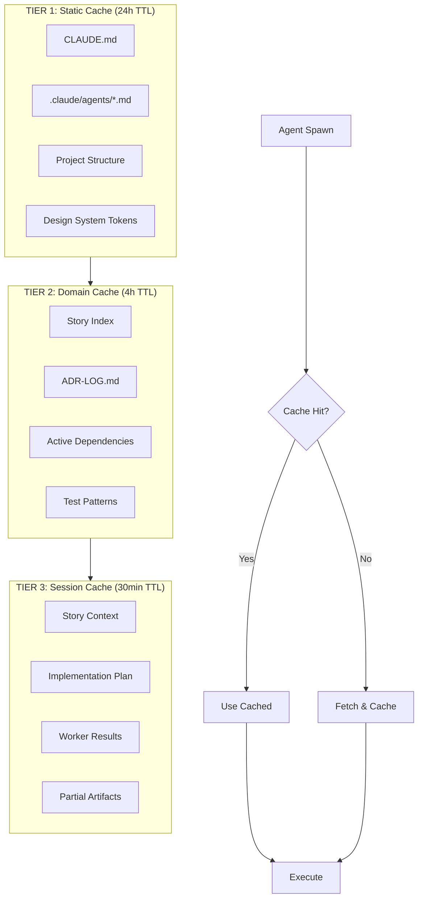
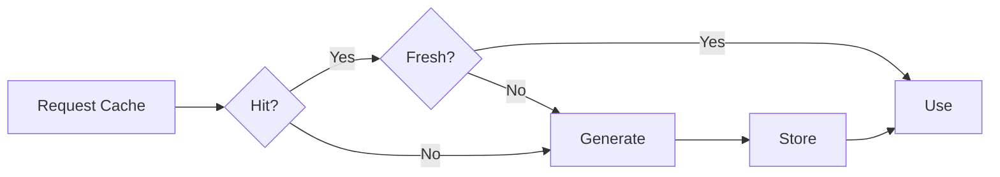

# Context Caching System

> **Source of Truth:** `packages/backend/orchestrator/src/cache/` (planned)
> See also: `.claude/cache/` (runtime cache files)

The workflow uses a three-tier caching system to reduce redundant context loading and improve agent efficiency.

## Table of Contents

- [Three-Tier Cache Architecture](#three-tier-cache-architecture)
- [Cache Generators and Loaders](#cache-generators-and-loaders)
- [Session Context Inheritance](#session-context-inheritance)
- [Library Cache (Context7)](#library-cache-context7)
- [Cache Metrics and Observability](#cache-metrics-and-observability)

---

## Three-Tier Cache Architecture



### Cache Tiers

| Tier | Name | TTL | Contents | Update Trigger |
|------|------|-----|----------|----------------|
| 1 | Static | 24h | Project config, agent definitions, structure | Manual refresh, file change |
| 2 | Domain | 4h | Story index, ADRs, shared patterns | Story status change, new ADR |
| 3 | Session | 30min | Active story context, partial results | Phase completion, worker output |

### Static Cache Schema

```yaml
# .claude/cache/static-cache.yaml
version: 1
generated_at: 2026-02-06T08:00:00Z
expires_at: 2026-02-07T08:00:00Z

project:
  name: "LEGO MOC Platform"
  root: "/Users/michaelmenard/Development/Monorepo"
  package_manager: pnpm

guidelines:
  claude_md_hash: "sha256:abc123..."
  key_rules:
    - "Zod-first types"
    - "No barrel files"
    - "@repo/ui imports"
    - "@repo/logger for logging"

structure:
  apps:
    - path: "apps/api/lego-api"
      type: backend
      framework: express
    - path: "apps/web/main-app"
      type: frontend
      framework: react

  packages:
    - path: "packages/core/app-component-library"
      alias: "@repo/ui"
    - path: "packages/core/api-client"
      alias: "@repo/api-client"

agents:
  count: 45
  leaders: 18
  workers: 27
  hash: "sha256:def456..."
```

### Domain Cache Schema

```yaml
# .claude/cache/domain-cache.yaml
version: 1
generated_at: 2026-02-06T10:00:00Z
expires_at: 2026-02-06T14:00:00Z

stories:
  index_hash: "sha256:ghi789..."
  active_count: 5
  by_status:
    in_progress: 2
    ready_to_work: 3

  active_stories:
    - id: WISH-2045
      status: in_progress
      title: "HEIC Image Support"
      touches: ["apps/api/lego-api", "packages/core/upload-types"]

    - id: WISH-2046
      status: ready_to_work
      title: "Wishlist Sorting"
      touches: ["apps/web/app-wishlist-gallery"]

adrs:
  count: 5
  recent:
    - id: ADR-005
      title: "Testing Requirements"
      key_point: "UAT must use real services"

test_patterns:
  unit: "vitest + react-testing-library"
  e2e: "playwright + cucumber"
  api: ".http files with REST Client"
```

### Session Cache Schema

```yaml
# .claude/cache/session/WISH-2045.yaml
version: 1
story_id: WISH-2045
session_id: "sess-2026-02-06-001"
created_at: 2026-02-06T10:00:00Z
expires_at: 2026-02-06T10:30:00Z

context:
  story_hash: "sha256:jkl012..."
  elaboration_hash: "sha256:mno345..."

  scope:
    backend: true
    frontend: false
    infrastructure: false

  files_touched:
    - path: "apps/api/lego-api/domains/gallery/routes.ts"
      action: modified
    - path: "packages/core/upload-types/src/heic.ts"
      action: created

worker_results:
  planning:
    status: complete
    plan_hash: "sha256:pqr678..."

  backend_coder:
    status: complete
    log_hash: "sha256:stu901..."
    files_created: 3
    files_modified: 2

  frontend_coder:
    status: skipped
    reason: "No frontend changes in scope"

partial_artifacts:
  - name: "VERIFICATION.md"
    sections_complete: ["build", "lint"]
    sections_pending: ["test", "e2e"]
```

---

## Cache Generators and Loaders

### Generator Commands

```bash
# Generate all caches (typically run in CI or on session start)
pnpm cache:generate:all

# Generate specific tier
pnpm cache:generate:static    # Project structure, guidelines
pnpm cache:generate:domain    # Story index, ADRs
pnpm cache:generate:session STORY-ID  # Story-specific context

# Invalidate caches
pnpm cache:invalidate:domain  # After story status changes
pnpm cache:invalidate:session STORY-ID  # After story completion
```

### Loader Protocol

Agents load context via the cache loader:

```typescript
// packages/backend/orchestrator/src/cache/cache-loader.ts

interface CacheLoader {
  // Load with automatic tier resolution
  load(key: CacheKey): Promise<CacheEntry | null>

  // Check freshness
  isFresh(entry: CacheEntry): boolean

  // Force refresh
  refresh(key: CacheKey): Promise<CacheEntry>
}

// Usage in agent
const projectContext = await cacheLoader.load('static:project')
const storyContext = await cacheLoader.load(`session:${storyId}`)
```

### Cache Miss Behavior



---

## Session Context Inheritance

When leaders spawn workers, session context is inherited efficiently:

### Worker Context Schema

```yaml
# Passed to worker via WORKER-CONTEXT.yaml
worker_id: "backend-coder-001"
parent_id: "implementation-leader-001"
story_id: WISH-2045

inherited:
  # From static cache
  guidelines_hash: "sha256:abc123..."

  # From domain cache
  story_index_hash: "sha256:ghi789..."

  # From session cache (parent's context)
  story_context_hash: "sha256:jkl012..."
  implementation_plan_hash: "sha256:pqr678..."

scope:
  # Worker-specific scope (subset of parent)
  focus: backend
  files:
    - "apps/api/lego-api/domains/gallery/**"
    - "packages/core/upload-types/**"

constraints:
  # Inherited from parent decisions
  decisions:
    - "Use existing ImageProcessor class"
    - "Follow existing route patterns"

  # Budget allocation
  token_budget: 50000
  time_limit_ms: 300000
```

### Inheritance Rules

| Context Type | Inheritance | Notes |
|--------------|-------------|-------|
| Static cache | Full | All workers share project context |
| Domain cache | Full | All workers share story index |
| Session cache | Selective | Only relevant sections passed |
| Parent decisions | Full | Workers must respect leader decisions |
| Partial results | On demand | Workers can request sibling results |

---

## Library Cache (Context7)

The workflow integrates with Context7 for documentation caching:

### Context7 Integration

```yaml
# .claude/config/context7.yaml
enabled: true

libraries:
  # Always cache these (high usage)
  pinned:
    - id: "/vercel/next.js"
      version: "latest"
      refresh: weekly

    - id: "/tailwindlabs/tailwindcss"
      version: "latest"
      refresh: weekly

    - id: "/colinhacks/zod"
      version: "latest"
      refresh: monthly

  # Cache on first use
  on_demand:
    - pattern: "react-*"
    - pattern: "@tanstack/*"
    - pattern: "playwright"

cache_location: ".claude/cache/context7/"
max_size_mb: 100
```

### Library Cache Schema

```yaml
# .claude/cache/context7/zod.yaml
library_id: "/colinhacks/zod"
version: "3.23.8"
cached_at: 2026-02-01T10:00:00Z
expires_at: 2026-03-01T10:00:00Z

queries_cached:
  - query: "schema validation"
    hash: "sha256:xyz..."
    hits: 23

  - query: "infer types"
    hash: "sha256:uvw..."
    hits: 15

  - query: "error handling"
    hash: "sha256:rst..."
    hits: 8

total_size_kb: 245
```

---

## Cache Metrics and Observability

### Metrics Schema

```yaml
# .claude/cache/CACHE-METRICS.yaml
period:
  start: 2026-02-06T00:00:00Z
  end: 2026-02-06T23:59:59Z

overall:
  total_requests: 1247
  cache_hits: 1089
  cache_misses: 158
  hit_rate: 0.873

  tokens_saved: 2450000  # Estimated tokens not re-read
  time_saved_ms: 45000   # Estimated time not spent loading

by_tier:
  static:
    requests: 342
    hits: 340
    hit_rate: 0.994
    avg_load_time_ms: 12

  domain:
    requests: 456
    hits: 412
    hit_rate: 0.903
    avg_load_time_ms: 45

  session:
    requests: 449
    hits: 337
    hit_rate: 0.751
    avg_load_time_ms: 23

by_story:
  WISH-2045:
    requests: 234
    hits: 198
    hit_rate: 0.846

  WISH-2046:
    requests: 156
    hits: 142
    hit_rate: 0.910

invalidations:
  manual: 3
  ttl_expired: 45
  file_change: 12
```

### Monitoring Alerts

| Metric | Warning Threshold | Critical Threshold | Action |
|--------|-------------------|-------------------|--------|
| Hit rate (static) | < 0.95 | < 0.90 | Check for file changes |
| Hit rate (domain) | < 0.80 | < 0.70 | Check index freshness |
| Hit rate (session) | < 0.60 | < 0.50 | Check session length |
| Cache size | > 80MB | > 95MB | Prune old entries |
| Load time | > 100ms | > 500ms | Optimize cache format |
