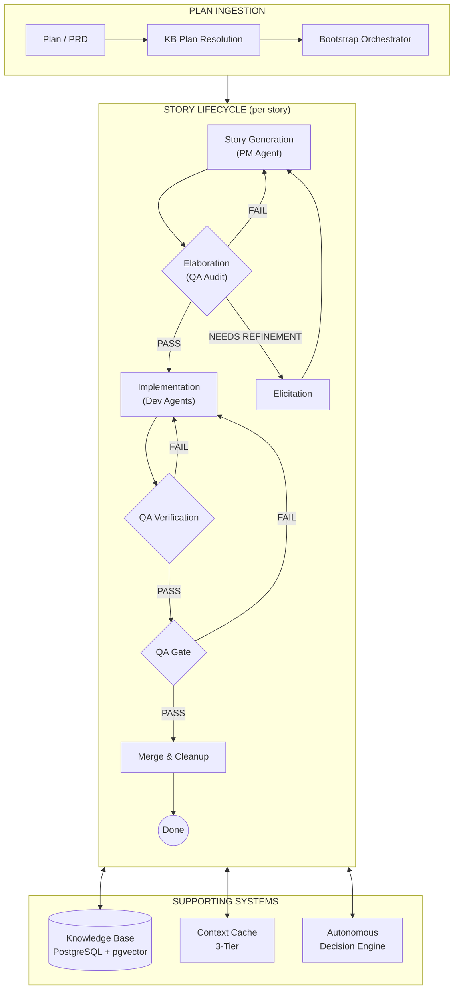
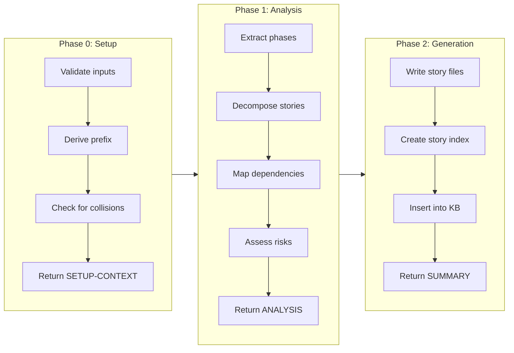
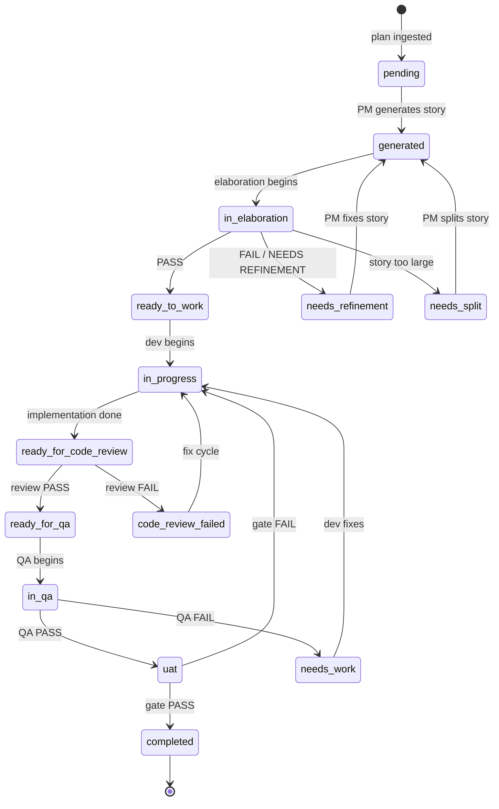
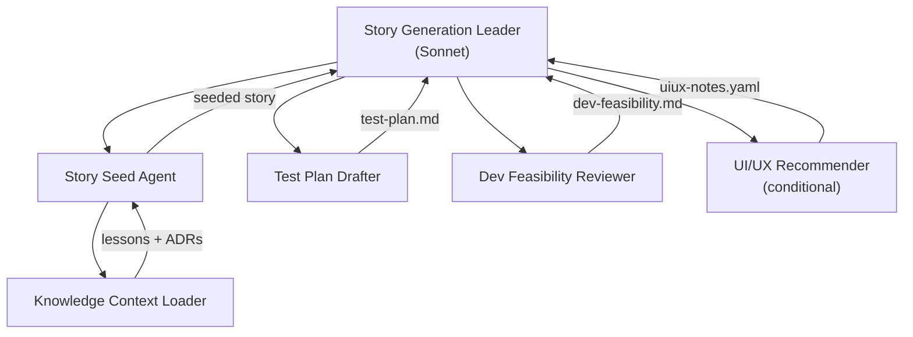
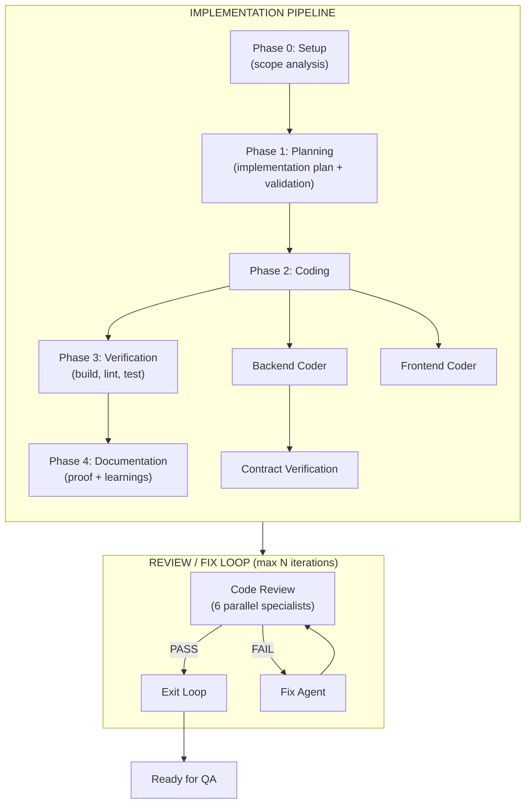
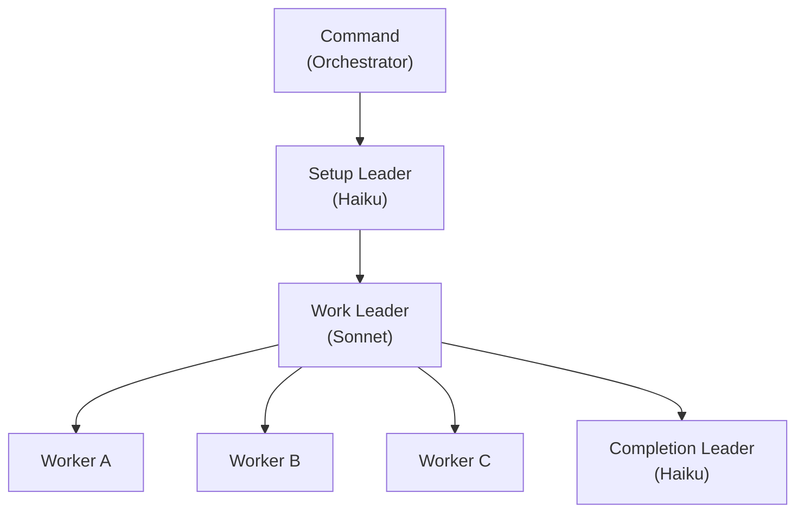
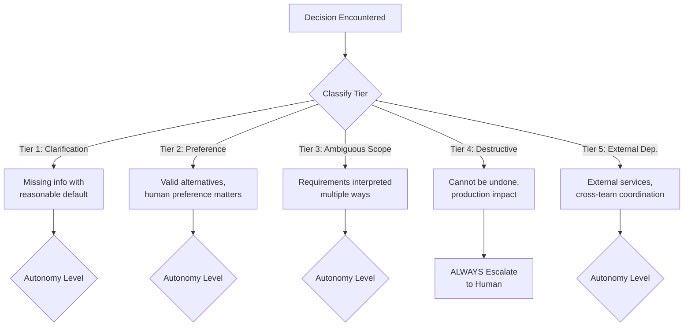
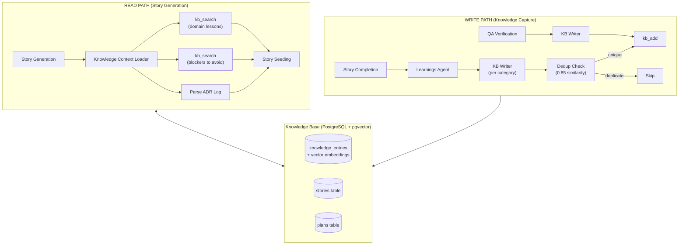
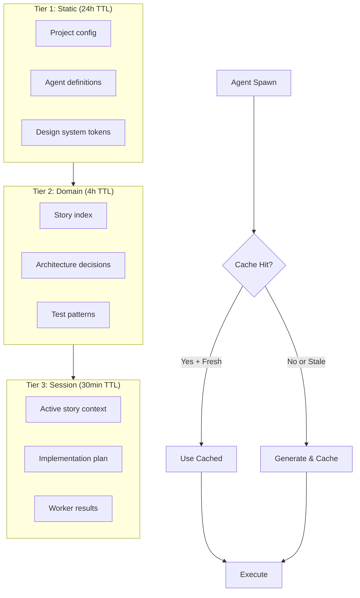

# Unified Development Flow: An AI-Orchestrated Software Development Lifecycle

**Version:** 3.2.0
**Date:** February 25, 2026
**System:** Claude Code Multi-Agent Workflow

---

## Abstract

This document describes the Unified Development Flow, a multi-agent AI system that orchestrates the complete software development lifecycle — from plan ingestion and story generation through implementation, code review, quality assurance, and deployment. The system employs a hierarchical agent architecture with specialized expert personas, autonomous decision-making, institutional knowledge management, and formal quality gates. It is designed to minimize human-in-the-loop interrupts while maintaining rigorous quality controls at critical decision points.

---

## 1. System Overview

The Unified Development Flow is a production workflow system built on top of Claude Code (Anthropic's CLI agent). It manages the full lifecycle of software features using coordinated AI agents — from an initial plan or product requirements document (PRD) through to merged, deployed code.

The system's key innovations include:

- **Plan ingestion and automatic story decomposition** from unstructured plans into structured, dependency-aware stories
- **Multi-agent orchestration** with 45+ specialized agents operating across 8 workflow phases
- **Expert intelligence framework** that gives agents domain-specific reasoning, not just checklist validation
- **Autonomous decision classification** that reduces human interrupts by 60-80% while always escalating destructive or irreversible decisions
- **Institutional knowledge management** through a PostgreSQL-backed Knowledge Base with semantic search, enabling agents to learn from past stories
- **Formal quality gates** at elaboration, code review, QA verification, and final ship decisions

### High-Level Architecture



---

## 2. Plan Ingestion and Bootstrap

The workflow begins with plan ingestion — converting an unstructured plan, migration outline, or PRD into a structured set of development stories with dependency graphs, risk assessments, and sizing estimates.

### 2.1 Input Modes

The bootstrap system supports two input modes:

**Knowledge Base Mode (primary):** A plan slug identifies a plan stored in the Knowledge Base's `plans` table. The orchestrator fetches the plan's full content, metadata, and any pre-parsed phase breakdowns from the database. No files are read from disk.

**File Mode (legacy):** A directory path points to a local `PLAN.md` or `PRD.md` file. Intermediate artifacts are written to disk for phase-to-phase communication.

### 2.2 Three-Phase Bootstrap Pipeline

The bootstrap orchestrator runs three sequential phases, each handled by a specialized agent:



| Phase | Agent | AI Model | Purpose |
|-------|-------|----------|---------|
| 0 | Setup Leader | Haiku (fast, low-cost) | Validate inputs, derive story prefix, check for collisions |
| 1 | Analysis Leader | Sonnet (capable reasoning) | Extract stories, build dependency graph, assess risks and sizing |
| 2 | Generation Leader | Haiku (fast, low-cost) | Write story YAML files, create master index, insert into database |

**Context passing in KB mode:** Phases communicate through the orchestrator via inline YAML blocks. Phase 0 returns a `SETUP-CONTEXT` block, which the orchestrator captures and passes to Phase 1 along with the original plan content. Phase 1 returns an `ANALYSIS` block, which is passed to Phase 2. No intermediate files are written to disk, reducing I/O and enabling cleaner resumption.

### 2.3 Story Decomposition

The Analysis phase extracts structured story data from the raw plan:

- **Phases:** The plan is divided into 2-5 sequential phases representing major milestones
- **Stories:** Each phase contains multiple stories, each with a unique ID following the pattern `{PREFIX}-{phase}{story}0` (e.g., `AGMD-1010` for phase 1, story 01)
- **Dependencies:** A directed acyclic graph (DAG) of inter-story dependencies
- **Risk flags:** Cross-cutting risks and oversized story warnings
- **Sizing indicators:** Stories flagged with 3+ sizing warning indicators are marked for potential splitting

### 2.4 Prefix Auto-Derivation

When no explicit prefix is provided, the system derives one from the plan slug:

1. Split on hyphens into words
2. Remove common filler words (articles, prepositions, generic verbs)
3. Take the first letter of each remaining word, uppercased
4. Pad or truncate to 4 characters

Examples: `agent-monitor-dashboard` becomes `AGMD`; `kb-native-story-creation` becomes `KNSC`.

### 2.5 Bootstrap Outputs

The bootstrap produces:

- A **master story index** (`stories.index.md`) with progress tracking, per-phase listings, and metrics
- **Per-story YAML files** (`story.yaml`) containing metadata: id, title, status, phase, dependencies, endpoints, infrastructure requirements, goals, and risk notes
- **Database records** in the KB `stories` table for programmatic status tracking and query

---

## 3. Story Lifecycle

Each story passes through a rigorous lifecycle with formal gates at each transition. The system supports 17 distinct statuses across 8 phases.

### 3.1 Status Lifecycle



### 3.2 Directory Structure

Stories use a flat directory structure with status tracked in YAML frontmatter rather than directory location:

```
plans/future/{epic}/
  {STORY-ID}/
    {STORY-ID}.md              Main story file (frontmatter includes status)
    _pm/                       PM artifacts (test plan, feasibility, blockers)
    _implementation/           Dev artifacts (plan, logs, proof, verification)
```

This flat structure eliminates the need for filesystem moves during status transitions, simplifying database queries and making commands more robust.

---

## 4. Phase 2: Story Generation

Story generation transforms a story entry from the index into a fully specified, implementable story document. The PM (Product Manager) agent system handles this through multiple specialized sub-agents.

### 4.1 Agent Architecture



The system also supports specialized story types:
- **Ad-hoc stories** for emergent, one-off work
- **Bug stories** for defect tracking
- **Follow-up stories** generated from QA findings
- **Story splitting** when a story is too large (the original is superseded and deleted)

### 4.2 Knowledge Context Integration

Before generating a story, the system queries the Knowledge Base for:

1. **Lessons learned** from similar past stories — blockers, rework patterns, time sinks
2. **Architecture Decision Records (ADRs)** — constraints on API paths, infrastructure patterns, authentication, testing requirements
3. **Conflict detection** — checking if the proposed story would violate existing decisions
4. **Attack analysis** — past failures become challenge vectors for assumption testing

This institutional knowledge compounds over time: every completed story writes lessons back to the KB, which future stories then consume.

### 4.3 Pipeline Mode

Story generation can chain directly to elaboration using the `--elab` flag, and further to autonomous mode with `--elab --autonomous`, producing a ready-to-work story in a single invocation with no human interaction required.

---

## 5. Phase 3: Elaboration (QA Audit)

Elaboration is a **hard gate** — no story may proceed to implementation without passing. It functions as a quality audit of the story specification itself.

### 5.1 Eight-Point Audit Checklist

| Check | Purpose |
|-------|---------|
| Scope Alignment | Does the story match the plan's intent? |
| Internal Consistency | Do acceptance criteria, scope, and goals agree? |
| Reuse-First Enforcement | Does the story leverage existing code appropriately? |
| Ports & Adapters Compliance | Does it respect architectural layering? |
| Local Testability | Can the story be verified without external dependencies? |
| Decision Completeness | Are all technical decisions resolved? |
| Risk Disclosure | Are risks identified and mitigated? |
| Story Sizing | Is the story small enough for a single implementation cycle? |

### 5.2 Elaboration Modes

**Interactive mode:** The analyst agent presents findings and the human reviews each one, making accept/reject/modify decisions.

**Autonomous mode:** An autonomous decider agent applies rules:
- MVP-critical gaps are automatically added as new acceptance criteria
- Non-blocking items are logged to the Knowledge Base for future reference
- Security vulnerabilities are always added as acceptance criteria
- Scope alignment and internal consistency failures are escalated to the human

### 5.3 Verdicts

| Verdict | Meaning | Next Step |
|---------|---------|-----------|
| PASS | Ready for implementation | Proceed to development |
| CONDITIONAL PASS | Minor fixes needed | Proceed after fixes |
| NEEDS REFINEMENT | Gaps identified | Return to PM for elicitation |
| FAIL | Significant issues | Return to PM for rewrite |
| SPLIT REQUIRED | Story too large | Split into smaller stories |

---

## 6. Phase 4: Implementation (with Integrated Code Review)

Implementation is the most complex phase, involving multiple agents working in a structured pipeline with an integrated review/fix loop.

### 6.1 Multi-Agent Pipeline



### 6.2 Implementation Phases

| Phase | Agent | Model | Purpose |
|-------|-------|-------|---------|
| 0 | Setup Leader | Haiku | Analyze scope (backend/frontend/infra), create checkpoint |
| 1A | Planner | Sonnet | Create step-by-step implementation plan |
| 1B | Plan Validator | Sonnet | Validate plan against story requirements |
| 2A | Backend Coder | Sonnet | Implement backend changes (parallel) |
| 2A | Frontend Coder | Sonnet | Implement frontend changes (parallel) |
| 2B | Contract Verifier | Sonnet | Verify API contracts between layers |
| 3 | Verifier | Sonnet | Run build, lint, tests, E2E |
| 4A | Proof Writer | Haiku | Document what was built and how to verify |
| 4B | Learnings Agent | Haiku | Extract lessons for Knowledge Base |

### 6.3 Integrated Code Review

Six specialist review agents run in parallel, each focusing on a different quality dimension:

| Reviewer | Focus |
|----------|-------|
| Lint | ESLint and Prettier compliance |
| Syntax | TypeScript compilation and type safety |
| Style Compliance | Project coding standards (Zod-first types, import rules, no barrel files) |
| Security | OWASP top 10, injection risks, authentication issues |
| Type Check | Full TypeScript type checking |
| Build | Production build verification |

All six must pass for the review to succeed. On failure, a fix agent addresses the findings, and the review reruns — up to a configurable maximum (default: 3 iterations).

### 6.4 Auto-Resume

The orchestrator automatically detects existing artifacts and resumes from the appropriate stage:

1. If a checkpoint exists, resume from the recorded stage
2. If a failed review exists, skip directly to the fix cycle
3. If a passing review exists, the story is complete
4. If proof and logs exist but no review, proceed to review
5. If nothing exists, start from the beginning

No manual `--resume` flag is needed.

---

## 7. Phases 5-8: Quality Assurance and Delivery

### 7.1 QA Verification (Phase 6)

QA verification validates that the implementation meets all acceptance criteria through six hard gates:

| Gate | Requirement |
|------|-------------|
| AC Verification | Every acceptance criterion maps to evidence |
| Test Quality | No anti-patterns (testing mocks instead of behavior) |
| Test Coverage | 80% of new code, 90% of critical paths |
| Test Execution | All tests pass (unit, integration, E2E) |
| Proof Quality | Documentation is complete and verifiable |
| Architecture Compliance | No architectural violations |

### 7.2 QA Gate (Phase 7)

The final ship decision aggregates all evidence from every prior phase — elaboration report, implementation proof, code review results, and QA verification — into a single verdict:

| Decision | Meaning |
|----------|---------|
| PASS | Safe to merge |
| CONCERNS | Advisory issues noted, can still merge |
| WAIVED | Known issues accepted with documented justification |
| FAIL | Blocking issues, must return to development |

### 7.3 Merge and Cleanup (Phase 8)

On a passing gate, the system merges the feature branch to main, pushes to the remote repository, deletes the worktree directory, and updates the story status to completed.

---

## 8. Agent Architecture

### 8.1 Phase Leader Pattern

Every workflow phase follows a consistent three-tier pattern:



- **Commands** are the entry points that orchestrate the sequence of phases
- **Setup Leaders** (Haiku model — fast, low-cost) validate preconditions and create context
- **Work Leaders** (Sonnet model — capable reasoning) perform analysis and spawn parallel workers
- **Workers** execute specific focused tasks within a phase
- **Completion Leaders** (Haiku model) aggregate results, update status, and finalize artifacts

### 8.2 Model Selection

The system uses three AI models with different capability/cost tradeoffs:

| Model | Strengths | Used For |
|-------|-----------|----------|
| Haiku | Fast, low cost | Setup/completion leaders, simple validation, file generation |
| Sonnet | Strong reasoning | Code generation, analysis, complex decision-making |
| Opus | Highest capability | Reserved for critical judgment calls (rarely used) |

### 8.3 Context Boundaries

Context is intentionally cleared between implementation, review, and fix agents. This prevents context window exhaustion during long-running stories and ensures each agent starts with a clean perspective, reducing confirmation bias.

---

## 9. Expert Intelligence Framework

The Expert Intelligence Framework transforms specialist agents from checklist validators into domain expert advisors with nuanced reasoning.

### 9.1 Ten Capabilities

| Capability | Description |
|------------|-------------|
| Expert Personas | Domain-specific intuitions and mental models (e.g., "Think like an attacker") |
| Decision Heuristics | Structured reasoning for gray areas using the RAPID framework |
| Reasoning Traces | Every finding explains WHY the conclusion was reached |
| Confidence Signals | Four-level certainty scale (high, medium, low, cannot-determine) |
| Severity Calibration | Consistent impact assessment using calibration questions |
| Precedent Awareness | Query KB for prior decisions before making new ones |
| Cross-Domain Awareness | Check sibling agent findings for corroboration or conflict |
| Context-Aware Escalation | Smart escalation based on story risk level |
| Dynamic Standards | Load story-specific rules from project configuration |
| Disagreement Protocol | Resolve conflicting findings across specialist agents |

### 9.2 Expert Personas

Each specialist agent embodies a senior expert with 10+ years of domain experience:

- **Security Expert:** Thinks from an attacker perspective, assesses blast radius, evaluates defense in depth
- **Architecture Expert:** Considers future readability, coupling, and reversibility of decisions
- **UI/UX Expert:** Prioritizes user experience, system coherence, and progressive enhancement
- **QA Expert:** Maintains professional skepticism, hunts edge cases, detects mock-based false confidence

### 9.3 RAPID Decision Framework

For ambiguous situations where rules do not clearly apply, agents use a structured reasoning framework:

| Step | Question |
|------|----------|
| **R**isk | What is the worst-case outcome? |
| **A**ttack surface | Who has access? Public, admin, or internal only? |
| **P**recedent | Does the KB show approved or rejected patterns? |
| **I**ntent | What was the developer trying to achieve? |
| **D**efense | Are there other protective layers? |

### 9.4 Confidence and Severity Rules

- Critical severity findings require high confidence (provable via static analysis)
- Low confidence findings cannot block a verdict
- When 2+ specialist domains flag the same issue, severity is upgraded
- Severity is adjusted for context: public-facing surfaces increase severity; admin-only or internal surfaces decrease it

---

## 10. Autonomous Decision Management

The system classifies every decision encountered during workflow execution to determine whether it requires human input or can be auto-resolved.

### 10.1 Five-Tier Decision Classification



### 10.2 Autonomy Levels

The system supports three autonomy levels, configurable per command, per story, or globally:

| Level | Tier 1 | Tier 2 | Tier 3 | Tier 4 | Tier 5 |
|-------|--------|--------|--------|--------|--------|
| Conservative | Escalate | Escalate | Escalate | Escalate | Escalate |
| Moderate | Auto | Escalate | Auto | **Escalate** | Escalate |
| Aggressive | Auto | Auto | Auto | **Escalate** | Auto (low-risk) |

**Tier 4 (destructive) decisions always escalate regardless of autonomy level.** This includes database drops, force pushes, production deployments, authentication changes, and breaking changes.

### 10.3 Preference Learning

The system tracks human decisions over time and builds a preference profile:

- Preferences with high confidence (0.9+) and many applications (5+) with zero overrides are auto-applied
- Preferences decay if not used (5% confidence reduction per month of inactivity)
- After 6 months without application, a preference is archived

### 10.4 Deferred Backlog

Moonshot decisions (out-of-scope enhancements, "nice to have" features, future improvements) are automatically deferred to the Knowledge Base rather than blocking the workflow. These deferred items are tagged and searchable, making them available for future sprint planning.

---

## 11. Knowledge Base

The Knowledge Base is a PostgreSQL database with pgvector extensions that serves as the system's institutional memory.

### 11.1 Architecture



### 11.2 Knowledge Flow

The KB creates a compounding learning loop:

1. **Query KB** — Before starting any phase, agents search for relevant precedents, lessons, and decisions
2. **Apply precedent** — Past findings inform current work (e.g., "This pattern caused issues in WISH-2045")
3. **Do work** — Agents execute their phase with knowledge context
4. **Write lessons** — After completion, notable findings, blockers, and patterns are written back to KB
5. **Future agents query** — The next story benefits from the accumulated knowledge

### 11.3 Deduplication

The KB Writer agent checks for duplicates before writing, using a 0.85 cosine similarity threshold against existing entries. This prevents knowledge inflation while ensuring genuinely new findings are captured.

### 11.4 Knowledge Types

| Type | Examples | Written By |
|------|----------|------------|
| Lessons Learned | Blockers, patterns, time sinks | Implementation Learnings Agent |
| Architecture Decisions | API patterns, storage strategies | Planning Agent |
| Test Strategies | Edge cases, verification approaches | QA Verification Agent |
| Deferred Items | Moonshots, future opportunities | Autonomous Decider Agent |

---

## 12. Context Caching

The system uses a three-tier caching architecture to reduce redundant context loading across agent spawns.

### 12.1 Cache Tiers



| Tier | TTL | Contents | Benefit |
|------|-----|----------|---------|
| Static | 24 hours | Project configuration, agent definitions, coding guidelines | Eliminates repeated reads of stable project config |
| Domain | 4 hours | Story index, ADRs, shared patterns | Keeps cross-story context fresh without constant queries |
| Session | 30 minutes | Current story context, partial results | Enables efficient worker-to-worker context sharing |

### 12.2 Session Context Inheritance

When leader agents spawn workers, context is inherited efficiently. Workers receive only the relevant subset of the parent's session cache, along with budget constraints and scope limitations. This prevents context window bloat while ensuring workers have the information they need.

---

## 13. Error Handling and Resilience

### 13.1 Error Types and Recovery

| Error Type | Recovery Strategy |
|------------|-------------------|
| Agent Spawn Failed | Retry once (2s delay), then fail the phase |
| Agent Timeout | Kill agent, mark phase as TIMEOUT |
| Malformed Output | Log error, retry with clarification (up to 2 retries) |
| Precondition Failed | Fail immediately with specific missing item |
| External Service Down | Use fallback behavior, retry with exponential backoff |

### 13.2 Circuit Breaker

After 3 consecutive failures of the same type within a phase, the system stops retrying, writes an error log, sets the story status to blocked, and requires manual intervention. This prevents runaway retry loops.

### 13.3 Idempotency

Every command is designed for safe re-execution:

| Command | On Re-run |
|---------|-----------|
| Story Generation | Error (story exists) unless `--force` |
| Elaboration | Skip (already elaborated) unless `--force` |
| Implementation | Auto-resume from detected stage |
| Code Review | Always re-runs (code may have changed) |
| QA Verification | Skip if already verified |
| QA Gate | Always re-runs (may have new evidence) |

---

## 14. Observability

### 14.1 Trace Points

Each phase emits structured traces to a JSONL file, recording:
- Phase start/complete events with timestamps
- Agent spawn events with model selection
- Tool call events with paths and parameters
- Agent completion events with token counts and duration

### 14.2 Metrics

Aggregated metrics per story include:
- Total tokens consumed across all phases
- Duration per phase
- Number of agent spawns and tool calls
- Gate pass/fail rates
- Review/fix loop iteration counts

### 14.3 Token Management

Each phase has configurable warning thresholds and hard limits:

| Phase | Warning | Hard Limit |
|-------|---------|------------|
| Story Generation | 50K tokens | 100K tokens |
| Elaboration | 30K tokens | 60K tokens |
| Implementation | 200K tokens | 500K tokens |
| Code Review | 50K tokens | 100K tokens |
| QA Verification | 50K tokens | 100K tokens |

Enforcement ranges from advisory (log only) through warning, soft gate (requires confirmation), to hard gate (fails the phase).

---

## 15. Workflow Extension Model

The system is designed for extensibility following consistent patterns:

| Extension Type | Approach |
|----------------|----------|
| Add a check to existing phase | Edit the relevant leader agent to add a step |
| Add parallel analysis | Create a new worker agent, update the orchestrator to spawn it |
| Add sequential step | Create a new agent, insert into the phase sequence |
| Add a new quality gate | Create a new command with setup/work/completion leaders |
| Add optional behavior | Add conditional logic based on story metadata |

All extensions follow the phase leader pattern: setup leader (Haiku) validates, work leader (Sonnet) executes, completion leader (Haiku) finalizes.

---

## 16. System Statistics

| Metric | Value |
|--------|-------|
| Total agents | 45+ |
| Leader agents | 18 |
| Worker agents | 27+ |
| Workflow phases | 8 |
| Story statuses | 17 |
| Parallel review workers | 6 |
| Elaboration audit checks | 8 |
| QA verification hard gates | 6 |
| Decision classification tiers | 5 |
| Expert intelligence capabilities | 10 |
| Cache tiers | 3 |
| Supported story types | 5 (standard, ad-hoc, bug, follow-up, split) |

---

## 17. Typical Story Flow

A typical story follows this happy-path sequence:

1. **Bootstrap** (once per epic) ingests a plan and produces 10-30 structured stories with dependencies
2. **PM generates** a full story specification, seeded with knowledge from past stories
3. **Elaboration audits** the story against 8 quality checks — most pass on first attempt
4. **Implementation** produces code across 5 sequential phases with parallel backend/frontend coders
5. **Integrated code review** runs 6 parallel specialist reviewers — typically 1-2 fix iterations
6. **QA verification** validates all acceptance criteria against 6 hard gates
7. **QA gate** makes the final ship decision based on all accumulated evidence
8. **Merge** lands the code on main and cleans up the feature branch

Common refinement cycles include:
- **Elaboration loops** (1-2 cycles): Requirement clarification or minor story fixes
- **Review/fix loops** (1-3 cycles): Automated within implementation, no human intervention
- **QA-to-dev loops** (1-2 cycles): Bug fixes from QA findings
- **Gate-to-dev loops** (rare): Late-found blocking issues

---

## Glossary

| Term | Definition |
|------|------------|
| **AC** | Acceptance Criterion — a testable condition that must be met |
| **ADR** | Architecture Decision Record — a documented technical decision |
| **DAG** | Directed Acyclic Graph — the dependency structure between stories |
| **Elaboration** | QA audit of a story specification before implementation |
| **Hard Gate** | A quality check that must pass; failure blocks progression |
| **HiTL** | Human-in-the-Loop — a decision requiring human input |
| **KB** | Knowledge Base — PostgreSQL database with semantic search |
| **Moonshot** | An out-of-scope enhancement deferred for future consideration |
| **Phase Leader** | An agent that orchestrates a workflow phase |
| **Plan Slug** | A kebab-case identifier for a plan in the KB (e.g., `agent-monitor-dashboard`) |
| **Prefix** | A 2-6 character uppercase identifier for story IDs (e.g., `AGMD`) |
| **pgvector** | PostgreSQL extension for vector similarity search |
| **Proof** | Developer-authored document demonstrating what was built and how to verify it |
| **Story** | A unit of work with acceptance criteria, scope, and dependencies |
| **UAT** | User Acceptance Testing — the final verification stage |
| **Worktree** | A git worktree providing isolated development environment per story |
