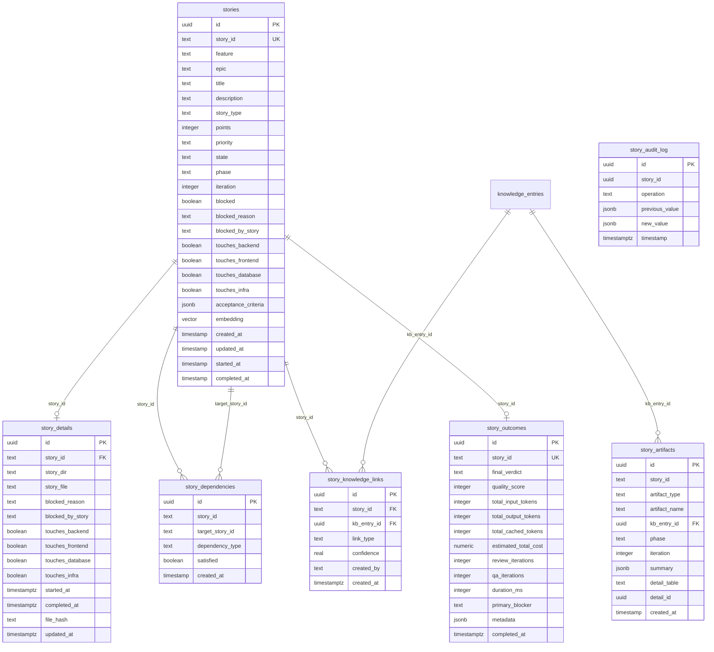
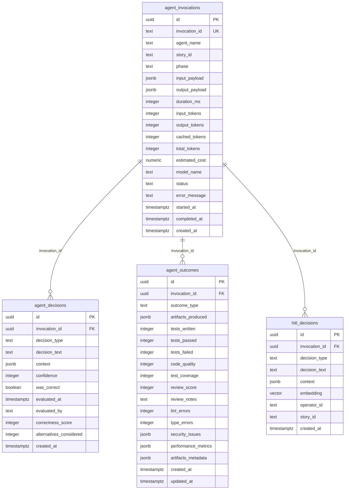
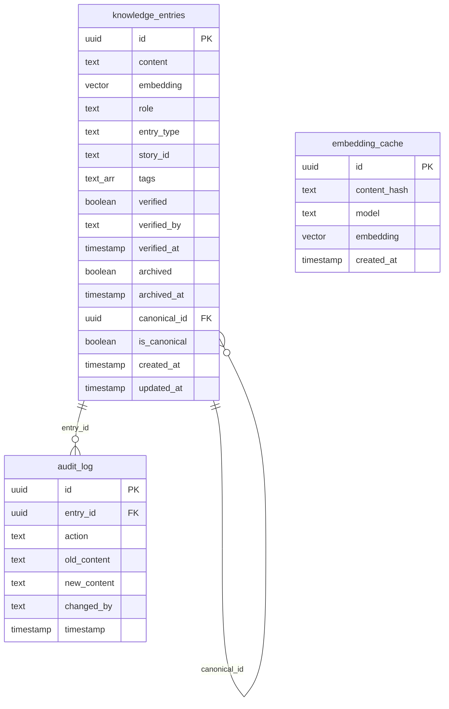
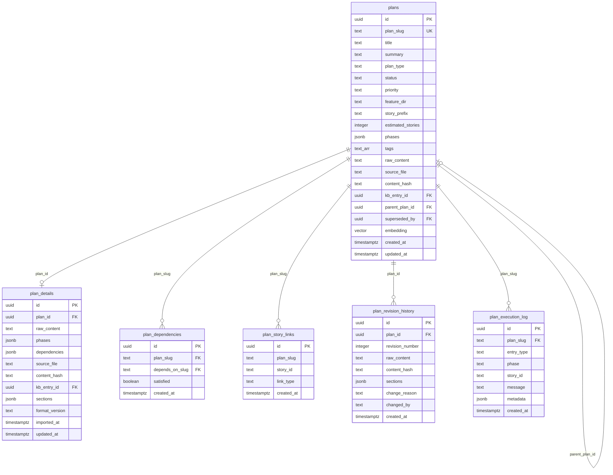
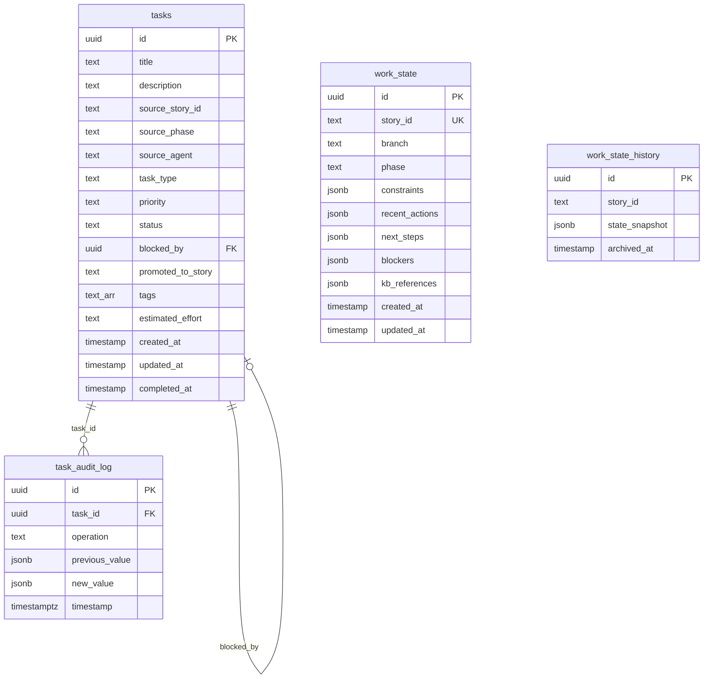
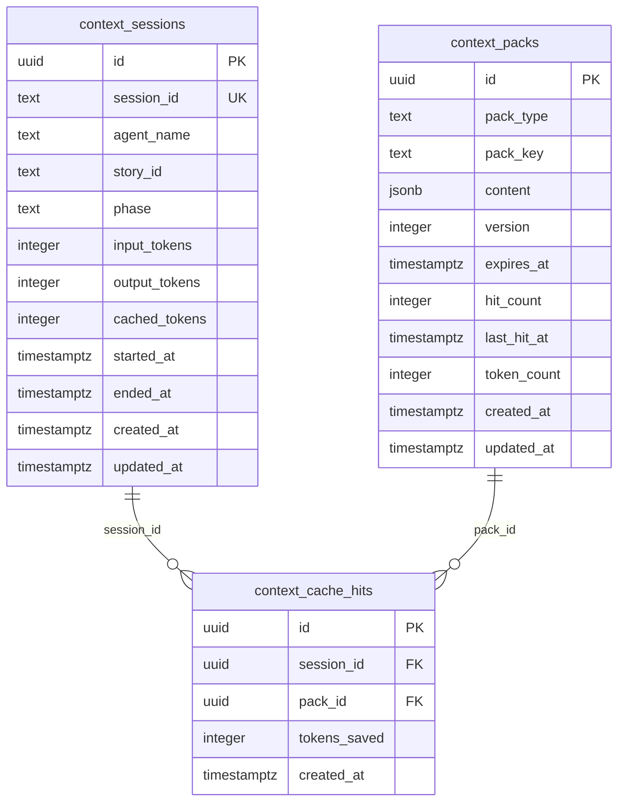

# Knowledgebase Database ERD

## 1. Stories Domain

## 2. Telemetry Domain

## 3. Knowledge Domain

## 4. Plans Domain

## 5. Tasks and Work State Domain

## 6. Context Cache Domain

## Non-Public Schemas

### analytics

- **story_token_usage** - Token usage per story phase
- **change_telemetry** - Change tracking metrics
- **model_assignments** - Model assignment records
- **model_experiments** - A/B experiment configs

### artifacts (17 normalized detail tables)

- artifact_analyses, artifact_checkpoints, artifact_completion_reports, artifact_contexts, artifact_dev_feasibility, artifact_elaborations, artifact_evidence, artifact_fix_summaries, artifact_plans, artifact_proofs, artifact_qa_gates, artifact_reviews, artifact_scopes, artifact_story_seeds, artifact_test_plans, artifact_uiux_notes, artifact_verifications

### workflow

- **stories** - Workflow story state
- **story_dependencies** - Workflow dependency tracking
- **story_state_history** - State transition history
- **workflow_audit_log** - Workflow audit trail
- **workflow_checkpoints** - Execution checkpoints
- **workflow_executions** - Execution records
- **worktrees** - Git worktree tracking

## Foreign Key Summary

| Source                | Column          | Target               | On Delete |
| --------------------- | --------------- | -------------------- | --------- |
| agent_decisions       | invocation_id   | agent_invocations.id | CASCADE   |
| agent_outcomes        | invocation_id   | agent_invocations.id | CASCADE   |
| audit_log             | entry_id        | knowledge_entries.id | SET NULL  |
| context_cache_hits    | session_id      | context_sessions.id  | CASCADE   |
| context_cache_hits    | pack_id         | context_packs.id     | CASCADE   |
| hitl_decisions        | invocation_id   | agent_invocations.id | SET NULL  |
| knowledge_entries     | canonical_id    | knowledge_entries.id | NO ACTION |
| plan_dependencies     | plan_slug       | plans.plan_slug      | RESTRICT  |
| plan_dependencies     | depends_on_slug | plans.plan_slug      | RESTRICT  |
| plan_details          | plan_id         | plans.id             | RESTRICT  |
| plan_details          | kb_entry_id     | knowledge_entries.id | SET NULL  |
| plan_execution_log    | plan_slug       | plans.plan_slug      | RESTRICT  |
| plan_revision_history | plan_id         | plans.id             | RESTRICT  |
| plans                 | parent_plan_id  | plans.id             | SET NULL  |
| plans                 | superseded_by   | plans.id             | NO ACTION |
| plans                 | kb_entry_id     | knowledge_entries.id | SET NULL  |
| story_artifacts       | kb_entry_id     | knowledge_entries.id | SET NULL  |
| story_dependencies    | story_id        | stories.story_id     | CASCADE   |
| story_dependencies    | target_story_id | stories.story_id     | CASCADE   |
| story_details         | story_id        | stories.story_id     | RESTRICT  |
| story_knowledge_links | story_id        | stories.story_id     | RESTRICT  |
| story_knowledge_links | kb_entry_id     | knowledge_entries.id | CASCADE   |
| task_audit_log        | task_id         | tasks.id             | CASCADE   |
| tasks                 | blocked_by      | tasks.id             | SET NULL  |
