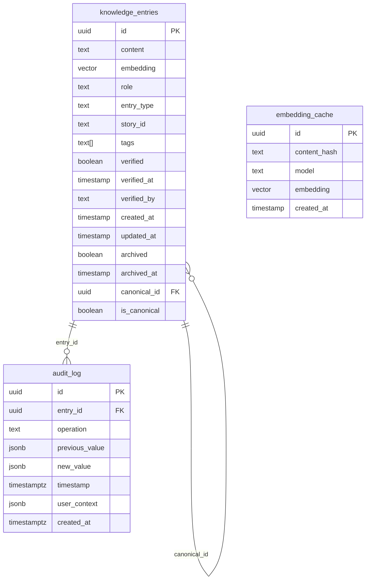
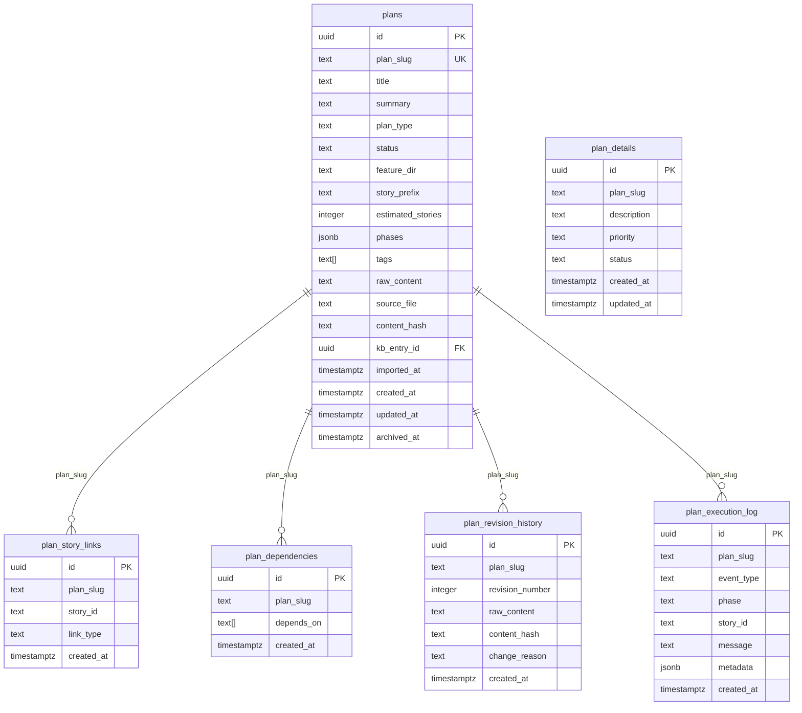
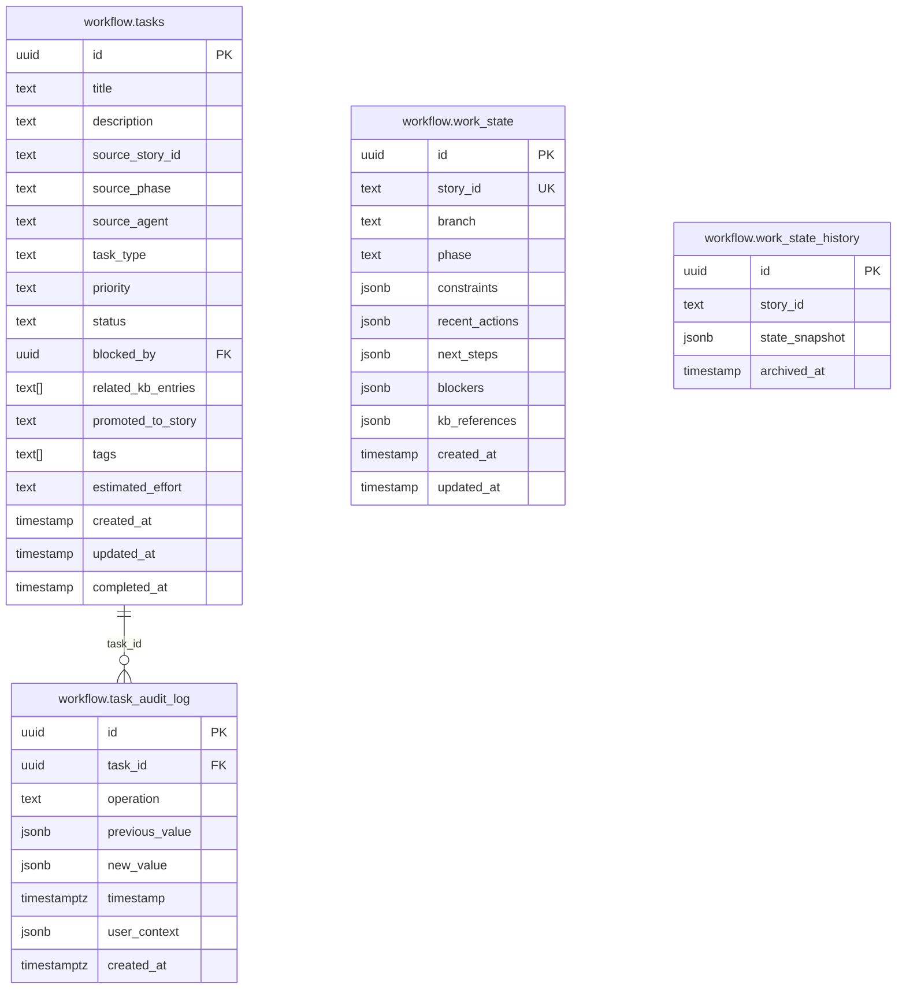
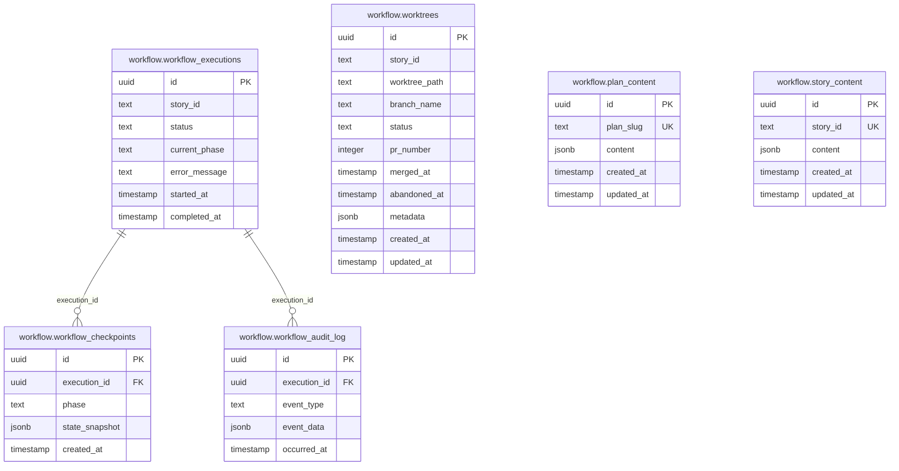
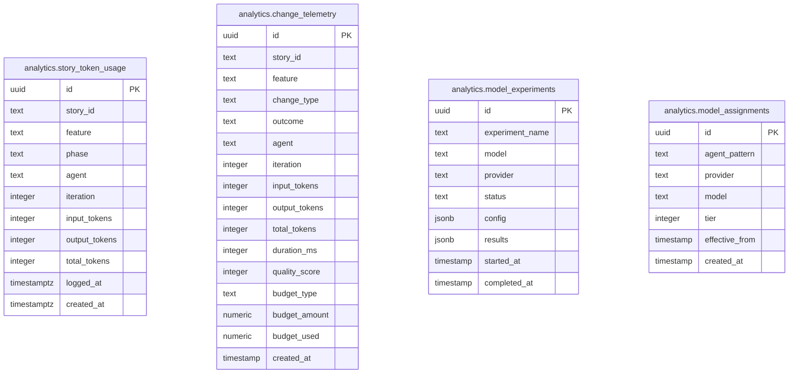
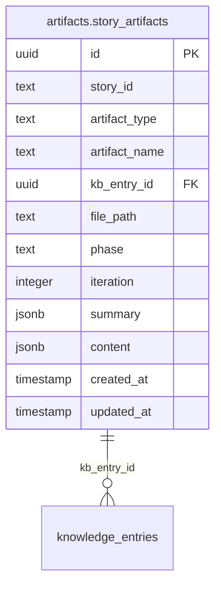
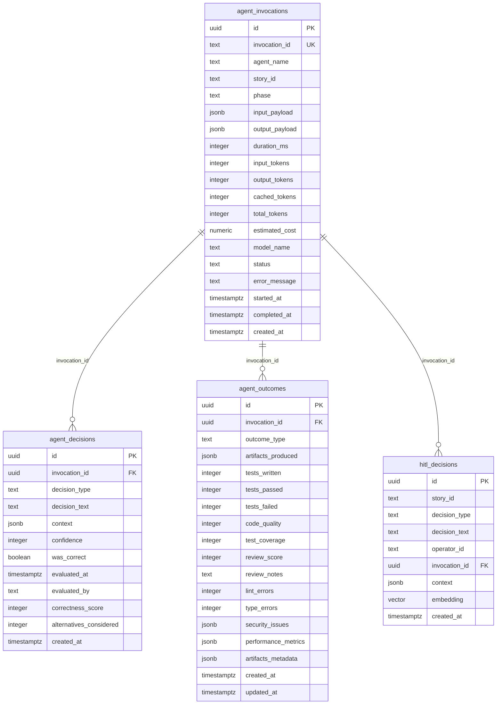
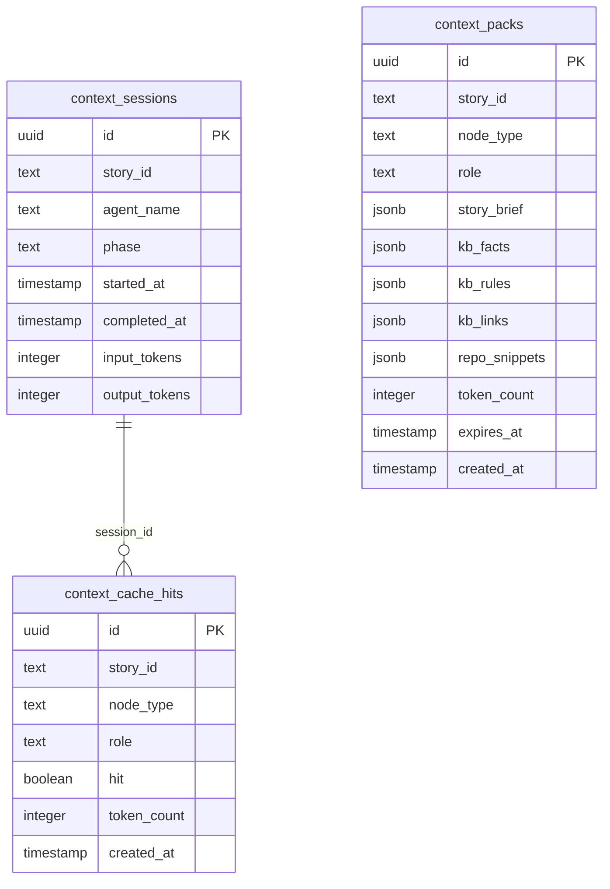

# Knowledgebase Database ERD

> **Last Updated:** 2026-03-13
> **Note:** Database was consolidated via CDBN-2025. Stories, tasks, and work_state tables are now in the `workflow` schema. Artifact tables are consolidated in the `artifacts` schema.

## Schema Overview

| Schema      | Tables | Purpose                                                   |
| ----------- | ------ | --------------------------------------------------------- |
| `public`    | 50     | Core KB tables (knowledge_entries, plans, tasks, etc.)    |
| `workflow`  | 9      | Story/workflow tables (stories, tasks, work_state)        |
| `artifacts` | 18     | Artifact storage (all artifact type tables)               |
| `analytics` | 4      | Telemetry (change*telemetry, model*\*, story_token_usage) |
| `drizzle`   | 1      | Migration tracking (\_\_drizzle_migrations)               |

## 1. Core Knowledge Domain (public)

## 2. Plans Domain (public)

## 3. Stories Domain (workflow)

```mermaid
erDiagram
    workflow.stories ||--o{ workflow.story_details : "story_id"
    workflow.stories ||--o{ workflow.story_dependencies : "story_id"
    workflow.stories ||--o{ workflow.story_knowledge_links : "story_id"
    workflow.stories ||--o{ workflow.story_outcomes : "story_id"
    workflow.stories ||--o{ workflow.story_state_history : "story_id"

    workflow.stories {
        uuid id PK
        text story_id UK
        text feature
        text epic
        text title
        text story_dir
        text story_file
        text story_type
        integer points
        text priority
        text state
        text phase
        integer iteration
        boolean blocked
        text blocked_reason
        text blocked_by_story
        boolean touches_backend
        boolean touches_frontend
        boolean touches_database
        boolean touches_infra
        jsonb acceptance_criteria
        vector embedding
        timestamp created_at
        timestamp updated_at
        timestamp started_at
        timestamp completed_at
    }

    workflow.story_details {
        uuid id PK
        text story_id
        text description
        text[] non_goals
        text[] packages
        timestamp created_at
        timestamp updated_at
    }

    workflow.story_dependencies {
        uuid id PK
        text story_id
        text target_story_id
        text dependency_type
        boolean satisfied
        timestamp created_at
    }

    workflow.story_state_history {
        uuid id PK
        text story_id
        text from_state
        text to_state
        text reason
        text changed_by
        timestamp created_at
    }

    workflow.story_outcomes {
        uuid id PK
        text story_id UK
        text final_verdict
        integer quality_score
        integer total_input_tokens
        integer total_output_tokens
        integer total_cached_tokens
        text estimated_total_cost
        integer review_iterations
        integer qa_iterations
        integer duration_ms
        text primary_blocker
        jsonb metadata
        timestamp completed_at
        timestamp created_at
    }
```

## 4. Tasks and Work State (workflow)

## 5. Workflow Executions (workflow)

## 6. Telemetry (analytics)

## 7. Artifacts (artifacts)

### Artifact Type Tables (artifacts)

| Table                       | Description                 |
| --------------------------- | --------------------------- |
| artifact_analyses           | Code analysis artifacts     |
| artifact_checkpoints        | Phase checkpoint artifacts  |
| artifact_completion_reports | Story completion reports    |
| artifact_contexts           | Context artifacts           |
| artifact_dev_feasibility    | Dev feasibility studies     |
| artifact_elaborations       | Story elaboration artifacts |
| artifact_evidence           | Implementation evidence     |
| artifact_fix_summaries      | Fix cycle summaries         |
| artifact_plans              | Implementation plans        |
| artifact_proofs             | Proof artifacts             |
| artifact_qa_gates           | QA gate decisions           |
| artifact_reviews            | Code review artifacts       |
| artifact_scopes             | Scope definition artifacts  |
| artifact_story_seeds        | Story seed artifacts        |
| artifact_test_plans         | Test plan artifacts         |
| artifact_uiux_notes         | UI/UX notes                 |
| artifact_verifications      | QA verification artifacts   |

## 8. Agent Telemetry (public)

## 9. Context Cache (public)

## 10. Legacy Tables (public)

These tables exist but may be deprecated or have unclear purposes:

| Table           | Description                   |
| --------------- | ----------------------------- |
| adrs            | Architecture Decision Records |
| code_standards  | Code standards entries        |
| cohesion_rules  | Cohesion rules                |
| lessons_learned | Lessons learned entries       |
| rules           | General rules                 |

## Foreign Key Summary

| Source                        | Column        | Target                          | On Delete |
| ----------------------------- | ------------- | ------------------------------- | --------- |
| audit_log                     | entry_id      | knowledge_entries.id            | SET NULL  |
| knowledge_entries             | canonical_id  | knowledge_entries.id            | NO ACTION |
| plans                         | kb_entry_id   | knowledge_entries.id            | SET NULL  |
| plan_story_links              | plan_slug     | plans.plan_slug                 | CASCADE   |
| artifacts.story_artifacts     | kb_entry_id   | knowledge_entries.id            | SET NULL  |
| workflow.task_audit_log       | task_id       | workflow.tasks.id               | CASCADE   |
| workflow.workflow_checkpoints | execution_id  | workflow.workflow_executions.id | CASCADE   |
| workflow.workflow_audit_log   | execution_id  | workflow.workflow_executions.id | CASCADE   |
| agent_decisions               | invocation_id | agent_invocations.id            | CASCADE   |
| agent_outcomes                | invocation_id | agent_invocations.id            | CASCADE   |
