# Workflow State Diagrams - LangGraph vs Claude Code

Comprehensive comparison of workflow state machines showing decision points, missing functionality, and integration gaps.

---

## 1. LangGraph Story Creation Workflow (Current Implementation)

```mermaid
stateDiagram-v2
    [*] --> Initialize
    Initialize --> LoadFromDB: success
    Initialize --> Complete: error

    LoadFromDB --> LoadBaseline
    LoadBaseline --> RetrieveContext
    RetrieveContext --> Seed

    Seed --> FanoutPM: success
    Seed --> Complete: error

    FanoutPM --> FanoutUX
    FanoutUX --> FanoutQA
    FanoutQA --> MergeFanout

    note right of FanoutPM
        Sequential execution
        (parallel needs Send API)
    end note

    MergeFanout --> Attack

    state AttackLoop {
        Attack --> Attack: iteration < max
        Attack --> GapHygiene: complete
    }

    note right of AttackLoop
        Bounded recursion
        max iterations: 3 (default)
    end note

    GapHygiene --> ReadinessScoring

    ReadinessScoring --> HiTL: score < autoApproval
    ReadinessScoring --> Synthesis: score >= autoApproval

    state HiTLDecision {
        HiTL --> Synthesis: approve
        HiTL --> Seed: revise
        HiTL --> Complete: reject/defer
    }

    note right of HiTLDecision
        Human-in-the-Loop gate
        ⚠️ NOT IMPLEMENTED
        Currently auto-approves
    end note

    Synthesis --> SaveToDB
    SaveToDB --> PersistLearnings
    PersistLearnings --> Complete
    Complete --> [*]

    style HiTL fill:#ff6b6b
    style FanoutPM fill:#ffe066
    style FanoutUX fill:#ffe066
    style FanoutQA fill:#ffe066
```



### Decision Points in LangGraph Story Creation

| Decision Point | Condition | Outcome | Status |
|---------------|-----------|---------|--------|
| **afterInitialize** | `currentPhase === 'error'` | → complete | ✅ Implemented |
| | else | → load_from_db | ✅ Implemented |
| **afterSeed** | `currentPhase === 'error'` | → complete | ✅ Implemented |
| | else | → fanout_pm | ✅ Implemented |
| **afterAttack** | `!attackComplete && iteration < max` | → attack (loop) | ✅ Implemented |
| | else | → gap_hygiene | ✅ Implemented |
| **afterReadiness** | `hitlRequired && !hitlDecision` | → hitl | ⚠️ Stub only |
| | else | → synthesis | ✅ Implemented |
| **afterHiTL** | `decision === 'approve'` | → synthesis | ❌ No UI |
| | `decision === 'revise'` | → seed | ❌ No UI |
| | `decision === 'reject/defer'` | → complete | ❌ No UI |

---

## 2. LangGraph Elaboration Workflow (Current Implementation)


### Decision Points in LangGraph Elaboration

| Decision Point | Condition | Outcome | Status |
|---------------|-----------|---------|--------|
| **afterInitialize** | `currentPhase === 'error'` | → complete | ✅ Implemented |
| | else | → load_from_db | ✅ Implemented |
| **afterDeltaDetect** | `!deltaDetected` | → aggregate (skip review) | ✅ Implemented |
| | else | → delta_review | ✅ Implemented |
| **afterEscapeHatch** | `escapeHatchTriggered` | → targeted_review (full) | ✅ Implemented |
| | else | → aggregate | ✅ Implemented |
| **afterAggregate** | `recalculateReadiness === true` | → update_readiness | ✅ Implemented |
| | else | → save_to_db | ✅ Implemented |

---

## 3. Claude Code /elab-story Workflow (Interactive Mode)

```mermaid
stateDiagram-v2
    [*] --> Phase0_Setup

    state "Phase 0: Setup" as Phase0_Setup {
        [*] --> ValidatePreconditions
        ValidatePreconditions --> CheckStage
        CheckStage --> LoadStory
        LoadStory --> CreateContext
        CreateContext --> WriteCheckpoint
        WriteCheckpoint --> [*]
    }

    Phase0_Setup --> Phase1_Analysis: ✅ SETUP COMPLETE

    state "Phase 1: Analysis" as Phase1_Analysis {
        [*] --> MoveStoryToElab
        MoveStoryToElab --> AnalyzeGaps
        AnalyzeGaps --> GenerateFuture
        GenerateFuture --> WriteAnalysis
        WriteAnalysis --> [*]
    }

    Phase1_Analysis --> InteractiveDecisions: ✅ ANALYSIS COMPLETE

    state "Interactive Mode" as InteractiveDecisions {
        [*] --> AskUserReview
        AskUserReview --> CollectDecisions

        state "Per-Finding Decision" as CollectDecisions {
            [*] --> PromptUser
            PromptUser --> AddAsAC: choice 1
            PromptUser --> FollowUpStory: choice 2
            PromptUser --> OutOfScope: choice 3
            PromptUser --> Skip: choice 4

            AddAsAC --> NextFinding
            FollowUpStory --> NextFinding
            OutOfScope --> NextFinding
            Skip --> NextFinding

            NextFinding --> PromptUser: more findings
            NextFinding --> [*]: done
        }

        CollectDecisions --> [*]
    }

    note right of InteractiveDecisions
        ⚠️ MISSING IN LANGGRAPH
        Interactive prompts via AskUserQuestion
        User decides fate of each finding
    end note

    InteractiveDecisions --> Phase2_Completion: decisions collected

    state "Phase 2: Completion" as Phase2_Completion {
        [*] --> WriteDecisions
        WriteDecisions --> UpdateStory
        UpdateStory --> DetermineVerdict

        state VerdictRouting {
            DetermineVerdict --> MoveToReady: PASS
            DetermineVerdict --> MoveToReady: CONDITIONAL_PASS
            DetermineVerdict --> SplitWorkflow: SPLIT_REQUIRED
            DetermineVerdict --> MoveToBacklog: FAIL
        }

        VerdictRouting --> [*]
    }

    Phase2_Completion --> Phase3_FollowUp: follow-up stories created
    Phase2_Completion --> [*]: PASS/FAIL

    state "Phase 3: Follow-Up (if needed)" as Phase3_FollowUp {
        [*] --> CreateFollowUps
        CreateFollowUps --> UpdateIndex
        UpdateIndex --> [*]
    }

    Phase3_FollowUp --> [*]

    style InteractiveDecisions fill:#ff6b6b
    style CollectDecisions fill:#ff6b6b
```



### Interactive Decision Flow (Missing in LangGraph)


---

## 4. Claude Code /elab-story --autonomous Mode


---

## 5. Claude Code /pm-story Workflow

```mermaid
stateDiagram-v2
    [*] --> Phase0_Seed

    state "Phase 0: Seed" as Phase0_Seed {
        [*] --> ParseInput
        ParseInput --> LoadBaseline
        LoadBaseline --> LoadContext
        LoadContext --> GenerateStoryID
        GenerateStoryID --> DraftStructure
        DraftStructure --> [*]
    }

    Phase0_Seed --> Phase1_Generation: ✅ SEED COMPLETE

    state "Phase 1: Generation" as Phase1_Generation {
        [*] --> RunGapAnalysis

        state "Parallel Gap Analysis" as RunGapAnalysis {
            [*] --> PMGap
            [*] --> UXGap
            [*] --> QAGap

            PMGap --> MergeGaps
            UXGap --> MergeGaps
            QAGap --> MergeGaps

            note left of PMGap
                ⚠️ SEQUENTIAL IN LANGGRAPH
                Claude Code uses Task tool
                to spawn parallel agents
            end note
        }

        MergeGaps --> SynthesizeStory
        SynthesizeStory --> WriteStoryFile
        WriteStoryFile --> UpdateIndex
        UpdateIndex --> [*]
    }

    Phase1_Generation --> ElaborationCheck: --elab flag?

    ElaborationCheck --> RunElaboration: yes
    ElaborationCheck --> [*]: no

    RunElaboration --> [*]

    style RunGapAnalysis fill:#ffe066
```



---

## 6. MISSING FUNCTIONALITY SUMMARY

### Critical Gaps (Blocking Migration)


### Detailed Gap Analysis

| Feature | Claude Code | LangGraph | Gap Size | Priority |
|---------|------------|-----------|----------|----------|
| **Interactive Decisions** | ✅ AskUserQuestion per finding | ❌ None | 🔴 CRITICAL | P0 |
| **Follow-Up Stories** | ✅ Spawns pm-story-followup-leader | ❌ None | 🔴 CRITICAL | P0 |
| **Verdict Routing** | ✅ 4 verdicts + story moves | ⚠️ 2 verdicts only | 🟡 HIGH | P1 |
| **KB Writing** | ✅ Spawns kb-writer for findings | ❌ None | 🟡 HIGH | P1 |
| **File I/O** | ✅ Full Read/Write/Edit/Move | ❌ None | 🔴 CRITICAL | P0 |
| **Story Stage Movement** | ✅ mv backlog/ ↔ ready-to-work/ | ❌ None | 🔴 CRITICAL | P0 |
| **Index Updates** | ✅ stories.index.md sync | ❌ None | 🔴 CRITICAL | P0 |
| **Parallel Execution** | ✅ True parallel (Task tool) | ⚠️ Sequential fanout | 🟢 MEDIUM | P2 |
| **Checkpoint Resume** | ✅ CHECKPOINT.md | ⚠️ Partial (DB only) | 🟢 MEDIUM | P2 |
| **Autonomous Mode** | ✅ Full implementation | ⚠️ Partial logic | 🟡 HIGH | P1 |
| **Split Detection** | ✅ SPLIT_REQUIRED verdict | ❌ None | 🟡 HIGH | P1 |

---

## 7. DECISION-MAKING COMPARISON

### LangGraph Decision Points (Programmatic)

```typescript
// All decisions are code-based, no user input
function afterReadiness(state: StoryCreationState): string {
  if (state.hitlRequired && !state.hitlDecision) {
    return 'hitl'  // ⚠️ But hitl node is a stub!
  }
  return 'synthesis'
}

function afterHiTL(state: StoryCreationState): string {
  switch (state.hitlDecision) {
    case 'approve': return 'synthesis'
    case 'revise': return 'seed'
    case 'reject':
    case 'defer':
    default: return 'complete'
  }
  // ❌ No UI to collect hitlDecision!
}
```

### Claude Code Decision Points (Interactive)

```typescript
// User makes decisions via AskUserQuestion
const answers = await AskUserQuestion({
  questions: [{
    question: "How should we handle this gap?",
    header: "Gap Decision",
    multiSelect: false,
    options: [
      { label: "Add as AC", description: "..." },
      { label: "Follow-up story", description: "..." },
      { label: "Out of scope", description: "..." },
      { label: "Skip for now", description: "..." }
    ]
  }]
})

// Then execute based on user choice
switch (answers.gap_decision) {
  case "Add as AC":
    await appendToStory(storyId, newAC)
    break
  case "Follow-up story":
    await createFollowUpStory(gap)
    break
  // ... etc
}
```

---

## 8. INTEGRATION ARCHITECTURE (Proposed)


---

## 9. IMPLEMENTATION PRIORITIES

### Phase 1: Foundation (Week 1) ✅ COMPLETE
- [x] Ollama setup
- [x] Model assignments
- [x] Test existing workflows

### Phase 2: Critical Gaps (Weeks 2-4)

**P0: File I/O Adapters**
```typescript
class StoryFileAdapter {
  async readStory(storyId: string, stage: StoryStage): Promise<Story>
  async writeStory(story: Story, stage: StoryStage): Promise<void>
  async moveStory(storyId: string, from: StoryStage, to: StoryStage): Promise<void>
}

class IndexAdapter {
  async updateIndex(storyId: string, updates: Partial<IndexEntry>): Promise<void>
  async addStory(entry: IndexEntry): Promise<void>
}
```

**P0: Interactive Decision Callbacks**
```typescript
type DecisionCallback = (
  finding: Finding,
  options: DecisionOption[]
) => Promise<Decision>

const result = await runElaboration(story, {
  onDecisionNeeded: async (finding, options) => {
    // Could be CLI prompt, web UI, or auto-decision
    return await promptUser(finding, options)
  }
})
```

**P0: Follow-Up Story Creation**
```typescript
// Add to elaboration graph
const followUpNode = createNode('create_follow_ups', async (state) => {
  const followUpDecisions = state.decisions.filter(d => d.type === 'follow-up')

  for (const decision of followUpDecisions) {
    await runStoryCreation({
      domain: state.epicPrefix,
      description: decision.finding.description,
      relatedTo: state.storyId,
      priority: 'medium'
    })
  }

  return { followUpsCreated: followUpDecisions.length }
})
```

### Phase 3: High Priority Gaps (Weeks 5-6)

**P1: Verdict Routing**
```typescript
// Add SPLIT_REQUIRED verdict
function afterAggregate(state: ElaborationState): string {
  if (state.verdict === 'SPLIT_REQUIRED') {
    return 'split_story'
  }
  if (state.verdict === 'CONDITIONAL_PASS') {
    return 'log_risks_and_pass'
  }
  // ... existing verdicts
}
```

**P1: KB Writing**
```typescript
const kbWriteNode = createNode('write_to_kb', async (state) => {
  const nonBlockingFindings = state.findings.filter(f => !f.mvpBlocking)

  for (const finding of nonBlockingFindings) {
    await kbAdapter.writeEntry({
      category: 'future-opportunity',
      storyId: state.storyId,
      content: finding.description,
      tags: finding.tags
    })
  }

  return { kbEntriesWritten: nonBlockingFindings.length }
})
```

**P1: Autonomous Mode**
```typescript
// Extend autonomous decision node
const autonomousNode = createLLMPoweredNode(
  { name: 'elab-autonomous-decider' },
  async (state, config) => {
    const llm = config.configurable?.llm

    // Classify each finding
    const decisions = await Promise.all(
      state.findings.map(async finding => {
        const classification = await classifyFinding(finding, llm)

        if (classification.mvpBlocking) {
          return { type: 'add-ac', finding }
        } else {
          return { type: 'kb-entry', finding }
        }
      })
    )

    return { decisions, verdict: determineVerdict(decisions) }
  }
)
```

---

## 10. MIGRATION DECISION TREE


---

## 11. RECOMMENDATIONS

### Immediate Actions

1. **Build File I/O Adapters** (Week 2)
   - Start with StoryFileAdapter
   - Add IndexAdapter
   - Add StageAdapter

2. **Implement Decision Callbacks** (Week 2-3)
   - Define callback interface
   - Create CLI implementation
   - Add to elaboration workflow

3. **Add Follow-Up Story Node** (Week 3)
   - New node in elaboration graph
   - Calls runStoryCreation() internally
   - Updates index with relationships

4. **Test with Real Stories** (Week 4)
   - Run INST-1008 through LangGraph
   - Compare quality with Claude Code
   - Validate cost savings

### Commands to Migrate First

Based on gap analysis:

**✅ Ready Now:**
- None (need File I/O first)

**⚠️ Ready After File I/O (Week 3):**
- `/pm-story` (autonomous mode only)
- `/pm-bootstrap-workflow`

**⚠️ Ready After Callbacks (Week 4):**
- `/elab-story --autonomous`

**❌ Need Full Implementation (Week 6+):**
- `/elab-story` (interactive)
- `/dev-code-review`
- `/dev-implement-story`

---

## Conclusion

**Critical Finding:** LangGraph workflows are functionally complete for **orchestration logic** but **completely missing** the **integration layer** for:
- User interaction (interactive decisions)
- File operations (read/write/move story files)
- External system integration (KB writes, index updates)

**Recommendation:** Focus Phase 2 (Weeks 2-4) entirely on building the **integration adapters** before migrating any commands. The workflows are solid, but they're isolated from the file system and user interface.

**Next Step:** Create `src/adapters/` directory and build:
1. `story-file-adapter.ts` (P0)
2. `index-adapter.ts` (P0)
3. `decision-callback.ts` (P0)
4. `kb-adapter.ts` (P1)
