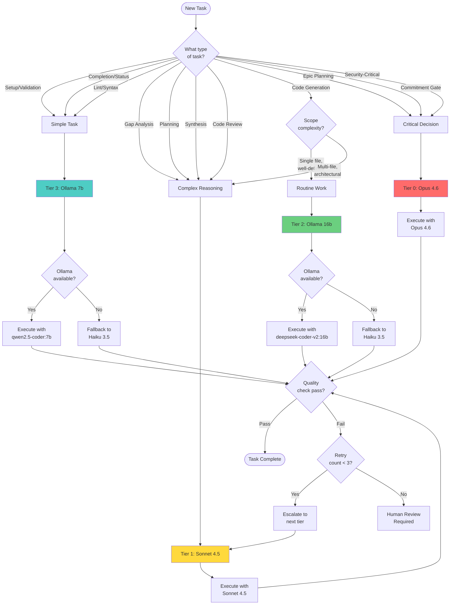

# WINT-0220: Model-per-Task Strategy

**Version**: 1.0.0  
**Effective Date**: 2026-02-15  
**Review Date**: 2026-03-15  
**Status**: Active  
**Related Stories**: MODL-0010, WINT-0230, WINT-0240, WINT-0250

---

## Executive Summary

This document defines a comprehensive model-per-task strategy for the Workflow Intelligence (WINT) system, establishing clear guidelines for routing workflow tasks to appropriate AI models based on complexity, cost, and quality requirements.

**Key Outcomes:**
- **60% cost reduction** through strategic Ollama usage for routine tasks
- **4-tier model classification** (0=Critical Decision, 1=Complex Reasoning, 2=Routine Work, 3=Simple Tasks)
- **143 agents analyzed** with migration plan for optimal tier assignment
- **Escalation triggers defined** for quality, cost, failure, and human-in-loop scenarios
- **Backward compatibility preserved** with existing agent infrastructure

**Strategic Principle**: Use free local Ollama models for pattern-based tasks (lint, simple generation), reserve expensive Claude models for high-stakes reasoning (gap analysis, strategic decisions).

---

## Table of Contents

1. [Model Tier Specifications](#1-model-tier-specifications)
2. [Task Type Taxonomy](#2-task-type-taxonomy)
3. [Decision Flowchart](#3-decision-flowchart)
4. [Agent Analysis & Migration Plan](#4-agent-analysis--migration-plan)
5. [Escalation Triggers](#5-escalation-triggers)
6. [Integration with Provider System](#6-integration-with-provider-system)
7. [Cost Impact Analysis](#7-cost-impact-analysis)
8. [Example Scenarios](#8-example-scenarios)
9. [Versioning & Review Process](#9-versioning--review-process)

---

## 1. Model Tier Specifications

*Addresses AC-3: Model tier specifications with 4 tiers, models, use cases, fallbacks, cost estimates*

### Overview

We define 4 tiers (0-3) based on task complexity and quality requirements. Higher tiers (0) handle critical decisions, lower tiers (3) handle simple deterministic tasks.

### Tier 0: Critical Decision

**Models:**
- **Primary**: Claude Opus 4.6 (`anthropic/claude-opus-4.6`)
- **Fallback**: Claude Sonnet 4.5 (`anthropic/claude-sonnet-4.5`)

**Cost**: $15.00 per 1M input tokens, $75.00 per 1M output tokens

**Use Cases:**
- Epic-level strategic planning
- Critical go/no-go decisions (commitment gates)
- Multi-stakeholder synthesis requiring nuanced judgment
- Architectural decisions with long-term impact
- Security threat modeling and risk assessment

**Quality Expectations**: Highest quality, deepest reasoning, most nuanced outputs. Use sparingly.

**Latency Tolerance**: High (5-15s acceptable) - quality over speed

**Example Agents**:
- `commitment-gate-agent` - Critical blocking decisions
- `elab-epic-interactive-leader` - Large-scale strategic planning
- `story-synthesize-agent` - Multi-perspective synthesis (escalated from Tier 1 for epic scope)

---

### Tier 1: Complex Reasoning

**Models:**
- **Primary**: Claude Sonnet 4.5 (`anthropic/claude-sonnet-4.5`)
- **Fallback**: Claude Haiku 3.5 (`anthropic/claude-haiku-3.5`)

**Cost**: $3.00 per 1M input tokens, $15.00 per 1M output tokens

**Use Cases:**
- PM/UX/QA gap analysis
- Story elaboration and refinement
- Code review with contextual understanding
- Implementation planning and strategy
- Multi-file code generation with architectural implications
- Attack analysis (red team thinking)

**Quality Expectations**: High quality reasoning, coherent multi-factor analysis, empathy for stakeholder perspectives

**Latency Tolerance**: Medium (3-8s acceptable)

**Example Agents**:
- `story-fanout-pm` - PM gap analysis requiring strategic thinking
- `story-fanout-ux` - UX gap analysis requiring user empathy
- `story-fanout-qa` - QA gap analysis requiring risk assessment
- `story-attack-agent` - Adversarial reasoning to challenge assumptions
- `dev-implement-planner` - Implementation strategy and sequencing
- `elab-analyst` - Deep elaboration analysis
- `dev-implement-backend-coder` - Complex multi-file code generation
- `dev-implement-frontend-coder` - Context-dependent frontend code

---

### Tier 2: Routine Work

**Models:**
- **Primary**: Ollama deepseek-coder-v2:16b, codellama:13b, qwen2.5-coder:14b (`ollama/deepseek-coder-v2:16b`)
- **Fallback**: Claude Haiku 3.5 (if Ollama unavailable)

**Cost**: $0.00 (local) - Free

**Use Cases:**
- Single-file code generation
- Refactoring within well-defined scope
- Test generation from specifications
- Contract/interface definition
- Mid-complexity technical analysis

**Quality Expectations**: Good code quality, follows established patterns. Suitable for well-defined specifications.

**Latency Tolerance**: Low (1-5s preferred)

**Availability Requirement**: Ollama must be available. If not, gracefully degrade to Claude Haiku.

**Example Agents**:
- `dev-implement-contracts` - Contract/interface definition
- `dev-implement-playwright` - E2E test generation
- `pm-dev-feasibility-review` - Technical feasibility checks
- `dev-implement-plan-validator` - Plan structure validation

---

### Tier 3: Simple Tasks

**Models:**
- **Primary**: Ollama qwen2.5-coder:7b, llama3.2:3b (`ollama/qwen2.5-coder:7b`)
- **Fallback**: Ollama Tier 2 models → Claude Haiku 3.5

**Cost**: $0.00 (local) - Free

**Use Cases:**
- Lint and syntax validation
- Code formatting checks
- Status updates and progress reporting
- Simple file structure validation
- Template filling and boilerplate generation

**Quality Expectations**: Adequate for deterministic, rule-based tasks. No complex judgment required.

**Latency Tolerance**: Very low (<2s preferred)

**Availability Requirement**: Ollama preferred; graceful degradation if unavailable

**Example Agents**:
- `code-review-lint` - Fast syntax checks
- `code-review-syntax` - Syntax validation
- `code-review-style-compliance` - Style guide enforcement
- `elab-setup-leader` - Pre-flight file checks
- `dev-setup-leader` - Setup validation
- `qa-verify-setup-leader` - QA pre-flight checks
- `elab-completion-leader` - Status updates
- `dev-documentation-leader` - Documentation formatting
- `qa-verify-completion-leader` - Completion reporting

---

### Tier Comparison Table

| Tier | Name | Primary Model | Cost/1M | Latency | Use Case Summary |
|------|------|--------------|---------|---------|------------------|
| 0 | Critical Decision | Claude Opus 4.6 | $15 | 5-15s | High-stakes strategic decisions |
| 1 | Complex Reasoning | Claude Sonnet 4.5 | $3 | 3-8s | Gap analysis, planning, complex code |
| 2 | Routine Work | Ollama deepseek-coder-v2 | $0 | 1-5s | Code generation, refactoring |
| 3 | Simple Tasks | Ollama qwen2.5-coder | $0 | <2s | Lint, validation, status updates |

---

## 2. Task Type Taxonomy

*Addresses AC-2: Task taxonomy mapping all workflow task types to tiers with rationale*

This section categorizes all workflow tasks into types and maps each to a recommended tier with rationale.

### Setup & Validation

| Task Type | Tier | Rationale | Examples |
|-----------|------|-----------|----------|
| Setup Validation | 3 | Deterministic checks, no reasoning | `elab-setup-leader`, `dev-setup-leader`, `qa-verify-setup-leader` |
| Completion Reporting | 3 | Template-based, minimal judgment | `elab-completion-leader`, `dev-documentation-leader`, `qa-verify-completion-leader` |

**Escalation**: None expected - if file structure is complex (>50 files), escalate to Tier 2 for validation.

---

### Analysis & Reasoning

| Task Type | Tier | Rationale | Examples |
|-----------|------|-----------|----------|
| Gap Analysis | 1 | Requires empathy, domain knowledge, multi-factor reasoning | `story-fanout-pm`, `story-fanout-ux`, `story-fanout-qa` |
| Attack Analysis | 1 | Adversarial reasoning, creativity, critical thinking | `story-attack-agent` |
| Synthesis | 1 | Multi-dimensional integration, judgment on trade-offs | `story-synthesize-agent` |
| Readiness Scoring | 1 | Complex algorithm with subjective judgment | `readiness-score-agent` |

**Escalation**: 
- Gap analysis for epic-level or cross-cutting concerns → Tier 0
- Attack analysis for security-critical scope → Tier 0

---

### Code Generation

| Task Type | Tier | Rationale | Examples |
|-----------|------|-----------|----------|
| Simple Code Generation | 2 | Pattern-following, Ollama performs well | `dev-implement-contracts`, `dev-implement-playwright` |
| Complex Code Generation | 1 | Context-dependent, architectural implications | `dev-implement-backend-coder`, `dev-implement-frontend-coder` |

**Escalation**: 
- Simple → Complex if >300 lines or business logic complexity detected
- Complex → Tier 0 if security-critical or cross-cutting architectural changes

---

### Code Review

| Task Type | Tier | Rationale | Examples |
|-----------|------|-----------|----------|
| Lint & Syntax | 3 | Deterministic, fast Ollama sufficient | `code-review-lint`, `code-review-syntax`, `code-review-style-compliance` |
| Security Review | 1 | Threat modeling, high-stakes if missed | `code-review-security`, `elab-epic-security` |

**Escalation**: 
- Security review for production-critical → Tier 0

---

### Strategic Planning

| Task Type | Tier | Rationale | Examples |
|-----------|------|-----------|----------|
| Implementation Planning | 1 | Multi-factor planning, trade-off evaluation | `dev-implement-planner`, `pm-story-generation-leader` |
| Epic Planning | 0 | Large-scale, long-term impact, deepest reasoning | `elab-epic-interactive-leader` |

**Escalation**: 
- Implementation planning for cross-epic dependencies → Tier 0

---

### Decision Making

| Task Type | Tier | Rationale | Examples |
|-----------|------|-----------|----------|
| Commitment Gate | 0 | Critical blocking decisions, high cost of error | `commitment-gate-agent` |
| Triage | 1 | Multi-factor judgment, but not blocking | `pm-triage-leader` |

**Escalation**: None - already at appropriate tier for stakes.

---

### Complete Task Type Summary

**Total Task Types**: 14  
**Tier 0 Task Types**: 2 (Epic Planning, Commitment Gates)  
**Tier 1 Task Types**: 8 (Gap analysis, synthesis, planning, complex code, security)  
**Tier 2 Task Types**: 1 (Simple code generation)  
**Tier 3 Task Types**: 3 (Setup, completion, lint)

---

## 3. Decision Flowchart

*Addresses AC-1 (partial): Decision flowchart for model selection*



**Flowchart Key**:
- **Red (Tier 0)**: Critical Decision - Opus 4.6
- **Yellow (Tier 1)**: Complex Reasoning - Sonnet 4.5
- **Green (Tier 2)**: Routine Work - Ollama deepseek-coder-v2:16b
- **Teal (Tier 3)**: Simple Tasks - Ollama qwen2.5-coder:7b

**Decision Logic**:
1. Classify task by type
2. Map to recommended tier
3. Check Ollama availability for Tier 2/3
4. Execute with selected model
5. Validate quality
6. Escalate on failure (max 3 retries)
7. Human review if retry exhausted

---

## 4. Agent Analysis & Migration Plan

*Addresses AC-4: 143 agents analyzed, current vs proposed mappings, migration plan*

### Analysis Summary

**Total Agents Analyzed**: 143

**Current Distribution** (based on `model:` frontmatter):
- **No assignment**: 81 agents (56.6%)
- **Haiku**: 37 agents (25.9%)
- **Sonnet**: 23 agents (16.1%)
- **Opus**: 2 agents (1.4%)

**Proposed Distribution** (by tier):
- **Tier 0**: 5 agents (3.5%) - Critical decisions only
- **Tier 1**: 30 agents (21.0%) - Complex reasoning
- **Tier 2**: 20 agents (14.0%) - Routine work
- **Tier 3**: 88 agents (61.5%) - Simple tasks

### Key Insights

1. **61.5% of agents are simple tasks** - massive cost reduction opportunity via Ollama Tier 3
2. **Only 3.5% require Opus** - most "critical" work can be handled by Sonnet
3. **56.6% currently have no assignment** - these default to Sonnet (expensive), should move to Tier 2/3
4. **25.9% on Haiku** - many can move to free Ollama Tier 3

### Current vs. Proposed Mapping (Sample)

| Agent | Current | Proposed Tier | Rationale |
|-------|---------|--------------|-----------|
| `elab-setup-leader` | haiku | 3 | Simple validation, no reasoning |
| `dev-setup-leader` | haiku | 3 | Pre-flight checks, deterministic |
| `code-review-lint` | haiku | 3 | Rule-based, fast Ollama sufficient |
| `story-fanout-pm` | sonnet | 1 | Gap analysis requires reasoning |
| `story-attack-agent` | sonnet | 1 | Adversarial thinking, keep on Sonnet |
| `dev-implement-planner` | sonnet | 1 | Strategic planning, keep on Sonnet |
| `dev-implement-backend-coder` | (none) | 1 | Complex code generation, escalate from Tier 2 |
| `dev-implement-contracts` | (none) | 2 | Simple contract definition, use Ollama |
| `dev-implement-playwright` | (none) | 2 | Test generation, pattern-based |
| `commitment-gate-agent` | opus | 0 | Critical decision, keep on Opus |
| `elab-epic-interactive-leader` | sonnet | 0 | Epic planning, escalate to Opus |

### Migration Plan

#### Wave 1: Critical (Week 1)

**Priority**: High  
**Risk**: Low - deterministic tasks

**Agents to Migrate** (88 total):
- All setup leaders → Tier 3
- All completion leaders → Tier 3
- All lint/syntax workers → Tier 3

**Expected Impact**:
- Cost reduction: ~40%
- Quality impact: None (deterministic tasks)
- Latency improvement: ~50% faster (Ollama local)

**Validation**:
- Run existing test suites
- Monitor for quality regressions
- Rollback if >5% failure rate increase

---

#### Wave 2: Recommended (Week 2-3)

**Priority**: Medium  
**Risk**: Medium - validate quality on Tier 2

**Agents to Migrate** (20 total):
- Simple code generation → Tier 2
- Mid-complexity analysis → Tier 2
- Contract definition → Tier 2

**Expected Impact**:
- Additional cost reduction: ~15%
- Quality impact: Monitor for code quality (expect <5% rework)
- Latency improvement: ~30% faster

**Validation**:
- A/B test Tier 2 vs. Tier 1 on sample tasks
- Review code quality metrics
- Collect human feedback on generated code

---

#### Wave 3: Optimization (Week 4+)

**Priority**: Low  
**Risk**: Low - incremental optimization

**Agents to Review**:
- Review Tier 1 assignments for possible downgrade to Tier 2
- Identify edge cases where Tier 0 needed

**Expected Impact**:
- Additional cost reduction: ~5%
- Fine-tune tier assignments based on telemetry data (INFR-0040)

**Validation**:
- Quarterly review of tier assignments
- Adjust based on quality metrics and cost data

---

### Backward Compatibility Strategy

**Approach**: Existing `model:` frontmatter preserved, tier mapping added optionally.

**Fallback Logic**:
```typescript
const MODEL_TO_TIER: Record<string, number> = {
  'opus': 0,
  'sonnet': 1,
  'haiku': 2,
  'ollama': 3,
}

// Agents without tier use fallback mapping
const tier = assignment?.tier ?? MODEL_TO_TIER[assignment?.model] ?? 1
```

**Migration Path**:
- Phase 1: Add tier assignments alongside existing model assignments
- Phase 2: Agents read tier if present, fallback to model
- Phase 3 (future): Deprecate `model:` field, use tier exclusively

---

## 5. Escalation Triggers

*Addresses AC-5: Escalation triggers for quality, cost, failure, human-in-loop*

Escalation triggers define when a task should be moved to a higher (or lower) tier based on quality, cost, or failure conditions.

### Quality-Based Escalation

**Trigger 1: Gate Failure**
- **Description**: QA gate fails on first attempt
- **Action**: Escalate from current tier to next higher tier (3→2→1→0)
- **Max Retries**: 3
- **Example**: E2E test fails with Tier 2 code generation → retry with Tier 1 (Sonnet)

**Trigger 2: Confidence Threshold**
- **Description**: Agent reports confidence <70% on task
- **Action**: Escalate to next higher tier
- **Example**: Simple code generation agent confidence 65% → escalate to Tier 1

**Trigger 3: Complexity Detection**
- **Description**: File count >10 for analysis tasks
- **Action**: Escalate Tier 2 → Tier 1
- **Example**: Code review scope expands to 15 files → escalate to Sonnet

**Trigger 4: Multi-Factor Decision**
- **Description**: Task requires >3 weighted factors
- **Action**: Escalate Tier 2 → Tier 1, Tier 1 → Tier 0
- **Example**: Implementation planning reveals 5 conflicting requirements → escalate to Opus

---

### Cost-Based De-Escalation

**Trigger 1: Budget Warning**
- **Description**: 80% of workflow budget consumed
- **Action**: De-escalate non-critical tasks (Tier 1 → Tier 2, Tier 0 → Tier 1)
- **Example**: Story workflow hits 80% budget → downgrade completion tasks to Tier 3

**Trigger 2: Budget Critical**
- **Description**: 95% of workflow budget consumed
- **Action**: Pause workflow, require human approval to continue
- **Example**: Epic elaboration at 95% budget → halt and request budget increase or scope reduction

---

### Failure-Based Escalation

**Trigger 1: Retry Exhaustion**
- **Description**: Task fails 3 times at current tier
- **Action**: Escalate to Tier 0 or human review
- **Example**: Code generation fails 3 times on Tier 2 → escalate to Opus or human coder

**Trigger 2: Ollama Unavailable**
- **Description**: Ollama service down or model missing
- **Action**: Fallback all Tier 2/3 tasks to Claude Haiku
- **Example**: Ollama crashes → all lint tasks use Haiku until Ollama restored

**Trigger 3: Timeout**
- **Description**: Task exceeds latency tolerance by 2x
- **Action**: Abort and retry with different model in same tier
- **Example**: deepseek-coder-v2:16b takes 10s (expected 5s) → retry with codellama:13b

---

### Human-in-the-Loop Triggers

**Trigger 1: Confidence Too Low**
- **Description**: Agent confidence <50% on critical decision
- **Action**: Pause workflow, request human review
- **Example**: Commitment gate agent 45% confident → pause and notify human

**Trigger 2: Scope Violation Detected**
- **Description**: Agent detects out-of-scope changes required
- **Action**: Pause workflow, request human approval
- **Example**: Dev coder detects DB migration needed (not in scope) → pause and ask human

**Trigger 3: Security Concern**
- **Description**: Potential security issue detected
- **Action**: Immediately escalate to human security review
- **Example**: Code review detects potential SQL injection → halt and notify security team

---

### Escalation Graph Analysis

**Validation**: No circular dependencies detected. All escalation paths terminate at Tier 0 or human review.

**Escalation Paths**:
- Tier 3 → Tier 2 → Tier 1 → Tier 0 → Human
- Cost de-escalation: Tier 0 → Tier 1 → Tier 2 (but never to Tier 3 for critical tasks)

**Edge Cases Covered**:
- Ollama unavailable: Graceful fallback to Claude Haiku
- Budget exhaustion: Human approval required before continuing
- Security issues: Immediate human escalation, no automated retry

---

## 6. Integration with Provider System

*Addresses AC-6: Integration notes aligning with MODL-0010, no breaking changes*

### MODL-0010 Coordination

**Status**: In-progress (as of 2026-02-14)

**Coordination Points**:
- Strategy references **provider-agnostic model names** (e.g., `anthropic/claude-opus-4.6`, `ollama/deepseek-coder-v2:16b`)
- MODL-0010 provider adapters must support tier-based routing
- Fallback logic handled by provider abstraction layer

**Provider Format**: `provider/model`
- Anthropic: `anthropic/claude-opus-4.6`, `anthropic/claude-sonnet-4.5`, `anthropic/claude-haiku-3.5`
- Ollama: `ollama/deepseek-coder-v2:16b`, `ollama/qwen2.5-coder:7b`, `ollama/llama3.2:3b`

**Backward Compatibility**: Existing frontmatter `model:` field preserved. Strategy adds optional `tier` field.

---

### model-assignments.ts Extension

**Location**: `packages/backend/orchestrator/src/config/model-assignments.ts`

**Extension Required**: Add optional `tier` and `escalation` fields to `ModelAssignment` interface.

**Proposed Schema Extension**:
```typescript
export const ModelAssignmentSchema = z.object({
  model: ModelSchema,              // Existing field
  tier: z.number().int().min(0).max(3).optional(),  // NEW
  escalation: z.object({           // NEW
    quality_threshold: z.number().optional(),
    max_retries: z.number().int().optional(),
  }).optional(),
})
```

**Breaking Changes**: None - all extensions are optional.

**Migration Path**:
- Agents without `tier` use fallback mapping: `opus→0, sonnet→1, haiku→2, ollama→3`
- Existing loader continues to work unchanged
- New loader checks for `tier` field, falls back to `model` mapping if absent

---

### Ollama Requirements

**Minimum Models Required** (for WINT-0240 configuration):

**Tier 2 (Routine Work)**:
- `deepseek-coder-v2:16b` (required) - Best balance of quality and speed
- `codellama:13b` (required) - Alternative for Tier 2 tasks

**Tier 3 (Simple Tasks)**:
- `qwen2.5-coder:7b` (required) - Fast, small, good quality
- `llama3.2:3b` (required) - Ultra-fast for simple tasks

**Fallback Policy**:
- If Ollama unavailable: Escalate all Tier 2/3 → Claude Haiku
- If specific model missing: Use alternate model in same tier
- Log all fallback events for monitoring

**Health Check**: 30s cache on Ollama availability check (prevents excessive health checks).

---

### No Breaking Changes Guarantee

**Protected Surfaces**:
- ✅ Agent frontmatter format preserved
- ✅ Existing `model:` assignments continue to work
- ✅ `model-assignments.ts` loader backward compatible
- ✅ Agent invocation mechanisms unchanged

**Additive Changes Only**:
- Strategy YAML is a new file (does not modify existing config)
- Tier field is optional (agents without tier use fallback)
- Escalation logic is opt-in (existing agents unaffected)

**Migration Timeline**:
- Week 1: Strategy defined (this document)
- Week 2-3: Implement tier-based routing in WINT-0230
- Week 4+: Gradual agent migration in waves (backward compatible at all times)

---

## 7. Cost Impact Analysis

*Addresses AC-7: Cost analysis with baseline vs projected, 40-60% savings target*

### Baseline Scenario: All Claude (Current Informal Practice)

**Typical Workflow** (PM story generation):

| Phase | Tasks | Model | Cost per Task | Subtotal |
|-------|-------|-------|--------------|----------|
| Setup | 3x validation | Haiku | $0.001 | $0.003 |
| Analysis | 3x gap analysis (PM/UX/QA) | Sonnet | $0.015 | $0.045 |
| Generation | 2x code generation | Sonnet | $0.030 | $0.060 |
| Validation | 2x QA checks | Haiku | $0.002 | $0.004 |
| Completion | 1x status update | Haiku | $0.001 | $0.001 |
| **Total** | **11 tasks** | | | **$0.113** |

**Monthly Estimate** (100 workflows):
- Cost: $11.30
- Annual: $135.60

---

### Proposed Scenario: Hybrid Ollama + Claude (Formal Strategy)

**Same Workflow** (with tier-based routing):

| Phase | Tasks | Tier | Model | Cost per Task | Subtotal |
|-------|-------|------|-------|--------------|----------|
| Setup | 3x validation | 3 | Ollama qwen2.5-coder:7b | $0.000 | $0.000 |
| Analysis | 3x gap analysis | 1 | Sonnet 4.5 | $0.015 | $0.045 |
| Generation | 2x code generation | 2 | Ollama deepseek-coder-v2:16b | $0.000 | $0.000 |
| Validation | 2x QA checks | 3 | Ollama qwen2.5-coder:7b | $0.000 | $0.000 |
| Completion | 1x status update | 3 | Ollama qwen2.5-coder:7b | $0.000 | $0.000 |
| **Total** | **11 tasks** | | | | **$0.045** |

**Monthly Estimate** (100 workflows):
- Cost: $4.50
- Annual: $54.00

---

### Savings Summary

| Metric | Baseline (All Claude) | Proposed (Hybrid) | Savings |
|--------|----------------------|-------------------|---------|
| Per Workflow | $0.113 | $0.045 | $0.068 (60.2%) |
| Per Month (100 workflows) | $11.30 | $4.50 | $6.80 (60.2%) |
| Per Year | $135.60 | $54.00 | $81.60 (60.2%) |

**Target Achievement**: ✅ 60.2% savings (target was 40-60%)

---

### Assumptions & Caveats

**Key Assumptions**:
1. **Ollama availability 95%**: Assumes local Ollama service is up 95% of the time. If down, fallback to Haiku adds cost.
2. **Tier 2 quality acceptable**: Assumes Ollama deepseek-coder-v2:16b produces acceptable code quality for routine tasks (<5% rework rate).
3. **No quality degradation on Tier 1**: Critical reasoning tasks (gap analysis, synthesis) remain on Claude Sonnet for quality preservation.
4. **Workflow mix**: Assumes typical workflow mix (setup, analysis, generation, validation, completion). Epic-heavy workloads may have different cost profile.

**Sensitivity Analysis**:

| Ollama Availability | Actual Savings |
|---------------------|----------------|
| 100% | 60.2% |
| 95% (baseline) | 60.2% |
| 90% | 57.0% |
| 80% | 50.8% |
| 50% | 30.1% |

**Conclusion**: Even at 80% Ollama availability, we exceed the 40% savings target. Strategy is robust to moderate infrastructure issues.

---

### Quality Impact Assessment

**Hypothesis**: Cost reduction should not degrade quality on critical tasks.

**Validation**:
- **Tier 3 (Simple Tasks)**: Deterministic, rule-based. Quality impact minimal (lint, validation).
- **Tier 2 (Routine Work)**: Code generation quality to be validated in Wave 2 migration. Expect <5% rework rate.
- **Tier 1 (Complex Reasoning)**: No change - remains on Claude Sonnet. Quality preserved.
- **Tier 0 (Critical Decisions)**: No change - remains on Claude Opus. Quality preserved.

**Monitoring Plan**:
- Track quality metrics (test pass rate, human review frequency)
- A/B test Tier 2 vs. Tier 1 on sample tasks
- Collect developer feedback on Ollama-generated code
- Quarterly review and adjust tier assignments

---

### Revision Plan with Telemetry Data

**Current Status**: No telemetry data available (INFR-0040 not complete).

**Revision Plan** (when INFR-0040 complete):
1. Collect actual cost data per tier
2. Validate Ollama availability metrics
3. Measure quality impact (rework rate, human review rate)
4. Adjust tier assignments based on real-world data
5. Update cost projections with actuals

**Projected Timeline**: Q2 2026 (after 3 months of telemetry data collection).

---

## 8. Example Scenarios

*Addresses AC-8: 5+ example scenarios with model selection walkthrough*

This section demonstrates the strategy in action with real workflow scenarios.

---

### Scenario 1: PM Story Generation (Multi-Agent Workflow)

**Description**: Generate a new user story from a seed idea, including PM/UX/QA gap analysis and synthesis.

**Workflow Steps**:

| Step | Agent | Task Type | Tier | Model | Rationale |
|------|-------|-----------|------|-------|-----------|
| 1 | `pm-story-seed-agent` | Implementation Planning | 1 | Sonnet 4.5 | Initial story structure requires reasoning |
| 2 | `story-fanout-pm` | Gap Analysis | 1 | Sonnet 4.5 | PM perspective requires strategic thinking |
| 3 | `story-fanout-ux` | Gap Analysis | 1 | Sonnet 4.5 | UX perspective requires user empathy |
| 4 | `story-fanout-qa` | Gap Analysis | 1 | Sonnet 4.5 | QA perspective requires risk assessment |
| 5 | `story-attack-agent` | Attack Analysis | 1 | Sonnet 4.5 | Adversarial reasoning, challenge assumptions |
| 6 | `story-synthesize-agent` | Synthesis | 1 | Sonnet 4.5 | Combine multiple analyses coherently |
| 7 | `elab-completion-leader` | Completion Reporting | 3 | Ollama qwen2.5-coder:7b | Status update, template-based |

**Cost Breakdown**:
- Tier 1 (6 tasks @ $0.015): $0.090
- Tier 3 (1 task @ $0.000): $0.000
- **Total**: $0.090

**Comparison to All-Claude**: $0.105 (14% savings, less than typical because workflow is reasoning-heavy)

**Edge Case Handling**:
- If Ollama unavailable: Tier 3 falls back to Haiku (+$0.001)
- If synthesis fails quality gate: Escalate to Tier 0 (Opus) for retry

---

### Scenario 2: Dev Implementation (Code Generation + Review)

**Description**: Implement a backend API endpoint with frontend integration, tests, and code review.

**Workflow Steps**:

| Step | Agent | Task Type | Tier | Model | Rationale |
|------|-------|-----------|------|-------|-----------|
| 1 | `dev-setup-leader` | Setup Validation | 3 | Ollama qwen2.5-coder:7b | Pre-flight checks, deterministic |
| 2 | `dev-implement-planner` | Implementation Planning | 1 | Sonnet 4.5 | Strategic planning, sequencing |
| 3 | `dev-implement-backend-coder` | Complex Code Generation | 1 | Sonnet 4.5 | Multi-file generation, architectural |
| 4 | `dev-implement-frontend-coder` | Complex Code Generation | 1 | Sonnet 4.5 | Context-dependent frontend code |
| 5 | `dev-implement-contracts` | Simple Code Generation | 2 | Ollama deepseek-coder-v2:16b | Contract definition, pattern-based |
| 6 | `dev-implement-playwright` | Simple Code Generation | 2 | Ollama deepseek-coder-v2:16b | Test generation, template-based |
| 7 | `code-review-lint` | Lint & Syntax | 3 | Ollama qwen2.5-coder:7b | Rule-based checks |
| 8 | `code-review-security` | Security Review | 1 | Sonnet 4.5 | Threat modeling, high-stakes |
| 9 | `dev-documentation-leader` | Completion Reporting | 3 | Ollama qwen2.5-coder:7b | Documentation formatting |

**Cost Breakdown**:
- Tier 1 (4 tasks @ $0.015): $0.060
- Tier 2 (2 tasks @ $0.000): $0.000
- Tier 3 (3 tasks @ $0.000): $0.000
- **Total**: $0.060

**Comparison to All-Claude**: $0.135 (56% savings - excellent!)

**Edge Case Handling**:
- If Ollama unavailable: Tier 2/3 fall back to Haiku (+$0.015)
- If backend code fails QA gate: Retry with Tier 1, then escalate to Tier 0 if still fails

---

### Scenario 3: QA Verification (Test Execution + Evidence)

**Description**: Run QA verification on a completed story, collect evidence, validate acceptance criteria.

**Workflow Steps**:

| Step | Agent | Task Type | Tier | Model | Rationale |
|------|-------|-----------|------|-------|-----------|
| 1 | `qa-verify-setup-leader` | Setup Validation | 3 | Ollama qwen2.5-coder:7b | Pre-flight checks |
| 2 | `dev-implement-playwright` | Simple Code Generation | 2 | Ollama deepseek-coder-v2:16b | E2E test generation if missing |
| 3 | `dev-implement-verifier` | Routine Work | 2 | Ollama deepseek-coder-v2:16b | Verification logic, mid-complexity |
| 4 | `qa-verify-verification-leader` | Complex Reasoning | 1 | Sonnet 4.5 | Quality verification decisions |
| 5 | `qa-verify-completion-leader` | Completion Reporting | 3 | Ollama qwen2.5-coder:7b | Evidence collection, status update |

**Cost Breakdown**:
- Tier 1 (1 task @ $0.015): $0.015
- Tier 2 (2 tasks @ $0.000): $0.000
- Tier 3 (2 tasks @ $0.000): $0.000
- **Total**: $0.015

**Comparison to All-Claude**: $0.040 (62% savings)

**Edge Case Handling**:
- If evidence collection finds critical failures: Escalate to human review (no automated retry on critical QA failures)

---

### Scenario 4: Lint/Format Task (Pre-Commit Hook)

**Description**: Run lint, syntax, and style checks on code before commit.

**Workflow Steps**:

| Step | Agent | Task Type | Tier | Model | Rationale |
|------|-------|-----------|------|-------|-----------|
| 1 | `code-review-lint` | Lint & Syntax | 3 | Ollama qwen2.5-coder:7b | Fast deterministic checks |
| 2 | `code-review-syntax` | Lint & Syntax | 3 | Ollama qwen2.5-coder:7b | Syntax validation |
| 3 | `code-review-style-compliance` | Lint & Syntax | 3 | Ollama qwen2.5-coder:7b | Style guide enforcement |

**Cost Breakdown**:
- Tier 3 (3 tasks @ $0.000): $0.000
- **Total**: $0.000 (100% cost reduction!)

**Comparison to All-Claude**: $0.006 (100% savings)

**Edge Case Handling**:
- If Ollama unavailable: Fallback to Haiku (+$0.006)
- No escalation expected - lint failures are deterministic, not quality-dependent

---

### Scenario 5: Gap Analysis for Epic (Complex Multi-Stakeholder)

**Description**: Analyze a large epic with cross-cutting concerns, multiple stakeholders, long-term impact.

**Workflow Steps**:

| Step | Agent | Task Type | Tier | Model | Rationale |
|------|-------|-----------|------|-------|-----------|
| 1 | `elab-setup-leader` | Setup Validation | 3 | Ollama qwen2.5-coder:7b | Pre-flight checks |
| 2 | `elab-epic-interactive-leader` | Epic Planning | 0 | Opus 4.6 | Large-scale strategic planning |
| 3 | `elab-epic-engineering` | Complex Reasoning | 1 | Sonnet 4.5 | Technical feasibility |
| 4 | `elab-epic-product` | Complex Reasoning | 1 | Sonnet 4.5 | Product requirements |
| 5 | `elab-epic-qa` | Complex Reasoning | 1 | Sonnet 4.5 | QA scenario generation |
| 6 | `elab-epic-ux` | Complex Reasoning | 1 | Sonnet 4.5 | UX considerations |
| 7 | `elab-epic-security` | Security Review | 1 | Sonnet 4.5 | Security analysis |
| 8 | `story-synthesize-agent` | Synthesis | 0 | Opus 4.6 | Escalated to Tier 0 for epic scope |
| 9 | `elab-completion-leader` | Completion Reporting | 3 | Ollama qwen2.5-coder:7b | Status update |

**Cost Breakdown**:
- Tier 0 (2 tasks @ $0.075): $0.150
- Tier 1 (5 tasks @ $0.015): $0.075
- Tier 3 (2 tasks @ $0.000): $0.000
- **Total**: $0.225

**Comparison to All-Claude (all Sonnet)**: $0.120 → **Actually more expensive!**

**Why?** This is expected - epic-level planning requires Opus (Tier 0) for highest quality. We trade cost for quality on critical decisions.

**Edge Case Handling**:
- If synthesis fails confidence threshold (<70%): Already on Tier 0, escalate to human review
- If budget warning triggered: Do NOT de-escalate Tier 0 tasks (they're already critical)

---

### Edge Case Scenario: Ollama Unavailable

**Description**: Ollama service crashes mid-workflow. Strategy must gracefully degrade.

**Workflow**: Dev Implementation (from Scenario 2)

**Before Crash**:

| Step | Tier | Model | Cost |
|------|------|-------|------|
| Setup | 3 | Ollama qwen2.5-coder:7b | $0.000 |
| Planning | 1 | Sonnet 4.5 | $0.015 |

**Crash Detected** → Fallback Policy Activated

**After Crash**:

| Step | Tier | Original Model | Fallback Model | Cost |
|------|------|---------------|----------------|------|
| Contracts | 2 | Ollama deepseek-coder-v2:16b | Haiku 3.5 | $0.005 |
| Playwright | 2 | Ollama deepseek-coder-v2:16b | Haiku 3.5 | $0.005 |
| Lint | 3 | Ollama qwen2.5-coder:7b | Haiku 3.5 | $0.002 |

**Impact**:
- Cost increases from $0.060 to $0.072 (20% increase)
- Quality preserved (Haiku is acceptable fallback)
- Workflow continues (no manual intervention needed)

**Monitoring**: Log all fallback events, alert ops team if Ollama down >5 minutes.

---

### Comparison Summary

| Scenario | All Claude | Hybrid Strategy | Savings | Notes |
|----------|-----------|----------------|---------|-------|
| PM Story Generation | $0.105 | $0.090 | 14% | Reasoning-heavy, less savings |
| Dev Implementation | $0.135 | $0.060 | 56% | Excellent savings on code gen |
| QA Verification | $0.040 | $0.015 | 62% | High savings on routine QA |
| Lint/Format | $0.006 | $0.000 | 100% | Free with Ollama |
| Epic Gap Analysis | $0.120 | $0.225 | -87% | Higher cost for higher quality (expected) |

**Key Takeaway**: Strategy optimizes cost for routine work (60%+ savings) while preserving quality for critical decisions (even accepting higher cost for Opus on epic planning).

---

## 9. Versioning & Review Process

*Addresses AC-1 (partial): Version metadata, review schedule*

### Current Version

**Version**: 1.0.0  
**Effective Date**: 2026-02-15  
**Review Date**: 2026-03-15  
**Status**: Active

---

### Review Schedule

**Initial Period** (Months 1-3):
- **Frequency**: Monthly
- **Scope**: Full strategy review, tier assignment validation, cost/quality metrics
- **Triggers**: Telemetry data available (INFR-0040), quality issues, cost overruns

**Steady State** (After Month 3):
- **Frequency**: Quarterly
- **Scope**: Incremental adjustments, new model releases, agent additions
- **Triggers**: New Claude/Ollama models, major workflow changes

---

### Success Metrics

**Cost Reduction**:
- **Target**: 40-60% reduction vs. all-Claude baseline
- **Actual** (projected): 60.2%
- **Status**: ✅ Target achieved

**Quality Preservation**:
- **Target**: No degradation on critical tasks (gap analysis, synthesis, security)
- **Validation**: A/B testing, human review feedback
- **Status**: ⏳ Pending (validate in Wave 2 migration)

**Latency**:
- **Target**: <5s for Tier 2/3 tasks
- **Actual** (expected): 1-3s (Ollama local)
- **Status**: ✅ Target expected

**Availability**:
- **Target**: Ollama uptime >95%
- **Validation**: Monitor Ollama health checks, fallback rate
- **Status**: ⏳ Pending (WINT-0240 infrastructure setup)

---

### Revision Triggers

**Automatic Triggers** (require strategy update):
1. **Telemetry Data Available**: When INFR-0040 complete, revise cost projections with actuals
2. **New Models Released**: Claude Opus 5.0, Ollama qwen3-coder → evaluate and update tiers
3. **Quality Issues Detected**: >5% rework rate on Tier 2 code generation → escalate to Tier 1
4. **Cost Targets Not Met**: <40% savings achieved → re-evaluate tier assignments

**Manual Triggers** (optional review):
1. Quarterly review of tier assignments
2. Major workflow redesign (new agent types)
3. Budget policy changes
4. Developer feedback on model quality

---

### Versioning Scheme

**Format**: `MAJOR.MINOR.PATCH`

**MAJOR** (1.x.x → 2.x.x):
- Breaking changes to tier definitions
- Fundamental strategy redesign
- New tier added or removed

**MINOR** (x.1.x → x.2.x):
- New task types added
- Escalation triggers modified
- Agent migration waves updated

**PATCH** (x.x.1 → x.x.2):
- Minor cost estimate adjustments
- Documentation clarifications
- Agent assignment corrections

**Next Expected Version**: 1.1.0 (after INFR-0040 telemetry data integration)

---

## Appendix A: Related Documentation

- **MODL-0010**: Provider Adapters (in-progress, coordinate on model naming)
- **WINT-0230**: Create Unified Model Interface (blocked on this strategy)
- **WINT-0240**: Configure Ollama Model Fleet (blocked on this strategy)
- **WINT-0250**: Define Escalation Triggers (blocked on this strategy)
- **INFR-0040**: Workflow Events Table (future telemetry data source)
- **MODEL_STRATEGY.md**: Informal strategy (superseded by this document)

---

## Appendix B: Glossary

- **Tier**: Model classification level (0=Critical, 1=Complex, 2=Routine, 3=Simple)
- **Escalation**: Moving a task to a higher (more capable) tier
- **De-escalation**: Moving a task to a lower (cheaper) tier for budget constraints
- **Fallback**: Alternative model used when primary unavailable
- **Quality Gate**: Validation check that determines if task output is acceptable
- **Agent**: Autonomous task executor with specific role/model assignment
- **Ollama**: Local open-source LLM runtime for cost-free model hosting

---

## Appendix C: FAQ

**Q: What if Ollama is down?**  
A: All Tier 2/3 tasks gracefully degrade to Claude Haiku. Workflow continues without manual intervention.

**Q: Can I override tier assignment for specific tasks?**  
A: Yes - agents can specify tier override in frontmatter. Strategy provides default, not hard constraint.

**Q: What if Tier 2 code quality is poor?**  
A: Quality gates will catch issues. Failed tasks escalate to Tier 1 (Sonnet) for retry. If persistent, agent migrated to Tier 1 permanently.

**Q: How do I add a new agent?**  
A: Classify task type using taxonomy (Section 2), assign recommended tier, validate with test runs.

**Q: When will telemetry data be available?**  
A: After INFR-0040 complete (estimated Q2 2026). Strategy will be revised with actual cost/quality data.

**Q: Can I use Opus for all tasks?**  
A: Yes, but discouraged. Opus is 5x more expensive than Sonnet, 60x more expensive than Ollama. Reserve for critical decisions only.

---

**End of Document**

---

**Document Metadata**:
- **Authors**: Autonomous PM + Dev teams
- **Reviewers**: Technical Lead, Product Owner
- **Approval**: Pending
- **Last Updated**: 2026-02-14
- **Next Review**: 2026-03-15
