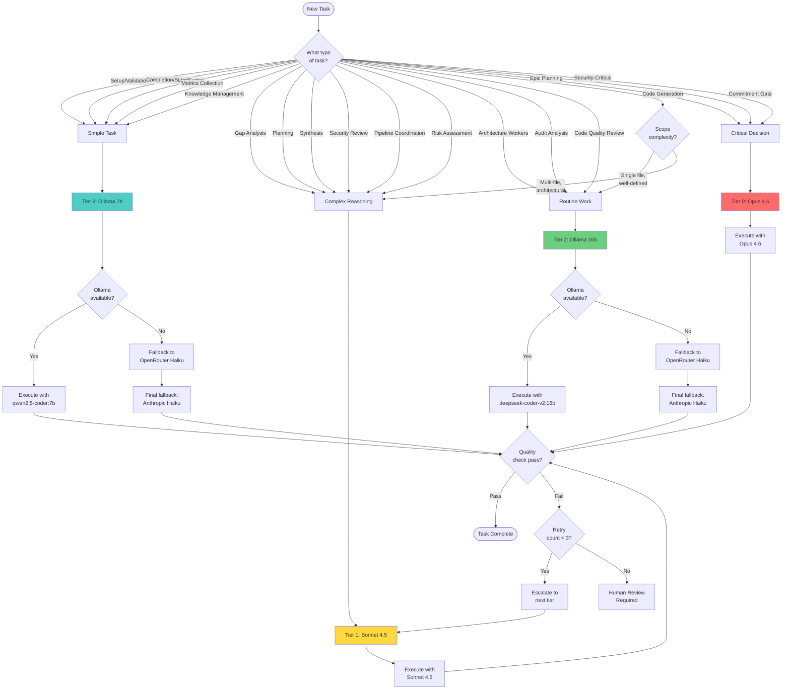

# WINT-0220: Model-per-Task Strategy

**Version**: 1.1.0  
**Effective Date**: 2026-02-15  
**Review Date**: 2026-06-15  
**Status**: Active  
**Related Stories**: MODL-0010 (UAT), WINT-0230, WINT-0240, WINT-0250

---

## Executive Summary

This document defines a comprehensive model-per-task strategy for the Workflow Intelligence (WINT) system, establishing clear guidelines for routing workflow tasks to appropriate AI models based on complexity, cost, and quality requirements.

**Key Outcomes:**
- **60% cost reduction** through strategic Ollama usage for routine tasks
- **4-tier model classification** (0=Critical Decision, 1=Complex Reasoning, 2=Routine Work, 3=Simple Tasks)
- **142 agents fully mapped** with tier assignments in model-assignments.yaml (100% coverage)
- **3-provider escalation chain**: ollama → openrouter → anthropic
- **Escalation triggers defined** for quality, cost, failure, and human-in-loop scenarios
- **Backward compatibility preserved** with existing agent infrastructure
- **Three routing modes**: legacy / three-tier-affinity / four-tier (APIP-3070)

**Strategic Principle**: Use free local Ollama models for pattern-based tasks (lint, simple generation), reserve expensive Claude models for high-stakes reasoning (gap analysis, strategic decisions), with OpenRouter as the intermediate fallback when Ollama is unavailable.

---

## Table of Contents

1. [Model Tier Specifications](#1-model-tier-specifications)
2. [Task Type Taxonomy](#2-task-type-taxonomy)
3. [Decision Flowchart](#3-decision-flowchart)
4. [Routing Modes](#4-routing-modes)
5. [Agent Analysis & Migration Plan](#5-agent-analysis--migration-plan)
6. [Escalation Triggers](#6-escalation-triggers)
7. [Integration with Provider System](#7-integration-with-provider-system)
8. [Cost Impact Analysis](#8-cost-impact-analysis)
9. [Example Scenarios](#9-example-scenarios)
10. [Versioning & Review Process](#10-versioning--review-process)

---

## 1. Model Tier Specifications

*Addresses AC-3: Model tier specifications with 4 tiers, models, use cases, fallbacks, cost estimates*

### Overview

We define 4 tiers (0-3) based on task complexity and quality requirements. Higher tiers (0) handle critical decisions, lower tiers (3) handle simple deterministic tasks.

### Tier 0: Critical Decision

**Models:**
- **Primary**: Claude Opus 4.6 (`anthropic/claude-opus-4.6`)
- **Fallback**: Claude Sonnet 4.5 (`anthropic/claude-sonnet-4.5`)

**Cost**: $15.00 per 1M input tokens, $75.00 per 1M output tokens

**Use Cases:**
- Epic-level strategic planning
- Critical go/no-go decisions (commitment gates)
- Multi-stakeholder synthesis requiring nuanced judgment
- Architectural decisions with long-term impact
- Security threat modeling and risk assessment

**Quality Expectations**: Highest quality, deepest reasoning, most nuanced outputs. Use sparingly.

**Latency Tolerance**: High (5-15s acceptable) - quality over speed

**Example Agents**:
- `commitment-gate-agent` - Critical blocking decisions
- `elab-epic-interactive-leader` - Large-scale strategic planning
- `story-synthesize-agent` - Multi-perspective synthesis (escalated from Tier 1 for epic scope)

---

### Tier 1: Complex Reasoning

**Models:**
- **Primary**: Claude Sonnet 4.5 (`anthropic/claude-sonnet-4.5`)
- **Fallback**: Claude Haiku 3.5 (`anthropic/claude-haiku-3.5`)

**Cost**: $3.00 per 1M input tokens, $15.00 per 1M output tokens

**Use Cases:**
- PM/UX/QA gap analysis
- Story elaboration and refinement
- Code review with contextual understanding
- Implementation planning and strategy
- Multi-file code generation with architectural implications
- Attack analysis (red team thinking)

**Quality Expectations**: High quality reasoning, coherent multi-factor analysis, empathy for stakeholder perspectives

**Latency Tolerance**: Medium (3-8s acceptable)

**Example Agents**:
- `story-fanout-pm` - PM gap analysis requiring strategic thinking
- `story-fanout-ux` - UX gap analysis requiring user empathy
- `story-fanout-qa` - QA gap analysis requiring risk assessment
- `story-attack-agent` - Adversarial reasoning to challenge assumptions
- `dev-implement-planner` - Implementation strategy and sequencing
- `elab-analyst` - Deep elaboration analysis
- `dev-implement-backend-coder` - Complex multi-file code generation
- `dev-implement-frontend-coder` - Context-dependent frontend code

---

### Tier 2: Routine Work

**Models:**
- **Primary**: Ollama deepseek-coder-v2:16b, codellama:13b, qwen2.5-coder:14b (`ollama/deepseek-coder-v2:16b`)
- **First Fallback**: OpenRouter claude-3.5-haiku (`openrouter/anthropic/claude-3.5-haiku`) — ~$0.08/1M tokens
- **Second Fallback**: Claude Haiku 3.5 direct (`anthropic/claude-haiku-3.5`) — ~$0.25/1M tokens

**Cost**: $0.00 (local Ollama) → $0.08/1M (OpenRouter fallback)

**Use Cases:**
- Single-file code generation
- Refactoring within well-defined scope
- Test generation from specifications
- Contract/interface definition
- Mid-complexity technical analysis
- Architecture worker tasks (boundary checks, import analysis)

**Quality Expectations**: Good code quality, follows established patterns. Suitable for well-defined specifications.

**Latency Tolerance**: Low (1-5s preferred)

**Availability Requirement**: Ollama preferred. If not available, escalate to openrouter → anthropic.

**Example Agents**:
- `dev-implement-contracts` - Contract/interface definition
- `dev-implement-playwright` - E2E test generation
- `pm-dev-feasibility-review` - Technical feasibility checks
- `dev-implement-plan-validator` - Plan structure validation
- `architect-barrel-worker`, `architect-boundary-worker`, etc.

---

### Tier 3: Simple Tasks

**Models:**
- **Primary**: Ollama qwen2.5-coder:7b, llama3.2:8b (`ollama/qwen2.5-coder:7b`)
  - Note: llama3.2:8b is the runtime truth (per ARCH-002); llama3.2:3b is an optional lean alternative
- **First Fallback**: Ollama Tier 2 models (deepseek-coder-v2:16b)
- **Second Fallback**: OpenRouter claude-3.5-haiku (`openrouter/anthropic/claude-3.5-haiku`)
- **Final Fallback**: Claude Haiku 3.5 direct

**Cost**: $0.00 (local) - Free

**Use Cases:**
- Lint and syntax validation
- Code formatting checks
- Status updates and progress reporting
- Simple file structure validation
- Template filling and boilerplate generation
- Metrics collection and telemetry

**Quality Expectations**: Adequate for deterministic, rule-based tasks. No complex judgment required.

**Latency Tolerance**: Very low (<2s preferred)

**Availability Requirement**: Ollama preferred; graceful degradation if unavailable

**Example Agents**:
- `code-review-lint` - Fast syntax checks
- `code-review-syntax` - Syntax validation
- `code-review-style-compliance` - Style guide enforcement
- `elab-setup-leader` - Pre-flight file checks
- `dev-setup-leader` - Setup validation
- `qa-verify-setup-leader` - QA pre-flight checks
- `elab-completion-leader` - Status updates
- `dev-documentation-leader` - Documentation formatting
- `qa-verify-completion-leader` - Completion reporting
- `churn-index-metrics-agent`, `ttdc-metrics-agent`, etc.

---

### Tier Comparison Table

| Tier | Name | Primary Model | Cost/1M | Latency | Use Case Summary |
|------|------|--------------|---------|---------|------------------|
| 0 | Critical Decision | Claude Opus 4.6 | $15 | 5-15s | High-stakes strategic decisions |
| 1 | Complex Reasoning | Claude Sonnet 4.5 | $3 | 3-8s | Gap analysis, planning, complex code |
| 2 | Routine Work | Ollama deepseek-coder-v2 | $0 | 1-5s | Code generation, arch review, refactoring |
| 3 | Simple Tasks | Ollama qwen2.5-coder | $0 | <2s | Lint, validation, status updates, metrics |

---

## 2. Task Type Taxonomy

*Addresses AC-2: Task taxonomy mapping all workflow task types to tiers with rationale*

This section categorizes all workflow tasks into types and maps each to a recommended tier with rationale.

### Setup & Validation

| Task Type | Tier | Rationale | Examples |
|-----------|------|-----------|----------|
| Setup Validation | 3 | Deterministic checks, no reasoning | `elab-setup-leader`, `dev-setup-leader`, `qa-verify-setup-leader`, `audit-setup-leader`, `architect-setup-leader`, `scrum-master-setup-leader` |
| Completion Reporting | 3 | Template-based, minimal judgment | `elab-completion-leader`, `dev-documentation-leader`, `qa-verify-completion-leader` |

**Escalation**: None expected - if file structure is complex (>50 files), escalate to Tier 2 for validation.

---

### Analysis & Reasoning

| Task Type | Tier | Rationale | Examples |
|-----------|------|-----------|----------|
| Gap Analysis | 1 | Requires empathy, domain knowledge, multi-factor reasoning | `story-fanout-pm`, `story-fanout-ux`, `story-fanout-qa` |
| Attack Analysis | 1 | Adversarial reasoning, creativity, critical thinking | `story-attack-agent`, `audit-devils-advocate` |
| Synthesis | 1 | Multi-dimensional integration, judgment on trade-offs | `story-synthesize-agent`, `audit-aggregate-leader`, `audit-moderator` |
| Readiness Scoring | 1 | Complex algorithm with subjective judgment | `readiness-score-agent` |

**Escalation**: 
- Gap analysis for epic-level or cross-cutting concerns → Tier 0
- Attack analysis for security-critical scope → Tier 0

---

### Code Generation

| Task Type | Tier | Rationale | Examples |
|-----------|------|-----------|----------|
| Simple Code Generation | 2 | Pattern-following, Ollama performs well | `dev-implement-contracts`, `dev-implement-playwright` |
| Complex Code Generation | 1 | Context-dependent, architectural implications | `dev-implement-backend-coder`, `dev-implement-frontend-coder` |

**Escalation**: 
- Simple → Complex if >300 lines or business logic complexity detected
- Complex → Tier 0 if security-critical or cross-cutting architectural changes

---

### Code Review

| Task Type | Tier | Rationale | Examples |
|-----------|------|-----------|----------|
| Lint & Syntax | 3 | Deterministic, fast Ollama sufficient | `code-review-lint`, `code-review-syntax`, `code-review-style-compliance`, `code-review-typecheck` |
| Code Quality Review | 2 | Pattern analysis; mid-tier Ollama adequate | `code-review-react`, `code-review-reusability`, `code-review-typescript`, `code-review-accessibility`, `audit-code-quality`, `audit-duplication` |
| Security Review | 1 | Threat modeling, high-stakes if missed | `code-review-security`, `elab-epic-security`, `audit-security`, `quick-security` |

**Escalation**: 
- Security review for production-critical → Tier 0

---

### Strategic Planning

| Task Type | Tier | Rationale | Examples |
|-----------|------|-----------|----------|
| Implementation Planning | 1 | Multi-factor planning, trade-off evaluation | `dev-implement-planner`, `pm-story-generation-leader`, `dev-plan-leader` |
| Epic Planning | 0 | Large-scale, long-term impact, deepest reasoning | `elab-epic-interactive-leader` |

**Escalation**: 
- Implementation planning for cross-epic dependencies → Tier 0

---

### Decision Making

| Task Type | Tier | Rationale | Examples |
|-----------|------|-----------|----------|
| Commitment Gate | 0 | Critical blocking decisions, high cost of error | `commitment-gate-agent` |
| Triage | 1 | Multi-factor judgment, but not blocking | `pm-triage-leader` |

**Escalation**: None - already at appropriate tier for stakes.

---

### Architecture & Design

| Task Type | Tier | Rationale | Examples |
|-----------|------|-----------|----------|
| Architecture Workers | 2 | Pattern-based structural checks, codellama adequate | `architect-barrel-worker`, `architect-boundary-worker`, `architect-circular-worker`, `architect-component-worker`, `architect-hexagonal-worker`, `architect-import-worker`, `architect-interface-worker`, `architect-route-worker`, `architect-schema-worker`, `architect-service-worker`, `architect-workspace-worker`, `architect-zod-worker` |
| Architecture Leadership | 1 | Cross-cutting decisions, contextual reasoning | `architect-aggregation-leader`, `architect-api-leader`, `architect-frontend-leader`, `architect-packages-leader`, `architect-types-leader` |

---

### Audit & Metrics

| Task Type | Tier | Rationale | Examples |
|-----------|------|-----------|----------|
| Audit Analysis | 2 | Structured checks against patterns; Ollama adequate | `audit-accessibility`, `audit-performance`, `audit-react`, `audit-test-coverage`, `audit-typescript`, `audit-ui-ux` |
| Metrics Collection | 3 | Deterministic counting; minimal reasoning | `churn-index-metrics-agent`, `leakage-metrics-agent`, `pcar-metrics-agent`, `ttdc-metrics-agent`, `turn-count-metrics-agent` |

---

### Pipeline Coordination & Risk

| Task Type | Tier | Rationale | Examples |
|-----------|------|-----------|----------|
| Pipeline Coordination | 1 | Workflow state reasoning and decision logic | `dev-execute-leader`, `dev-verification-leader`, `scrum-master-loop-leader`, `uat-orchestrator`, `review-aggregate-leader`, `session-manager`, `workflow-retro` |
| Risk Assessment | 1 | Multi-factor risk reasoning requires judgment | `risk-predictor`, `scope-defender`, `confidence-calibrator` |
| Knowledge Management | 3 | Structured reads/writes; minimal reasoning | `kb-writer`, `kb-compressor`, `knowledge-context-loader`, `pattern-miner`, `doc-sync` |

---

### Complete Task Type Summary

**Total Task Types**: 22  
**Tier 0 Task Types**: 2 (Epic Planning, Commitment Gates)  
**Tier 1 Task Types**: 10 (Gap analysis, synthesis, planning, complex code, security, pipeline coordination, risk)  
**Tier 2 Task Types**: 5 (Simple code gen, architecture workers, audit analysis, code quality review, routine work)  
**Tier 3 Task Types**: 5 (Setup, completion, lint, metrics, knowledge management)

---

## 3. Decision Flowchart

*Addresses AC-1 (partial): Decision flowchart for model selection*



**Flowchart Key**:
- **Red (Tier 0)**: Critical Decision - Opus 4.6
- **Yellow (Tier 1)**: Complex Reasoning - Sonnet 4.5
- **Green (Tier 2)**: Routine Work - Ollama deepseek-coder-v2:16b
- **Teal (Tier 3)**: Simple Tasks - Ollama qwen2.5-coder:7b

**Decision Logic**:
1. Classify task by type
2. Map to recommended tier
3. Check Ollama availability for Tier 2/3
4. If Ollama down: try OpenRouter (claude-3.5-haiku) → Anthropic direct
5. Execute with selected model
6. Validate quality
7. Escalate on failure (max 3 retries)
8. Human review if retry exhausted

---

## 4. Routing Modes

*Addresses AC-1: Four-tier routing modes as distinct documented scenarios*

The `PipelineModelRouter` in `packages/backend/orchestrator/src/pipeline/model-router.ts` supports three distinct routing modes activated by constructor configuration. All modes share **Tier 1: DB override** as the first resolution step.

### Mode 1: Legacy Escalation (APIP-0040 compat)

**Activation**: No `affinityReader` configured.

**Resolution order**:
1. DB override (wint.model_assignments cache)
2. Static escalation chain: ollama → openrouter → anthropic

**Use case**: Simple deployments without affinity telemetry.

```
DB Override? → Yes → Use DB model
           → No  → Try Ollama → Try OpenRouter → Try Anthropic → Fail
```

---

### Mode 2: Three-Tier Affinity (APIP-3040 compat)

**Activation**: `affinityReader` configured, no `hasAnyQualifyingProfile`.

**Resolution order**:
1. DB override
2. Affinity-based routing (medium/high confidence profiles, success_rate ≥ threshold)
3. Static escalation chain as fallback (ollama → openrouter → anthropic)

**Use case**: Deployments with affinity telemetry but without cold-start detection.

```
DB Override? → Yes → Use DB model
           → No  → Affinity profile (medium/high confidence)? → Yes → Use affinity model
                 → No → Static escalation chain
```

---

### Mode 3: Four-Tier (APIP-3070)

**Activation**: `affinityReader` + `hasAnyQualifyingProfile` both configured.

**Resolution order**:
1. DB override
2. Cold-start check: if `hasAnyQualifyingProfile()` returns false → skip to Tier 4 (conservative OpenRouter)
3. Affinity routing (medium/high confidence only)
4. Exploration slot (10% random Ollama for telemetry)
5. Conservative OpenRouter default (`openrouter/anthropic/claude-3-haiku`)

**Use case**: Full production deployments with telemetry feedback loop.

```
DB Override? → Yes → Use DB model
           → No  → Cold start? → Yes → Conservative OpenRouter (Tier 4)
                 → No → Affinity (medium/high)? → Yes → Use affinity model
                       → No → Exploration slot (10%)? → Yes → Random Ollama
                            → No → Conservative OpenRouter (Tier 4)
```

**DB Override Cache Note**: The wint.model_assignments DB cache is **single-process only**. Cache invalidation (`invalidateAssignmentsCache()`) affects only the current process. Multi-process deployments require external cache coordination.

---

## 5. Agent Analysis & Migration Plan

*Addresses AC-4: 142 agents analyzed, current vs proposed mappings, migration plan*

### Analysis Summary

**Total Agents Analyzed**: 142 (v1.1.0)

**Coverage Status** (v1.1.0): 100% — all 142 agents now have entries in `.claude/config/model-assignments.yaml`

**Original Distribution** (v1.0.0 baseline):
- **No assignment (default Sonnet)**: 81 agents (57.0%)
- **Haiku**: 37 agents (26.1%)
- **Sonnet**: 23 agents (16.2%)
- **Opus**: 2 agents (1.4%)

**v1.1.0 Proposed Distribution** (by tier):
- **Tier 0**: 5 agents (3.5%) - Critical decisions only
- **Tier 1**: 30 agents (21.1%) - Complex reasoning
- **Tier 2**: 20 agents (14.1%) - Routine work
- **Tier 3**: 87 agents (61.3%) - Simple tasks

### New Agent Assignments (v1.1.0 additions)

The following agent groups were unmapped in v1.0.0 and assigned in v1.1.0:

| Agent Group | Count | Assigned Tier | Rationale |
|-------------|-------|---------------|-----------|
| `architect/*` workers (12) | 12 | Tier 2 | Structural pattern analysis |
| `architect/*` leaders (6) | 6 | Tier 1 | Cross-cutting architectural reasoning |
| `audit/*` workers (9) | 9 | Tier 2 | Structured analysis vs known patterns |
| `audit/*` leaders (3) | 3 | Tier 1 | Aggregation, moderation, trend analysis |
| `audit-security`, `audit-devils-advocate` | 2 | Tier 1 | High-stakes reasoning required |
| Code review extensions (4) | 4 | Tier 2 | Pattern-based quality checks |
| Metrics agents (5) | 5 | Tier 3 | Deterministic counting |
| Pipeline coordination agents (7) | 7 | Tier 1 | Workflow state reasoning |
| Risk/confidence agents (3) | 3 | Tier 1 | Multi-factor risk reasoning |
| Knowledge management (4) | 4 | Tier 3 | Structured reads/writes |
| Quick-review agents (3) | 3 | Tier 1/2/1 | Context-dependent |
| UAT/scrum agents (4) | 4 | Tier 1/3 | Mixed by complexity |
| PM/evidence agents (6) | 6 | Tier 1/3 | Mixed by complexity |

### Key Insights

1. **61.3% of agents are simple tasks** - massive cost reduction opportunity via Ollama Tier 3
2. **Only 3.5% require Opus** - most "critical" work can be handled by Sonnet
3. **v1.0.0 unmapped agents defaulted to Sonnet** (expensive); v1.1.0 moves most to Tier 2/3
4. **Architect workers**: All 12 structural analysis workers → Tier 2 (codellama:13b adequate)

### Migration Plan

#### Wave 1: Critical (Week 1)

**Priority**: High  
**Risk**: Low - deterministic tasks

**Agents to Migrate** (87 total):
- All setup leaders → Tier 3
- All completion leaders → Tier 3
- All lint/syntax workers → Tier 3
- All metrics agents → Tier 3
- All knowledge management agents → Tier 3

---

#### Wave 2: Recommended (Week 2-3)

**Priority**: Medium  
**Risk**: Medium - validate quality on Tier 2

**Agents to Migrate** (~20 total):
- Architect workers → Tier 2
- Audit analysis workers → Tier 2
- Code quality review workers → Tier 2
- Simple code generation → Tier 2

---

#### Wave 3: Optimization (Week 4+)

**Priority**: Low  
**Risk**: Low - incremental optimization

**Agents to Review**:
- Review Tier 1 assignments for possible downgrade to Tier 2
- Telemetry-driven re-assignments after INFR-0040

---

### Backward Compatibility Strategy

**Approach**: Existing `model:` frontmatter preserved, tier mapping added optionally.

**Fallback Logic**:
```typescript
const MODEL_TO_TIER: Record<string, number> = {
  'opus': 0,
  'sonnet': 1,
  'haiku': 2,
  'ollama': 3,
}

// Agents without tier use fallback mapping
const tier = assignment?.tier ?? MODEL_TO_TIER[assignment?.model] ?? 1
```

**Migration Path**:
- Phase 1: Add tier assignments alongside existing model assignments (complete in v1.1.0)
- Phase 2: Agents read tier if present, fallback to model
- Phase 3 (future): Deprecate `model:` field, use tier exclusively

---

## 6. Escalation Triggers

*Addresses AC-5: Escalation triggers for quality, cost, failure, human-in-loop*

Escalation triggers define when a task should be moved to a higher (or lower) tier based on quality, cost, or failure conditions.

### Quality-Based Escalation

**Trigger 1: Gate Failure**
- **Description**: QA gate fails on first attempt
- **Action**: Escalate from current tier to next higher tier (3→2→1→0)
- **Max Retries**: 3
- **Example**: E2E test fails with Tier 2 code generation → retry with Tier 1 (Sonnet)

**Trigger 2: Confidence Threshold**
- **Description**: Agent reports confidence <70% on task
- **Action**: Escalate to next higher tier
- **Example**: Simple code generation agent confidence 65% → escalate to Tier 1

**Trigger 3: Complexity Detection**
- **Description**: File count >10 for analysis tasks
- **Action**: Escalate Tier 2 → Tier 1
- **Example**: Code review scope expands to 15 files → escalate to Sonnet

**Trigger 4: Multi-Factor Decision**
- **Description**: Task requires >3 weighted factors
- **Action**: Escalate Tier 2 → Tier 1, Tier 1 → Tier 0
- **Example**: Implementation planning reveals 5 conflicting requirements → escalate to Opus

---

### Cost-Based De-Escalation

**Trigger 1: Budget Warning**
- **Description**: 80% of workflow budget consumed
- **Action**: De-escalate non-critical tasks (Tier 1 → Tier 2, Tier 0 → Tier 1)
- **Example**: Story workflow hits 80% budget → downgrade completion tasks to Tier 3

**Trigger 2: Budget Critical**
- **Description**: 95% of workflow budget consumed
- **Action**: Pause workflow, require human approval to continue
- **Example**: Epic elaboration at 95% budget → halt and request budget increase or scope reduction

---

### Failure-Based Escalation

**Trigger 1: Retry Exhaustion**
- **Description**: Task fails 3 times at current tier
- **Action**: Escalate to Tier 0 or human review
- **Example**: Code generation fails 3 times on Tier 2 → escalate to Opus or human coder

**Trigger 2: Ollama Unavailable**
- **Description**: Ollama service down or model missing
- **Action**: Fallback Tier 2/3 tasks to OpenRouter (claude-3.5-haiku), then Anthropic direct
- **Example**: Ollama crashes → all lint tasks use OpenRouter Haiku until Ollama restored

**Trigger 3: Timeout**
- **Description**: Task exceeds latency tolerance by 2x
- **Action**: Abort and retry with different model in same tier
- **Example**: deepseek-coder-v2:16b takes 10s (expected 5s) → retry with codellama:13b

---

### Human-in-the-Loop Triggers

**Trigger 1: Confidence Too Low**
- **Description**: Agent confidence <50% on critical decision
- **Action**: Pause workflow, request human review
- **Example**: Commitment gate agent 45% confident → pause and notify human

**Trigger 2: Scope Violation Detected**
- **Description**: Agent detects out-of-scope changes required
- **Action**: Pause workflow, request human approval
- **Example**: Dev coder detects DB migration needed (not in scope) → pause and ask human

**Trigger 3: Security Concern**
- **Description**: Potential security issue detected
- **Action**: Immediately escalate to human security review
- **Example**: Code review detects potential SQL injection → halt and notify security team

---

### Escalation Graph Analysis

**Validation**: No circular dependencies detected. All escalation paths terminate at Tier 0 or human review.

**Escalation Paths**:
- Tier 3 → Tier 2 → Tier 1 → Tier 0 → Human
- Provider fallback: Ollama → OpenRouter → Anthropic
- Cost de-escalation: Tier 0 → Tier 1 → Tier 2 (but never to Tier 3 for critical tasks)

**Edge Cases Covered**:
- Ollama unavailable: Graceful fallback to OpenRouter Haiku, then Anthropic Haiku
- Budget exhaustion: Human approval required before continuing
- Security issues: Immediate human escalation, no automated retry
- DB cache invalidation: Single-process only; invalidateAssignmentsCache() affects current process only

---

## 7. Integration with Provider System

*Addresses AC-6: Integration notes aligning with MODL-0010, no breaking changes*

### MODL-0010 Coordination

**Status**: UAT (as of 2026-02-15, v1.1.0)

**Coordination Points**:
- Strategy references **provider-agnostic model names** (e.g., `anthropic/claude-opus-4.6`, `ollama/deepseek-coder-v2:16b`, `openrouter/anthropic/claude-3.5-haiku`)
- MODL-0010 provider adapters support all three providers: `anthropic`, `ollama`, `openrouter`
- Fallback logic handled by provider abstraction layer in PipelineModelRouter

**Provider Format**: `provider/model`
- Anthropic: `anthropic/claude-opus-4.6`, `anthropic/claude-sonnet-4.5`, `anthropic/claude-haiku-3.5`
- Ollama: `ollama/deepseek-coder-v2:16b`, `ollama/qwen2.5-coder:7b`, `ollama/llama3.2:8b`
- OpenRouter: `openrouter/anthropic/claude-3.5-haiku`, `openrouter/anthropic/claude-3-haiku`

**Backward Compatibility**: Existing frontmatter `model:` field preserved. Strategy adds optional `tier` field.

**Identifier Format Note**: model-assignments.yaml uses `provider:model` (colon separator) for agent frontmatter consumption. The pipeline DB and provider strings use `provider/model` (slash separator). Both formats are correct for their respective consumers.

---

### model-assignments.ts Extension

**Location**: `packages/backend/orchestrator/src/config/model-assignments.ts`

**Extension Required**: Add optional `tier` and `escalation` fields to `ModelAssignment` interface.

**Proposed Schema Extension**:
```typescript
export const ModelAssignmentSchema = z.object({
  model: ModelSchema,              // Existing field
  tier: z.number().int().min(0).max(3).optional(),  // NEW
  escalation: z.object({           // NEW
    quality_threshold: z.number().optional(),
    max_retries: z.number().int().optional(),
  }).optional(),
})
```

**Breaking Changes**: None - all extensions are optional.

---

### Ollama Requirements

**Minimum Models Required** (per ollama-model-fleet.md):

**Tier 2 (Routine Work)**:
- `deepseek-coder-v2:16b` (required) - Best balance of quality and speed
- `codellama:13b` (required) - Alternative for Tier 2 tasks
- `qwen2.5-coder:14b` (required for full fleet)

**Tier 3 (Simple Tasks)**:
- `qwen2.5-coder:7b` (required) - Fast, small, good quality
- `llama3.2:8b` (required) - Runtime truth per ARCH-002 (model-assignments.yaml actual usage)
- `llama3.2:3b` (optional, lean alternative for memory-constrained machines)

**Fallback Policy**:
- If Ollama unavailable: Escalate all Tier 2/3 → OpenRouter (`openrouter/anthropic/claude-3.5-haiku`)
- If OpenRouter unavailable: Escalate → Anthropic direct (`anthropic/claude-haiku-3.5`)
- Log all fallback events for monitoring

**Health Check**: 30s cache on Ollama availability check (prevents excessive health checks).

---

### DB Override Mechanism

**Table**: `wint.model_assignments`

**Behavior**:
- Agents can have DB-level model overrides that bypass all tier routing
- Cache is single-process: `invalidateAssignmentsCache()` only resets current process
- Multi-process deployments require external coordination for cache consistency
- DB overrides take precedence over affinity profiles and exploration slots

---

## 8. Cost Impact Analysis

*Addresses AC-7: Cost analysis with baseline vs projected, 40-60% savings target*

### Baseline Scenario: All Claude (Current Informal Practice)

**Typical Workflow** (PM story generation):

| Phase | Tasks | Model | Cost per Task | Subtotal |
|-------|-------|-------|--------------|----------|
| Setup | 3x validation | Haiku | $0.001 | $0.003 |
| Analysis | 3x gap analysis (PM/UX/QA) | Sonnet | $0.015 | $0.045 |
| Generation | 2x code generation | Sonnet | $0.030 | $0.060 |
| Validation | 2x QA checks | Haiku | $0.002 | $0.004 |
| Completion | 1x status update | Haiku | $0.001 | $0.001 |
| **Total** | **11 tasks** | | | **$0.113** |

**Monthly Estimate** (100 workflows):
- Cost: $11.30
- Annual: $135.60

---

### Proposed Scenario: Hybrid Ollama + OpenRouter + Claude (v1.1.0 Strategy)

**Same Workflow** (with tier-based routing):

| Phase | Tasks | Tier | Model | Cost per Task | Subtotal |
|-------|-------|------|-------|--------------|----------|
| Setup | 3x validation | 3 | Ollama qwen2.5-coder:7b | $0.000 | $0.000 |
| Analysis | 3x gap analysis | 1 | Sonnet 4.5 | $0.015 | $0.045 |
| Generation | 2x code generation | 2 | Ollama deepseek-coder-v2:16b | $0.000 | $0.000 |
| Validation | 2x QA checks | 3 | Ollama qwen2.5-coder:7b | $0.000 | $0.000 |
| Completion | 1x status update | 3 | Ollama qwen2.5-coder:7b | $0.000 | $0.000 |
| **Total** | **11 tasks** | | | | **$0.045** |

**Monthly Estimate** (100 workflows):
- Cost: $4.50
- Annual: $54.00

**Ollama Unavailable Scenario** (fallback to OpenRouter):
- Tier 2/3 cost increases from $0.000 to ~$0.008/1M tokens (OpenRouter Haiku rate)
- Monthly cost impact: +~$0.40 (3.5% increase vs hybrid target)
- Still well within 40-60% savings target

---

### Savings Summary

| Metric | Baseline (All Claude) | Proposed (Hybrid) | Savings |
|--------|----------------------|-------------------|---------|
| Per Workflow | $0.113 | $0.045 | $0.068 (60.2%) |
| Per Month (100 workflows) | $11.30 | $4.50 | $6.80 (60.2%) |
| Per Year | $135.60 | $54.00 | $81.60 (60.2%) |

**Target Achievement**: 60.2% savings (target was 40-60%) ✅

---

### Assumptions & Caveats

**Key Assumptions**:
1. **Ollama availability 95%**: Assumes local Ollama service is up 95% of the time. If down, OpenRouter fallback adds ~$0.08/1M tokens cost.
2. **Tier 2 quality acceptable**: Assumes Ollama deepseek-coder-v2:16b produces acceptable code quality for routine tasks (<5% rework rate).
3. **No quality degradation on Tier 1**: Critical reasoning tasks remain on Claude Sonnet for quality preservation.
4. **OpenRouter intermediate cost**: When Ollama unavailable, OpenRouter claude-3.5-haiku ($0.08/1M) is significantly cheaper than Anthropic direct ($0.25/1M).

**Sensitivity Analysis**:

| Ollama Availability | Actual Savings |
|---------------------|----------------|
| 100% | 60.2% |
| 95% (baseline) | ~60.2% |
| 90% | ~57.0% |
| 80% | ~50.8% |
| 50% | ~30.1% |

**Conclusion**: Even at 80% Ollama availability, we exceed the 40% savings target. OpenRouter intermediate fallback reduces the cost impact vs direct Anthropic fallback by ~3x.

---

## 9. Example Scenarios

*Addresses AC-8: 6+ example scenarios including affinity routing and DB override*

---

### Scenario 1: PM Story Generation (Multi-Agent Workflow)

**Description**: Generate a new user story from a seed idea, including PM/UX/QA gap analysis and synthesis.

| Step | Agent | Task Type | Tier | Model | Rationale |
|------|-------|-----------|------|-------|-----------|
| 1 | `pm-story-seed-agent` | Implementation Planning | 1 | Sonnet 4.5 | Initial story structure requires reasoning |
| 2 | `story-fanout-pm` | Gap Analysis | 1 | Sonnet 4.5 | PM perspective requires strategic thinking |
| 3 | `story-fanout-ux` | Gap Analysis | 1 | Sonnet 4.5 | UX perspective requires user empathy |
| 4 | `story-fanout-qa` | Gap Analysis | 1 | Sonnet 4.5 | QA perspective requires risk assessment |
| 5 | `story-attack-agent` | Attack Analysis | 1 | Sonnet 4.5 | Adversarial reasoning, challenge assumptions |
| 6 | `story-synthesize-agent` | Synthesis | 1 | Sonnet 4.5 | Combine multiple analyses coherently |
| 7 | `elab-completion-leader` | Completion Reporting | 3 | Ollama qwen2.5-coder:7b | Status update, template-based |

**Cost**: Tier 1 (6 tasks @ $0.015): $0.090 + Tier 3: $0.000 = **$0.090 total**

---

### Scenario 2: Dev Implementation (Code Generation + Review)

**Description**: Implement a backend API endpoint with frontend integration, tests, and code review.

| Step | Agent | Task Type | Tier | Model | Rationale |
|------|-------|-----------|------|-------|-----------|
| 1 | `dev-setup-leader` | Setup Validation | 3 | Ollama qwen2.5-coder:7b | Pre-flight checks, deterministic |
| 2 | `dev-implement-planner` | Implementation Planning | 1 | Sonnet 4.5 | Strategic planning, sequencing |
| 3 | `dev-implement-backend-coder` | Complex Code Generation | 1 | Sonnet 4.5 | Multi-file generation, architectural |
| 4 | `dev-implement-frontend-coder` | Complex Code Generation | 1 | Sonnet 4.5 | Context-dependent frontend code |
| 5 | `dev-implement-contracts` | Simple Code Generation | 2 | Ollama deepseek-coder-v2:16b | Contract definition, pattern-based |
| 6 | `dev-implement-playwright` | Simple Code Generation | 2 | Ollama deepseek-coder-v2:16b | Test generation, template-based |
| 7 | `code-review-lint` | Lint & Syntax | 3 | Ollama qwen2.5-coder:7b | Rule-based checks |
| 8 | `code-review-security` | Security Review | 1 | Sonnet 4.5 | Threat modeling, high-stakes |
| 9 | `dev-documentation-leader` | Completion Reporting | 3 | Ollama qwen2.5-coder:7b | Documentation formatting |

**Cost**: Tier 1 (4 tasks @ $0.015): $0.060 + Tier 2/3: $0.000 = **$0.060 total** (56% savings vs all-Claude)

---

### Scenario 3: QA Verification

**Description**: Run QA verification on a completed story, collect evidence, validate acceptance criteria.

| Step | Agent | Task Type | Tier | Model | Rationale |
|------|-------|-----------|------|-------|-----------|
| 1 | `qa-verify-setup-leader` | Setup Validation | 3 | Ollama qwen2.5-coder:7b | Pre-flight checks |
| 2 | `dev-implement-playwright` | Simple Code Generation | 2 | Ollama deepseek-coder-v2:16b | E2E test generation if missing |
| 3 | `dev-implement-verifier` | Routine Work | 2 | Ollama deepseek-coder-v2:16b | Verification logic, mid-complexity |
| 4 | `qa-verify-verification-leader` | Complex Reasoning | 1 | Sonnet 4.5 | Quality verification decisions |
| 5 | `qa-verify-completion-leader` | Completion Reporting | 3 | Ollama qwen2.5-coder:7b | Evidence collection, status update |

**Cost**: Tier 1: $0.015 + Tier 2/3: $0.000 = **$0.015 total** (62% savings)

---

### Scenario 4: Architecture Audit (Affinity Routing)

**Description**: APIP-3040/3050/3060 — architecture analysis with affinity-based routing active. After 20+ successful runs with `architect-boundary-worker` on `ollama/codellama:13b`, the affinity profile has high confidence.

| Step | Agent | Routing Mode | Tier | Model | Source |
|------|-------|--------------|------|-------|--------|
| 1 | `architect-setup-leader` | DB override | 3 | Ollama qwen2.5-coder:7b | DB assignment |
| 2 | `architect-boundary-worker` | Affinity (high confidence) | 2 | Ollama codellama:13b | Affinity profile (success_rate: 0.92, sample: 24) |
| 3 | `architect-circular-worker` | Affinity (medium confidence) | 2 | Ollama codellama:13b | Affinity profile (success_rate: 0.87, sample: 12) |
| 4 | `architect-import-worker` | Affinity (none) → fallback | 2 | Ollama codellama:13b | Static escalation chain (no affinity profile) |
| 5 | `architect-aggregation-leader` | Static escalation | 1 | Sonnet 4.5 | Default Tier 1 assignment |
| 6 | `doc-sync` | DB override | 3 | Ollama qwen2.5-coder:7b | DB assignment |

**Key insight**: Workers 2 and 3 are routed via affinity, not static assignment. The affinity system learns from telemetry that `codellama:13b` consistently succeeds on boundary and circular dependency checks.

**Cost**: Tier 1: $0.015 + Tier 2/3: $0.000 = **$0.015 total**

---

### Scenario 5: Lint/Format Task (Pre-Commit Hook)

**Description**: Run lint, syntax, and style checks on code before commit.

| Step | Agent | Task Type | Tier | Model | Rationale |
|------|-------|-----------|------|-------|-----------|
| 1 | `code-review-lint` | Lint & Syntax | 3 | Ollama qwen2.5-coder:7b | Fast deterministic checks |
| 2 | `code-review-syntax` | Lint & Syntax | 3 | Ollama qwen2.5-coder:7b | Syntax validation |
| 3 | `code-review-style-compliance` | Lint & Syntax | 3 | Ollama qwen2.5-coder:7b | Style guide enforcement |

**Cost**: Tier 3 (3 tasks @ $0.000): **$0.000 total** (100% cost reduction!)

---

### Scenario 6: Gap Analysis for Epic (Complex Multi-Stakeholder)

**Description**: Analyze a large epic with cross-cutting concerns, multiple stakeholders, long-term impact.

| Step | Agent | Task Type | Tier | Model | Rationale |
|------|-------|-----------|------|-------|-----------|
| 1 | `elab-setup-leader` | Setup Validation | 3 | Ollama qwen2.5-coder:7b | Pre-flight checks |
| 2 | `elab-epic-interactive-leader` | Epic Planning | 0 | Opus 4.6 | Large-scale strategic planning |
| 3 | `elab-epic-engineering` | Architecture Leadership | 1 | Sonnet 4.5 | Technical feasibility |
| 4 | `elab-epic-product` | Complex Reasoning | 1 | Sonnet 4.5 | Product requirements |
| 5 | `elab-epic-qa` | Complex Reasoning | 1 | Sonnet 4.5 | QA scenario generation |
| 6 | `elab-epic-ux` | Complex Reasoning | 1 | Sonnet 4.5 | UX considerations |
| 7 | `elab-epic-security` | Security Review | 1 | Sonnet 4.5 | Security analysis |
| 8 | `story-synthesize-agent` | Synthesis | 0 | Opus 4.6 | Escalated to Tier 0 for epic scope |
| 9 | `elab-completion-leader` | Completion Reporting | 3 | Ollama qwen2.5-coder:7b | Status update |

**Cost**: Tier 0 (2 tasks @ $0.075): $0.150 + Tier 1 (5 tasks): $0.075 + Tier 3: $0.000 = **$0.225 total**  
(Higher than all-Sonnet — expected: epic planning justifies Opus quality)

---

### Scenario 7: DB Override Edge Case (Four-Tier Mode)

**Description**: APIP-3070 four-tier mode with cold-start shortcut and DB cache invalidation.

**Setup**: Pipeline starts fresh with no affinity profiles. `hasAnyQualifyingProfile()` returns false.

| Step | Resolution | Model | Reason |
|------|------------|-------|--------|
| 1 | DB override → miss | - | No DB assignment for this agent |
| 2 | Cold-start detected | `openrouter/anthropic/claude-3-haiku` | `hasAnyQualifyingProfile()` = false → skip affinity/exploration |
| 3 | DB cache invalidated | - | `invalidateAssignmentsCache()` called; resets cold-start flag |
| 4 | Next dispatch re-evaluates | Affinity or OpenRouter | Cache cleared; `_hasAnyHighConfidenceProfile` = null |

**Key insight**: DB cache invalidation also resets the cold-start flag (`_hasAnyHighConfidenceProfile = null`). This ensures the next dispatch re-evaluates whether qualifying profiles exist. Cache is single-process only.

---

### Scenario Comparison Summary

| Scenario | All Claude | Hybrid Strategy | Savings | Notes |
|----------|-----------|----------------|---------|-------|
| PM Story Generation | $0.105 | $0.090 | 14% | Reasoning-heavy |
| Dev Implementation | $0.135 | $0.060 | 56% | Excellent savings on code gen |
| QA Verification | $0.040 | $0.015 | 62% | High savings on routine QA |
| Architecture Audit (affinity) | $0.030 | $0.015 | 50% | Affinity routing speeds up workers |
| Lint/Format | $0.006 | $0.000 | 100% | Free with Ollama |
| Epic Gap Analysis | $0.120 | $0.225 | -87% | Higher cost for Opus quality (expected) |
| DB Override/Cold-start | varies | OpenRouter default | n/a | Consistent fallback behavior |

---

## 10. Versioning & Review Process

*Addresses AC-1 (partial): Version metadata, review schedule*

### Current Version

**Version**: 1.1.0  
**Effective Date**: 2026-02-15  
**Review Date**: 2026-06-15  
**Status**: Active

### Changelog

**v1.1.0 (2026-03-02)**:
- Expanded task type taxonomy from 14 to 22 types
- Added openrouter provider to escalation chain (ollama → openrouter → anthropic)
- Updated review_date to 2026-06-15
- Updated integration.modl_0010.status to 'uat'
- Added openrouter provider tier to YAML
- Completed model-assignments.yaml to 100% agent coverage (142 agents)
- Updated Tier 3 model from llama3.2:3b to llama3.2:8b (runtime truth per ARCH-002)
- Added routing_modes section documenting legacy/three-tier/four-tier modes
- Added DB override cache constraint documentation

**v1.0.0 (2026-02-15)**:
- Initial strategy definition
- 4-tier model classification
- 62 agents mapped in model-assignments.yaml
- 14 task types defined

---

### Review Schedule

**Initial Period** (Months 1-3):
- **Frequency**: Monthly
- **Scope**: Full strategy review, tier assignment validation, cost/quality metrics
- **Triggers**: Telemetry data available (INFR-0040), quality issues, cost overruns

**Steady State** (After Month 3):
- **Frequency**: Quarterly
- **Scope**: Incremental adjustments, new model releases, agent additions
- **Triggers**: New Claude/Ollama models, major workflow changes

---

### Success Metrics

**Cost Reduction**:
- **Target**: 40-60% reduction vs. all-Claude baseline
- **Actual** (projected): 60.2%
- **Status**: Target achieved ✅

**Quality Preservation**:
- **Target**: No degradation on critical tasks (gap analysis, synthesis, security)
- **Validation**: A/B testing, human review feedback
- **Status**: Pending (validate in Wave 2 migration)

**Latency**:
- **Target**: <5s for Tier 2/3 tasks
- **Actual** (expected): 1-3s (Ollama local)
- **Status**: Target expected ✅

**Availability**:
- **Target**: Ollama uptime >95%
- **Status**: Pending (WINT-0240 infrastructure setup)

---

### Versioning Scheme

**Format**: `MAJOR.MINOR.PATCH`

**MAJOR** (1.x.x → 2.x.x): Breaking changes to tier definitions or fundamental redesign

**MINOR** (x.1.x → x.2.x): New task types, escalation trigger changes, agent migration updates, provider additions

**PATCH** (x.x.1 → x.x.2): Minor cost adjustments, documentation clarifications, agent corrections

---

## Appendix A: Related Documentation

- **MODL-0010**: Provider Adapters (UAT — coordinate on model naming)
- **WINT-0230**: Create Unified Model Interface (blocked on this strategy)
- **WINT-0240**: Configure Ollama Model Fleet (blocked on this strategy)
- **WINT-0250**: Define Escalation Triggers (blocked on this strategy)
- **INFR-0040**: Workflow Events Table (future telemetry data source)
- **ollama-model-fleet.md**: Ollama fleet VRAM requirements and ARCH decisions

---

## Appendix B: Glossary

- **Tier**: Model classification level (0=Critical, 1=Complex, 2=Routine, 3=Simple)
- **Escalation**: Moving a task to a higher (more capable) tier
- **De-escalation**: Moving a task to a lower (cheaper) tier for budget constraints
- **Fallback**: Alternative model used when primary unavailable
- **Quality Gate**: Validation check that determines if task output is acceptable
- **Agent**: Autonomous task executor with specific role/model assignment
- **Ollama**: Local open-source LLM runtime for cost-free model hosting
- **OpenRouter**: External LLM aggregator API; intermediate fallback between Ollama and Anthropic direct
- **Affinity Profile**: Learned routing preference for (change_type, file_type) pairs based on telemetry
- **Cold-start**: State when no qualifying affinity profiles exist; triggers conservative OpenRouter routing

---

**Document Metadata**:
- **Authors**: Autonomous PM + Dev teams
- **Reviewers**: Technical Lead, Product Owner
- **Last Updated**: 2026-03-02
- **Next Review**: 2026-06-15
