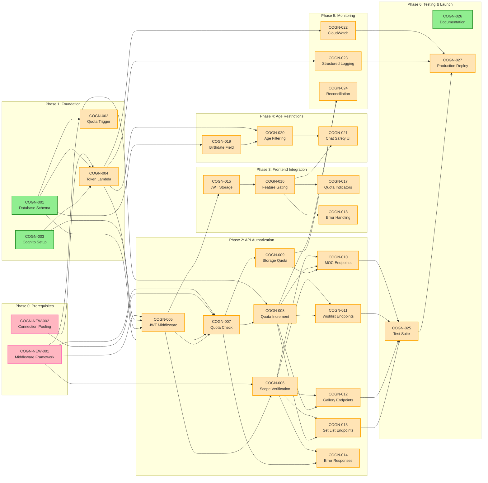

# COGN — Story Roadmap

Visual representation of story dependencies and execution order.

---

## Dependency Graph

Shows which stories block downstream work.



**Legend:** Green = Ready | Orange = Blocked by dependencies | Blue = Done

---

## Completion Order (Gantt View)

```mermaid
gantt
    title COGN Story Execution Order (with Prerequisites)
    dateFormat X
    axisFormat %s

    section Phase 0: Prerequisites
    COGN-NEW-001 Middleware Framework :snew1, 0, 1
    COGN-NEW-002 Connection Pooling   :snew2, 0, 1

    section Phase 1: Foundation
    COGN-001 Database Schema     :s001, 0, 1
    COGN-003 Cognito Setup       :s003, 0, 1
    COGN-002 Quota Trigger       :s002, after s001, 1
    COGN-004 Token Lambda        :s004, after s001 s003 snew2, 1

    section Phase 2: API Auth
    COGN-005 JWT Middleware      :s005, after s004 snew1, 1
    COGN-006 Scope Verification  :s006, after s005, 1
    COGN-007 Quota Check         :s007, after s005 snew1, 1
    COGN-008 Quota Increment     :s008, after s007 snew1, 1
    COGN-009 Storage Quota       :s009, after s007, 1
    COGN-010 MOC Endpoints       :s010, after s008 s009, 1
    COGN-011 Wishlist Endpoints  :s011, after s008, 1
    COGN-012 Gallery Endpoints   :s012, after s008, 1
    COGN-013 Set List Endpoints  :s013, after s008, 1
    COGN-014 Error Responses     :s014, after s006 s007, 1

    section Phase 3: Frontend
    COGN-015 JWT Storage         :s015, after s005, 1
    COGN-016 Feature Gating      :s016, after s015, 1
    COGN-017 Quota Indicators    :s017, after s016, 1
    COGN-018 Error Handling      :s018, after s016, 1

    section Phase 4: Age Restrictions
    COGN-019 Birthdate Field     :s019, after s001, 1
    COGN-020 Age Filtering       :s020, after s004 s019, 1
    COGN-021 Chat Safety UI      :s021, after s020 s016, 1

    section Phase 5: Monitoring
    COGN-022 CloudWatch          :s022, after s004 s006, 1
    COGN-023 Structured Logging  :s023, after s004 s006, 1
    COGN-024 Reconciliation      :s024, after s008 s009, 1

    section Phase 6: Testing & Launch
    COGN-025 Test Suite          :s025, after s010 s011 s012 s013, 1
    COGN-026 Documentation       :s026, 0, 1
    COGN-027 Production Deploy   :s027, after s025 s022 s023, 1
```



---

## Critical Path

The longest chain of dependent stories (13 stories total, including prerequisites):

```
COGN-NEW-002 → COGN-001 → COGN-004 → COGN-005 → COGN-006 → COGN-007 →
COGN-008 → COGN-010 → COGN-025 → COGN-027
```

Alternative critical path via frontend:
```
COGN-NEW-001 → COGN-005 → COGN-015 → COGN-016 → COGN-025 → COGN-027
```

**Critical path length:** 10 + prerequisites (COGN-NEW-001, COGN-NEW-002)

**Key insight:** The prerequisites (COGN-NEW-001: Middleware Framework, COGN-NEW-002: Connection Pooling) must be completed first. The foundation (COGN-001, COGN-004, COGN-005) is then the primary bottleneck. Parallelize all non-critical-path work in Phases 2-5.

---

## Parallel Opportunities

| Parallel Group | Stories | After | Description |
|---|---|---|---|
| G0 | COGN-NEW-001, COGN-NEW-002 | — (start) | Prerequisites: Middleware framework and connection pooling in parallel |
| G1 | COGN-001, COGN-003 | G0 | Foundation: Database and Cognito setup in parallel |
| G2 | COGN-002, COGN-004 | G1 (+ G0 for COGN-004) | Foundation: Trigger and Lambda depend on G1 and G0 |
| G3 | COGN-005 | G2 + G0 | API Auth: JWT middleware foundation (depends on G0) |
| G4 | COGN-006, COGN-007 | G3 + G0 | API Auth: Scope and quota middleware in parallel (G7 depends on G0) |
| G5 | COGN-008, COGN-009 | G4 + G0 | API Auth: Both quota increment middlewares in parallel (G8 depends on G0) |
| G6 | COGN-010, COGN-011, COGN-012, COGN-013, COGN-014 | G5 | API Auth: Endpoint protection and error handling (5 stories) |
| G7 | COGN-015 | G3 | Frontend: JWT handling (can start after auth middleware) |
| G8 | COGN-016 | G7 | Frontend: Feature gating depends on JWT handling |
| G9 | COGN-017, COGN-018 | G8 | Frontend: Quota indicators and error handling in parallel |
| G10 | COGN-019 | G1 | Age Restrictions: Birthdate field (depends on database) |
| G11 | COGN-020 | G2 | Age Restrictions: Scope filtering in Lambda |
| G12 | COGN-021 | G8 (+ G11) | Age Restrictions: Chat UI safety (depends on feature gating) |
| G13 | COGN-022, COGN-023 | G4 | Monitoring: CloudWatch and logging (can start early) |
| G14 | COGN-024 | G5 | Monitoring: Reconciliation jobs |
| G15 | COGN-025 | G6 | Testing: Comprehensive test suite |
| G16 | COGN-026 | — | Documentation: Can be written anytime (but independent) |
| G17 | COGN-027 | G15 + G13 + G14 | Launch: Final deployment after testing complete |

**Maximum parallelization:** 4 stories at once (best case: COGN-NEW-001, COGN-NEW-002, COGN-026, and one story from Phase 1+ dependency chain)

---

## Risk Indicators

| Story | Risk Level | Reason | Mitigation |
|---|---|---|---|
| COGN-004 | **Critical** | Lambda: Cold starts, database failures, timeout handling, multiple domains | Provision concurrency, connection pooling, comprehensive error handling |
| COGN-007 | **Critical** | Race conditions on concurrent quota operations lead to overages | Row-level locking with FOR UPDATE, atomic transactions |
| COGN-008 | **High** | Quota drift from failed decrements impacts user experience and revenue | Delete hooks, reconciliation jobs, admin tools |
| COGN-009 | **High** | File upload quota exhaustion mid-operation | Pre-upload checks, streaming with limits |
| COGN-025 | **High** | Test coverage insufficient for edge cases (10+ edge cases in PRD) | Document all edge cases, load testing, security audit |
| COGN-001 | **Medium** | Migration must handle existing users without downtime | Phased migration, rollback plan, monitoring |
| COGN-005 | **Medium** | JWKS key rotation and token expiration edge cases | Test rotation scenarios, short expiration windows |
| COGN-015 | **Medium** | JWT expiration (1 hour) causes mid-session confusion | Auto-refresh tokens, clear session messages |
| COGN-019 | **Medium** | Age verification easily circumvented (self-reported) | Accept for MVP, future 3rd party verification |

---

## Swimlane View (by Domain)

### Database & Schema (1 story)
```
COGN-001 (Foundation)
└─ Used by: COGN-002, COGN-004, COGN-007, COGN-019
```

### Authentication & Authorization (8 stories)
```
COGN-003 (Foundation) ──┐
COGN-004 (Foundation) ──┤
                        └──→ COGN-005 (Auth Middleware)
                             ├──→ COGN-006 (Scope Verification)
                             ├──→ COGN-007 (Quota Check)
                             └──→ COGN-015 (Frontend JWT Storage)
```

### API Endpoints & Protection (5 stories)
```
COGN-006, COGN-007, COGN-008, COGN-009
└──→ COGN-010, COGN-011, COGN-012, COGN-013, COGN-014
```

### Frontend Integration (4 stories)
```
COGN-015 (JWT Storage)
└──→ COGN-016 (Feature Gating)
     ├──→ COGN-017 (Quota Indicators)
     ├──→ COGN-018 (Error Handling)
     └──→ COGN-021 (Chat Safety UI)
```

### Age Restrictions & Safety (3 stories)
```
COGN-001, COGN-003, COGN-004
└──→ COGN-019, COGN-020, COGN-021
```

### Monitoring & Operations (3 stories)
```
COGN-004, COGN-006
├──→ COGN-022 (CloudWatch)
├──→ COGN-023 (Structured Logging)
└──→ COGN-024 (Reconciliation)
```

### Testing & Launch (3 stories)
```
COGN-010 through COGN-014
└──→ COGN-025 (Test Suite)
     ├──→ COGN-027 (Production Deploy)
     └──→ COGN-026 (Documentation)
```

---

## Quick Reference

| Metric | Value |
|--------|-------|
| Total Stories | 29 (27 + 2 new) |
| Ready to Start | 3 (COGN-NEW-001, COGN-NEW-002 - prerequisites; COGN-026 - documentation) |
| Critical Path Length | 10 core stories + 2 prerequisites (12 total) |
| Max Parallel | 4 stories at once |
| Phases | 7 (Phase 0 Prerequisites + 6 execution phases) |
| Average Stories per Phase | 4.1 |
| Stories with High Risk | 3 (COGN-004, COGN-007, COGN-008) |
| Stories with Sizing Warnings | 2 (COGN-004, COGN-025) |
| Stories with MVP Blockers | 13 core stories + 2 new supporting stories |
| Prerequisite Stories | 2 (COGN-NEW-001, COGN-NEW-002) |

---

## Update Log

| Date | Change | Stories Affected |
|---|---|---|
| 2026-02-04 | Epic elaboration updates: Added prerequisites, integrated MVP blockers | COGN-NEW-001, COGN-NEW-002, COGN-001, COGN-004, COGN-005, COGN-006, COGN-007, COGN-008, COGN-019, COGN-022, COGN-025 |
| 2026-02-03 | Initial roadmap generation | All 27 stories |
