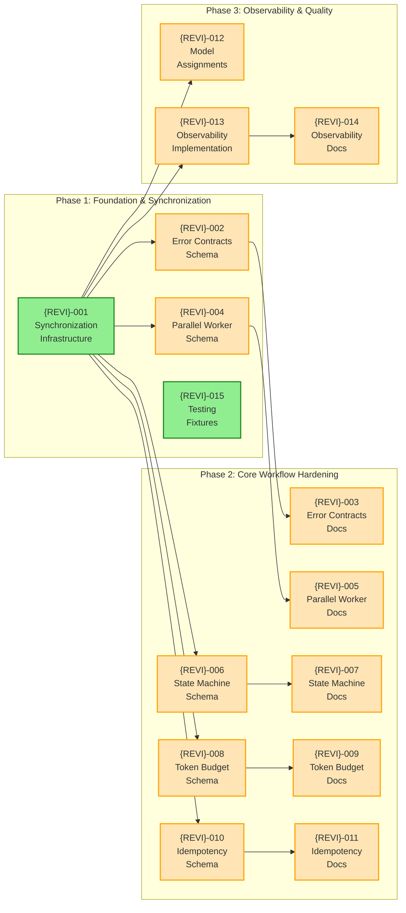

# REVI — Story Roadmap

Visual representation of story dependencies and execution order for workflow hardening.

---

## Dependency Graph

Shows which stories block downstream work.



**Legend:** Green = Ready to Start | Orange = Blocked by Dependencies | Blue = Completed

---

## Completion Order (Gantt View)

```mermaid
gantt
    title REVI Story Execution Order
    dateFormat X
    axisFormat %s

    section Phase 1
    REVI-001 Sync Infrastructure    :s001, 0, 1
    REVI-015 Test Fixtures          :s015, 0, 1
    REVI-002 Error Schema           :s002, after s001, 1
    REVI-004 Parallel Schema        :s004, after s001, 1

    section Phase 1 Cont'd
    REVI-006 State Machine Schema   :s006, after s001, 1
    REVI-008 Token Budget Schema    :s008, after s001, 1
    REVI-010 Idempotency Schema     :s010, after s001, 1
    REVI-012 Model Assignments      :s012, after s001, 1
    REVI-013 Observability Impl     :s013, after s001, 1

    section Phase 2
    REVI-003 Error Docs             :s003, after s002, 1
    REVI-005 Parallel Docs          :s005, after s004, 1
    REVI-007 State Machine Docs     :s007, after s006, 1
    REVI-009 Token Budget Docs      :s009, after s008, 1
    REVI-011 Idempotency Docs       :s011, after s010, 1

    section Phase 3
    REVI-014 Observability Docs     :s014, after s013, 1
```



---

## Critical Path

The longest chain of dependent stories determines minimum project duration:

```
REVI-001 → REVI-002 → REVI-003
```

**Critical path length:** 3 stories

This path focuses on error contracts, which are foundational for all other hardening work.

---

## Parallel Opportunities

| Group | Stories | Count | After | Notes |
|-------|---------|-------|-------|-------|
| **Group 1** | REVI-001, REVI-015 | 2 | — (start) | Foundation + testing fixtures (independent) |
| **Group 2** | REVI-002, REVI-004, REVI-006, REVI-008, REVI-010, REVI-012, REVI-013 | 7 | Group 1 | All LangGraph schemas can run in parallel after sync |
| **Group 3** | REVI-003, REVI-005, REVI-007, REVI-009, REVI-011 | 5 | Group 2 | Claude documentation stories after their schemas |
| **Group 4** | REVI-014 | 1 | Group 3 | Final observability docs |

**Maximum parallelization:** 7 stories at once (during Group 2)

---

## Risk Indicators

| Story | Risk Level | Reason | Mitigation |
|-------|------------|--------|------------|
| REVI-001 | **High** | Foundation for all others; requires parsing and sync automation | Thorough testing of pre-commit hook before rollout |
| REVI-002 | **High** | Error contracts affect entire system; backward compatibility critical | Test all changes on WRKF-000 harness; ensure contracts are additive |
| REVI-003 | **High** | Updates 10+ command files; risk of inconsistency | Systematic review of all command files; use linter |
| REVI-008 | **Medium** | Token budget enforcement may block legitimate workflows | Start with 'warning' level; allow per-story multiplier overrides |
| REVI-009 | **Medium** | /token-log skill used across many phases | Ensure backward compatibility with existing phases |
| REVI-010 | **Medium** | Lock timeout detection and stale lock handling | Test concurrent execution scenarios thoroughly |
| REVI-012 | **Medium** | Model assignment centralization may reveal inconsistencies | Audit all 20+ agent files first; document migration |
| REVI-004 | **Low** | Parallel semantics must be clearly defined | Document 5/6 vs 4/6 pass scenarios explicitly |
| REVI-005 | **Low** | Complex command; documentation needed | Focus on 6-agent aggregation logic clarity |
| REVI-006 | **Low** | State machine is large but well-defined | Ensure all 17 statuses and transitions covered |
| REVI-007 | **Low** | Large table but straightforward documentation | Use markdown linter; test readability |
| REVI-011 | **Low** | Each command has different idempotency behavior | Document all 7+ commands with clear examples |
| REVI-013 | **Low** | Trace format must be parseable | Test JSONL output with standard tools |
| REVI-014 | **Low** | Straightforward documentation | Include example trace events and metrics |
| REVI-015 | **Low** | Test fixtures and guidance | Define 'dry-run' semantics clearly |

---

## Swimlane View (by Domain)

```
Timeline:
├─ Phase 1: Foundation [REVI-001 ... in parallel ... REVI-015]
│
├─ Phase 1 Extensions: [REVI-002,004,006,008,010,012,013 in parallel]
│  └─ Error Contracts: REVI-002
│  └─ Parallel Workers: REVI-004
│  └─ State Machine: REVI-006
│  └─ Token Budget: REVI-008
│  └─ Idempotency: REVI-010
│  └─ Model Assignments: REVI-012
│  └─ Observability: REVI-013
│
├─ Phase 2: Documentation [REVI-003,005,007,009,011 in parallel]
│  └─ Error Docs: REVI-003 (after REVI-002)
│  └─ Parallel Docs: REVI-005 (after REVI-004)
│  └─ State Machine Docs: REVI-007 (after REVI-006)
│  └─ Token Budget Docs: REVI-009 (after REVI-008)
│  └─ Idempotency Docs: REVI-011 (after REVI-010)
│
└─ Phase 3: Final Polish [REVI-014]
   └─ Observability Docs: REVI-014 (after REVI-013)
```

---

## Quick Reference

| Metric | Value |
|--------|-------|
| **Total Stories** | 15 |
| **Ready to Start** | 2 (REVI-001, REVI-015) |
| **Critical Path Length** | 3 stories (REVI-001 → REVI-002 → REVI-003) |
| **Max Parallel** | 7 stories (during Phase 1 extensions) |
| **Phases** | 3 |
| **High-Risk Stories** | 3 (REVI-001, REVI-002, REVI-003) |
| **Medium-Risk Stories** | 6 (REVI-008, REVI-009, REVI-010, REVI-012, REVI-004, REVI-005) |
| **Low-Risk Stories** | 6 (remaining) |

---

## Key Synchronization Points

To prevent drift between Claude workflow and LangGraph orchestrator:

1. **Pre-commit Hook** (REVI-001): Validates sync before any commit
2. **CI Check** (REVI-001): Runs on every PR to detect schema drift
3. **Doc Generation** (REVI-001): Auto-generates markdown tables from Zod schemas
4. **Centralized Schemas** (REVI-002, REVI-004, REVI-006, REVI-008, REVI-010): All TypeScript schemas in orchestrator
5. **Documented Contracts** (REVI-003, REVI-005, REVI-007, REVI-009, REVI-011): All contracts documented with schema references

---

## Update Log

| Date | Change | Stories Affected |
|------|--------|------------------|
| 2026-02-01 | Initial roadmap generation | All 15 stories |
