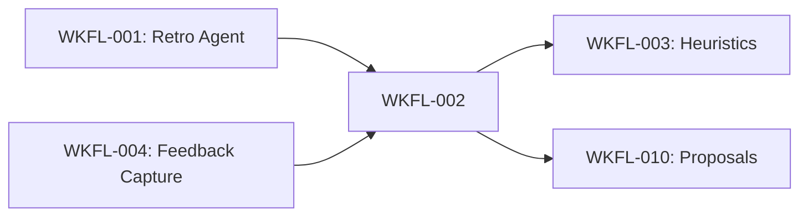

# Story Seed: WKFL-002

## Reality Context

### Baseline Status
- Loaded: No
- Date: N/A
- Gaps: No active baseline exists for workflow-learning epic. This is expected for new meta-system features.

### Relevant Existing Features

| Feature | Status | Relevance |
|---------|--------|-----------|
| Knowledge Base MCP Server | Active | WKFL-002 will write calibration data via kb_add |
| Verification YAML Format | Active | Source of finding IDs and stated confidence levels |
| Agent Frontmatter with kb_tools | Active | Agents declare kb_search/kb_add_lesson/kb_add_decision usage |
| Severity Calibration Framework | Active | Defines confidence levels (high/medium/low) in `.claude/agents/_shared/severity-calibration.md` |

### Active In-Progress Work

| Story | Phase | Overlap Risk |
|-------|-------|--------------|
| None | N/A | No active workflow-learning stories in progress |

### Constraints to Respect

**From Story Dependencies:**
- WKFL-002 depends on WKFL-001 (Meta-Learning Loop) for outcome data
- WKFL-002 depends on WKFL-004 (Human Feedback Capture) for feedback data
- Both dependencies are `pending` status, so WKFL-002 cannot start until they complete

**From Architecture:**
- KB schema uses Zod-first types (all schema in `apps/api/knowledge-base/src/__types__/index.ts`)
- MCP tools must follow tool-handler pattern with logging, error sanitization, performance measurement
- New entry types require updating `KnowledgeEntryTypeSchema` enum

---

## Retrieved Context

### Related KB Infrastructure

**Database Schema (`apps/api/knowledge-base/src/db/schema.ts`):**
- `knowledgeEntries` table with flexible schema
- `entryType` field supports: 'note', 'decision', 'constraint', 'runbook', 'lesson'
- `tags` field as TEXT[] for categorization
- `storyId` field for linking to stories
- Full JSONB support for flexible metadata

**Existing Entry Types:**
```typescript
KnowledgeEntryTypeSchema = z.enum([
  'note',
  'decision',
  'constraint',
  'runbook',
  'lesson',
])
```

**MCP Tool Handlers (`apps/api/knowledge-base/src/mcp-server/tool-handlers.ts`):**
- Pattern: thin wrapper around CRUD operations
- Includes logging, correlation IDs, error sanitization
- Access control via `checkAccess(agentRole, toolName)`
- Performance measurement and timeouts

### Related Agent Patterns

**Verification Agents with Confidence:**
- `code-review-security.agent.md` - Uses kb_search before review, kb_add_lesson after
- `qa.agent.md` - Includes confidence levels in findings
- All review agents follow severity calibration framework in `_shared/severity-calibration.md`

**Severity Calibration Framework:**
```yaml
Severity Levels: Critical | High | Medium | Low
Confidence Modifiers:
  - Q1 (provable): YES (+0) | MAYBE (-1, confidence: medium) | NO (cannot be Critical/High, confidence: low)
  - Confidence appears in finding metadata
```

**VERIFICATION.yaml Structure (from WRKF-1021):**
```yaml
findings:
  - id: SEC-042           # Finding ID
    agent: code-review-security
    severity: high
    confidence: high      # Stated confidence level
    description: "..."
```

### Reuse Candidates

**Must Reuse:**
- KB schema extension pattern (add new entry type or use existing 'lesson' type)
- `kb_add` tool for writing calibration entries
- `kb_search` with tag filtering for querying calibration history
- Zod schema validation for all inputs

**Patterns to Follow:**
- Tool handler pattern from existing MCP tools
- Agent frontmatter with `kb_tools: [kb_search, kb_add_calibration]`
- YAML output format for reports (consistent with VERIFICATION.yaml)

---

## Knowledge Context

### Lessons Learned

**From KB Infrastructure Stories:**
- **[KNOW-0051]** MCP tools must include Zod schemas in `tool-schemas.ts`
  - *Applies because*: New `/calibration-report` command needs schema validation

- **[KNOW-0052]** Search tools require correlation IDs and timeout handling
  - *Applies because*: Calibration queries may search large volumes of verification data

- **[KNOW-006]** Bulk import pattern for batch KB writes
  - *Applies because*: Weekly calibration job may write many entries at once

### Blockers to Avoid (from past stories)

- Don't create new tables without migration strategy (use existing `knowledge_entries` with new entryType)
- Don't bypass Zod validation (all inputs must validate)
- Don't hardcode agent names (query dynamically from VERIFICATION.yaml)

### Architecture Decisions (ADRs)

No ADRs directly constrain this story. ADR-LOG.md is for application architecture, not workflow tooling.

### Patterns to Follow

**From Severity Calibration Framework (`.claude/agents/_shared/severity-calibration.md`):**
- Confidence levels: high, medium, low
- Calibration questions (Q1-Q5) for severity modifiers
- "Stated confidence" vs "actual outcome" tracking

**From VERIFICATION.yaml Format:**
```yaml
findings:
  - id: "{AGENT}-{NUM}"
    agent: "agent-name"
    severity: "critical|high|medium|low"
    confidence: "high|medium|low"  # This is the "stated confidence"
```

**From Feedback Schema (WKFL-004 dependency):**
```yaml
type: feedback
finding_id: SEC-042
feedback_type: false_positive | helpful | missing | severity_wrong
original_severity: high
suggested_severity: medium  # if severity_wrong
```

### Patterns to Avoid

- Don't create standalone tables (extend existing KB schema)
- Don't duplicate severity calibration logic (reuse shared framework)
- Don't hardcode thresholds (make configurable)

---

## Conflict Analysis

No conflicts detected.

---

## Story Seed

### Title
Confidence Calibration

### Description

**Context:**
Agent findings in VERIFICATION.yaml include stated confidence levels (high/medium/low) alongside severity. However, there's currently no feedback loop to validate whether "high confidence" findings are actually correct. This creates calibration drift where agents may over- or under-estimate their confidence.

**Problem:**
Without calibration tracking:
- Agents don't learn from false positives
- "High confidence" loses meaning if frequently wrong
- No data-driven threshold adjustments
- Developer trust erodes when confident findings are incorrect

**Solution Direction:**
Build a calibration tracking system that:
1. Links finding IDs to feedback outcomes (from WKFL-004)
2. Computes accuracy per agent per confidence level
3. Generates weekly calibration reports
4. Produces actionable threshold adjustment recommendations

This enables continuous improvement of agent confidence calibration based on real outcomes.

### Initial Acceptance Criteria

- [ ] AC-1: Calibration entry schema captures agent, finding_id, stated_confidence, actual_outcome
  - Fields: agent_id, finding_id, story_id, stated_confidence (high|medium|low), actual_outcome (correct|false_positive|severity_wrong), timestamp
  - Stored in KB via kb_add with tags: ['calibration', 'agent:{name}', 'confidence:{level}']

- [ ] AC-2: Calibration data source integrates with WKFL-004 feedback
  - When feedback is captured via `/feedback`, also write calibration entry
  - Outcome mapping: false_positive → 'false_positive', severity_wrong → 'severity_wrong', helpful → 'correct'

- [ ] AC-3: confidence-calibrator.agent.md analyzes accuracy per agent
  - Query KB for calibration entries grouped by (agent_id, stated_confidence)
  - Compute: accuracy = correct_predictions / total_predictions
  - Minimum 5 samples before reporting accuracy

- [ ] AC-4: Alert when "high" confidence accuracy drops below 90%
  - For each agent with stated_confidence='high'
  - If accuracy < 0.90 and sample_size >= 10, flag in report

- [ ] AC-5: Generate threshold adjustment recommendations
  - Recommendations format: "Agent {name}: Tighten high threshold from {current} to {proposed}"
  - Proposals based on accuracy trends, not auto-applied
  - Output to CALIBRATION-{date}.yaml

- [ ] AC-6: /calibration-report command generates weekly report
  - Command structure: `/calibration-report [--since=YYYY-MM-DD] [--agent=NAME]`
  - Default: last 7 days, all agents
  - Output: CALIBRATION-{date}.yaml with accuracy scores and recommendations

- [ ] AC-7: Calibration agent uses haiku model
  - Frontmatter: `model: haiku`, `type: worker`
  - KB tools: `kb_search` (read calibration entries), `kb_add_lesson` (if systemic issues found)

### Non-Goals

- Auto-applying threshold changes (WKFL-003 handles this)
- Real-time calibration during review (post-hoc analysis only)
- Cross-project calibration (single project scope)
- Pattern mining (WKFL-006 handles this)

### Reuse Plan

**Components:**
- Existing `knowledge_entries` table (no new tables)
- `kb_add` for writing calibration entries
- `kb_search` with tag filtering for queries

**Patterns:**
- Agent frontmatter with kb_tools declaration
- YAML output format for reports
- Zod-first schema validation

**Packages:**
- `apps/api/knowledge-base` for schema/tools
- `.claude/agents/` for calibrator agent
- `.claude/commands/` for /calibration-report

---

## Recommendations for Subsequent Phases

### For Test Plan Writer

**Key Testing Areas:**
1. Calibration entry creation with all field combinations
2. Accuracy calculation edge cases (0 samples, 100% accuracy, etc.)
3. Threshold recommendation logic (accuracy boundaries)
4. Query performance with large calibration datasets
5. Integration with WKFL-004 feedback entries

**Test Data Requirements:**
- Mock VERIFICATION.yaml with varied confidence levels
- Mock feedback entries with different outcomes
- Calibration entries spanning multiple agents and dates

### For UI/UX Advisor

Not applicable - backend/CLI-only story. No user-facing UI.

### For Dev Feasibility

**Implementation Considerations:**

1. **Schema Strategy:**
   - Option A: New entryType='calibration' in existing knowledge_entries table
   - Option B: Use entryType='lesson' with tags=['calibration']
   - Recommendation: Option A (cleaner separation, easier queries)

2. **Data Flow:**
   - WKFL-004 feedback → calibration entry write
   - Weekly job → query calibrations → compute accuracy → output report
   - Dependency: WKFL-004 must be complete first

3. **Query Performance:**
   - Calibration queries will filter by tags=['calibration', 'agent:{name}']
   - Consider indexing strategy if dataset grows large
   - Initial scope: expect <1000 calibration entries per month

4. **Agent Architecture:**
   - confidence-calibrator.agent.md spawned by /calibration-report command
   - Single-phase: setup → query → analyze → report
   - No sub-agents needed (simple aggregation logic)

5. **Threshold Recommendation Logic:**
   - Requires defining "current threshold" baseline (where stored?)
   - Proposals should be specific: "Raise high from 0.85 to 0.90"
   - Consider: Does each agent have configurable thresholds? Or is this conceptual?

**Potential Blockers:**
- WKFL-001 and WKFL-004 dependencies must complete first
- Need clarity on where "current thresholds" are stored (agent config? hardcoded?)
- Weekly job scheduling mechanism (manual vs automated)

**Effort Estimate:**
- Calibration schema + MCP tools: ~8k tokens
- confidence-calibrator.agent.md: ~15k tokens
- /calibration-report command: ~5k tokens
- Testing and integration: ~12k tokens
- **Total: ~40k tokens** (within 50k budget)

---

## Additional Context

### Dependency Chain



**Blockers:**
- WKFL-001 must produce OUTCOME.yaml with actual vs estimated metrics
- WKFL-004 must provide feedback schema and KB integration

**Enables:**
- WKFL-003 uses calibration data to evolve heuristics
- WKFL-010 uses calibration gaps to generate improvement proposals

### Open Questions for Elaboration

1. **Threshold Storage:** Where are agent confidence thresholds currently defined? Are they in agent frontmatter, config files, or hardcoded?

2. **Outcome Source:** Besides WKFL-004 feedback, should calibration also pull from OUTCOME.yaml (WKFL-001) for "was this finding addressed in the fix?"

3. **Minimum Samples:** Is 5 samples sufficient for reporting accuracy? Should we require 10 for recommendations?

4. **Weekly Job:** Should this be a manual command or an automated cron job? If automated, where does output go?

5. **Cross-Agent Patterns:** Should calibration report identify patterns across multiple agents (e.g., "All security agents over-confident on XSS")?

---

**STORY-SEED COMPLETE**
